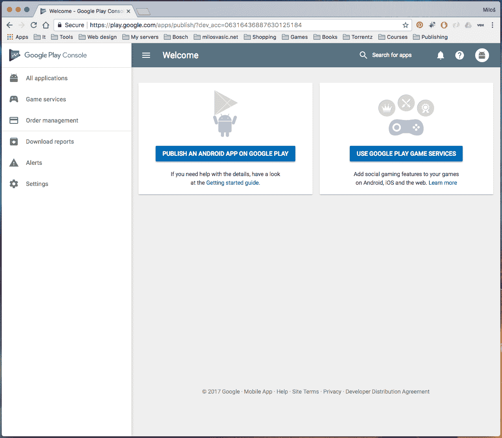
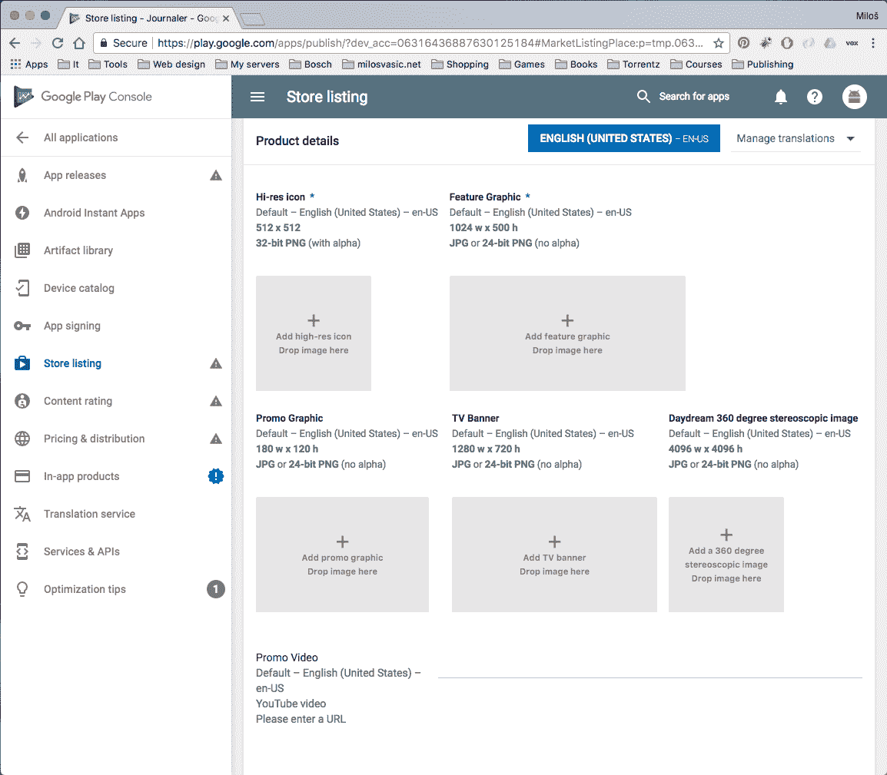
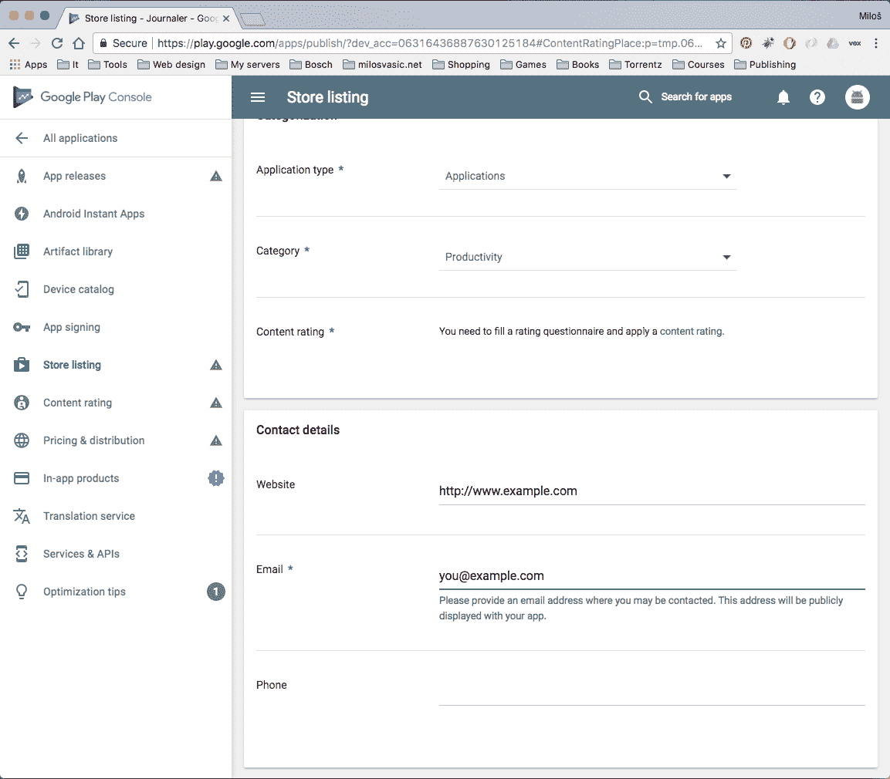
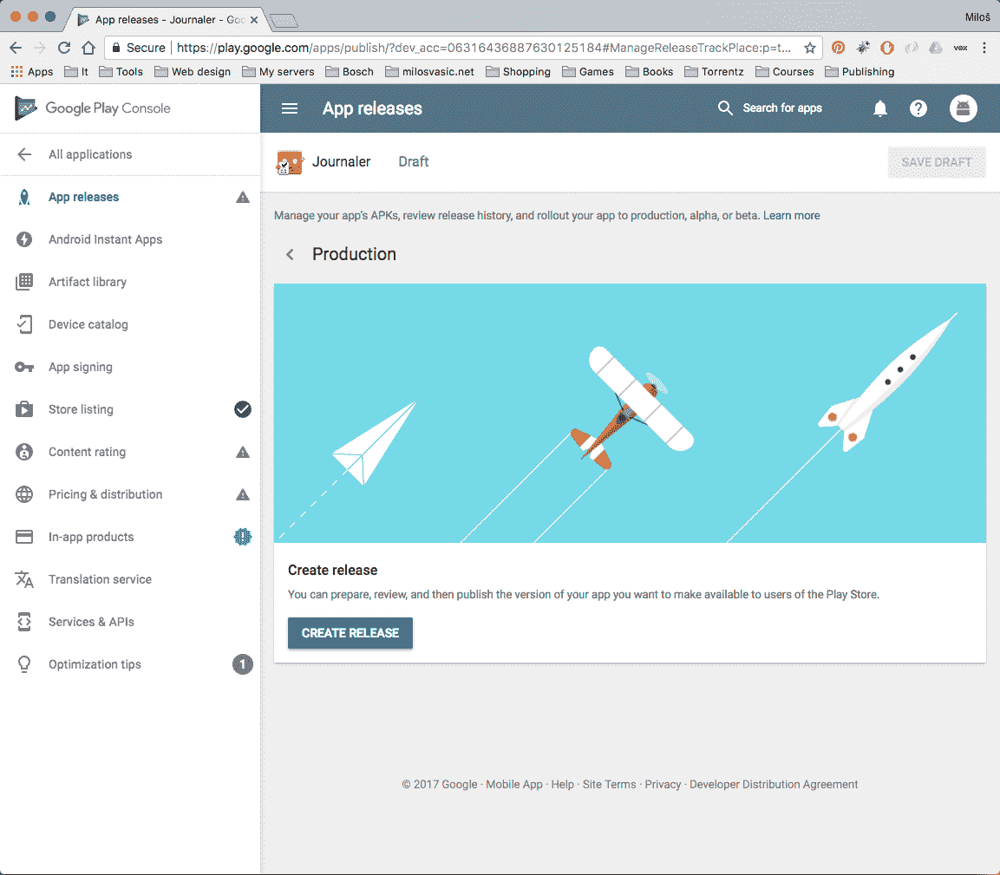
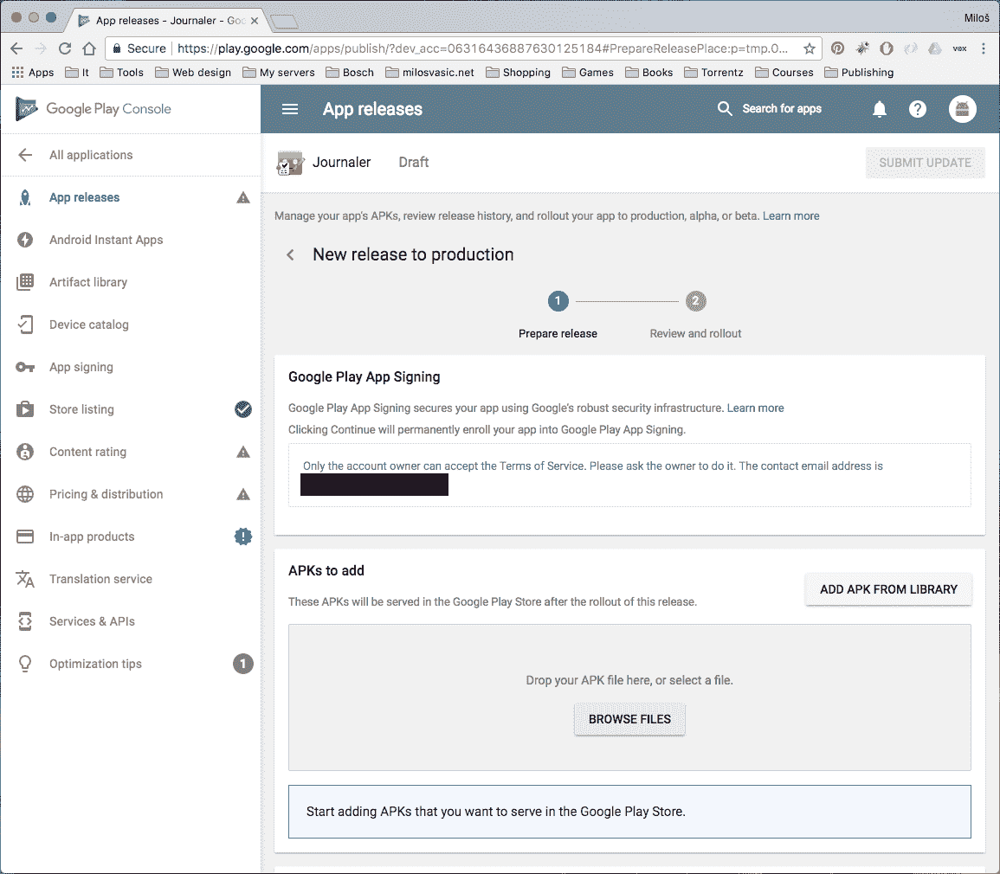
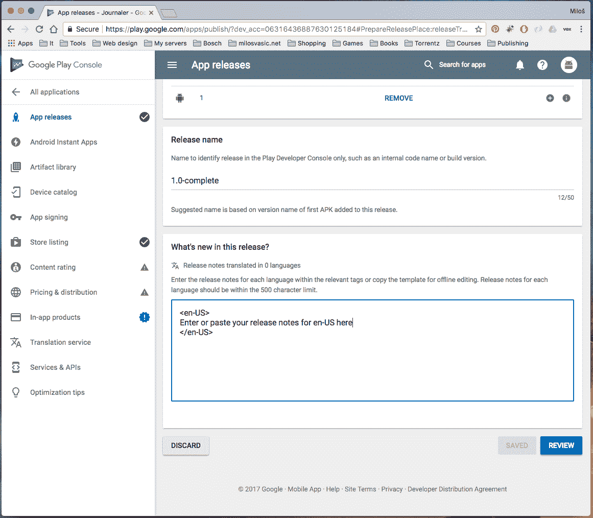
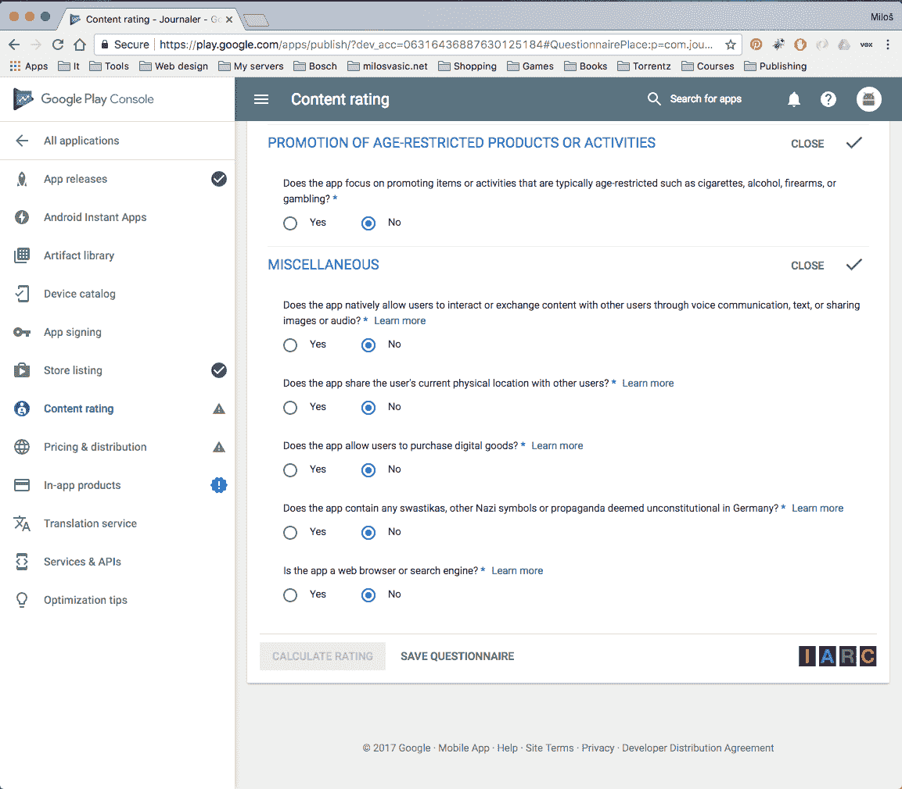

# 部署应用程序

是时候让全世界看到你的作品了。在我们发布它之前，还有一些事情要做。我们将做一些准备，然后最终将我们的应用程序发布到谷歌游戏商店。

在本章中，我们将熟悉以下主题:

*   准备部署
*   代码混淆
*   签署您的申请
*   发布到谷歌游戏

# 准备部署

在我们发布你的申请之前，需要做一些准备工作。首先，删除任何未使用的资源或类。然后，静音你的日志！使用一些主流日志库是很好的做法。您可以围绕`Log`类创建一个包装器，对于每个有条件的日志输出，检查它一定不是`release`构建类型。

如果您还没有将您的发布配置设置为可调试的，请按照以下步骤操作:

```kt
    ... 
    buildTypes { 
      ... 
      release { 
        debuggable false 
      } 
    } 
    ...
```

完成此操作后，再次检查您的清单并清理它。删除任何不再需要的权限。在我们的案例中，我们将删除以下内容:

```kt
    <uses-permission android:name="android.permission.VIBRATE" /> 
```

我们加了，但没用过。我们要做的最后一件事是检查应用程序兼容性。检查最小和最大 SDK 版本是否符合您的设备目标计划。

# 代码混淆

发布过程的下一步是启用代码混淆。打开您的`build.gradle`配置，并按如下方式进行更新:

```kt
    ... 
    buildTypes { 
      ... 
      release { 
        debuggable false 
        minifyEnabled true 
        proguardFiles getDefaultProguardFile('proguard-android.txt'),
         'proguard-rules.pro' 
      } 
    } 
    ... 
```

我们刚刚添加的配置将收缩资源并执行混淆。为了混淆，我们将使用 ProGuard。ProGuard 是一个免费的 Java 类文件收缩器、优化器、混淆器和预验证器。它执行未使用的类、字段、方法和属性的检测。它还优化了字节码！

在大多数情况下，默认的 ProGuard 配置(我们使用的配置)足以删除所有未使用的代码。然而，ProGuard 可能会删除您的应用程序实际需要的代码！为此，您必须定义 ProGuard 配置来保留这些类。打开项目的 ProGuard 配置文件并附加以下内容:

```kt
    -keep public class MyClass 
```

以下是使用某些库时需要添加的 ProGuard 指令列表:

*   蒸馏：

```kt
        -dontwarn retrofit.** 
        -keep class retrofit.** { *; } 
        -keepattributes Signature 
        -keepattributes Exceptions 
```

*   Okhttp3:

```kt
        -keepattributes Signature 
        -keepattributes *Annotation* 
        -keep class okhttp3.** { *; } 
        -keep interface okhttp3.** { *; } 
        -dontwarn okhttp3.** 
        -dontnote okhttp3.** 

        # Okio 
        -keep class sun.misc.Unsafe { *; } 
        -dontwarn java.nio.file.* 
        -dontwarn org.codehaus.mojo.animal_sniffer.IgnoreJRERequirement 
```

*   Gson 说:

```kt
        -keep class sun.misc.Unsafe { *; } 
        -keep class com.google.gson.stream.** { *; } 
```

用这些行更新你的`proguard-rules.pro`文件。

# 签署您的申请

在我们将版本上传到谷歌游戏商店之前的最后一步是生成一个签名的 APK。打开您的项目，然后选择构建|生成签名 APK:


选择主应用程序模块，然后单击下一步继续:


由于我们还没有密钥存储，我们将创建一个新的密钥存储。点击新建...如下所示:


填充数据，然后单击确定。点击下一步，如果需要，输入您的主密码。检查两个签名，选择完整的风格来构建。点击完成:


等到构建完成。我们还将更新我们的`build.gradle`，这样每次我们构建一个版本时都会签署构建:

```kt
    ... 
    android { 
      signingConfigs { 
        release { 
          storeFile file("Releasing/keystore.jks") 
          storePassword "1234567" 
          keyAlias "key0" 
          keyPassword "1234567" 
        } 
      } 
      release { 
        debuggable false 
        minifyEnabled false 
        signingConfig signingConfigs.release 
        proguardFiles getDefaultProguardFile('proguard-android.txt'),
        'proguard-rules.pro' 
      } 
    } 
    ... 
```

如果方便的话，您可以从终端运行构建过程，如下所示:

```kt
$ ./gradlew clean 
$ ./gradlew assembleCompleteRelease 
```

在这个例子中，我们组装了完整应用程序风格的发布版本。

# 发布到谷歌游戏

部署的最后一步是发布 APK 的签名版本。除了 APK，我们还需要提供一些东西:

*   截图-从你的应用程序准备截图。你可以这样做:从安卓工作室日志猫，点击屏幕截图图标(一个小相机图标)。在预览窗口中，单击保存。您将被要求保存您的图像:


*   具有以下规格的高分辨率图标:

32 位 PNG 图像(带 alpha)

尺寸为 512 像素乘 512 像素

1024 K 最大文件大小

*   特征图形(应用程序的主横幅):

24 位的 JPEG 图像或 PNG(没有 alpha！)

尺寸为 1024 像素乘 500 像素

*   如果您将应用程序发布为电视应用程序或电视横幅:

24 位的 JPEG 图像或 PNG(没有 alpha！)

尺寸为 1280 像素 x 720 像素

*   宣传片视频- YouTube 视频(非播放列表)
*   应用程序的文本描述

登录开发者控制台([https://play.google.com/apps/publish](https://play.google.com/apps/publish))。

如果你还没有注册，那就注册吧。它将使您能够发布您的应用程序。主控制台页面显示如下:



我们还没有发布任何应用程序。点击在 GOOGLE PLAY 上发布安卓应用。将出现“创建应用程序”对话框。填写数据并点击创建按钮:


按如下方式填写表格数据:


上传您的图形资产，如下所示:


请看下面的截图:



继续进行应用程序分类:



以联系信息和隐私政策结束:


完成所有必填数据后，滚动回顶部并点击保存草稿按钮。从左侧，现在选择应用程序版本。您将进入应用程序发布屏幕，如下图所示:


在这里，您有以下三个选项:

*   管理生产
*   管理测试版
*   管理 alpha

根据您计划发布的版本，选择最适合您的选项。我们将选择管理生产并点击创建发布按钮，如下所示:



开始填写关于您的版本的数据:



首先，添加你最近生成的 APK。然后继续到页面底部，填写表格的其余部分。完成后，单击查看按钮查看您的应用程序版本:



在我们将版本投入生产之前，单击左侧的内容评级链接，然后单击继续，如下图所示:


填写您的**电子邮件地址**并滚动至页面下方。选择您的类别:


我们选择效用、生产力、沟通或其他；在下一个屏幕上，填写您被询问的信息，如下所示:



保存您的问卷并点击应用评级:


现在切换到定价和分销部分:


该表单易于填充。按照表格，设置你被询问的数据。完成后，单击屏幕顶部的保存草稿按钮。您将看到“准备发布”链接已经出现。点击它:


点击 MANAGE RELEASES，如前面的截图所示。跟随屏幕，直到您到达应用程序发布部分的最后一个屏幕。现在，您可以清楚地看到“开始生产”按钮已启用。点击它，当被询问时，点击确认:


续:


就是这样！您已成功将您的应用程序发布到谷歌游戏商店！

# 摘要

希望你喜欢这本书！这是一次伟大的旅行！我们从零开始，从学习基础开始。然后，我们继续讨论关于安卓的中等、困难和高级话题。这一章让我们对我们想告诉你的关于安卓的故事有了最后的定论。我们做了大量的工作！我们开发了应用程序，并一步一步地经历了整个部署过程。

下一步是什么？好吧，接下来你应该做的是考虑一个你想要构建的应用程序，并开始从头开始制作它。慢慢来。不要操之过急！在开发过程中，你会发现很多我们没有提到的东西。安卓系统非常大！了解整个框架可能需要几年时间。很多开发者并不了解它的每一部分。你不会是唯一一个。继续你的进步，尽可能多地写代码。它会提高你的技能，让你所学的一切成为你的例行公事。不要犹豫！开始行动！祝你好运！