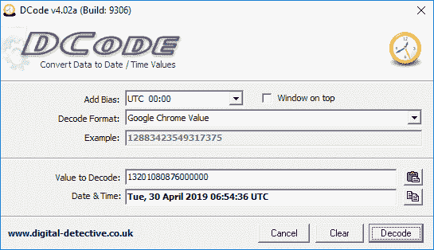
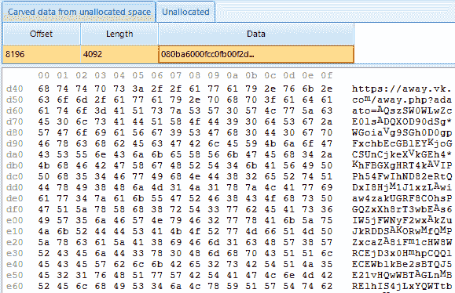
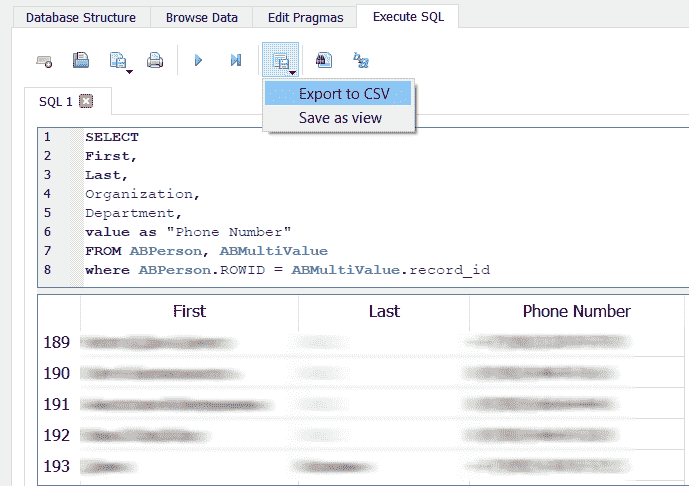
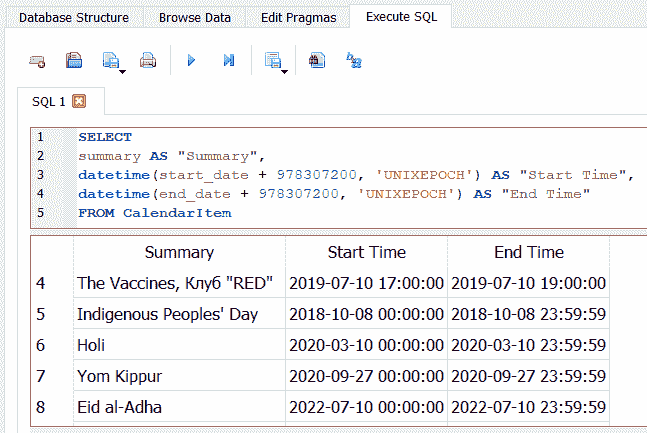
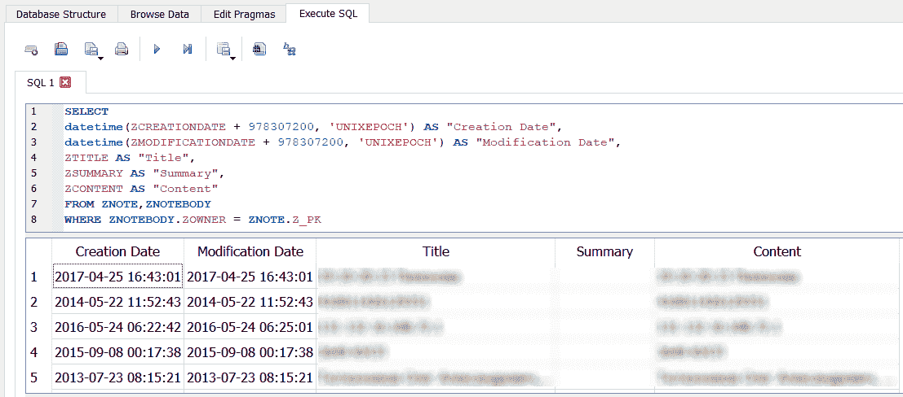
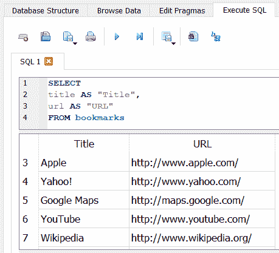
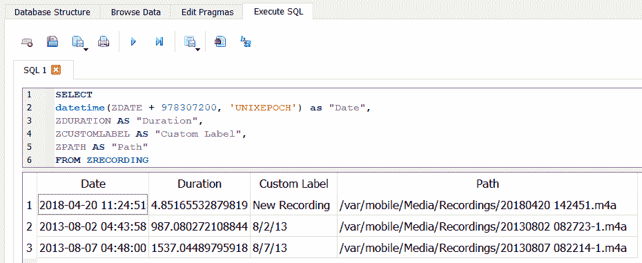
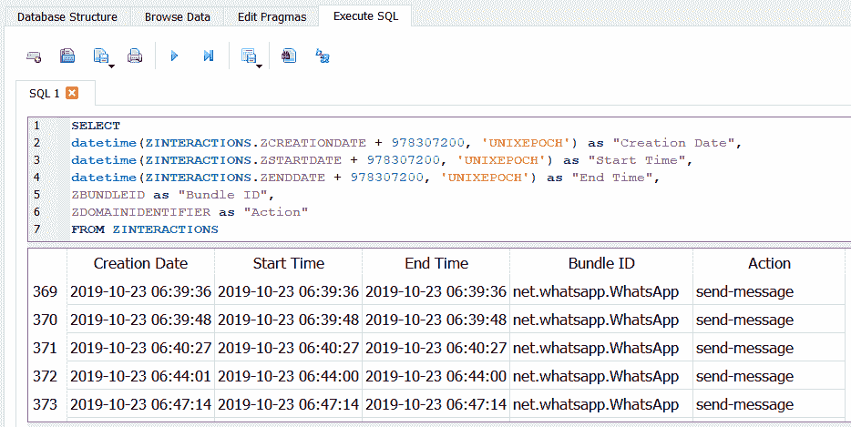
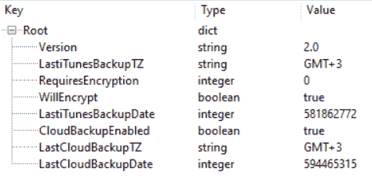

# iOS 数据分析和恢复

iOS 设备取证的一个关键方面是检查和分析获取的数据，以解释证据。在前几章中，您学习了从 iOS 设备获取数据的各种技术。任何类型的采集图像都包含数百个数据文件，这些文件通常由前面章节中描述的工具解析。即使取证工具解析了数据，也可能需要手动分析来发现额外的工件或简单地验证您的发现。

本章将帮助您了解数据是如何存储在 iOS 设备上的，并将带您浏览在每次调查中应该检查的关键工件，以恢复尽可能多的数据。

在本章中，我们将涵盖以下主题:

*   解释 iOS 时间戳
*   使用 SQLite 数据库
*   关键工件–重要的 iOS 数据库文件
*   属性列表
*   其他重要文件
*   恢复已删除的 SQLite 记录

# 解释 iOS 时间戳

在检查数据之前，了解 iOS 设备上使用的不同时间戳格式非常重要。iOS 设备上的时间戳以 *Unix 时间戳*或 *Mac 绝对*T4 时间格式显示。作为审查员，您必须确保工具正确转换时间戳。对原始 SQLite 文件的访问将允许您手动验证这些时间戳。在接下来的几节中，您将学习如何解码每个时间戳格式。

# unix 时间戳

Unix 时间戳是自 1970 年 1 月 1 日午夜开始的 Unix 纪元时间以来经过的秒数。使用苹果工作站上的`date`命令或使用在线 Unix 纪元转换器，如[https://www.epochconverter.com/](https://www.epochconverter.com/)，可以轻松转换 Unix 时间戳。

下面的代码片段显示了`date`命令:

```
$ date -r 1557479897
Fri May 10 12:18:17 MSK 2019
```

您可能还会遇到毫秒或纳秒格式的 Unix 时间戳。这不是什么大问题；有多个在线转换器，如[http://currentmillis.com/](http://currentmillis.com/)，如下图截图所示:


A Unix timestamp in milliseconds converted with http://currentmillis.com/

Unix 纪元是 iOS 设备最常见的格式，但也有其他格式，包括 Mac 绝对时间和 WebKit/Chrome 时间。

# Mac 绝对时间

iOS 设备采用了使用 Mac 绝对时间搭配 iOS 5。Mac 绝对时间是自 2001 年 1 月 1 日午夜开始的 Mac 纪元时间以来经过的秒数。Unix 纪元时间和 Mac 时间之间的差值正好是 978，307，200 秒。这意味着您可以轻松地将 Mac 时间转换为 Unix 纪元，并使用相同的方法最终将其转换为人类可读的时间戳。当然也有少数在线转换器，比如[https://www.epochconverter.com/coredata](https://www.epochconverter.com/coredata)，如下图截图所示:


A Mac timestamp converted with https://www.epochconverter.com/coredata

当然，时间戳转换也有离线工具。我们将在下一部分向您介绍其中一个。

# 网络工具包/Chrome 时间

在分析 iOS 应用数据时，尤其是针对谷歌 Chrome、Safari、Opera 等网络浏览器，可能会面临另一种时间戳格式——*WebKit/Chrome time*。这是自 1601 年 1 月 1 日午夜以来的微秒数。这个也有在线转换器:[https://www.epochconverter.com/webkit](https://www.epochconverter.com/webkit)。

If you don't like or don't want to use online converters for some reason, you can also use a free tool: Digital Detective's DCode. This tool can be used to convert timestamps in a number of different formats, including Unix time (both seconds and milliseconds), Mac absolute time, and WebKit/Chrome time, as shown in the following screenshot:



A WebKit/Chrome timestamp converted with DCode

许多商业移动取证套件会很容易地为您自动转换提取的时间戳，但在某些情况下，验证时间戳极其重要，因此您必须清楚地了解时间戳格式。

# 使用 SQLite 数据库

SQLite 是一个开源的进程内库，它实现了一个独立的、零配置的和事务性的 SQL 数据库引擎。这是一个完整的数据库，在一个跨平台文件中包含多个表、触发器和视图。由于 SQLite 可移植、可靠且体积小，它是一种流行的数据库格式，出现在许多移动平台上。

和其他智能手机和平板电脑一样，苹果 iOS 设备大量使用 SQLite 数据库进行数据存储。许多内置应用(如电话、消息、邮件、日历和笔记)将数据存储在 SQLite 数据库中。除此之外，安装在设备上的第三方应用也利用 SQLite 数据库进行数据存储。

SQLite 数据库是使用或不使用文件扩展名创建的。它们通常有`.sqlitedb`或`.db`文件扩展名，但是一些数据库也有其他扩展名。

SQLite 文件中的数据被分解成包含实际数据的表。要访问存储在文件中的数据，您需要一个能够读取它的工具。大多数商用移动取证工具，如贝尔卡索夫证据中心、Magnet AXIOM 和 Cellebrite **通用取证提取设备** ( **UFED** )物理分析仪，都为检查 SQLite 数据库提供支持。如果你没有这些工具，一些好的免费工具如下:

*   **SQLite(DB4S)**的 DB 浏览器:可从[http://sqlitebrowser.org/](http://sqlitebrowser.org/)下载。
*   **SQLite 命令行客户端**:可从[http://www.sqlite.org/](http://www.sqlite.org/)下载。
*   **SQLite studio**([https://SQLite studio . pl](https://sqlitestudio.pl)):这是一个免费的跨平台 SQLite 管理器，支持 Windows 9x/2k/XP/2003/Vista/7/8/10、macOS 和 Linux。
*   **SQLiteSpy** :这是一个免费的**图形用户界面****(GUI)**Windows 工具。可以从 [http](http://www.yunqa.de/delphi/doku.php/products/sqlitespy/index) [下载://www . yun QA . de/Delphi/doku . PHP/products/sqlitespy/index](http://www.yunqa.de/delphi/doku.php/products/sqlitespy/index)。

默认情况下，macOS 包括 SQLite 命令行实用程序(`sqlite3`)。该命令行实用程序可用于访问单个文件和对数据库运行 SQL 查询。在接下来的部分中，我们将使用`sqlite3`命令行实用程序和其他 SQLite 工具和浏览器从各种 SQLite 数据库中检索数据。在检索数据之前，您需要学习的基本命令将在以下章节中介绍。

# 连接到数据库

使用免费工具可以手动检查 iOS SQLite 数据库文件。以下是如何在终端中使用本机 Mac 命令检查数据库的示例:

1.  确保您的设备映像以只读方式装载，以防止对原始证据进行更改。
2.  要从命令行连接到 SQLite 数据库，请通过输入数据库文件在终端中运行`sqlite3`命令。这将为您提供一个 SQL 提示，您可以在其中发出 SQL 查询，如以下代码块所示:

```
$ sqlite3 sms.db
SQLite version 3.28.0 2019-04-15 14:49:49
Enter ".help" for usage hints. 
```

3.  要断开连接，请使用`.exit`命令。这将退出 SQLite 客户端并返回终端。

下一节将使用`sqlite3`内置命令引导您完成数据库分析。

# 探索 SQLite 特殊命令

一旦连接到数据库，就可以使用许多内置的 SQLite 命令，这些命令被称为*点命令*，可以用来从数据库文件中获取信息。

通过在 SQLite 提示符下发出`.help`命令，可以获得特殊命令列表。这些是特定于 SQLite 的命令，它们不需要在末尾使用分号。最常用的点命令包括:

*   `.tables`:这列出了数据库中的所有表。以下截图显示了在`sms.db`数据库中找到的表格列表:


*   `.schema table-name`:显示用于构建表格的`SQL CREATE`语句。下面的截图显示了来自`sms.db`数据库的`handle`表的模式:


*   `.dump table-name`:这将一个表的全部内容转储到 SQL 语句中。下面截图中的例子显示了`sms.db`数据库中`handle`表的转储:


*   `.output file-name`:这将输出重定向到磁盘上的文件，而不是在屏幕上显示。
*   `.headers on`:每当您发出`SELECT`语句时，都会显示列标题。
*   `.help`:显示可用的 SQLite 点命令列表。
*   `.exit`:这将断开与数据库的连接，并退出 SQLite 命令外壳。
*   `.mode`:设置输出模式；可以是`.csv`、HTML、标签等等。

Make sure that there is no space between the SQLite prompt and the dot command; otherwise, the entire command will be ignored.

# 探索标准的 SQL 查询

除了 SQLite 点命令之外，还可以在命令行上向 SQLite 数据库发出标准的 SQL 查询，如`SELECT`、`INSERT`、`ALTER`、`DELETE`。与 SQLite 点命令不同，标准的 SQL 查询期望在命令的末尾有一个分号。

您将检查的大多数数据库将只包含合理数量的记录，因此您可以发出`SELECT *`语句，该语句打印表中包含的所有数据。这将在本章中详细介绍。

# 使用商业工具访问数据库

虽然使用免费工具可以对 iOS SQLite 数据库文件进行手动检查，但大多数检查人员更喜欢在手动检查文件之前提供商业支持。以下是如何使用 SQLite 检查数据库的示例，它包含在 Belkasoft 证据中心中。

要打开和分析数据库，您只需要遵循下面列出的几个简单步骤:

1.  启动 Belkasoft 证据中心，导航到视图| SQLite 查看器，并选择要检查的数据库文件。
2.  选择数据库后，它会立即用 SQLite Viewer 打开，并准备好接受检查，如下图所示:


sms.db database opened with Belkasoft Evidence Center's SQLite Viewer

为什么考官需要用这样的商业观众，而不是免费开源的？例如，这个特定的查看器甚至支持损坏或部分覆盖的 SQLite 数据库。此外，该工具支持从自由列表、**提前写日志** ( **WAL** )和未分配空间中提取数据，如下图所示:



Unallocated space of the database as seen in Belkasoft Evidence Center's SQLite Viewer

当然，也有一些免费的开源工具可用于 SQLite 数据恢复。在接下来的章节中，您将了解到更多关于这些工具的信息。

# 关键工件–重要的 iOS 数据库文件

您根据[第 3 章](03.html) *、从 iOS 设备获取数据、*和[第 4 章](04.html) *、* *从 iOS 备份获取数据、*中的说明提取的文件系统和备份应包含以下对您的调查可能很重要的 SQLite 数据库。如果这些文件没有恢复，请确保您正确获取了 iOS 设备。以下部分中显示的文件是通过逻辑获取从运行 iOS 的设备中提取的。随着苹果在每一个 iOS 版本中向内置应用添加新功能，文件的格式可能会因不同的 iOS 版本而异。

# 通讯录联系人

地址簿包含大量关于所有者个人联系人的信息。除第三方应用外，地址簿包含存储在设备上的所有联系人的联系人条目。通讯录数据库可以在`/HomeDomain/Library/AddressBook.sqlitedb`找到。`AddressBook.sqlitedb`文件包含几个表格，其中以下三个是特别感兴趣的:

*   `ABPerson`:包含每个联系人的姓名、组织、备注等。
*   `ABMultiValue`:包含电话号码、电子邮件地址、网站**统一资源定位器** ( **网址**)以及`ABPerson`表中条目的更多内容。`ABMultiValue`表使用`record_id`文件将联系信息与`ABPerson`表中的`ROWID`相关联。
*   `ABMultiValueLabel`:该表包含标签，用于标识`ABMultiValue`表中存储的信息种类。

`AddressBook.sqlitedb`文件中存储的一些数据可能来自第三方应用。您应该手动检查应用文件夹，以确保所有联系人都已被记录和检查。

虽然以下所有命令都可以在 Mac 上本地运行，但我们将使用 DB4S 来检查 iOS 设备上最常见的数据库。这是一个免费的工具，可以简化流程，并为您提供数据的清晰视图。数据库加载后，可以起草查询，检查与自己最相关的数据，将通讯录导出到名为`AddressBook.csv`的`.csv`文件中，如下图截图所示:



The AddressBook.sqlitedb file in DB4S

在前面的截图中，您可以看到建议的查询来解析来自`ABPerson`和`ABMultiValue`表的数据。

# 通讯簿图像

除了地址簿的数据之外，每个联系人都可能包含与之关联的图像。每当用户收到来自特定联系人的来电时，该图像都会显示在屏幕上。这些图像可以由能够访问设备上联系人的第三方应用创建。通常，联系人会链接到第三方应用的个人资料照片。地址簿图像数据库可以在`/HomeDomain/Library/AddressBook/AddressBookImages.sqlitedb`找到。

地址簿图像可以手动解析，但是使用商业软件使这个过程更加实用。大多数免费和商业工具将提供对地址簿图像的访问。但是，有些工具不会在图形和联系人之间建立链接，这可能需要一些手动重建。有时，免费解决方案在解析来自 iOS 设备的简单数据时效果最好。接下来，我们将检查 iExplorer 中的地址簿图像，它在[第 4 章](04.html)、*从 iOS 备份中获取数据*中介绍。

在下面截图中的示例中，iExplorer 自动将联系人数据与图像进行匹配:


Examining address book images in iExplorer

相同的缩略图可以在`data`列的`ABThumbnailImage`表中找到。您可以使用`AddressBookImages.sqlitedb`的`ABThumbnailImage`表中的`record_id`列和`AddressBook.sqlitedb`的`ABPerson`表中的`ROWID`列手动将照片与联系人进行匹配。

# 通话记录

用户拨打、未接和接听的电话或 FaceTime 呼叫会与其他元数据(如呼叫持续时间、日期和时间)一起记录在呼叫历史记录中。通话历史数据库可以在`/HomeDomain/Library/CallHistoryDB/CallHistory.storedata`找到。`CallHistory.storedata`文件是在 iOS 8 中引入的，目前正在编写时使用(iOS 13.2)。

`CallHistory.storedata`数据库中的`ZCALLRECORD`表包含呼叫历史。需要注意的是，活动数据库中只能存储有限数量的调用。仅仅因为数据库在需要空间时删除了最旧的记录，并不意味着这些数据被删除。它只是在 SQLite 数据库文件的自由页面中，可以使用取证工具或手动恢复。`ZCALLRECORD`表中最重要的列如下:

*   `ZDATE`:此列包含 Mac 绝对时间格式的通话时间戳。
*   `ZDURATION`:此栏包含通话时长。
*   `ZLOCATION`:此栏包含电话号码的位置。
*   `ZADDRESS`:此栏包含电话号码。
*   `ZSERVICE_PROVIDER`:此栏包含服务提供商，例如电话、WhatsApp、Telegram 等。

您可以在 DB4S 中运行以下查询来解析呼叫历史。之后可以导出到`.csv`文件，如下图截图所示:


Examining CallHistory.storedata in DB4S

这一次，查询非常简单，因为所有感兴趣的列都在同一个表中。请注意，我们使用`datetime`将 Mac 绝对时间戳转换为人类可读的日期。

# 短消息服务消息

短信数据库包含设备发送和接收的文本和多媒体消息，以及远程方的电话号码、日期和时间以及其他运营商信息。从 iOS 5 开始，iMessage 数据也存储在短信数据库中。iMessage 允许用户通过蜂窝或 Wi-Fi 网络向其他 iOS 或 macOS 用户发送短信和**多媒体消息服务** ( **彩信**)，从而提供了短信的替代方式。短信数据库可以在`/HomeDomain/Library/SMS/sms.db`找到。

您可以在 DB4S 中运行以下查询来解析短信。之后可以导出到`.csv`文件，如下图截图所示:


Examining sms.db in DB4S

还有一个有趣的子目录可以在`/HomeDomain/Library/SMS/` — `Drafts`找到。里面有更多的子文件夹，每个都包含一个`message.plist`文件。每个文件都是一个属性列表，其中包含用户开始键入但没有发送的草稿消息。在接下来的部分中，您将了解更多关于属性列表的信息。

# 日历事件

用户手动创建或使用邮件应用或其他第三方应用同步的日历事件存储在`Calendar`数据库中。`Calendar`数据库可以在`/HomeDomain/Library/Calendar/Calendar.sqlitedb`找到。

`Calendar.sqlitedb`文件中的`CalendarItem`表包含日历事件摘要、描述、开始日期、结束日期等。您可以在 DB4S 中运行以下查询来解析日历，如下图所示:



Examining calendar.sqlitedb in DB4S

如您所见，`CalendarItem`表以 Mac 绝对时间格式存储日期，因此我们在`datetime`功能的帮助下添加了`978307200`来显示实际时间戳。

# 笔记

`Notes`数据库包含用户使用设备内置的`Notes`应用创建的笔记。`Notes`是最简单的应用，往往包含最敏感和机密的信息。`Notes`数据库可以在`/HomeDomain/Library/Notes/notes.sqlite`找到。

`notes.sqlite`文件中的`ZNOTE`和`ZNOTEBODY`表包含每个笔记的标题、内容、创建日期、修改日期等。您可以运行以下查询来解析`Notes`数据库:



Examining notes in DB4S

这个查询合并了两个表中的数据，所以我们使用`ZNOTEBODY`中的`ZOWNER`、`ZNOTE`中的`Z_PK`和一个`WHERE`子句来完成。

# Safari 书签和历史记录

iOS 设备上使用的 Safari 浏览器允许用户为自己喜欢的网站添加书签。`Bookmarks`数据库可以在`/HomeDomain/Library/Safari/Bookmarks.db`找到。书签数据可以通过一个非常简单的查询提取出来，如下图所示:



Examining bookmarks in DB4S

浏览历史可以在`History.db`中找到，在`/HomeDomain/Library/Safari/`处。关于被访问网站最重要的信息可以从`history_items`和`history_visits`表中提取，如下图所示:


Examining history in DB4S

除了 Safari，其他浏览器也可以用来在 iOS 设备上存储数据。出于这个原因，我们建议使用一个工具来解析互联网历史，以确保数据不会被忽视。解决这一任务的好的取证工具是磁铁取证公司的 AXIOM、Cellebrite 公司的物理分析仪以及其他一些工具。

# 语音信箱

`Voicemail`数据库包含存储在设备上的每个语音邮件的元数据，包括发送者的电话号码、回拨号码、时间戳和消息持续时间等。语音邮件录音存储为**自适应多速率** ( **AMR** )音频文件，可由支持 AMR 编解码器的任何媒体播放器(例如，QuickTime Player)播放。`Voicemail`数据库可以在`/HomeDomain/Library/Voicemail/voicemail.db`下找到。

# 记录

`Recordings `数据库包含存储在设备上的每个记录的元数据，包括时间戳、持续时间、在设备上的位置等。数据库可以在`/MediaDomain/Media/Recordings`找到。元数据可以通过如下截图所示的查询提取:



Examining recordings in DB4S

正如您在前面的截图中所看到的，带有录音的实际文件存储在同一个目录中。

# 设备交互

有一个 SQLite 数据库，记录用户如何与不同的应用交互。这个数据库叫做`interactionC.db`，位于`/HomeDomain/Library/CoreDuet/People`。`ZINTERACTIONS`表包含用户是否阅读消息、发送消息、执行呼叫等信息。您可以使用下面屏幕截图中显示的查询从表中提取这些信息:



Examining interactions in DB4S

此外，请确保您检查了`ZCONTACTS`表—如果适用，该表包含参与用户与设备交互的联系人的信息。

# 电话号码

通过分析位于`/WirelessDomain/Library/Databases`的`CellularUsage.db`文件，您可以获得用户使用的所有电话号码的信息，即使这些号码更换了电话并从备份中恢复。提取这些数据的查询如下图所示:


Extracting phone numbers

可以看到，不仅有电话号码可用，还有**用户识别模块** ( **SIM** )卡的**集成电路卡识别符** ( **ICCID** )。

# 属性列表

属性列表，通常称为`plist`，是一种结构化数据格式，用于存储、组织和访问 iOS 设备和 macOS 设备上的各种类型的数据。`plist`文件是二进制格式，可以使用属性列表编辑器查看，属性列表编辑器能够读取二进制格式或将二进制格式转换为**美国信息交换标准代码** ( **ASCII** )格式。

`Plist`文件可能有也可能没有`.plist`文件扩展名。要访问存储在这些文件中的数据，您需要一个能够读取它们的工具。一些好的免费工具包括:

*   plist Editor Pro，可从[http://www.icopybot.com/plist-editor.htm](http://www.icopybot.com/plist-editor.htm)下载。
*   macOS 上的`plutil`命令行实用程序。

可以使用 Xcode 查看`plist`文件。默认情况下，macOS 包括`plutil`命令行实用程序。这个命令行工具可以很容易地将二进制格式的文件转换成人类可读的文件。除此之外，大多数商业取证工具都支持解析`plist`文件。

以下截图显示了`com.apple.mobile.ldbackup.plist`文件:



The com.apple.mobile.ldbackup.plist in plist Editor Pro

如您所见，这个`plist`揭示了上次本地和云备份的日期(当然是在 Mac 绝对时间内)，创建它的时区，以及备份被加密的事实。

# 重要 plist 文件

您在[第 3 章](03.html)、*从 iOS 设备获取数据、*和[第 4 章](04.html)、*从 iOS 备份获取数据、*中提取的原始磁盘映像或备份应包含以下对调查很重要的`plist`文件。显示的文件是从 iOS 13.2 设备备份中提取的。文件位置可能因您的 iOS 版本而异。

以下是包含可能与您的调查相关的数据的`plist`文件:

| **plist 文件** | **描述** |
| `/HomeDomain/Library/Preferences/com.apple.commcenter.shared.plist` | 包含正在使用的电话号码 |
| `/HomeDomain/Library/Preferences/com.apple.identityservices.idstatuscache.plist` | 包含用于苹果标识的电子邮件地址的信息，以及用户通过 FaceTime 或 iMessage 使用该标识与之交互的个人的电话号码 |
| `/HomeDomain/Library/Preferences/com.apple.mobile.ldbackup.plist` | 包含最近一次 iTunes 和 iCloud 备份的时间戳、最近一次 iTunes 备份的时区以及备份是否加密 |
| `/HomeDomain/Library/Preferences/com.apple.MobileBackup.DemotedApps.plist` | 包含操作系统自动卸载的未使用应用列表 |
| `/HomeDomain/Library/Preferences/com.apple.mobilephone.speeddial.plist` | 包含用户最喜欢的联系人列表，包括他们的姓名和电话号码 |
| `/HomeDomain/Library/Preferences/com.apple.preferences.datetime.plist` | 包含用户设置的时区信息 |
| `/RootDomain/Library/Caches/locationd/clients.plist` | 包含使用位置服务的应用列表 |
| `/RootDomain/Library/Preferences/com.apple.MobileBackup.plist` | 包含上次从备份恢复的信息，包括恢复开始日期、文件传输持续时间、传输的文件数量、源设备**唯一设备标识符** ( **UDID** )等 |
| `/SystemPreferencesDomain/SystemConfiguration/com.apple.mobilegestalt.plist` | 包含用户分配的设备名称 |
| `/SystemPreferencesDomain/SystemConfiguration/com.apple.wifi.plist` | 包含有关设备所有者使用的无线接入点的信息 |
| `/WirelessDomain/Library/Preferences/com.apple.commcenter.plist` | 包含设备电话号码、网络运营商、ICCIDs 和**国际** **移动** **用户** **身份** ( **IMSIs** )的信息 |

当然，`plist`文件不像 SQLite 数据库包含那么多信息，但是它们在你的法医检查中仍然有用。接下来，我们将看看其他一些可能也有用的文件。

# 其他重要文件

除了 SQLite 和`plist`文件，其他几个位置可能包含对调查有价值的信息。

其他来源包括:

*   本地词典
*   照片
*   拇指甲
*   壁纸
*   下载的第三方应用

让我们看看他们每个人。

# 本地词典

设备用户添加到词典中的单词列表存储在位于`/KeyboardDomain/Library/Keyboard/`的`LocalDictionary`明文文件中。由于文件是明文，您可以使用自己喜欢的文本编辑器。

# 照片

照片存储在位于`/CameraRollDomain/Media/DCIM`的目录中，其中包含使用设备内置相机拍摄的照片、截图、自拍、照片流、最近删除的照片以及附带的缩略图。一些第三方应用也将存储在这个目录中拍摄的照片。存储在`DCIM`文件夹中的每张照片都包含**可交换图像文件格式** ( **EXIF** )数据。`EXIF`照片中存储的数据可以使用`ExifTool`提取，可以从[https://sno.phy.queensu.ca/~phil/exiftool/](https://sno.phy.queensu.ca/~phil/exiftool/)下载。`EXIF`如果用户在 iOS 设备上启用了位置权限，当照片被标记上用户的地理位置时，数据可能包含地理信息。

# 拇指甲

与照片相关的重要工件的另一个来源是`ithmb`文件。你可以在`/CameraRollDomain/Media/PhotoData/Thumbnails`找到这些文件。这些文件不仅包含设备上实际照片的缩略图，还包含已删除照片的缩略图。当然还有解析这类文件的工具`iThmb Converter`，可以从[http://www.ithmbconverter.com/en/download/](http://www.ithmbconverter.com/en/download/)下载，如下图截图所示:


Examining 3304.ithmb with iThmb Converter

由于这些文件可能包含已删除照片的缩略图，法医不应忽视它们。更重要的是，其中一些包含相当大的缩略图，所以很清楚图片是什么。

# 壁纸

当前为 iOS 设备设置的背景壁纸可以从在`/HomeDomain/Library/SpringBoard`找到的`LockBackgroundThumbnail.jpg`和`LockBackgroundThumbnaildark.jpg`文件中恢复。

壁纸图片可能包含关于用户的识别信息，这些信息可能有助于失踪人员的案件，或者可以在从盗窃调查中恢复的 iOS 设备上找到。

# 下载的第三方应用

从应用商店下载和安装的第三方应用(包括脸书、WhatsApp、Viber、Threema、Tango、Skype 和 Gmail 等应用)包含大量对调查有用的信息。一些第三方应用使用 Base64 编码，为了查看和加密，需要对其进行转换。加密数据库文件的应用可能会阻止您访问驻留在表中的数据。基于应用和 iOS 版本，这些应用的加密方式各不相同。

为设备上安装在`/private/var/mobile/Containers/Data/Application`目录中的每个应用创建一个子目录，该子目录具有**通用唯一标识符** ( **UUID** )。应用目录中存储的大多数文件都是 SQLite 和`plist`格式。必须检查每个文件的相关性。我们建议在返回并手动运行查询和解析数据之前，尽可能使用贝尔卡索证据中心、Cellebrite UFED 物理分析器、Elcomsoft 电话查看器和 Magnet AXIOM 来快速提取这些工件。

此外，关于已安装应用的信息可以从位于`/HomeDomain/Library/FrontBoard`的`applicationState.db`数据库中收集。这是另一个 SQLite 数据库，可以用审查员选择的适当查看器进行分析。

# 恢复已删除的 SQLite 记录

SQLite 数据库将删除的记录存储在数据库本身中，因此可以通过解析相应的 SQLite 数据库来恢复删除的数据，如联系人、短信、日历、笔记、电子邮件、语音邮件等。如果 SQLite 数据库被清空或碎片整理，恢复已删除数据的可能性极小。这些数据库所需的清理量在很大程度上取决于 iOS 版本、设备和用户在设备上的设置。

一个 SQLite 数据库文件包含一个或多个固定大小的页面，它们只使用一次。SQLite 使用页面的 B 树布局来存储索引和表格内容。B-tree 布局的详细信息可在[https://github . com/NatIONAL LAbs/SqLietzer/blob/master/_ resources/Sqlite _ cutting _ extractAnDroiddata . pdf](https://github.com/NotionalLabs/SQLiteZer/blob/master/_resources/Sqlite_carving_extractAndroidData.pdf)上找到。

商业取证工具提供了从 SQLite 数据库文件中恢复已删除数据的支持，但它们并不总是能恢复所有数据，也不支持从 iOS 设备上的所有数据库中提取数据。建议对每个包含关键工件的数据库进行删除数据检查。本书中已经讨论过的关键工件或数据库应该使用自由解析器、十六进制查看器，甚至您的取证工具来检查，以确定用户是否删除了与调查相关的工件。

要雕刻一个 SQLite 数据库，你可以用原始十六进制检查数据，或者使用由 Mari DeGrazia 开发的免费 Python 脚本`sqliteparse.py`。Python 脚本可以从[https://github.com/mdegrazia/SQlite-Deleted-Records-Parser](https://github.com/mdegrazia/SQlite-Deleted-Records-Parser)下载。

以下示例从`notes.sqlitedb`文件中恢复删除的记录，并将输出转储到`output.txt`文件。该脚本应该适用于从 iOS 设备恢复的所有数据库文件。要验证运行脚本的结果，只需在十六进制查看器中检查数据库，确保没有遗漏任何内容。代码可以在这里看到:

```
$python sqliteparse.py -f notes.sqlitedb -r -o output.txt
```

除此之外，执行数据库文件的`strings`转储还可以显示可能已丢失的已删除记录，如以下命令所示:

```
$strings notes.sqlitedb
```

Should you prefer a GUI, Mari DeGrazia kindly created one and placed it on her GitHub page.

另一个可以用来恢复删除的 SQLite 记录的开源工具是 Undark。可以在这里下载:[http://pldaniels.com/undark/](http://pldaniels.com/undark/)。要使用该工具，请运行以下命令:

```
./undark -i sms.db > sms_database.csv
```

需要注意的是，Undark 没有区分当前数据和已删除数据，因此您将获得全部数据，包括实际数据和已删除数据。

# 摘要

本章介绍了各种数据分析技术，并指定了 iOS 设备文件系统中常见工件的位置。在写这一章的时候，我们的目标是涵盖大多数调查中最受欢迎的文物。显然，不可能涵盖所有这些。我们希望一旦你学会了如何从 SQLite 和`plist`文件中提取数据，直觉和持久性将帮助你解析那些没有涉及到的工件。

请记住，大多数开源和商业工具都能够从常见的数据库文件中提取活动和已删除的数据，如联系人、电话、短信等，但它们通常会忽略第三方应用数据库文件。我们最好的建议是知道如何手动恢复数据，以防您需要验证您的发现或证明您的工具如何工作。

我们介绍了恢复已删除的 SQLite 记录的技术，这些技术在大多数 iOS 设备调查中证明是有用的。同样，采集方法、编码和加密模式会影响检查期间可以恢复的数据量。

在下一章 *iOS 取证工具*中，我们将向您介绍最受欢迎的移动取证工具——Cellebrite UFED 物理分析仪、Magnet AXIOM、Elcomsoft 电话查看器和 Belkasoft 证据中心。