# 安卓取证设置和预数据提取技术

在前一章中，我们介绍了安卓架构的基础、安全特性、文件系统和其他功能。在检查开始之前，建立一个成熟的取证环境非常重要，因为它可以确保数据受到保护，而您作为检查者，可以保持对工作站的控制。本章将解释建立数字法医检查环境的过程以及何时考虑。始终保持对取证环境的控制至关重要；这防止了可能影响法医调查的污染物的引入。

我们将在本章中讨论以下主题:

*   为安卓建立取证环境
*   将安卓设备连接到工作站
*   屏幕锁定旁路技术
*   获得根访问权限

# 为安卓建立取证环境

作为法医，你在调查过程中可能会遇到各种各样的手机。因此，有必要建立一个基本的环境，您可以在此基础上根据需求进行构建。同样非常重要的是，您要始终保持对环境的完全控制，以避免任何意外情况。建立适当的实验室环境是取证过程的一个重要部分。安卓取证设置通常包括以下步骤:

1.  从一个新鲜或无菌的计算机环境开始。这意味着其他数据要么不在系统中，要么以防止污染当前调查的方式包含。
2.  安装连接设备所需的基本软件。安卓取证工具和方法将在 Windows、Linux 和 macOS 平台上运行。
3.  获得对设备的访问权限。您必须能够启用设置或绕过设置，才能允许从安卓设备中提取数据。
4.  使用本章和[第 9 章](09.html)、*安卓数据提取技术*中定义的方法向设备发出命令。

以下部分提供了设置基本安卓取证工作站的指导。

# 安装软件

Android **软件开发工具包** ( **SDK** )帮助开发界构建、测试和调试应用程序，使其在 Android 上运行。安卓软件开发工具包附带了AndroidStudio，这是开发安卓应用的官方**集成开发环境** ( **IDE** )。AndroidStudio提供了有价值的文档和其他工具，在调查安卓设备时会有很大的帮助。或者，您可以只下载平台工具，这些工具是 Android SDK 的组件，包括可以与 Android 平台交互的工具，如 ADB、快速启动等；这些将在下面的章节中更详细地描述。

对安卓软件开发工具包的良好理解将有助于您掌握设备的细节及其在设备上的数据。

Android Studio consists of software libraries, APIs, tools, emulators, and other reference material. It can be downloaded for free from [https://developer.android.com/studio/index.html](https://developer.android.com/studio/index.html). The platform tools can be downloaded from [https://developer.android.com/studio/releases/platform-tools](https://developer.android.com/studio/releases/platform-tools).

在法医调查期间，拥有这些工具有助于您连接和访问安卓设备上的数据。安卓软件开发工具包更新非常频繁，因此验证您的工作站是否也保持最新非常重要。安卓软件开发工具包可以在视窗、Linux 和苹果电脑上运行。

# 安装安卓平台工具

在调查取证设备时，必须安装安卓软件开发工具包或安卓平台工具。AndroidStudio的视窗版本约为 718 兆字节，与平台工具的软件相比相当重，只有 20 兆字节。

以下是在 Windows 10 机器上安装安卓平台工具的分步过程:

1.  在安装AndroidStudio或平台工具之前，请确保您的系统已经安装了 **Java 开发工具包** (JDK)，因为安卓软件开发工具包依赖于 Java SE 开发工具包。

JDK can be downloaded from [http://www.oracle.com/technetwork/java/javase/downloads/index.html](http://www.oracle.com/technetwork/java/javase/downloads/index.html).

2.  从[https://developer . Android . com/studio/releases/platform-tools](https://developer.android.com/studio/releases/platform-tools)下载最新版本的平台工具。

3.  右键单击并提取压缩文件到一个文件夹。安装位置由您选择，必须记住以便将来访问。在这个例子中，我们将它提取到`C:\ folder`。
4.  打开目录(`C:\platform-tools`)，注意列出了以下工具:


Android platform tools

这就完成了基本的安卓工具安装。如果你正在安装完整版的AndroidStudio，你应该仍然会在新安装的安卓目录下看到平台工具文件夹。

# 创建安卓虚拟设备

使用AndroidStudio，你可以创建一个**安卓虚拟设备** ( **AVD** )，也叫模拟器，开发者在创建新应用时经常用到；然而，从取证的角度来看，仿真器也有重要意义。当试图理解应用程序在设备上的行为和执行时，仿真器是有用的。这可能有助于确认在法医调查中发现的某些发现。

此外，在旧平台上运行的设备上工作时，可以为同一平台设计仿真器。此外，在真实设备上安装取证工具之前，可以使用模拟器来了解取证工具如何工作以及如何更改安卓设备上的内容。要创建新的 AVD(在 Windows 工作站上)，请执行以下步骤:

1.  打开AndroidStudio，导航至工具| AVD 管理器。安卓虚拟设备管理器窗口如下图所示:

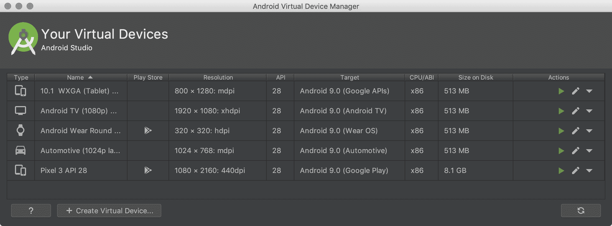

Android Virtual Device Manager

2.  单击创建虚拟设备以创建新的虚拟设备。在接下来的屏幕中，选择适当的硬件、系统映像、API 级别、AVD 名称等，然后继续。例如，下面的截图显示安卓派被选中:

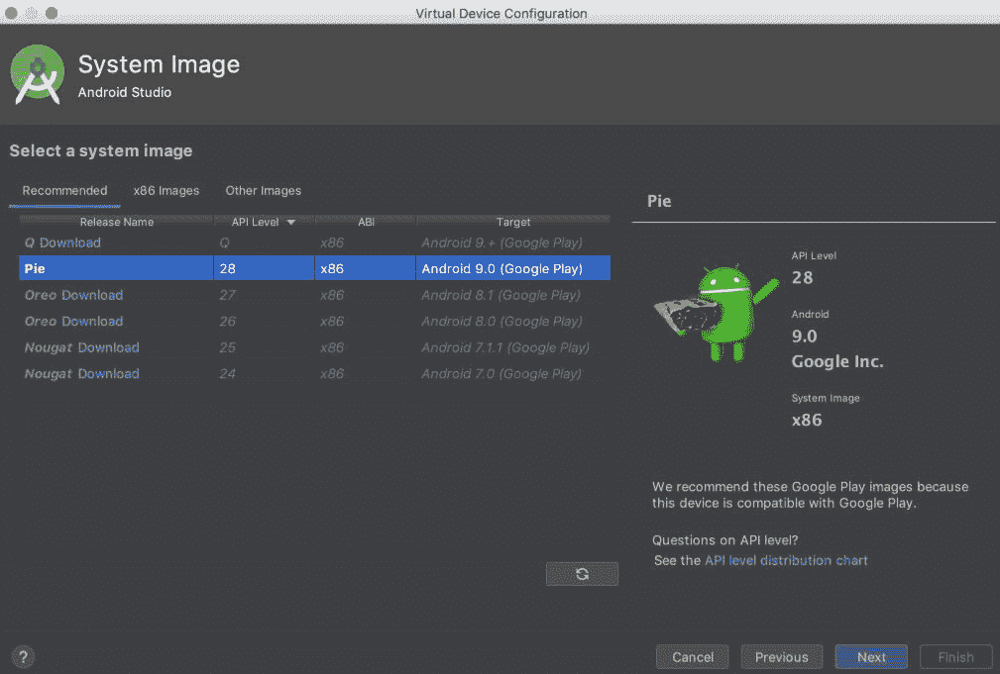

Virtual device configuration

3.  设备成功创建后，会显示一条确认消息。现在，选择自动视频显示器并点击播放按钮。
4.  这应该会启动模拟器。请注意，根据工作站的中央处理器和内存，这可能需要几分钟甚至更长时间。模拟器确实消耗了系统上大量的资源。成功启动后，AVD 将运行，如下图所示:


The Android emulator 

从取证的角度来看，分析师和安全研究人员可以利用仿真器的功能来理解文件系统、数据存储等。在模拟器上工作时创建的数据存储在您的主目录中名为`android`的文件夹中。例如，在我们的例子中，我们之前创建的 Pixel_XL_API_28 模拟器的细节存储在`C:\Users\Rohit\.android\avd\Pixel_XL_API_28.avd`下。

在此目录下的各种文件中，以下是法医分析师感兴趣的文件:

*   `cache.img`:这是`/cache`分区的磁盘镜像(记得我们在 [*第七章*](07.html)*了解安卓*中讨论过安卓设备的`/cache`分区)。
*   `sdcard.img`:这是 SD 卡分区的磁盘镜像。
*   `Userdata-qemu.img`:这是`/data`分区的磁盘镜像。`/data`分区包含关于设备用户的有价值的信息。

现在我们已经了解了设置环境的步骤，让我们将安卓设备连接到取证工作站。

# 将安卓设备连接到工作站

使用开源工具对安卓设备进行取证需要您将设备连接到取证工作站。任何设备的取证都应在无菌工作站上进行。这意味着工作站严格用于取证，而非个人使用。

Note that any time a device is plugged into a computer, changes can be made to the device; you must have full control of all interactions with the Android device at all times.

为了将设备成功连接到工作站，您应该执行以下步骤。请注意，写保护可能会阻止设备的成功获取，因为可能需要向设备推送命令才能获取信息。在使用真实证据进行尝试之前，应在测试设备上验证以下所有步骤。

# 识别设备电缆

安卓设备的物理 USB 接口允许它连接到计算机共享数据，如歌曲、视频和照片。该 USB 接口可能因制造商而异，也可能因设备而异。比如有的设备用迷你 USB，有的用微型 USB 和 USB Type C，除此之外，有的厂商用自己的专有格式，比如 EXT-USB、EXT 微型 USB 等等。获取安卓设备的第一步是确定需要什么样的设备线缆。

有不同的类型，如迷你 USB、微型 USB 和其他专有格式。以下是最广泛使用的连接器类型的简要描述:

| **连接器类型** | **描述** |
| USB 迷你卡 | 它的尺寸约为 7 x 3 毫米，一个长边的两个角被抬起。 |
| USB micro-b | 它的尺寸约为 6 x 1.5 毫米，两个角被切掉形成一个梯形。 |
| 同轴的 | 它有一个圆孔，中间插着一根针。这一类有不同的尺寸，直径从 2 毫米到 5 毫米不等。广泛用于诺基亚模型。 |
| 微型 | 它有两个圆角的矩形形状。矩形的长度有所不同，但高度总是在 1.5 到 2 毫米之间。主要用于三星和 LG 设备。 |

接下来，让我们快速了解一下如何安装设备驱动程序。

# 安装设备驱动程序

为了正确识别设备，计算机可能需要安装某些驱动程序。如果没有必要的驱动程序，计算机可能无法识别和使用连接的设备。问题是，由于安卓系统允许由制造商修改和定制，因此没有一个通用的驱动程序适用于所有安卓设备。每个制造商编写自己的专有驱动程序并通过互联网分发，因此确定需要安装的特定设备驱动程序非常重要。当然，一些安卓取证工具包(我们将在后面的章节中讨论)确实附带了一些通用驱动程序或一组最广泛使用的驱动程序；它们可能不适用于所有型号的安卓手机。

一些 Windows 操作系统能够在设备插入后自动检测和安装驱动程序，但通常它们会失败。所有制造商的设备驱动程序都可以在各自的网站上找到。

# 访问连接的设备

如果您还没有这样做，请使用 USB 电缆将解锁的安卓设备直接连接到计算机。安卓设备将作为一个新的驱动器出现，您将能够访问外部存储上的文件。如果设备被锁定，此时，您将无法访问任何文件，可能需要使用“打开 USB 存储”选项，该选项可以在手机上启用，如下图所示:

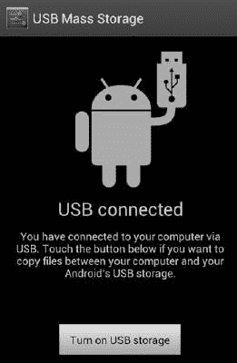

USB mass storage in Android 4.1 version

对于一些安卓手机(尤其是带 HTC 的手机)，当用 USB 电缆连接时，该设备可能会暴露不止一个功能。例如，如下图所示，当一个 HTC 设备被连接时，它会显示一个包含四个选项的菜单。默认选择是仅收费。选择磁盘驱动器选项后，它将作为磁盘驱动器安装:

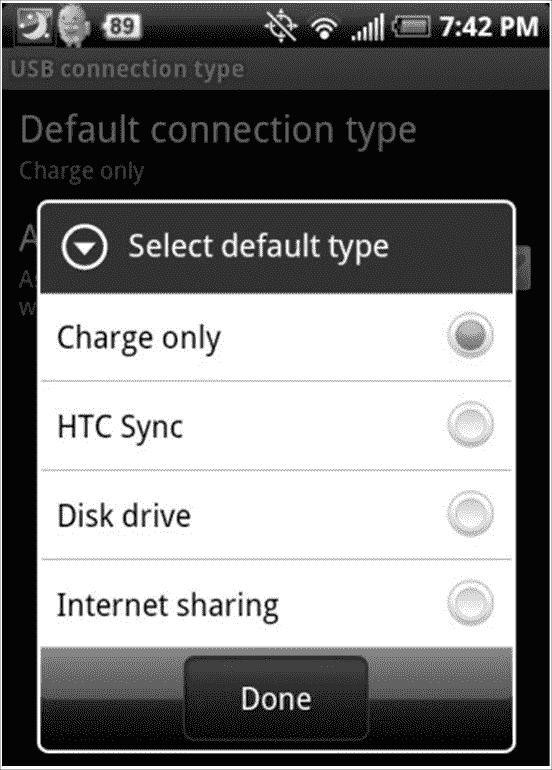

HTC mobile USB options

当设备作为磁盘驱动器安装时，您将能够访问设备上的 SD 卡。从法医的角度来看，SD 卡具有重要价值，因为它可能包含对调查很重要的文件；但是`/data/data`下存储的核心应用数据会保留在设备上，无法用这些方法访问。

# 安卓调试桥

**安卓调试桥** ( **ADB** )被认为是安卓取证中最关键的组件之一，是一个命令行工具，允许您与安卓设备通信并控制它。我们将在接下来的章节中详细了解亚行；目前，我们将重点介绍亚行的基本情况。您可以在`/platform-tools/`下访问 ADB 工具。

在我们讨论关于 ADB 的任何事情之前，我们需要了解 **USB 调试**选项。

# USB 调试

该选项的主要功能是启用安卓设备和安装了安卓软件开发工具包的工作站之间的通信。在三星手机上，您可以在“设置|开发者选项”下访问此功能，如下图所示:

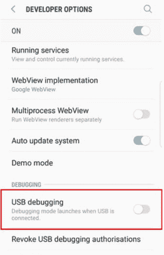

The USB debugging option in a Samsung S8 device

其他安卓手机可能有不同的环境和配置功能。您可能必须通过访问构建模式来强制开发人员选项。

但是，从安卓 4.2 开始，开发者选项菜单被隐藏，以确保用户不会意外启用它。要启用它，请转到“设置”|“关于电话”，然后轻按“内部号码”栏七次。此后，开发人员选项将出现在设置菜单中。在安卓 4.2.2 之前，启用该选项是通过 ADB 与设备通信的唯一要求；不过，从 Android 4.2.2 开始，谷歌引入了安全 USB 调试选项。此功能仅允许用户明确授权的主机使用 ADB 连接到设备。

因此，当您通过 USB 将设备连接到新工作站以访问 ADB 时，您需要首先解锁设备，并通过在确认窗口中按“确定”来授权访问，如下图所示。如果选中了“始终允许从该计算机访问”，设备以后将不会提示授权:


Secure USB debugging

当选择 USB 调试选项时，设备将在后台运行 **adb 守护程序** ( `adbd`)并持续寻找 USB 连接。守护程序通常在非特权 shell 用户帐户下运行，因此不会提供对完整数据的访问；但是，在根手机上，`adbd`将在根帐户下运行，因此提供对所有数据的访问。除非所有其他取证方法都失败，否则不建议您根设备以获得完全访问权限。如果你选择将安卓设备作为根设备，那么在尝试使用真实证据之前，这些方法必须被很好地记录和测试。生根将在本章的最后讨论。

在安装了 Android SDK 的工作站上，`adbd`将作为后台进程运行。此外，在同一工作站上，将运行一个客户端程序，该程序可以通过发出`adb`命令从外壳中调用。当`adb`客户端启动时，它首先检查`adb`守护程序是否已经在运行。如果响应是否定的，它将启动一个新的进程来启动`adb`守护进程。`adb`客户端程序通过端口`5037`与本地`adbd`通信。

# 使用 adb 访问设备

环境设置完成，安卓设备进入 USB 调试模式后，用 USB 线将安卓设备连接到取证工作站，开始使用`adb`。

# 检测连接的设备

以下`adb`命令提供了连接到取证工作站的所有设备的列表。如果模拟器在发出命令时正在运行，这也将列出模拟器。还要记住，如果没有安装必要的驱动程序，那么下面的命令将显示一条空白消息。如果遇到这种情况，请从制造商处下载必要的驱动程序并安装:


我们现在有一个连接到工作站的设备列表。接下来，我们将看到如何杀死本地 ADB 服务器。

# 杀死本地 ADB 服务器

以下命令终止本地`adb`服务:

```
C:\android-sdk\platform-tools>adb.exe kill-server
```

关闭本地`adb`服务后，发出`adb`设备命令。您将看到服务器已启动，如下图所示:


我们现在将访问安卓设备上的亚行外壳。

# 访问亚行 shell

ADB shell 命令允许您访问安卓设备上的 shell 并与设备交互。

以下是访问`adb` shell 并执行一个基本的`ls`命令来查看当前目录的内容的命令:

```
C:\android-sdk\platform-tools>adb.exe shell shell@android:/ $ ls
ls acct cache
config d
data default.prop dev
efs etc
factory fstab.smdk4x12 init
init.bt.rc init.goldfish.rc init.rc init.smdk4x12.rc init.smdk4x12.usb.rc
....  
```

安卓模拟器可以让你在设备上使用`adb`命令之前，先执行并理解它们。在[第 9 章](09.html)*安卓数据提取技术*中，我们将解释更多关于利用 adb 安装应用程序、从设备复制文件和文件夹、查看设备日志等的内容。

# 基本的 Linux 命令

现在，我们将快速了解一些常用的 Linux 命令及其在安卓设备上的用法:

*   `ls`:`ls`命令(不带选项)列出当前目录中存在的文件和目录。使用`-l`选项，该命令显示文件和目录及其大小、修改日期和时间、文件所有者及其权限等，如以下命令行输出所示:

```
shell@android:/ $ ls -l
ls -l
drwxr-xr-x root     root             2015-01-17 10:13 acct
drwxrwx--- system   cache             2014-05-31 14:55 cache
dr-x------ root     root              2015-01-17 10:13 config
lrwxrwxrwx root     root              2015-01-17 10:13 d -> /sys/kernel/debug
drwxrwx--x system   system            2015-01-17 10:13 data
-rw-r--r-- root     root          116 1970-01-01 05:30 default.prop
drwxr-xr-x root     root              2015-01-17 10:13 dev
drwxrwx--x radio    system            2013-08-13 09:34 efs
lrwxrwxrwx root     root              2015-01-17 10:13 etc -> /system/etc
...  
```

同样，以下是可以与`ls`命令一起使用的几个选项:

| **选项** | **描述** |
| `a` | 列出隐藏的文件 |
| `c` | 按时间戳显示文件 |
| `d` | 仅显示目录 |
| `n` | 显示带有 GID 和 UID 号的长格式列表。 |
| `R` | 也显示子目录 |
| `t` | 基于时间戳显示文件 |
| `u` | 显示文件访问时间 |

根据要求，研究者可以使用以下一个或多个选项来查看详细信息:

*   `cat`:`cat`命令读取一个或多个文件，并将其打印到标准输出，如下命令行所示:

```
shell@android:/ $ cat default.prop
cat default.prop
#
# ADDITIONAL_DEFAULT_PROPERTIES
#
ro.secure=1
ro.allow.mock.location=0
ro.debuggable=0
persist.sys.usb.config=mtp  
```

要将多个文件合并成一个文件，我们可以使用`>`运算符。要追加到现有文件，我们可以使用`>>`运算符。

*   `cd`:使用`cd`命令从一个目录切换到另一个目录。这在从一个文件夹导航到另一个文件夹时更常用。以下示例显示了用于切换到`system`文件夹的命令:

```
shell@android:/ $ cd /system
cd /system
shell@android:/system $   
```

*   `cp`:可以使用`cp`命令将文件从一个位置复制到另一个位置。该命令的语法如下:

```
$ cp [options] <source><destination>  
```

*   `chmod`:`chmod`命令用于更改对文件系统对象(文件和目录)的访问权限。它也可能改变特殊模式标志。该命令的语法如下:

```
$ chmod [option] mode files  
```

例如，文件上的`chmod 777`赋予每个人读、写和执行的权限。

*   `dd`:使用`dd`命令复制文件，根据操作数进行转换和格式化。在安卓系统中，`dd`命令可以用来一点一点地创建安卓设备的图像。成像的更多细节将在 [*第 4 章*](04.html)*iOS 备份数据采集*中介绍。以下是此命令需要使用的语法:

```
dd if=/test/file of=/sdcard/sample.image    
```

*   `rm`:可以使用`rm`命令删除文件或目录。以下是该命令的语法:

```
rm file_name    
```

*   `grep`:`grep`命令用于搜索文件或输出特定模式。该命令的语法如下:

```
grep [options] pattern [files]    
```

*   `pwd`:`pwd`命令显示当前工作目录。例如，以下命令行输出显示当前工作目录为`/system`:

```
shell@android:/system $ pwd
pwd
/system  
```

*   `mkdir`:使用`mkdir`命令创建新目录。以下是该命令的语法:

```
mkdir [options] directories  
```

*   `exit`:可以使用`exit`命令退出你所在的 shell。只需在外壳中键入`exit`即可退出。

接下来，我们将在调查之前看看如何有效地处理安卓设备。

# 操作安卓设备

在法医调查之前，以适当的方式处理安卓设备是一项非常重要的任务。应注意确保我们无意的行为不会导致数据修改或任何其他不必要的事件。以下各节阐述了在法医调查的初始阶段处理设备时需要考虑的某些问题。

随着技术的进步，*设备锁定*的概念在过去几年中已经发生了有效的变化。由于普遍安全意识的增强，大多数用户现在都在他们的设备上启用了密码锁定机制。在我们了解用于绕过锁定的安卓设备的一些技术之前，重要的是我们不要错过在有机会时禁用密码的机会。

首次访问要分析的安卓设备时，检查该设备是否仍处于活动状态(未锁定)。如果是，请更改设备的设置，以便能够更好地访问设备。当设备仍处于活动状态时，请考虑执行以下任务:

*   **启用 USB 调试**:一旦启用 USB 调试选项，它将通过`adb`连接为设备提供更大的访问权限。这对于从设备中提取数据非常重要。启用 USB 调试选项的位置可能会因设备而异，但通常在“设置”中的“开发人员选项”下。大多数物理获取安卓设备的方法都需要启用 USB 调试。
*   **启用保持唤醒设置**:如果选择了保持唤醒选项，并且设备已连接充电，则设备不会锁定。同样，如果设备锁定，可以暂停采集。
*   **增加屏幕超时**:这是设备解锁后有效激活的时间。访问此设置的位置因设备型号而异。在三星 Galaxy S3 手机上，您可以通过导航到设置|显示|屏幕超时来访问此设置。

除此之外，如 [*第 1 章*](01.html)*移动取证简介*中所述，设备需要与网络隔离，以确保远程擦除选项在设备上不起作用。安卓设备管理器允许远程擦除或锁定手机。这可以通过登录在手机上配置的谷歌帐户来实现。关于这一点的更多细节将在下一节中提供。如果安卓设备未设置为允许远程擦除，则只能使用安卓设备管理器锁定设备。市面上也有几款**移动设备管理** ( **MDM** )软件产品，可以让用户远程锁定或擦拭安卓设备。其中一些可能不需要在设备上启用特定设置。

使用可用的远程擦除软件，可以删除所有数据，包括电子邮件、应用程序、照片、联系人和其他文件，以及 SD 卡上的数据。为了将设备与网络隔离，您可以将设备置于飞机模式，并禁用无线网络作为额外的预防措施。启用飞机模式和禁用无线网络运行良好，因为该设备将无法通过蜂窝网络通信，也无法通过无线网络访问。从手机中取出 SIM 卡也是一种选择，但这并不能有效阻止设备通过无线网络或其他蜂窝网络进行通信。要将设备置于飞机模式，按住电源关闭按钮并选择飞机模式。

所有这些步骤都可以在安卓设备未锁定时完成；然而，在调查过程中，我们通常会遇到被锁定的设备。因此，了解如何在安卓设备上启用锁定代码是很重要的。

# 屏幕锁定旁路技术

由于用户认知度的提高和功能的易用性，使用密码选项锁定安卓设备的情况呈指数级增长。这意味着在法医调查期间绕过设备的屏幕锁定变得越来越重要。到目前为止讨论的屏幕锁定旁路技术的适用性是基于这种情况的。请注意，其中一些方法可能会导致我们对设备进行更改。确保您测试并验证了非证据安卓设备上列出的所有步骤。您必须获得授权，才能对设备进行所需的更改，记录所采取的所有步骤，并能够描述如果需要法庭证词时所采取的步骤。

目前，Android 提供了三种类型的屏幕锁定机制。虽然有些设备有语音锁定、面部锁定和指纹锁定选项，但我们将只讨论以下三个选项，因为这些选项在所有安卓设备上使用最广泛:

*   **图案锁**:用户在手机上设置一个图案或设计，必须画出相同的图案才能解锁设备。安卓是第一个引入模式锁的智能手机。
*   **PIN 码**:这是最常见的锁定选项，很多手机上都有。个人识别码是一个四位数的数字，需要输入才能解锁设备。
*   **密码**:这是一个字母数字密码。与四位数字的个人识别码不同，字母数字密码包括字母和数字。

下一节详细介绍了一些可以绕过这些安卓锁定机制的技术。根据具体情况，这些技术可能有助于调查人员绕过屏幕锁定。

# 使用 ADB 绕过屏幕锁定

如果安卓设备上似乎启用了 USB 调试，明智的做法是使用 USB 连接与`adb`连接，如本章前面部分所述。您应该将设备连接到取证工作站并发出`adb`设备命令。如果设备出现，则表示 USB 调试已启用。如果安卓设备被锁定，您必须尝试绕过屏幕锁定。启用 USB 调试时，以下两种方法可能允许您绕过屏幕锁定。

# 正在删除手势. key 文件

删除`gesture.key`文件会解除设备上的模式锁定；但是，需要注意的是，这将永久改变设备，因为模式锁已经不存在了。如果你正在进行秘密行动，这应该被考虑。下面显示了该过程是如何完成的:

1.  使用 USB 电缆将设备连接到取证工作站(在我们的示例中是一台 Windows 机器)。

2.  打开命令提示符并执行以下指令:

```
adb.exe shell
cd /data/system rm gesture.key  
```

3.  重新启动设备。如果模式锁仍然出现，只需绘制任意随机设计，设备应该会毫无问题地解锁。

This method works when the device is rooted. This method may not be successful on unrooted devices. Rooting an Android device should not be performed without proper authorization, as the device is altered.

# 更新 settings.db 文件

要更新`settings.db`文件，请执行以下步骤:

1.  使用 USB 电缆将设备连接到取证工作站。
2.  打开命令提示符，执行以下命令:`/data/data/com.android.providers.settings/databases sqlite3 settings.db`:


3.  退出并重新启动设备。
4.  安卓设备应该解锁。如果不是，如前所述，尝试移除`gesture.key`。

我们将在下一节中了解恢复模式和 ADB 连接。

# 检查修改后的恢复模式和 ADB 连接

在 Android 中，恢复是指恢复控制台所在的专用分区。恢复的两个主要功能是删除所有用户数据和安装更新。例如，当您在工厂重置手机时，恢复会启动并删除所有数据。同样，当更新要安装在手机上时，它是在恢复模式下完成的。

有很多热心的安卓用户通过修改后的恢复模块安装定制 ROM。这个修改后的恢复模块主要是为了方便安装自定义 ROM 的过程。根据设备制造商的不同，可以通过不同的方式访问恢复模式；关于哪种方法适合哪家制造商的设备的信息很容易在互联网上获得。通常，这是通过将不同的按键放在一起来完成的，例如音量按钮和电源按钮。一旦进入恢复模式，将设备连接到工作站，并尝试访问`adb`连接。如果设备具有未修改的恢复模式，您可能无法访问`adb`连接。设备的修改恢复版本为用户提供了不同的选项，如下图所示:

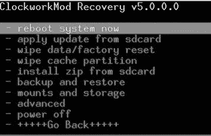

接下来，我们将看到如何刷新恢复分区。

# 闪烁新的恢复分区

有一些机制可以用修改后的映像刷新安卓设备的恢复分区。fastboot 实用程序有助于这一过程。快速启动是 SDK 包附带的一种诊断协议，主要用于通过主机上的 USB 连接修改闪存文件系统。为此，您需要在引导加载程序模式下启动设备，在该模式下，仅执行最基本的硬件初始化。

一旦在设备上启用了该协议，它将接受一组特定的命令，这些命令通过使用命令行的 USB 电缆发送给它。用存储在计算机上的二进制映像刷新或重写分区就是这样一个被允许的命令。一旦恢复被刷新，在恢复模式下启动设备，挂载`/data`和`/system`分区，使用`adb`删除`gesture.key`文件。重启手机，你应该可以绕过屏幕锁定；但是，这仅在设备引导加载程序解锁时有效。此外，闪烁会永久改变设备。您可以使用快速引导`boot`命令临时引导至恢复映像，删除密钥文件，而无需永久更改恢复分区，而不是闪烁。

# 使用自动化工具

市场上有几种解锁安卓设备的自动化解决方案。商用工具，如 Cellebrite 和 XRY，能够绕过屏幕锁定，但大多数都需要启用 USB 调试。我们现在将研究如何使用 UFED 用户锁定代码恢复工具解锁安卓设备。该工具仅适用于支持通用串行总线 OTG 的设备。此过程还需要一台 UFED 摄像机、500 号电缆旁路锁和 501 号电缆旁路锁。工具安装到工作站后，请执行以下步骤解锁安卓设备:

1.  在工作站上运行工具，按`1`，如下图截图所示:


UFED user lock code recovery tool

2.  现在，将 500 号电缆旁路锁的 A 侧连接到工作站的 USB 端口。此外，将 500 号电缆(旁路锁)的 B 侧连接至 501 号电缆(OTG)，然后将另一端连接至设备。
3.  连接后，该工具会提示您选择恢复配置文件。选择`[1] Manually select the recovery profile.`。
4.  现在，选择设备上使用的锁定类型和恢复配置文件，并按照屏幕上的说明继续操作。

5.  之后，确保键盘出现在设备屏幕上，并准备好接受个人识别码。
6.  关闭可能出现的任何消息窗口。按`1`并点击*进入*。现在，通过输入随机输入进行五次不正确的登录尝试，并点击设备底部的忘记模式。
7.  按照屏幕上的说明操作，等待摄像头窗口打开，然后点击摄像头窗口。
8.  使用光标选择设备屏幕上的任何非空白区域，方法是将绿色方块放在上面，例如，选择屏幕上的任何数字。工具使用它来检测设备是否解锁。按*进入*开始流程。
9.  该工具将尝试多种组合来解锁设备。一旦解锁，它将提示您结束该过程。

我们现在将了解安卓设备管理器以及如何使用它解锁设备。

# 使用安卓设备管理器

大多数最新的安卓手机都有一项名为安卓设备管理器的服务，可以帮助设备所有者找到丢失的手机。此服务也可用于解锁设备；但是，只有当您知道设备上配置的 Google 帐户凭据时，这才是可能的。如果您有权访问帐户凭据，请按照以下步骤解锁设备:

1.  在您的工作站上访问 http://google.com/android/devicemanager。
2.  使用设备上配置的谷歌帐户登录。
3.  选择需要解锁的设备，点击锁定，如下图所示:


Android Device Manager

4.  输入临时密码，然后再次单击锁定。
5.  一旦成功，请在设备上输入临时密码来解锁。

这可以在不知道保存登录的计算机(即嫌疑人的电脑)的凭据的情况下完成。

# 绕过使用“查找我的手机”(仅适用于三星手机)

如果您正在使用三星设备，使用“查找我的手机”是一项值得尝试的技术；但是，只有当设备所有者已经登录到设备上的三星帐户，并且您知道设备上配置的三星凭据时，它才能工作。

要开始该过程，请从网络浏览器访问“查找我的手机”服务，然后使用设备上注册的三星帐户凭据登录，如下所示:

1.  点击左侧的锁定我的屏幕选项。：

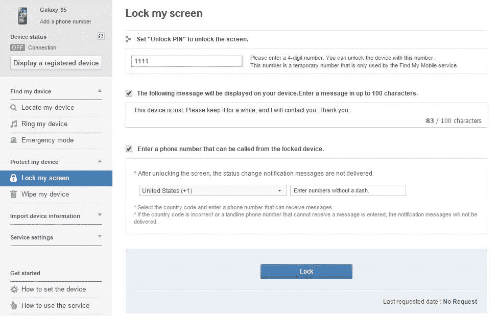

2.  现在，输入任何临时个人识别码，然后点击锁定按钮。(对于某些设备，您可能还会看到“解锁我的屏幕”选项，这也有同样的作用)。现在可以使用之前设置的临时个人识别码解锁手机。

接下来，让我们来看看涂抹攻击。

# 涂抹攻击

在极少数情况下，涂抹攻击可用于推断触摸屏移动设备的密码。这种攻击依赖于识别用户手指留下的污迹。虽然这可能是一种绕过的方法，但必须指出的是，涂抹攻击不太可能奏效，因为大多数安卓设备都是触摸屏，使用该设备也会出现涂抹；然而，已经证明，在适当的照明下，留下的污迹可以很容易地被检测到，如下图所示。

通过分析污迹标记，我们可以辨别用于解锁屏幕的图案。在识别安卓设备上的模式锁时，这种攻击更有可能奏效。在某些情况下，个人识别码也可以根据屏幕的清洁度进行恢复。因此，在法医调查期间，首次操作设备时应小心，以确保屏幕未被触摸:


Smudges visible on a device under proper lighting 

我们现在将研究下一个方法，即忘记密码选项。

# 使用忘记密码/忘记模式选项

如果您知道设备上配置的主要 Gmail 地址的用户名和密码，您可以在设备上更改个人识别码、密码或刷卡。在尝试解锁屏幕一定次数失败后，安卓提供了一个名为忘记模式的选项？还是忘记密码？，如下图所示:

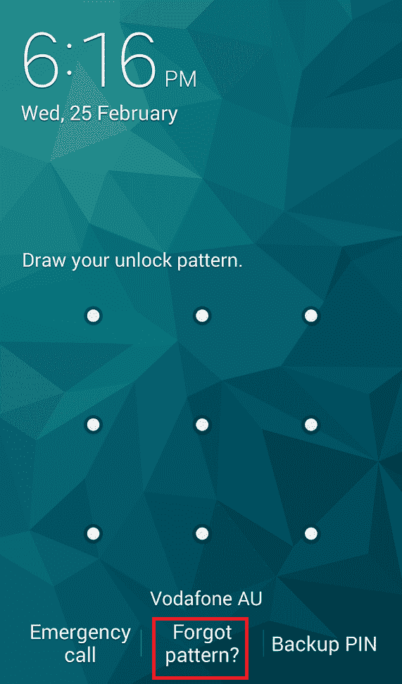

Forgot pattern option on an Android device

点击该链接，并使用 Gmail 用户名和密码登录。这将允许您为设备创建新的模式锁或密码。

Note that this works only on devices running Android 4.4 or earlier.

# 通过引导至安全模式绕过第三方锁屏

如果屏幕锁是第三方应用程序，而不是内置锁，可以通过启动到安全模式并禁用它来绕过它。要在安卓设备 4.1 或更高版本上引导至安全模式，请按住*电源*按钮，直到出现电源选项菜单。然后，按住*电源*按钮，系统会提示您重新启动安卓设备进入安全模式。点击确定按钮，如下图所示:


Safe mode in Android

进入安全模式后，您可以禁用第三方锁屏应用或将其完全卸载。之后，重新启动设备，您应该能够在没有任何锁定屏幕的情况下访问它。

# 使用 ADB 密钥的安全 USB 调试旁路

如前所述，在使用 USB 调试时，如果选中了“始终允许从此计算机进行调试”选项，设备将不会在将来提示授权。这是通过在计算机上存储某些键来完成的，即`adbkey`和`adbkey.pub`。从不受信任的计算机连接到`adb`的任何尝试都被拒绝。在这种情况下，`adbkey`和`adbkey.pub`文件可以从嫌疑人的电脑中取出，并复制到调查员的工作站。然后，设备将假设它正在与已知的授权计算机通信。在 Windows 机器上的`C:Users<username>.android`可以找到`adbkey`和`adbkey.pub`文件。

# 安卓 4.4.2 中的安全 USB 调试旁路

如前几节所述，安卓 4.4.2 中引入的安全 USB 调试功能只允许授权工作站连接设备；然而，正如在[https://labs.mwrinfosecurity.com/](https://labs.mwrinfosecurity.com/)报道的那样，该功能存在一个 bug，允许用户绕过安全 USB 调试功能，将设备连接到任何工作站。以下是在安卓设备上绕过安全 USB 调试的步骤:

1.  在未锁定的设备上，尝试使用`adb`。设备将显示一条错误消息。
2.  现在，导航到紧急拨号程序或锁屏摄像头，并执行以下命令:

```
$ adb kill-server
$ adb shell  
```

3.  确认对话框将被触发，工作站现在无需解锁设备即可获得授权。确认对话框将显示在紧急拨号器上，如下图所示:

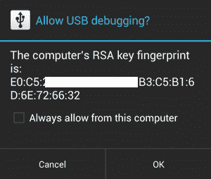

Secure USB debugging in Android 4.2.2

4.  通过`adb`连接到设备后，使用以下命令尝试绕过锁定屏幕:

```
$ adb shell pm clear com.android.keyguard 
```

接下来，让我们看看如何通过崩溃锁屏来绕过屏幕锁定。

# 安卓 5.x 中的锁屏界面崩溃

在运行安卓 5.0 到 5.1.1 的设备上，可以通过崩溃屏幕用户界面来绕过密码锁屏幕(而不是个人识别码或模式锁)。这可以通过执行以下步骤来实现，如在[https://android.gadgethacks.com/](https://android.gadgethacks.com/)所述:

1.  单击锁定屏幕上的紧急呼叫选项，然后在拨号器屏幕上输入任意随机输入(例如，10 个星号)。
2.  双击该字段以突出显示输入的文本，如下图所示，然后选择复制。现在，将其粘贴到同一个字段中:

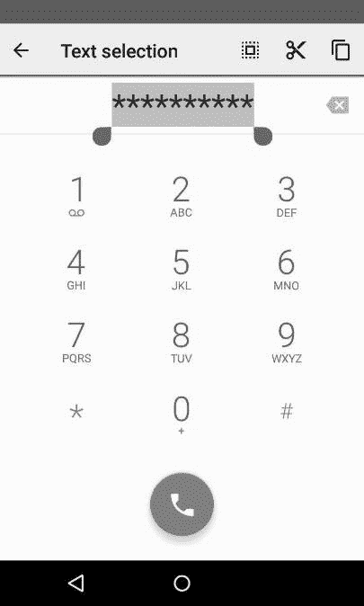

Crashing lock screen UI

3.  重复此过程以添加更多字符。这样做，直到字段不再突出显示双击的字符。
4.  回到锁屏，打开摄像头快捷方式。现在，下拉通知屏幕并点击设置图标。然后会提示您输入密码。

5.  按住输入栏并选择粘贴，重复此过程多次。一旦足够多的字符被粘贴到字段中，锁定屏幕将崩溃，允许您访问设备。

现在，让我们看看更多的技巧。

# 其他技术

所有上述技术和可用的商业工具对任何法医都很有用，就像你一样，试图访问安卓设备上的数据；然而，可能存在这些技术都不起作用的情况。为了获得设备的完整物理图像，当商业和开源解决方案失败时，可能需要芯片关闭和 JTAG 等技术。这里包括对这些技术的简短描述。

当片下技术从电路中取出存储芯片并试图读取它时，JTAG 技术包括探测 JTAG **测试访问端口** ( **TAPs** )并将连接器焊接到 JTAG 端口，以便从设备存储器中读取数据。芯片脱落技术的破坏性更大，因为一旦芯片从设备上移除，就很难将设备恢复到其原始功能状态。此外，需要专业知识，通过将芯片从电路板上拆下来小心地将芯片从器件上移除。移除芯片所需的热量也可能会损坏或破坏存储在该芯片上的数据，这意味着只有当开源或商业工具无法检索数据或设备损坏到无法修复时，才应使用这种技术。当使用 JTAG 技术时，JTAG 端口可以帮助您访问存储芯片来检索数据的物理图像，而无需移除芯片。要关闭设备上的屏幕锁定，您可以识别锁定代码在物理内存转储中的存储位置，关闭锁定，并将该数据复制回设备。像 Cellebrite Physical Analyzer 这样的商业工具，可以接受来自芯片外和 JTAG 收购的`.bin`文件，并为您破解锁定码。一旦代码被手动移除或破解，您就可以使用普通技术分析设备。

Both the chip-off and JTAG techniques require extensive research and experience to be attempted on a real device. A great resource for JTAG and chip-off on devices can be found at [https://forensicswiki.xyz/page/Main_Page](https://forensicswiki.xyz/page/Main_Page).

在本节中，我们研究了绕过安卓设备屏幕锁定的各种方法。我们现在将了解安卓生根是怎么回事。

# 获得根访问权限

作为一名移动设备法医，了解与扭转和调整设备相关的一切是至关重要的。这将帮助您详细了解设备的内部工作原理，并了解您在调查过程中可能面临的许多问题。扎根安卓手机已经成为一种普遍现象，你可以期待在法医检查中遇到扎根手机。在适用的情况下，您可能还需要根设备，以便为法医检查获取数据。这意味着了解根设备的来龙去脉以及它们与其他手机的区别非常重要。以下几节涵盖了安卓生根和其他相关概念的信息。

# 什么是生根？

类 Unix 操作系统中的默认管理帐户称为**根**。在 Linux 中，根用户有权启动/停止任何系统服务，编辑/删除任何文件，更改其他用户的权限，等等。我们已经了解到安卓使用的是 Linux 内核，所以大多数 Linux 概念也适用于安卓；但是，大多数安卓手机默认情况下不会让你以 root 用户身份登录。

Rooting an Android phone is all about gaining access to the device to perform actions that are not normally allowed on the device. Manufacturers want devices to function in a certain manner for normal users. Rooting a device may void a warranty, since using root opens the system to vulnerabilities and provides the user with superuser capabilities.

想象一下，一个恶意应用程序获得了对整个安卓系统的根访问权限。请记住，在安卓系统中，每个应用程序都被视为一个独立的用户，并被分配一个 UID。这意味着应用程序可以访问有限的资源，并且应用程序隔离的概念得到了加强。本质上，扎根安卓设备允许超级用户的能力，并提供对安卓设备的开放访问。

超级用户功能类似于 Windows 机器上的管理功能，并且授予特权访问权限来执行普通用户可能无法完成的操作。在手机中，这种超级用户访问被设计为禁用，但在手机上生根允许你获得这种特权。

# 理解生根过程

即使硬件制造商试图施加足够的限制来限制对根的访问，黑客总是找到不同的方法来访问根。生根的过程因基础设备制造商而异；然而，扎根任何设备通常涉及利用设备固件中的安全漏洞，然后将`su`(超级用户)二进制文件复制到当前进程路径(`/system/xbin/su`)中的某个位置，并使用`chmod`命令授予其可执行权限。

为了简单起见，假设一个安卓设备有三到四个分区，运行与安卓不完全相关的程序(安卓就是其中之一)。

引导加载程序存在于第一个分区中，是手机开机时运行的第一个程序。这个引导加载器的主要工作是引导其他分区并加载安卓分区，默认情况下通常称为 ROM。要查看引导加载程序菜单，需要特定的组合键，例如按住电源按钮并按下音量增大按钮。此菜单提供了引导到其他分区的选项，如恢复分区。

恢复分区处理手机的安装升级，直接写入安卓 ROM 分区。这是您在设备上安装任何官方更新时看到的模式。设备制造商确保仅通过恢复分区安装官方更新。这意味着绕过这个限制将允许你安装/刷新任何解锁的安卓只读存储器。修改后的恢复程序不仅允许更容易的生根过程，而且提供了在正常恢复模式下看不到的各种选项。以下截图显示了正常恢复模式:

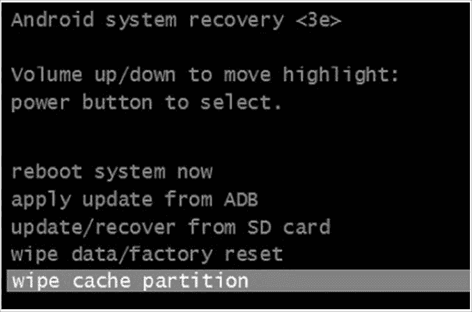

Normal Android system recovery mode

以下屏幕截图显示了修改后的恢复模式:

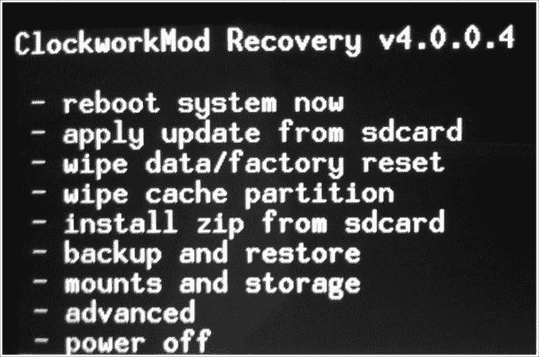

The modified recovery mode

安卓世界最常用的恢复程序是发条恢复，也叫 **ClockworkMod** 。大多数寻根方法都是从将修改后的恢复刷新到恢复分区开始的。之后可以发布更新，可以根设备；但是，您不需要手动执行所有操作，因为大多数型号都有软件，只需单击一下即可让您的手机扎根。

从安卓 7.x 开始，谷歌开始在设备上严格执行**验证开机**。已验证引导保证设备上的软件在引导到正常模式之前不会被修改。这是以这样一种方式实现的，即每个阶段在执行下一个阶段之前验证它的完整性和真实性。如果修改了特定的分区或段，完整性检查将失败，移动设备可能无法引导至正常模式。关于验证引导的更多信息，请访问[https://source . Android . com/security/verifiedboot/verified-boot](https://source.android.com/security/verifiedboot/verified-boot)。

这也意味着生根这样的安卓设备将是极其困难的，因为生根涉及调整安卓操作系统。棉花糖是第一个提供系统完整性警报的安卓版本，但自安卓 7.x 以来，这已经成为强制性的。

# 支持安卓设备

我们现在来看看安卓设备的不同根方法。影响您选择方法的主要因素是底层引导加载程序是锁定还是解锁。在未锁定引导加载程序的设备上获得根访问权限非常容易，而在锁定引导加载程序的设备上获得根访问权限并不那么简单，这意味着解锁安卓手机的引导加载程序通常是生根和刷新自定义光盘的第一步。这可以通过快速引导模式(在前面的章节中讨论)或遵循特定于供应商的引导加载程序解锁过程来完成。一旦设备引导加载程序解锁，下一步就是复制`su`二进制并授予其可执行权限。这可以通过多种方式实现。

以下是如何根三星 Galaxy S7(国际 SM-G930F/FD/X、韩国 SM-G930K/L/S、加拿大 SM-G930W8 Exynos 机型):

1.  确保在“开发人员”选项中启用了原始设备制造商解锁。
2.  下载 ODIN(可在[https://build.nethunter.com/samsung-tools/Odin_3.12.3.zip](https://build.nethunter.com/samsung-tools/Odin_3.12.3.zip)获得)并将档案的内容提取到您选择的目录中。
3.  下载 TWRP 图片(可在[https://twrp.me/samsung/samsunggalaxys7.html](https://twrp.me/samsung/samsunggalaxys7.html)获得)。
4.  重新启动设备进入下载模式。为此，请在设备重新启动时按住音量+主页按钮。看到下载模式警告屏幕后，请按音量键继续。
    启动奥丁，将 TWRP 图像放入 AP 槽；不要忘记禁用自动重启。开始闪烁恢复。
5.  要退出下载模式，请按住音量+主页+电源；当屏幕空白时，立即将音量调低至音量调高。
6.  通过向右滑动允许系统修改。
7.  下载 SuperSU(可在[https://download.chainfire.eu/supersu](https://download.chainfire.eu/supersu)获得)。
8.  通过 MTP 将带有 SuperSU 的存档文件传输到设备，并通过相应的 TWRP 选件安装。

生根是一个高度特定于设备的过程，因此法医调查员在任何安卓设备上应用这些技术之前都需要谨慎。支持一个设备既有优点也有缺点。以下是生根的好处:

*   生根允许对设备上的软件进行最深层次的修改——例如，您可以超频或欠频设备的中央处理器。

*   它允许绕过运营商、制造商等对设备施加的限制。
*   对于极端定制，可以下载和安装新的定制光盘。

以下是生根的缺点:

*   安装设备时必须非常小心，因为错误可能会对手机软件造成不可修复的损坏，使设备变成无用的砖块。
*   生根可能会使设备的保修失效。
*   扎根导致暴露于恶意软件和其他攻击的风险增加。可以访问整个安卓系统的恶意软件会造成巨大破坏。

一旦设备被根化，应用程序(如**超级用户应用程序**)就可以提供和拒绝根权限。此应用程序可帮助您授予和管理设备上的超级用户权限，如下图所示:


Application requesting root access

我们现在来看看根访问。

# 根访问- ADB 外壳

普通的安卓手机不允许你访问设备上的某些目录和文件。例如，尝试访问未扎根的安卓设备上的`/data/data`文件夹。您将看到以下消息:


Permission denial without root access

在根手机上，您可以通过发出以下命令以根用户身份运行`adb` shell:

```
C:\android-sdk\platform-tools>adb.exe root 
```

下面的屏幕截图显示了前面命令的输出:

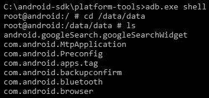

Successful execution of shell command on a rooted device

因此，在手机上扎根可以让你访问原本无法访问的文件夹和数据。还要注意的是`#`代表 root 或超级用户访问权限，而`$`代表普通用户，如前面的命令行所示。

Android 7.0 (Nougat) and later versions support **file-based encryption** (**FBE**), which allows the encryption of different files with different keys. For a forensic investigator like you, it is important to note that it is not possible to apply a permanent root to an FBE-enabled device for acquisition purposes. Instead, it is recommended that you use a custom recovery methodology, because the recovery partition runs with root privileges. 

# 摘要

在本章中，我们学习了如何在安卓设备上进行调查之前设置一个合适的取证工作站。从一个无菌的法医工作站开始，该工作站上安装了必要的基本软件和设备驱动程序。如果取证的方法需要解锁安卓设备，则需要确定访问设备的最佳方法。如果设备启用了 USB 调试功能，那么绕过屏幕锁定只是小菜一碟。我们了解了各种屏幕锁定旁路技术，并帮助您确定在不同情况下使用哪种技术。根据法医采集方法和调查范围，在设备上生根应提供对设备上存在的文件的完整访问。我们还了解了生根，以及如何使用它来获得对设备文件系统的完全访问，并执行通常不允许的操作。

既然已经介绍了访问安卓设备的基本概念，我们将在 [*第 9 章*](09.html)*安卓数据提取技术*中介绍采集技术，并描述如何使用每种方法提取数据。