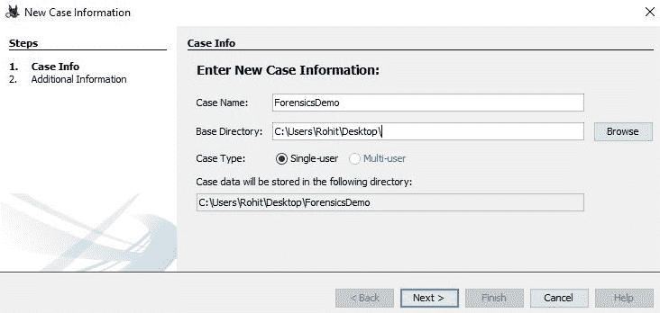
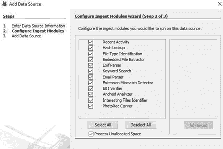
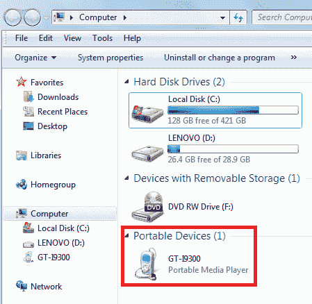
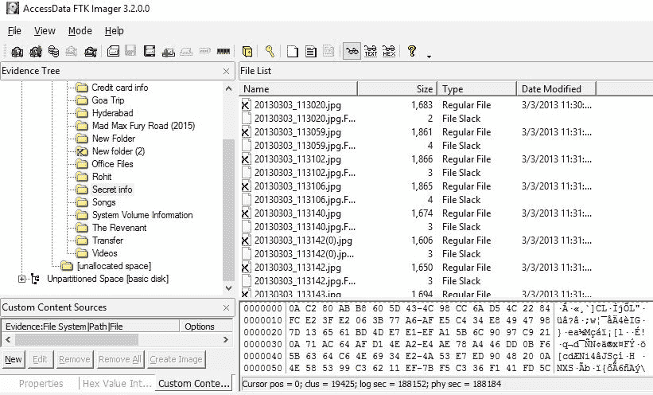
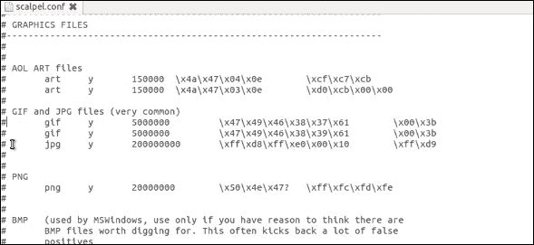
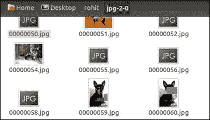
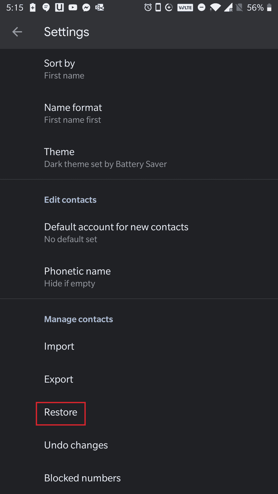
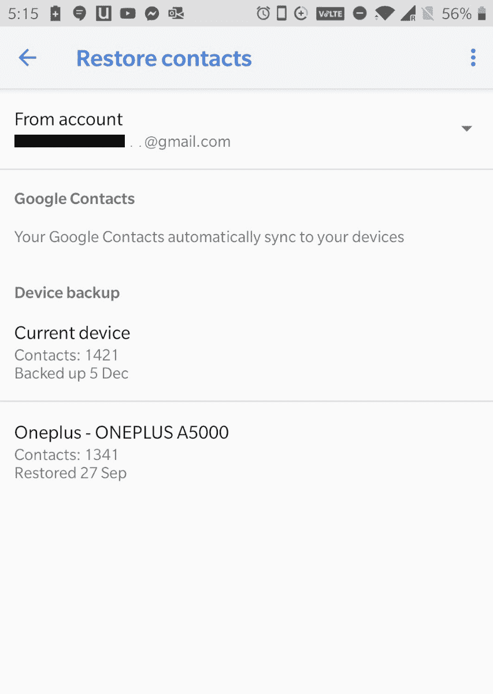

# 十、安卓数据分析和恢复

在前一章中，我们介绍了各种逻辑和物理提取技术。在物理提取中，一点一点地获得安卓设备的图像，其中包含有价值的信息。在本章中，我们将学习如何从图像文件中分析和提取相关数据，如呼叫日志和文本消息。虽然数据提取和分析技术提供了关于各种细节的信息，但并非所有技术都能提供关于被删除数据的信息。数据恢复是移动取证的一个重要方面，因为它有助于挖掘已删除的项目。

本章旨在涵盖各种技术，法医分析师可以使用这些技术从安卓设备中恢复数据。

在本章中，我们将涵盖以下两个主要主题:

*   使用解剖工具分析和提取安卓图像文件中的数据
*   了解从 SD 卡和内存中恢复已删除文件的技术

# 使用解剖工具分析和提取安卓图像文件中的数据

术语**安卓图像**是指通过执行任何物理数据提取技术获得的物理图像(也称为取证图像或原始图像)。使用[第 9 章](09.html)*安卓数据提取技术*中解释的技术，您可以对整个`/data/data`区块或与调查相关的任何特定区块进行成像。一旦获得图像，像您这样的调查人员就可以手动浏览文件的内容，或者利用可用的工具来解析内容。像 Cellebrite 和 XRY 这样的商业工具可以深入到数据中，呈现内容的全面图景。尸检是取证领域使用非常广泛的开源工具之一，在分析安卓图像方面表现出色。

# 尸检平台

尸检是一个法医平台，充当侦探工具包的图形用户界面。它是免费的；你可以在[http://www.sleuthkit.org/](http://www.sleuthkit.org/)下载。侦探工具包是基于 Unix 和 Windows 的工具和实用程序的集合，用于执行取证分析。尸检通过对给定体积进行法医分析来显示结果，从而帮助调查人员专注于数据的相关部分。尸检是免费和可扩展的，有几个模块可以插入。尸检可用于加载和分析物理提取后获得的安卓图像。

# 向尸检添加图像

下载并安装尸检后，请按照以下步骤向尸检添加图像:

1.  打开尸检工具，选择创建新病例选项，如下图所示:


Creating a new case in Autopsy

2.  输入所有必要的案例详细信息，包括案例名称、需要存储数据的位置等，如下图所示:



Entering case information in Autopsy

3.  输入案例编号和审查员详细信息，然后单击完成。
4.  现在，单击添加数据源按钮，添加要分析的图像文件，然后单击下一步:


Entering data source information in Autopsy

5.  在下一个屏幕上，您可以配置哪些模块必须在图像上运行，如下图所示。建议选择最近活动、Exif 解析器、关键词搜索和安卓分析器模块。在下一步中，单击完成:



Configuring modules in Autopsy

完成后，工具通常需要几分钟来解析图像，具体取决于图像的大小。在此期间，如果工具遇到错误或警告消息，您可能会看到一些错误或警告消息。然而，与其他工具相比，解剖提供了对工件和文件系统最快的访问。

# 使用尸检分析图像

加载图像后，展开“数据源”下的文件以查看图像中的数据。例如，下面的截图显示了`/data/`文件夹的内容:


Analyzing an image in Autopsy

在前面的例子中，只有设备的`/data`部分被成像。如果整个设备已经成像，那么工具将显示更多的体积。根据调查的基本细节，需要分析相关部分。在以下示例中，通过检查`com.android.browser`下的文件夹，我们可以提取用户访问过的各种网站的列表及其访问日期:


Analyzing browsing details in Autopsy

有价值的数据，如文本消息、浏览历史、聊天、通话历史、图片、视频和位置细节，可以通过分析不同部分下的数据挖掘出来。在下一节中，我们将研究从 SD 卡和内部存储器恢复数据。

# 了解从 SD 卡和内存中恢复已删除文件的技术

数据恢复是取证分析最重要和最强大的方面之一。恢复已删除数据的能力对于破获许多民事和刑事案件至关重要。从普通用户的角度来看，恢复已删除的数据通常是指操作系统的内置解决方案，例如 Windows 中的回收站。虽然数据确实可以从这些位置恢复，但由于用户意识的增强，这些选项通常不起作用。例如，在台式电脑上，人们现在使用 *Shift* + *Delete* 作为从桌面上完全删除文件的方法。

数据恢复是指当设备无法正常访问时，从设备中检索已删除数据的过程。想象一下，一个恐怖分子的手机被没收了。知道哪些项目被恐怖分子删除不是最重要的吗？访问任何已删除的短信、图片、拨号号码、应用数据等可能至关重要，因为它们通常会泄露敏感信息。使用安卓系统，如果设备文件被正确获取，就有可能恢复大部分被删除的数据。但是，如果在操作设备时不小心，删除的数据可能会永远丢失。为确保删除的数据不会被覆盖，建议牢记以下几点:

*   抓住手机后，不要将其用于任何活动。删除的数据存在于设备上，直到其他传入数据需要空间。因此，手机不能用于任何活动，以防止数据被覆盖。
*   即使不使用手机，如果没有我们端的任何干预，数据也可能被覆盖。例如，传入的短信会自动占用空间，这可能会覆盖标记为删除的数据。为了防止此类事件的发生，您应该遵循前面章节中描述的取证处理方法。最简单的解决方案是将设备置于飞机模式或禁用设备上的所有连接选项。这将阻止任何新邮件的传递。

所有安卓文件系统都有元数据，其中包含文件层次、文件名等信息。删除不会真正删除这些数据，但会删除文件系统元数据。当文本消息或任何其他文件从设备中删除时，它们只是对用户不可见，但文件仍然存在于设备上。本质上，文件只是被标记为删除，但是它们驻留在文件系统中，直到被覆盖。从安卓设备中恢复删除的数据涉及两种情况:恢复从 SD 卡中删除的数据，如图片、视频、应用数据等，以及恢复从设备内存中删除的数据。以下部分涵盖了可用于从 SD 卡和安卓设备的内部内存中恢复已删除数据的技术。

# 从外部 SD 卡恢复删除的数据

SD 卡上的数据可以向法医调查人员透露许多信息。SD 卡能够存储手机摄像头拍摄的图片和视频、语音记录、应用数据、缓存文件等。本质上，只要可用空间允许，任何可以存储在计算机硬盘上的东西都可以存储在 SD 卡上。

从外部 SD 卡恢复删除的数据是一个简单的过程。SD 卡可以作为外部大容量存储设备安装，并使用标准数字取证方法进行取证，如[第 9 章](09.html)、*安卓数据提取技术*所述。如前几章所述，安卓设备中的 SD 卡通常使用 FAT32 文件系统。主要原因是大多数操作系统都广泛支持 FAT32 文件系统，包括 Windows、Linux 和 macOS x。fat 32 格式化驱动器上的最大文件大小约为 4 GB。随着高分辨率格式越来越多，通常会达到这个极限。除此之外，FAT32 只能在小于 32 GB 的分区上使用。因此，克服了这些问题的 exFAT 文件系统现在正在一些设备中使用。

如果可以作为驱动器安装，从外部 SD 卡恢复删除的数据很容易完成。因此，如果 SD 卡是可移动的，请使用写阻止程序将其连接到工作站进行采集。然而，最新的安卓设备通常不作为大容量存储器安装。这是因为这些设备使用的是**媒体传输协议** ( **MTP** )或**图片传输协议** ( **PTP** )协议，而不是 USB 大容量存储。USB 大容量存储的问题是，计算机需要独占访问存储。换句话说，外部存储在连接到工作站时，需要与安卓操作系统完全断开。这导致了移动应用的其他一些复杂情况。当安卓设备使用 MTP 时，它在计算机看来是一个媒体设备，而不是可移动存储，如下图所示:



Android device connection using MTP

但是普通的数据恢复工具需要安装驱动器来执行扫描。因此，大多数使用 MTP/PTP 的最新设备都不被视为装载驱动器，因此适用于计算机的传统数据恢复工具在这些设备上不起作用。

因此，当设备使用 MTP/PTP 并且没有作为驱动器安装时，可以通过某些特定于安卓的数据恢复工具进行恢复，这些工具需要打开 USB 调试选项。市面上几乎所有的安卓数据恢复工具都需要你启用 USB 调试，这样你的设备和 SD 卡才能在开始安卓数据恢复之前被识别出来。

你必须明白安卓设备可能会使用 SD 卡上的空间来缓存应用数据；因此，在移除 SD 卡之前，确保从设备中获取尽可能多的数据非常重要。一些较旧的设备通过 USB 连接时会自动将设备作为驱动器安装。不直接在设备上进行数据提取、数据恢复等工作是一种合理的取证实践。因此，需要拍摄 SD 卡的物理图像，并且对图像本身执行所有需要的分析。建议通过设备获取 SD 卡，也可以单独获取，以确保获取所有数据。为了获得 SD 卡图像，如果由于存储器中运行的可能证据而不能关闭设备电源，则可以在设备运行时使用`dd`至`adb`来获得设备的 SD 卡图像。如果 SD 卡被移除并通过读卡器连接到工作站，它将显示为外部大容量存储器，然后可以使用前面章节中描述的标准取证技术对其进行成像。

一旦获得图像，就可以使用任何标准的取证工具进行分析，例如 FTK 成像仪。FTK 成像仪是一个简单的工具，可用于创建和分析磁盘图像。可在[https://access data . com/product-download/ftk-imager-version-3 . 2 . 0](https://accessdata.com/product-download/ftk-imager-version-3.2.0)下载。

以下是使用 FTK 成像仪从 SD 卡映像中恢复已删除文件的分步过程:

1.  启动 FTK 成像仪，点击文件，然后点击添加证据项目...在菜单中:


Adding evidence in FTK Imager

2.  在“选择源”对话框中选择“图像文件”作为证据类型，然后单击“下一步”:


Selecting file type in FTK Imager

3.  在选择文件对话框中，转到`SDCARD.dd` SD 卡图像文件所在的位置，选择它，然后点击完成:


Selecting the image file for analysis in FTK Imager

4.  然后，SD 卡图像的内容会显示在“视图”窗格中。你可以点击+号浏览文件夹。突出显示文件夹时，其内容会显示在右窗格中。选择文件后，其内容可以在底部窗格中看到。如下图所示，已删除的文件也会在图标上显示一个红色的叉号:



Deleted files shown with a red cross over the icons in FTK Imager

5.  要将删除的文件复制到工作站，右键单击标记的文件并选择导出文件...，如下图所示:


Recovering deleted images in FTK Imager

还建议检查设备是否安装了任何备份应用或文件。安卓的最初版本不包括用户备份个人数据的机制。因此，一些备份应用被用户广泛使用。使用这些应用，用户可以将数据备份到 SD 卡或云中。例如，**超级备份**应用包含备份通话记录、联系人、短信等选项，如下图截图所示:


The Super Backup Android app

检测到备份应用后，您必须尝试确定数据存储在哪里。通常，备份文件夹路径是内部 SD 卡。文件夹路径也存在于备份应用的设置中。备份中保存的数据可能包含重要信息，因此，在设备上查找任何第三方备份应用都会非常有帮助。

# 恢复从内部存储器中删除的数据

并非所有分析工具都支持恢复从安卓设备内存中删除的文件(如短信、联系人和应用数据)，并且可能需要手动雕刻。与某些包含通用文件系统的介质(如 SD 卡)不同，取证工具可能无法识别和装载文件系统。此外，除非手机是根用户，否则你无法访问安卓手机内存的原始分区。建议在生根过程前后对设备进行成像。以下是在安卓设备上尝试从内存中恢复数据时可能会遇到的一些其他问题:

*   要访问内存，您可以尝试将手机设为 root。然而，生根过程可能涉及向`/data`分区写入一些数据，并且该过程可能覆盖设备上有价值的数据。
*   与 SD 卡不同，这里的内部文件系统不是 FAT32(它被取证工具广泛支持)。内部文件系统可以是 YAFFS2(在旧设备上)、EXT3、EXT4、RFS，或者是为在安卓系统上运行而构建的专有文件系统。因此，许多为 Windows 文件系统设计的恢复工具将无法工作。
*   安卓设备上的应用数据通常以 SQLite 格式存储。虽然大多数取证工具都提供了对数据库文件的访问，但它们可能必须在本机浏览器中导出和查看。您必须检查原始数据，以确保已删除的数据不会被取证工具忽略。

讨论的原因使得从内部存储器恢复删除的数据变得困难，但并非不可能。安卓设备的内存保存着大量的用户数据和你调查的关键。如前所述，设备必须是根设备才能访问原始分区。市场上大多数安卓恢复工具都没有强调它们只在根手机上工作的事实。现在让我们看看如何从安卓手机中恢复删除的数据。

# 通过解析 SQLite 文件恢复删除的文件

安卓使用 SQLite 文件来存储大部分数据。与文本消息、电子邮件和某些应用数据相关的数据存储在 SQLite 文件中。SQLite 数据库可以将删除的数据存储在数据库本身中。用户标记为删除的文件不再出现在活动的 SQLite 数据库文件中。因此，可以恢复已删除的数据，如短信和联系人。SQLite 页面中有两个区域可以包含已删除的数据—未分配的块和可用的块。

大多数恢复已删除数据的商业工具都会扫描 SQLite 页面的未分配块和空闲块。可以使用可用的取证工具解析删除的数据，例如**氧气取证 SQLite 查看器**。SQLite 查看器的试用版可用于此目的；但是，您可以恢复的数据量有一定的限制。您可以编写自己的脚本来解析文件中删除的内容，为此，您需要很好地理解 SQLite 文件格式。[http://www.sqlite.org/fileformat.html](http://www.sqlite.org/fileformat.html)页面是一个很好的起点。如果你不想重新发明轮子，想重用现有的脚本，你可以尝试可用的开源 Python 脚本([http://az4n 6 . blogspot . in/2013/11/Python-parser-to-recover-deleted-sqlite . html](http://az4n6.blogspot.in/2013/11/python-parser-to-recover-deleted-sqlite.html))来解析 SQLite 文件中删除的记录。

例如，我们将从安卓设备中恢复删除的短信。作为设备取证分析的一部分，从安卓手机中恢复被删除的短信经常被要求，主要是因为短信包含数据，可以透露很多信息。在安卓设备上恢复删除的短信有不同的方法。首先，我们需要了解消息在设备上的存储位置。在 [第九章](09.html)*安卓数据提取技术*中，我们解释了安卓设备上存储用户数据的重要位置。这里简单回顾一下:

*   每个应用都将其数据存储在`/data/data`文件夹下(同样，这需要根访问来获取数据)。
*   位置`/data/data/com.android.providers.telephony/databases`下的文件包含有关短信/彩信的详细信息。

在上述位置下，文本消息存储在一个名为`mmssms.db`的 SQLite 数据库文件中。通过检查此文件，可以恢复已删除的短信。以下是使用`mmssms.db`文件恢复已删除短信的步骤:

1.  在安卓设备上，启用 USB 调试模式，将设备连接到取证工作站。使用`adb`命令行工具，通过发出以下命令提取出现在`/data/data/`的数据库文件夹:

```
adb.exe pull /data/data/com.android.providers.telephony/databases C:\temp

```

输出如下所示:


ADB pull command Once the files are extracted to the local machine, use the Oxygen Forensics SQLite Viewer tool to open the `mmssms.db` file.

2.  点击名为`sms`的表格，观察工具中表格数据选项卡下的当前信息。

3.  查看已删除数据的一种方法是单击包含已删除数据的块选项卡，如下图所示:


Recovering deleted SMS messages

类似地，存储在 SQLite 文件中的其他驻留在安卓设备上的数据可以通过解析删除的内容来恢复。当前面的方法不提供对已删除数据的访问时，您应该查看原始十六进制文件中标记为已删除的数据，这些数据可以手动雕刻和报告。

# 使用文件雕刻技术恢复文件

文件雕刻是取证中非常有用的方法，因为它允许恢复已删除或隐藏的数据进行分析。简单来说，文件雕刻就是在没有文件系统元数据的情况下，从片段中重组计算机文件的过程。在文件雕刻中，在二进制数据中搜索并提取指定的文件类型，以创建分区或整个磁盘的取证映像。文件雕刻仅基于文件结构和内容从驱动器中未分配的空间恢复文件，而没有任何匹配的文件系统元数据。未分配空间是指驱动器中不再保存由文件系统结构(如文件表)指示的任何文件信息的部分。

可以通过扫描磁盘的原始字节并重组它们来恢复或重建文件。这可以通过检查文件的头(前几个字节)和尾(后几个字节)来完成。

文件雕刻方法根据使用的底层技术进行分类。页眉页脚雕刻方法依赖于根据文件的页眉和页脚信息恢复文件。例如，对于 JPEG 文件，这些文件以`0xffd8`开始，以`0xffd9`结束。

页眉和页脚的位置被识别，并且这两个端点之间的所有内容都被雕刻。类似地，基于文件结构的雕刻方法使用文件的内部布局来重建文件。然而，传统的文件雕刻技术，比如我们已经解释过的那些，如果数据是碎片化的，可能就不起作用了。为了克服这一点，智能雕刻等新技术利用几种流行文件系统的碎片特征来恢复数据。

一旦手机成像，就可以使用**手术刀**等工具进行分析。手术刀是一个强大的开源工具来雕刻文件。该工具分析块数据库存储，识别已删除的文件，并恢复它们。手术刀是独立于文件系统的，已知可以在各种文件系统上工作，包括 FAT、NTFS、EXT2、EXT3、HFS 等等。更多关于手术刀的细节可以在[https://github.com/sleuthkit/scalpel](https://github.com/sleuthkit/scalpel)找到。以下步骤解释了如何在 Ubuntu 工作站上使用解剖刀:

1.  使用`sudo apt-get install scalpel`命令在 Ubuntu 工作站上安装手术刀。

2.  `/etc/scalpel`目录下的`scalpel.conf`文件包含支持的文件类型信息，如下图所示:



The scalpel configuration file This file needs to be modified to mention the files that are related to Android. A sample `scalpel.conf` file can be downloaded from [https://www.nowsecure.com/tools-and-trainings/#viaforensics](https://www.nowsecure.com/tools-and-trainings/#viaforensics). You can also uncomment the files and save the `conf` file to select file types of your choice. Once this is done, replace the original `conf` file with the one that is downloaded.

3.  手术刀需要和前面的配置文件一起运行在被检查的`dd`图像上。通过输入配置文件和`dd`文件，可以使用以下命令运行工具:

```
$ scalpel -c /home/unigeek/Desktop/scalpel-android.conf /home/unigeek/Desktop/userdata.dd -o /home/unigeek/Desktop/rohit
```

运行该命令后，该工具开始雕刻文件并相应地构建它们，如下图所示:


Running the Scalpel tool on a dd file

4.  前面命令中指定的`output`文件夹现在包含基于文件类型的文件夹列表，如下图所示。每个文件夹都包含基于文件夹名称的数据。例如，`jpg 2-0`包含已恢复的与`.jpg`扩展名相关的文件:


Output folder after running the Scalpel tool

5.  如前面的截图所示，每个文件夹都包含从安卓设备恢复的数据，如图像、PDF 文件、ZIP 文件等。虽然有些图片完全恢复了，但有些没有完全恢复，如下图截图所示:



Recovered data using the Scalpel tool

像**diskdiger**这样的应用可以安装在安卓设备上，从内存和 SD 卡中恢复不同类型的文件。DiskDigger 包括对 JPG 文件、MP3 和 WAV 音频、MP4 和 3GP 视频、原始相机格式、Microsoft Office 文件(DOC、XLS 和 PPT)等的支持。但是，如前所述，应用需要安卓设备上的 root 权限才能从内部内存中恢复内容。这些变化应该由你清楚地记录下来。DiskDigger Android 应用以两种不同的模式运行，基本扫描模式和全扫描模式。

全扫描模式仅适用于根设备，而基本扫描模式适用于任何设备。如下图所示，在根手机上，应用会自动定位并显示可用分区:


The DiskDigger app 

选择内存分区后，该工具会提示您选择要恢复的文件类型。继续选择感兴趣的文件类型:


The DiskDigger app file selection screen

扫描开始后，DiskDigger 应用会自动向您显示可用于恢复的文件。恢复的文件可以保存到应用，也可以直接保存到设备。因此，文件雕刻技术在从设备的内部存储器中恢复重要的已删除文件方面起着非常重要的作用。

# 使用您的谷歌帐户恢复联系人

您也可以通过设备上配置的谷歌帐户，使用“联系人”应用恢复设备上的联系人。如果设备的用户之前使用安卓系统中的同步设置选项同步了他们的联系人，这将会有效。此选项会同步联系人和其他详细信息，并将它们存储在云中。像您这样拥有合法权限或适当同意的法医可以恢复删除的联系人，前提是您可以访问设备上配置的谷歌帐户。访问帐户后，请执行以下步骤来恢复数据:

1.  使用已配置的谷歌帐户登录安卓设备上的谷歌联系人应用。以下示例是在运行 Android Pie 版本的 OnePlus 5 设备上的尝试。
2.  点击设置，然后查找恢复，如下图所示:



The Restore menu in the Contacts app

3.  单击恢复，将出现以下屏幕:



The Restore contacts dialog box

如您所见，您可以将联系人列表恢复到在不同时间点进行备份时的状态。您也可以使用“设置”菜单下的“撤消更改”选项将联系人恢复到过去 30 天的任何状态:


Restore deleted contacts in Google account

因此，使用上述任何一种技术，像您这样的法医可以尝试轻松恢复删除的数据。

# 摘要

在这一章中，我们学习了从安卓设备中恢复已删除数据的各种技术。该过程取决于各种因素，这些因素严重依赖于对驻留在内部存储器和 SD 卡中的数据的访问。我们看到了从 SD 卡和内存中恢复已删除数据的各种技术。虽然从外部存储器(如 SD 卡)恢复已删除的项目很容易，但从内部存储器恢复已删除的项目需要相当大的努力。我们还学习了 SQLite 文件解析和文件雕刻技术，使用这些技术可以从安卓设备中提取删除的数据。有了这些知识，您现在可以在取证调查期间执行数据恢复。

下一章讨论安卓应用和恶意软件的取证分析以及安卓应用的逆向工程。