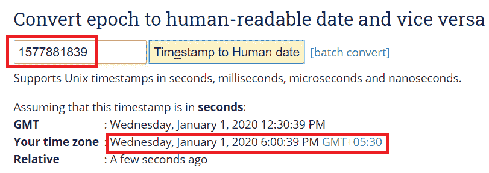
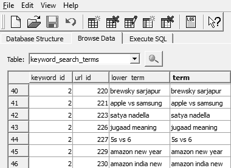
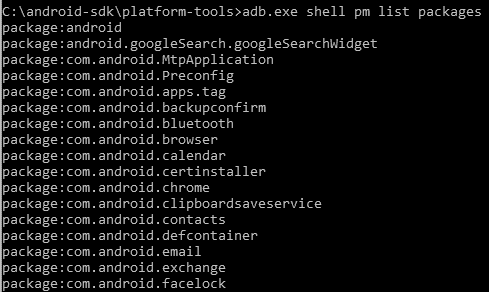
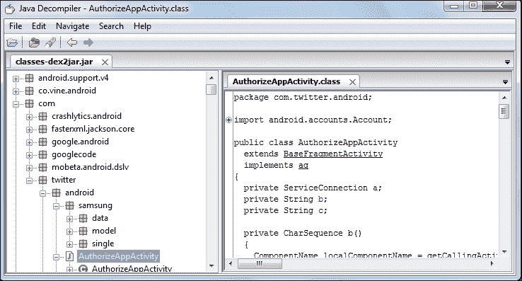
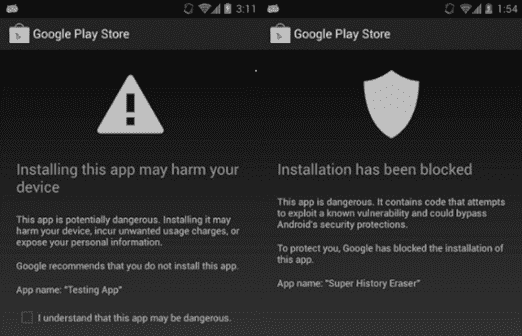
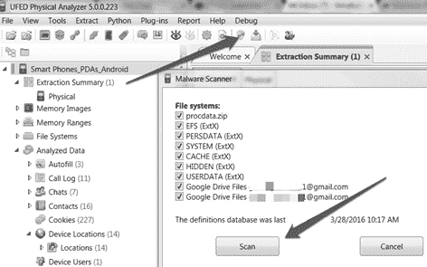

# 十一、安卓应用分析、恶意软件和逆向工程

智能手机用户通常使用第三方应用。安卓用户从谷歌 Play 等应用商店下载并安装几个应用。在法医调查期间，对这些应用进行分析以检索有价值的数据并检测任何恶意软件通常是有帮助的。例如，照片库应用可能会锁定设备上的敏感图像。因此，掌握识别照片库应用密码的知识非常重要。

此外，像脸书、WhatsApp、Skype 等应用如今被广泛使用，它们通常是有助于破案的宝贵数据来源。因此，了解这些应用存储什么样的数据以及这些数据的位置非常重要。虽然我们在前面几章中讨论的数据提取和数据恢复技术提供了对有价值数据的访问，但应用分析有助于我们获得关于应用细节的信息，例如首选项和权限。

在本章中，我们将涵盖以下主题:

*   分析广泛使用的安卓应用以检索有价值的数据
*   对安卓应用进行逆向工程的技术
*   安卓恶意软件

# 分析广泛使用的安卓应用以检索有价值的数据

在安卓系统上，用户与之交互的一切都是应用。虽然有些应用是由设备制造商预装的，但其他应用是由用户下载和安装的。例如，即使是常规功能，如联系人、呼叫、短信等，也是通过它们各自的应用来执行的。因此，在调查过程中，安卓应用分析至关重要。WhatsApp、脸书、Skype、Chrome 浏览器等多个第三方应用被广泛使用，处理了大量有价值的信息。根据应用的类型，这些应用大多将敏感信息存储在设备的内存或 SD 卡上。分析它们可以提供关于用户的位置细节、他们与其他人的通信等信息。使用我们前面描述的取证技术，可以访问这些应用存储的数据。然而，作为法医，你需要发展必要的技能，将可用的数据转化为有用的数据。当您全面了解应用如何处理数据时，就可以实现这一点。

正如我们在前面章节中讨论的，默认情况下，所有应用都将其数据存储在`/data/data`文件夹中。应用也可以在 SD 卡上存储某些其他数据，如果它们愿意的话，可以在安装时请求许可。可以通过检查`/data/data`文件夹的内容来收集设备上存在的应用的信息，但这并不简单，因为它需要分析该路径下的每个应用文件夹。或者，您可以查看`/data/system`下的`packages.list`文件。该文件包含所有应用的信息，以及它们的包名和数据路径。

这可以使用以下命令来执行:

```
# cat packages.list
```

以下是前面命令的输出:


Content of the packages.list file

现在，让我们具体看看一些被广泛使用并处理有价值数据的第三方应用。

The following apps are only being covered to make you familiar with the kind of data that can be extracted and the possible locations where the data can be obtained. You will need to take appropriate permissions and should abide by the legal rules before performing these tasks on a device. As we explained in [Chapter 8](08.html), *Android Forensic Setup and Pre-Data Extraction Techniques*, the following techniques only work after the device has been rooted. 

# 脸书安卓应用分析

脸书安卓应用是最广泛使用的社交网络应用之一。它将其信息存储在`com.facebook.katana`包内的`/data/data`文件夹中。以下详细信息概述了可以跨各种文件收集的信息类型:

*   **脸书联系人**:通过分析`contacts_db2`数据库可以检索到用户脸书联系人的信息，该数据库位于以下路径下:
    *   **路径** : `/data/data/com.facebook.katana/databases/contacts_db2`。
    *   `contacts_db2`数据库(SQLite 文件)包含一个名为 contacts 的表，该表包含了用户的大部分信息，如他们的名字、姓氏、显示名称和显示图片的 URL。

*   **脸书通知**:可以通过分析`notification_db`数据库来收集用户通知的信息，该数据库位于以下路径下:
    *   **路径** : `/data/data/com.facebook.katana/databases/notifications_db`。
    *   前面路径下的`gql_notifications`表保存用户信息。`seen_state`栏确认是否已经看到通知。`updated`栏指向通知更新的时间。`gql_payload`列包含通知和发送者信息。
*   **脸书消息**:脸书消息对话在某些情况下可能至关重要，可以通过分析`threads_db2`数据库查看:
    *   **路径** : `/data/data/com.facebook.katana/databases/threads_db2`
*   **来自新闻源**的视频:`/video-cache`文件夹包含从用户新闻源下载的视频。请注意，这些不是用户发布的视频，而是出现在其新闻提要上的视频:
    *   **路径** : `/data/data/com.facebook.katana/files/video-cache`
*   **来自新闻源**的图像:`/images`文件夹包含出现在用户个人资料上的各种图像，例如来自其新闻源和联系人个人资料图片的图像。该文件夹中有多个目录，图像可能以`.jpg`以外的格式存储，例如`.cnt`:
*   **路径** : `/data/data/com.facebook.katana/cache/images`
*   **新闻提要数据**:`newfeed_db`数据库包含在用户的新闻提要上显示给用户的数据。如下面的截图所示，分析该数据库将提供有价值的信息，例如设备何时加载了特定的故事(`fetched_at`列)，用户是否看到了特定的故事(`seen_state`列)，以及故事的相应文件在设备上的存储位置(`cache_file_path`列):
*   **路径** : `/data/data/com.facebook.katana/databases/newsfeed_db`:


The Facebook newsfeed.db file analyzed in SQLite browser 

在前面的截图中，`fetched_at`指定了获取该信息的日期和时间。请注意，该应用使用 Linux 纪元时间，也称为 Unix 时间或 Posix 时间来存储这些信息。这种格式经常被多个应用使用，因此值得一看。Linux 纪元时间存储为自 1970 年 1 月 1 日午夜以来的秒数(或毫秒数)。有几个在线网站，如[https://www.epochconverter.com/](https://www.epochconverter.com/)，可以很容易地将 Linux 纪元时间转换成正常格式。例如，下面的截图显示了转换为正常格式的 Linux 纪元时间 1，577，881，839:



Example of time format

现在我们已经对脸书应用进行了分析，让我们对下一个应用进行类似的分析，它就是 WhatsApp。

# WhatsApp 安卓应用分析

WhatsApp 是最受欢迎的聊天(音频和视频)消息服务，全球超过 10 亿人使用。它将其信息存储在`/data/data`文件夹下，包名为`com.whatsapp`。以下是从取证角度关注的重要文件的概述:

*   **用户个人资料图片**:用户个人资料图片以`me.jpg`文件名保存，显示在以下路径下:
    *   **路径** : `/data/data/com.whatsapp/me.jpg`
*   **用户的电话号码(与 WhatsApp 相关联)**:主文件夹下的`me`文件包含与用户的 WhatsApp 帐户相关联的电话号码。请注意，这可能是也可能不是与 SIM 卡关联的电话号码:
    *   **路径** : `/data/data/com.whatsapp/me`
*   **联系人档案图片**:`/avatars`目录包含用户联系人(使用 WhatsApp)的档案图片缩略图:
    *   **路径** : `/data/data/com.whatsapp/files/Avatars`
*   **聊天消息**:所有与消息相关的信息，包括聊天和发件人详细信息，都存在于`msgstore.db`文件中，该文件位于以下位置:
    *   **路径** : `/data/data/com.whatsapp/databases/msgstore.db`
*   **WhatsApp 文件**:与 WhatsApp 共享的大部分文件，如图像、视频、音频消息等，都存储在 SD 卡的以下位置:
    *   **路径** : `/sdcard/WhatsApp/Media`

发送和接收的文件分别存储在各自的文件夹名称中。

接下来，我们将看看另一个用于电信并专门提供视频聊天和语音通话的应用:Skype。

# Skype 安卓应用分析

Skype 是一款提供视频聊天和语音通话服务的应用。应用的数据存储在`/data/data`文件夹下，包名为`com.skype.raider`。以下是通过分析 Skype 应用可以提取的一些重要工件:

*   **用户名和 IP 地址**:以下路径下的`shared.xml`文件包含连接到 Skype 的用户名和最后一个 IP 地址的信息:
    *   **路径** : `/data/data/com.skype.raider/files/shared.xml`
*   **个人资料图片**:用户的个人资料图片出现在`/thumbnails`目录下，路径如下:
    *   **路径** : `/data/data/com.skype.raider/files/<username>/thumbnails/`
*   **通话记录**:关于 Skype 通话记录的信息可以在`main.db`文件中找到。分析这个文件给了我们很多信息:
    *   **路径** : `/data/data/com.skype.raider/files/<username>/main.db/`。
    *   例如，`duration`表提供了关于呼叫持续时间的信息，`start_timestamp`字段给出了呼叫的开始时间，`creation_timestamp`字段指示了呼叫开始的时间(这包括未应答的呼叫)。`type`列指示呼叫是呼入(值= `1`)还是呼出(值= `2`)。
*   **聊天消息**:出现在`main.db`文件中的`messages`表包含了所有的聊天消息。`author`和`from_dispname`栏提供了谁写的信息。`timestamp`栏显示消息的日期/时间。`body_xml`栏包含消息的内容:
    *   **路径** : `/data/data/com.skype.raider/files/<username>/main.db/`

*   **传输的文件**:`Transfers`表包含有关传输文件的信息，如文件名、文件大小及其在设备上的位置:
    *   **路径** : `/data/data/com.skype.raider/files/<username>/main.db/`。
    *   收到的实际图像或文件将存储在 SD 卡上。如果下载了一个文件，它会在 SD 根目录的`Downloads`文件夹中。
*   **群聊**:`ChatMembers`表显示了特定聊天中的用户列表。`adder`列显示发起对话的用户:
    *   **路径** : `/data/data/com.skype.raider/files/<username>/main.db/`

现在，我们将对 Gmail 应用进行分析。

# Gmail 安卓应用分析

Gmail 是谷歌提供的一种广泛使用的电子邮件服务。应用数据保存在`/data/data`文件夹下，包名为`com.google.android.gm`。以下是可以通过分析 Gmail 应用提取的重要工件:

*   **账户详情**:出现在`/shared_prefs`下的 XML 文件确认邮件账户详情。链接到当前电子邮件的其他帐户的详细信息可以从`Gmail.xml`文件中找到:
    *   **路径** : `/data/data/com.google.android.gm/cache/<username>@gmail.com`
*   **附件**:最近收发邮件使用的附件保存到`/cache`目录。这是有价值的，因为它让我们可以访问已经从电子邮件服务中删除的项目。每行还包含一个`messages_conversation`值。该值可以与电子邮件附件的`conversations`表进行比较。`filename`列标识文件所在设备上的路径。以下是此文件夹的确切路径:
    *   **路径** : `/data/data/com.google.android.gm/cache/<username>@gmail.com`:


List of attachments present under Gmail's cache directory

*   **邮件主题**:通过分析`mailstore.<username>@gmail.com.db`文件中的`conversations`表可以恢复该邮件的主题:
    *   **路径** : `/data/data/com.google.android.gm/databases/mailstore.<username>@gmail.com.db`
*   **搜索历史**:在应用内进行的任何文本搜索都存储在`suggestions.db`文件中，该文件位于以下位置:
    *   **路径** : `/data/data/com.google.android.gm/databases/suggestions.db`

让我们通过对谷歌 Chrome 应用进行最终分析来结束这一部分。

# 谷歌 Chrome 安卓应用分析

Google Chrome 是 Google Pixel 和许多其他设备上的默认网络浏览器，它被广泛用于浏览互联网。应用数据位于`/data/data`文件夹下，包名为`com.android.chrome`。以下是可以通过分析 Gmail 应用提取的重要工件:

*   **个人资料图片**:用户的个人资料图片以`Google Profile Picture.png`文件名保存在以下位置:
    *   **路径** : `/data/data/com.android.chrome/app_chrome/Default/ Google Profile Picture.png`

*   **书签**:`Bookmarks`文件包含与账户同步的所有书签的信息。通过分析此文件，可以收集网站名称、网址和书签时间等详细信息:
    *   **路径** : `/data/data/com.android.chrome/app_chrome/Default/Bookmarks`
*   **浏览历史**:`History.db`文件包含各种表格中存储的用户网页历史。例如，如下图所示，`keyword_search_terms`表包含使用 Chrome 浏览器进行搜索的信息:



Google Chrome browsing history

*   **登录数据**:数据库`Login Data`包含浏览器中保存的不同站点的登录信息。网站网址以及用户名和密码存储在相应的表中:
    *   **路径** : `/data/data/com.android.chrome/app_chrome/Default/Login Data`
*   **经常访问的网站**:`Top Sites`数据库包含经常访问的网站列表:
    *   **路径** : `/data/data/com.android.chrome/app_chrome/Default/Top Sites`

*   **其他数据**:其他信息，如用户在不同站点填写表单时输入的电话号码或电子邮件地址，存储在`Web Data`数据库中。该数据库中的任何表都包含自动填充数据:
    *   **路径** : `/data/data/com.android.chrome/app_chrome/Default/Web Data`

现在我们已经分析了不同的第三方应用，我们将看看我们可以用来反向工程安卓应用的技术。

# 对安卓应用进行逆向工程的技术

您可能需要处理阻碍访问所需信息的应用。例如，以手机上被*应用锁定的图库为例。在这种情况下，为了访问图库中存储的图片和视频，您首先需要输入密码到*应用锁定*。因此，了解*应用如何在设备上存储密码将会很有趣。您可以查看 SQLite 数据库文件。然而，如果它们被加密，那么甚至很难判断这是一个密码。在您想要更好地理解应用以及应用如何存储数据的情况下，逆向工程应用会很有帮助。**

简单地说，逆向工程是从可执行文件中检索源代码的过程。对安卓应用进行逆向工程是为了理解应用的功能、数据存储、适当的安全机制等等。在我们继续学习如何对安卓应用进行反向工程之前，这里简单回顾一下安卓应用:

*   安卓设备上安装的所有应用都是用 Java 编程语言编写的。
*   当一个 Java 程序被编译时，我们得到字节码。这被发送到一个 dex 编译器，该编译器将其转换成 Dalvik 字节码。
*   因此，使用 dx 工具将类文件转换为 dex 文件。安卓使用一种叫做**达尔维克虚拟机** ( **DVM** )的东西来运行它的应用。
*   JVM 的字节码由一个或多个类文件组成，这取决于应用中存在的 Java 文件的数量。无论如何，一个 Dalvik 字节码只由一个 dex 文件组成。

因此，运行应用所需的 dex 文件、XML 文件和其他资源被打包到 Android 包文件(APK 文件)中。这些 APK 文件只是 ZIP 文件中项目的集合。因此，如果您将 APK 扩展名文件重命名为`.zip`文件，那么您将能够看到该文件的内容。但是，在执行此操作之前，您需要访问手机上安装的应用的 APK 文件。下面是如何访问对应于应用的 APK 文件。

# 从安卓设备提取 APK 文件

手机预装的应用存储在`/system/app`目录中。用户下载的第三方应用存储在`/data/app`文件夹中。以下方法可帮助您访问设备上的 APK 文件；它适用于根设备和非根设备:

1.  通过发出`# adb.exe shell pm list packages`命令识别应用的包名。

以下是前面命令的输出:



List of package names present on the device

如前面的命令行输出所示，将显示包名称列表。尝试在有问题的应用和包名之间找到匹配项。通常，包名与应用名非常相关。或者，您可以使用安卓市场或谷歌游戏轻松识别包名。谷歌游戏中某个应用的网址包含包名，如下图所示:


Facebook App in the Google Play Store

2.  通过发出`adb shell pm path`命令，识别所需包的 APK 文件的完整路径名，如下所示:


Identifying full pathname of APK

3.  使用`adb pull`命令将 APK 文件从安卓设备拉至取证工作站:


adp pull command

现在，让我们分析一下 APK 文件的内容。安卓包是安卓应用资源和可执行文件的容器。这是一个压缩文件，包含以下文件:

*   `AndroidManifest.xml`:包含权限等信息。
*   `classes.dex`:这是已经被 dex 编译器转换成 dex 文件的类文件。
*   `Res`:应用的资源，比如图像文件、声音文件等等，都在这个目录中。
*   `Lib`:这包含应用可能使用的本机库。
*   `META-INF`:这包含应用的签名和包中所有其他文件的签名校验和的信息。

一旦获得了 APK 文件，您就可以对安卓应用进行逆向工程了。

# 对安卓应用进行逆向工程的步骤

APK 文件可以通过不同的方式进行逆向工程，以获得原始代码。下面是一种使用`dex2jar`和 JD-GUI 工具访问应用代码的方法。对于我们的例子，我们将检查`com.twitter.android-1.apk`文件。以下是成功反向工程 APK 文件的步骤:

1.  将 APK 扩展名重命名为 ZIP，以查看文件的内容。将`com.twitter.android-1.apk`文件重命名为`twitter.android-1.zip`，并使用任何文件归档程序应用提取该文件的内容。以下截图显示了从原始文件`twitter.android-1.zip`中提取的文件:


Extracted files of an APK file

2.  我们之前讨论的`classes.dex`文件可以在提取 APK 文件的内容后访问。这个 dex 文件需要转换成 Java 中的类文件。这可以使用`dex2jar`工具来完成。
3.  从[https://github.com/pxb1988/dex2jar](https://github.com/pxb1988/dex2jar)下载`dex2jar`工具，将`classes.dex`文件放入`dex2jar`工具目录，并发出以下命令:

```
C:\Users\Rohit\Desktop\Training\Android\dex2jar-0.0.9.15>d2j- dex2jar.bat classes.dex dex2jar classes.dex -> classes-dex2jar.jar
```

4.  前面的命令成功运行后，会在同一个目录中创建新的`classes -dex2jar.jar`文件，如下图截图所示:


The classes-dex2jar.jar file created by the dex2jar tool

5.  要查看这个 JAR 文件的内容，可以使用诸如 JD-GUI 之类的工具。如下图所示，可以看到安卓应用中存在的文件和相应的代码:



The JD-GUI tool

一旦我们访问了代码，就很容易分析应用是如何存储值、权限和更多可能有助于绕过某些限制的信息的。当在设备上发现恶意软件时，这种反编译和分析应用的方法可能会被证明是有用的，因为它将显示恶意软件正在访问什么，并提供数据发送到哪里的线索。以下几节将详细介绍安卓恶意软件。

# 安卓恶意软件

随着安卓市场份额的不断增加，针对安卓用户的攻击或恶意软件也在不断增加。移动恶意软件是一个宽泛的术语，指的是执行非预期操作的软件，包括特洛伊木马、间谍软件、广告软件、勒索软件和其他软件。根据 pandasecurity 的数据，安卓设备感染恶意软件的几率是 ios 设备的 50 倍([https://www . pandasecurity . com/media center/mobile-security/Android-比 iOS 多感染/](https://www.pandasecurity.com/mediacenter/mobile-security/android-more-infected-than-ios/) )。根据网络安全中心的新闻报道，2019 年，仅著名的特工史密斯恶意软件就感染了近 2500 万台安卓设备。

造成这种情况的主要原因之一是，与苹果公司严格控制的应用商店不同，谷歌的 Play Store 是一个开放的生态系统，没有任何详细的前期安全审查。恶意软件开发人员可以轻松地将他们的应用移动到游戏商店，从而分发他们的应用。谷歌现在有一个名为谷歌保镖的恶意软件检测软件，它会自动扫描上传的应用中的恶意软件，但攻击者已经找到了几种方法来保持不被发现。此外，安卓正式允许我们加载通过互联网下载的应用(侧面加载)，不像 iOS 不允许未签名的应用。

例如，如下图所示，当在安卓设备上选择“未知来源”选项时，它允许用户通过互联网安装从任何网站下载的应用:


Side-loading option in Android

众所周知，托管安卓应用的第三方应用商店是恶意软件的中心。这促使谷歌从安卓 4.2 开始推出*验证应用*功能，该功能在安卓设备上本地扫描应用，以寻找恶意活动，如短信滥用。如下图所示，“验证应用”功能可能会警告用户，或者在某些情况下甚至会阻止安装。但是，这是一项选择加入服务，因此如果用户希望:



Verify apps feature in Android

从安卓奥利奥开始，谷歌推出了一个名为“播放保护”的新功能，这是验证应用功能的更好版本。Play Protect 的主要工作是阻止或警告用户安卓设备上安装了恶意或有害的应用。例如，如下图所示，在应用安装过程中，“播放保护”功能可能会显示一条警告消息:


Play Protect feature

接下来，让我们看看恶意软件的类型。

# 安卓恶意软件的类型

有不同类型的恶意软件可以感染安卓设备。以下是一些最常见的例子:

*   **银行恶意软件**:可以作为假银行应用分发，窃取用户键入的银行凭据，或者从用户账户中窃取任何其他敏感个人信息。银行特洛伊木马可拦截或修改银行交易，并执行危险的操作，如发送、删除和拦截短信，以及按键记录。

*   **间谍软件**:间谍软件监控、记录并从目标设备向攻击者的服务器发送重要信息。这些信息可能包括短信、录音电话、屏幕截图、密钥日志、电子邮件或攻击者可能感兴趣的任何其他应用数据。BusyGasper 是卡巴斯基实验室专家在 2018 年初发现的一款间谍软件，它不仅拥有常见的间谍软件功能，例如从 WhatsApp、Viber 和脸书等流行的消息应用中收集信息，还拥有设备传感器监听器，包括运动检测器。
*   **广告软件**:广告软件是另一种流行的恶意或不需要的应用类型，在安卓设备上非常常见。检测起来相对容易，因为受害者会在他们的设备屏幕上收到连续的弹出窗口和广告。这种不需要的程序并不总是无害的，因为弹出窗口可能会导致下载另一个恶意软件，包括已经提到的类型-间谍软件和银行木马。
*   **Ransomware**:Ransomware 的主要目标是基于 Windows 的台式电脑和服务器，但它也存在于移动平台上，尤其是 Android 上。通常，它只会用赎金纸条锁定设备屏幕，但有时也会加密用户的数据。
*   **密码挖掘恶意软件**:密码货币现在非常流行，所以这种类型的恶意程序甚至适用于安卓等移动平台。这类应用的目标是利用受害者的设备计算能力来挖掘加密货币。偶尔，这种类型的恶意软件甚至会让智能手机硬件面临风险。

高级恶意软件也能够扎根设备并安装新的应用。例如，2016 年 2 月发现的安卓 Mazar 恶意软件通过短信传播，能够获得手机管理员权限，允许它擦拭手机、拨打电话或阅读文本。

A full list of Android malware families and their capabilities is available at [https://forensics.spreitzenbarth.de/android-malware/](https://forensics.spreitzenbarth.de/android-malware/).

一旦恶意软件进入设备，它就会执行危险的操作，其中一些操作如下:

*   发送和阅读您的短信
*   窃取敏感数据，如图片、视频和信用卡号
*   操作设备上的文件或数据
*   向优质号码发送短信

*   感染您的浏览器并窃取输入到其“更改设备设置”中的任何数据
*   擦除设备上的所有数据
*   锁定设备，直到支付赎金
*   连续显示广告

现在我们已经了解了不同类型的恶意软件，我们将了解恶意软件如何在您的设备中传播。

# 安卓恶意软件是如何传播的？

安卓设备可以通过几种不同的方式感染恶意软件。以下是一些可能的方法:

*   **重新打包合法应用**:这是攻击者最常用的方法。首先，攻击者下载合法的应用并将其反汇编。然后，他们添加恶意代码并重新组装应用。新的恶意应用现在的功能与合法应用完全一样，但它也在后台执行恶意活动。这类应用常见于第三方安卓应用商店，被很多人下载。
*   **利用安卓漏洞**:在这种情况下，攻击者利用安卓平台中发现的 bug 或漏洞来安装他们的恶意应用或执行任何不想要的操作。例如，2015 年发现的安装程序劫持被攻击者利用，在安装过程中用恶意软件替换安卓应用。
*   **蓝牙和彩信传播**:恶意软件也是通过蓝牙和彩信传播的。当设备处于可发现模式时，例如，当其他支持蓝牙的设备可以看到恶意软件时，受害者会收到恶意软件。在彩信的情况下，恶意软件会附加在邮件中，就像计算机病毒是如何通过电子邮件附件发送的一样。然而，在这两种方法中，用户必须同意至少一次来运行文件。
*   **App 下载恶意更新**:这种情况下，原本安装的 App 不包含任何恶意代码，但是代码内部存在的函数会在运行时下载恶意命令。这可以通过秘密更新或用户更新来完成。例如，浮游生物恶意软件使用秘密更新，直接从远程服务器下载一个 JAR 文件，不需要任何用户许可。在用户更新的情况下，用户必须允许应用下载新版本的应用。

*   **远程安装**:攻击者可能会破坏设备上用户帐户的凭据，从而在设备上远程安装应用。这通常发生在目标场景中，与我们刚才描述的前两种方法相比，频率较低。

现在，我们已经了解了安卓恶意软件可能的传播方式，让我们尝试识别恶意软件在您设备中的存在。

# 识别安卓恶意软件

从取证的角度来看，在执行任何分析之前，识别设备上是否存在任何恶意软件非常重要。这是因为恶意软件可以改变设备的状态或设备上的内容，从而使分析或结果不一致。市场上有工具可以分析物理提取来识别恶意软件。例如，Cellebrite UFED 物理分析器拥有 BitDefender 的反恶意软件技术，可以扫描恶意软件。如下图所示，一旦将物理映像加载到工具中，就可以对文件进行恶意软件扫描:



Scanning for malware in UFED Physical Analyzer

扫描开始后，BitDefender 软件会尝试解压缩`.apk`文件，并查找受感染或恶意的文件。这个过程是自动的，工具指向恶意应用，如下图所示:


Malware scanner results in UFED Physical Analyzer

该工具只是指出设备上存在恶意内容。法医调查人员必须通过分析相应的应用来手动确认这是否是一个有效的问题。这就是我们在前面章节中讨论的逆向工程技能需要被利用的地方。一旦对应用进行了逆向工程并获得了代码，建议您看一下`AndroidManifest.xml`文件，找出应用权限。这将有助于理解应用在哪里存储数据，它试图访问什么资源，等等。例如，手电筒应用不需要对 SD 卡数据进行读/写访问，也不需要拨打电话:


Permissions in the AndroidManifest.xml file

或者，您也可以将`.apk`文件上传到 VirusTotal，这是一项免费服务，可用于分析可疑文件中的恶意软件。VirusTotal 将针对 55 个防病毒引擎扫描您的文件。还需要注意的是，如果在`.apk`文件中混淆了细节，该工具可能无法识别有效案例。因此，作为一名法医调查员，开发必要的技能来逆向工程任何可疑的应用并分析代码以识别恶意行为是非常重要的。

在一些调查中，设备上存在的恶意软件的性质也可能导致得出某些关键结论，这可能会影响案件的结果。例如，考虑一家公司的内部调查，涉及向其他员工发送辱骂信息。识别发送消息的设备上的恶意软件将有助于破案。

# 摘要

安卓应用分析帮助法医调查员在设备的相关位置寻找有价值的数据。安卓应用的逆向工程是从 APK 文件中检索源代码的过程。使用某些工具，如`dex2jar`，安卓应用可以被逆向工程，以了解其功能和数据存储，识别恶意软件，等等。在这一章中，我们对不同的安卓应用进行了分析，现在我们能够从它们那里检索数据。我们还了解了不同类型的安卓恶意软件以及如何识别它们。像 UFED 物理分析器这样的工具都带有 BitDefender 软件，可以自动扫描恶意软件。

下一章将介绍如何在 Windows Phone 设备上执行取证。