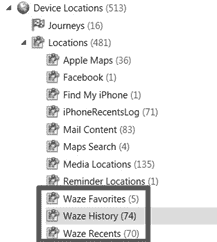
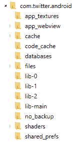
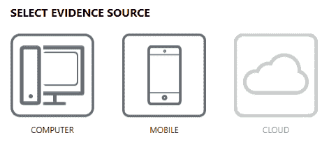
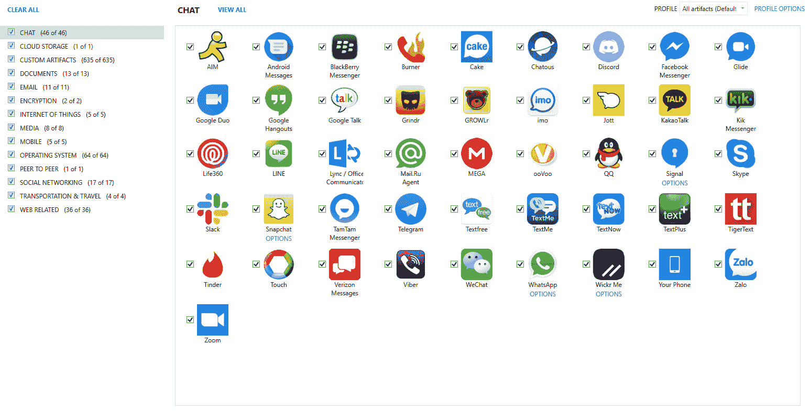
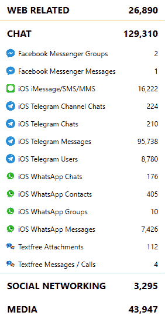
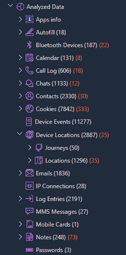
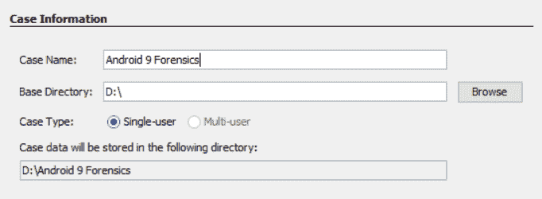
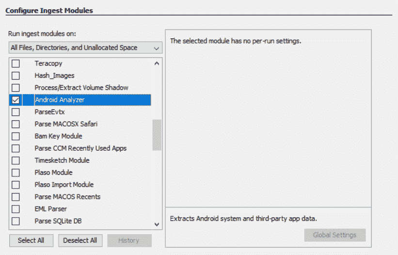

# 解析第三方应用程序文件

第三方应用已经席卷了智能手机社区。大多数智能手机用户的设备上都有不止一个应用程序，他们依靠这些应用程序来聊天、玩游戏、指路或分享图片。根据[https://www . statista . com/statistics/276623/app-number-in-leading-app-stores/](https://www.statista.com/statistics/276623/number-of-apps-available-in-leading-app-stores/)的数据，全球各种智能手机的应用数量接近 500 万。苹果的 App Store 提供了大约 180 万个应用，谷歌 Play 提供了 247 万个，亚马逊提供了 60 万个，Windows 提供了 67 万个。预计这一数字在 2020 年将呈指数级增长。

本章的目标是向您介绍在安卓、iOS 设备和 Windows Phones 上看到的各种应用程序。每个应用程序因版本和设备而异，但它们的底层结构是相似的。我们将看看数据是如何存储的，以及为什么偏好文件对您的调查很重要。

我们将在本章中详细介绍以下主题:

*   不同的第三方应用程序
*   应用程序如何存储在 iOS 设备上
*   应用程序如何存储在安卓设备上
*   Windows Phone 应用程序存储
*   如何使用商业和开源解决方案来解析应用程序数据

# 第三方应用程序简介

第三方应用程序是移动设备调查不可分割的一部分；通常，关键工件似乎存在于应用程序中。这要求您了解应用程序数据在设备上的存储位置，如何为该平台保存应用程序数据，以及哪种工具最有助于发现证据。在任何智能手机上检查第三方应用程序时，手动解析通常是一个关键因素。虽然一些商业工具，如 Belkasoft 证据中心或 Magnet AXIOM，以支持应用程序解析而闻名，但没有一个工具是完美的，工具几乎不可能跟上每个应用程序发布的频繁更新。

大多数情况下，您会发现可用的商业工具解析市场上最流行的应用程序。例如，当脸书购买 WhatsApp、Belkasoft、Cellebrite、Magnet Forensics 和 Oxygen Forensics 时，就开始支持这个应用程序。脸书非常受欢迎，但由于应用程序内置的安全功能，数据并不总是被提取或解析——这是所有应用程序都不同的地方。我们最好的建议是测试，测试，测试！您可以下载一个应用程序，填充数据，并检查结果，以了解您对证据的看法与您的实际证据相比如何。这个实践将使您能够理解更新如何改变工件，证据位置如何改变，以及如何手动提取您的工具缺少的工件。此外，对应用程序进行逆向工程并分析其代码将有助于您识别数据存储在哪里以及如何存储。

大多数应用程序不需要使用数据计划；它们可以通过 Wi-Fi 网络完全运行，这意味着如果一个人去了他们的设备通常无法工作的地区，应用程序仍然可以运行。例如，当我旅行时，我依靠 Skype、Viber 和 WhatsApp 给家人和朋友打电话和发短信。要使用这些应用程序，只需要将我的智能手机连接到无线网络即可。

在本书中，我们已经介绍了一些第三方应用程序提取和分析技巧。除此之外，我们在[第 5 章](05.html)、 *iOS 数据分析与恢复*中讨论了理解和分析应用数据需要检查的文件；[第十章](10.html)、*安卓数据分析与恢复*；[第十一章](11.html)、*安卓 App 分析、恶意软件、逆向工程*；以及[第十二章](12.html)、 *Windows Phone 取证*。本章将深入探讨应用程序和相关文件，并为您分析这些工件做准备。每个应用程序都有一个目的。大多数工具为每个类别中最流行的应用程序提供支持。剩下的就看你了。下面的截图显示了氧气法医检测工具提供的应用程序。不出所料，这些并不是设备上存在的所有应用程序；相反，这些只是工具知道如何解析的:


Example of applications parsed by Oxygen Forensic Detective on an Apple device

在下一节中，我们将分析一些广泛使用的聊天应用程序。

# 聊天应用程序

聊天应用是市场上最常见的应用之一。这些应用程序为用户提供了在网络服务提供商提供的标准服务之外聊天或通话的能力。与其他应用程序相比，这些应用程序通常更安全。我们所说的安全是指这些应用程序可能提供加密、私人档案、私人群聊等等。此外，这些应用程序使用户能够在不需要数据计划的情况下向他人发送消息或打电话，因为无线网络提供了他们所需的所有访问。Facebook Messenger、WhatsApp、Skype、Tango 和 Snapchat 是一些更受欢迎的应用程序。

解析聊天应用程序中的工件并不总是简单的。通常，需要多种工具和方法来提取其中的所有数据。商业工具可能只解析一部分数据，迫使您学习如何检查和恢复所有数据，否则会遗漏证据。在下面的截图中，氧气法医侦探被用来解析安卓设备上 Tango 的聊天信息。请注意，该消息不会在表格中显示图像。然而，这个图像可以被*拼接回消息中(注意屏幕截图显示的箭头指向它所属的消息)，以提供对话中共享内容的整体画面。这是一个手动过程，不是由工具执行的:*


An example of piecing application chat logs back together

接下来，我们将看看全球定位系统应用。

# 全球定位系统应用

大多数用户从他们的标准手机应用程序扩展到全球定位系统支持。这包括获取位置的方向和获取感兴趣区域的地图。常见的 GPS 应用包括 Waze 和谷歌地图。Waze 不仅仅是提供方向，它还提醒用户注意道路危险、交通和他们行驶路线上的警察:


The Waze application

其他存储位置信息的应用包括推特、Instagram、脸书和 Foursquare。这些应用程序使用户能够在创建帖子或共享图像或视频时提醒朋友和关注者他们的位置。所有这些交易都在应用程序中进行跟踪。理解这一点是发现取证工具没有报告的其他工件的关键。

当检查来自全球定位系统应用程序的位置信息时，最好假设您需要手动检查与该应用程序相关联的数据库和首选项文件。我们建议使用您的取证工具对设备上的数据进行分类，然后深入研究工件，这将在本章后面讨论。UFED 物理分析仪解析 Waze 的一个例子可以在下面的截图中找到。在这里，我们可以看到用户有 5 个喜爱的位置，74 个映射的位置，和 70 个最近的方向。如果这些信息与调查有关，则必须手动验证。这是因为该工具无法确定用户是否键入了地址，是否有人建议，或者用户是否曾前往该位置。您需要适当的技能来将用户与特定位置联系起来，这不仅仅需要取证工具:



The Waze application in UFED Physical Analyzer

我们现在将分析一些流行的安全消息应用程序。

# 安全应用程序

如果数据是安全的和自毁的，它曾经存在过吗？忽略数据保留的说法，寻找这些数据，因为这些应用程序经常会做出完全不真实的声明。尽管应用程序在设计时考虑到了安全性，但更新发布得很快，质量保证检查可能不足以涵盖所有内容。有时，您会发现一个应用程序有一个加密的或不存在的数据库，但该文件包括一个日志、预写日志或共享内存文件，其中包含聊天的部分应该是加密的。除此之外，用户还可以保存共享的媒体文件、拍摄对话截图等。通常情况下，您可能会发现共享的并且应该加密的图像、音频和视频文件。

一些流行的安全消息应用包括电报、威克和信号。其中一些是加密的，没有什么是可恢复的。然而，这一切都取决于设备、智能手机上运行的操作系统以及应用程序的版本。这些应用的安全级别是公开宣传的，但还是要半信半疑。您应该始终假设应用程序中可能存在漏洞，可能会为您提供合法访问。挖掘这个证据！

# 金融应用

利用金融信息(如信用卡信息和个人银行业务)的应用程序需要加密和安全。没有苹果 ID 和密码，iOS 设备不会获取这些应用。即使你有用户的 Apple ID 和密码，提取的数据仍然应该加密。一些金融应用的例子包括谷歌支付、微软钱包、贝宝、苹果支付和应用内购买。当您检查设备时，您可能会看到应用程序安装了相关的应用程序元数据，但帐户信息和交易将无法访问。

# 社交网络应用

社交网络应用的商业支持很强，因为它们是从应用商店下载的最受欢迎的应用。这些应用程序允许用户发帖、分享位置、公开和私下聊天，并基本上对他们的生活进行分类。常见的社交网络应用包括脸书、推特和 Instagram。通常情况下，用户可以使用一个应用程序，如 Instagram，访问脸书和推特，这样发布就可以无缝进行。因此，在检查设备时，由于应用程序之间的共享，用户可能会发现同一文件或对话的多个副本。

当用商业工具检查这些应用程序时，聊天和联系人通常会被解析，这意味着其他数据可能会被忽略。同样，这意味着您必须查看数据转储，以确保没有遗漏任何内容。举个例子，我们来看看推特。这个应用程序存储了大量信息，可能需要多个工具来解析。此外，用户可能必须手动检查数据库文件，以确保所有工件都已恢复。

让我们看看该工具能够提取什么。正如本书中多次提到的，从工具告诉您的安装内容开始，然后制定关键字和方法来深入挖掘文件系统。我们可以在下面的截图中看到 Twitter 的用户帐户信息，以及提取这些数据的文件路径:


Twitter as parsed by Magnet AXIOM

下一个合乎逻辑的步骤是查看该工具能告诉你关于应用程序的什么以及它是如何使用的。Magnet AXIOM 为推特账户的使用提供了以下信息。请注意，公共推文和私人消息(DMs)都会被恢复:


Twitter usage by Magnet AXIOM

在检查了工具解析的内容之后，应该检查数据库文件，以确保没有遗漏任何内容。这并不总是简单的，因为每个帐户和功能可能都有一个唯一的数据库。就功能而言，我们的意思是联系人可能存储在一个数据库中，而聊天和帐户信息存储在另一个数据库中。一旦您对常见应用程序变得更加熟悉，您将知道首先应该在哪里查找。

在下面的截图中，我们可以看到所有与推特相关的数据库。再次，从你所知道的开始，深入挖掘:


Twitter databases containing user activity

每个数据库都可能包含唯一的数据，这些数据可以被解析为其他工件。这些应用程序还包含独特的`user_id`值，可用作关键字来搜索调查中有通信痕迹的其他设备。

可以编写自定义查询来解析感兴趣的推特数据库。如何做到这一点的一个很好的例子如下所示。该查询专用于分析推特联系人:

```
SELECT _id AS "Index", 
user_id AS "User ID", 
username AS "Username", 
name AS "Name", 
datetime (profile_created/1000,'UNIXEPOCH','localtime') AS "Profile Created", 
description AS "Twitter Description", 
web_url AS "Website URL",
location AS "Location",
followers AS "Followers", 
friends AS "Following", 
users.statuses AS "Number of Tweets",
image_url AS "Profile Image URL", 
datetime (updated/1000,'UNIXEPOCH','localtime') AS "Profile Updated" 
FROM users
```

到目前为止，我们已经研究了各种第三方应用程序，以及工具如何帮助调查人员提取数据。我们现在将研究一些基本概念，这些概念将有助于研究者分析数据。

# 编码与加密

术语*编码*和*加密*在讨论应用程序和智能手机数据时使用得如此频繁，以至于经常混淆。编码本质上是混淆消息或信息片段以显示为原始代码的过程。在某些情况下，编码的目的是使计算机或用户无法识别数据。实际上，编码的主要目标是使用公开的方案将输入转换成不同的格式。换句话说，任何人都可以轻松解码编码值。然而，加密使用密钥对数据进行转换，以对其内容保密。所以，加密文本只有在你有密钥的情况下才能被反转。

大多数应用程序声称它们加密数据，或者数据从未保存到磁盘。虽然这对于一些人来说是真的，但大多数人只是简单地编码。编码选项可以有所不同，但智能手机数据最常见的选项是`Base64`。消息应用程序通常依靠`Base64`编码来使数据看起来隐藏或*安全*。`Base64`的一个常见伪像是当编码字节不能被 3 整除时，用`**=**`填充数据。

几年前，氧气取证和尸检是为数不多的两个支持对智能手机应用程序中的`Base64`有效载荷进行解码的工具。这些工具要解析数据，必须支持包含编码的应用程序。目前，MSAB、UFED 物理分析仪、磁铁 IEF 提供`Base64`解码支持。

下面的截图显示了一个`Base64`编码消息的例子。这些数据来自 Tango 聊天应用程序:


Base64-encoded Tango messages

加密有点困难，因为应用程序本身可能甚至不提供对加密数据的访问。例如，您可能会发现数据库目录或包含加密数据的单元格只是空的。有时，您可以访问数据库中的加密 blobs，但是这些数据不能总是被解密。同样，当你面对加密数据时，看看别处。你检查过日志和提前写日志了吗？您检查过缓存和媒体目录吗？你检查过 SD 卡了吗？这些都是常见的问题，你必须经常问自己，以确保你没有过于依赖你的取证工具，你覆盖你的基础，以确保没有什么被忽视。正如我们已经解释过的，从你所知道的开始。我们知道缓存和数据库目录存储用户数据，所以这是开始手动检查的好地方，如下面的截图所示:



Data storage locations for applications

在接下来的几节中，我们将介绍应用程序如何在设备中存储数据，以及各种存储选项的重要性。

# iOS、安卓和 Windows Phone 应用程序数据存储

几乎所有应用程序都依赖 SQLite 进行数据存储。这些数据库可以存储在设备内部或相关手机的 SD 卡上。当使用 SQLite 时，临时内存文件通常与每个数据库相关联，以提高 SQLite 的效率。这些文件是**回滚日志** ( **日志**)、**提前写日志** ( **WAL** )和**共享内存** ( **SHM** )文件。这些文件可能包含 SQLite 数据库中不存在的数据。我们可以在下面的截图中看到几个与各种 WhatsApp 数据库文件相关联的 WAL 和 SHM 文件:


An SHM file and WAL example

除了 SQLite 数据库之外，其他设备还依赖 Plist、XML、JSON 和 DAT 文件来存储应用程序数据、帐户数据、购买信息和用户偏好。这些文件将在本章的安卓、iOS 和 Windows Phone 部分讨论。

# iOS 应用程序

苹果依赖 SQLite 和 Plist 作为应用程序数据存储的常见位置。有时，JSON 文件将用于应用程序数据。检查从 iOS 设备恢复的应用程序可能会非常困难。我们建议你从你知道的和你的工具告诉你的开始。检查您选择的工具列出的已安装应用程序。从这里，直接转到应用程序目录，确保没有遗漏任何内容。当用户删除一个应用程序时，数据库通常会保留下来，并且与已安装应用程序的链接会断开。检查 iOS 设备的所有区域将防止您丢失数据:


Installed applications on an iPhone

检查安装的应用程序后，在`Library`和`Documents`目录中搜索任何可能包含应用程序工件的相关 Plist 文件。最后，检查 iPhone 上的`Media`目录以及与应用程序相关的目录，以恢复额外的工件，如共享的照片、视频、音频文件和个人资料图片。在下面的截图中，我们正在检查与 WhatsApp 应用程序关联的`Media`目录:


Application data on an iPhone

我们现在来看看安卓应用程序中的数据存储。

# 安卓应用

安卓设备在应用存储方面严重依赖 SQLite。每个应用程序的首选文件通常是 DAT 或 XML 文件格式。比起 iOS 设备，在安卓设备上检查应用程序可能是最乏味的任务之一。这是因为数据可能存储在不同的位置。最好从一个工具开始，该工具将提供设备上安装的内容列表。接下来，转到`/Root`目录下的子目录。请记住，这些应用程序可能拥有唯一的名称，并且可能很难找到。

您可能需要研究应用程序，以便更好地理解与它们相关联的文件名。以下截图是安卓设备上的应用程序目录示例:


Application data on an Android device

这些应用程序目录中的每一个都将包含大量要检查的数据。我们建议从`Databases`和`Cache`目录开始，然后将您的分析扩展到设备上的其他位置。接下来要检查的位置包括`Media`和`Cache`分区。如果数据似乎丢失或声称已被删除，不要忘记检查设备和 SD 卡上的`Downloads`目录。

应用数据可以存在于`Media`目录中的多个位置。使用一个工具，比如 UFED 物理分析器，它提供了超越解析项的关键字搜索功能，这将真正有助于定位与特定应用程序相关的工件。在下面的截图中，我们看到了安卓设备上`Media`目录中存储的大量数据。这些数据与前面讨论的应用程序目录中存储的数据不同。每个位置都需要彻底检查，以确保没有遗漏。重要的是，你要利用前几章学到的知识来分析安卓应用数据:


Unique application data in the Media directory

我们现在将看看安装在 Windows Phone 上的应用程序及其收购情况。

# Windows Phone 应用程序

Windows Phones 上的应用程序与 iOS 和安卓设备上的应用程序没有什么不同。SQLite 是最常用的数据存储格式。然而，并非所有设备都允许将 SQLite 文件存储在手机内部。对于这些设备，所有的应用数据都可以在 SD 卡上找到。有些人可能认为这是幸运的，因为它使我们不必检查设备上的几个位置，但是 SD 卡和应用程序本身可能是加密的。

在可能的情况下，最好移除 SD 卡并使用取证工具获取它。当这不可能时，下一个最好的方法是尝试使用取证工具通过手机获取 SD 卡。同样，这通常会导致数据丢失。作为最后的努力，可以通过安装设备并使用 Windows Explorer 查看存储在设备和 SD 卡上的应用程序来完成实时分析，如[第 12 章](12.html)、 *Windows Phone 取证*中所述。

# 用于提取第三方应用程序数据的取证方法

几乎所有的商业工具都会试图支持第三方应用程序的提取。如果您的调查结果依赖于工具输出，我们建议您全面、经常地测试您的工具。这是因为应用程序更新如此频繁，以至于工具几乎不可能不遗漏一些东西。您必须了解应用程序、它们的工作原理以及设备如何为每个应用程序存储数据。我们强烈建议您使用您的工具对案例进行分类，然后深入数据以手动提取工具遗漏的任何内容。确保您只在取证报告中包含事实数据，而不是工具解析的所有数据，因为工具无法破译设备和人类创造之间的差异。只有训练有素的考官才能自信地做到这一点。

# 商业工具

正如你在这本书里看到的，有很多工具可以处理智能手机取证的工作。然而，在解析应用程序数据时，有几个真正的亮点。Magnet AXIOM、氧气法医检测和 UFED 物理分析仪是在本章讨论的应用程序类别中做得很好的几个。我们将快速了解如何利用这些工具来解析应用程序数据。请记住，这些工具不会找到每个应用程序，也不会解析应用程序的所有数据。

# 氧气法医侦探

氧气法医检测可用于检查应用数据。对于本例，我们假设采集已完成，我们只是尝试分析数据。请注意，Oxygen 能够获取和分析智能手机。在这个例子中，我们用 Cellebrite UFED 获得了这个设备，并用 Oxygen 进行了分析。要加载设备的数据转储并检查其应用程序工件，请执行以下步骤:

1.  启动氧气法医侦探。
2.  选择“导入文件”选项并选择您的图像。摄取氧气时支持多种图像格式。
3.  解析完成后，开始检查已解析的应用程序:


The Oxygen Forensic Detective application view

4.  接下来，通过单击应用程序并检查所有相关联的文件，开始检查感兴趣的应用程序。

5.  选择应用程序后，您将看到已解析的数据和从中提取数据的完整文件路径。使用此路径手动验证调查结果。我们正在看下面截图中的 Pinterest 应用程序。注意容器、文件和感兴趣的表是如何为用户提供和超链接的。该工具甚至鼓励您深入挖掘并验证这些发现:


Oxygen Detective Pinterest example

Oxygen Detective 内置了关键词搜索、书签和报告功能。此外，SQLite 数据库和 Plist 查看器将为您提供检查相关应用程序数据的方法

6.  报告所有帐户信息、聊天记录、消息、位置和任何其他感兴趣的数据，因为这与您的调查相关。

我们将关注的下一个工具是 Magnet AXIOM。

# Magnet AXIOM

Magnet AXIOM 被认为是互联网和数字媒体应用解析领域的领导者之一。它与移动设备一样强大。同样，一个工具无法完成这项工作，但 AXIOM 已被证明是最强大的，并且解析了来自安卓、iOS 和 Windows Phones 的大多数应用程序。要使用 AXIOM 检查应用程序工件，请执行以下步骤:

1.  启动 AXIOM，创建一个新案例，然后选择 MOBILE(请注意，如果 MOBILE 呈灰色显示，您需要从 Magnet Forensics 获得提供移动支持的许可证):



Selecting the evidence source

2.  选择加载证据并导航到您的图像文件。可以同时加载和解析多个图像。

3.  选择转到工件详细信息，并确定要解析的内容。我们建议选择所有应用程序:



Magnet AXIOM supported artifacts

4.  选择分析证据。

5.  完成后，您可以使用工件:



Application Artifacts in Magnet AXIOM

考试的第一步是复习 AXIOM 解析过的内容。在前面的截图中，我们可以看到 Telegram 被解析了。在最相关的地方开始你的考试。例如，如果您正在寻找电报聊天，请直接前往该位置并开始检查工件。请注意，消息和聊天分为两个不同的类别。这在使用私人消息时很常见。应该检查所有相关的应用程序容器。此外，AXIOM 提供了恢复数据的完整文件路径。使用另一个工具导航到该文件进行验证和手动检查。

AXIOM 还提供了逻辑关键字搜索(它将搜索它能解析的内容，不搜索其他内容)、书签和报告。确保您只报告实际的应用程序工件，并将它们合并到您的最终取证报告中。

# UFED 物理分析仪

物理分析仪是市场上最知名的移动取证工具之一。除了利用该工具解析的数据之外，该工具还是手动进行检查的最佳平台之一。对于应用程序分析，Physical Analyzer 擅长解析每个受支持应用程序的聊天和联系人。对于未解析的数据，物理分析器提供了一个分析平台，使用户能够浏览文件系统以发现其他工件。关键字搜索在这个工具中是健壮的，并且能够搜索原始十六进制以及解析的数据。此外，还包括一个 SQLite 查看器。

要在物理分析器中对应用程序数据进行取证检查，请执行以下步骤开始:

1.  双击 UFED 快捷方式图像文件或双击工具图标，启动物理分析仪。
2.  加载图像文件，等待解析完成。
3.  检查解析后的工件，如下图所示:



Data parsed by Physical Analyzer

我们建议检查解析的内容，并参考提取数据的超链接。导航到此路径，然后检查整个应用程序目录。

要查找应用程序目录，请利用内置的关键字搜索功能来帮助调查。请记住，如果这一点不明显，您可能需要进行研究来确定与应用程序相关的文件名。

# 开源/免费工具

对于那些有预算的人来说，使用开源解决方案和廉价工具检查智能手机的应用数据是可能的。这些解决方案更难使用，对于需要数据提取和分析工具帮助的取证新手来说，它们通常不是解决方案。检查应用程序数据是乏味的，如果你不知道去哪里寻找，你可能需要花一些钱来获得领先。像安德列尔这样的工具可以花 500 美元左右买到。虽然这不是免费的，但也不是 10，000 美元，这是其他一些商业工具的成本。在下一节中，我们将介绍一些我们最喜欢的工具，这些工具有助于解析智能手机中的应用程序数据。

# 处理尸检

尸检是文件系统检查的最佳工具之一。不幸的是，iOS 解析没有在尸检中提供，但它仍然可能对文件系统映像有用。尸检可以从[http://sleuthkit.org/autopsy/](http://sleuthkit.org/autopsy/)下载。使用尸检时，安卓分析器模块将从设备中解析一些应用程序数据。让我们看看如何使用尸检进行安卓图像分析。

要使用尸检，请下载软件并将其安装在 Windows 机器上，然后按照以下说明操作。确保您始终使用最新版本:

1.  启动尸检。
2.  创建新案例:



Autopsy case creation

3.  选择下一步，然后单击完成。
4.  导航到您的图像文件并选择下一步。
5.  选择您希望运行的模块。关键词搜索和安卓分析器对于安卓设备来说将是最有成效的:



Autopsy module selection

摄取模块是尸检中内置的工具，可以在案件开始时或之后的任何时间运行。此版本尸检中的默认模块如下:

*   最近的活动:这将提取最近的用户活动，如网页浏览、最近使用的文档和安装的程序。
*   哈希查找:使用提供的哈希数据库(如标准的 NSRL 数据库)来识别已知的和值得注意的文件。它还允许导入自定义哈希数据库。
*   文件类型标识:这与基于二进制签名的文件类型相匹配。
*   档案提取器:提取档案文件(`.zip`、`.rar`、`.arj`、`.7z`、`.gzip`、`.bzip2`和`.tar`)。它会自动提取这些文件类型，并将它们的内容放入目录树。
*   EXIF 解析器:它吸收 JPEG 文件并检索它们的 EXIF 元数据。
*   关键字搜索:使用列表中的关键字和正则表达式执行文件索引和定期搜索。它允许加载自定义关键字/列表。
*   电子邮件解析器:该模块检测并解析`mbox`和`pst` / `ost`文件，并在黑板中填充电子邮件工件。
*   扩展名不匹配检测器:这些是基于文件类型具有非标准扩展名的标志文件。
*   E01 验证器:这验证了 E01 文件的完整性。
*   安卓分析器:这个提取安卓系统和第三方 app 数据。
*   有趣的文件标识符:这标识了定义的有趣的项目。

此外，您还可以为尸检安装第三方模块。其中一些对安卓取证真的很有用。马克·麦金农的 Parse SQLite DB 就是一个很好的例子。这个模块解析它找到的任何 SQLite 数据库，并将其导入到提取的内容中。这个和其他模块可以从这个 GitHub 下载:[https://github.com/markmckinnon/Autopsy-Plugins](https://github.com/markmckinnon/Autopsy-Plugins)

解剖提供了比任何商业或开源工具更快的文件系统数据访问。知道从那里去哪里是困难的部分。同样，从提取内容中的任何内容开始，然后深入文件系统检查本书中讨论的文件和任何相关的应用程序数据，如下面的截图所示:


Browsing the filesystem with Autopsy

一旦确定了感兴趣的应用程序，就从解析的内容开始，然后检查相关的数据库、缓存和首选项文件。尸检包括基本的 SQLite 查看器，可用于分流目的。如果您需要运行查询，我们建议将 DB Browser 用于 SQLite 或商业产品中包含的浏览器，例如 Belkasoft 证据中心，尤其是如果您想要分析自由列表和未分配空间中的数据。

安卓分析器可以自动解码一些人工产物，例如联系人、电话和短信。以下屏幕截图显示了解码短信的结果:


SMS messages decoded by Autopsy

现在，我们将研究更多提取数据的方法。

# 提取应用程序数据的其他方法

解析应用程序数据最简单的方法之一是创建自定义的 SQLite 查询和 Python 脚本来解析感兴趣的数据。在本书中，我们讨论了几个查询和脚本的建议和例子。Python 是最好的解决方案之一，因为它是免费的，我们可以完全访问它的库。需要记住的一点是，我们的脚本必须经常更新，以跟上应用程序的更新。此外，确保您的编码模式是正确的，以防止应用程序工件被遗漏或没有被正确解释。

除了 Python 脚本，支持应用程序提取的免费解析器已经存在。WhatsApp Extract 是安卓和 iOS 的免费工具，将从设备中提取 WhatsApp 应用数据。通常，这个免费工具会比商业解决方案提取更多的数据，这取决于用户在安装过程中分配的权限。其他人，如玛丽·德格拉齐亚([http://az4n6.blogspot.in/p/downloads.html](http://az4n6.blogspot.in/p/downloads.html))、梁家杰([https://github.com/cheeky4n6monkey/4n6-scripts](https://github.com/cheeky4n6monkey/4n6-scripts))、莎拉·爱德华兹([https://github.com/mac4n6](https://github.com/mac4n6))和亚历克西斯·布里格诺尼([https://github.com/abrignoni](https://github.com/abrignoni))都开发了脚本来解析应用程序、从 SQLite 空闲页面中恢复删除的数据、解码`Base64`等等。我们建议在开发自己的产品之前，先使用现有的产品。

# 摘要

在本章中，我们学习了如何从流行的第三方应用程序中成功解析和提取数据。许多应用并不是他们声称的那样。永远不要相信你读到的关于应用程序的内容，因为跨应用程序的质量保证测试并不一致，多年来，我们已经确定了几个漏洞和安全缺陷，为我们提供了将应用程序数据拼接在一起的方法。此外，应用程序更新将改变我们查看找到的数据的方式。了解每部智能手机及其存储应用程序数据的方式是成功检查智能手机上的应用程序的第一步。知道更新可能会改变数据位置、编码和加密，以及您的工具如何工作，是审查员最难理解的概念之一。您的工作是学习应用程序的功能，从移动设备中发现最多的数据。

无需考虑如何提取工件，理解一个应用程序如何工作就足够困难了。正如你在这本书里读到的，有很多方法可以解析智能手机的数据。一个工具永远不够，现实是移动取证可能很昂贵。我们希望我们为您提供了一份实用指南，教您如何获取和分析从智能手机中回收的文物。把你学到的东西立即应用到你的方法中，进行移动取证，或者用它来让你为下一份工作做好准备。请记住，实践、测试和培训将使您更好地工作，并将帮助您完善移动取证艺术。