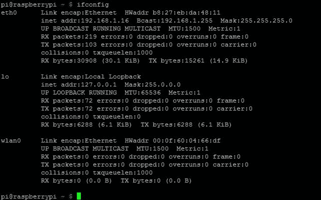

# 一、从任何地方与您的树莓派建立远程桌面连接

在这个项目中，我们将对 Pi 和安卓平台进行温和的介绍，让我们感到温暖。许多树莓派用户在希望管理树莓派时也面临类似的问题。你必须靠近你的树莓派，并连接一个屏幕和一个键盘。我们将通过远程连接到我们的 Pi 桌面界面来解决这个日常问题。本章涵盖以下主题:

*   先决条件
*   在你的 Pi 中安装 Linux
*   对设置进行必要的更改
*   在 Pi 和 Android 中安装必要的组件
*   连接树莓派和安卓

# 先决条件

本章中使用了以下项，这些项是完成项目所需的:

*   **覆盆子皮 2 B 型**:这是覆盆子皮家族的最新成员。它已经取代了以前的 Pi 1 模型 B+。对于本书所涵盖的项目来说，前面的模型应该可以很好地工作。
*   **MicroSD 卡**:树莓派 基金会建议使用 8gb 6 级 MicroSD 卡。
*   **安卓设备**:设备至少要有 1.5 或更高的安卓版本，这是本章使用的 app 所要求的。在接下来的一些令人兴奋的项目中，我们将需要安卓 4.3 或更高版本。
*   **HDMI 电缆**:这将用于将 Pi 连接到屏幕进行初始设置。
*   **以太网电缆**:这将用于网络连接。
*   **计算机**:这将用于将 Raspbian 操作系统复制到 microSD 卡上。
*   **USB 鼠标**:初始设置时会用到。

下图为树莓皮 2 B 型:


树莓皮 2 乙型

# 在你的 Pi 上安装 Linux

我们将使用 **Raspbian** 作为我们 Pi 上的操作系统。我的选择完全是基于覆盆子皮基金会的推荐。它基于 Debian 版本的 Linux，并针对树莓派 硬件进行了优化。除了是树莓派 最常用的操作系统之外，它还包含了几乎 35000 个包，比如游戏、邮件服务器、办公套件、互联网浏览器等等。在撰写本书时，最新版本的日期是 2015 年 5 月 5 日。

安装 Raspbian 主要有两种方式。您可以将操作系统映像作为一个整体使用，也可以从一个名为 **NOOBS** 的易于使用的工具操作系统包开始。我们将在这里讨论这两种情况。

### 注

有 SD 卡出售，NOOBS 或拉斯比安已经安装。获得其中一个并跳过本章的操作系统安装部分可能是个好主意。

然而，在我们开始之前，我们可能需要格式化我们的 SD 卡，因为以前的操作系统安装可能会损坏该卡。即使您使用计算机操作系统提供的格式化工具格式化了卡，如果卡上只有一小部分可用空间，您也会注意到这一点。我们将使用的工具被称为**标清格式化程序**，并且在[https://www.sdcard.org/downloads/formatter_4/index.html](https://www.sdcard.org/downloads/formatter_4/index.html)的**标清协会**T5 中的可用于 Mac 和 Windows。安装并启动它。您将看到如下界面，要求您选择 SD 卡位置:


标清格式器接口

## 使用 NOOBS 安装

最新版本的 NOOBS 可以在[http://downloads.raspberrypi.org/NOOBS_latest](http://downloads.raspberrypi.org/NOOBS_latest)找到。下载并提取 SD 卡上的内容。将卡连接到您的 Pi，并使用 HDMI 电缆将其连接到屏幕。不要忘记连接 USB 鼠标。当树莓派连接到电源时，你会看到一个可供选择的列表。检查列表中的**锉刀**安装选项，然后点击**安装**。这将在你的 SD 卡上安装拉斯扁，并重新启动树莓派。

## 使用锉刀图像安装

拉斯扁操作系统的最新版本可以在 http://downloads.raspberrypi.org/raspbian_latest 的 T2 找到。ZIP 文件的大小几乎是 1 GB，包含一个扩展名为`.img`的单个文件，大小为 3.2 GB。解压缩内容，并按照下一节中的步骤将其解压缩到合适的 microSD 卡。

## 将操作系统映像提取到 SD 卡

要提取一个图像文件，我们需要一个磁盘成像工具，我们将使用一个免费提供的名为**的 Win32 磁盘成像器**的工具。可在[http://sourceforge.net/projects/win32diskimager/](http://sourceforge.net/projects/win32diskimager/)下载。在 Mac OS 上，有一个类似的工具叫做 **ApplePi Baker** ，可以在[http://www . twaining 4 all . com/hardware/树莓-pi/macosx-apple-pi-baker/](http://www.tweaking4all.com/hardware/raspberry-pi/macosx-apple-pi-baker/) 上找到。下载并安装到你的电脑上。安装将包含一个可执行文件`Win32DiskImager`，您应该在管理员模式下通过右键单击它并选择**以管理员身份运行**来启动该文件。

在 **Win32 磁盘成像仪**窗口中，您应该选择已经提取的图像文件和 SD 卡的驱动器，如下图所示:


Win32 磁盘成像仪窗口

点击**写入**按钮上的将开始该过程，您的 SD 卡将准备插入 Pi。

# 对设置进行必要的更改

当 Pi 还插在带 HDMI 的屏幕上时，用以太网连接到网络。Pi 第一次启动时，您将看到一个设置实用程序，如下图所示:


树莓派 软件配置工具

您可以选择列表中的第一个选项**展开文件系统**。选择第三个选项**启用引导至桌面**。

在以下菜单中，选择列表中的第二项，即**桌面在图形桌面**以用户“pi”身份登录。然后，选择 **<【完成】>** 并选择**是**重新启动设备。


在配置工具中选择桌面启动

重启后，你将看到拉斯扁的默认桌面管理器环境，名为 **LXDE** 。

# 在 Pi 和安卓中安装必要的组件

如下图所示，LXDE 桌面管理器附带了初始设置和一些预安装的程序:


LXDE 桌面管理环境

通过点击顶部标签栏上的屏幕图像，您将能够打开一个终端屏幕，我们将使用它向 Pi 发送命令。

下一步是安装一个名为`x11vnc`的组件。这是一个 VNC 服务器，用于 Linux 的窗口管理组件。在终端上发出以下命令:

```py
sudo apt-get install x11vnc

```

这将下载并将`x11vnc`安装到 Pi。我们甚至可以使用以下命令设置将远程桌面连接到此 Pi 的 VNC 客户端使用的密码，并提供稍后使用的密码:

```py
x11vnc –storepasswd

```

接下来，只要 Pi 重启，LXDE 桌面管理器启动，我们就可以让`x11vnc`服务器运行。这可以通过以下步骤完成:

1.  进入位于`/home/pi` :

    ```py
    cd /home/pi/.config

    ```

    的 Pi 用户`home`目录中的`.config`目录
2.  在此创建一个名为`autostart` :

    ```py
    mkdir autostart

    ```

    的子目录
3.  进入`autostart`目录:

    ```py
    cd autostart

    ```

4.  Start editing a file named `x11vnc.desktop`. As a terminal editor, I am using `nano`, which is the easiest one to use on the Pi for novice users, but there are more exciting alternatives, such as **vi**:

    ```py
    nano x11vnc.desktop

    ```

    将以下内容添加到该文件中:

    ```py
    [Desktop Entry]
    Encoding=UTF-8
    Type=Application
    Name=X11VNC
    Comment=
    Exec=x11vnc -forever -usepw -display :0 -ultrafilexfer
    StartupNotify=false
    Terminal=false
    Hidden=false
    ```

5.  如果使用 **nano** 作为您选择的编辑器，请依次使用( *Ctrl* + *X* 、 *Y* 、 *Enter* 保存并退出。
6.  Now you should reboot the Pi to get the server running using the following command:

    ```py
    sudo reboot

    ```

    使用`sudo reboot`命令重新启动后，我们现在可以通过发出`ifconfig`命令来找出我们的 Pi 在终端窗口中给定了什么 IP 地址。分配给您的 Pi 的 IP 地址将在`eth0`条目下找到，并在`inet addr`关键字后给出。写下这个地址:

    

    ifconfig 命令的输出示例

7.  The next step is to download a VNC client to your Android device.

    在这个项目中，我们将为安卓系统使用一个免费的客户端，即 **androidVNC** 或者正如其在 Play Store 中的命名一样—**androidVNC 团队+鹿角形**为安卓系统使用的 **VNC 浏览器**。撰写本书时使用的最新版本是 0.5.0。

    ### 注

    注意为了能够将你的安卓 VNC 客户端连接到 Pi，Pi 和安卓设备应该连接到同一个网络——安卓通过 Wi-Fi，Pi 通过它的以太网端口。

# 连接树莓派和安卓

安装并打开设备上的 androidVNC。您将看到第一个活动用户界面，询问连接的详细信息。这里需要提供连接的**昵称**、运行`x11vnc` `–storepasswd`命令时输入的**密码**以及使用`ifconfig`命令找到的 Pi 的 IP **地址**。通过按下**连接**按钮启动连接，现在您应该可以在您的安卓设备上看到 Pi 桌面。

在 androidVNC 中，你应该可以通过点击屏幕来移动鼠标指针，在 androidVNC 应用的选项菜单下，你会发现如何在*回车*和*退格*的帮助下向 Pi 发送文本和按键。

### 注

你甚至会发现从另一台电脑连接到 Pi 很方便。我建议为此使用 RealVNC，它在 Windows、Linux 和 Mac OS 上都可用。

## 如果我想在 Pi 上使用 Wi-Fi 怎么办？

要在树莓派上使用无线加密狗，首先使用`nano`编辑器打开`wpa_supplicant`配置文件，命令如下:

```py
sudo nano /etc/wpa_supplicant/wpa_supplicant.conf

```

在文件末尾添加以下内容:

```py
network={
    ssid="THE ID OF THE NETWORK YOU WANT TO CONNECT"
    psk="PASSWORD OF YOUR WIFI"
}
```

### 注

我假设您已经将无线家庭网络设置为使用 WPA-PSK 作为身份验证机制。如果有其他机制，请参考`wpa_supplicant`文档。LXDE 提供了通过图形用户界面连接到无线网络的更好方法。可以在树莓派上的桌面环境右上角找到。

## 从任何地方连接

现在，我们已经从我们的设备连接到 Pi，我们需要连接到与 Pi 相同的网络。然而，我们大多数人也想从世界各地连接到树莓派。为此，首先我们需要现在我们的网络提供商分配给我们的家庭网络的 IP 地址。通过访问[http://whatismyipaddress.com](http://whatismyipaddress.com)的网址，我们可以知道我们家庭网络的 IP 地址是什么。下一步是登录我们的路由器，打开来自世界各地的 Pi 请求。为此，我们将使用大多数现代路由器上的一种功能，称为**端口转发**。

### 注

注意港口转运中包含的风险。您正在从世界各地向恶意用户开放对您的 Pi 的访问。我强烈建议您在执行此步骤之前更改用户`pi`的默认密码。您可以使用`passwd`命令更改密码。

通过登录路由器的管理门户并导航到**端口转发**选项卡，我们可以打开请求到 Pi 的内部网络 IP 地址，这是我们之前已经计算出来的，以及 VNC 服务器的默认端口，这是`5900`。现在，我们可以从世界任何地方向 androidVNC 提供我们的外部 IP 地址，而不是只有当我们与 Pi 在同一个网络上时才有效的内部 IP 地址。


Netgear 路由器管理页面上的端口转发设置

### 注

参考路由器的用户手册，了解如何更改**端口转发**设置。大多数路由器要求您通过以太网端口连接，以便访问管理门户而不是无线网络。

# 动态局域网 IP 地址和外部 IP 地址的问题

这个设置有一个小问题。Pi 可能会在每次重启时获得一个新的局域网 IP 地址，使得**端口转发**设置无用。为了避免这种情况，大多数路由器提供**地址预留**设置。您可以告诉大多数路由器，每次连接具有唯一媒体访问控制地址的设备时，它都应该获得相同的 IP 地址。

另一个问题是，您的**互联网服务提供商** ( **互联网服务提供商**)可能会在您每次重启路由器或出于任何其他原因时为您分配新的 IP 地址。您可以使用动态域名系统服务，如动态域名系统，来避免此类问题。大多数路由器都能够使用动态域名服务。或者，您可以通过联系您的互联网服务提供商来获取静态 IP 地址。

# 总结

在这个项目中，我们安装了 Raspbian，用 Pi 预热，在上面启用桌面环境，并使用安卓设备连接到 Pi。

在下一章中，我们将直接访问 Pi 的控制台，甚至使用 FTP 从我们的安卓设备向它传输文件。