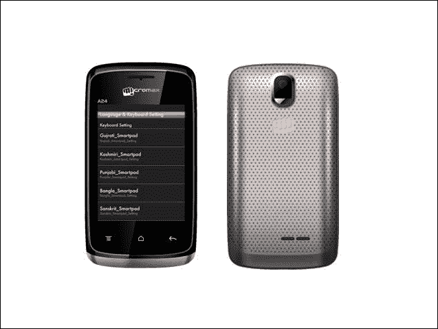
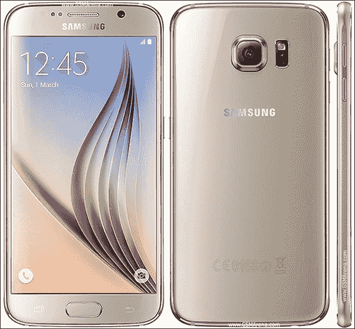
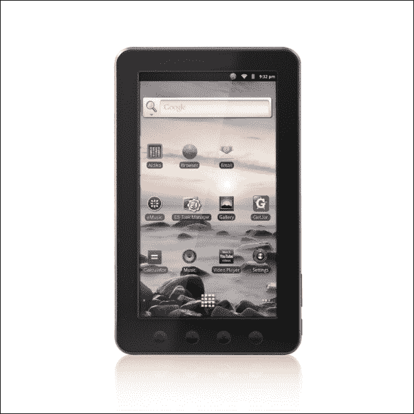
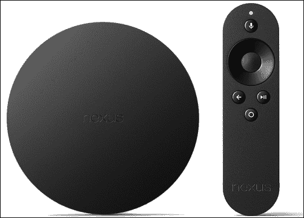
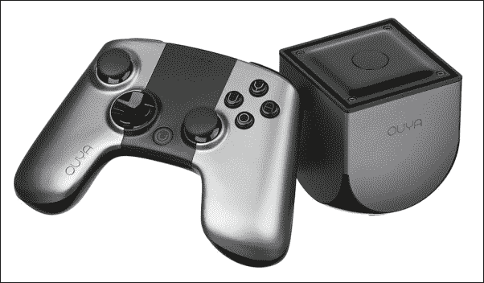
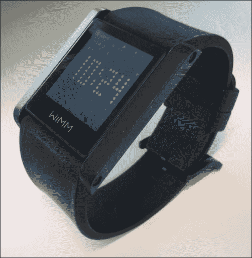

# 二、不同安卓平台介绍

第一款商业发布的安卓设备是 **宏达梦想**。2008 年，这款手机推出了一款全新的基于 Linux 的操作系统——安卓。从那以后，成千上万的制造商已经在他们的设备上使用安卓系统。起初，安卓在塞班、Java ME、黑莓和 iOS 等移动操作系统中很受欢迎。新一代技术需要一种新的、轻量级的、用户友好的、价格合理的操作系统。安卓满足了这些要求，并比黑莓和其他竞争对手的操作系统更快地获得了发展势头。

根据最新的市场研究，2016 年第一季度，安卓占据了 76%的市场份额，这本身就解释了它的成功。随着时间的推移，安卓已经从移动领域扩展到平板电脑、电视、手表、游戏机等其他有用的硬件平台。

在本章中，我们将从游戏开发的角度来探讨这些平台。让我们快速浏览一下将要讨论的主题:

*   探索安卓手机
*   探索安卓平板电脑
*   探索安卓电视
*   探索安卓控制台
*   探索安卓手表
*   安卓手机发展洞察
*   安卓平板电脑的发展洞察
*   安卓电视和机顶盒的发展洞察
*   安卓主机的发展洞察
*   安卓手表的发展洞察
*   每个平台都有自己的特长
*   为了同一个游戏跨平台
*   设计前所需的极限测量

为了开发游戏，我们将努力了解所有平台及其细节。现代世界已经见证了游戏现在不仅仅局限于个人电脑或游戏机。他们已经成为几乎一切的一部分。因此，对安卓游戏开发者来说，对所有可能对游戏有用的硬件有一个相当好的了解是非常重要的，这为更多的人打开了机会。

# 探索安卓手机

安卓移动设备是游戏开发者最重要的设备。在过去的十年里，移动技术经历了一场巨大的革命，从黑白像素手机到现代智能手机。目前，与最接近的竞争对手 iPhone 相比，安卓移动设备以巨大的优势领先市场。

最初的安卓游戏在安卓 1.6 版本发布后获得了势头，随后是安卓 2.3 版本。即使在今天，也有很多设备运行在安卓 2.3 上。这就是为什么许多流行的跨平台游戏引擎支持安卓 2.3 的原因。

曾经有一段时间，安卓系统在运行时至少需要 32 MB 的内存、32 MB 的磁盘空间以及 200 兆赫的处理器。如果我们看一下当前的器件规格，可以注意到一个剧烈的变化。现在安卓移动设备平均有 1 GB RAM，1 GHz 处理器，4 GB 磁盘空间。大多数设备都有多核处理单元。然而，这种崛起并没有简化游戏开发者的生活；相反，它更加增加了复杂性。

让我们看看配置相对较低的低预算安卓设备的规格。以下示例表显示了 Micromax 螺栓 A24 的配置:

<colgroup><col style="text-align: left"> <col style="text-align: left"></colgroup> 
| **处理器** | 皮质 A5 |
| **速度** | 1 千兆赫 |
| ram | 256 兆字节 |
| **闪存** | 512 兆字节 |
| **屏幕模式** | 钠 |
| **屏幕分辨率** | 480x640 |
| **屏幕尺寸** | 2.8 英寸 |
| **Android 版本** | 2.3(姜饼) |

下面是它的样子(图片来源:[http://www . androided . in/WP-content/uploads/2014/02/Micromax-bolta 24 . jpg](http://www.androided.in/wp-content/uploads/2014/02/Micromax-BoltA24.jpg)):



现在来看看一款配置非常高的超高预算安卓设备。下表显示了一款三星 Galaxy S6 的配置:

<colgroup><col style="text-align: left"> <col style="text-align: left"></colgroup> 
| **处理器** | 皮质 A57 |
| **速度** | 2.1 GHz 四核处理器 |
| ram | 3 GB |
| **闪存** | 128 GB |
| **屏幕模式** | 钠 |
| **屏幕分辨率** | 1440x2560 |
| **屏幕尺寸** | 5.1 英寸 |
| **Android 版本** | 5.0.2(棒棒糖) |

这里是它的样子(图片来源:[http://talishop.ru/data/big/eew.jpg](http://talishop.ru/data/big/eew.jpg)):



每个安卓游戏开发人员都应该很清楚这样一个事实，即单个游戏构建无法在所有配置中实现最佳性能。很明显，如果游戏在 Micromax Bolt A24 设备上运行良好，那么它在三星 Galaxy S6 上的表现肯定会不如人意。“表现不佳”这个词，是指三星 Galaxy S6 上的游戏质量将远低于预期。因此，对游戏可移植性有所了解是一个非常好的思路。我们将在稍后详细讨论这一点。

下图为 2012 年以来手机的市场份额:


如你所见，大部分市场被安卓占据，iOS 落后，两者之间有巨大差距。

其余的移动操作系统，如 Windows Phone、黑莓、Java、Symbian、Bada、QT 等都离他们很远。所以，可以预见，未来的手机市场将由安卓和 iOS 主导。

安卓手机市场一天比一天大。设计和开发都变得越来越难，越来越难，越来越激烈。每天，在谷歌 Play 商店、亚马逊应用商店、一些职业专营店和更多的个人在线网站上，都有成千上万的安卓手机新游戏推出。

我们之前讨论过游戏的目标受众。在探索安卓移动设备的同时，我们需要了解用户群体。在大多数情况下，用户类别由设备配置或价格组识别。

# 探索安卓平板

安卓平板与安卓手机非常相似。安卓手机和安卓平板电脑的主要规格差异在于物理尺寸和屏幕分辨率。一般来说，安卓平板电脑的生产者价格指数比手机低。然而，没有硬性规定或任何具体的制度来衡量这一点。

运行安卓系统的最低要求是 200 兆赫处理器、32 兆内存和 32 兆磁盘空间。安卓需要 ARMv5 或更高的处理器，尽管安卓 4 需要 ARMv7。以前，入门级平板电脑几乎只有最少的硬件系统。

平板电脑从平板电脑的概念演变而来；它们由触摸屏显示器、摄像头、麦克风、扬声器和一些物理按钮组成。平板电脑通常比手机或掌上电脑大。

最低配置安卓平板电脑之一是克比居鲁士 MID7047，如下图(图片来源:[http://www.evisionstore.com/catalogo/coby_mid7012-4g.jpg](http://www.evisionstore.com/catalogo/coby_mid7012-4g.jpg)):



下面的表显示了其规格:

<colgroup><col style="text-align: left"> <col style="text-align: left"></colgroup> 
| **处理器** | 皮质 A5 |
| **速度** | 1 千兆赫 |
| ram | 512 兆字节 |
| **闪存** | 4 GB |
| **屏幕模式** | WVGA(消歧义) |
| **屏幕分辨率** | 800x480 |
| **屏幕尺寸** | 7.00 英寸 |
| **Android 版本** | 4.0 (ICS) |

【2013 年，安卓平板销量约为 62%，设备数量超过 1.21 亿台。为了增加这个数字，亚马逊 Kindle Fire 售出了大约 700 万台设备。

随着安卓平板的体积增大，配置也越来越好。我们来看看索尼在 2015 年 6 月发布的一款平板电脑配置。该机型名为索尼 Xperia Z4(图片来源:[https://tecnogonic 1 . WP engine . com/WP-content/uploads/2015/03/Z4 tab . png](https://tecneticoc1.wpengine.com/wp-content/uploads/2015/03/z4tab.png)):


以下表显示了其规格:

<colgroup><col style="text-align: left"> <col style="text-align: left"></colgroup> 
| **处理器** | Snapdragon 810 |
| **速度** | 2 GHz 八核 |
| ram | 3 GB |
| **闪存** | 32 GB |
| **屏幕分辨率** | 2560x1600 |
| **屏幕尺寸** | 10.1 英寸 |
| **Android 版本** | Android 5.0(lolipo) |

我们可以清晰的观察到两个平板之间巨大的配置差异。有趣的是，即使在今天，这两种配置也在市场上共存，人们正在购买它们。

安卓平板电脑通常比智能手机更大更重。它们还具有更好的电池容量。所以平板电脑游戏应该是节能的。然而，现代平板电脑与智能手机没有太大区别。智能手机的尺寸越来越大，智能手机的功能也被添加到平板电脑中。现在，人们甚至可以将平板电脑用作手机。

# 探索安卓电视和机顶盒

继安卓手机和平板成功后，安卓开始向其他硬件平台拓展版图。电视成为下一个目标，因为智能电视的概念已经进入市场。于是，一台电视机通过安卓变成了互动的。谷歌为安卓电视发布了一些额外的配件，以提高用户体验。

第一款面向消费者推出的安卓电视设备是 2014 年 11 月 3 日推出的 Nexus Player。其规格如下:

*   英特尔凌动 Z3560 1.8 GHz 四核处理器
*   1 GB RAM
*   8 GB 闪存存储
*   Android 5.1.1 棒棒糖

看起来是这样的(图片来源:[http://1 . BP . blogspot . com/-h1rp 1 fbou6g/vx2hu U6 clyi/aaaaaaaaa 3 ha/5te4nz 65 tgg/s1600/nexus _ player . jpg](http://1.bp.blogspot.com/-H1rp1fboU6g/VX2Huu6ClyI/AAAAAAAA3hA/5te4NZ65Tgg/s1600/nexus_player.jpg)):



这是第一种安卓电视设备，非常类似于谷歌电视，也可以与苹果电视相媲美。

除了 Nexus Player，还有几款支持安卓的机顶盒设备:

*   **Freebox Mini 4K** :这是一款 4K 功能的电视机顶盒，最初由一家法国 ISP 提供，带有光纤调制解调器。
*   **锻造电视**:这是一款硬件规格很高的电视/微缩版，2015 年 1 月 6 日 Razer 发布。它配备了高通骁龙 805 处理器、2 GB 内存和 16 GB 闪存。
*   **屏蔽安卓电视**:这款设备是英伟达在 2015 年 3 月 3 日宣布的。这声称给第八代游戏机带来了激烈的竞争。这套硬件配备了英伟达品牌的游戏控制器。
*   **OgleBox 安卓电视**:该设备主要提供澳洲地区的内容。它是 2015 年 3 月宣布的。
*   **LG UPlus 安卓电视**:韩国电信公司 LG UPlus 在 U+ tvG 4K UHD 和 U+ tvG 低音音箱 IPTV STBs 上推出了一款安卓电视。
*   **Arcadyan BouygtelTV**:2015 年 6 月，法国电信公司 Bouygues 电信宣布基于安卓电视推出代号为“迈阿密”的一体化机顶盒。

除了这些基于 STB/控制台的安卓设备外，很多电视厂商都把目标对准了安卓电视机的推出。索尼、夏普、飞利浦、LG、三星等公司都在向安卓迁移。飞利浦宣布其即将推出的电视机型 80%将在安卓系统上运行(图片来源:[http://www . techdigest . TV/WP-content/uploads/2014/07/kogan-smart-TV-2013 . 5 . jpg](http://www.techdigest.tv/wp-content/uploads/2014/07/kogan-smart-tv-may-2013.jpg)):


我们来看一个示例智能电视的规格:

*   **型号** : VU 32K160M LED 电视
*   **操作系统**:安卓 4.4 KitKat
*   **处理器** : 2.0 GHz 八核 GPU，搭载 Amlogic 四核 S802 ARM Cortex 处理器 CPU
*   **显示** : 32 英寸 LED 屏幕(1366x768 px)，采用消色差技术和全彩优化器，为图像、视频、游戏等提供世界级的观看体验
*   **设计**:模型采用 A+级纯棱镜面板覆盖，让画面更加锐利细致。而且它比普通的智能电视型号还要薄得惊人。它的尺寸是 29 英寸×19 英寸×7 英寸，重 7.3 公斤。
*   **RAM 和存储**:Vu 32k 160m 电视有 2 GB DDR3 RAM 和 8 GB NAND 闪存。
*   **视频**:播放 1080p 视频@60fps，支持多种文件格式。
*   **连接性** : Vu 电视支持蓝牙 v4.0、Wi-Fi、以太网。它可以让用户浏览他们喜欢的网站，并从电视屏幕上查看邮件。它有三个 USB 端口和两个 HDMI 端口。

这个规范足够好，可以吸引游戏开发者在他/她的下一个游戏中活跃起来。

谷歌还发布了一款名为 ADT-1 的安卓电视开发套件。这个硬件开发套件是在谷歌 I/O 期间给应用开发者的(图片来源:[http://chezasite . com/media/2014-post-icon/ADT-1-Android-TV-reference-design-1920 x1080 . jpg](http://chezasite.com/media/2014-post-icon/adt-1-android-tv-reference-design-1920x1080.jpg)):


早期谷歌电视设备受到批评的原因之一是性能规格不足。令人欣慰的是，谷歌试图弥补这一点，因为他们推出了一些令人印象深刻的规格:

*   集成 4 芯片组
*   2 GB RAM
*   16 GB 内部存储
*   2×2 MIMO 双通道 Wi-Fi
*   蓝牙 4.0
*   以太网端口
*   HDMI 端口
*   安卓开发者预览版

安卓电视已经完全开箱解锁，所以谷歌正在邀请开发者想出一切办法来帮助这个平台。现在判断这种开放的结果还为时过早，但开发人员应该不会花太长时间来探索和开发这种设备。

# 探索安卓主机

一个连接到电视机的小适配器和一个控制适配器的控制器设备一起被称为控制台。安卓是一个廉价、低预算的操作系统，可以在任何移动硬件平台上轻松使用。

首批基于安卓的游戏机之一是 OUYA(图片来源:[http://cdn2.pu.nl/media/misc/ouya_wall_ins.jpg](http://cdn2.pu.nl/media/misc/ouya_wall_ins.jpg)):



这些控制台被称为微型控制台。几年前，这种游戏机的规格如下:

*   **车型**:欧雅
*   **处理器** : ARM Cortex A9
*   速度 : 1.7 GHz 四核
*   **系统芯片** : NVIDIA Tegra 3
*   **闪存** : 8 GB
*   **RAM** : 1 GB DDR3
*   **显示**:高清(720p)或全高清(1080p)
*   **图形处理器** : NVIDIA GeForce ULP GPU
*   **安卓版**:安卓 4.1 果冻豆
*   **连接性** : Wi-Fi、蓝牙、局域网

现在我们来看看现代安卓时代的游戏机规格:

*   **型号**:英伟达盾
*   **处理器** : ARM Cortex A57 + A53 (64 位)
*   速度 : 1.9 GHz 四核+ 1000 MHz 四核
*   **系统芯片** : NVIDIA Tegra X1
*   **闪存** : 500 GB 硬盘
*   **RAM** : 3 GB
*   **连接性** : Wi-Fi、蓝牙、局域网、USB 和 HDMI
*   **显示**:支持 4K 分辨率

这里是 NVIDIA Shield 安卓控制台([https://cdn 0 . vox-cdn . com/thumbor/72vp z7 fqwt7 buteig 17cw _ jjP2Y =/0x 0:1920 x1080/1600 x900/cdn 0 . vox-cdn . com/uploads/chorus _ image/image/458122214/Shield-hero-image . 0 . 0 . jpg](https://cdn0.vox-cdn.com/thumbor/72vPz7fqWT7ButeiG17cW_jjP2Y=/0x0:1920x1080/1600x900/cdn0.vox-cdn.com/uploads/chorus_image/image/45812214/shield-hero-image.0.0.jpg))


现在我们来看看另一款名为 Razor Forge TV 的现代安卓游戏主机(图片来源:[http://android.hu/img/2015/04/gallery-04.jpg](http://android.hu/img/2015/04/gallery-04.jpg)):


其规格如下:

*   **型号**:剃刀锻造电视
*   **处理器**:高通骁龙 805
*   速度 : 2.5 GHz 四核
*   **GPU** :肾上腺 420
*   **闪存** : 16 GB
*   **RAM** : 2 GB
*   **连接性** : Wi-Fi、蓝牙、局域网、USB 和 HDMI
*   **Android 版本**:5.0 lol lipo

控制台是一种特殊的游戏设备。然而，如今，控制台可以用于各种目的，但主要目标保持不变。

从前面的示例规范中，我们可以了解安卓控制台游戏是如何改进的。开发人员为控制台开发特定的目标设备。即使游戏是便携式的，也必须保持游戏机的质量。

在最近的一项市场研究中，有人说 PlayStation 4、Xbox One 和任天堂 Wii U 将是硬核游戏机玩家的主导平台。然而，亚马逊、谷歌和其他公司的安卓游戏机产品预计将以更快的速度增长，并为休闲到中核心的游戏玩家提供一种在沙发上玩游戏的经济实惠的方式。很明显，随着时间的推移，更多的游戏机玩家可能会考虑安卓。

这开启了安卓游戏开发的新时代。游戏机游戏不同于典型的手机游戏，这是安卓游戏开发者最喜欢的。然而，随着 2014 年以来安卓主机数量的不断增长，越来越多的开发者对此产生了兴趣。

除了前面讨论的控制台，几乎没有其他控制台，例如:

*   **Game Stick**: This is a small dongle-sized console powered by Android Jelly Bean, having 1 GB DDR3 RAM and 8 GB Flash memory. However, this specification is being boosted (image source: [http://cdn2.knowyourmobile.com/sites/knowyourmobilecom/files/styles/gallery_wide/public/5/05/gamestick-4.jpg?itok=kYGDnKgr](http://cdn2.knowyourmobile.com/sites/knowyourmobilecom/files/styles/gallery_wide/public/5/05/gamestick-4.jpg?itok=kYGDnKgr)):

    

*   **Mad Catz MOJO**: This is a normal microconsole having 2 GB RAM, 16 GB Flash memory, and a Tegra 4 processor. This device runs on Android 4.2.2 (image source: [http://cc.cnetcontent.com/inlinecontent/mediaserver/3m/8f8/607/8f8607ed9d2b4cee981f651125046895/original.jpg](http://cc.cnetcontent.com/inlinecontent/mediaserver/3m/8f8/607/8f8607ed9d2b4cee981f651125046895/original.jpg)):

    

*   **GamePop**: BlueStacks has manufactured this next generation Android gaming console with a target to set a subscription model like other top consoles. Most of the Android gaming consoles use store-based content. This is certainly a new venture with great expectations.

    该控制台引入的一项新功能是，该设备能够在名为“窥镜”的可视化工具的帮助下运行 iOS 游戏。明智的做法是等到机组处于野外时，再对这一切的工作方式过于兴奋。但如果真的如此，结果可能会令人震惊。

    

运行安卓的游戏机的进化可能是游戏的未来；然而，已经确定的是，其他顶级游戏机的存在不会灭绝。用户群日益增加，这些平台上的游戏数量也在增加。

作为安卓游戏开发者，不能拘泥于智能手机、平板电脑等传统游戏平台。时代瞬息万变。开发人员应该保持更新。

# 探索安卓手表

科技的智能时代，人们期望每一个可能的小工具都能更智能地工作。手表也不例外。手表的类型从模拟变成了数字，现在变成了纯电脑智能手表。作为一个非常灵活的开源操作系统，安卓是智能手表最受欢迎的选择之一(图片来源:[http://photos.appleinsidercdn.com/bigger-wimm-130830.jpg](http://photos.appleinsidercdn.com/bigger-wimm-130830.jpg)):



从很早的版本开始，安卓手表就很好地具备了玩游戏的能力，从而进入了游戏开发领域。先进的设备和小型计算机一样好。它们由互联网、传感器、摄像头、蓝牙、无线网络、扬声器、卡槽组成，并具有更多功能。

像其他计算机一样，智能手表可以从内部或外部传感器收集信息。它可以控制或从其他仪器或计算机中检索数据。它可能支持蓝牙、无线网络和全球定位系统等无线技术。然而，“手表计算机”可能只是作为远程系统的前端，就像手表利用蜂窝技术或无线网络一样。

安卓穿戴由谷歌于 2014 年 3 月 18 日首次宣布。与此同时，许多电子产品制造商被宣布为安卓穿戴的合作伙伴。这些公司包括三星、摩托罗拉、LG、宏达、华硕等。

2014 年 12 月，操作系统升级到安卓 5.0(棒棒糖)。我们可以看到这段时间前后的一系列安卓手表发布。LG 开始出货 LG G Watch，摩托罗拉发布 Moto 360，华硕发布 ZenWatch。

最新的高级手表提供了一系列吸引人的功能。用户可以通过手机语音找到方向，选择一种交通方式，包括骑自行车，然后开始一段旅程。旅行时，手表会显示方向，并实际上使用触觉交互来通过感觉指示转弯，帮助佩戴者在旅行时不看手机，甚至不看手表屏幕。用户可以使用他们的安卓手表来控制他们的手机。可以请求音乐(例如，“好的谷歌，播放滚石”)。然后，屏幕显示一张用于播放控制、音量、跳过和媒体图像的卡片，用户可以通过手腕自由移动来控制音乐。

先来看看安卓可穿戴设备的几个规格。首先是 LG G 手表:

<colgroup><col style="text-align: left"> <col style="text-align: left"></colgroup> 
| **处理器** | 高通骁龙 400 |
| **闪存** | 4 GB |
| ram | 512 兆字节 |
| **电池** | 400 毫安时 |
| **连通性** | 蓝牙 4.0 |
| **传感器** | 陀螺仪、加速度计、指南针 |
| **Android 版本** | Four point three |
| **显示** | 1.6 英寸 |
| **分辨率** | 280x280 |

这种配置在市场上已经不存在了，但是用户有。因此，在为安卓可穿戴设备制作游戏时，开发者也应该考虑这些配置。

安卓可穿戴设备制造商也在通过大规模硬件变革升级他们的设备。现在让我们通过比较两个版本来看看设备的发展:

<colgroup><col style="text-align: left"> <col style="text-align: left"> <col style="text-align: left"></colgroup> 
|   | 

索尼智能手表 2

 | 

索尼 Smartwatch 3

 |
| --- | --- | --- |
| **处理器** | ARM 皮质 M4 | 7 个四核 ARM |
| **速度** | 180 兆赫 | 1.2 千兆赫 |
| **闪存** | 256 兆字节 | 4 GB |
| ram | 64 兆字节 | 512 兆字节 |
| **电池** | 225 毫安时 | 420 毫安时 |
| **连通性** | 蓝牙 3.0 | 蓝牙 4.0 和无线网络就绪 |
| **传感器** | 陀螺仪、加速度计、指南针、接近度、环境光和 IP57 防尘防水 | 陀螺仪、加速度计、指南针、接近度、环境光和 IP68 防尘防水 |
| **Android 版本** | Four | 4.3+ |
| **显示** | 1.6 英寸 | 1.6 英寸 |
| **分辨率** | 220x176 | 320x320 |

我们可以在这里观察到技术和硬件升级方面的巨大提升。这就是市场和应用的增长方式。

# 安卓手机发展洞察

正如我们之前讨论的，安卓平台上任何游戏开发者的主要开发目标都是安卓手机。我们也注意到了安卓手机的各种技术规格。当游戏开发者将这个平台作为最大可能的目标时，他们必须注意设备的类别。

大多数情况下，所有安卓设备都支持一个通用的触摸界面、一个物理主页按钮、一个物理锁定按钮、一个后退按钮以及用于用户交互的音量上下键。除此之外，加速度计也是用户界面的良好媒介。

游戏大部分是可视化的，所以游戏开发者应该总是寻找设备的图形性能。最新的安卓手机中有一个独立的图形处理器，但质量各不相同。

视觉上的卓越不仅仅取决于 GPU 显示屏质量也很重要。低 PPI 屏幕无法提供高质量的显示。第一代安卓 G1 手机的屏幕分辨率为 240x320，属于 LDPI 分辨率类别。因此，无论开发者如何努力，游戏的视觉质量都不会很好。幸运的是，随着时间的推移，设备制造商投入了大量精力来提高视觉质量和性能。但是这个功能是以电池寿命为代价的。它获得的质量越多，消耗的电池就越多。

以前，很少有安卓手机(例如安卓 HTC Dream G1)有物理 QWERTY 键盘。这使得游戏控制系统从塞班或黑莓到安卓的移植变得更加容易(图片来源:[http://s.androidinsider.ru/2015/02/htc-dream.@750.jpg](http://s.androidinsider.ru/2015/02/htc-dream.@750.jpg)):


如今，安卓游戏的控制系统已经完全改变，以应对市场上其他智能手机游戏的控制风格。

在目前的情况下，移动电池的平均容量约为 2750 毫安时。少数制造商通过降低显示质量来提供更高的电池容量。由于移动设备的物理尺寸和重量限制，不可能将电池容量增加到某个限度之外。

只要保持性能和游戏体验之间的平衡，瞄准最大的设备始终是一个好主意。

设备市场对各种设备开放。虽然旧的配置没有进一步制造，但这些设备还没有过时。这就是为什么开发者对他们的游戏有最低要求。

智能手机是任何游戏开发机构的主要目标。安卓用户群的增加和升级帮助这个平台发展得更快。曾经有一段时间，黑莓被认为是唯一的智能手机。但是现在的市场说时代变了，开发商也变了。

对于安卓手机游戏的开发，开发者应该牢记以下约束和特性:

*   小显示区域
*   宽范围的分辨率和像素密度
*   全屏多点触控界面
*   陀螺仪、加速度计、指南针、环境光等的传感器支持
*   大范围内存
*   各种处理器和性能
*   电池寿命
*   更多被打断的机会

安卓手机现在是利润更高的平台之一。说到市场份额，没有其他手机操作系统可以和安卓抗衡。所以，开发者总是跳进安卓。该平台成功的几个经济原因如下:

*   庞大用户群的可用性，吸引广告商作为广告平台
*   通过成熟的商店进行轻松的货币交易
*   游戏和应用交叉推广的便利性

# 安卓平板上的发展感悟

安卓游戏的开发在安卓平板进入画面之前主要局限于智能手机。在平板电脑上玩游戏要有趣得多。平板电脑游戏在短时间内变得流行，原因如下:

*   **更大的屏幕**:虽然同样分辨率的更大屏幕会损害视觉质量，但它提供了更大的可视性。更大的可见性增强了艺术素材揭示其细节的能力，这对于小屏幕智能手机来说并不总是可能的。
*   **更大的物理尺寸**:更大的物理尺寸迫使玩家用双手进行游戏，这导致了对设备更好的抓握和更好的控制。
*   **更大的空间/可玩区域**:更大的可玩区域可以提供更多的控制空间。这意味着玩家在使用触摸控制系统时不需要精确，这样他/她就可以更专注于游戏。因此，它增强了游戏体验。
*   **约束较少**:连续玩游戏导致电池电量严重消耗。就电话而言，主要目标是保持与网络的连接。因此，保持设备运行是非常必要的。但是平板电脑没有特定的目标。这是一个多用途的实用设备。目的之一可以是玩游戏。因此，除了游戏之外，没有必要为工作节约能源。
*   **更少的打扰**:我们都知道在一项正在进行的工作中，任何打扰都是多么令人恼火。游戏体验也是如此。任何中断都会导致游戏暂停，大多数时候，玩家会在那个时间点退出游戏。在平板电脑上，自动中断的机会比手动或物理中断少；这意味着在平板电脑上玩时不那么刺激。

对于安卓平板游戏开发，开发人员应牢记以下限制和功能:

*   大显示区域
*   分辨率范围宽，像素密度相对较低
*   全屏多点触控界面
*   陀螺仪、加速度计、指南针、环境光等的传感器支持
*   大范围内存
*   广泛的处理器和性能
*   中断的机会更少

平板电脑是从小型便携式计算设备的概念演变而来的，它可能是智能手机和个人电脑/笔记本电脑之间的桥梁。

更大的屏幕总是有助于用户更容易地与游戏互动。游戏设计师有更多的空间可以利用。然而，这稍微增加了开发人员的头痛，因为视觉质量必须保持在相同的硬件限制内。

以前，大多数平板电脑使用移动处理器，但现在平板电脑制造商正在为平板电脑使用笔记本电脑处理器。英特尔凌动就是一个例子。设备中使用的处理器能力越强，其质量就越好。

曾经有一段时间安卓游戏首先面向手机，然后再移植到平板电脑。但是现在形势已经转变。现在智能手机游戏的发展和平板电脑游戏之间只有一线之隔。大多数时候，同一个 APK 能够以几乎相同的质量和性能支持手机和平板电脑。平板电脑不再有独家移植。

# 安卓电视和机顶盒的发展洞察

首先，安卓电视游戏开发需要关注两个具体的东西:

*   大型共享显示器
*   低 dpi 的横向分辨率

从玩家的角度来看，大显示器总是一个优势，但这增加了图形设计师相应优化素材的开销。同时，显示器可以与多个用户共享，因此开发人员必须确保所有用户操作始终可以与显示器同步。

与任何其他安卓设备相比，电视都很大。从 5 英寸到 50 英寸再到 150 英寸的屏幕可能会暴露较差的图形质量。因此，在为安卓电视开发游戏时，需要考虑以下几点:

*   检查游戏的纹理——低分辨率纹理在安卓电视上拉伸时通常看起来很差
*   3D 模型在电视上可能有锯齿状曲线，因为多边形太少
*   如果发射器、图案或颜色太少，电视大屏幕的粒子效果可能需要返工
*   在具有高像素密度的小屏幕的安卓设备上，通常不需要抗锯齿，但它会对电视产生相当大的视觉差异。

现在下一个挑战是输入控制系统。游戏可以有多个控制器。电视可以通过其他安卓设备直接控制，也可以通过遥控器控制。

但是，也可以使用任何安卓控制台或机顶盒。在这种情况下，游戏控制器或 D-pad 控件对游戏更有用。

要使用控制器或数字键盘，游戏开发人员应该非常明确地为每个功能使用适当的控制按钮。当多个玩家玩一个游戏，每个玩家都有自己的控制器时，映射每个玩家-控制器对是很重要的。

在`application`标签下的`AndroidManifest.xml`文件中指定游戏是一个可选的优势，如下所示:

```java
<application
<!-- other declarations and tags -->
android:isGame="true"
<!-- other declarations and tags -->
>
```

这将有助于将游戏与其他常规应用分开，并将在安卓电视主页的游戏类别下显示。

根据要求还可以做一些其他的声明。

要声明支持游戏控制器，请使用以下代码:

```java
< uses-feature android:name="android.hardware.gamepad" android:required="true"/>
```

开发人员必须在`AndroidManifest.xml`文件中包含“触摸屏要求假”声明，因为它被 Play Store 用于过滤。如果缺少，Play Store 不会在搜索结果中向安卓电视用户显示该应用:

```java
< uses-feature android:name="android.hardware.touchscreen" android:required="false"/>
```

对于所有安卓电视游戏开发者来说，指定安卓的非必需功能来摆脱额外的库麻烦是一个非常好的做法。例如，电视没有加速度计或重力传感器，因此将它们标记为非必需是一个很好的开发实践。这可以通过以下方式实现:

```java
<manifest ...>
  <application ...>
    ...
    <!-- Requiring the camera removes this listing from Android TV search results -->
    <uses-feature android:name="android.hardware.camera" 
      android:required="true" />

    <!-- Making accelerometer optional has no impact on Android TV filtering -->
    <uses-feature android:name="android.hardware.sensor.accelerometer" android:required="false" /> 
  </application>
</manifest>
```

## UI 和游戏设计

每一个游戏 UI 都要遵循将支持控制方案的设计，即 UI 要完全支持输入控制器和元素，屏幕也要进行相应的设计。这是手机/平板游戏开发和安卓电视游戏开发的一大区别。

当我们在讨论安卓电视上的开发时，开发人员必须考虑坐在沙发或豆包上，从 4-10 英尺的距离在安卓电视上玩游戏的感觉。下面是开发人员应该查找的检查列表:

*   所有文本都应该清晰可读
*   UI 按钮和其他元素应该与整体布局相匹配，而不会损害整个屏幕的可读性和可见性
*   玩游戏时，控制器必须控制所有可能的任务，因为没有人愿意频繁起床来控制电视

## 过扫描

与手机和平板电脑屏幕不同，电视的屏幕边缘会因为“T1”过扫描“T2”而失去一些空间。尽管现在许多电视都采用了像液晶显示器这样的固定像素技术，但许多品牌仍然失去了边缘细节。请确保在电视屏幕的外部留出一个区域，远离重要的用户界面和游戏元素。一个好的经验法则是，在绘制重要元素之前，有 5-10%的完全自由空间余量，以及 10-20%的余量。

如果开发人员在他们的用户界面中使用标准的安卓组件，那么他们可以使用安卓果冻豆中提供的内置过扫描支持。如果用户界面是定制的 OpenGL 或 OpenGL ES 代码，或者正在使用游戏引擎的用户界面系统，开发人员将不得不在安卓电视界面设计中迎合过度扫描。

# 安卓主机的开发洞察

今天的现代移动设备能够以有限的处理能力运行一款中等质量的游戏，与个人电脑和游戏机相当。预计到 2015-2016 年，移动游戏的收入将超过游戏机和个人电脑。现在问题来了，“游戏机市场还能生存吗？”答案是*是的*。

控制台经过特殊设计和配置，可提供最佳游戏体验，智能手机旨在以有限的计算能力实现更好的通信和联网。安卓作为游戏机的操作系统，已经被证明是成功的。

安卓手机和安卓控制台的配置没有太大区别。处理器、内存容量和其他一些变化可以看出，但主要的和最重要的区别是输入系统。手机、平板电脑、可穿戴设备都有触摸界面，而游戏机则使用典型的游戏控制器。

从发展的角度来看，安卓游戏机被放置在手机和个人电脑之间。所以，除了设计，游戏机游戏开发的工程或编程部分主要取决于两个参数:控件和硬件的使用。

我们已经讨论了市场上可用的各种控制台。作为一个开发平台，它没有太多的独特性。

# 安卓手表的发展洞察

可穿戴游戏直接在可穿戴设备上运行，让开发者可以直接在可穿戴设备上访问传感器、活动、服务等低级硬件。当开发者想要发布到谷歌 Play 商店时，还需要一个包含可穿戴应用的配套手持游戏。可穿戴设备不支持谷歌 Play 商店，所以用户下载配套的手持游戏，它会自动将可穿戴游戏推送给可穿戴设备。手持游戏也有助于进行繁重的处理、网络动作或其他工作，并将结果发送到可穿戴设备。

要在安卓可穿戴设备上开发游戏，需要遵循一些技术步骤。这不是一般的安卓游戏开发:

*   安卓软件开发工具包工具必须更新到 23.0 或更高版本
*   软件开发工具包中的安卓平台支持必须更新为安卓 4.4.2 (API 20)或更高版本
*   开发需要安卓可穿戴设备或模拟器

## 创建和设置可穿戴应用

这可以通过以下方式实现:

在Android Studio选择**新项目** 。在**配置项目**窗口中，输入应用名称和包名称。在**外形尺寸**窗口中，执行以下步骤:

1.  选择**手机和平板**，在**最小 SDK** 下选择 **API 9:安卓 2.3(姜饼)**。
2.  选择**穿戴**，在**最小 SDK** 下选择 **API 20:安卓 4.4 (KitKat 穿戴)**。
3.  在第一个**添加活动**窗口中，为`mobile`添加一个空白活动。
4.  在第二个**添加活动**窗口中，为`wear`添加一个空白活动。

向导完成后，Android Studio用两个模块`mobile`和`wear`创建一个新项目。开发人员现在有一个手持和可穿戴应用项目，他们可以为这些应用创建活动、服务和自定义布局。手持应用完成了大部分繁重的工作，如网络通信、密集处理或需要大量用户交互的任务。当应用完成这些操作时，应用应该通过通知或通过同步和向可穿戴设备发送数据来通知可穿戴设备结果。

### 注

`wear`模块还包含一个使用`WatchViewStub`的`Hello World`活动。该类根据设备屏幕是圆形还是方形来扩展布局。`WatchViewStub`类是可穿戴支持库提供的 UI 小部件之一。

## 在项目中包含正确的库

安卓应用/游戏有很多库支持。每个开发人员都需要确定他们的正确需求，以包含正确的库。

下面列出了一些在可穿戴设备上开发游戏的有用库:

*   **通知**:安卓 v4 支持库(或 v13，包括 v4)包含扩展手持设备上现有通知以支持可穿戴设备的应用编程接口。对于只出现在可穿戴设备上的通知(意思是由运行在可穿戴设备上的应用发出)，开发者只需在可穿戴设备上使用标准框架 API(API 级别 20)，并移除游戏或应用的`mobile`模块中的支持库依赖即可。
*   **可穿戴数据层**:要使用可穿戴数据层 API 在可穿戴设备和手持设备之间同步和发送数据，开发者需要最新版本的 Google Play 服务。如果开发人员没有使用这些 API，请从这两个模块中移除依赖关系。
*   **可穿戴 UI 支持库**:这是一个非官方的库，包含了为可穿戴设计的 UI 小部件。安卓平台鼓励开发人员在应用中使用它们，因为它们体现了最佳实践，但它们可以随时改变。然而，如果库被更新，应用不会中断，因为它们被编译到项目中。为了从更新的库中获取新特性，开发人员只需要静态链接新版本，并相应地更新应用。该库仅适用于开发人员创建可穿戴应用的情况。

## 安卓版本的硬件兼容性问题

现在我们再来看看绝对最低硬件要求，因为我们已经知道安卓不兼容 ARM v4 处理器，安卓 4.0+要求 ARM v7 或更高。安卓可穿戴设备运行在安卓 4.4 或更高版本上。所以开发者必须支持 ARM v7。

# 平台特有的专业

到目前为止，我们已经讨论了所有的安卓硬件平台。每个平台在配置、大小、形状、实用程序和功能方面都有自己的特色。

让我们总结一下在为其开发游戏时应该考虑的平台特定点。

## Android 手机

这种类型的安卓硬件平台是全球最著名、应用最广泛的设备。典型的安卓手机特有功能有:

*   电视
*   高 dpi 显示器
*   广泛的硬件配置
*   全触摸屏
*   最大传感器支持
*   综合利用
*   最大用户群

## 安卓平板

这种类型的安卓硬件平台是全球第二有名、使用范围第二广的设备，实用程序略有不同。典型的安卓平板电脑特有功能有:

*   相对较大的屏幕
*   低 dpi 显示
*   全触摸屏
*   专用设备

## 安卓电视和机顶盒

这种类型的安卓硬件平台正在快速普及，因为拥有比简单电视更多功能和能力的智能电视获得了普及。典型的安卓电视和机顶盒特有的功能有:

*   最大显示单元
*   无触摸界面
*   D-pad 或基于控制器的输入系统
*   固定横向
*   有限的硬件支持
*   适合多人游戏

## Android 控制台

除了著名的游戏机，如 PS3、PS4 和 Xbox，安卓游戏机现在也越来越受欢迎。典型的安卓控制台特定功能有:

*   游戏专用硬件系统
*   基于控制器的全输入系统
*   多分辨率大显示支持
*   硬件专用开发
*   多人游戏体验最佳安卓平台

## 安卓手表

这是安卓上使用最多的可穿戴平台。该设备的主要功能是提供健康信息。然而，游戏也在这个设备上传播。典型的安卓手表特有功能有:

*   非常小的显示器
*   有限的硬件支持
*   内存和处理能力更低
*   触摸屏界面
*   非常便携
*   需要独立的可穿戴开发环境

# 总结

在开始开发之前，开发人员必须对硬件和软件规范有清晰的了解。在本章中，您已经了解了运行在安卓系统上的可能的不同硬件平台。通过这些知识，作为开发人员，您可以轻松识别您的目标受众。选择一组特定的硬件平台作为目标要容易得多。

在不久的将来，安卓将以不同的技术步入虚拟现实世界。我们将在本书后面讨论这些。到目前为止，你已经知道手机、平板电脑、电视、机顶盒、游戏机和手表是各种硬件平台。他们都有能力运行安卓游戏。然而，安卓主机是游戏唯一的专用硬件平台。

尽管游戏机是一个专用的游戏平台，但安卓手机和安卓平板电脑是开发者最有针对性的平台。这些提供了所有必要的支持和设施来运行几乎每一种游戏。这些平台还有用户数量的额外优势。大多数开发人员瞄准这些平台来获取尽可能多的用户。