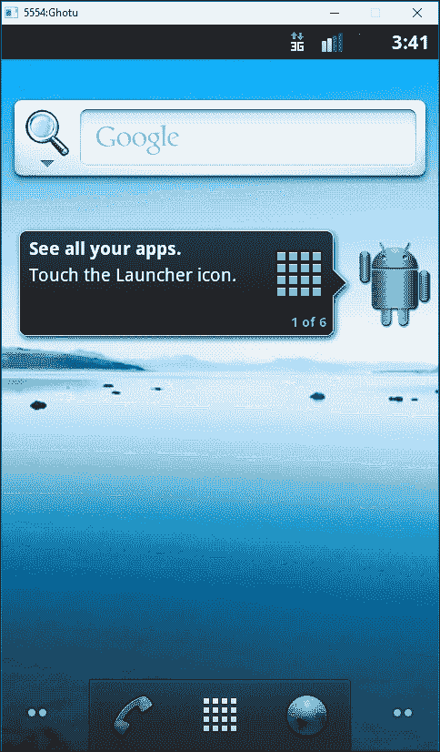
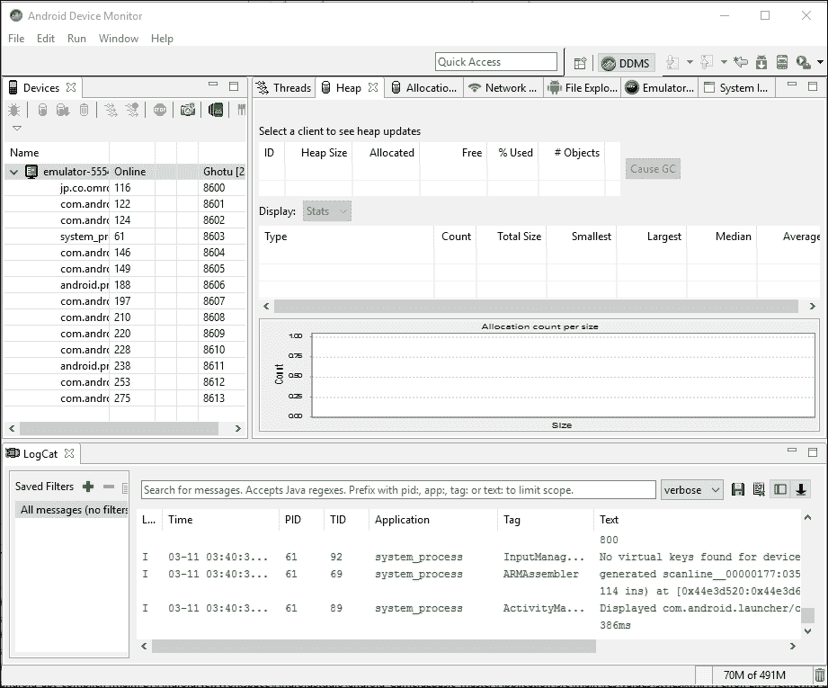

# 九、测试代码和调试

“一个没有 bug 的产品是一个神话”是开发行业的常用语。一个没有问题、没有问题的应用或任何其他产品在理性上是不可能的。然而，开发人员总是可以最小化 bug 和问题的数量，以便游戏可以以最少的问题运行，并以最大的效率支持最多的平台。

我们将通过以下主题讨论安卓游戏开发中各种调试方面的范围:

*   安卓 AVDs
*   安卓 DDMS
*   安卓设备调试
*   监控内存占用
*   不同调试语句的战略布局
*   安卓游戏中的异常处理
*   在使用跨平台引擎时调试安卓系统
*   最佳测试实践

# Android AVDs

AVDs 是调试安卓游戏最重要最有意义的部分。在最初阶段，这个概念是从模拟器开始的。有一些预定义的仿真器可以用来在开发电脑上运行构建。安卓模拟器提供了一个类似实时设备的界面。

avd 有几个功能，可以虚拟地提供设备 RAM、Android 版本、屏幕大小、显示 dpi、键盘和不同的视觉外观。旧的反车辆地雷看起来基本相同。



在当前版本的安卓 Studio 中，提供了大部分的安卓设备类别。开发人员可以根据目标开发平台创建 avd。

类别如下:

*   安卓手机
*   安卓平板电脑
*   安卓电视
*   安卓可穿戴设备

AVD 可以通过安卓 SDK 内提供的 AVD 管理器工具进行创建或操作。AVD 的每个属性都可以由 AVD 管理器管理。这个工具还可以帮助开发者创建一个自定义的 AVD。

让我们来看看每个不同 AVD 的属性因素:

*   名字
*   解决
*   显示尺寸
*   安卓版本 API 级别
*   安卓目标版本
*   中央处理机体系结构
*   内存量
*   硬件输入选项
*   其他选项
*   扩展的 AVD 设置和创建

## 动静脉畸形的名称

这个名字只是为了识别 AVD。任何东西都可以分配给它，以后也可以更改。预定义的 AVD 名称也可以在创建时更改。

## AVD 分辨率

AVD 分辨率是能见度最重要的因素之一。有一些预定义的分辨率标准，但也可以更改。如今，大多数情况下，开发人员会选择在实际硬件平台上广泛使用的分辨率。

分辨率的另一个用途是检查和验证游戏的显示便携性。大多数情况下，游戏都是以目标基本分辨率制作的。然后，游戏可以在各种分辨率上进行测试，以检查兼容性。

通常，如果纵横比相同，多个分辨率会产生任何问题。然而，在安卓的情况下，我们可以为不同的设备找到多个纵横比。 AVD 的分辨率有助于适应游戏，并检查其对多种纵横比的兼容性。

## AVD 显示尺寸

这个是一个 AVD 上的可见空间或者可见显示区域。一个高分辨率的 AVD 可以有一个小的显示区域。直接暗示了 AVD 的 dpi 值高，意味着显示质量更高。

AVD 的这一部分有助于确保游戏的视觉质量。然而，由于开发系统具有其自身的显示限制，因此并不总是能够在开发系统中设置实际的显示区域。

## 安卓版 API 级别

开发安卓游戏时，开发者需要将 API 的使用限制在某个版本。API 版本可以在未来版本的 Android 中弃用，甚至停产。为了检查这个因素，开发人员可以为 AVD 设置一个 API 版本。

## 安卓目标版本

这个就是将要用来运行 AVD 的安卓版本。这可以验证清单目标 Android 版本和最小版本范围。

## CPU 架构

安卓设备主要使用三种类型的 CPU 架构:armeabi、armeabi-v7、x86。这对游戏没有直接影响。但是，处理速度和质量因 CPU 架构而异。

开发人员应该记住，在具有不同中央处理器架构的真实设备上，实际的游戏性能总是不同于 AVD。因此，它可能会让开发人员对性能有所了解，但需要在真实设备上进行测试。

## 内存量

RAM 量指定 AVD 拥有的内存总量，可以用来检查游戏在各个级别的内存消耗情况。

最好预测各种设备的内存溢出问题。通过一次运行多个应用，可以使用 AVD 创建实时克隆。默认值设置为 66 MB。开发人员可以根据需要设置任何值。

外部存储也可以定义为虚拟设备的 SD 卡。

## 硬件输入选项

在安卓设备中，可以有多种类型的硬件输入分布在广泛的硬件中。最常见的变化如下:

*   触摸屏
*   触摸板
*   小键盘
*   自定义控制器
*   硬件按钮

许多硬件平台选择了这些变体的组合。AVD 为所有这些输入系统创建一个虚拟系统。

## 其他选项

有几个其他选项可以随时进行操作。如果开发系统附带了摄像头，那么 AVD 也可以使用摄像头，前后都可以。

此外，虚拟加速度计、传感器等可以与自动电压调节器相关联。

## 扩展自动电压调节器设置

一个定制的自动增值设备可以通过一个现代的自动增值设备管理工具来制作。开发人员可以设计具有自定义外观和感觉以及完整自定义硬件配置的虚拟设备。

# Android DDMS

DDMS 可用于分析运行中的应用的所有运行时细节，如内存消耗、进程调用等。

安卓 DDMS 的主要功能是端口提供、设备屏幕捕捉、线程细节、堆细节和日志处理。这项服务可用于欺骗电话和消息。

安卓 DDMS 被广泛用于设备调试。特别是在游戏开发过程中，它经常被用作逐行调试系统。这对于识别不需要的加载对象和素材以及跟踪运行时异常非常有用:



安卓 DDMS 可以用来进行以下活动。

## 连接安卓设备文件系统

DDMS 可以连接到设备文件系统，提供基于文件浏览器的操作，通过电脑复制、修改或删除设备上的任何文件。然而，这种方法或功能对于安卓游戏开发来说并不是很重要。

## 分析方法

另一个有趣的 DDMS 特征是剖析或追踪某些方法的矩阵。它提供了以下主题的信息:

*   执行时间
*   操作次数
*   细胞数量
*   执行期间的内存使用

扩展这个特性，开发人员甚至可以通过调用`startMethodTracing()`和`stopMethodTracing()`来控制方法的数据分析。

开发人员需要关注两件事:

*   在安卓 2.1 之前，必须在设备上安装 SD 卡，并获得应用的读写权限
*   从 Android 2.2 开始，该设备可以将分析数据直接流式传输到开发电脑

## 线程信息监控

DDMS 提供了在选定设备上为每个进程运行的每个线程的详细信息。然而，游戏大多运行在一个线程上。随着设备一天比一天好，游戏也在使用多线程功能来支持各种操作，如渲染、处理、文件输入/输出和网络。

## 堆信息监控

DDMS 在运行时为正在运行的进程提供堆使用。游戏开发人员在执行过程中跟踪游戏进程堆是非常有用的。

## 跟踪内存分配

这对于跟踪运行时对象的每个内存分配非常有用。这给出了每个类的每个特定对象的每个细节。这意味着开发人员可以找出哪个类占用了多少内存。这有助于以更高效的方式实现内存优化。

## 监控和管理网络流量

从安卓 4.0 开始， DDMS 有一个**详细网络使用**标签来跟踪游戏何时发出网络请求。使用此功能，开发人员可以监控网络数据传输。该选项对于优化网络开发非常有用。它可以通过在使用前对网络套接字应用“标签”来区分不同的流量类型。

## 使用 Logcat 跟踪日志信息

日志是跟踪几乎任何东西最有用的调试技术。在运行时正确使用日志来检查某些对象的数据或值是一个很好的做法。对于游戏的逻辑开发非常有用。

在游戏开发中，不同的游戏逻辑要求会有所不同。所以，一定有大量的代码是第一次写的。预定义的测试用例不可用。使用 DDMS 的 Logcat 可以克服这一缺陷。

Logcat 提供以下类型的日志信息:

*   冗长的
*   调试
*   错误
*   警告
*   信息

## 模拟设备操作

正如我们之前讨论的安卓虚拟设备，DDMS 也可以在自动增值设备上工作。因此，模拟实时场景来调试正在开发的游戏变得容易得多。

最常用的仿真如下:

*   模拟来电
*   模拟传入消息
*   运行时模拟网络状态变化

这三个是运行时最常见的场景。因此，可以在没有物理设备的情况下检查这些情况。从一开始，安卓设备就很难处理中断。事实上，如果中断处理不当，这对程序员来说可能是一场噩梦。

有一些常见的中断后崩溃/冻结/重启游戏的问题。很多时候，一些不必要的服务或进程会被中断，它们可能会在中断期间改变游戏状态。模拟 AVD 上的每一个可能的中断总是加快调试或中断处理过程的额外优势。

# 安卓设备测试调试

安卓设备调试是任何安卓游戏开发过程中最重要的部分。让我们把这个话题分成两个部分:

*   设备测试
*   设备调试

## 设备测试

游戏开发者面临的主要挑战是在大量不同的设备上运行游戏。这些不同的设备包括不同的显示器、不同的分辨率、不同的安卓操作系统版本、不同的处理器和不同的内存容量。由于这些原因，安卓设备测试非常重要，必须付出巨大的努力和规划来进行。

通常，在游戏开发周期中，第一点测试是由开发者进行的。这个过程确保游戏在设备上运行。

然后，测试人员或一组测试人员从各个方面在不同的设备上测试游戏。这是设备测试的主要部分。

一般来说，主要测试阶段根据游戏开发阶段分为四个部分:

*   样机试验
*   全面或完整测试
*   回归测试
*   发布测试或运行测试

换句话说，每个类别中类似的分布被称为:

*   阿尔法测试前
*   智力测验
*   β测试
*   发布候选测试

还有许多其他的测试程序可能遵循典型的软件测试。然而，在游戏开发中，通常会遵循这些方法。让我们简单描述一下这些阶段。

### 原型测试

开发者和设计者一起用一套初始游戏规则开发一个基本游戏理念的可玩阶段。这些规则和游戏性在原型测试阶段进行测试。

理想情况下，核心游戏性在这个阶段进行测试，以分析游戏概念的可行性、潜力和范围。

原型测试可能是游戏开发过程中最重要的部分。这个阶段决定了游戏概念的未来，也有助于为这个概念开发一个元游戏和货币化模型。

### 完全或完全测试

通常，每当最初的几个构建在每个阶段提交测试时，都会进行完整的测试。这揭示了游戏的每一个可能的问题，包括崩溃、冻结、视觉问题、可玩性、游戏规则和设计缺陷。

大多数问题通常在这个阶段报告，这最终意味着游戏构建可能的完成时间和努力。

### 回归测试

回归测试在完全测试之后进行。开发人员、设计人员和制作人员对全面测试期间报告的每一个问题都进行了调查。他们选择要解决的问题，在问题解决之后，他们被提交回测试团队进行回归测试。

在回归测试中，测试人员通常会挑选问题，并专门检查它是否真的被解决了。如果问题发生在一个固定的构建中，那么测试人员会为下一个回归周期重新打开问题。这个循环一直持续到所有报告的问题都得到解决。

### 发布测试或运行测试

这大概是游戏测试最机械的测试阶段。在这个阶段，测试人员在各种目标设备上运行通过的回归测试构建，只是为了检查游戏是否在该硬件上运行。这就是这个阶段通常被称为“运行测试”的原因。

尽可能多的物理设备被用于这部分测试的兼容性检查。最终的设备支持列表是在这个测试阶段之后创建的。几乎不可能安排所有可用的设备并对其执行运行测试。因此，开发人员根据设备的配置和性能对设备进行分组。行为相似的设备被归入同一类别，实际上只有一两个设备被安排用于整个组的运行测试。

## 设备调试

我们已经看到设备测试主要是测试人员的工作。现在，我们将看到设备调试基本上是开发人员的工作。然而，通常，它是由开发人员和测试人员共同完成的。

在游戏行业，设备调试主要用于发现运行时崩溃、冻结、内存问题、网络问题和性能问题。通过设备调试，开发人员收集以下信息:

*   运行时最大堆消耗
*   各种设备或多组设备上的平均 FPS
*   不必要的加载对象
*   硬件按钮行为
*   网络请求和响应

### 断点的使用

断点在设备调试的情况下非常有用和方便。游戏线程在断点处暂停，状态信息可以通过 DDMS 获取。游戏编程主要是关于定制的算法，在运行时可能会产生一些不寻常的行为。断点在这种情况下很有用。开发人员可以在断点后逐行调试逻辑，以便找到并修复行为的根本原因。

# 监控内存占用

内存足迹是运行时使用内存的标志和方式。从游戏内存使用优化的角度来看，监控内存占用非常重要:

*   检查日志消息
*   检查堆更新
*   跟踪内存分配
*   检查整体内存使用情况
*   跟踪内存泄漏

## 检查日志消息

使用日志消息是最有效的即时调试技术。消息日志对于跟踪程序控制流和运行时对象跟踪非常有用。

### 达尔维克消息日志

达尔维克消息日志对于跟踪记忆很有用。每当垃圾收集发生时，垃圾收集器可以通过 Dalvik 日志消息打印以下信息:

*   **垃圾回收原因**:该信息揭示了触发垃圾回收的原因。原因可以是`GC_CONCURRENT`、`GC_FOR_MALLOC`、`GC_HPROF_DUMP_HEAP`、`GC_EXPLICIT`或者`GC_EXTERNAL_ALLOC`。
*   **释放的内存量**:此部分以 KB 为单位陈述垃圾收集器释放的内存量。
*   **当前堆内存状态**:显示已用堆内存和活动对象内存/总堆的百分比。
*   **外部内存状态**:可能存在一些外部分配内存的操作。本节显示分配的内存/垃圾收集限制。
*   **垃圾收集器暂停时间**:暂停时间触发两次，在垃圾收集开始时和结束时。通常，在大堆的情况下，暂停时间更长。

### ART 消息日志

ART 消息日志也能够显示或跟踪内存足迹。然而，除非明确请求，否则不会被触发。

如果垃圾收集器暂停时间超过 5 毫秒，或者垃圾收集器执行时间超过 100 毫秒，则会打印垃圾收集器日志。在 ART 的情况下，以下信息可以显示为日志:

*   **垃圾回收原因**:在 ART 日志消息中，开发者可以有`Concurrent`、`Alloc`、`Explicit`、`NativeAlloc`、`CollectorTransition`、`HomogeneousSpaceCompact`、`DisableMovingGc`或`HeapTrim`作为回收原因。
*   **垃圾收集器的名称** : ART 很少有不同的垃圾收集器可以参与一个收集过程。收集日志的字段可以知道该名称。ART 有这些收集者:**并发**T5】标记扫掠(**CMS**)**并发** **部分标记扫掠**(**CPMS**)**并发粘标记扫掠** ( **CSMS** )，标记扫掠加半空间。
*   **释放的对象计数**:显示垃圾收集器从内存中释放的对象总数。
*   **释放的内存量**:显示垃圾收集器释放的内存总量。
*   **释放的大对象计数**:显示从大对象范围释放的对象数量。这些对象由收集器释放。
*   **从大对象中释放的内存量**:显示从大对象范围中释放的内存量。该内存由收集器释放。
*   **当前堆内存状态**:这与 Dalvik 日志的状态相同——活动对象计数/总堆内存。
*   **GC 暂停时间**:在 ART 暂停时间部分，这与正在运行的垃圾收集器修改的对象引用数量成正比。与 Dalvik 不同，ART CMS 垃圾收集器在收集过程结束时只有一次暂停时间。

## 检查堆更新

开发人员可以检查每次更新的堆使用情况。它给出了内存足迹的清晰图像。堆可以在几个工具的帮助下被监控。市场上有很多设备内存显示器。DDMS 设备监视器就是其中之一。这是一个在游戏运行时观察堆使用情况的强大工具。

安卓软件开发工具包在`<sdk>/tools/monitor`配备了内置的设备监视器。

Android Studio 中的内存监视器对 Android Studio 用户很有用。监视器可以与安卓应用交互，观看每次垃圾收集的堆更新。通过这种方式，安卓开发者可以知道应用每个部分的确切内存使用情况。

有时候，开发人员会打开/关闭方法来检查确切的堆使用情况。因此，进一步优化它变得更加容易。

## 跟踪内存分配

这对于内存优化很有帮助。可以通过 **分配跟踪器**监控内存分配。

在内存优化的某个阶段后，需要进行内存分配跟踪。这有助于识别每个对象的内存分配。通常，许多无用的物体会留在记忆中。开发人员可以识别这些对象并删除它们，以获得更好的内存优化。

安卓软件开发工具包中的设备监视器和 Android Studio 中的分配跟踪器都有内存分配跟踪器。

然而，没有必要从性能关键的代码路径中移除所有分配；然而，分配跟踪器可以帮助开发人员识别代码中的重要问题。例如，一些应用可能会在每次绘制时创建一个新的`Paint`对象。将此对象移动到全局成员中是一个简单的解决方案，有助于提高性能:


让我们快速看看获得的分配信息:

*   **s1** :这是当前正在跟踪的对象包
*   **s2** :显示选择了**分配**标签
*   **s3** :用于开始/停止物体的跟踪
*   **s4** :这将更新包分配
*   **s5** :显示分配明细

在游戏开发中，内存中的对象数量是巨大的，因此很难手动跟踪对象的分配和解除分配。该监控工具有助于找出在优化过程中容易被忽略的隐藏点。

## 检查整体内存使用情况

安卓游戏的整体内存使用分布在内存的不同部分。这就产生了一个关于应用性能和内存安全性的一般概念。

基本上有两种分配方式。

### 专用内存

这是游戏运行时使用的专用内存部分。安卓操作系统将这些内存分配给应用。私有内存分为两部分:

*   清洁内存
*   脏内存

私有脏内存是最昂贵的，因为它只能被特定的应用使用(在我们的例子中，它是一个安卓游戏)。

### 比例设定尺寸(PSS)

内存的这个部分被多个进程使用。基本上是共享内存。应用进程独有的任何内存页面都会直接贡献给它的 PSS，而与其他进程共享的页面只会与共享量成比例地贡献 PSS 值。

## 跟踪内存泄漏

内存泄漏是软件开发的严重威胁。因此，跟踪内存泄漏并解决它是绝对必要的。当进程分配内存并丢失引用指针时，就不可能释放进程内的内存。

很少有调试工具可以完成这项工作来跟踪内存泄漏。然而，还有另一种免费且更有效的解决方案。开发人员可以随时监控任何给定时间点的内存消耗。游戏在更新循环中运行。因此，可以跟踪不同游戏周期的记忆峰值。如果峰值持续增加，则意味着内存分配/解除分配存在漏洞。现在，开发人员可以检查每个对象的大小，并找出泄漏点。这个过程的另一个好处是在内存泄漏的同时发现内存中不必要的对象。

# 不同调试语句的战略布局

一条调试语句是任何开发过程中最重要的部分。任何事情都可以通过调试语句进行跟踪和追踪。然而，作为一个系统打印调用，每个调试语句都有一个性能成本，这对运行时 FPS 有直接影响。这就是为什么放置调试语句的策略是绝对必要的。

让我们看看与以下类别相关的策略:

*   存储器分配
*   跟踪对象状态
*   检查程序流程
*   跟踪对象值

## 内存分配

在游戏开发对象周期中，一个对象应该在每次初始化时分配一次，并在销毁时解除分配。然而，由于手工编程错误，开发人员忘记释放内存。在这种情况下，垃圾收集器会在系统自动调用它时清理内存。这样，可以观察到性能的滞后。

现在，作为跟踪此类错误的一个战略位置，应该在构造函数和析构函数中放置两条调试消息。

此外，在初始化每个对象之后的调试语句确保了对象的成功初始化。这可以揭示它消耗的内存量。

## 运行时跟踪对象状态

一个对象可以在游戏过程中随时初始化。现在，初始化过程中的任何外部依赖都会导致分配失败。因此，对象进入空状态，如果处理不当，可能会导致异常。

一条成功的调试语句和一条失败的调试语句(有原因)有助于开发人员纠正问题。

很多时候，错误的解除分配也会改变对象的状态。因此，调试语句确定了位置。开发人员可以借助对象和程序流的调试语句来解决这个问题。

## 检查程序流程

中的一条调试语句，每个方法都清晰地展示了调用层次和程序流程。该系统可以测试模块化程序。然后，可以在每个模块启动中用一条调试语句测试模块集。

任何错误或不必要的电话都可以通过这个过程删除或纠正。适当的程序流确保运行时有一定的帧速率。因此，这种方法可以用来优化性能。

## 跟踪对象值

即使在对象初始化成功后，内容也可能不正确。因此，为了避免将来的冲突，有必要使用调试语句来检查加载/初始化的内容。

这在从外部源加载数据时非常有用。调试语句用于在初始化后验证加载的数据。任何程序模块都可以使用对象跟踪方法来设计，从而产生更好的编程结构。

# 安卓游戏中的异常处理

异常处理可能不是调试的部分，但它有助于减少异常和不必要的应用崩溃的数量。

Android 中的异常处理与 Java 异常处理相同。

## 语法

异常处理的标准 Java 语法如下:

```java
try
{
  // Handled code here
} 
catch (Exception e)
{
  // Put debug statement with exception reason
}
finally
{
  // Default instruction if any
}
```

可疑代码应该放在`try`块中，异常应该放在`catch`块中处理。如果模块需要一些默认任务来执行，那么将其放入`finally`块。在异常处理中可能不会总是定义`catch`和`finally`块。但是，建议您在每个`try`块故障中处理异常，这是一个很好的编程实践。这个过程需要您分析模块，找出任何易受攻击的代码块。

下面是一个处理异常和其他易受攻击的默认任务的简单示例。

这是最初的程序设计:

```java
try
{
  // Task 1 which might throw exception
}
catch ( Exception e)
{
  // Handles exception
}
finally
{
  // Task 2 which might throw exception
}
```

程序应该这样写:

```java
void func1()
{
  try
  {
    funcTask();
  }
  catch ( Exception e)
  {
    // Handles exception
  }
}

void funcTask()
{
  try
  {
    // Task 1
  }
  finally
  {
    // Task 2
  }
}
```

开发人员应该记住以下几点:

*   一个`try`块只能和一个`catch`块一起使用
*   一个`try`块只能和一个`finally`块一起使用
*   一个`try`块可以依次与`catch`和`finally`块一起使用
*   A `try`块不能单独在任何地方使用
*   嵌套`try…catch`是可能的，但不推荐作为良好的编程实践

## 范围

根据异常类型和原因，有大量预定义的异常范围。然而，游戏开发过程中处理的主要异常如下:

*   空指针异常
*   索引超出界限异常
*   算术异常
*   输入/输出异常
*   网络异常
*   自定义例外

### 空指针异常

这是游戏开发情况下最常遇到的异常之一。当代码中引用任何空对象时，将引发`NullPointerException`。开发人员应该跟踪对象的初始化和使用来纠正这个问题。

这里有一个例子:

```java
class A
{
  public int num;
  public A()
  {
    num = 10;
  }
}
// some method in other class which is called during runtime.
void testFunc()
{
  A objA = null;
  Log.d("TAG", "num = " + objA.num);
}
```

这将引发异常，因为`objA`已经用 null 初始化。因此，这个对象在内存中没有任何位置，引用指针也不存在。现代智能编译器可以在编译时检测到这个明显的异常，但是代码可能是这样的，我们定义了另一个包含`testFunc()`方法的类:

```java
class RootClass
{
  public A objA;
  public RootClass()
  {
    objA = null;
    testFunc();
  }

  void testFunc()
  {
    Log.d("TAG", "num = " + objA.num);
  }
}
```

在这种情况下，大多数智能编译器无法检测到即将到来的异常。为了处理这个问题，开发人员应该在`testFunc()`方法中增加几行代码:

```java
void testFunc()
{
  try
  {
    Log.d("TAG", "num = " + objA.num);
  }
  catch (NullPointerException e)
  {
    Log.d("TAG", "Exception:: " + e);
  }
}
```

### 索引超出界限异常

当访问一个索引地址时会引发这个异常，该索引地址应该是连续内存分配的一部分，但实际上不是。最常见的是游戏开发情况下的`ArrayIndexOutOfBoundsException`。

例如，如果一个数组包含五个字段，并且程序试图访问五个以上的字段，将引发此异常。让我们考虑这段代码:

```java
int[] arrayNum = new int[5];
for ( int i = 0; i < 5; ++ i)
  arrayNum[i] = i;

Log.d("TAG", "arrayNum[5] is " + arrayNum[5]);
```

这里，异常将出现在日志语句中，因为`arrayNum[5]`表示数组中的第六个元素，它不存在。

### 算术异常

数学表达式可以表示未定义的值，但是在编程方面，“未定义”不能被定义。于是，`ArithmeticException`被抛出。

例如，如果解释器试图将任何值除以零，那么结果将变得未定义，这将作为异常抛出。在计算 tan 90 的值时，可以看到相同的结果。

一个简单的案例可能是这样的:

```java
void divideFunct(int num, int deno)
{
  try
  {
    Log.d("TAG", "Division Result = " + (num / deno));
  }
  catch (ArithmeticException ae)
  {
    Log.d("TAG", "number cannot divided by zero");
  }
}
```

### 输入/输出异常

计算系统的输入/输出功能取决于其硬件。然而，在游戏的情况下，在读/写操作期间发生输入/输出异常。大多数游戏都是数据驱动的。基本原理是将数据输入游戏软件，以控制游戏中的元素。这些数据通常存储在单独的二进制、文本、XML 或 JSON 文件中。

作为位于特定路径的独立文件，这些文件可能会丢失，尤其是当这些数据文件从其他位置下载时，因为可能会出现连接中断，文件可能无法保存。在这种情况下，当游戏软件试图加载这样的文件时，就会抛出`IOException`。

让我们看一个简单的例子:

```java
try 
{
  File dir = Environment.getExternalStorageDirectory();
  File objFile = new File(dir, "tmpPath/myfile.txt");
}
catch (IOException e) 
{
  Log.d("TAG", "Error reading file :: " + e);
}
```

### 网络异常

这是多人游戏的时代，需要强制网络连接。因此，应用取决于现有网络连接的质量和连通性。然而，移动网络连接状态可以在任何时间点改变。通常，游戏开发人员会忽略网络错误，这会导致崩溃、冻结或游戏运行中的一些故障。

通常处理的例外是`HttpRetryException`、`UnresolvedAddressException`和`NetworkErrorException`。如果有任何 HTTP 请求不能自动退出，则抛出`HttpRetryException`。如果某个应用想要连接到某个地址，但没有找到该地址，则抛出`UnresolvedAddressException`。`NetworkErrorException`用于处理任何类型的网络事故，如网络丢失/掉线、使用错误协议的网络等。

### 自定义异常

这通常用于两个目的:

*   游戏异常处理
*   游戏支持工具异常处理

游戏可能会在运行时创建一个逻辑异常。然而，在游戏开发中，这种例外的范围很小。大多数安卓开发者都不这么做。

工具编程也是游戏开发过程中的重要一环。因此，如果需要，可能的异常应该由自定义异常处理。

# 在使用跨平台引擎时，针对安卓进行调试

现代游戏编程一般不针对单一平台。大多数游戏都是跨平台的。一个跨平台游戏引擎对于这种开发非常有用。

大多数引擎都带有内置的分析器，并提供一些功能来调试游戏。但是，探查器功能完全取决于特定游戏引擎的制造商。

所有本机平台都提供完整的调试信息。游戏引擎创建一个包装器，自动从一个平台配置切换到另一个平台配置，并在一个公共用户界面中显示探查器详细信息。

然而，这些跨平台调试工具需要一些额外的处理和内存。在某种程度上，它们将游戏资源消耗限制在一定水平，并有一定的误差范围。

# 最佳测试实践

安卓游戏开发行业有很多标准用于测试。测试确保应用发布后的正确性、稳定性、功能行为和持久性。安卓游戏测试最常见的方法是手动测试。

但是，这个过程绝对不是最好的。作为安卓开发者，单元测试始终是节省时间、获得准确测试结果的最佳实践。

## 工具和 API

有几个工具和安卓 API 可以用来执行测试程序。其中一些是内置的，比如安卓测试支持库、Dumpsys、Monkeyrunner 等等。

这些测试工具大多可以通过命令行触发，通过安卓调试桥运行。

Monkey 工具创建了一个虚拟环境来填充用户操作，如点击、触摸、滑动等，以确定实时结果。Monkey 可以用以下命令运行:

```java
adb shell monkey –p <Game Package Name> <Event Count>
```

Dumpsys 提供安卓应用运行时的系统状态。这可以通过以下命令触发:

```java
adb shell dumpsys <option>
```

Dumpsys 能够提供运行服务、输入系统、网络状态、内存使用等信息。

## 测试技术

游戏行业大多采用两种测试技术:自动化测试和人工测试。我们已经简要讨论了手动测试程序。让我们来看看自动化测试。

自动化测试需要工具和额外的编程工作。游戏 UI、内存消耗、网络连接和输入系统测试都可以实现自动化。在模拟器或实际设备上运行单独的测试来确定测试结果，并将其保存在开发系统的给定位置。

可以编写单元测试代码来验证游戏的单个模块的逻辑。单元测试可用于测试应用中最小的组件，如元素、类和方法。单元测试进一步分为两个阶段:

*   本地测试
*   仪表测试

### 局部试验

这种类型的单元测试在本地机器上工作，并在 JVM 上运行。这节省了大量的测试时间。本地测试要么不依赖于安卓框架，要么依赖有限，可以用虚拟对象来满足。

### 仪表测试

仪表化测试完全依赖于安卓框架，必须在安卓仿真器或安卓设备上运行。这种测试技术用于测试安卓游戏的运行时行为。它可以提供正在运行的应用的所有系统和调试信息。但是，这种技术不能很容易地用于虚拟对象。开发人员需要定义测试对象数据，然后才能在安卓环境中运行测试。

# 总结

没有质量和性能保证，任何开发过程都是不完整的。测试是游戏开发的阶段，需要在技术上和逻辑上对游戏进行验证，看它是否能在真正的市场上表现出来。

游戏的测试、调试和分析阶段确保了针对目标安卓平台范围的最佳游戏质量。通常，一款安卓游戏可以在少数安卓设备上运行，但不能在所有目标设备上运行。开发人员可以通过详细的测试程序来识别和解决某些特定设备的问题。