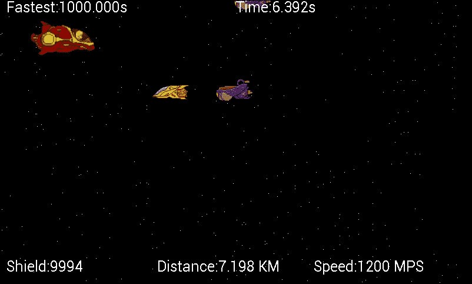
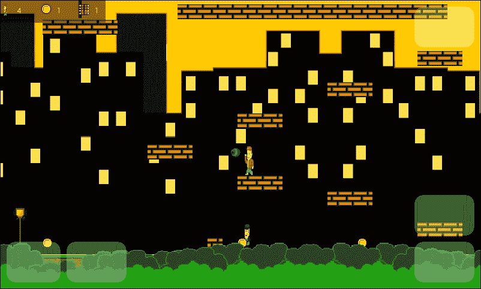
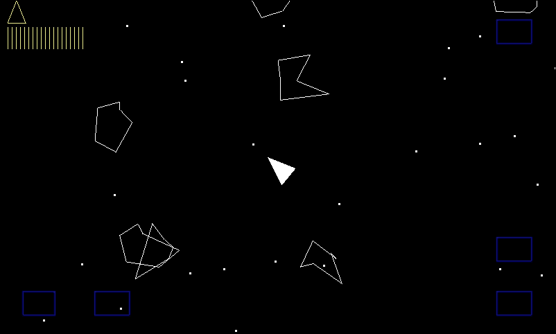
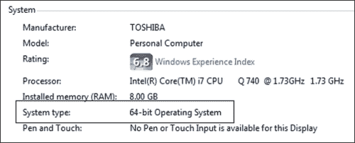
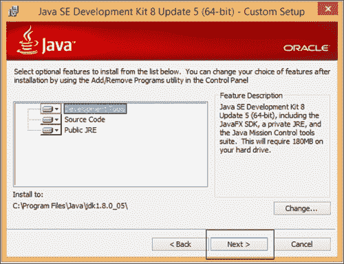
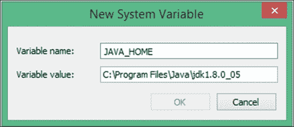
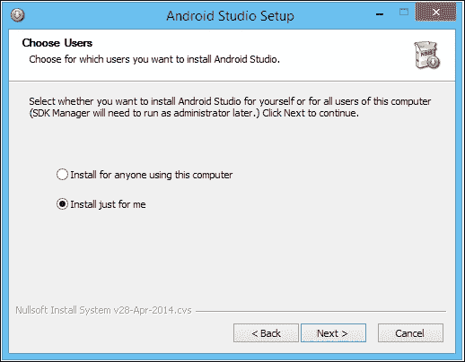
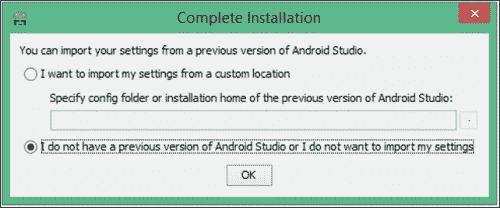

# 一、玩家 1 准备就绪

旧街机和弹球机使用的术语“1 UP”是对玩家的一种通知，他们现在正在玩(UP)。它也被用来表示获得额外的生命。你准备好建造三个伟大的游戏了吗？

我们将一起打造三款酷炫的游戏。这三个游戏的每一行代码都显示在这本书里；您永远不必参考代码文件来了解发生了什么。此外，构建所有三个游戏所需的整个文件集都包含在下载包中，可以从 Packt 网站的图书页面获得。

所有代码、安卓清单文件以及图形和音频资产都包含在下载中。这三款酷玩游戏的实施难度越来越大。

第一个项目使用了一个简单但实用的游戏引擎，它清楚地展示了主游戏循环的要点。游戏将完全与主屏幕、高分、声音和动画一起工作。但是在项目结束时，当我们添加功能并试图平衡游戏玩法时，我们很快就会看到我们需要更多的灵活性来添加功能。

在第二个项目中，一个硬复古平台，我们将看到如何使用简单灵活的设计来构建一个相对快速且非常灵活的游戏引擎，该引擎具有可扩展性和可重用性。这种灵活性将允许我们制作一个相当复杂和功能完善的游戏。这款游戏将会有多个关卡，不同的环境，等等。这反过来将突出能够更快地绘制图形的需要。这让我们进入第三个项目。

在第三个项目中，我们将构建一个名为 **小行星模拟器**的类似小行星的游戏。虽然游戏不会像以前的项目那样有很多功能，但它将以每秒超过 60 帧的速度超级流畅地绘制数百个动画游戏对象。我们将通过学习和使用**嵌入式系统开放图形库** ( **OpenGL ES 2** )来实现这一点。

到本书结束时，你将拥有一整套设计思想、技术和代码模板，可以在未来的游戏中使用。通过看到安卓上制作游戏的不同方式的优缺点，你将能够成功地为你的下一个大型游戏以最合适的方式设计和构建游戏。

# 仔细看看比赛

以下是这三个项目的一瞥。

## TappyDefender

用一根手指像飞燕鸟一样飞向你的母星，同时避开多个敌人。特点包括:

*   基本动画
*   Home screen

    

*   冲突检出
*   高分
*   简单 Hu
*   One-finger touch screen controls

    

## 强悍的复古平台

这是一款真正难缠的复古风格平台游戏。我们必须引导鲍勃从地下火坑穿过城市、森林，最后到达山区。它有四个具有挑战性的级别。特点包括:

*   更先进、更灵活的游戏引擎
*   更高级的“精灵表”角色动画
*   级别生成器引擎，用于以文本格式设计您的级别
*   多个滚动视差背景
*   层次之间的转换
*   A more advanced HUD

    

*   添加大量额外的不同级别
*   声音管理器，轻松管理声音效果
*   拾音器
*   一把可升级的枪
*   寻找并摧毁敌方无人机
*   巡逻敌军守卫的简单人工智能脚本
*   火坑等危险
*   Scenery objects to create atmosphere

    

## 小行星模拟器

这是一款具有复古矢量图形风格视觉效果的经典射击游戏。它包括用速射炮清除平滑动画旋转的小行星波。功能包括:

*   每秒 60 帧或更高，即使在旧硬件上也是如此
*   OpenGL ES 2 简介
*   渐进难度的射手
*   Advanced multiphase collision detection

    

# 设置您的开发环境

本书和下载包中的所有代码都将在你最喜欢的安卓 IDE 中工作。然而，我发现最新版本的安卓工作室使用起来异常友好，代码也是在其中编写和测试的。

如果你目前没有使用安卓工作室，我鼓励你试一试。以下是如何快速启动和运行的快速概述。本指南包括安装 Java JDK 的步骤，以防你对安卓开发完全陌生。

### 类型

如果您已经准备好了您喜欢的开发环境，那么直接跳到[第 2 章](02.html "Chapter 2. Tappy Defender – First Step")、*Tappy卫士–第一步*。

我们需要做的第一件事是准备好你的电脑，使用 Java 为安卓系统开发。幸运的是，这对我们来说很简单。

### 类型

如果你在苹果电脑或 Linux 上学习，这本书里的所有内容仍然有效。接下来的两个教程有特定于 Windows 的说明和截图。然而，稍微改变步骤以适应 Mac 或 Linux 应该不会太难。

我们需要做的就是:

1.  安装 **Java 开发工具包** ( **JDK** ，允许我们用 Java 开发。
2.  然后安装安卓 Studio，让安卓开发快速轻松。安卓工作室使用 JDK 和其他一些特定于安卓的工具，当我们安装安卓工作室时，这些工具会自动安装。

## 安装 JDK

我们需要做的第一件事是获得最新版本的JDK。要完成本指南，请执行以下说明:

1.  我们需要在 Java 网站上，所以访问:[http://www . Oracle . com/technetwork/Java/javase/downloads/index . html](http://www.oracle.com/technetwork/java/javase/downloads/index.html)。
2.  Find the three buttons shown here and click on the one that says **JDK** that is highlighted in the following image. They are on the right-hand side of the web page. Then, click on the **Download** button under the **JDK** option:

    

3.  你将被带到一个有多个选项下载 JDK 的页面。在**产品/文件描述**栏中，您需要点击与您的操作系统相匹配的选项。Windows、Mac、Linux 和其他一些不太常见的选项都列出来了。
4.  A common question asked here is, do I have 32- or 64-bit windows? To find out, right-click on your **My Computer** icon (**This PC** on Windows 8), click on the **Properties** option, and look under the **System** heading at the **System type** entry:

    

5.  Click on the somewhat hidden **Accept License Agreement** checkbox:

    

6.  现在，点击 **下载你的操作系统**，并按照之前的决定输入。等待下载完成。
7.  在你的`downloads`文件夹中，双击你刚刚下载的文件。在撰写本文时，64 位视窗电脑的最新版本是`jdk-8u5-windows-x64`。如果您使用的是苹果电脑/Linux 或 32 位操作系统，您的文件名会有所不同。
8.  In the first of several install dialogs, click on the **Next** button and you will see the following dialog box:

    

9.  点击**下一步**，接受上图所示的默认值。在下一个对话框中，您可以通过点击**下一步**接受默认安装位置。
10.  Next up is the last dialog of the Java installer; for this click on **Close**.

    ### 注

    JDK 号现在已经安装完毕。接下来，我们将确保安卓工作室能够使用 JDK。

11.  Right-click on your **My Computer** icon (**This PC** on windows 8) and click on **Properties** | **Advanced system settings** | **Environment Variables...** | **New...** (under **System variables**, not under **User variables**). Now, you can see the **New System Variable** dialog box:

    

12.  为**变量名输入`JAVA_HOME`:**，为**变量值输入`C:\Program Files\Java\jdk1.8.0_05`:**字段。如果您在其他地方安装了 JDK，那么您在**变量值:**字段中输入的文件路径将需要指向您放置它的地方。您的确切文件路径可能会有不同的结尾，以匹配您下载时最新版本的 Java。
13.  点击**确定**保存新设置。
14.  现在在**系统变量**下，点击**路径**，然后点击**编辑...**按钮。在**变量值:**字段的文本末尾，输入以下文本，将新变量添加到 Windows 将使用的文件路径中，`;JAVA_HOME`。一定不要从一开始就漏掉分号。
15.  点击**确定**保存更新后的**路径**变量。
16.  现在，再次点击 **确定**清除**高级系统设置** 对话框。

JDK 现在安装在我们的电脑上。

## 安装安卓工作室

马上让我们安装安卓工作室，然后我们就可以开始我们的第一个游戏项目了。访问:

[https://developer.android.com/sdk/index.html](https://developer.android.com/sdk/index.html)

1.  点击标有**的按钮，下载安卓工作室，开始安卓工作室的下载。这将带您进入另一个网页，其按钮外观与您刚刚点击的按钮非常相似。**
2.  勾选复选框接受许可，点击**按钮下载 ANDROID STUDIO FOR WINDOWS** 开始下载，等待下载完成。
3.  在你刚刚下载安卓工作室到的文件夹中，右键点击`android-studio-bundle-135.12465-windows.exe`文件，点击**以管理员身份运行**。文件名的结尾会因安卓工作室的版本和您的操作系统而异。
4.  当询问您是否允许来自未知发行商的以下程序对您的计算机进行更改时，单击**是**。在下一屏，点击**下一步**。
5.  On the screen pictured here, you can choose which users of your PC can use Android Studio. Choose which is right for you as all options will work, and then click on **Next**:

    

6.  在下一个对话框中，保留默认设置，然后点击**下一步**。
7.  在**选择开始菜单文件夹**对话框中，保留默认值，点击**安装**。
8.  在安装完成对话框中，点击**完成**首次运行安卓工作室。
9.  The next dialog is for users who have already used Android Studio, so assuming you are first-time user, select the **I do not have a previous version of Android Studio or I do not want to import my settings** checkbox. Then click on **OK**:

    

那是我们需要的最后一个软件。我们将在下一章直接开始使用安卓工作室。

# 总结

这一章被刻意保持得尽可能的短，所以我们可以继续构建一些游戏。我们现在就做。