# 第八章。平台转换器–将所有东西放在一起

最后，我们会让子弹造成一些伤害。当子弹能量被一丛草吸收时，跳弹的声音非常令人满意。我们将增加大量新的平台类型和无生命的风景对象，使我们的水平更有趣。我们将通过实现多个滚动视差背景来提供真实的运动感和沉浸感。

我们还将为玩家添加一个动画火砖来避免，此外，还将添加一个特殊的`Teleport`类来将关卡链接到一个可玩的游戏中。然后，我们将使用我们所有的游戏对象和背景来创建四个，链接和完全可玩的级别。

然后，我们将添加一个 HUD 来跟踪皮卡和生活。最后，我们将在四章中讨论一些无法融入这个项目的简洁的东西。

# 子弹碰撞检测

探测子弹碰撞相当简单。我们循环通过由我们的`MachineGun`对象持有的所有现有的`Bullet`对象。接下来，我们将每个项目符号的点转换成一个`RectHitBox`对象，并使用`intersects()`对我们视口中的每个对象进行测试。

如果我们被击中，我们会检查它击中了什么类型的物体。然后，我们切换到处理我们关心的每种类型的对象。如果是`Guard`物体，我们把它敲回去一点，如果是`Drone`物体，我们把它破坏掉，如果是别的东西，我们就让子弹消失，发出一种砰砰/跳弹的声音。

我们只是将我们讨论的这个逻辑放在处理与玩家冲突的`switch`块之后，但是在此之前，我们在所有未抓取的对象上调用`update()`，如下所示:

```java
default:// Probably a regular tile
    if (hit == 1) {// Left or right
        lm.player.setxVelocity(0);
        lm.player.setPressingRight(false);
    }

   if (hit == 2) {// Feet
        lm.player.isFalling = false;
    }
    break;
}
}

//Check bullet collisions
for (int i = 0; i < lm.player.bfg.getNumBullets(); i++) {
 //Make a hitbox out of the the current bullet
 RectHitbox r = new RectHitbox();
 r.setLeft(lm.player.bfg.getBulletX(i));
 r.setTop(lm.player.bfg.getBulletY(i));
 r.setRight(lm.player.bfg.getBulletX(i) + .1f);
 r.setBottom(lm.player.bfg.getBulletY(i) + .1f);

 if (go.getHitbox().intersects(r)) {
 // Collision detected
 // make bullet disappear until it 
 // is respawned as a new bullet
 lm.player.bfg.hideBullet(i);

 //Now respond depending upon the type of object hit
 if (go.getType() != 'g' && go.getType() != 'd') {
 sm.playSound("ricochet");

 } else if (go.getType() == 'g') {
 // Knock the guard back
 go.setWorldLocationX(go.getWorldLocation().x +
 2 * (lm.player.bfg.getDirection(i)));

 sm.playSound("hit_guard");

 } else if (go.getType() == 'd') {
 //destroy the droid
 sm.playSound("explode");
 //permanently clip this drone
 go.setWorldLocation(-100, -100, 0);
 }
 }
}

if (lm.isPlaying()) {
    // Run any un-clipped updates
    go.update(fps, lm.gravity);
        //...
```

试一试，真的是满意，尤其是高射速。

# 加入一些火砖

这些新的`GameObject`衍生物体对鲍勃来说意味着立即死亡。它们不会移动，但会被激活。我们将看到我们可以通过设置`GameObject`已经存在的属性来实现这一点。

将这个特性添加到我们的游戏中很简单，因为我们已经实现了我们需要的所有特性。我们已经有一种方法来定位和添加新的图块，一种方法来检测和响应碰撞，精灵表动画，等等。让我们一步一步来，然后我们可以将这些危险和威胁生命的元素添加到我们的世界中。

我们可以将类的全部功能放入它的构造函数中。我们所做的就是像配置我们的`Grass`对象一样配置对象，但是除此之外，我们用所有的动画设置来配置它，就像我们配置`Player`和`Guard`对象一样。`fire.png`精灵表有三帧动画，我们想在一秒钟内播放。

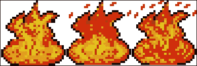

创建一个新类，称之为`Fire`，并添加以下代码:

```java
import android.content.Context;

public class Fire extends GameObject{

    Fire(Context context, float worldStartX, 
    float worldStartY, char type, int pixelsPerMetre) {

        final int ANIMATION_FPS = 3;
        final int ANIMATION_FRAME_COUNT = 3;
        final String BITMAP_NAME = "fire";

        final float HEIGHT = 1;
        final float WIDTH = 1;

        setHeight(HEIGHT); // 1 metre tall
        setWidth(WIDTH); // 1 metre wide

        setType(type);
        // Now for the player's other attributes
        // Our game engine will use these
        setMoves(false);
        setActive(true);
        setVisible(true);

        // Choose a Bitmap
        setBitmapName(BITMAP_NAME);
        // Set this object up to be animated
        setAnimFps(ANIMATION_FPS);
        setAnimFrameCount(ANIMATION_FRAME_COUNT);
        setBitmapName(BITMAP_NAME);
        setAnimated(context, pixelsPerMetre, true);

        // Where does the tile start
        // X and y locations from constructor parameters
        setWorldLocation(worldStartX, worldStartY, 0);
        setRectHitbox();
    }

 public void update(long fps, float gravity) {
 }
}
```

当然，现在我们需要将下载包中`Chapter8/drawable`的`fire.png`精灵表添加到项目的`drawable`文件夹中。

然后，我们以通常的三种方式添加到我们的`LevelManager`类中，就像我们对所有新的`GameObject`派生类所做的那样。

在`getBitmap`方法中，添加高亮显示的代码:

```java
case 'g':
    index = 7;
    break;

case 'f':
 index = 8;
 break;

default:
    index = 0;
    break;
```

在`getBitmapIndex`方法中:

```java
case 'g':
    index = 7;
    break;

case 'f':
 index = 8;
 break;

default:
    index = 0;
    break;
```

在`loadMapData()`方法中:

```java
case 'g':
     // Add a guard to the gameObjects
     gameObjects.add(new Guard(context, j, i, c, pixelsPerMetre));
     break;

 case 'f':
 // Add a fire tile the gameObjects
 gameObjects.add(new Fire
 (context, j, i, c, pixelsPerMetre));

 break;

```

最后，我们添加到我们的碰撞检测`switch`块来处理触摸这个可怕的瓷砖的后果。

```java
case 'g':
    //hit by guard
    sm.playSound("player_burn");
    ps.loseLife();
    location = new PointF(ps.loadLocation().x,
        ps.loadLocation().y);
    lm.player.setWorldLocationX(location.x);
    lm.player.setWorldLocationY(location.y);
    lm.player.setxVelocity(0);
    break;

case 'f':
 sm.playSound("player_burn");
 ps.loseLife();
 location = new PointF(ps.loadLocation().x,
 ps.loadLocation().y);
 lm.player.setWorldLocationX(location.x);
 lm.player.setWorldLocationY(location.y);
 lm.player.setxVelocity(0);
 break;

default:// Probably a regular tile
    if (hit == 1) {// Left or right
        lm.player.setxVelocity(0);
        lm.player.setPressingRight(false);
    }

    if (hit == 2) {// Feet
        lm.player.isFalling = false;
    }
    break;
```

为什么不在`LevelCave`上加几个牌，试试玩家能跳过什么。这将有助于我们在本章后面设计一些具有挑战性的关卡。


我们不想让我们的玩家一直在草地上走，所以让我们增加一些种类。

# 眼糖

本章接下来的三节将是纯粹的美学。我们将添加一大堆不同的瓷砖图形和匹配的类别，这样我们就可以使用更多的艺术许可证，使我们的水平更有趣。瓷砖之间的区别将纯粹是视觉上的，但使它们更具功能性将相当简单。

例如，我们可以很容易地检测到与雪砖的碰撞，并让玩家在停下来模拟打滑后保持短暂的移动，或者；混凝土瓷砖可以让玩家移动得更快，从而改变我们设计大跳跃的方式等等。关键是你不需要复制粘贴这些类，因为它们将在这里呈现。

我们还将添加一些完全美学的道具:矿车、巨石、钟乳石等等。这些物体不会有碰撞检测。他们将允许关卡设计者使关卡在视觉上更加有趣。

### 类型

让这些美学更实用会很简单。只需在碰撞检测开关块中添加一个 hitbox 和一个 case 来处理后果。

或许，我们增加的最具视觉意义的改进将是滚动背景。我们将添加一些类，以允许级别设计者向级别设计添加多个不同的滚动背景。

### 类型

为什么不把下载包的`Chapter8/drawable`文件夹中的所有图形添加到你项目的`drawable`文件夹中。然后，您将准备好所有的图形，并在适当的位置，为这个和接下来的两个部分。

## 新平台瓷砖

现在，用文件名添加所有这些类，如图所示。我已经删除了代码中的所有注释，因为它们在功能上都与`Grass`类相同。使用显示的名称创建以下每个类，并输入代码:

以下是`Brick`类的代码:

```java
public class Brick extends GameObject {

    Brick(float worldStartX, float worldStartY, char type) {
        setTraversable();
        final float HEIGHT = 1;
        final float WIDTH = 1;
        setHeight(HEIGHT); 
        setWidth(WIDTH); 
        setType(type);
        setBitmapName("brick");
        setWorldLocation(worldStartX, worldStartY, 0);
        setRectHitbox();
    }

    public void update(long fps, float gravity) {
    }
}
```

这是`Coal`类的代码:

```java
public class Coal extends GameObject {

    Coal(float worldStartX, float worldStartY, char type) {
        setTraversable();
        final float HEIGHT = 1;
        final float WIDTH = 1;
        setHeight(HEIGHT); 
        setWidth(WIDTH);
        setType(type);
        setBitmapName("coal");
        setWorldLocation(worldStartX, worldStartY, 0);
        setRectHitbox();
    }

    public void update(long fps, float gravity) {
    }
}
```

以下是`Concrete`类的代码:

```java
public class Concrete extends GameObject {

    Concrete(float worldStartX, float worldStartY, char type) {
        setTraversable();
        final float HEIGHT = 1;
        final float WIDTH = 1;
        setHeight(HEIGHT);
        setWidth(WIDTH);
        setType(type);
        setBitmapName("concrete");
        setWorldLocation(worldStartX, worldStartY, 0);
        setRectHitbox();
    }

    public void update(long fps, float gravity) {
    }
}
```

以下是`Scorched`类的代码:

```java
public class Scorched extends GameObject {

    Scorched(float worldStartX, float worldStartY, char type) {
        setTraversable();
        final float HEIGHT = 1;
        final float WIDTH = 1;
        setHeight(HEIGHT);
        setWidth(WIDTH);
        setType(type);
        setBitmapName("scorched");
        setWorldLocation(worldStartX, worldStartY, 0);
        setRectHitbox();
    }

    public void update(long fps, float gravity) {
    }
}
```

这是`Snow`类的代码:

```java
public class Snow extends GameObject {

    Snow(float worldStartX, float worldStartY, char type) {
        setTraversable();
        final float HEIGHT = 1;
        final float WIDTH = 1;
        setHeight(HEIGHT);
        setWidth(WIDTH);
        setType(type);
        setBitmapName("snow");
        setWorldLocation(worldStartX, worldStartY, 0);
        setRectHitbox();
    }

    public void update(long fps, float gravity) {
    }
}
```

以下是`Stone`类的代码:

```java
public class Stone extends GameObject {

    Stone(float worldStartX, float worldStartY, char type) {
        setTraversable();
        final float HEIGHT = 1;
        final float WIDTH = 1;
        setHeight(HEIGHT);
        setWidth(WIDTH); 
        setType(type);
        setBitmapName("stone");
        setWorldLocation(worldStartX, worldStartY, 0);
        setRectHitbox();
    }

    public void update(long fps, float gravity) {
    }
}
```

现在，随着我们的习惯，我们需要在通常的三个地方将它们全部添加到我们的`LevelManager`中。

在`getBitmap()`中，我们只是像平常一样把它们加进去。请注意，虽然这些值是任意的，但是我们将使用数字来表示类型 2、3、4 等等。这使得在设计关卡时很容易记住，我们所有的实际平台都是数字。实际的索引号对我们来说并不重要，只要和`getBitmapIndex`方法中的相同即可。此外，请记住，我们在`LevelData`类的注释中有一个类型列表，以便在设计级别时参考。

```java
case 'f':
    index = 8;
    break;

case '2':
 index = 9;
 break;

case '3':
 index = 10;
 break;

case '4':
 index = 11;
 break;

case '5':
 index = 12;
 break;

case '6':
 index = 13;
 break;

case '7':
 index = 14;
 break;

default:
    index = 0;
    break;
```

在`getBitmapIndex()`中，我们做同样的事情:

```java
case 'f':
    index = 8;
    break;

case '2':
 index = 9;
 break;

case '3':
 index = 10;
 break;

case '4':
 index = 11;
 break;

case '5':
 index = 12;
 break;

case '6':
 index = 13;
 break;

case '7':
 index = 14;
 break;

default:
    index = 0;
    break;
```

在`loadMapData()`中，我们只是在新的`GameObjects`上呼叫`new()`，将它们添加到我们的`gameObjects`列表中。

```java
case 'f':
    // Add a fire tile the gameObjects
    gameObjects.add(new Fire(context, j, i, c, pixelsPerMetre));
    break;

case '2':
 // Add a tile to the gameObjects
 gameObjects.add(new Snow(j, i, c));
 break;

case '3':
 // Add a tile to the gameObjects
 gameObjects.add(new Brick(j, i, c));
 break;

case '4':
 // Add a tile to the gameObjects
 gameObjects.add(new Coal(j, i, c));
 break;

case '5':
 // Add a tile to the gameObjects
 gameObjects.add(new Concrete(j, i, c));
 break;

case '6':
 // Add a tile to the gameObjects
 gameObjects.add(new Scorched(j, i, c));
 break;

case '7':
 // Add a tile to the gameObjects
 gameObjects.add(new Stone(j, i, c));
 break;

```

现在，在`LevelCave`等级中加入不同的地形:

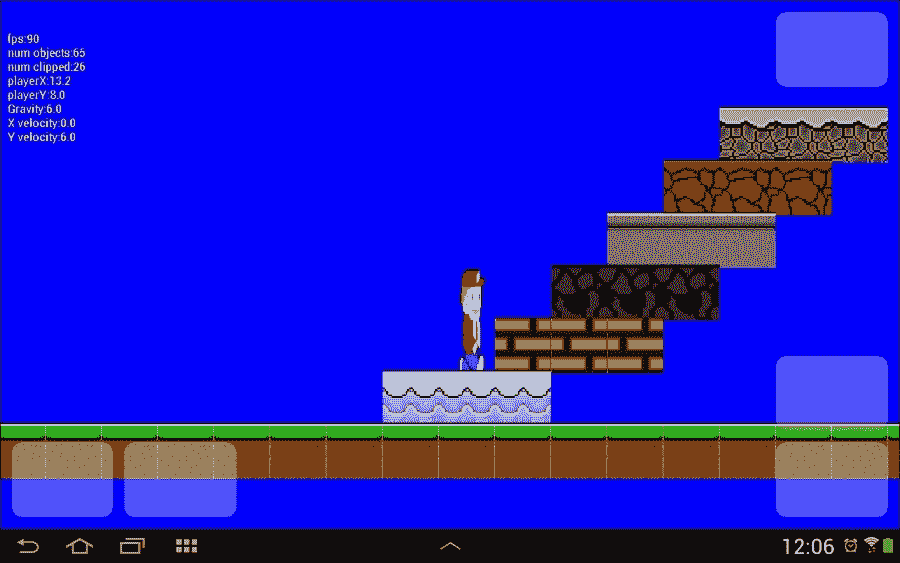

现在，添加一些风景对象。

## 新的景物对象

在这里，我们将添加一些什么都不做但看起来很漂亮的对象。我们将让游戏引擎知道，只需不添加一个 hitbox，并将它们随机设置为 z layer -1 或 1。然后玩家可以出现在他们的前面或后面。

我们将首先添加所有的类，然后在通常的三个地方更新`LevelManager`。按如下方式创建每个新类:

这里是`Boulders`类:

```java
public class Boulders extends GameObject {

    Boulders(float worldStartX, float worldStartY, char type) {

        final float HEIGHT = 1;
        final float WIDTH = 3;

        setHeight(HEIGHT); // 1 metre tall
        setWidth(WIDTH); // 1 metre wide

        setType(type);

        // Choose a Bitmap
        setBitmapName("boulder");
        setActive(false);//don't check for collisions etc

        // Randomly set the tree either just in front or just 
        //behind the player -1 or 1
        Random rand = new Random();
        if(rand.nextInt(2)==0) {
            setWorldLocation(worldStartX, worldStartY, -1);
        }else{
            setWorldLocation(worldStartX, worldStartY, 1);//
        }
        //No hitbox!!

    }

    public void update(long fps, float gravity) {
    }
}
```

从现在开始，我删除了所有评论，以节省数字墨水。类功能和`Boulders`一样，只是属性有点不同。

这里是`Cart`类:

```java
public class Cart extends GameObject {

  Cart(float worldStartX, float worldStartY, char type) {

        final float HEIGHT = 2;
        final float WIDTH = 3;
        setWidth(WIDTH);
        setHeight(HEIGHT);
        setType(type);
        setBitmapName("cart");
        setActive(false);
        Random rand = new Random();
        if(rand.nextInt(2)==0) {
          setWorldLocation(worldStartX, worldStartY, -1);
        }else{
          setWorldLocation(worldStartX, worldStartY, 1);
        }
     }

  public void update(long fps, float gravity) {
     }
}
```

这是`Lampost`类的代码:

```java
public class Lampost extends GameObject {

  Lampost(float worldStartX, float worldStartY, char type) {

        final float HEIGHT = 3;
        final float WIDTH = 1;
        setHeight(HEIGHT);
        setWidth(WIDTH); 
        setType(type);
        setBitmapName("lampost");
        setActive(false);
        Random rand = new Random();
        if(rand.nextInt(2)==0) {
          setWorldLocation(worldStartX, worldStartY, -1);
        }else{
          setWorldLocation(worldStartX, worldStartY, 1);
        }
  }

    public void update(long fps, float gravity) {
   }
}
```

这里是`Stalagmite`类:

```java
import java.util.Random;

public class Stalagmite extends GameObject {

  Stalagmite(float worldStartX, float worldStartY, char type) {

        final float HEIGHT = 3;
        final float WIDTH = 2;
        setHeight(HEIGHT);
        setWidth(WIDTH);
        setType(type);
        setBitmapName("stalacmite");
        setActive(false);
        Random rand = new Random();
        if(rand.nextInt(2)==0) {
         setWorldLocation(worldStartX, worldStartY, -1);
        }else{
         setWorldLocation(worldStartX, worldStartY, 1);
        }
    }

    public void update(long fps, float gravity) {
    }
}
```

这是 `Stalactite`类:

```java
import java.util.Random;

public class Stalactite extends GameObject {

  Stalactite(float worldStartX, float worldStartY, char type) {

        final float HEIGHT = 3;
        final float WIDTH = 2;
        setHeight(HEIGHT);
        setWidth(WIDTH);
        setType(type);
        setBitmapName("stalactite");
        setActive(false);
        Random rand = new Random();
        if(rand.nextInt(2)==0) {
          setWorldLocation(worldStartX, worldStartY, -1);
        }else{
          setWorldLocation(worldStartX, worldStartY, 1);
        }
  }

     public void update(long fps, float gravity) {
     }
}
```

这里是`Tree`类:

```java
import java.util.Random;

public class Tree extends GameObject {

  Tree(float worldStartX, float worldStartY, char type) {

       final float HEIGHT = 4;
       final float WIDTH = 2;
       setWidth(WIDTH);
        setHeight(HEIGHT);
        setType(type);
        setBitmapName("tree1");
        setActive(false);
        Random rand = new Random();
        if(rand.nextInt(2)==0) {
          setWorldLocation(worldStartX, worldStartY, -1);
        }else{
          setWorldLocation(worldStartX, worldStartY, 1);
        }
     }

     public void update(long fps, float gravity) {
     }
}
```

这是`Tree2`级:

```java
import java.util.Random;

public class Tree2 extends GameObject {

  Tree2(float worldStartX, float worldStartY, char type) {

        final float HEIGHT = 4;
        final float WIDTH = 2;
        setWidth(WIDTH);
        setHeight(HEIGHT);
        setType(type);
        setBitmapName("tree2");
        setActive(false);
        Random rand = new Random();
        if(rand.nextInt(2)==0) {
          setWorldLocation(worldStartX, worldStartY, -1);
        }else{
          setWorldLocation(worldStartX, worldStartY, 1);
        }
  }

     public void update(long fps, float gravity) {
     }
}
```

这就是风景对象的所有新类。现在，我们可以用`LevelManager`类中的七种新类型来更新`getBitmap`方法。

```java
case '7':
    index = 14;
    break;

case 'w':
 index = 15;
 break;

case 'x':
 index = 16;
 break;

case 'l':
 index = 17;
 break;

case 'r':
 index = 18;
 break;

case 's':
 index = 19;
 break;

case 'm':
 index = 20;
 break;

case 'z':
 index = 21;
 break;

default:
    index = 0;
    break;
```

以同样的方式更新`getBitmapIndex` 方法:

```java
case '7':
    index = 14;
    break;

case 'w':
 index = 15;
 break;

case 'x':
 index = 16;
 break;

case 'l':
 index = 17;
 break;

case 'r':
 index = 18;
 break;

case 's':
 index = 19;
 break;

case 'm':
 index = 20;
 break;

case 'z':
 index = 21;
 break;

default:
    index = 0;
    break;
```

最后，确保我们的新布景项目被添加到我们的`gameObjects`阵列列表中:

```java
case '7':
    // Add a tile to the gameObjects
    gameObjects.add(new Stone(j, i, c));
    break;

case 'w':
 // Add a tree to the gameObjects
 gameObjects.add(new Tree(j, i, c));
 break;

case 'x':
 // Add a tree2 to the gameObjects
 gameObjects.add(new Tree2(j, i, c));
 break;

case 'l':
 // Add a tree to the gameObjects
 gameObjects.add(new Lampost(j, i, c));
 break;

case 'r':
 // Add a stalactite to the gameObjects
 gameObjects.add(new Stalactite(j, i, c));
 break;

case 's':
 // Add a stalagmite to the gameObjects
 gameObjects.add(new Stalagmite(j, i, c));
 break;

case 'm':
 // Add a cart to the gameObjects
 gameObjects.add(new Cart(j, i, c));
 break;

case 'z':
 // Add a boulders to the gameObjects
 gameObjects.add(new Boulders(j, i, c));
 break;

```

现在，我们可以用风景来设计关卡。请注意，与第一层相比，第 0 层上绘制的对象在外观上略有不同，以及玩家角色如何在前面或后面通过:

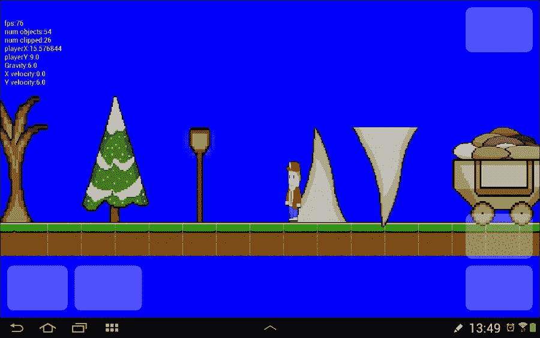

### 类型

当然，如果你想撞上灯柱，被石笋串起来，或者跳到我的手推车上，那就给它们一个击杀盒。

我们还有一个美化游戏世界的方法。

## 滚动视差背景

视差背景是滚动背景，我们离得越远滚动越慢。所以，如果玩家脚下有草的边缘，我们会快速滚动。然而，如果我们在远处有一座山脉，我们会慢慢滚动它。这种效果可以给玩家运动的感觉。

为了实现它们，我们将首先添加一个数据结构来表示背景的参数。我们将这个类称为`BackgroundData`，然后我们将实现一个`Background`类，它具有控制滚动所需的功能，然后我们将看到如何在我们的关卡设计中定位和定义背景。最后，我们将编写一个`drawBackground`方法，我们将从常规的`draw`方法中调用它。

确保您已经将下载包的`Chapter8/drawable`文件夹中的所有图形添加到项目的`drawable`文件夹中。

首先，让我们构建一个简单的类来保存定义我们背景的数据结构。正如我们可以在下一段代码中看到的，我们有相当多的参数和成员变量。我们需要知道哪个位图将代表一个背景，在 *z* 轴上画哪个层(在 1 的前面或在-1 的后面)，在 *y* 轴上它开始和结束的位置，背景滚动的速度，以及背景的高度。

`isParallax`布尔意在给出一个静态背景的选项，但是我们不会实现这个特性。当您看到后台类的代码时，您会发现如果您愿意，添加这个功能是很简单的。

创建一个新的类并调用它`BackgroundData`，然后用下面的代码实现它:

```java
public class BackgroundData {
  String bitmapName;
     boolean isParallax;
     //layer 0 is the map
     int layer;
     float startY;
     float endY;
     float speed;
     int height;
     int width;

     BackgroundData(String bitmap, boolean isParallax, 
     int layer, float startY, float endY, 
     float speed, int height){

      this.bitmapName = bitmap;
      this.isParallax = isParallax;
      this.layer = layer;
      this.startY = startY;
      this.endY = endY;
      this.speed = speed;
      this.height = height;
  }
}
```

现在，我们将新类型的`ArrayList`添加到`LevelData`类中:

```java
ArrayList<String> tiles;
ArrayList<BackgroundData> backgroundDataList;

// This class will evolve along with the project
```

接下来，让我们创建`Background`类本身。创建一个新的类并命名为`Background`。首先，我们设置了一堆变量来保存背景图像的副本和反转的副本。我们将通过将图像在常规图像和反转图像之间背靠背交替放置，使背景看起来像是*无尽的*。我们将在代码中进一步了解如何实现这一点。

我们也有像素的宽度和高度的图像变量。`reversedFirst`布尔值将决定图像的哪个副本当前绘制在屏幕的左侧(第一个)，并将随着玩家的移动和图像的滚动而改变。`xClip`变量将保存(图像的) *x* 轴的精确像素，在这里我们将剪切图像，并从屏幕的左手边开始绘制。

`y`、`endY`、`z`和`speed`成员变量用于保存作为参数传入的相关值:

```java
import android.content.Context;
import android.graphics.Bitmap;
import android.graphics.BitmapFactory;
import android.graphics.Matrix;

public class Background {

     Bitmap bitmap;
     Bitmap bitmapReversed;

     int width;
     int height;

     boolean reversedFirst;
     int xClip;// controls where we clip the bitmaps each frame
     float y;
     float endY;
     int z;

     float speed;
     boolean isParallax;//Not currently used
```

现在，在构造函数中，我们根据作为参数传入的图形文件的名称创建一个安卓资源标识。然后，通过调用`BitmapFactory.decodeResource()`创建实际位图。我们将`reversedFirst`设置为`false`，因此我们将从屏幕左侧图像的常规(非反转)副本开始。我们初始化我们的成员变量，然后通过调用`Bitmap.createScaledBitmap()`并传入位图来缩放我们刚刚创建的位图，屏幕的宽度和背景的高度(在游戏世界中)乘以`pixelsPerMetre`，使位图正好适合当前设备屏幕的大小。

### 类型

请注意，我们必须为我们的背景设计选择合适的高度，否则它们会显得拉伸。

我们在构造器中做的最后一件事是创建一个`Matrix`对象，并将其与位图一起发送到`createScaledBitmap`方法，因此我们现在有一个存储在`bitmapReversed Bitmap`对象中的背景图像的反转副本。

```java
  Background(Context context, int yPixelsPerMetre, 
    int screenWidth, BackgroundData data){

      int resID =   context.getResources().getIdentifier
      (data.bitmapName, "drawable", 
      context.getPackageName());

          bitmap = BitmapFactory.decodeResource
          (context.getResources(), resID);

          // Which version of background (reversed or regular) is // currently drawn first (on left)
          reversedFirst = false;

          //Initialize animation variables.
          xClip = 0;  //always start at zero
          y = data.startY;
          endY = data.endY;
          z = data.layer;
          isParallax = data.isParallax;
          speed = data.speed; //Scrolling background speed

          //Scale background to fit the screen.
          bitmap = Bitmap.createScaledBitmap(bitmap, screenWidth,
                data.height * yPixelsPerMetre
                , true); 

          width = bitmap.getWidth();
          height = bitmap.getHeight();

          // Create a mirror image of the background
          Matrix matrix = new Matrix();  
          matrix.setScale(-1, 1); //Horizontal mirror effect.
          bitmapReversed = Bitmap.createBitmap(
          bitmap, 0, 0, width, height, matrix, true);

    }
}
```

现在，我们在关卡设计中添加了两个背景。我们填写我们已经讨论过的所需参数。请注意，第 1 层的“草”背景比第 1 层的“天际线”背景滚动得快得多。这将产生所需的视差效果。将此代码添加到`LevelCave`构造函数的末尾:

```java
backgroundDataList = new ArrayList<BackgroundData>();
// note that speeds less than 2 cause problems
this.backgroundDataList.add(
  new BackgroundData("skyline", true, -1, 3, 18, 10, 15 ));

this.backgroundDataList.add(
  new BackgroundData("grass", true, 1, 20, 24, 24, 4 ));
```

### 注

的确，大多数洞穴没有草和天际线。这只是一个演示，目的是让代码正常工作。我们将在本章稍后重新设计`LevelCave`并设计一些更合适的关卡。

现在，我们通过声明一个新的`Arraylist`对象作为我们的`LevelManager`类的成员来加载它们。

```java
LevelData levelData;
ArrayList<GameObject> gameObjects;
ArrayList<Background> backgrounds;

```

然后在`LevelManager`中增加一个新的方法加载后台数据:

```java
private void loadBackgrounds(Context context, 
  int pixelsPerMetre, int screenWidth) {

  backgrounds = new ArrayList<Background>();
     //load the background data into the Background objects and
     // place them in our GameObject arraylist
     for (BackgroundData bgData : levelData.backgroundDataList) {
            backgrounds.add(new Background(context,       
            pixelsPerMetre, screenWidth, bgData));
     }
}
```

我们在`LevelManager`构造函数中调用新方法:

```java
// Load all the GameObjects and Bitmaps
loadMapData(context, pixelsPerMetre, px, py);
loadBackgrounds(context, pixelsPerMetre, screenWidth);

```

而且，不是最后一次了，我们将升级我们的`Viewport`类，使我们的`PlatformView`方法能够获得他们需要的信息，来绘制视差背景。

```java
public int getPixelsPerMetreY(){
  return  pixelsPerMetreY;
}

public int getyCentre(){
  return screenCentreY;
}

public float getViewportWorldCentreY(){
  return currentViewportWorldCentre.y;
}
```

然后，我们将在`PlatformView`类中添加一个实际绘图的方法。接下来，我们将在正确的地方从`onDraw()`调用这个方法。请注意，我们正在使用刚刚添加到`Viewport`类的新方法。

首先，我们定义四个`Rect`对象，我们将使用它们来保存`bitmap`和`reversedBitmap`的起点和终点。

执行`drawBackground`方法的第一部分，如图所示:

```java
private void drawBackground(int start, int stop) {

     Rect fromRect1 = new Rect();
     Rect toRect1 = new Rect();
     Rect fromRect2 = new Rect();
     Rect toRect2 = new Rect();
```

现在，我们简单地使用`start`和`stop`参数循环遍历所有背景，以决定哪些背景具有我们当前感兴趣绘制的 *z* 层。

```java
     for (Background bg : lm.backgrounds) {
     if (bg.z < start && bg.z > stop) {

```

接下来，我们将背景的世界坐标发送到`Viewport`类进行裁剪。如果它没有被裁剪(并且应该被绘制)，借助于我们之前添加到我们的`Viewport`类的新方法，我们得到了 *y* 轴上的开始像素坐标和结束像素坐标。请注意，我们将结果转换为准备绘制到屏幕上的`int`变量。

```java
          // Is this layer in the viewport?
            // Clip anything off-screen
            if (!vp.clipObjects(-1, bg.y, 1000, bg.height)) {
                float floatstartY = ((vp.getyCentre() -                     
                    ((vp.getViewportWorldCentreY() - bg.y) * 
                    vp.getPixelsPerMetreY())));

                int startY = (int) floatstartY;

                float floatendY = ((vp.getyCentre() -           
                    ((vp.getViewportWorldCentreY() - bg.endY) *                                 
                    vp.getPixelsPerMetreY())));

                int endY = (int) floatendY;
```

下一段代码是真正的行动发生的地方。我们用两个`Bitmap`对象中第一个和第二个的开始和结束坐标初始化四个`Rect`对象。请注意，计算的点(或像素)由`xClip`决定，该点最初为零。因此，首先，我们将简单地看到`background`(如果它没有被裁剪)在屏幕宽度上拉伸。很快，我们将看到我们根据鲍勃的速度修改了`xClip`，并显示了每个位图中的不同区域:

```java
        // Define what portion of bitmaps to capture 
        // and what coordinates to draw them at
        fromRect1 = new Rect(0, 0, bg.width - bg.xClip,     
          bg.height);

        toRect1 = new Rect(bg.xClip, startY, bg.width, endY);
             fromRect2 = new Rect(bg.width - bg.xClip, 0, bg.width, bg.height);

        toRect2 = new Rect(0, startY, bg.xClip, endY);
        }// End if (!vp.clipObjects...
```

现在，我们先确定当前正在绘制哪个背景(规则的还是反转的)，然后先绘制那个背景，再绘制另一个背景。

```java
          //draw backgrounds
            if (!bg.reversedFirst) {

                canvas.drawBitmap(bg.bitmap,
                    fromRect1, toRect1, paint);
                canvas.drawBitmap(bg.bitmapReversed, 
                    fromRect2, toRect2, paint);

            } else {
                canvas.drawBitmap(bg.bitmap, 
                    fromRect2, toRect2, paint);

                canvas.drawBitmap(bg.bitmapReversed, 
                    fromRect1, toRect1, paint);
            }
```

我们可以根据 Bob 的速度和方向`lv.player.getxVelocity()`沿着滚动，如果`xClip`已经到达当前第一个背景`if (bg.xClip >= bg.width)`的末尾，只需将`xClip`设置为零，并更改我们首先显示的位图。

```java
          // Calculate the next value for the background's
            // clipping position by modifying xClip
            // and switching which background is drawn first,
            // if necessary.
            bg.xClip -= lm.player.getxVelocity() / (20 / bg.speed);
            if (bg.xClip >= bg.width) {
                bg.xClip = 0;
                bg.reversedFirst = !bg.reversedFirst;
            } 
            else if (bg.xClip <= 0) {
                bg.xClip = bg.width;
                bg.reversedFirst = !bg.reversedFirst;

            }
        }
    }
}
```

然后，我们在游戏对象的背景前添加一个对`drawBackground()`的调用，其 *z* 层小于零。

```java
// Rub out the last frame with arbitrary color
paint.setColor(Color.argb(255, 0, 0, 255));
canvas.drawColor(Color.argb(255, 0, 0, 255));

// Draw parallax backgrounds from -1 to -3
drawBackground(0, -3);

// Draw all the GameObjects
Rect toScreen2d = new Rect();
```

就在画完项目符号之后，但是在调试那些带有一个 *z* 阶大于零的背景的文本之前。

```java
// Draw parallax backgrounds from layer 1 to 3
drawBackground(4, 0);

// Text for debugging
```

现在，我们真的可以开始对我们的关卡设计进行创新了。

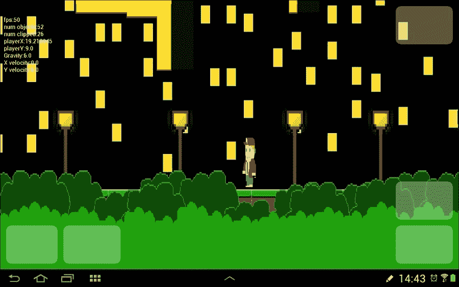

很快，我们将制作一些真正的可玩关卡，使用我们在过去四章中实现的所有功能。在此之前，让我们先来享受一下`Viewport`课的乐趣。

对玩家来说，扫描一个关卡并规划路线会非常有用。同样，在设计关卡时，缩放关卡以查看关卡的特定部分看起来如何，而不必让玩家角色到达该部分才能在屏幕上看到它，这也很有帮助。所以，让我们把暂停屏幕变成一个可移动的视窗。

## 带有可移动视窗的暂停菜单

这又好又快。我们将在我们的`Viewport`类中添加一堆新方法来改变焦点。然后，我们会从`InputController`给他们打电话。

如果你还记得当我们在[第 6 章](06.html "Chapter 6. Platformer – Bob, Beeps, and Bumps")、*平台转换器–鲍勃、哔哔声和碰撞*中实现`InputController`类时，我们在`if(playing)`测试中包装了所有的控制逻辑。我们也已经在`else`条款中实现了暂停按钮。我们要做的就是分别使用左、右、跳和拍摄按钮作为左、右、上、下，来移动视口。

首先，将这些方法添加到`Viewport`类中:

```java
public void moveViewportRight(int maxWidth){
  if(currentViewportWorldCentre.x < maxWidth -       
    (metresToShowX/2)+3) {

     currentViewportWorldCentre.x += 1;
  }
}

public void moveViewportLeft(){
  if(currentViewportWorldCentre.x > (metresToShowX/2)-3){
    currentViewportWorldCentre.x -= 1;
     }
}

public void moveViewportUp(){
  if(currentViewportWorldCentre.y > (metresToShowY /2)-3) {
        currentViewportWorldCentre.y -= 1;
   }
}

public void moveViewportDown(int maxHeight){
  if(currentViewportWorldCentre.y < 
    maxHeight - (metresToShowY / 2)+3) {

    currentViewportWorldCentre.y += 1;
  }
}
```

现在，将这些调用添加到我们刚刚讨论的`InputController`类中`if`条件的`else`子句中的方法中。

```java
//Move the viewport around to explore the map
switch (motionEvent.getAction() & MotionEvent.ACTION_MASK) {
  case MotionEvent.ACTION_DOWN:
 if (right.contains(x, y)) {
 vp.moveViewportRight(l.mapWidth);
 } else if (left.contains(x, y)) {
 vp.moveViewportLeft();
 } else if (jump.contains(x, y)) {
 vp.moveViewportUp();
 } else if (shoot.contains(x, y)) {
 vp.moveViewportDown(l.mapHeight);
 } else if (pause.contains(x, y)) {
 l.switchPlayingStatus();
 }
      break;
}
```

在暂停屏幕上，玩家可以在更复杂的关卡上环顾四周，规划自己的路线。他们可能需要。

## 等级和游戏规则

我们已经实现了这么多的特性，但是我们仍然没有办法将它们完全放入一个可玩的游戏中。我们需要能够在不同级别之间旅行，并且在旅行时保持玩家状态。

### 在不同层级之间旅行

我们将设计四个关卡，我们希望玩家能够在这四个关卡之间穿梭。首先，让我们在`LevelManager`构造函数的开始向`switch`语句添加代码，以包含我们将要构建的所有四个级别:

```java
switch (level) {
  case "LevelCave":
     levelData = new LevelCave();
     break;

// We can add extra levels here
case "LevelCity": 
 levelData = new LevelCity(); 
 break; 

case "LevelForest": 
 levelData = new LevelForest(); 
 break;

case "LevelMountain": 
 levelData = new LevelMountain(); 
 break;
}
```

我们知道，我们从`PlatformView`构造函数调用`loadLevel()`开始游戏。参数包括关卡的名称和玩家的坐标。如果你正在设计自己的关卡，那么你需要决定从哪个关卡和坐标开始。如果您将按照我提供的级别进行操作，请在`PlatformView`的构造器中调用`loadLevel()`，如下所示:

```java
loadLevel("LevelCave", 1, 16);
```

在`if(lm.isPlaying())`块中，在`update`方法中，我们将视口设置为以玩家每一帧为中心；添加以下代码来检测(并残忍地杀死)玩家，如果他从地图中掉出，并导致游戏重新开始，三条生命，零钱，没有升级，如果他用完生命:

```java
if (lm.isPlaying()) {
    // Reset the players location as 
    // the world centre of the viewport
    //if game is playing
    vp.setWorldCentre(lm.gameObjects.get(lm.playerIndex)
        .getWorldLocation().x,
        lm.gameObjects.get(lm.playerIndex)
        .getWorldLocation().y);

 //Has player fallen out of the map?
 if (lm.player.getWorldLocation().x < 0 ||
 lm.player.getWorldLocation().x > lm.mapWidth ||
 lm.player.getWorldLocation().y > lm.mapHeight) {

 sm.playSound("player_burn");
 ps.loseLife();
 PointF location = new PointF(ps.loadLocation().x,
 ps.loadLocation().y);

 lm.player.setWorldLocationX(location.x);
 lm.player.setWorldLocationY(location.y);
 lm.player.setxVelocity(0);
 }

 // Check if game is over
 if (ps.getLives() == 0) {
 ps = new PlayerState();
 loadLevel("LevelCave", 1, 16);
 }
}
```

现在，我们可以创建一个特殊的`GameObject`类，当被触摸时，它会将玩家发送到一个预定的级别和位置。然后，我们可以战略性地将这些对象添加到我们的级别设计中，它们将作为我们级别之间的链接。创建一个新的类，并将其称为`Teleport`。如果您还没有这样做，请将`Chapter8/drawable`中的`door.png`文件添加到项目的`drawable`文件夹中。

这就是我们的`Teleport`对象将如何在游戏中出现:


让我们创建一个简单的类来保存每个`Teleport`对象需要的数据。创建一个名为`Location`的新类，如下所示:

```java
public class Location {
     String level;
     float x;
     float y;

     Location(String level, float x, float y){
        this.level = level;
        this.x = x;
        this.y = y;
     }
}
```

实际的`Teleport`类看起来和任何其他的`GameObject`类一样，但是注意它也有一个成员`Location`变量。我们将看到关卡设计将如何保存`Teleport`的目的地，`LevelManager`类将初始化它，然后当玩家与它碰撞时，我们可以加载新的位置，将玩家发送到他的目的地。

```java
public class Teleport extends GameObject {

    Location target;

    Teleport(float worldStartX, float worldStartY, 
        char type, Location target) {

        final float HEIGHT = 2;
        final float WIDTH = 2;
        setHeight(HEIGHT); // 2 metres tall
        setWidth(WIDTH); // 1 metre wide
        setType(type);
        setBitmapName("door");

        this.target = new Location(target.level, 
            target.x, target.y);

        // Where does the tile start
        // X and y locations from constructor parameters
        setWorldLocation(worldStartX, worldStartY, 0);

        setRectHitbox();
    }

    public Location getTarget(){
        return target;
    }

    public void update(long fps, float gravity){
    }
}
```

为了让我们的`Teleport`类以一种让级别设计者决定它将做什么的方式工作，我们需要像这样添加我们的`LevelData`类:

```java
ArrayList<String> tiles;
ArrayList<BackgroundData> backgroundDataList;
ArrayList<Location> locations;

// This class will evolve along with the project
```

然后，我们需要在我们想要传送点/门的任何地方给关卡设计添加一个`t`，并在我们正在设计的关卡的类的构造函数中添加一个类似于下一行代码的条目。

请注意，您可以在地图中拥有任意多的`Teleport`对象，只要它们在代码中定义的顺序与它们在设计中出现的顺序相匹配。当我们在一分钟内查看我们的实际级别设计时，我们将确切地看到这是如何工作的，但是代码将如下所示:

```java
// Declare the values for the teleports in order of appearance
locations = new ArrayList<Location>();
this.locations.add(new Location("LevelCity", 118f, 18f));
```

像往常一样，我们需要更新`LevelManager`类来加载和定位我们的传送点。以下是`getBitmap()`的新代码:

```java
case 'z':
  index = 21;
  break;

case 't':
 index = 22;
 break;

default:
  index = 0;
  break;
```

`getBitmapIndex()`新代码:

```java
case 'z':
  index = 21;
     break;

case 't':
 index = 22;
 break;

default:
  index = 0;
  break;
```

我们还需要在加载阶段跟踪我们的`Teleport`对象，以防有多个对象。因此，添加一个新的局部变量，如`loadMapData`方法所示:

```java
//Keep track of where we load our game objects
int currentIndex = -1;
int teleportIndex = -1;
// how wide and high is the map? Viewport needs to know
```

最后对于`LevelManager`类，我们从关卡设计中初始化所有的传送数据，把它藏在对象中并添加到我们的`gameObject ArrayList`中。

```java
case 'z':
    // Add a boulders to the gameObjects
    gameObjects.add(new Boulders(j, i, c));
    break;

 case 't':
 // Add a teleport to the gameObjects
 teleportIndex++;
 gameObjects.add(new Teleport(j, i, c,
 levelData.locations.get(teleportIndex)));

 break;

```

我们真的很接近可以传送到任何地方。我们需要检测到与传送点的碰撞，然后在玩家想要的位置加载一个新的关卡。该代码将进入`PlatformView`类的碰撞检测开关块，如下所示:

```java
case 'f':
    sm.playSound("player_burn");
    ps.loseLife();
    location = new PointF(ps.loadLocation().x,
      ps.loadLocation().y); 
    lm.player.setWorldLocationX(location.x);
    lm.player.setWorldLocationY(location.y);
    lm.player.setxVelocity(0);
    break;

case 't':
 Teleport teleport = (Teleport) go;
 Location t = teleport.getTarget();
 loadLevel(t.level, t.x, t.y);
 sm.playSound("teleport");
 break;

default:// Probably a regular tile
    if (hit == 1) {// Left or right
        lm.player.setxVelocity(0);
        lm.player.setPressingRight(false);
    }
    if (hit == 2) {// Feet
        lm.player.isFalling = false;
    }
    break;
```

加载新级别时，`Player`、`MachineGun`和`Bullet`对象都是从头开始创建的。因此，我们需要在我们的`loadLevel`方法中添加一行，将当前机枪的射速从`PlayerState`级重新加载到`MachineGun`级。添加突出显示的代码:

```java
ps.saveLocation(location);

// Reload the players current fire rate from the player state
lm.player.bfg.setFireRate(ps.getFireRate());

```

现在，我们可以真正地在关卡设计上工作。

## 关卡设计

你只需将`Chapter8/java`文件夹中的四个类复制粘贴到你的项目中开始播放即可，也可以从头开始设计自己的。关卡非常大，错综复杂，很难被击败。物理上不可能以任何有意义的方式在书籍或电子书中打印级别设计，因此您需要打开`LevelCave`、`LevelCity`、`LevelForest`和`LevelMountain`设计文件才能看到四个级别的细节。

然而，下面简要讨论了级别、图片和一些截图，但不是来自四个设计的实际代码。

### 注

请注意，以下截图展示了新的抬头显示器，这是我们在本章中最后要介绍的内容。

### 山洞

洞穴层面是整个事情开始的地方。它不仅有适度令人沮丧的跳跃，而且有大量的火，使坠落可能致命。

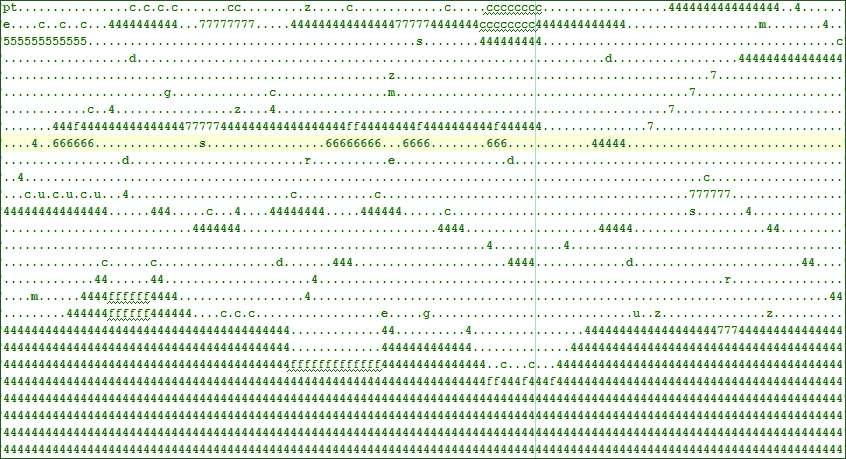

由于玩家从一把微不足道的机枪开始，关卡中只出现了几架无人机。但是有两个笨拙的守卫需要跳马。

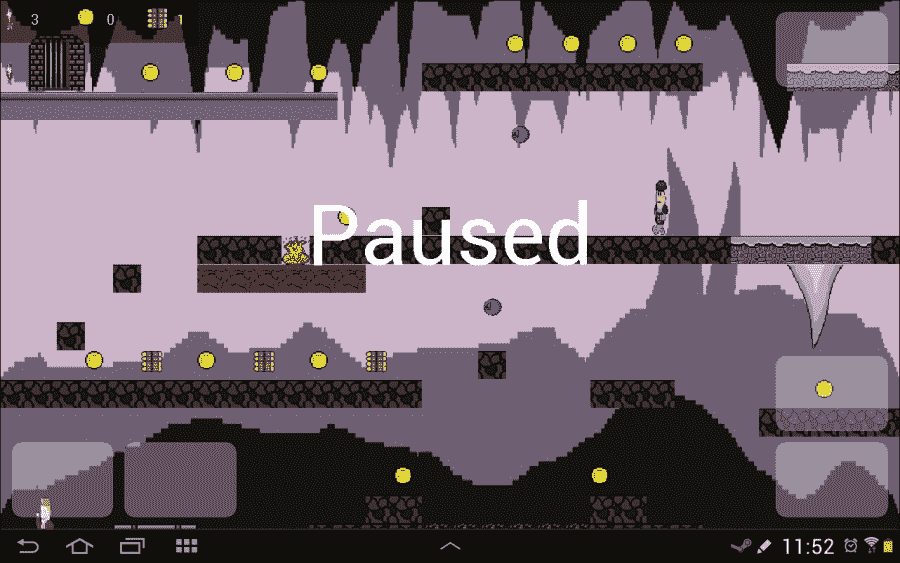

### 城市

这座城市拥有巨大的奖励，尤其是左下角的硬币和左上角的机枪升级。

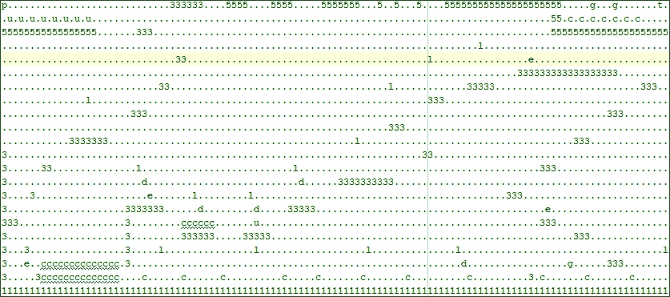

然而，如果玩家想要得到所有的硬币而不是选择把它们留下，那么在最底层会有一个非常尴尬的跳跃守卫。左手边必须穿过的近乎垂直的上升很可能会令人沮丧，如果玩家选择不进行机枪升级，他很可能会在门外挣扎着进入下一关。

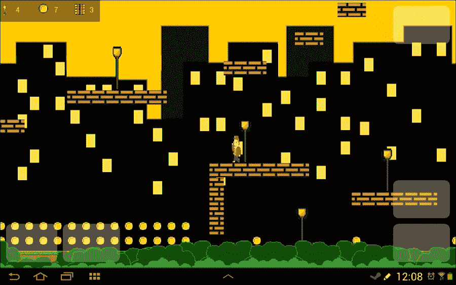

### 森林

森林可能是他们中整体最难的水平，有着残酷的长距离跳跃，非常容易跳过或跳过。

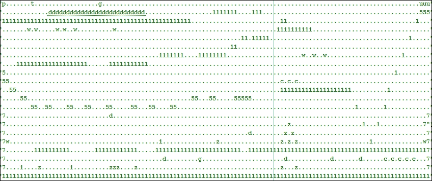

随着超过 12 架无人机等待扑向鲍勃，他的像素岌岌可危地悬挂在一个平台上。

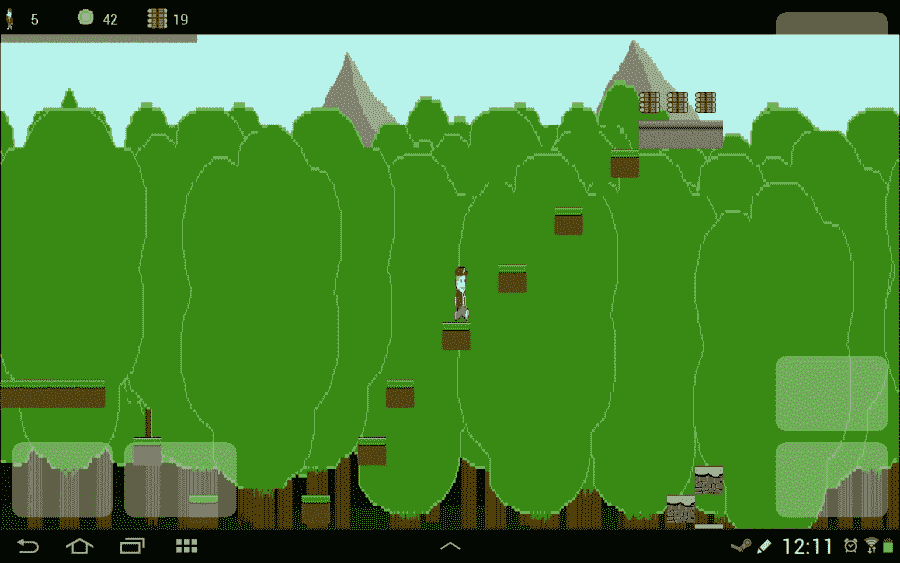

### 群山

清新的山间空气意味着鲍勃几乎成功了。看不见守卫或无人机。

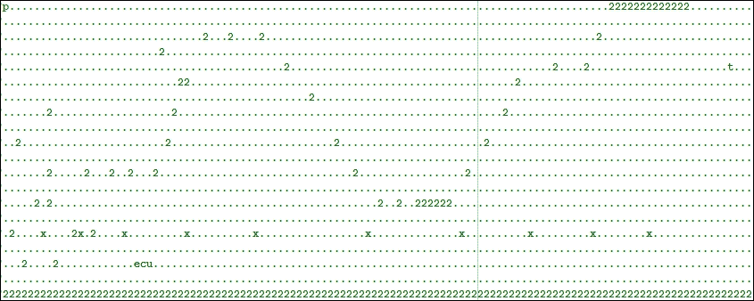

然而，看看这条蜿蜒的跳跃路径，如果鲍勃把一个像素放在不合适的位置，大部分都会看到他被扔回到底部。

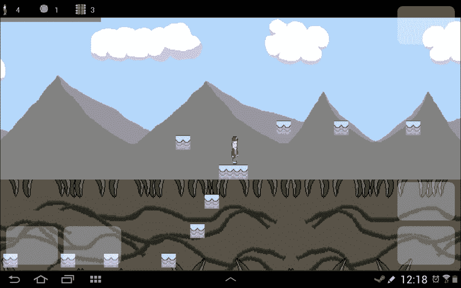

### 类型

如果你想尝试出每一关而不完成之前的累人关，你当然可以从你选择的关和位置开始。为此，只需将`PlatformView`构造函数中对`loadLevel()`的调用更改为以下之一:

```java
loadLevel("LevelMountain", 118, 17);
loadLevel("LevelForest", 1, 17);
loadLevel("LevelCity", 118, 18);
loadLevel("LevelCave", 1, 16);
```

### 抬头显示器

点睛之笔是增加一个平视显示器。`PlatformView`的`draw`方法中的这段代码使用了一些现有游戏对象的图形。

在最后一次调用`drawBackground()`之后，在绘制调试文本之前添加代码:

```java
// Draw the HUD
// This code needs bitmaps: extra life, upgrade and coin
// Therefore there must be at least one of each in the level

int topSpace = vp.getPixelsPerMetreY() / 4;
int iconSize = vp.getPixelsPerMetreX();
int padding = vp.getPixelsPerMetreX() / 5;
int centring = vp.getPixelsPerMetreY() / 6;
paint.setTextSize(vp.getPixelsPerMetreY()/2);
paint.setTextAlign(Paint.Align.CENTER);

paint.setColor(Color.argb(100, 0, 0, 0));
canvas.drawRect(0,0,iconSize * 7.0f, topSpace*2 + iconSize,paint);
paint.setColor(Color.argb(255, 255, 255, 0));

canvas.drawBitmap(lm.getBitmap('e'), 0, topSpace, paint);
canvas.drawText("" + ps.getLives(), (iconSize * 1) + padding, 
  (iconSize) - centring, paint);

canvas.drawBitmap(lm.getBitmap('c'), (iconSize * 2.5f) + padding, 
  topSpace, paint);

canvas.drawText("" + ps.getCredits(), (iconSize * 3.5f) + padding * 2, (iconSize) - centring, paint);

canvas.drawBitmap(lm.getBitmap('u'), (iconSize * 5.0f) + padding, 
  topSpace, paint);

canvas.drawText("" + ps.getFireRate(), (iconSize * 6.0f) + padding * 2, (iconSize) - centring, paint);
```

我想我们完了！

# 总结

我们完成了平台游戏，因为这是所有的空间。为什么不尝试实现以下部分或全部改进和功能？

更改`Player`类中的代码，使 Bob 逐渐加速和减速，而不是一直全速运行。只需为玩家向左或向右按下的每一帧增加速度，并为没有按下的每一帧减少速度。

一旦你做到了这一点，在`update`方法中的碰撞检测`switch`块中添加前面的代码，使玩家在雪地上打滑，在混凝土上加速，并对每种瓷砖类型有不同的行走/着陆声音效果。

在鲍勃身上画一把枪，调整`Bullet`物体产生的高度，使其看起来像是从他的机枪枪管里出来的。

让一些物体可以推动。在`GameObject`上增加一个`isPushable`成员，让碰撞检测简单的把物体敲回去一点。也许，鲍勃可以把矿车推进火里，跳过超宽的火坑。请注意，推动下降到另一个级别的对象将比推动保持在相同的 *y* 坐标的对象更复杂。

可破坏的瓷砖听起来很有趣。给他们一个强度变量，当被子弹击中时递减，当达到零时从`gameObjects`中移除。

移动平台是伟大平台的主要组成部分。只需将航路点添加到图块对象中，并将移动代码添加到`update`方法中。挑战将是分配路标。您可以让它们都左右或上下移动一定数量的空间，或者执行某种类似于我们编写`Guard`对象脚本的`setTileWaypoint`方法。

通过保存已收集的硬币总数，记住哪些级别未锁定，并提供从菜单屏幕重放任何未锁定级别的权限，使游戏更加持久。

使用传送点作为路标，让游戏变得更容易。针对不同的屏幕大小调整视口缩放。对于一些小手机来说，当前的变焦可能有点太低了。

为高分、排行榜和成就添加计时跑，并添加更多级别。

在下一章中，我们将看一个小得多的项目，但仍然是一个有趣的项目，因为我们将使用 OpenGL ES 进行超快速、平滑的绘制。