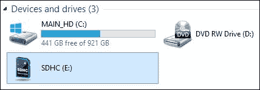

# 一、安卓和 BeagleBone Black 的介绍

在本书中，您将学习如何将安卓安装到 microSD 卡上，以便与 BeagleBone Black 一起使用，并创建与连接到 BeagleBone Black 的外部硬件接口的安卓应用。你将开发软件，通过按钮和传感器从外部世界接收输入，从外部存储芯片存储和检索数据，并点亮外部发光二极管。更好的是，您将学习如何以一种灵活的方式来做到这一点，这种方式可以轻松地集成到您的应用中。

当你探索硬件与安卓接口的世界时，你会发现它包含了许多不同的专业领域。了解电子电路并知道如何将它们与 BeagleBone Black 接口、了解 Linux 内核以及开发安卓应用就是这样的几个领域。幸运的是，你不必成为这些领域的专家，就能学习硬件与安卓接口的基础知识。我们已经尽最大努力指导您完成本书中的示例，而不需要您对 Linux 内核或电子学理论有深入的了解。

在本章中，我们将涵盖以下主题:

*   回顾安卓和 BeagleBone Black 的发展历程
*   购买硬件必需品
*   了解您将使用的硬件
*   在 BeagleBone Black 上安装安卓

# 回顾安卓和 BeagleBone Black 的发展历程

安卓操作系统已经席卷全球。自从 2007 年在测试版中向世界推出以来，它已经成长为主导的手机操作系统。除了手机之外，它还被用于平板电脑(如 Barnes & Noble Nook eReader 和 Tesco Hudl 平板电脑)和各种其他嵌入式多媒体设备。该操作系统增加了新的功能，并经过多年的发展，但它仍然具有与最初构思时相同的主要设计原则。它提供了一个带有触摸屏界面的轻量级操作系统，可以在使用最少资源的情况下快速轻松地访问多媒体应用。

除了普遍受欢迎之外，安卓还有许多优势，使其成为您项目的优秀操作系统。安卓的源代码是开源的，可以从[http://source.android.com](http://source.android.com)免费获得。您可以在自己创建的任何产品中免费使用。安卓使用流行的 Linux 内核，所以你对 Linux 已经拥有的任何专业知识都将帮助你开发安卓。有一个很好的接口应用编程接口，使得开发安卓变得简单和直接。

基于安卓系统的设备的广泛应用引起了人们对开发针对安卓系统的软件应用的极大兴趣。开发安卓应用变得更加容易。Eclipse **Android 开发工具(ADT)** 允许应用开发人员制作软件原型，然后在模拟的 Android 设备环境中执行该软件。然而，仿真设备在速度和外观方面与真实硬件有细微的(有时是戏剧性的)不同。幸运的是，有一个强大且低成本的硬件平台可以让你在真实硬件上快速轻松地测试你的应用:BeagleBone Black。

**BeagleBone Black (BBB)** 硬件平台，由**CircuitCo**T5 为 BeagleBoard.org 非营利组织制作，是开源硬件领域的新人。这款基于 ARM 的低成本单板计算机于 2013 年首次生产，是对最初 BeagleBone 平台的改进。BBB 比最初的 BeagleBone 板有所改进，它提供了更高的处理能力、内置的 HDMI 视频以及 2 或 4 GB(取决于 BBB 的版本)的板载 eMMC 内存。BBB 专注于小尺寸和各种扩展和接口机会，以非常低的价格提供大量处理能力。下图显示了一个典型的 BBB:


BeagleBone Black(来源:[www.beagleboard.org](http://www.beagleboard.org))

Android 运行在便宜的 BBB 上，这使得它成为一个很好的硬件平台，可以用来探索 Android 和开发自己的定制 Android 项目，例如，如果你有一个 Android kiosk 设备、手持游戏控制台或其他一些多媒体设备的想法。安卓和 BBB 的结合将使你能够快速、廉价地制作这种设备的原型。

现在，我们已经快速了解了 BBB 和 Android，让我们来看一下您需要充分利用它们的硬件。

# 购买硬件必需品

当你购买你的 BBB 时，你只会收到板和一根 USB 线来供电和与之通信。在您开始与 BBB 进行硬件接口项目的任何认真的软件开发之前，您还需要一些额外的硬件。在我们看来，购买这些物品的最佳地点是 T3【阿达果】T4([www.adafruit.com](http://www.adafruit.com))。这里几乎所有的东西都可以从这个单一的来源获得，他们的客户服务非常好。事实上，这里列出的许多项目都可以从 ada 水果公司(产品编号 703)获得作为 BeagleBone Black 入门套件。启动套件不包含 3.3 V **未来技术设备国际公司(FTDI)** 电缆，但它确实包括 BeagleBone Black 本身。


来自 ada 水果的 BeagleBone Black 发酵剂试剂盒的内容(来源:[www.adafruit.com](http://www.adafruit.com)

## 光纤到户电缆

3.3 伏 FTDI 电缆(产品识别号 70)允许查看 BBB 的所有串行调试输出。如果您正在执行任何重要的开发，您必须有一根这样的电缆。如果您希望观察 BBB 的引导过程(系统初始化时的引导加载程序和内核输出)，电缆是必要的，它还提供了一个进入 Linux 和安卓的控制台外壳。此外壳程序可帮助您解决引导问题，因为当网络连接不可用或没有通信服务启动和运行时，您将始终有一种与系统交互的方法。

## 电源

虽然 BBB 可以通过 USB 电缆为供电，但这种方法只能勉强提供足够的电力来运行 BBB。如果您使用外接电源，或者连接从 BBB 的 5 伏引脚获取电能的外接电路，则必须使用外接电源。BeagleBoard.org 规定电源必须是一个 2 安培，5 伏的 DC 电源，带有一个 2.1 毫米的中央正极桶形连接器。ada 水果销售符合 BBB 要求的电源(产品 ID 276)。

## 试验板和安装板

如果你能够轻松快速地构建电路而不用担心焊接的问题，那么用电子学做实验就变得简单多了。因此，我们建议您投资一个试验板和一些试验板跳线(产品编号 153)。你的实验板不一定要很大或者很花哨，但是你应该在本书给出的项目中至少使用一个标准的半尺寸实验板(产品 ID 64)。

阿达果原板(产品编号 702)是我们建议您购买的附加产品。原型板是一个塑料板，BBB 和一半大小的实验板都安装在上面。这有助于您避免意外拉伸或断开连接电子电路和 BBB 的电线。使用原型板使重新放置你的 BBB 和实验板变得简单和无痛。

## MicroSD 卡

如果你用 BBB 做了很多工作，你会总想多带几张 microSD 卡在身边！安卓将安装在一个 8 GB 的 microSD 卡上，有足够的可用空间来存放您自己的应用。您可以将安卓映像写入更大的 microSD 卡，但大多数预制的安卓系统映像只会占用卡上的前 4-8gb 空间。由于大多数笔记本电脑和台式电脑不直接接受 microSD 卡，您应该至少拥有一个 microSD 到 SD 卡适配器。幸运的是，这些适配器中的一个通常与您购买的每个 microSD 卡打包在一起。

# 了解您将与之交互的硬件

了解安卓软件与硬件接口的最佳方式是在将真实硬件组件连接到您的 BBB 的同时进行学习。这样，您的软件将与实际硬件对话，您可以直接观察您的应用如何响应与系统的物理交互。我们选择了多种电子元件，将在整本书中用来演示硬件接口的各个方面。欢迎您在兴趣和预算允许的情况下使用尽可能多或尽可能少的这些组件。一次性购买所有这些组件可能会很贵，但是如果您对实现该章中的示例感兴趣，请确保购买每章所需的所有组件。

## 通用组件

在[第 3 章](3.html#page_1 "Chapter 3. Handling Inputs and Outputs with GPIOs")、*用 GPIOs 处理输入和输出*、[第 6 章](6.html#page_1 "Chapter 6. Creating a Complete Interfacing Solution")、*创建完整的接口解决方案*中，您将使用各种电子元件，如按钮、发光二极管和电阻与 BBB 接口。其中很多物品可以从任何电子供应商处购买，如**digi key**([www.digikey.com](http://www.digikey.com))**Mouser Electronics**([www.mouser.com](http://www.mouser.com))**SparkFun**([www.sparkfun.com](http://www.sparkfun.com))。Digikey 和 Mouser 都提供了每种可用组件的如此多的变体，以至于没有经验的硬件黑客很难选择合适的组件来购买。因此，我们将推荐 SparkFun 的一些产品，这些产品将为您提供完成本书练习所需的合适组件。如果使用不同的供应商对您来说更方便，欢迎您从其他供应商处选择您的组件。

我们的例子只需要三个组件:一个电阻、一个按钮开关和一个发光二极管。我们建议购买 1K 欧姆、1/6(或 1/4)瓦电阻(部件#COM-08980)、12 毫米按钮开关(部件#COM-09190)以及任何可以由 3 伏或更低电压触发的小型发光二极管(尺寸为 3–10 毫米)(部件#COM-12903 是 5 毫米发光二极管的良好组合)。

## ada 水果内存转接板

在[第 4 章](4.html#page_1 "Chapter 4. Storing and Retrieving Data with I2C")、*与 I2C* 存储和检索数据、[第 6 章](6.html#page_1 "Chapter 6. Creating a Complete Interfacing Solution")、*创建完整的接口解决方案*中，您将与 32 KB **铁电随机存取存储器** ( **FRAM** )接口，该存储器是非易失性存储器集成电路，用于存储和检索数据。我们选择了包含该集成电路的 ada 水果转接板(产品编号 1895)。转接板已经包含了将集成电路连接到 BBB 的所有必要组件，因此您无需担心在每个集成电路和 BBB 之间创建干净、无噪声的连接所涉及的许多低级细节。


带标题条的 FRAM 突破板(来源:[www.adafruit.com](http://www.adafruit.com)

## 水果传感器转接板

在[第 5 章](5.html#page_1 "Chapter 5. Interfacing with High-speed Sensors Using SPI")、*使用 SPI 与高速传感器接口*、[第 6 章](6.html#page_1 "Chapter 6. Creating a Complete Interfacing Solution")、*创建完整的接口解决方案*中，您将与传感器 IC 接口以接收环境数据。我们选择了一个包含这些集成电路的 ada 水果转接板(产品编号 1900)。这些转接板已经包含了将集成电路连接到 BBB 的所有必要组件，因此您无需担心在每个集成电路和 BBB 之间创建干净、无噪声连接所涉及的许多低级细节。

## 准备分线板

每个分线板都带有一个标题条。该接线板必须焊接到每个转接板中，以便轻松连接到试验板。这是完成本书练习所需的唯一焊接。如果你不熟悉焊接，网上有很多教程解释有效焊接的技巧。如果您觉得焊接割台条不舒服，请朋友、讲师或同事帮助您完成此过程。

### 注

我们建议您查看以下几个在线焊接教程:

*   [https://www.youtube.com/watch?v=BLfXXRfRIzY](https://www.youtube.com/watch?v=BLfXXRfRIzY)
*   [https://learn.sparkfun.com/tutorials/how-to-solder 通孔焊接](https://learn.sparkfun.com/tutorials/how-to-solder---through-hole-soldering)

# 在 BeagleBone Black 上安装安卓

安卓操作系统是一个复杂的软件，由许多组件组成，这些组件是由一个非常大的代码库构建而成的。从源代码构建安卓可能是一项困难且耗时的任务，因此在本书中，您将使用来自 **BBBAndroid** 项目([www.bbbandroid.org](http://www.bbbandroid.org))的预制安卓映像。

BBBAndroid 是**安卓开源项目** ( **AOSP** ) KitKat 安卓到 BBB 的一个端口。BBB 有几种不同的安卓发行版，但是我们选择了 BBBAndroid，因为它使用了 3.8 Linux 内核。该内核包括**Cape Manager**(**Cape mgr**)功能以及一些其他工具，这些工具将帮助您将硬件与安卓应用接口。BBB 上其他口味的安卓使用的是 3.2 Linux 内核，这个版本要老很多，而且缺少 capemgr 的支持。[第 2 章](2.html#page_1 "Chapter 2. Interfacing with Android")、*与安卓系统的接口*更详细地讨论了 capemgr 功能。3.8 内核很好地平衡了为 BBB 启用新功能和避免任何潜在的不稳定的尖端功能之间的关系。

BBB 可以通过几种不同的方式启动其操作系统:

*   **板载 eMMC**:操作系统驻留在板载 eMMC 存储中。安装在你的 BBB 靴子上的埃斯特罗姆或 Debian 操作系统从 eMMC 开箱即用。
*   **MicroSD 卡**:操作系统位于插入 BBB 的 MicroSD 卡上。如果在 microSD 卡上安装了引导加载程序，安装在板载 eMMC 上的引导加载程序会注意到 microSD 的存在，并将从那里引导。此外，在 BBB 加电期间按住**用户启动**按钮时，会强制从 microSD 卡启动。
*   **通过网络**:引导加载程序能够通过 TFTP 通过网络下载内核。操作系统实际上可以在启动时下载，尽管这通常只在商业产品开发期间进行。这是本书范围之外的高级功能。

BBBAndroid 映像设计用于写入 microSD 卡并从其启动。由于该映像在 microSD 卡上创建了一个完全可引导的系统，因此您不必在开机过程中按住 BBB 的**用户引导**按钮即可引导至安卓系统。只需将 microSD 卡插入 BBB，您就可以自动引导至安卓系统。

使用基于 microSD 卡的操作系统对我们来说是有利的，因为您可以轻松地将卡安装在 Linux 电脑上，根据自己的意愿修改安卓文件系统。如果操作系统安装在 eMMC，很难访问操作系统来更改文件系统中的任意文件。系统必须在运行才能访问 eMMC 的内容，因此做出破坏系统或使其无法启动的更改会使访问 eMMC 来解决问题变得困难。

## 下载预制安卓图像

BBBAndroid 网站的主页提供了最新预制图像的下载链接。像任何开源项目一样，每个图像的版本号和大小的细节可能会随着时间的推移而改变，因为会发现 bug 并进行更改。然而，最新和最伟大的将通过网站提供。

BBBAndroid 的图像使用 xz compressor 实用程序进行压缩，以节省下载时的时间，因此在将图像写入 microSD 卡之前，必须对其进行解压缩。用于解压缩和写入映像的工具会因您使用的操作系统而异。虽然压缩图像的大小可能只有几百 MB，但未压缩的图像将是 8 GB。

### 注

在开始解压缩图像之前，请确保您有足够的硬盘空间来存放未压缩的图像。

## 使用 Windows 创建您的安卓 microSD 卡

在基于 Windows 的操作系统下，压缩的图像可以使用 7-Zip 或 WinRAR 等工具解压缩，然后使用 Win32 磁盘成像仪工具写入 microSD 卡。所有这些工具都可以免费下载。要准备安卓 microSD 卡，请执行以下步骤:

1.  对于这个例子，您将使用 WinRAR 应用。从[www.rarlab.com](http://www.rarlab.com)下载 WinRAR 并安装。WinRAR 将与 Windows 桌面的 Windows 资源管理器外壳集成。
2.  下载并安装 Win32 磁盘成像仪应用。它可以在项目的 SourceForge 页面[http://sourceforge.net/projects/win32diskimager](http://sourceforge.net/projects/win32diskimager)找到。
3.  Right-click on the BBBAndroid image that you downloaded and select the **Extract here** option on the Explorer shell context menu. An uncompressed version of the image (8 GB in size) will be written to the same location as the compressed image. The decompression process might take several minutes.

    

    用 WinRAR 解压缩 xz 压缩的图像

4.  将 8gb 以上的 microSD 卡插入系统。如果卡是预格式化的，它将被 Windows 检测到上面有一个有效的文件系统(大多数卡都是为了您的方便而预格式化出售的)。无论卡是否格式化，Windows 都会为其分配一个驱动器号。
5.  Browse to **This PC** and examine the devices shown under **Devices and drives**. The card should be shown. Make a note of the drive letter assigned to the card.

    

    microSD 卡将在 Windows 下显示一个驱动器号(图像中的驱动器 E)

6.  Launch Win32 Disk Imager. Enter the filename and path to the uncompressed image in the text field, or click on the folder icon to navigate to the file's location. Change the **Device** drop-down box to the drive letter of the microSD card that you identified in step 4.

    

    指定了图像文件的 Win32 磁盘成像仪(注意驱动器号与 microSD 卡的驱动器号匹配)

7.  写入图像需要几分钟时间。写入完成后，从计算机中取出 microSD 卡，并将其插入 BBB。
8.  开机 BBB 和安卓将开始开机。在第一次开机时，需要几分钟才能出现顶层 UI 画面。在后续的引导中，只需要 30 到 60 秒就可以到达顶级 UI 屏幕。

恭喜你！你的 BBB 现在运行的是安卓操作系统。

## 用 Linux 创建你的安卓 microSD 卡

在 Linux 下，压缩的安卓镜像可以使用`xz`命令进行解压缩，使用`dd`命令写入 microSD 卡。要准备安卓 microSD 卡，请执行以下步骤:

1.  确保您已经安装了`xz`。对于使用`apt-get`的系统，尝试安装 xz-utils 软件包:

    ```java
    $ sudo apt-get install xz-utils

    ```

2.  使用`xz`解压缩图像。替换图像文件的名称(文件扩展名为`.xz`，如下命令所示:

    ```java
    $ xz --decompress [IMAGE FILENAME]

    ```

3.  一旦解压缩，图像将失去其`.xz`文件扩展名，大小为 8 GB。将您的 microSD 卡插入计算机。`/dev`目录中的设备将被分配到您的卡上。要确定是哪个设备，请使用`fdisk` :

    ```java
    $ sudo fdisk –l

    ```

4.  The `fdisk` utility will display all storage devices currently connected to your computer. One of the devices will report as being the same size as the microSD card. For example, if you insert an 8 GB microSD card, you will see something similar to this:

    ```java
    Disk /dev/sdb: 8018 MB, 8018460672 bytes

    ```

    卡的确切存储容量因制造商而异，但大小约为 8 GB。分配给该卡的设备为`/dev/sdb`。`fdisk`列出的其他设备将是二级存储设备(如您的硬盘)。在继续之前，请确保您已经识别出属于您的 microSD 卡的正确设备文件。如果您选择了错误的设备，您将破坏该设备上的文件系统！

5.  使用`dd`将图像写入 microSD 卡。假设您在步骤 5 中识别的设备是`/dev/sdb`，使用以下命令执行写入:

    ```java
    $ sudo dd if=[NAME OF IMAGE] of=/dev/sdb bs=4M

    ```

6.  写入图像需要几分钟时间。写入完成后，从计算机中取出 microSD 卡，并将其插入 BBB。

开启 BBB 和安卓将开始开机。第一次启动时，顶级 UI 屏幕需要几分钟才能出现。在后续的引导中，只需要 30 到 60 秒就可以到达顶级 UI 屏幕。

恭喜你！你的 BBB 现在运行的是安卓操作系统。

# 总结

在本章中，您了解了为 BeagleBone Black 开发软件所需的硬件、本书练习所需的电子组件和设备，以及如何将安卓发行版安装到 microSD 卡上以在 BBB 上使用。在下一章中，您将学习安卓如何在软件层面与硬件交互，以及如何将 BBB 配置为与您将在本书中使用的硬件组件接口。