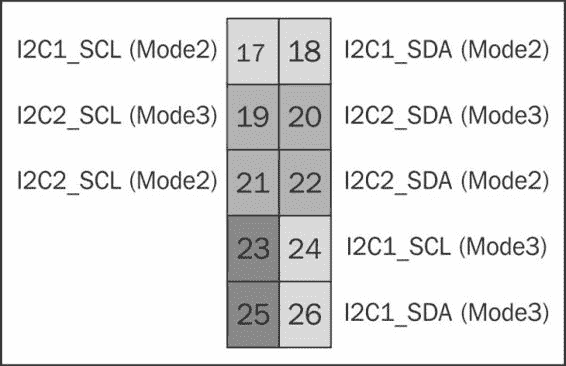
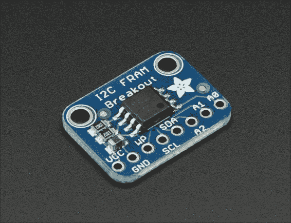
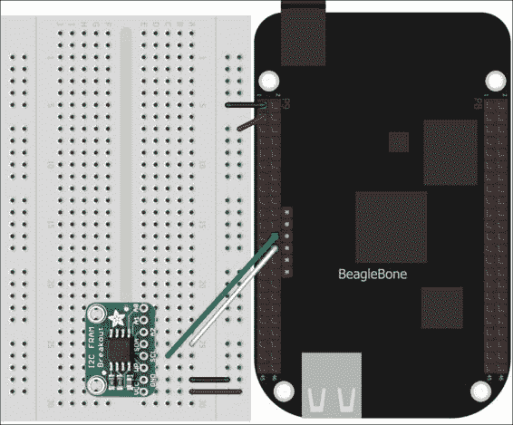

# 四、使用 I2C 存储和检索数据

上一章，你用 GPIOs 和外界交换简单的数字数据。然而，与需要复杂的位或字节序列进行通信的更高级设备接口呢？

当今在嵌入式系统中使用的最流行的接口总线之一是**集成电路间**串行总线(通常缩写为**【IIC】**、 **I** 2 **C** 或 **I2C** )。在本章中，您将学习如何编写一个应用，该应用使用 BBB 的 I2C 接口向 FRAM 芯片存储数据和从该芯片检索数据。我们将涵盖以下主题:

*   了解 I2C
*   BBB 上的 I2C 多路复用
*   在 Linux 内核中代表 I2C 设备
*   构建 I2C 接口电路
*   探索 I2C FRAM 示例应用

# 了解 I2C

最初由飞利浦半导体在 1982 年开发，作为与集成电路通信的总线，I2C 协议已经成为一种通用总线，得到了各种集成电路制造商的支持。I2C 总线是一种多主多从的总线，尽管最常见的配置是一条总线上有一个主设备和一个或多个从设备。I2C 主设备通过生成时钟信号来设置总线的速度，并启动与从设备的通信。从设备接收主设备的时钟信号，并响应主设备的查询。

通过 I2C 通信只需要四根电线:

*   一个时钟信号(SCL)
*   一个数据信号
*   正电源电压
*   地面

只需要两个引脚(用于 SCL 和 SDA 信号)就可以与多个从设备通信，这使得 I2C 成为一个诱人的接口选择。硬件接口的难点之一是有效分配有限数量的处理器引脚，以便最好地同时处理与大量不同设备的通信。通过只需要两个处理器引脚来与各种设备通信，I2C 释放了引脚，现在可以分配给其他任务。


具有单个主设备和三个从设备的 I2C 总线示例

## 使用 I2C 的设备

由于 I2C 总线的灵活性和广泛使用，有许多设备使用它进行通信。不同种类的存储设备，如 EEPROM 和 FRAM 集成电路，通常通过 I2C 接口。例如，BBB capes 上的 EEPROMs 都是由 BBB 的处理器通过 I2C 访问的。温度、压力和湿度传感器、加速度计、液晶控制器和步进电机控制器都是可通过 I2C 总线获得的设备。

# BBB 上 I2C 的多路复用

BBB 的 AM335X 处理器提供三条 I2C 总线:

*   I2C0
*   I2C1
*   I2C2

BBB 通过其 P9 报头暴露 I2C1 和 I2C2 总线，但 I2C0 总线不容易访问。I2C0 目前提供了 BBB 处理器和内置 HDMI cape 的 HDMI 成帧器芯片之间的通信通道，因此应该认为它不可用于您的使用(除非您想通过将电线直接焊接到 BBB 上的走线和芯片引脚来取消保修)。

I2C1 总线可供您一般使用，通常是前往进行 I2C 接口的*总线。如果 I2C1 处于最大容量或不可用，I2C2 总线也可供您使用。*

## 通过 P9 集管连接 I2C

默认情况下，I2C1 不与任何引脚复用，I2C2 可通过 P9.19 和 P9.20 引脚获得。I2C2 在外部 cape 板上的识别 EEPROMs 和内核的 capemgr 之间提供 I2C 通信。您可以将 I2C2 多路复用到其他引脚，甚至完全禁用它，但如果这样做，capemgr 将不再能够自动检测连接到 BBB 的 cape 板的存在。一般来说，你可能不想这么做。

下图显示了 P9 头上可以混合 I2C 信号的每个潜在引脚:



具有不同引脚复用模式的 P9 报头上的 I2C 总线的位置

## I2C 的多路复用

当决定在项目中使用 I2C 时如何混合您的大头针时，请记住以下事项:

*   避免将任何单个 I2C 信号多路复用到多个引脚。这样做毫无理由地浪费了你的一根针。
*   避免将 I2C2 从其默认位置多路复用，因为这会阻止 capemgr 自动检测连接到 BBB 的 cape 板。
*   您可以在自己的项目中使用默认的 I2C2 总线，但请注意，它的时钟频率为 100 KHz，地址 0x54 至 0x57 是为 cape EEPROMs 保留的。
*   将 I2C1 通道多路复用到 P9.17 和 P9.18 与 SPI0 通道冲突，因此如果您也希望使用 SPI，通常不会希望使用此配置。

# 代表 Linux 内核中的 I2C 设备

I2C 总线和设备作为`/dev`文件系统中的文件暴露在用户空间中。I2C 公交车被曝光为`/dev/i2c-X`档，其中`X`是 I2C 频道的逻辑号。虽然 I2C 总线的硬件信号被清楚地编号为 0、1 和 2，但逻辑通道号不一定与它们的硬件对应物相同。

逻辑通道编号是按照设备树中初始化 I2C 通道的顺序分配的。例如，I2C2 通道通常是内核初始化的第二个 I2C 通道。因此，即使它是物理 I2C 通道 2，它也将是逻辑 I2C 通道 1，并且可以作为`/dev/i2c-1`文件访问。

在安卓应用编程接口和服务的所有层之下，安卓最终通过打开`/dev`和`/sys`文件系统中的文件，然后对这些文件进行读取、写入或执行`ioctl()`调用来与内核中的设备驱动程序进行交互。虽然只使用`/dev/i2c-X`文件上的`ioctl()`调用就可以与任何 I2C 设备交互，从而直接控制 I2C 总线，但这种方法很复杂，通常应该避免。相反，您应该尝试使用一个内核驱动程序，在 I2C 总线上与您的设备进行通信。然后，您可以对该内核驱动程序公开的文件进行`ioctl()`调用，以轻松控制您的设备。

## 准备安卓系统在 FRAM 使用

在[第二章](2.html#page_1 "Chapter 2. Interfacing with Android")、*与安卓系统的接口*中，您使用`adb`将两个预建文件推送到您的安卓系统。这两个文件`BB-PACKTPUB-00A0.dtbo`和`init.{ro.hardware}.rc`配置你的安卓系统，启用一个处理 FRAM 接口的内核设备驱动程序，多路复用引脚以启用 I2C1 总线，并允许你的应用访问它。

就 I2C 而言，`BB-PACKTPUB-00A0.dtbo`将 P9.24 和 P9.26 引脚叠加成 I2C SCL 和 SDA 信号。在`PacktHAL.tgz`文件中，叠加的源代码位于`cape/BB-PACKTPUB-00A0.dts`文件中。负责复用这两个引脚的代码位于`fragment@0`内的`bb_i2c1a1_pins`节点:

```java
/* All I2C1 pins are SLEWCTRL_SLOW, INPUT_PULLUP, MODE3 */
bb_i2c1a1_pins: pinmux_bb_i2c1a1_pins {
    pinctrl-single,pins = <
        0x180 0x73  /* P9.26, i2c1_sda */
        0x184 0x73  /* P9.24, i2c1_scl */
    >;
};
```

虽然这设置了多路复用，但它不会为这些引脚分配和配置设备驱动程序。`fragment@1`节点执行内核驱动程序分配:

```java
fragment@1 {
    target = <&i2c1>;
    __overlay__ {
        status = "okay";
        pinctrl-names = "default";
        pinctrl-0 = <&bb_i2c1a1_pins>;
        clock-frequency = <400000>;
        #address-cells = <1>;
        #size-cells = <0>;

        /* This is where we specify each I2C device on this bus */
        adafruit_fram: adafruit_fram0@50 {
            /* Kernel driver for this device */
            compatible = "at,24c256";
            /* I2C bus address */
            reg = <0x50>;
        };
    };
};
```

无需过多赘述，`fragment@1`中有四个设置是你感兴趣的:

*   第一个设置是`pinctrl-0`，它将设备树的这个节点与`bb_i2c1a1_pins`节点中固定的管脚联系起来
*   第二个设置是`clock-frequency`，将 I2C 总线速度设置为 400 千赫
*   第三个设置是`compatible`，它指定了将处理我们的硬件设备的特定内核驱动程序(类似 EEPROM 的设备的`24c256`驱动程序)
*   最后一个设置是 `reg`，它指定了这个设备将驻留在 I2C 总线上的地址(在我们的例子中是`0x50`)

# 构建 I2C 接口电路

现在您已经了解了 I2C 设备连接到 BBB 的位置以及 Linux 内核如何为这些设备提供接口，现在是时候将 I2C 设备连接到 BBB 了。

正如我们在[第 1 章](1.html#page_1 "Chapter 1. Introduction to Android and the BeagleBone Black")、*安卓和 BeagleBone Black*的介绍中所提到的，在这一章中你将与 FRAM 芯片进行接口。具体来说，就是富士通半导体 MB85RC256V FRAM 芯片。这款 8 针芯片提供 32 KB 的非易失性存储。这种特殊的芯片仅在 T5 小外形封装 ( **SOP** 中提供，这是一种表面贴装芯片，在构建原型电路时可能很难使用。对我们来说幸运的是，FRAM 的 ada 水果突破板已经安装了芯片，这使得原型制作简单易行。

### 类型

**不要拆你的电路！**

本章中的 FRAM 电路是[第 6 章](6.html#page_1 "Chapter 6. Creating a Complete Interfacing Solution")、*中使用的更大电路的一部分，创建了一个完整的接口解决方案*。如果您按照图表中的位置(靠近试验板底部)构建电路，您可以在构建本书中的其余电路时，简单地将 FRAM 转接板和导线留在原位。这样，当你到达[第六章](6.html#page_1 "Chapter 6. Creating a Complete Interfacing Solution")时，它就已经建成并开始工作了。

## 连接 FRAM

每个 I2C 设备必须在 I2C 总线上使用一个地址来标识自己。我们使用的 FRAM 芯片可以配置为使用 0x50 至 0x57 范围内的地址。这是 EEPROM 器件的常见地址范围。通过使用转接板的地址线(A0，A1，A2)来设置准确的地址。FRAM 的基址是 0x50。如果 A0、A1 和/或 A2 线连接到 3.3 V 信号，地址将分别增加 0x1、0x2 和/或 0x4。对于该接口项目，没有连接任何寻址线，这导致 FRAM 在 I2C 总线上保留其基址 0x50。



FRAM 转接板(A0、A1 和 A2 寻址线是该板最右侧的三个端子)

### 注

许多 I2C 器件的地址可以通过将器件的地址引脚连接到地或电压信号来配置。这是因为同一台 I2C 总线上可以有同一台设备的多个副本。电路设计人员可以通过重新布线地址引脚为每个器件分配不同的地址，而不必购买预先分配了不同地址且互不冲突的不同器件。

下图显示了 FRAM 转接板和 BBB 之间的连接。四个主要的 I2C 总线信号(+3.3 V、地和 I2C SCL/SDA)是使用 P9 连接器的引脚制作的，因此我们将试验板放在 BBB 的 P9 侧。



完整的 I2C 接口电路

让我们开始吧:

1.  将 P9.1(接地)连接至试验板的垂直接地母线，并将 P9.3 (3.3 V)连接至试验板的垂直 VCC 母线。这些连接与您在[第 3 章](3.html#page_1 "Chapter 3. Handling Inputs and Outputs with GPIOs")、*中创建的用 GPIO*处理输入和输出的 GPIO 试验板电路相同。
2.  I2C 信号 SCL 和 SDA 分别位于 P9.24 和 P9.26 引脚。将 P9.24 引脚连接到转接板上标记为 SCL 的引脚，并将 P9.26 引脚连接到转接板上标记为 SDA 的引脚。
3.  将接地总线连接到转接板的 GND 引脚，将 VCC 总线连接到转接板的 VCC 引脚。保持**写保护** ( **WP** )引脚和三个地址引脚(A0，A1，A2)不连接。

FRAM 突破板现已电连接到 BBB，并准备好供您使用。对照完整的 FRAM 接口电路图仔细检查您的接线，以确保一切连接正确。

## 检查 FRAM 与 I2C 工具的连接

I2C 工具是一套实用工具，允许您探测和互动 I2C 巴士。这些工具在使用 Linux 内核的系统上工作，它们包含在 BBBAndroid 映像中。实用程序通过打开`/dev/i2c-X`设备文件并对其进行`ioctl()`调用来与 I2C 总线交互。默认情况下，您必须拥有超级用户权限才能使用`i2c-tools`，但是 BBBAndroid 会降低`/dev/i2c-X`文件的权限，以便任何进程(包括`i2c-tools`)都可以读写关于 I2C 总线的信息。

例如，让我们尝试使用`i2c-tools`中的`i2cdetect`实用程序。`i2cdetect`将扫描指定的 I2C 总线，并识别 I2C 设备所在的总线地址。使用 ADB shell，您将探测 i2c-2 物理总线，这也是第二条逻辑总线(`/dev/i2c-1`):

```java
root@beagleboneblack:/ # i2cdetect -y -r 1
 0  1  2  3  4  5  6  7  8  9  a  b  c  d  e  f
00:          -- -- -- -- -- -- -- -- -- -- -- -- --
10: -- -- -- -- -- -- -- -- -- -- -- -- -- -- -- --
20: -- -- -- -- -- -- -- -- -- -- -- -- -- -- -- --
30: -- -- -- -- -- -- -- -- -- -- -- -- -- -- -- --
40: -- -- -- -- -- -- -- -- -- -- -- -- -- -- -- --
50: -- -- -- -- UU UU UU UU -- -- -- -- -- -- -- --
60: -- -- -- -- -- -- -- -- -- -- -- -- -- -- -- --
70: -- -- -- -- -- -- -- --

```

### 注

`i2cdetect`的输出显示当前总线上检测到的每个设备。任何未使用的地址都有一个`--`标识符。在设备树中为设备驱动程序保留的任何地址，如果当前没有位于该地址的设备，都有一个`UU`标识符。如果在特定地址检测到设备，设备的两位十六进制地址将作为标识符出现在`i2cdetect`输出中。

`i2cdetect`的输出显示设备树已经为 i2c-2 物理总线上的四个 I2C 设备分配了驱动器。这四个设备是 capemgr 的地址 0x54-0x57 处的 EEPROMs。这些设备实际上并不存在，因为没有角板连接到 BBB，所以每个地址都有一个`UU`标识符。

在 FRAM 转接板与 BBB 电连接后，您必须确认 FRAM 是 I2C 总线上的可见设备。为此，使用`i2cdetect`检查 i2c-1 物理总线(逻辑总线 2)上的设备:

```java
root@beagleboneblack:/ # i2cdetect -y -r 2
 0  1  2  3  4  5  6  7  8  9  a  b  c  d  e  f
00:          -- -- -- -- -- -- -- -- -- -- -- -- --
10: -- -- -- -- -- -- -- -- -- -- -- -- -- -- -- --
20: -- -- -- -- -- -- -- -- -- -- -- -- -- -- -- --
30: -- -- -- -- -- -- -- -- -- -- -- -- -- -- -- --
40: -- -- -- -- -- -- -- -- -- -- -- -- -- -- -- --
50: 50 -- -- -- -- -- -- -- -- -- -- -- -- -- -- --
60: -- -- -- -- -- -- -- -- -- -- -- -- -- -- -- --
70: -- -- -- -- -- -- -- --

```

### 类型

**仔细检查你的接线**

如果`i2cdetect`输出在 0x50 地址位置显示一个`UU`，你知道 I2C 总线没有识别出 FRAM 被连接。确保在将 FRAM 转接板连接到 BBB 时，不会意外地交换 SCL (P9.24)和 SDA (P9.26)导线。

# 探索 I2C FRAM 示例应用

在这一节中，我们将研究我们的示例安卓应用，该应用使用 BBB 上的 I2C 与 FRAM 接口。该应用的目的是演示如何使用 PacktHAL 在实际应用中执行 FRAM 读写。PacktHAL 提供了一套接口功能，你可以在你的安卓应用中使用这些功能与 FRAM 一起工作。这些功能允许您从 FRAM 检索数据块，并写入新数据存储在 FRAM。硬件接口的底层细节在 PacktHAL 中实现，因此您可以快速轻松地让您的应用与 FRAM 突破板交互。

在深入研究 FRAM 应用的代码之前，您必须将代码安装到您的开发系统中，并将应用安装到您的安卓系统中。该应用的源代码以及预编译的`.apk`包位于`chapter4.tgz`文件中，该文件可从 Packt 网站下载。按照[第 3 章](3.html#page_1 "Chapter 3. Handling Inputs and Outputs with GPIOs")、*中描述的相同过程，下载应用并将其添加到您的 Eclipse ADT 环境中，使用 GPIOs* 处理输入和输出。

## 应用的用户界面

在安卓系统上启动`fram`应用即可看到该应用的 UI。如果你使用的是触摸屏斗篷，你只需轻触屏幕上的 **fram** 应用图标，即可启动该应用并与其 UI 交互。如果您正在使用 HDMI 进行视频，请将一个 USB 鼠标连接到 BBB 的 USB 端口，并使用鼠标单击 **fram** 应用图标来启动该应用。由于该应用接受用户的文本输入，您可能会发现将 USB 键盘连接到 BBB 很方便。否则，您将能够使用屏幕上的安卓键盘输入文本。

这个应用的 UI 比上一章的 GPIO 应用复杂一点，但是还是相当简单的。就这么简单，app 唯一的活动就是默认的`MainActivity`。用户界面由两个文本字段、两个按钮和两个文本视图组成。


FRAM 示例应用屏幕

顶部文本字段在`activity_main.xml`文件中有`saveEditText`标识符。`saveEditText`字段最多接受 60 个字符，这些字符将存储到 FRAM。顶部带有**保存**标签的按钮有`saveButton`标识符。该按钮有一个名为`onClickSaveButton()`的`onClick()`方法，触发与 FRAM 接口的过程，以存储包含在`saveEditText`文本字段中的文本。

底部文本字段有`loadEditText`标识符。该文本字段将显示 FRAM 持有的任何数据。带**加载**标签的底部按钮有`loadButton`标识符。该按钮有一个名为`onClickLoadButton()`的`onClick()`方法，触发与 FRAM 接口的过程，加载前 60 个字节的数据，然后更新`loadEditText`文本字段中显示的文本。

## 调用帕克塔尔 FRAM 函数

PacktHAL 中的 FRAM 接口功能在四个 C 函数中实现:

*   `openFRAM()`
*   `readFRAM()`
*   `writeFRAM()`
*   `closeFRAM()`

这些功能的原型位于应用项目内的`jni/PacktHAL.h`头文件中:

```java
extern int openFRAM(const unsigned int bus, const unsigned int address);
extern int readFRAM(const unsigned int offset, const unsigned int 
    bufferSize, const char *buffer);
extern int writeFRAM(const unsigned int offset, const unsigned int 
    const char *buffer);
extern void closeFRAM(void);
```

`openFRAM()`功能打开`/dev`文件系统中的文件，该文件系统为 24c256 EEPROM 内核驱动程序提供接口。它的对应功能是 `closeFRAM()`，一旦不再需要与 FRAM 的硬件接口，它就关闭这个文件。`readFRAM()`功能从 FRAM 读取数据缓冲区，`writeFRAM()`功能将数据缓冲区写入 FRAM 进行持久存储。这四个功能共同提供了与 FRAM 互动所需的所有必要功能。

就像上一章的`gpio`应用一样，`fram`应用通过`System.loadLibrary()`调用加载 PacktHAL 共享库，以访问 PacktHAL FRAM 接口函数和调用它们的 JNI 包装函数。然而，与`gpio`应用不同的是，`fram`应用的`MainActivity`类并没有用`native`关键字指定调用 PacktHAL JNI 包装器 C 函数的方法。相反，它将硬件接口留给一个名为`HardwareTask`的*异步任务*类:

```java
Public class MainActivity extends Activity {

    Public static HardwareTask hwTask;

    Static {
        System.loadLibrary("packtHAL");
    }
```

## 理解 AsyncTask 类

`HardwareTask`扩展了`AsyncTask`类别，使用它比在`gpio`应用中实现硬件接口的方式更具优势。`AsyncTask` s 允许您执行复杂且耗时的硬件接口任务，而在执行任务时，您的应用不会无响应。一个`AsyncTask`类的每个实例可以在安卓系统中创建一个新的**执行线程** 。这类似于在其他操作系统上发现的多线程程序如何旋转新线程来处理文件和网络输入/输出、管理用户界面和执行并行处理。

在前一章中，`gpio`应用在执行过程中只使用了一个线程。这个线程是所有安卓应用的主要用户界面线程。用户界面线程旨在尽快处理用户界面事件。当您与用户界面元素交互时，该元素的处理程序方法由用户界面线程调用。例如，单击按钮会导致用户界面线程调用按钮的`onClick()`处理程序。`onClick()`处理程序然后执行一段代码并返回到用户界面线程。

安卓一直在监控用户界面线程的执行。如果处理程序执行时间过长，安卓会向用户显示一个**应用不响应** ( **ANR** ) 对话框。你永远不希望 ANR 对话框出现在用户面前。这是一个迹象，表明你的应用运行效率低下(甚至根本没有！)在 UI 线程内的处理程序中花费太多时间。


安卓系统中的应用不响应对话框

最后一章中的`gpio`应用从用户界面线程中非常快速地读取和写入 GPIO 状态，因此触发 ANR 的风险非常小。与 FRAM 对接是一个慢得多的过程。由于 BBB 的 I2C 总线以 400 千赫的最高速度运行，当使用 FRAM 时，读取或写入一个字节的数据大约需要 25 微秒。虽然这不是小型写入的主要问题，但读取或写入整个 32，768 字节的 FRAM 可能需要将近一整秒的时间来执行！

对完整 FRAM 的多次读写很容易触发 ANR 对话框，因此有必要将这些耗时的活动移出用户界面线程。通过将您的硬件接口放入它自己的`AsyncTask`类，您将这些时间密集型任务的执行与用户界面线程的执行分离开来。这可以防止您的硬件接口触发 ANR 对话。

## 学习硬件任务类的细节

`HardwareTask`的 `AsyncTask`基类提供了很多不同的方法，可以参考 Android API 文档进一步探索。我们的硬件接口工作直接关注的四种`AsyncTask`方法是:

*   `onPreExecute()`
*   `doInBackground()`
*   `onPostExecute()`
*   `execute()`

这四个方法中，只有`doInBackground()`方法在自己的线程内执行。其他三个方法都在 UI 线程的上下文中执行。只有在用户界面线程上下文中执行的方法才能更新屏幕用户界面元素。


执行 HardwareTask 方法和 PacktHAL 函数的线程上下文

很像上一章`gpio`应用的类，`HardwareTask`类提供了四个`native`方法，用于调用与 FRAM 硬件接口相关的 PacktHAL JNI 函数:

```java
public class HardwareTask extends AsyncTask<Void, Void, Boolean> {

  private native boolean openFRAM(int bus, int address);
  private native String readFRAM(int offset, int bufferSize);
  private native void writeFRAM(int offset, int bufferSize, 
      String buffer);
  private native boolean closeFRAM();
```

`openFRAM()`方法初始化你的应用对位于逻辑 I2C 总线上的 FRAM 的访问(参数`bus`)和对特定总线地址的访问(参数`address`)。一旦通过`openFRAM()`呼叫初始化与特定 FRAM 的连接，所有`readFRAM()`和`writeFRAM()`呼叫将应用于该 FRAM，直到进行`closeFRAM()`呼叫。

`readFRAM()`方法将从 FRAM 中检索一系列字节，并将其作为 Java `String`返回。从 FRAM 开始的`offset` 字节偏移处开始检索总共`bufferSize`字节。`writeFRAM()`方法将一系列字节存储到 FRAM。Java 字符串`buffer`中的总共`bufferSize`个字符存储在 FRAM 中，从 FRAM 开始的偏移量`offset`字节开始。

在`fram`应用中，`MainActivity`类中**加载**和**保存**按钮的`onClick()`处理程序各自实例化一个新的`HardwareTask`。在`HardwareTask`实例化之后，立即调用`loadFromFRAM()`或`saveToFRAM()`方法开始与 FRAM 交互:

```java
public void onClickSaveButton(View view) {
   hwTask = new HardwareTask();
   hwTask.saveToFRAM(this);  
}

public void onClickLoadButton(View view) {
   hwTask = new HardwareTask();
   hwTask.loadFromFRAM(this);
}
```

`HardwareTask`类中的`loadFromFRAM()`和`saveToFRAM()`方法都调用基础`AsyncTask`类`execution()`方法来开始新的线程创建过程:

```java
public void saveToFRAM(Activity act) {
   mCallerActivity = act;
   isSave = true;
   execute();
}

public void loadFromFRAM(Activity act) {
   mCallerActivity = act;
   isSave = false;
   execute();
}
```

### 注

每个`AsyncTask`实例只能调用一次其`execute()`方法。如果需要第二次运行`AsyncTask`，必须实例化它的一个新实例，并调用新实例的`execute()`方法。这就是为什么我们在**加载**和**保存**按钮的`onClick()`处理程序中实例化`HardwareTask`的新实例，而不是实例化单个`HardwareTask`实例，然后多次调用其`execute()`方法。

`execute()`方法自动调用`HardwareTask`类的 `onPreExecute()`方法。`onPreExecute()`方法执行任何必须在新线程开始之前进行的初始化。在`fram`应用中，这需要禁用各种用户界面元素并调用`openFRAM()`来初始化通过 PacktHAL 到 FRAM 的连接:

```java
protected void onPreExecute() {  
   // Some setup goes here
   ...    
  if ( !openFRAM(2, 0x50) ) {
     Log.e("HardwareTask", "Error opening hardware");
     isDone = true;
  }
  // Disable the Buttons and TextFields while talking to the hardware
  saveText.setEnabled(false);
  saveButton.setEnabled(false);
  loadButton.setEnabled(false); 
}
```

### 类型

**禁用用户界面元素**

当您执行后台操作时，您可能希望在操作完成之前不让应用的用户提供更多输入。在 FRAM 读取或写入期间，我们不希望用户按下任何用户界面按钮或更改保存在`saveText`文本字段中的数据。如果您的用户界面元素一直处于启用状态，用户可以通过重复点击用户界面按钮来同时启动多个`AsyncTask`实例。为了防止这种情况，请禁用限制用户输入所需的任何用户界面元素，直到该输入是必需的。

一旦`onPreExecute()`方法结束，`AsyncTask`基类旋转一个新线程，并在该线程中执行`doInBackground()`方法。新线程的生命周期仅为`doInBackground()`方法的持续时间。一旦`doInBackground()`返回，新线程将终止。

由于在`doInBackground()`方法中发生的所有事情都是在后台线程中执行的，所以它是执行任何耗时的活动的最佳场所，如果这些活动是在用户界面线程中执行的，将会触发 ANR 对话框。这意味着接入 I2C 巴士并与 FRAM 通信的慢速`readFRAM()`和`writeFRAM()`呼叫应在`doInBackground()`内进行:

```java
protected Boolean doInBackground(Void... params) {  
   ...
   Log.i("HardwareTask", "doInBackground: Interfacing with hardware");
   try {
      if (isSave) {
         writeFRAM(0, saveData.length(), saveData);
      } else {
        loadData = readFRAM(0, 61);
      }
   } catch (Exception e) {
      ...
```

### 注

在`readFRAM()`和`writeFRAM()`调用中使用的`loadData`和`saveData`字符串变量都是`HardwareTask`的类变量。通过`HardwareTask`类的`onPreExecute()`方法中的`saveEditText.toString()`调用，用`saveEditText`文本字段的内容填充`saveData`变量。

### 类型

**如何从异步任务线程中更新用户界面？**

虽然在这个例子中`fram`应用没有使用它们，但是`AsyncTask`类提供了两个特别的方法，`publishProgress()`和`onPublishProgress()`，值得一提。当`AsyncTask`线程运行时，`AsyncTask`线程使用这些方法与用户界面线程通信。`publishProgress()`方法在`AsyncTask`线程内执行，触发`onPublishProgress()`在 UI 线程内执行。这些方法通常用于更新进度表(因此得名`publishProgress`)或其他无法从`AsyncTask`线程中直接更新的用户界面元素。您将使用第 6 章、*中的`publishProgress()`和`onPublishProgress()`方法创建完整的接口解决方案*。

`doInBackground()`完成后，`AsyncTask`螺纹终止。这触发了用户界面线程对`doPostExecute()`的调用。`doPostExecute()`方法用于任何线程后清理和更新任何需要修改的 UI 元素。`fram`应用使用`closeFRAM()`打包功能关闭当前 FRAM 上下文，该上下文是通过`onPreExecute()`方法中的`openFRAM()`打开的。

```java
protected void onPostExecute(Boolean result) {
   if (!closeFRAM()) {
    Log.e("HardwareTask", "Error closing hardware");
  }
   ...
```

现在必须通知用户任务已经完成。如果按下**加载**按钮，则显示在`loadTextField`小部件中的字符串通过`MainActivity`类`updateLoadedData()`方法更新。如果按下**保存**按钮，将显示`Toast`消息，通知用户保存成功。

```java
Log.i("HardwareTask", "onPostExecute: Completed.");
if (isSave) {
   Toast toast = Toast.makeText(mCallerActivity.getApplicationContext(), 
      "Data stored to FRAM", Toast.LENGTH_SHORT);
   toast.show();
} else {
   ((MainActivity)mCallerActivity).updateLoadedData(loadData);
}
```

### 类型

**给用户吐司反馈**

`Toast`类是向应用用户提供快速反馈的好方法。它会弹出一条小消息，在一段可配置的时间后消失。如果你在后台执行一个硬件相关的任务，并且你想在不改变任何 UI 元素的情况下通知用户它的完成，尝试使用`Toast`消息！`Toast`消息只能由从用户界面线程中执行的方法触发。


`Toast`信息的一个例子

最后，`onPostExecute()`方法将重新启用所有在`onPreExecute()`中禁用的用户界面元素:

```java
saveText.setEnabled(true);
saveButton.setEnabled(true);
loadButton.setEnabled(true);
```

`onPostExecute()`方法现在已经完成执行，应用返回耐心等待用户通过按下**加载**或**保存**按钮做出下一个`fram`访问请求。

### 类型

**你准备好迎接挑战了吗？**

既然你已经看到了`fram`应用的所有部分，为什么不改变它来增加新的功能呢？对于质询，尝试添加一个计数器，向用户指示在达到 60 个字符的限制之前，还可以在`saveText`文本字段中输入多少个字符。我们已经在`chapter4_challenge.tgz`文件中提供了一个可能的实现，该文件可以从 Packt 的网站上下载。

# 总结

在本章中，我们向您介绍了 I2C 巴士。您构建了一个将 I2C FRAM 转接板连接到 BBB 的电路，然后使用`i2c-tools`中的`i2cdetect`对电路进行了一些基本测试，以确保电路构建正确，并且内核能够通过文件系统与电路进行交互。您还了解了 PacktHAL `init.{ro.hardware}.rc`文件和设备树覆盖中负责配置和使 I2C 总线和 I2C 设备驱动程序可供您的应用使用的部分。本章中的`fram`应用演示了如何使用`AsyncTask`类来执行耗时的硬件接口任务，而不会停止应用的用户界面线程并触发 ANR 对话框。

在下一章中，您将了解高速**串行外设接口** ( **SPI** )总线，并使用它与环境传感器接口。