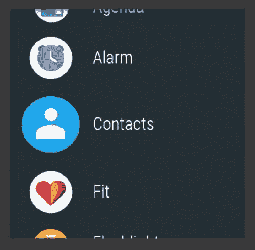
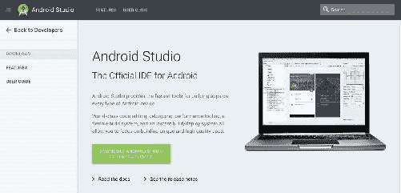
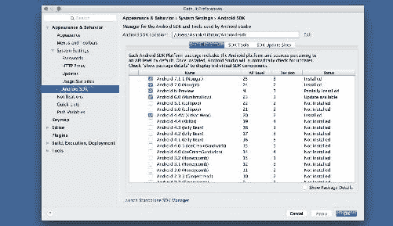
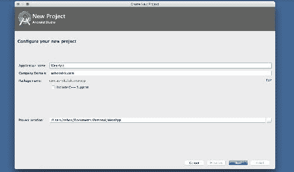
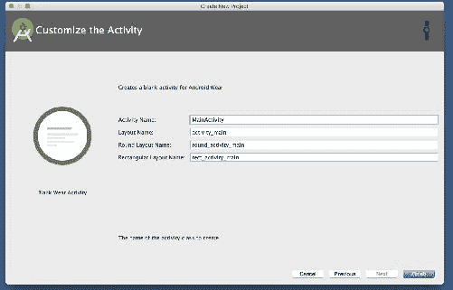
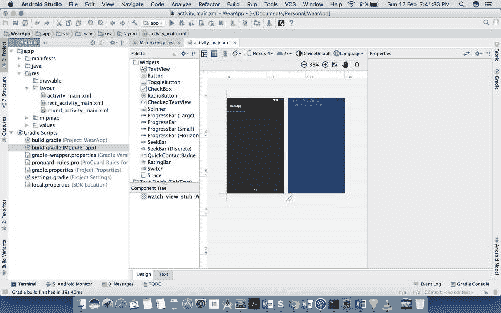
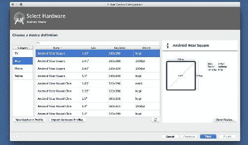
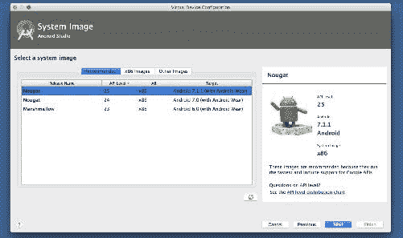

# 二、让我们帮助您捕捉您的想法——`WearRecyclerView`和更多

佩戴有助于我们完成某些动作的工具的文化一直是现代文明的一部分。人类的手表已经成为检查时间和日期的增强工具。戴上手表，你只需看一眼就能知道时间。科技让这种戴表体验更上一层楼。第一款现代可穿戴手表是 1970 年向世界推出的计算器和手表的组合。几十年来，微处理器和无线技术的进步导致了一个被称为*泛在计算*的概念的引入。在此期间，大多数领先的电子行业初创企业开始研究他们的想法，这使得可穿戴设备非常受欢迎。

谷歌、苹果、三星和索尼等科技巨头公司已经加入了可穿戴设备时代的力量。他们推出了具有竞争力的可穿戴产品，这些产品在可穿戴设备市场非常成功。更有意思的是，谷歌的 Android Wear 功能强大，遵循同样的 Android 智能手机开发实践，与 Apple Watch OS 和三星的 Tizen OS 开发者社区相比，拥有非常好的开发者社区。

谷歌在 2014 年 3 月宣布了安卓穿戴。从那以后，安卓穿戴作为智能手表和可穿戴软件平台得到了发展。谷歌在设计和用户体验上的不断进步，催生了新一代的安卓穿戴操作系统，该系统具备前所未有的处理生物识别传感器的能力，平台内功能更多；谷歌称之为安卓穿戴 2.0。

安卓穿戴 2.0 将在应用程序开发中引起很大的兴奋，并有非常有竞争力的功能需要开发。安卓穿戴 2.0 允许开发人员构建和雕刻他特定于安卓穿戴的想法；没有必要将手表和手机应用配对。谷歌称之为独立应用。安卓穿戴 2.0 在安卓手表内部引入了一种新的输入方式:一个名为 complements 的新应用编程接口，允许手表面部显示来自生物识别和其他传感器的重要信息。安卓穿戴 2.0 新更新的通知支持将帮助用户和开发者以更全面的方式呈现通知。

在本章中，我们将探讨以下内容:

*   安卓穿戴设计原则
*   探索穿戴应用特有的基本用户界面组件
*   为穿戴应用程序开发建立开发环境
*   创建您的第一个安卓穿戴应用程序

# 安卓穿戴设计原则

设计穿戴应用程序不同于设计移动或平板应用程序。穿戴操作系统非常轻便，通过与穿戴者共享正确的信息，可以完成一组特定的工作。

一般的磨损原则是及时，简略，易于挖掘，节省时间。

**及时**

在正确的时间提供正确的信息。

**简略**

保持穿戴应用程序用户界面干净整洁。

**轻松点击**

用户点击的动作应该有合适的间距和图片大小。

**省时**

创建快速完成任务的最佳应用程序流。

对于任何 Wear 应用程序，我们都需要适当的构建块来控制应用程序的业务逻辑和其他架构实现。以下是开发磨损应用程序的场景，以帮助我们更好地开发磨损应用程序:

*   定义布局
*   创建列表
*   显示确认
*   佩戴导航和动作
*   多功能按钮

# 定义布局

可穿戴应用程序可以使用与我们在手持安卓设备编程中使用的布局相同的布局，但对穿戴应用程序有特定的限制。我们不应该在 Wear 应用中做类似手持安卓设备的繁重处理动作，期待良好的用户体验。

为圆形屏幕设计的应用程序在方形穿戴设备上看起来不太好。为了解决这个问题，安卓穿戴支持库提供了以下两种解决方案:

*   `BoxInsetLayout`
*   `Curved Layout`

我们可以提供不同的资源，让安卓在运行时检测安卓穿戴的形状。

# 创建列表

列表允许用户从一组项目中选择一个项目。在旧版 Wear 中，1.x API `WearableListView`帮助程序员建立列表和自定义列表。可穿戴 UI 库现在有`curvedLayout`支持的`WearableRecyclerView`，在穿戴设备中有最好的实现体验。

我们可以添加手势和其他出色的功能:



# 探索穿戴设备的用户界面组件

在这一小节中，让我们来探讨一下常用的穿戴特定的用户界面组件。在 Wear 应用程序编程中，我们可以使用移动应用程序编程中使用的所有组件，但是在使用 Wear 设备之前，我们需要考虑好如何适应组件的视觉外观。

`WatchViewStub` : `WatchViewStub`有助于呈现可穿戴设备不同外形的视图。如果您的应用程序安装在圆形手表设备上，`WatchViewStub`将加载圆形手表的特定布局配置。如果是正方形，将加载正方形布局配置:

```java
<?xml version="1.0" encoding="utf-8"?>
<android.support.wearable.view.WatchViewStub xmlns:android="http://schemas.android.com/apk/res/android"
    xmlns:app="http://schemas.android.com/apk/res-auto"
    xmlns:tools="http://schemas.android.com/tools"
    android:id="@+id/watch_view_stub"
    android:layout_width="match_parent"
    android:layout_height="match_parent"
 app:rectLayout="@layout/rect_activity_main"
    app:roundLayout="@layout/round_activity_main"
    tools:context="com.ashokslsk.wearapp.MainActivity"
    tools:deviceIds="wear"></android.support.wearable.view.WatchViewStub>

```

`WearableRecyclerView` : `WearableRecyclerView`是可穿戴设备特有的`recyclerview`的实现。它为可穿戴设备视口中的数据集提供了灵活的视图。我们将在接下来的章节中详细探讨`WearbaleRecyclerView`:

```java
 <android.support.wearable.view.WearableRecyclerView
   android:id="@+id/recycler_launcher_view"
   android:layout_width="match_parent"
   android:layout_height="match_parent"
   android:scrollbars="vertical" /> 

```

Note: `WearableListView` is deprecated; the Android community recommends using `WearableRecyclerView`.

`CircledImageVIew`:一个被圆圈包围的`Imageview`。在圆形可穿戴设备中呈现图像的一个非常方便的组件:

```java
<?xml version="1.0" encoding="utf-8"?>
<android.support.wearable.view.CircledImageView
    xmlns:android="http://schemas.android.com/apk/res/android"
    xmlns:app="http://schemas.android.com/apk/res-auto"
    android:id="@+id/circledimageview"
    app:circle_color="#2878ff"
    app:circle_radius="50dp"
    app:circle_radius_pressed="50dp"
    app:circle_border_width="5dip"
    app:circle_border_color="#26ce61"
    android:layout_marginTop="15dp"
    android:src="@drawable/skholinguaicon"
    android:layout_gravity="center_horizontal"
    android:layout_width="wrap_content"
    android:layout_height="wrap_content" />

```

`BoxInsetLayout`:该布局直接延伸至`Framelayout`，具有识别可穿戴设备外形的能力。形状感知`FrameLayout`可以在屏幕的中心方块中框住它的孩子:

```java
<android.support.wearable.view.BoxInsetLayout    xmlns:android="http://schemas.android.com/apk/res/android"
xmlns:tools="http://schemas.android.com/tools"
xmlns:app="http://schemas.android.com/apk/res-auto"
android:layout_width="match_parent"
android:layout_height="match_parent"
tools:context="com.example.ranjan.androidwearuicomponents.BoxInsetLayoutDemo">

<TextView
    android:text="@string/hello_world"
    android:layout_width="wrap_content"
    android:layout_height="wrap_content"
    app:layout_box="all" />

</android.support.wearable.view.BoxInsetLayout>

```

在 Wear 2.0 发布后，为了沉浸式活动体验，一些组件被弃用，谷歌严格禁止使用；我们仍然可以使用安卓编程中已知的所有组件。

# 显示确认

与手持安卓设备中的确认相比，在 Wear 应用中，确认应该占据整个屏幕，或者比手持设备显示的对话框更多。这可以确保用户一眼就能看到这些确认。可穿戴用户界面库有助于在安卓穿戴设备中显示确认计时器和动画计时器。

# DelayedConfirmationView

A `DelayedConfirmationView`是基于定时器的自动确认视图:

******** ********

```java
<android.support.wearable.view.DelayedConfirmationView
    android:id="@+id/delayed_confirm"
    android:layout_width="40dp"
    android:layout_height="40dp"
    android:src="@drawable/cancel_circle"
    app:circle_border_color="@color/lightblue"
    app:circle_border_width="4dp"
    app:circle_radius="16dp">
</android.support.wearable.view.DelayedConfirmationView>

```

# 佩戴导航和动作

在安卓穿戴新版本中，**材质设计**库增加了以下两个交互抽屉:

*   导航抽屉
*   行动抽屉

# 导航抽屉

允许用户在应用程序中的视图之间切换。开发人员可以通过将`setShouldOnlyOpenWhenAtTop()`方法设置为 false 来允许抽屉在滚动父内容的任何位置打开:

```java
<android.support.wearable.view.drawer.WearableNavigationDrawer
    android:id="@+id/top_drawer"
    android:layout_width="match_parent"
    android:layout_height="match_parent"
    android:background="@android:color/holo_red_light"
    app:navigation_style="single_page"/>

```

# 行动抽屉

操作抽屉提供对应用程序中简单和常见操作的访问。默认情况下，操作抽屉出现在屏幕底部，为用户提供特定的操作:

```java
<android.support.wearable.view.drawer.WearableActionDrawer
    android:id="@+id/bottom_drawer"
    android:layout_width="match_parent"
    android:layout_height="match_parent"
    android:background="@android:color/holo_blue_dark"
    app:show_overflow_in_peek="true"/>

```

# 多功能按钮

除了电源按钮，安卓穿戴还支持设备上另一个称为多功能按钮的按钮。可穿戴支持库提供了用于确定制造商包括的多功能按钮的应用编程接口:

```java
@Override
// Activity
public boolean onKeyDown(int keyCode, KeyEvent event){
  if (event.getRepeatCount() == 0) {
    if (keyCode == KeyEvent.KEYCODE_STEM_1) {
      // Do stuff
      return true;
    } else if (keyCode == KeyEvent.KEYCODE_STEM_2) {
      // Do stuff
      return true;
    } else if (keyCode == KeyEvent.KEYCODE_STEM_3) {
      // Do stuff
      return true;
    }
  }
  return super.onKeyDown(keyCode, event);
}

```

请访问[https://developer . Android . com/training/可穿戴设备/ui/index.html](https://developer.android.com/training/wearables/ui/index.html) 了解您对 Wear 设备编程设计指南的任何疑问。

# 为服装开发建立开发环境

在本节中，我们将为 Wear 应用程序开发建立一个开发环境。

**先决条件**

1.  您最喜欢的操作系统(Windows、macOS 或 Linux)
2.  确定您的操作系统上是否安装了最新的 JRE
3.  安装最新版本的 JDK 或开放 JDK
4.  安装最新版本的 Android Studio(在写这本书的时候，最新版本是 2.2.3，任何更新的版本都应该可以)

# 安装安卓工作室

访问[https://developer.android.com/studio/index.html](https://developer.android.com/studio/index.html)下载最新版本的安卓工作室。谷歌强烈建议在所有安卓应用程序开发中使用安卓工作室，因为安卓工作室与 Gradle 和有用的安卓应用程序接口紧密集成:



安装安卓工作室后，现在是时候在软件开发工具包管理器的软件开发工具包平台选项卡中下载必要的软件开发工具包了。安装一个完整的安卓版本；对于本书的范围，我们将安装 Android 7.1.1 API 级别 25:



牛轧糖 7.1.1 API 级别 25 的 SDK 安装成功后，在 **SDK 工具**选项卡下，确保已经安装了以下组件，如下图截图所示:

*   安卓支持库
*   谷歌游戏服务
*   谷歌知识库
*   安卓支持库


谷歌经常在 IDE 和 SDK 工具上发布更新；保持您的开发环境是最新的。

注意:如果您计划在中国提供您的应用程序，那么您必须使用谷歌 Play 服务客户端库的 7.8.87 特别版来处理手机和手表之间的通信:[https://developer . Android . com/training/可穿戴设备/应用程序/creating-app-china.html](https://developer.android.com/training/wearables/apps/creating-app-china.html)

访问以下链接查看 SDK Tools 上的更新发行说明:[https://developer . Android . com/studio/releases/SDK-Tools . html .](https://developer.android.com/studio/releases/sdk-tools.html)


强烈建议从稳定通道更新您的 IDE。安卓工作室的更新有四个不同的渠道:

*   加那利海峡
*   开发渠道
*   β通道
*   稳定河槽

**金丝雀频道**:安卓工作室工程团队持续努力，让安卓工作室变得更好。在这个频道，每周都会有一个更新发布，里面会包括新的功能变化和改进；您可以在发行说明中查看这些更改。但是不建议在应用程序生产中使用此渠道的更新。

**开发频道:**在这个频道上，安卓工作室团队完成一轮内部测试后，就会发布。

**Beta 通道:**在这个通道上，更新完全基于稳定的 Canary 构建。在将这些构建发布到稳定的渠道之前，谷歌会在 beta 渠道发布它们，以获得开发者的反馈。

**稳定频道:**是安卓工作室的官方稳定版本，可在谷歌官方页面[http://developer.android.com/studio.](http://developer.android.com/studio.)下载

默认情况下，安卓工作室从稳定的渠道接收更新。

# 创建您的第一个安卓穿戴应用程序

在本节中，让我们了解创建您的第一个“穿搭”项目所需的基本步骤。

Before you continue to create your application, ensure you have one complete version of Android installed with a Wear system image and you have the latest version of Android Studio.

下图是 Android Studio 的初始界面。在这个窗口中，可以导入传统的 ADT 安卓项目，配置安卓软件开发工具包，以及更新安卓工作室。

安卓工作室欢迎窗口，包含基本的入门控制:


# 创建你的第一个穿搭项目

点击安卓工作室窗口中的开始一个新的安卓工作室项目选项。另一个包含项目详细信息的窗口将提示您。

以下屏幕截图显示了允许用户配置其项目详细信息的窗口，如项目名称、包名称以及项目是否需要本机 C++支持:



你可以随意命名你的项目。选择项目名称和项目本地系统位置后，您可以按窗口中的“下一步”按钮，这将弹出另一个窗口，其中包含一些配置查询，如下图所示:


在此窗口中，如果取消选中手机和平板电脑选项，您可以选择编写独立的穿戴应用程序。这样，您将只看到穿戴应用程序模板:


现在，安卓工作室模板只提示带有以下选项集的安卓穿戴活动模板:

*   不添加活动
*   始终穿着活动
*   空白磨损活动
*   显示通知
*   谷歌地图穿戴活动
*   看脸

活动模板选择器帮助您访问默认样板代码，这些代码已经过模板化，可以直接在项目中使用:


要创建第一个项目，我们将选择“空穿活动”，然后单击窗口中的“下一步”按钮。安卓工作室将提示另一个窗口创建活动和布局文件的名称。在这个模板中，安卓可穿戴设备的两种外形——大部分是圆形和方形——预先填充了样板代码存根:



当您的项目准备好创建时，单击“完成”按钮。点击完成后，安卓工作室将花一些时间为我们创建项目。

干得好！您现在已经为安卓穿戴独立应用程序创建了一个工作样板代码，而没有手机配套应用程序。成功创建后，默认情况下，您将看到以下文件和代码添加到项目中:



如果你的 SDK 没有用 API 等级 25 更新，你可能会在 Android Studio 项目中看到 Wear 选项，用 Android Wear 支持库 1.x 创建提示；您可以使用以下依赖项在磨损模块梯度文件中对此进行更新:

```java
compile 'com.google.android.support:wearable:2.0.0'

```

# 创建磨损模拟器

创建穿戴模拟器的过程与创建电话模拟器非常相似。

在 AVD 管理器中，单击创建虚拟设备...按钮:


根据您的应用需求选择所需的外形模拟器。现在，让我们创建安卓穿戴方模拟器:



为您的穿戴选择正确的模拟器后，您将收到另一个提示，要求您选择穿戴操作系统。让我们选择 API Level 25 牛轧糖仿真器，如下图截图所示:



最后一个提示根据您的需要询问仿真器名称和其他方向配置:


干得好！现在，我们已经成功地为项目创建了一个方形外形模拟器。让我们运行在模拟器中创建的项目:


谷歌建议在实际的硬件设备中开发 Wear 应用，以获得最佳的用户体验。然而，使用模拟器的好处是可以创建不同的屏幕形状来检查应用程序的渲染。

# 使用实际磨损设备

1.  打开穿戴设备上的设置菜单
2.  转到关于设备
3.  单击构建编号七次以启用开发人员模式
4.  现在在手表上启用 ADB 调试

现在，您可以使用 USB 电缆将穿戴设备直接连接到您的机器。您可以使用以下设置通过无线网络和蓝牙调试您的应用程序。

# 通过无线网络调试

确保您的手表启用了开发人员选项。只有当穿戴设备和机器连接到同一网络时，才能通过无线网络进行调试。

*   在穿戴设备开发人员选项中，点击通过无线网络调试
*   手表将显示其 IP 地址(例如，192.168.1.100)。保留一个参考；下一步我们需要这个。
*   将调试器连接到设备
*   使用以下命令，我们可以将实际设备连接到 ADB 调试器:

```java
adb connect 192.168.1.100

```

# 启用蓝牙调试

我们需要确保在开发人员选项中启用调试，如下所示:

*   启用蓝牙调试
    *   在手机上安装配套应用(从[https://play.google.com/store/apps/details?下载)id = com . Google . Android . wealth . app&HL = en](https://play.google.com/store/apps/details?id=com.google.android.wearable.app&hl=en))
*   转到配套应用程序中的设置
*   通过蓝牙启用调试
*   通过电缆将电话连接到机器上
*   您可以使用以下命令来建立连接:

```java
adb forward tcp:4444 localabstract:/adb-hub
adb connect 127.0.0.1:4444

```

在你的安卓穿戴中，只要允许 ADB 在它询问时进行调试。

现在我们已经有了开发环境的工作设置，让我们了解基本的安卓穿戴特定的用户界面组件。

# 摘要

在本章中，我们已经了解了 Wear 应用程序开发的初始设置。我们已经了解了需要下载的必要组件，设置磨损模拟器，将磨损模拟器连接到 ADB 桥，通过 Wi-Fi 进行调试，以及磨损开发专用的基本用户界面组件。在下一章中，我们将探讨如何构建一个记录应用程序来保存用户输入的数据。