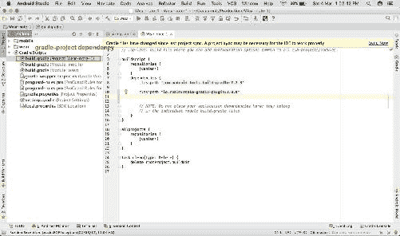
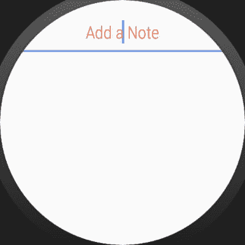
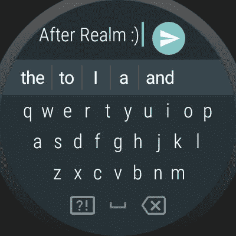
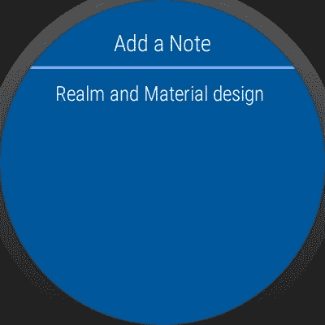
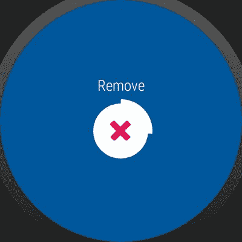
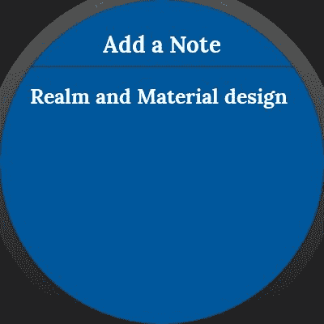

# 三、让我们帮助您捕获您的想法——保存数据和定制用户界面

从头开始构建笔记应用程序是一次很好的学习体验。在本章中，我们将了解使用 Wear 设计标准为新用户界面升级相同的代码。**磨损注释 1** 应用将迁移至**磨损注释 2** ，更新如下:

*   集成领域数据库
*   用户界面更新
*   集成自定义字体和素材
*   完成项目

为了进一步帮助在你的Android Studio中打开 wear-note 1 项目，编译该项目并逐个屏幕检查项目。您会发现该应用程序的主要功能是在穿戴设备上保存笔记。在这个应用程序中，我们有白色背景和黑色字体。`SharedPreferences`正在帮助应用程序保存数据。

进一步概括，我们知道如何与`WearableRecyclerView`、`DelayedConfirmationView`和`BoxInsetLayout`一起工作，以获得最佳的穿戴设备应用体验。

向前推进，让我们开始用前面提到的变更来完成项目。让我们称这个应用为 wear-note-2。转到`res`目录中的`values`目录，在`string.xml`文件中，将应用程序名称更改为 Wear-note-2，如下所示:

```java
<string name="app_name">Wear-note-2</string>

```


# 磨损注释 2

让我们开始处理功能，并在这个子模块中用 RealmDB 替换数据库。

**RealmDB** 正在现代安卓编程界制造轰动；它是 SQLite 数据库的简单替代品，内置在 Android SDK 中。Realm 没有使用 SQLite 作为其核心引擎；它有自己的 C++ 内核，专门为手机设计。Realm 使用 C++ 核心以通用的、基于表的格式保存数据。Realm 处理一系列复杂的查询，并允许从多种语言访问数据以及进行大量的临时查询。

# 境界的优势

*   Realm 比 SQLite 快 10 倍
*   使用方便
*   跨平台
*   内存高效
*   良好记录和出色的社区支持

探索关于 Realm 的更多信息，Realm 做了许多优化，例如整数打包和将公共字符串转换为枚举，这导致比 SQLite + ORM 数据库解决方案更好的性能。传统的 SQLite + ORM 抽象存在漏洞，ORM 只是将对象及其方法转换成 SQL 语句，导致性能不佳。另一方面，Realm 是一个面向对象的数据库，这意味着您的数据被保存为对象，这反映在您的数据库中。Realm 使用 B+树映射内存中的所有数据，每当查询数据时，Realm 都会计算偏移量，从内存映射区域读取数据，并返回原始值。通过这样做，Realm 避免了零拷贝(从数据库读取数据的传统方式会导致不必要的拷贝(原始数据>反序列化表示>语言级对象))。

每当开发人员想要实现延迟加载时，Realm 是完美的选择；因为属性是用列而不是行来表示的，所以它可以根据需要延迟加载属性，并且由于列结构，读取速度要快得多，而插入速度要慢得多。但对于移动应用的环境来说，这是一个很好的权衡。

Realm 使用**多版本并发控制** ( **MVCC** )模型，这意味着可以同时进行多个读事务，在提交写事务的同时也可以进行读操作。

For more information, visit [https://realm.io/news/jp-simard-realm-core-database-engine/.](https://realm.io/news/jp-simard-realm-core-database-engine/)

# 境界的弊端

Realm 有一些瓶颈，在选择它之前应该考虑一下。尽管如此，对于一个高扩展性的安卓应用来说，这些瓶颈是可以考虑的:

*   我们无法将 Realmdb 导入其他应用程序
*   我们不能跨线程访问对象
*   没有自动增加标识
*   迁移 Realmdb 是一项痛苦的工作
*   缺少复合主键
*   仍在积极开发中

在**磨损注释-1** 项目中，在`string.xml`中将其名称更改为磨损注释-2 后，我们需要在梯度项目模块中添加适当的领域依赖项。在撰写本书时，最新的 Realm 版本是 3.0.0，所以让我们详细讨论依赖关系和代码。

# 重新构建代码和依赖关系

Realm 现在有了新的机制。它不仅仅是一个 gradle 依赖，它还是一个 gradle 插件。我们将学习如何在项目中添加和使用 Realm。grade le 插件依赖项应该添加到项目范围中，这是一个项目级别的 grade le 依赖项。添加以下类路径，并允许它通过互联网与您的项目同步:

```java
classpath "io.realm:realm-gradle-plugin:3.0.0"

```

将此依赖项添加到如下截图所示的 gradle 项目级文件中。将`classpath`添加到依赖项部分:



添加类路径依赖项后，完整的 gradle 文件将如下所示:

```java
// Top-level build file where you can add configuration options common to all sub-projects/modules.

buildscript {
    repositories {
        jcenter()
    }
    dependencies {
        classpath 'com.android.tools.build:gradle:2.2.3'

        //Realm plugin
        classpath "io.realm:realm-gradle-plugin:3.0.0"
        // NOTE: Do not place your application dependencies here; they 
        belong
        // in the individual module build.gradle files
    }
}

allprojects {
    repositories {
        jcenter()
    }
}

task clean(type: Delete) {
    delete rootProject.buildDir
}

```

接下来，我们将把 Realm 插件应用到我们的项目中，以使用如下截图所示的所有 Realm 特性:

```java
apply plugin: 'realm-android'

```


领域社区已经公开了一个经过梯度修改的文件示例:

[https://github.com/realm/realm-java/blob/master/examples/build.gradle
https://github.com/realm/realm-java/blob/master/examples/introExample/build.gradle](https://github.com/realm/realm-java/blob/master/examples/build.gradle) 

现在，我们都准备好用领域来取代我们的`SharedPreferences`。我们开始吧。

打开Android Studio，在模型包中，我们已经用原始数据字符串注释和字符串标识定义了我们的`Note.java` POJO 类。我们有这些变量的获取者和设定者。其他变化如下:

将 POJO 模型扩展到`RealmObject`并创建一个空的构造函数:

```java
public class Note extends RealmObject {

    private String notes = "";
    private String id = "";

   //Empty constructor
    public Note() {

    }

    public Note(String id, String notes) {
        this.id = id;
        this.notes = notes;
    }

    public String getNotes() {
        return notes;
    }

    public void setNotes(String notes) {
        this.notes = notes;
    }

    public String getId() {
        return id;
    }

    public void setId(String id) {
        this.id = id;
    }

}

```

在`MainActivity`中，我们将全局实例化`Realm`类，并且我们将在`onCreate`方法中初始化如下:

```java
//MainActivity scope
//Realm Upgrade
private Realm realm;

@Override
protected void onCreate(Bundle savedInstanceState) {
    super.onCreate(savedInstanceState);
    ....
    //Realm init
    Realm.init(this);
    realm = Realm.getDefaultInstance();
}

```

在`updateAdapter()`方法中，我们必须添加来自 Realm 的读取查询，如下所示:

```java
 RealmResults<Note> results = realm.where(Note.class).findAll();

```

完整的方法如下所示:

```java
private void updateAdapter() {
    RealmResults<Note> results = realm.where(Note.class).findAll();
    myDataSet.clear();
    myDataSet.addAll(SharedPreferencesUtils.getAllNotes(this));
    mAdapter.setListNote(myDataSet);
    mAdapter.notifyDataSetChanged();
}

```

Realm 数据库提供了大量的查询，这些查询将存储数据映射为一对一和一对多的关系，对于这个项目，前面的查询完成了所有需要的神奇工作。

在`createNote()`方法中，我们将更改代码以使用 Realm 而不是`SharedPreference`，如下所示:

```java
private Note createNote(String id, String note) {
    if (id == null) {
        id = String.valueOf(System.currentTimeMillis());
        realm.beginTransaction();
        Note notes = realm.createObject(Note.class);
        notes.setId(id);
        notes.setNotes(note);
        realm.commitTransaction();
    }
    return new Note(id, note);
}

```

为了删除记录，让我们创建一个新的方法，并将其称为`deleteRecord()`。在这种方法中，我们将传递注释的标识，并从领域中删除该注释:

```java
public void deleteRecord(String id){
    RealmResults<Note> results = realm.where(Note.class).equalTo("id", 
    id).findAll();

    realm.beginTransaction();

    results.deleteAllFromRealm();

    realm.commitTransaction();
}

```

现在，我们将`updateData()`方法中的删除记录方法调用如下:

```java
private void updateData(Note note, int action) {
    if (action == Constants.ACTION_ADD) {
        ConfirmationUtils.showMessage(getString(R.string.note_saved), 
        this);
    } else if (action == Constants.ACTION_DELETE) {
        deleteRecord(note.getId());
        ConfirmationUtils.showMessage(getString(R.string.note_removed), 
        this);
    }
    updateAdapter();
}

```

完整的`MainActivity`代码如下:

```java
public class MainActivity extends WearableActivity implements RecyclerViewAdapter.ItemSelectedListener {

    private static final String TAG = "MainActivity";
    private static final int REQUEST_CODE = 1001;
    private RecyclerViewAdapter mAdapter;
    private List<Note> myDataSet = new ArrayList<>();

    //Realm Upgrade
    private Realm realm;

    @Override
    protected void onCreate(Bundle savedInstanceState) {
        super.onCreate(savedInstanceState);
        setContentView(R.layout.activity_main);
        configLayoutComponents();

        Realm.init(this);
        realm = Realm.getDefaultInstance();

    }

    private void configLayoutComponents() {
        WearableRecyclerView recyclerView = (WearableRecyclerView) 
        findViewById(R.id.wearable_recycler_view);
        recyclerView.setHasFixedSize(true);
        LinearLayoutManager mLayoutManager = new 
        LinearLayoutManager(this);
        recyclerView.setLayoutManager(mLayoutManager);

        mAdapter = new RecyclerViewAdapter();
        mAdapter.setListNote(myDataSet);
        mAdapter.setListener(this);
        recyclerView.setAdapter(mAdapter);

        EditText editText = (EditText) findViewById(R.id.edit_text);

        editText.setOnEditorActionListener(new 
        TextView.OnEditorActionListener() {
            @Override
            public boolean onEditorAction(TextView textView, int 
            action, KeyEvent keyEvent) {
                if (action == EditorInfo.IME_ACTION_SEND) {
                    String text = textView.getText().toString();
                    if (!TextUtils.isEmpty(text)) {
                        Note note = createNote(null, text);
                        SharedPreferencesUtils.saveNote(note, 
                        textView.getContext());
                        updateData(note, Constants.ACTION_ADD);
                        textView.setText("");
                        return true;
                    }
                }
                return false;
            }
        });
    }

    private void updateAdapter() {
        RealmResults<Note> results = realm.where(Note.class).findAll();
        myDataSet.clear();
        myDataSet.addAll(results);
        mAdapter.setListNote(myDataSet);
        mAdapter.notifyDataSetChanged();
    }

    @Override
    protected void onResume() {
        super.onResume();
        updateAdapter();
    }

    @Override
    public void onItemSelected(int position) {
        Intent intent = new Intent(getApplicationContext(), 
        DeleteActivity.class);
        intent.putExtra(Constants.ITEM_POSITION, position);
        startActivityForResult(intent, REQUEST_CODE);
    }

    @Override
    protected void onActivityResult(int requestCode, int resultCode, 
    Intent data) {
        if (data != null && requestCode == REQUEST_CODE && resultCode 
        == RESULT_OK) {
            if (data.hasExtra(Constants.ITEM_POSITION)) {
                int position = 
                data.getIntExtra(Constants.ITEM_POSITION, -1);
                if (position > -1) {
                    Note note = myDataSet.get(position);
                    updateData(note, Constants.ACTION_DELETE);
                }
            }
        }
    }

    private void prepareUpdate(String id, String title, int action) {
        if (!(TextUtils.isEmpty(id) && TextUtils.isEmpty(title))) {
            Note note = createNote(id, title);
            updateData(note, action);
        }
    }

    private void updateData(Note note, int action) {
        if (action == Constants.ACTION_ADD) {
            ConfirmationUtils.showMessage
            (getString(R.string.note_saved), this);

        } else if (action == Constants.ACTION_DELETE) {
            deleteRecord(note.getId());
            ConfirmationUtils.showMessage(getString
            (R.string.note_removed), this);
        }
        updateAdapter();
    }

    /**
     * Notifica a Data Layer API que os dados foram modificados.
     */

    private Note createNote(String id, String note) {
        if (id == null) {
            id = String.valueOf(System.currentTimeMillis());
            realm.beginTransaction();
            Note notes = realm.createObject(Note.class);
            notes.setId(id);
            notes.setNotes(note);
            realm.commitTransaction();
        }
        return new Note(id, note);
    }

    public void deleteRecord(String id){
        RealmResults<Note> results = realm.where(Note.class)
        .equalTo("id", id).findAll();

        realm.beginTransaction();

        results.deleteAllFromRealm();

        realm.commitTransaction();
    }

    @Override
    protected void onDestroy() {
        realm.close();
        super.onDestroy();
    }
}

```

现在，在功能上，我们已经将 Realmdb 集成到我们的 Wear-note-2 应用程序中。让我们编译并查看结果。

“穿戴记录”应用程序的主屏幕如下所示:



穿戴式操作系统处理以获取用户输入的国际货币基金组织屏幕:



穿戴支持库中通过默认`confirmationActivity`的“保存的动画”:


带有已保存笔记的主屏幕:


现在，我们已经用我们这个时代最好的安卓数据库取代了`Sharedpreference`。

# 使用穿戴用户界面

在磨损笔记应用程序中，我们使用白色背景和黑色文本，默认为 Roboto 字体。当准备一个好的穿戴应用程序设计时，谷歌建议为穿戴应用程序使用深色，以获得最佳的电池效率。典型材质设计的移动应用中使用的浅色方案在穿戴设备中不节能。浅色在有机发光二极管显示器中能效较低。

浅色需要以更亮的强度照亮像素。白色需要 100%点亮像素中的 RGB 二极管；应用中的白色和浅色越多，应用的电池效率就越低。

浅色在暗光下或在晚上使用穿戴设备时会造成干扰。深色可能不会出现这种情况。与浅色不同，深色在活动时会降低屏幕亮度，并在有机发光二极管显示器中节省电池。

# 让我们开始使用 Wear-note-2 用户界面

让我们改变应用主题，以适应标准设计准则。

在`activity_main.xml`文件中，我们将编辑父容器的背景，也就是`BoxInsetLayout`背景`android:background="#01579B"`为钴蓝色。

在`values`目录下新增`color.xml`并添加如下代码:

```java
//Add this color value in the color.xml in res directory 
<color name="cobalt_blue">#01579B</color>

```

添加颜色后，我们可以在生产应用程序中使用该颜色，如下所示:

```java
<android.support.wearable.view.BoxInsetLayout
    xmlns:android="http://schemas.android.com/apk/res/android"
    xmlns:tools="http://schemas.android.com/tools"
    xmlns:app="http://schemas.android.com/apk/res-auto"
    android:layout_width="match_parent" 
    android:layout_height="match_parent"
    android:id="@+id/container"
    tools:context="com.ashok.packt.wear_note_1.activity.MainActivity"
    tools:deviceIds="wear"
    android:background="@color/cobalt_blue"
    app:layout_box="all"
    android:padding="5dp">

```

此外，让我们更改`EditText`提示颜色的颜色，如下所示:

```java
<EditText
    android:id="@+id/edit_text"
    android:layout_width="match_parent"
    android:layout_height="50dp"
    android:layout_gravity="center"
    android:gravity="center"
    android:hint="@string/add_a_note"
    android:imeOptions="actionSend"
    android:inputType="textCapSentences|textAutoCorrect"
 android:textColor="@color/white"
    android:textColorHint="@color/white"
    android:layout_alignParentTop="true"
    android:layout_alignParentStart="true" />

```

在`each_item.xml`布局中，修改 XML 代码如下:

```java
<?xml version="1.0" encoding="utf-8"?>
<LinearLayout
    xmlns:android="http://schemas.android.com/apk/res/android"
    xmlns:tools="http://schemas.android.com/tools"
    android:layout_width="match_parent"
    android:layout_height="match_parent"
    android:gravity="center"
    android:layout_gravity="center"
    android:clickable="true"
    android:background="?android:attr/selectableItemBackground"
    android:orientation="vertical">

    <TextView
        android:id="@+id/note"
        android:layout_width="wrap_content"
        android:layout_height="wrap_content"
        android:gravity="center"
        android:layout_gravity="center"
        android:textColor="@color/white"
        tools:text="note"/>

</LinearLayout>

```

现在，在`activity_delete.xml`布局的容器中进行同样的更改，更改其背景颜色并更改`TextView`的颜色。可以使用`xmlns`属性更改`DelayedConfirmationView`的颜色，如以下代码所示:

```java
<android.support.wearable.view.DelayedConfirmationView
    android:id="@+id/delayed_confirmation"
    android:layout_width="wrap_content"
    android:layout_height="wrap_content"
    android:src="@android:drawable/ic_delete"
    app:circle_border_color="@color/white"
    app:circle_color="@color/white"
    app:circle_border_width="8dp"
    app:circle_radius="30dp"/>

```

开发者不用担心在`DelayedConfirmationView`中改变动画的颜色，Wear 2.0 自动适应`DelayedConfirmationView`的主题，改变原色方案，打造统一的体验。

所有这些变化反映在应用程序中，如下所示:


从用户获取输入的国际货币基金组织屏幕:


使用领域保存数据后:



从数据库中删除注释:



# 更好的字体，更好的阅读

在数字设计领域，让应用程序的视觉效果在用户眼中变得容易是很重要的。谷歌收藏的 Lora 字体具有平衡良好的当代衬线，其根源在于书法。这是一种文本字体，对比度适中，非常适合正文。洛拉的一个段落集将是难忘的，因为它的拉丝曲线与驱动衬线形成对比。劳拉的整体印刷声音完美地传达了现代故事或艺术散文的情绪。技术上，Lora 针对屏幕外观进行了优化。

要将自定义字体添加到安卓项目中，我们需要在根目录下创建`assets`文件夹。查看以下截图:


我们可以直接添加`.ttf`文件素材目录，也可以创建另一个目录和字体。你可以通过这个网址下载 Lora 字体:[https://fonts.google.com/download?family=Lora](https://fonts.google.com/download?family=Lora)。

将字体文件添加到素材文件夹后，我们需要创建自定义的`Textview`和`EditText`。

在`utils`包中，让我们创建名为`LoraWearTextView`和`LoraWearEditTextView`的类，如下所示:


现在，将`LoraWearTextView`扩展到`TextView`类，`LoraWearEditTextView`扩展到`EditText`。在两个类中实现构造函数方法。创造一种新的方法，称之为`init()`。在`init`方法中，实例化`Typeface`类，使用`createFromAsset`方法，我们可以设置自定义字体:

```java
public void init() {
    Typeface tf = Typeface.createFromAsset(getContext().getAssets(), 
    "fonts/Lora.ttf");
    setTypeface(tf ,1);

}

```

前面的`init`方法在两个类中都是一样的。在两个新自定义类的所有不同参数化构造函数中调用`init`方法。

完整的类如下所示:`LoraWearTextView.java`

```java
public class LoraWearTextView extends TextView {
    public LoraWearTextView(Context context) {
        super(context);
        init();
    }

    public LoraWearTextView(Context context, AttributeSet attrs) {
        super(context, attrs);
        init();
    }

    public LoraWearTextView(Context context, AttributeSet attrs, int 
    defStyleAttr) {
        super(context, attrs, defStyleAttr);
        init();
    }

    public LoraWearTextView(Context context, AttributeSet attrs, int 
    defStyleAttr, int defStyleRes) {
        super(context, attrs, defStyleAttr, defStyleRes);
        init();
    }

    public void init() {
        Typeface tf = Typeface.createFromAsset(getContext()
        .getAssets(), "fonts/Lora.ttf");
        setTypeface(tf ,1);

    }
}

```

完整的类如下所示:`LoraWearEditTextView.java`

```java
public class LoraWearEditTextView extends EditText {

public LoraWearEditTextView(Context context) {
 super(context);
 init();
}

public LoraWearEditTextView(Context context, AttributeSet attrs) {
 super(context, attrs);
 init();
}

public LoraWearEditTextView(Context context, AttributeSet attrs, int defStyleAttr) {
 super(context, attrs, defStyleAttr);
 init();
}

public LoraWearEditTextView(Context context, AttributeSet attrs, int defStyleAttr, int defStyleRes) {
 super(context, attrs, defStyleAttr, defStyleRes);
 init();
}

public void init() {
 Typeface tf = Typeface.createFromAsset(getContext().getAssets(), 
 "fonts/Lora.ttf");
 setTypeface(tf ,1);
}

```

在我们的 UI 布局中添加这两个类之后，我们可以替换实际的`textview`和`edittext`:

```java
<com.ashok.packt.wear_note_1.utils.LoraWearEditTextView
    android:id="@+id/edit_text"
    android:layout_width="match_parent"
    android:layout_height="50dp"
    android:layout_gravity="center"
    android:gravity="center"
    android:hint="@string/add_a_note"
    android:imeOptions="actionSend"
    android:inputType="textCapSentences|textAutoCorrect"
    android:textColor="@color/white"
    android:textColorHint="@color/white"
    android:layout_alignParentTop="true"
    android:layout_alignParentStart="true" />

<com.ashok.packt.wear_note_1.utils.LoraWearTextView
    android:id="@+id/note"
    android:layout_width="wrap_content"
    android:layout_height="wrap_content"
    android:gravity="center"
    android:layout_gravity="center"
    android:textColor="@color/white"
    tools:text="note"/>

```

更换`textview`和`edittext`后，编译程序，让我们看看结果:



通过`confirmationViewActivity`移除音符动画:


在本章中，我们探讨了如何集成 Realm 流行数据库，了解了穿戴设备的设计理念，并创建了我们的自定义视图组件，以获得更好的应用程序用户体验。

# 为更好的 UX 写自定义布局

安卓提供了很好的方法来定制我们用作容器的布局。我们可以拥有复合视图，并根据自己的目的定制布局。可穿戴设备使用与手持安卓设备相同的布局技术，但需要根据特定的约束和配置进行设计。将手持安卓设备组件的功能移植到 Wear 应用设计中并不是一个好主意。要设计一款出色的穿戴应用，请遵循 https://developer.android.com/design/wear/index.html 的谷歌设计指南。让我们创建自定义视图，并在磨损注释应用程序中使用它们。

让我们按照加载项目的方式在布局中实现动画。我们将有一个简单的幻灯片动画，我们将使用我们编写的自定义布局来实现。
我们创建一个名为`AnimatedLinearLayout`的类文件，并将其扩展到`LinearLayout`，如下所示:

Compound views are the combination of two or more views bundled as one component, for instance, the Checkable Relative layout. When a user clicks on the layout, it will highlight the layout similar to the checkbox.

```java
public class AnimatedLinearLayout extends LinearLayout {

...

}

```

现在，我们需要`View`中的`Animation`类。除了`Animation`类，声明`View`实例为`currentChild`视图。因为我们正在编写一个布局，它可以保存子级的层次结构，所以我们需要一个视图实例作为参考:

```java
Animation animation;
View currentChild;

```

当我们将类扩展到`LinearLayout`时，我们得到了几个构造函数`callbacks`，我们必须实现它们:

```java
public AnimatedLinearLayout(Context context) {
    super(context);
}

public AnimatedLinearLayout(Context context, AttributeSet attrs) {
    super(context, attrs);
}

@Override
public void onWindowFocusChanged(boolean hasWindowFocus) {
    super.onWindowFocusChanged(hasWindowFocus);
    ...
}

```

在`onWindowFocusChanged()`方法中，我们可以为自定义动画编写我们的逻辑。在这里，本书介绍了`SlideDown`、`SlideDownMore`、`RotateClockWise`、`RotateAntiClockWise`、`ZoomInAndRotateClockWise`。现在，要实现这一点，我们需要检查视图是否膨胀，是否有要显示的窗口，布局有多少`childviews`:

```java
if (hasWindowFocus) {
    for (int index = 0; index < getChildCount(); index++) {
        View child = getChildAt(index);
        currentChild=child;
}

```

检查该子对象是否是视图组的实例；如果视图是以任何其他异化的方式完全开发的，那么这种自定义布局将无法帮助该视图动画化。使用 childviews 标签属性，我们可以为动画分配一个字符串关联，如下所示:

```java
if(!(child instanceof ViewGroup)) {
   switch (child.getTag().toString()) {
   case SLIDE_DOWN:
     // write logic to slide down animation

```

对于向下滑动动画，使用我们全局创建的动画实例，我们必须设置插值器，并用数值 2 将 childviews 高度的插值减速。检查以下代码:

```java
case SLIDE_DOWN:
    animation = new TranslateAnimation(0, 0, -
    ((child.getMeasuredHeight()/2) * (index + 1)), 0);
    animation.setInterpolator(new DecelerateInterpolator());
    animation.setFillAfter(true);
    animation.setDuration(1000);
    child.post(new AnimationRunnable(animation,child));
    //child.startAnimation(animation);
    break; 

```

同样，我们将完成其他案例。让我们来完成`onWindowFocusChanged()`方法:

```java
@Override
public void onWindowFocusChanged(boolean hasWindowFocus) {
    super.onWindowFocusChanged(hasWindowFocus);
    final String SLIDE_DOWN = "SlideDown";
    final String SLIDE_DOWN_MORE = "SlideDownMore";
    final String ROTATE_CLOCKWISE = "RotateClockWise";
    final String ROTATE_ANTI_CLOCKWISE = "RotateAntiClockWise";
    final String ZOOMIN_AND_ROTATE_CLOCKWISE = 
    "ZoomInAndRotateClockWise";
    if (hasWindowFocus) {
        for (int index = 0; index < getChildCount(); index++) {
            View child = getChildAt(index);
            currentChild=child;
            if(!(child instanceof ViewGroup)) {
                switch (child.getTag().toString()) {
                    case SLIDE_DOWN:
                        animation = new TranslateAnimation(0, 0, -
                        ((child.getMeasuredHeight()/2) * 
                        (index + 1)), 0);
                        animation.setInterpolator(new 
                        DecelerateInterpolator());
                        animation.setFillAfter(true);
                        animation.setDuration(1000);
                        child.post(new 
                        AnimationRunnable(animation,child));
                        //child.startAnimation(animation);
                        break;
                    case SLIDE_DOWN_MORE:
                        animation = new TranslateAnimation(0, 0, -
                        (child.getMeasuredHeight() * (index + 25)), 0);
                        animation.setInterpolator(new 
                        DecelerateInterpolator());
                        animation.setFillAfter(true);
                        animation.setDuration(1000);
                        child.post(new 
                        AnimationRunnable(animation,child));
                        //child.startAnimation(animation);
                        break;
                    case ROTATE_CLOCKWISE:
                        animation = new RotateAnimation(0, 360,            
                        child.getMeasuredWidth() / 2, 
                        child.getMeasuredHeight() / 2);
                        animation.setInterpolator(new 
                        DecelerateInterpolator());
                        animation.setFillAfter(true);
                        animation.setDuration(1000);
                        child.post(new 
                        AnimationRunnable(animation,child));
                        //child.startAnimation(animation);
                        break;
                    case ROTATE_ANTI_CLOCKWISE:
                        animation = new RotateAnimation(0, -360,                 
                        child.getMeasuredWidth() / 2, 
                        child.getMeasuredHeight() / 2);
                        animation.setInterpolator(new 
                        DecelerateInterpolator());
                        animation.setFillAfter(true);
                        animation.setDuration(1000);
                        child.post(new 
                        AnimationRunnable(animation,child));
                        //child.startAnimation(animation);
                        break;
                    case ZOOMIN_AND_ROTATE_CLOCKWISE:
                        AnimationSet animationSet = new 
                        AnimationSet(true);
                        animationSet.setInterpolator(new 
                        DecelerateInterpolator());
                        animation = new ScaleAnimation(0, 1, 0, 1, 
                        child.getMeasuredWidth() / 2, 
                        child.getMeasuredHeight() / 2);
                        animation.setStartOffset(0);
                        animation.setFillAfter(true);
                        animation.setDuration(1000);
                        animationSet.addAnimation(animation);
                        animation = new RotateAnimation(0, 360, 
                        child.getMeasuredWidth() / 2, 
                        child.getMeasuredHeight() / 2);
                        animation.setStartOffset(0);
                        animation.setFillAfter(true);
                        animation.setDuration(1000);
                        animationSet.addAnimation(animation);
                        child.post(new 
                        AnimationSetRunnable(animationSet,child));
                        //child.startAnimation(animationSet);
                        break;
                }
            }
        }
    }
}

```

现在，我们需要创建一个`AnimationRunnable`类，实现`Runnable`接口开始动画:

```java
private class AnimationRunnable implements Runnable{
    private Animation animation;
    private View child;
    AnimationRunnable(Animation animation, View child) {
        this.animation=animation;
        this.child=child;
    }

    @Override
    public void run() {
        child.startAnimation(animation);
    }
}

```

我们将为可运行界面实现另一个`AnimationSetRunnable`类，用于设置动画:

```java
private class AnimationSetRunnable implements Runnable{
    private AnimationSet animation;
    private View child;
    AnimationSetRunnable(AnimationSet animation, View child) {
        this.animation=animation;
        this.child=child;
    }

    @Override
    public void run() {
        child.startAnimation(animation);
    }
}

```

现在，我们已经完成了我们自己的自定义布局，其中有几个动画方法，我们所有的视图孩子在布局。此自定义布局的完整类代码如下所示:

```java
public class AnimatedLinearLayout extends LinearLayout {
    Animation animation;
    View currentChild;

    public AnimatedLinearLayout(Context context) {
        super(context);
    }

    public AnimatedLinearLayout(Context context, AttributeSet attrs) {
        super(context, attrs);
    }

    @Override
    public void onWindowFocusChanged(boolean hasWindowFocus) {
        super.onWindowFocusChanged(hasWindowFocus);
        final String SLIDE_DOWN = "SlideDown";
        final String SLIDE_DOWN_MORE = "SlideDownMore";
        final String ROTATE_CLOCKWISE = "RotateClockWise";
        final String ROTATE_ANTI_CLOCKWISE = "RotateAntiClockWise";
        final String ZOOMIN_AND_ROTATE_CLOCKWISE = 
        "ZoomInAndRotateClockWise";
        if (hasWindowFocus) {
            for (int index = 0; index < getChildCount(); index++) {
                View child = getChildAt(index);
                currentChild=child;
                if(!(child instanceof ViewGroup)) {
                    switch (child.getTag().toString()) {
                        case SLIDE_DOWN:
                            animation = new TranslateAnimation(0, 0, -
                            ((child.getMeasuredHeight()/2) * 
                             (index + 1)), 0);
                            animation.setInterpolator(new 
                            DecelerateInterpolator());
                            animation.setFillAfter(true);
                            animation.setDuration(1000);
                            child.post(new 
                            AnimationRunnable(animation,child));
                            //child.startAnimation(animation);
                            break;
                        case SLIDE_DOWN_MORE:
                            animation = new TranslateAnimation(0, 0, -
                            (child.getMeasuredHeight() * 
                            (index + 25)), 0);
                            animation.setInterpolator(new 
                            DecelerateInterpolator());
                            animation.setFillAfter(true);
                            animation.setDuration(1000);
                            child.post(new 
                            AnimationRunnable(animation,child));
                            //child.startAnimation(animation);
                            break;
                        case ROTATE_CLOCKWISE:
                            animation = new RotateAnimation(0, 360, 
                            child.getMeasuredWidth() / 2, 
                            child.getMeasuredHeight() / 2);
                            animation.setInterpolator(new 
                            DecelerateInterpolator());
                            animation.setFillAfter(true);
                            animation.setDuration(1000);
                            child.post(new 
                            AnimationRunnable(animation,child));
                            //child.startAnimation(animation);
                            break;
                        case ROTATE_ANTI_CLOCKWISE:
                            animation = new RotateAnimation(0, -360, 
                            child.getMeasuredWidth() / 2, 
                            child.getMeasuredHeight() / 2);
                            animation.setInterpolator(new 
                            DecelerateInterpolator());
                            animation.setFillAfter(true);
                            animation.setDuration(1000);
                            child.post(new 
                            AnimationRunnable(animation,child));
                            //child.startAnimation(animation);
                            break;
                        case ZOOMIN_AND_ROTATE_CLOCKWISE:
                            AnimationSet animationSet = new 
                            AnimationSet(true);
                            animationSet.setInterpolator(new 
                            DecelerateInterpolator());
                            animation = new ScaleAnimation(0, 1, 0, 1, 
                            child.getMeasuredWidth() / 2, 
                            child.getMeasuredHeight() / 2);
                            animation.setStartOffset(0);
                            animation.setFillAfter(true);
                            animation.setDuration(1000);
                            animationSet.addAnimation(animation);
                            animation = new RotateAnimation(0, 360, 
                            child.getMeasuredWidth() / 2, 
                            child.getMeasuredHeight() / 2);
                            animation.setStartOffset(0);
                            animation.setFillAfter(true);
                            animation.setDuration(1000);
                            animationSet.addAnimation(animation);
                            child.post(new 
                            AnimationSetRunnable(animationSet,child));
                            //child.startAnimation(animationSet);
                            break;
                    }
                }
            }
        }
    }

    private class AnimationRunnable implements Runnable{
        private Animation animation;
        private View child;
        AnimationRunnable(Animation animation, View child) {
            this.animation=animation;
            this.child=child;
        }

        @Override
        public void run() {
            child.startAnimation(animation);
        }
    }
    private class AnimationSetRunnable implements Runnable{
        private AnimationSet animation;
        private View child;
        AnimationSetRunnable(AnimationSet animation, View child) {
            this.animation=animation;
            this.child=child;
        }

        @Override
        public void run() {
            child.startAnimation(animation);
        }
    }
}

```

现在，在完全编写完这个类之后，是时候在我们的项目中使用它了。我们可以将这个类名作为一个 XML 标签，在`each_item.xml`布局中使用，这就是`recyclerview`的行项目布局:

```java
<com.ashok.packt.wear_note_1.utils.AnimatedLinearLayout 
    xmlns:android="http://schemas.android.com/apk/res/android"
    xmlns:tools="http://schemas.android.com/tools"
    android:orientation="vertical">

</com.ashok.packt.wear_note_1.utils.AnimatedLinearLayout>

```

用新的`AnimatedLinearLayout`替换布局代码。我们需要在`childviews`中传递标签来获得动画。下面的代码对此进行了详细解释:

```java
<?xml version="1.0" encoding="utf-8"?>
<com.ashok.packt.wear_note_1.utils.AnimatedLinearLayout xmlns:android="http://schemas.android.com/apk/res/android"
    xmlns:tools="http://schemas.android.com/tools"
    android:layout_width="match_parent"
    android:layout_height="match_parent"
    android:layout_gravity="center"
    android:background="?android:attr/selectableItemBackground"
    android:clickable="true"
    android:gravity="center"
    android:orientation="vertical">

    <com.ashok.packt.wear_note_1.utils.AnimatedLinearLayout
        android:layout_width="match_parent"
        android:layout_height="wrap_content"
        android:layout_marginTop="10dp"
        android:gravity="center"
        android:orientation="horizontal">

        <com.ashok.packt.wear_note_1.utils.LoraWearTextView
            android:id="@+id/note"
            android:layout_width="wrap_content"
            android:layout_height="wrap_content"
            android:layout_gravity="center"
            android:gravity="center"
 android:tag="ZoomInAndRotateClockWise"            android:textColor="@color/white"
            tools:text="note" />
    </com.ashok.packt.wear_note_1.utils.AnimatedLinearLayout>

</com.ashok.packt.wear_note_1.utils.AnimatedLinearLayout>

```

这种布局将使用小动画绘制所有视图，并显示列表项。

`ZoomInAndRotateClockWise`动画，并尝试将字符串更改为与`Custom`类中给出的字符串完全相同:


# 摘要

在本章中，我们已经了解了深色主题在穿戴设备上的重要性。我们用字体素材改变了自定义`TextView`。我们已经看到了如何编写自定义布局，并在其中定义了一些动画。在以后的项目中，我们将探索更多专门在 Wear 2.0 `Wearable action drawer`和`wearable navigation drawer.`中引入的设计指南和组件