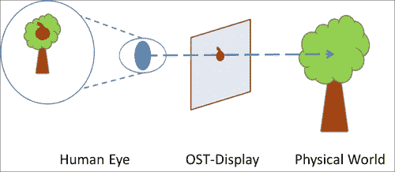
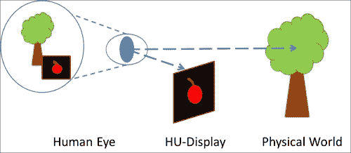
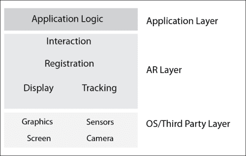
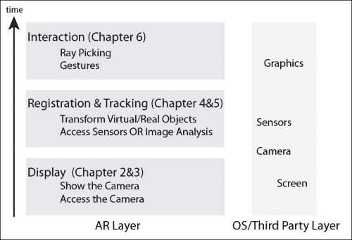

# 第一章。增强现实概念和工具

**增强现实** ( **AR** )为我们提供了一种与物理(或现实)世界互动的新方式。它在你的台式电脑或移动设备的屏幕上创建了一个我们现实的修改版本，用数字(或虚拟)信息丰富。虚拟和现实的融合和结合可以利用全新的用户体验，超越普通应用程序的能力。你能想象在你自己的街区玩第一人称射击游戏，怪物出现在你的街道拐角处吗(就像南澳大利亚大学布鲁斯·托马斯*的《地震》一样，见下面截图的左手边)？去自然历史博物馆，看到一具满是灰尘的恐龙骨架在你眼前活生生地出现，是不是一个激动人心的时刻？或者你能想象给你的孩子读一个故事，看到一些骄傲的公鸡出现，走过一本书的页面(因为有可能是*加文·毕肖普*写的《杰克建造的房子》的 ar 版本，见下面截图的右侧)。在这本书里，我们向你展示了如何在安卓平台上实际实现这样的体验。*

 *

十年前，有经验的研究人员是少数能够创建这类应用程序的人之一。它们通常仅限于演示原型或在有限时间内运行的特定项目的生产中。现在，开发 AR 体验已经成为广大移动软件开发者的现实。在过去的几年里，我们见证了计算能力、传感器小型化以及越来越容易访问和特色化的多媒体库的巨大进步。这些进步使开发人员能够比以往任何时候都更容易地生产增强现实应用程序。这已经导致越来越多的增强现实应用在谷歌游戏等移动应用商店蓬勃发展。虽然一个热情的程序员可以很容易地将一些基本的代码片段拼接在一起，创建一个基本的增强现实应用程序的复制品，但是它们通常设计得很差，功能有限，并且很难重用。为了能够创建复杂的增强现实应用程序，人们必须了解什么是真正的增强现实。

在本章中，我们将引导您更好地理解增强现实。我们将描述增强现实的一些主要概念。然后，我们将从这些示例继续到增强现实的基础软件组件。最后，我们将介绍我们将在本书中使用的开发工具，这些工具将支持我们创建高效和模块化的增强现实软件架构的旅程。

准备好为增强现实改变你的现实了吗？我们开始吧。

# AR 概念的快速概述

在过去的几年里，随着增强现实在媒体中变得越来越受欢迎，不幸的是，增强现实的几个扭曲的概念已经演变。任何以某种方式与现实世界相关并涉及一些计算的东西，比如站在商店前，看着 3D 模型穿上最新的时装，都变成了 ar。增强现实几十年前从研究实验室出现，不同的增强现实定义已经产生。随着越来越多的研究领域(例如，计算机视觉、计算机图形学、人机交互、医学、人文科学和艺术)将增强现实作为一种技术、应用或概念进行研究，增强现实现在有多个重叠的定义。我们不会为您提供一个详尽的定义列表，而是介绍任何增强现实应用程序中存在的一些主要概念。

## 感官增强

增强现实这个术语本身包含了现实的概念。增强通常是指用额外的信息影响你的一个人类感觉系统，比如视觉或听觉。这些信息通常被定义为数字或虚拟的，并将由计算机产生。该技术目前使用 **显示器**将物理信息与数字信息叠加合并。为了增强您的听力，改进的耳机或配备麦克风的耳机能够将您周围的声音与计算机产生的声音实时混合。在这本书里，我们将主要看视觉增强。

### 显示器

家里的电视屏幕是感知虚拟内容的理想设备，无论是从广播中流式传输还是从您的 DVD 中播放。不幸的是，大多数普通的电视屏幕无法捕捉真实的世界并对其进行放大。增强现实显示器需要同时显示真实世界和虚拟世界。

AR 最早的显示技术之一是由*伊凡·苏泽兰*在 1964 年生产的(命名为“达摩克利斯之剑”)。该系统被严格安装在天花板上，并使用了一些阴极射线管屏幕和透明显示器，以便能够在视觉上创造虚实融合的感觉。

从那以后，我们看到了 AR 显示的不同趋势，从静态到可穿戴和手持显示。其中一个主要趋势是 **光学透视** ( **OST** )技术的使用。这个想法是仍然通过半透明的屏幕看到现实世界，并在屏幕上投射一些虚拟内容。真实世界和虚拟世界的融合不是发生在电脑屏幕上，而是直接发生在你眼睛的视网膜上，如下图所示:

AR 显示的另一大趋势是我们所说的 **视频透视** ( **VST** )技术。你可以想象不是直接感知世界，而是通过监视器上的视频。视频图像与一些虚拟内容混合在一起(如您将在电影中看到的)，并被发送回一些标准显示器，如您的桌面屏幕、手机或即将推出的头戴式显示器，如下图所示:

在这本书里，我们将研究安卓驱动的手机，因此只讨论 VST 系统；使用的摄像机将是手机背面的摄像机。

### 3D 注册

有了显示器(OST 或 VST)，你已经能够叠加现实世界中的东西，就像你在电视广告中看到的那样，屏幕底部有文字横幅。但是，任何虚拟内容(如文本或图像)都将保持固定在屏幕上的位置。叠加真的是静态的，你的 AR 显示器会充当T3 平视显示器 ( **HUD** )但是不会真的是 AR，如下图所示:

谷歌眼镜就是平视显示器的一个例子。虽然它使用了像 OST 一样的半透明屏幕，但数字内容保持在静态位置。

AR 需要更多地了解真实和虚拟内容。它需要知道物体在太空中的位置(**注册**)并跟踪它们移动的位置(**追踪**)。

注册基本上是在同一个空间中对齐虚拟内容和真实内容的想法。如果你对电影或体育感兴趣，你会注意到 2D 或 3D 图形经常被叠加到物理世界的场景中。在冰球运动中，冰球通常以彩色轨迹突出。在像*华特·迪士尼的* TRON (1982 版)这样的电影中，真实和虚拟的元素无缝融合。然而，增强现实不同于那些效果，因为它基于以下所有方面(由*罗纳德·阿兹马*在 1997 年提出):

*   **是 3D 的**:在过去的时代，有些电影是手工剪辑的，将虚拟的视觉效果和真实的内容融合在一起。一个众所周知的例子是《星球大战》，在那里，所有的光剑效果都是由数百名艺术家手工绘制的，因此是一帧一帧的。如今，更复杂的技术支持将数字 3D 内容(如角色或汽车)与视频图像合并(称为匹配移动)。增强现实本质上总是在三维空间中这样做。
*   **注册实时发生**:电影中，一切都是在摄影棚里预先录制生成的；你只是在玩媒体。在增强现实中，一切都是实时的，因此您的应用程序需要在每个实例中融合现实和虚拟。
*   **是互动的**:在电影中，你只能被动地从拍摄过的地方看场景。在增强现实中，你可以主动前后移动，并转动你的增强现实显示屏——你仍然会看到两个世界之间的对齐。

### 与环境的相互作用

构建丰富的 AR 应用需要环境之间的交互；否则你最终会得到漂亮的 3D 图形，它会很快变得无聊。增强现实交互是指选择和操纵数字和物理对象，并在增强场景中导航。丰富的增强现实应用程序允许您使用可以放在桌子上的对象，移动一些虚拟角色，在街上行走时用手选择一些浮动的虚拟对象，或者与出现在手表上的虚拟代理交谈，以安排一天中稍后的会议。在[第 6 章](6.html "Chapter 6. Make It Interactive – Create the User Experience")、*让它互动起来——创造用户体验*中，我们将讨论移动-AR 互动。我们将看看一些标准的移动交互技术如何应用于增强现实。我们还将深入研究涉及操纵现实世界的具体技术。

## 选择你的风格——基于传感器和基于计算机视觉的 AR

在本章前面，我们讨论了什么是增强现实，并详细阐述了显示、注册和交互。由于本书中的一些概念也可以应用于任何增强现实开发，我们将特别关注 **移动增强现实**。

移动增强现实有时指的是任何可移动、可穿戴的增强现实系统，可以在室内和室外使用。在本书中，我们将着眼于当今使用最广泛的内涵——使用手持移动设备，如智能手机或平板电脑的移动 AR。借助当前一代智能手机，可以实现增强现实系统的两种主要方法。这些系统的特征在于它们特定的注册技术，以及它们的交互范围。它们都支持不同范围的应用。基于传感器的增强现实和基于计算机视觉的增强现实系统都是利用视频透视显示，依靠手机的摄像头和屏幕。

### 基于传感器的增强现实

第一种类型的系统被称为基于传感器的增强现实，通常被称为全球定位系统加惯性增强现实(或者，有时，室外增强现实系统)。基于传感器的增强现实使用来自移动设备的位置传感器作为以及方向传感器。将位置和方向传感器结合起来，就能提供用户在物理世界中的全球位置。

位置传感器主要由**全球导航卫星系统** ( **全球导航卫星系统** ) 接收器支持。最受欢迎的全球导航卫星系统接收器之一是全球定位系统(由美国维护)，它出现在大多数智能手机上。

### 注

其他系统目前正在(或将很快)部署，如 GLONASS(俄罗斯)、伽利略(欧洲，2020 年)或指南针(中国，2020 年)。

手持设备上有几种可能的方位传感器，如加速度计、磁力计和陀螺仪。您手持设备的测量位置和方向提供了跟踪信息，用于在物理场景上注册虚拟对象。全球定位系统模块报告的位置可能不准确，更新速度也可能比你移动的速度慢。这可能会导致 **滞后，**也就是说，当你做快速运动时，虚拟元素似乎会飘在后面。基于传感器系统的最流行的增强现实应用之一是增强现实浏览器，它可以可视化 **兴趣点** ( **兴趣点**，即关于你周围事物的简单图形信息。如果你尝试一些最受欢迎的产品，如 Junaio，Layar，或 Wikitude，你可能会观察到这种滞后效应。

这项技术的优势在于，基于传感器的 ARs 可以在全球范围内工作，几乎可以在任何户外位置工作(例如，如果你在沙漠中或城市中)。这种系统的局限性之一是它们不能在室内(或工作不佳)或任何闭塞区域工作(与天空没有视线，例如在森林或周围有高楼的街道上)。我们将在[第 4 章](4.html "Chapter 4. Locating in the World")、*定位于世界*中更多地讨论这种类型的移动增强现实系统。

### 基于计算机视觉的增强现实

另一种流行的增强现实系统是基于计算机视觉的增强现实。这里的想法是利用内置摄像头的力量，不仅仅是捕捉和显示物理世界(就像在基于传感器的增强现实中所做的那样)。这项技术通常通过图像处理和计算机视觉算法来操作，这些算法分析图像以检测从摄像机中可见的任何物体。该分析可以提供关于不同对象的位置的信息，因此也可以提供关于用户的信息(更多信息参见[第 5 章](5.html "Chapter 5. Same as Hollywood – Virtual on Physical Objects")、*与好莱坞相同–物理对象上的虚拟*)。

这样做的好处是，事情看起来完全一致。当前的技术允许您识别不同类型的平面图片内容，例如专门设计的标记(**基于标记的跟踪**)或更自然的内容(**无标记跟踪**)。缺点之一是基于视觉的增强现实处理量大，并且会迅速耗尽电池。新一代智能手机更适合处理这类问题，因为它们针对能耗进行了优化。

## 增强现实架构概念

因此，让我们探索如何支持前面描述的概念和两个通用增强现实系统的开发。与任何其他应用程序的开发一样，软件工程的一些众所周知的概念可以应用于开发增强现实应用程序。我们将关注增强现实应用程序的结构方面(软件组件)，然后是行为方面(控制流)。

### AR 软件组件

增强现实应用程序可以分为三层:应用层、增强现实层和操作系统/第三方层。

**应用层** 对应你应用的领域逻辑。如果你想开发一个 AR 游戏，任何与管理游戏资产(角色、场景、对象)或游戏逻辑相关的东西都会在这个特定的层中实现。AR 层对应于我们之前描述的概念的实例化。我们提出的每一个增强现实概念和概念(显示、注册和交互)都可以从软件的角度来看，作为增强现实层的模块化元素、组件或服务。

您可以注意到，在图中，我们已经将跟踪和注册分开，使跟踪成为 AR 应用程序的一个主要软件组件。在任何增强现实应用中，向注册服务提供空间信息的跟踪都是一个复杂且计算密集型的过程。操作系统/第三方层对应于不提供任何增强现实功能的现有工具和库，但将启用增强现实层。例如，移动应用程序的**显示模块将与操作系统层通信，以访问相机来创建物理世界的视图。在安卓系统上，谷歌安卓应用编程接口是这一层的一部分。一些额外的库，比如处理图形的 JMonkeyEngine，也是这个层的一部分。**

 **在本书的其余部分，我们将向您展示如何实现增强现实层的不同模块，这也涉及到与操作系统/第三方层的通信。下图描述了增强现实应用程序的主要层(参见下图的右侧)及其应用程序模块(下图的左侧):

### AR 控制流程

考虑到软件层和组件的概念，我们现在可以看看信息在典型的增强现实应用程序中是如何流动的。我们将在这里重点描述 AR 层的每个组件如何随着时间的推移而相互关联，以及它们与操作系统/第三方层的联系。

在过去的十年里，增强现实研究人员和开发人员已经朝着一种使用相似的执行顺序——增强现实控制流——来组合这些组件的常用方法靠拢。我们在这里展示了社区使用的一般增强现实控制流程，总结如下图所示:

上图从下往上看，显示了一个增强现实应用程序的主要活动。该序列在 AR 应用中无限重复；可以看作是典型的 **AR 主循环**(请注意，这里我们已经排除了领域逻辑以及 OS 活动)。每个活动对应于我们之前介绍过的相同模块。因此，增强现实层和增强现实控制流的结构是非常对称的。

理解这个控制流是开发一个 AR 应用程序的关键，所以我们将回到它，并在本书的其余部分中使用它。我们将在下一章中详细介绍每个组件和步骤。

因此，查看上图，应用程序中的主要活动和步骤如下:

*   **首先管理显示**:对于移动 AR，这意味着访问摄像机，并在屏幕上显示捕获的图像(您的物理世界的视图)。我们将在[第二章](2.html "Chapter 2. Viewing the World")*观世界*中讨论。这还包括在物理相机和渲染数字对象的虚拟相机之间匹配相机参数([第 3 章](3.html "Chapter 3. Superimposing the World")、*叠加世界*)。
*   **注册并跟踪你的物体**:分析你手机上的传感器(接近 1)或分析视频图像(接近 2)并检测你的世界的每个元素的位置(如相机或物体)。我们将在[第 4 章](4.html "Chapter 4. Locating in the World")、*定位于世界*和[第 5 章](5.html "Chapter 5. Same as Hollywood – Virtual on Physical Objects")、*中讨论这一方面，与好莱坞相同–实物上的虚拟*。
*   **互动**:一旦你的内容注册正确，你就可以开始与它互动，我们将在[第 6 章](6.html "Chapter 6. Make It Interactive – Create the User Experience")、*中讨论，让它互动起来——创造用户体验*。

## 开发和部署的系统需求

如果你想为安卓开发增强现实应用，你可以和普通的安卓开发者分享大部分工具。具体来说，你可以利用广泛支持的**谷歌安卓开发者工具捆绑包** ( **ADT 捆绑包**)的力量。这包括以下内容:

*   Eclipse **集成开发环境** ( **IDE** )
*   Eclipse 的**谷歌安卓开发工具** ( **ADT** )插件
*   针对目标设备的安卓平台(可下载更多平台)
*   搭载最新系统映像的安卓模拟器

除了许多安卓开发环境通用的标准包之外，您还需要以下内容:

*   版本 3 或更高版本的**jmonkey engine**(**JME**)快照
*   **高通 VuforiaTMT3**SDK**(**VuforiaTMT9)**、**2.6 版或更高版本****
*   **安卓原生开发套件** ( **安卓 NDK**)r9 或更高版本

JME Java OpenGL 游戏引擎是一个免费的工具包，它可以让你的程序中的三维图形栩栩如生。它提供了 3D 图形和游戏中间件，使您无需专门在低级别的**OpenGL****ES**(**OpenGL for Embedded Systems**)中编码，例如，通过提供一个资产系统来导入模型、预定义的照明以及物理和特效组件。

高通 Vuforia TM SDK 带来了最先进的计算机视觉算法，旨在识别和跟踪各种各样的对象，包括基准(帧标记)、图像目标，甚至 3D 对象。虽然基于传感器的增强现实不需要它，但它允许您方便地实现基于计算机视觉的增强现实应用。

谷歌安卓 NDK 是性能关键型应用的工具集。它允许应用程序的一部分用本机代码语言(C/C++)编写。虽然您不需要用 C 或 C++进行编码，但是这个工具集是 Vuforia TM SDK 所需要的。

当然，您并不局限于特定的 IDE，也可以使用命令行工具。我们在本书中介绍的代码片段本身并不依赖于特定 IDE 的使用。然而，在本书中，我们将为您提供专门针对流行的 Eclipse IDE 的设置说明。此外，所有开发工具都可以在 Windows (XP 或更高版本)、Linux 和 Mac OS X (10.7 或更高版本)上使用。

在接下来的页面中，我们将指导您完成安卓开发者工具包、NDK、JME 和 Vuforia TM SDK 的安装过程。虽然开发工具可以分布在整个系统中，但是我们建议您为开发工具和示例代码使用一个公共的基础目录；姑且称之为`AR4Android`(比如 Windows 下的`C:/AR4Android`或者 Linux 或者 Mac OS X 下的`/opt/AR4Android`)。

### 安装安卓开发者工具包和安卓 NDK

您可以通过以下两个简单的步骤安装 ADT 捆绑包:

1.  从[http://developer.android.com/sdk/index.html](http://developer.android.com/sdk/index.html)下载 ADT 捆绑包。
2.  下载后，将`adt-bundle-<os_platform>.zip`解压到`AR4Android`基础目录。

然后可以通过启动`AR4Android/adt-bundle-<os_platform>/eclipse/eclipse(.exe)`来启动 Eclipse IDE。

### 类型

请注意，根据您使用的设备(例如，版本 2.3.5 或 4.0.1)，您可能需要安装其他系统映像。您可以按照以下网站给出的说明进行操作:[http://developer.android.com/tools/help/sdk-manager.html](http://developer.android.com/tools/help/sdk-manager.html)。

对于安卓 NDK 系统(r9 或更高版本)，您需要遵循类似的步骤，如下所示:

1.  从[http://developer.android.com/tools/sdk/ndk/index.html](http://developer.android.com/tools/sdk/ndk/index.html)下载。
2.  下载后，将`android-ndk-r<version>Y-<os_platform>.(zip|bz2)`解压到`AR4Android`基础目录。

### 安装 JMonkeyEngine

JME 是一个强大的基于 Java 的 3D 游戏引擎。它自带开发环境(基于 NetBeans 的 JME IDE)，针对桌面游戏的开发。虽然 JME IDE 也支持安卓设备的部署，但它(在撰写本书时)缺乏方便的安卓 SDK 工具的集成，如 **【安卓调试桥】**(**ADB**)**达尔维克调试监控服务器视图** ( **DDMS** ) 或 ADT 捆绑包中的安卓仿真器的集成。因此，我们将在 Eclipse 中将基础库集成到我们的增强现实项目中，而不是使用 JME 集成开发环境。获取 JME 库最简单的方法就是从[http://jmonkeyengine.org/downloads](http://jmonkeyengine.org/downloads)下载你的操作系统的 SDK，安装到`AR4Android`基础目录(或者你自己的开发者目录；只需确保您可以在以后的项目中轻松访问它)。在这本书出版的时候，有三个包:Windows、GNU/Linux 和 Mac OS X。

### 类型

您也可以从[http://updates.jmonkeyengine.org/nightly/3.0/engine/](http://updates.jmonkeyengine.org/nightly/3.0/engine/)获得最新版本

使用 ADT 捆绑包，您只需要 JME 的 Java 库(`.jar`)来开发增强现实。如果您在 Windows 或 Linux 上工作，您可以通过执行以下步骤将它们包含在任何现有的 Eclipse 项目中:

1.  右键单击您的增强现实项目(我们将在下一章中创建)或 Eclipse 资源管理器中的任何其他项目，然后转到**构建路径** | **添加外部档案**。
2.  在 **JAR 选择**对话框中，浏览至`AR4Android/jmonkeyplatform/ jmonkeyplatform/libs`。
3.  你可以在 lib 目录中选择**所有 JARs** ，点击**打开**。

如果你在 Mac OS X 上工作，你应该先从`jmonkeyplatform.app`中提取库，然后再应用与上一节描述的 Windows 或 Linux 相同的过程。要提取库，您需要右键单击您的`jmonkeyplatform.app`应用程序并选择**显示包内容**，您将在`/Applications/jmonkeyplatform.app/Contents/Resources/`中找到库。

请注意，在本书的上下文中，我们只使用了其中的几个。在本书源代码附带的 Eclipse 项目中，您会发现必要的 JARs 已经存在于本地 lib 目录中，其中包含运行示例所需的 Java 库子集。您也可以在构建路径中引用它们。

### 注

安卓使用 JME 的参考文档可以在[http://hub.jmonkeyengine.org/wiki/doku.php/jme3:android](http://hub.jmonkeyengine.org/wiki/doku.php/jme3:android)找到。

### 安装 Vuforia TM

Vuforia TM 是用于计算机视觉识别和自然特征跟踪的最先进的库。

为了下载和安装 Vuforia TM ，您必须首先在[https://developer.vuforia.com/user/register](https://developer.vuforia.com/user/register)注册。之后，你可以从[https://developer.vuforia.com/resources/sdk/android](https://developer.vuforia.com/resources/sdk/android)下载 SDK(适用于 Windows、Linux 或 Mac OS X)。创建名为`AR4Android/ThirdParty`的文件夹。现在通过转到**文件** | **新建** | **项目来创建一个 Eclipse 项目...**命名为`ThirdParty`，并选择文件夹`AR4Android/ThirdParty`作为位置(另请参见[第 2 章](2.html "Chapter 2. Viewing the World")、*查看世界*中的*创建月食项目*一节)。然后在`AR4Android/ThirdParty/vuforia-sdk-android-<VERSION>`中安装 Vuforia TM SDK。对于[第 5 章](5.html "Chapter 5. Same as Hollywood – Virtual on Physical Objects")、*中的示例，与好莱坞相同–物理对象上的虚拟*和[第 6 章](6.html "Chapter 6. Make It Interactive – Create the User Experience")、*使其交互–创建用户体验*，您需要参考这个`ThirdParty Eclipse`项目。

## 应该使用哪些安卓设备？

您将学习构建的增强现实应用程序将在各种安卓智能手机和平板设备上运行。但是，根据具体的算法，我们将介绍一些应该满足的硬件要求。具体来说，安卓设备需要具备以下功能:

*   适用于本书所有示例的背面摄像头
*   基于传感器的增强现实示例的全球定位系统模块
*   用于基于传感器的增强现实示例的陀螺仪或线性加速度计

手机上的增强现实可能具有挑战性，因为许多集成传感器必须在应用程序运行期间处于活动状态，并且需要执行计算密集型算法。因此，我们建议将其部署在双核处理器(或更多内核)上，以获得最佳的增强现实体验。最早部署的安卓版本应该是 2.3.3 (API 10，姜饼)。这为你的增强现实应用提供了覆盖 95%安卓设备的潜力。

### 注

访问[http://developer.android.com/about/dashboards/index.html](http://developer.android.com/about/dashboards/index.html)获取最新号码。

请确保按照[http://developer.android.com/tools/device.html](http://developer.android.com/tools/device.html)中的描述设置您的开发设备。

此外，大多数增强现实应用，特别是基于计算机视觉的应用(使用 Vuforia TM )需要足够的处理能力。

# 总结

本章介绍了增强现实的基础背景。我们已经介绍了增强现实的一些主要概念，例如感官增强、专用显示技术、物理和数字信息的实时空间注册以及与内容的交互。

我们还介绍了基于计算机视觉和基于传感器的增强现实系统，这是移动设备架构的两大趋势。增强现实应用程序的基本软件架构块也已经描述过了，并将作为本书剩余演示的指南。到目前为止，您应该已经安装了后面章节中使用的第三方工具。在下一章中，您将开始使用 JME 查看虚拟世界并实现摄像头访问。***