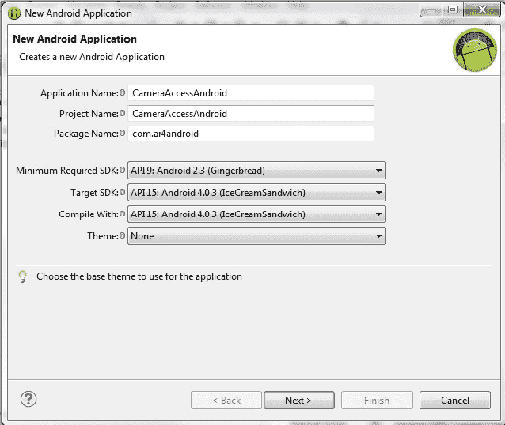
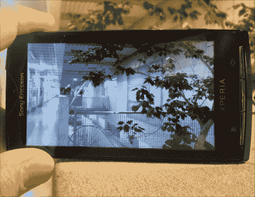

# 二、观察世界

在本章中，我们将学习如何开发任何移动 AR 应用程序的第一个元素:*真实世界的视图*。为了理解真实世界视图的概念，我们将看看您在手机上安装的相机应用程序。打开安卓设备上预装的任何照片捕获应用程序(相机应用程序)，或者从谷歌 Play 商店下载的应用程序(如相机缩放 FX、晕影等)。您可以在应用程序的取景器上看到的是由相机捕获并显示在屏幕上的实时视频流。

如果您在运行应用程序的同时移动设备，似乎是通过设备“看到”了真实世界。事实上，相机看起来就像设备的眼睛，感知你周围的环境。这个过程也用于移动 AR 开发，以创建真实世界的视图。这就是我们在前一章中介绍的透视视频的概念。

真实世界的展示需要两个主要步骤:

*   从摄像机捕捉图像(摄像机访问)
*   使用图形库在屏幕上显示该图像(JME 的摄像机显示)

这个过程通常在无限循环中重复，创造了物理世界视图的*实时*方面。在本章中，我们将讨论如何使用两个不同的图形库来实现这两种技术:一个低级图形库(安卓库)和一个高端图形库(JME 三维场景图形库)。虽然安卓库允许您快速显示相机图像，但它不是设计来与 3D 图形相结合的，而 3D 图形是您想要在视频流中增强的。因此，您也将使用 JME 库实现相机显示。我们还将介绍处理各种安卓智能手机及其内置摄像头的挑战和提示。

# 了解摄像头

手机制造商总是竞相为您的智能手机配备最先进的摄像头传感器，为其配备更多功能，例如更高的分辨率、更好的对比度、更快的视频捕获、新的自动对焦模式等。结果是，手机摄像头的功能(特性)在智能手机型号或品牌之间可能会有很大差异。谢天谢地，谷歌 Android API 为底层相机硬件提供了一个通用的包装器，统一了开发者的访问权限:Android 相机 API。为了您的开发，对摄像机的有效访问需要清楚地了解通过应用编程接口提供的摄像机功能(参数和功能)。低估这一点将导致应用程序运行缓慢或图像像素化，从而影响应用程序的用户体验。

## 摄像头特性

如今智能手机上的摄像头与数码直射相机有许多共同的特点。它们通常支持两种操作模式:静止图像模式(对图像的瞬时、单一捕捉)或视频模式(对图像的连续、实时捕捉)。

视频和图像模式在功能方面有所不同:例如，图像捕捉总是比视频具有更高的分辨率(更多的像素)。虽然现代智能手机在静止图像模式下可以轻松实现 800 万像素，但视频模式仅限于 1080p(约 200 万像素)。在增强现实中，出于效率原因，我们通常使用较低分辨率的视频模式，如 VGA (640 x 480)。与标准数码相机不同，我们不在外部存储卡上存储任何内容；我们只是在屏幕上显示图像。这种模式在 Android API 中有一个特殊的名字:预览模式。

预览模式的一些常见设置(参数)有:

*   **分辨率**:就是拍摄到的图像大小，可以显示在你的屏幕上。这也叫安卓相机 API 中的大小。分辨率是根据图像的宽度(x)和高度(y)以像素定义的。它们之间的比例被称为**纵横比**、，这给人一种图像与电视分辨率有多相似的感觉(例如 1:1、4:3 或 16:9)。
*   **帧率**:它定义了一个图像可以多快被捕捉。这也叫做 T4(**FPS**)每秒帧数。
*   **白平衡**:它决定了你的图像会是什么样的白色，主要取决于你的环境光线(例如，室外的日光、家里的白炽灯、工作时的荧光灯等等)。
*   **焦点**:定义图像的哪个部分会显得清晰，哪个部分不容易被辨别(失焦)。和其他相机一样，智能手机相机也支持自动对焦模式。
*   **Pixel format**: The captured image is converted to a specific image format, where the color (and luminance) of each pixel is stored under a specific format. The pixel format not only defines the type of color channels (such as RGB versus YCbCr), but also the storage size of each component (for example, 5, 8, or 16 bits). Some popular pixel formats are RGB888, RGB565, or YCbCr422\. In the following figure, you can see common camera parameters, moving from the left to right: image resolution, frame rate for capturing image streams, focus of the camera, the pixel format for storing the images and the white balance:

    

与摄像机工作流程相关的其他重要设置有:

*   **回放控制**:定义何时可以启动、暂停、停止或获取相机的图像内容。
*   **缓冲控制**:捕获的图像被复制到内存中，以便应用程序访问。有种不同的方式来存储这个图像，例如，使用缓冲系统。

正确配置这些设置是增强现实应用程序的基本要求。虽然流行的相机应用程序只使用预览模式来捕捉视频或图像，但预览模式是在增强现实中查看真实世界的基础。配置这些相机参数时，您需要记住的一些事情是:

*   分辨率越高，你的帧速率越低，这意味着如果图像中的东西移动不快，你的应用程序可能看起来更漂亮，但运行速度会更慢。相比之下，您可以让应用程序快速运行，但您的图像会看起来“块状”(像素化效果)。
*   如果白平衡设置不当，覆盖在视频图像上的数字模型的外观将不匹配，增强现实体验将会减弱。
*   如果焦点一直在变化(自动对焦)，您可能无法分析图像的内容，并且应用程序的其他组件(如跟踪)可能无法正常工作。
*   移动设备上的摄像头使用压缩图像格式，通常无法提供与高端桌面网络摄像头相同的性能。当您将视频图像(通常在 RGB565 中)与使用 RGB8888 渲染的 3D 内容相结合时，您可能会注意到它们之间的颜色差异。
*   如果您正在对图像进行大量处理，这可能会导致应用程序延迟。此外，如果您的应用程序同时运行多个进程，将您的图像捕获进程与其他进程同步是相当重要的。

我们建议您:

*   获取并测试各种安卓设备及其摄像头，以了解摄像头的功能和性能。
*   在分辨率和帧速率之间找到一个折中方案。桌面增强现实使用的标准分辨率/帧速率组合是 640 x 480，30 fps。将其用作移动增强现实应用程序的基线，并从那里进行优化，为新设备获得更高质量的增强现实应用程序。
*   如果您的增强现实应用程序只应该在特定的环境中运行，例如户外应用程序在白天运行，请优化白平衡。
*   控制对焦一直是安卓智能手机的限制因素之一(总是自动对焦或配置不可用)。如果您正在开发桌面或室内增强现实应用程序(近焦点)而不是室外增强现实应用程序(远焦点)，请优先选择固定焦点而不是自动对焦，并优化对焦范围。
*   尝试像素格式，以获得与渲染内容的最佳匹配。
*   尝试在目标设备上使用高级缓冲系统(如果有)。

相机还有其他主要特性，这些特性不能通过应用编程接口(或仅在某些手持设备上)获得，但在开发增强现实应用程序时需要考虑。它们是视野、曝光时间和光圈。

我们这里只讨论其中一个:视野。视野对应的是相机从现实世界看到的东西，比如你的眼睛从左到右、从上到下能看到多少东西(人的视觉用双目视觉大概是 120 度左右)。视场以度为单位测量，并且在摄像机之间变化很大(15 度到 60 度，没有失真)。

你的视野越大，你就越能捕捉到真实世界的景象，体验也就越好。视野取决于您相机的硬件特性(传感器尺寸和焦距的焦距)。估计这个视野可以用额外的工具来完成；我们将在稍后探讨这一点。

## 摄像头与屏幕特性

在您的移动平台上，相机和屏幕的特性通常不完全相同。相机图像可以例如大于屏幕分辨率。其中一个摄像头的屏幕纵横比也可能不同。这在增强现实中是一个技术挑战，因为你想找到最好的方法来适应屏幕上的相机图像，以创造一种增强现实显示的感觉。您希望通过将尽可能多的相机图像放在屏幕上来最大化信息量。在电影行业，他们有一个类似的问题，因为录制的格式可能与播放的媒体不同(例如，4:3 移动设备上的 cinemascope 电影，1080p 电视屏幕上的 4K 电影分辨率，等等)。为了解决这个问题，您可以使用两种称为拉伸和裁剪的全屏方法，如下图所示:


拉伸将使相机图像适应屏幕特征，但有可能使图像的原始格式(主要是纵横比)变形。裁剪将选择图像的一个子区域进行显示，您将丢失信息(它基本上放大图像，直到整个屏幕被填满)。另一种方法是改变图像的比例，使屏幕的一个维度(宽度或高度)和图像相同。在这里，缺点是您将失去相机图像的全屏显示(图像的一侧将出现黑色边框)。没有一种技术是最优的，因此您需要试验什么对您的应用程序和目标设备更方便。

# 在安卓中访问摄像头

首先，我们将创建一个简单的相机活动来了解安卓系统中相机访问的原理。虽然有一些方便的安卓应用程序提供了通过安卓意图捕捉图片或录制视频的快速方法，但我们会弄脏手，并使用安卓相机应用编程接口为我们的第一个应用程序获得定制的相机访问。

我们将一步一步地指导您创建第一个显示实时相机预览的应用程序。这将包括:

*   创建一个 Eclipse 项目
*   在安卓清单文件中请求相关权限
*   创建曲面视图，以便能够捕捉相机的预览帧
*   创建显示摄像机预览帧的活动
*   设置相机参数

### 类型

**下载示例代码**

您可以从您在[http://www.packtpub.com](http://www.packtpub.com)的账户中下载您购买的所有 Packt 书籍的示例代码文件。如果您在其他地方购买了这本书，您可以访问[http://www.packtpub.com/support](http://www.packtpub.com/support)并注册，以便将文件直接通过电子邮件发送给您。也可以在[https://github.com/arandroidbook/ar4android](https://github.com/arandroidbook/ar4android)找到代码文件。

## 创建一个 Eclipse 项目

我们的第一步是在 Eclipse 中创建安卓项目的设置过程。我们将称我们的第一个项目为`CameraAccessAndroid`。请注意，本小节的描述与我们将在本书中介绍的所有其他示例相似。

启动你的 Eclipse 项目，进入**文件** | **新建** | **安卓应用项目**。在以下配置对话框中，请填写适当的字段，如下图所示:



然后，通过接受默认值，点击另外两个对话框(**配置项目**选择项目的文件路径，**启动器图标**)。然后，在**创建活动**对话框中，选择**创建活动**复选框和**空白活动**选项。在下面的**新建空白活动**对话框中，填写**活动名称**文本框，例如 `CameraAccessAndroidActivity`，并将**布局名称**文本框保留为默认值。最后，点击**完成**按钮，您的项目应该被创建并且在项目浏览器中可见。

## 安卓清单中的权限

对于我们将要创建的每个增强现实应用程序，我们都将使用相机。使用安卓应用编程接口，您需要在应用程序的安卓清单声明中明确允许摄像头访问。在`CameraAccessAndroid`项目的顶层文件夹中，在文本视图中打开`AndroidManifest.xml`文件。然后添加以下权限:

```java
<uses-permission android:name="android.permission.CAMERA" />
```

除了该权限，应用程序还需要至少声明相机功能的使用:

```java
<uses-feature android:name="android.hardware.camera" />
```

由于我们希望在全屏模式下运行增强现实应用程序(为了更好的沉浸感)，因此在活动标签中添加以下选项:

```java
android:theme="@android:style/Theme.NoTitleBar.Fullscreen"
```

## 创建显示摄像机的活动

在最基本的形式中，我们的`Activity`类负责设置`Camera`实例。作为类成员，您需要声明一个`Camera`类的实例:

```java
public class CameraAccessAndroidActivity extends Activity {
private Camera mCamera;

}
```

下一步是打开摄像头。为此，我们定义了一个`getCameraInstance()`方法:

```java
public static Camera getCameraInstance() {
  Camera c = null;
  try {
    c = Camera.open(0);
  } catch (Exception e) { ...  }
  return c;
}
```

重要的是`open()`调用被`try{}catch{}`块包围，因为摄像机当前可能被其他进程使用并且不可用。这个方法在你们`Activity`班的`onResume()`方法中叫做:

```java
public void onResume() {
  super.onResume();  
  stopPreview = false;
  mCamera = getCameraInstance();
  ...
}
```

暂停或退出程序时，正确释放相机也很重要。否则，如果您打开另一个(或相同的)程序，它将被阻止。我们为此定义了一个`releaseCamera()`方法:

```java
private void releaseCamera() {
  if (mCamera != null) {

    mCamera.release();
    mCamera = null;
  }
}
```

然后你在你的`Activity`类的 `onPause()`方法中调用这个方法。

### 注

在某些设备上，打开相机可能会很慢。在这种情况下，您可以使用`AsyncTask`类来缓解问题。

## 设置摄像头参数

现在，您已经有了启动和停止相机的基本工作流程。安卓相机应用编程接口还允许您查询和设置本章开头讨论的各种相机参数。具体来说，您应该注意不要使用非常高分辨率的图像，因为它们需要大量的处理能力。对于典型的移动 AR 应用，您不希望拥有更高的 640 x 480 (VGA)视频分辨率。

由于摄像头模块可能有很大不同，因此不建议硬编码视频分辨率。相反，查询相机传感器的可用分辨率是一个很好的做法，如果支持的话，只使用最适合您的应用的分辨率。

假设您已经在`mDesiredCameraPreviewWidth`变量中预定义了想要的视频宽度。然后，您可以使用以下方法检查摄像机是否支持宽度分辨率值(以及相关的视频高度):

```java
private void initializeCameraParameters() {
  Camera.Parameters parameters = mCamera.getParameters();
  List<Camera.Size> sizes = parameters.getSupportedPreviewSizes();
  int currentWidth = 0;
  int currentHeight = 0;
  boolean foundDesiredWidth = false;
  for(Camera.Size s: sizes) {
    if (s.width == mDesiredCameraPreviewWidth)  {             
      currentWidth = s.width;
      currentHeight = s.height;
      foundDesiredWidth = true;
      break;
    }
  }
  if(foundDesiredWidth) 
    parameters.setPreviewSize( currentWidth, currentHeight );

  mCamera.setParameters(parameters);
}     
```

`mCamera.getParameters()`方法用于查询当前摄像机参数。`mCamera.getParameters()`和`getSupportedPreviewSizes()`方法返回可用预览尺寸的子集，`parameters.setPreviewSize`方法设置新的预览尺寸。最后，您必须调用`mCamera.setParameters(parameters)`方法，以便实现所请求的更改。这个`initializeCameraParameters()`方法也可以在你的`Activity`类的`onResume()`方法中调用。

## 创建表面视图

对于您的增强现实应用程序，您希望在屏幕上显示来自背面相机的实时图像流。在标准应用中，获取视频和显示视频是两个独立的过程。使用安卓应用编程接口，您明确需要一个单独的表面视图来显示相机流。`SurfaceView`类是一个专用的绘图区域，您可以将其嵌入到应用程序中。

所以对于我们的例子，我们需要从安卓`SurfaceView`类中派生一个新的类(让我们称之为`CameraPreview`)并实现一个`SurfaceHolder.Callback`接口。该界面用于对任何与表面相关的事件做出反应，例如表面的创建、改变和破坏。通过`Camera`类访问手机摄像头。在构造函数中，安卓`Camera`实例(之前定义过)被传递:

```java
public class CameraPreview extends SurfaceView implements SurfaceHolder.Callback {
  private static final String TAG = "CameraPreview";
  private SurfaceHolder mHolder;
  private Camera mCamera;
  public CameraPreview(Context context, Camera camera) {
    super(context);
    mCamera = camera;
    mHolder = getHolder();
    mHolder.addCallback(this);
    mHolder.setType(SurfaceHolder.SURFACE_TYPE_PUSH_BUFFERS);
  }
```

在`surfaceChanged`方法中，负责传递一个初始化的`SurfaceHolder`实例(即保存显示表面的实例)，并启动相机的预览流，稍后您希望在自己的应用程序中显示(并处理)。相机预览流的停止也很重要:

```java
public void surfaceChanged(SurfaceHolder holder, int format, int w, int h) {
  if (mHolder.getSurface() == null){
    return;
  }
  try {
    mCamera.stopPreview();
  } catch (Exception e){ ...}
  try {       
    mCamera.setPreviewDisplay(mHolder);
    mCamera.startPreview();
  } catch (Exception e){ ... }
}
```

继承的方法`surfaceCreated()`和`surfaceDestroyed()`保持为空。

定义了我们的`CameraPreview`类后，我们可以在`Activity`类中声明它:

```java
private CameraPreview mPreview;
```

然后，在`onResume()`方法中实例化它:

```java
mPreview = new CameraPreview(this, mCamera);
setContentView(mPreview);
```

要测试您的应用程序，您可以对您的其他项目进行同样的操作:请通过 USB 电缆将您的测试设备连接到您的计算机。在 Eclipse 中，右键单击项目文件夹`CameraAccessAndroid`，在弹出菜单中转到**运行方式** | **1 安卓应用程序**。一旦应用程序上传并启动，您现在应该能够在手机屏幕上看到实时相机视图。

# JME 现场摄像取景

在前面的例子中，您看到了如何使用低级图形库(标准安卓库)访问安卓相机。由于我们想要执行增强现实，我们将需要另一种技术来将虚拟内容覆盖在视频视图上。有不同的方法可以做到这一点，最好的方法当然是使用一个共同的视图，这将很好地集成虚拟和视频内容。一种强大的技术是使用基于场景图模型的托管三维图形库。场景图基本上是一种数据结构，通过逻辑组织基本的构建块，如几何或空间转换，它可以帮助您比在普通的 OpenGL 中更容易地构建复杂的 3D 场景。当您在第一章安装 JME 时，我们将使用这个特定的库来提供我们 AR 开发所需的所有特性。在本小节中，我们将探讨如何使用 JME 来显示视频。与前面的例子不同，相机视图将被集成到三维场景图中。为了实现这一点，您可以使用以下步骤:

1.  在 JME 的支持下创建一个项目。
2.  创建创建 JME 的活动。
3.  创建 JME 应用程序，它实际渲染我们的三维场景。

要与 JME 一起创建项目，您可以按照[第 1 章](1.html "Chapter 1. Augmented Reality Concepts and Tools")、*增强现实概念和工具*的*安装 JMonkeyEngine* 部分中的说明进行操作。我们将做一个名为`CameraAccessJME`的新项目。

## 创建 JME 活动

作为一名安卓开发者，你知道安卓活动是创建你的应用程序的主要入口点。然而，JME 是一个独立于平台的游戏引擎，运行在许多支持 Java 的平台上。JME 的创作者们希望尽可能简化将现有(和新的)JME 应用程序集成到安卓系统的过程。因此，他们明确区分了 JME 应用程序和 JME 活动中的安卓特定部分，前者进行场景的实际渲染(也可以在其他平台上使用)，后者用于设置环境以允许 JME 应用程序运行。他们实现这一点的方式是拥有一个名为`AndroidHarness`的特定类，这可以减轻开发人员正确配置安卓活动的负担。例如，它将您屏幕上的触摸事件映射到 JME 应用程序中的鼠标事件。这种方法的一个挑战是转发安卓特有的事件，这在 JME 应用程序的其他平台上并不常见。不要担心，我们将向您展示如何为相机图像做到这一点。

首先要做的是创建一个从`AndroidHarness`类派生的安卓活动，我们称之为`CameraAccessJMEActivity`方法。就像`CameraAccessAndroidActivity`类一样，它拥有`Camera`和`CameraPreview`类的实例。相比之下，它还将保存一个负责渲染场景的实际 JME 应用程序的实例(在本章的下一节中讨论)。您还没有提供类的实际实例，只提供了完全限定的路径名。您的类的实例是在运行时通过`AndroidHarness`超级类中的反射技术构建的:

```java
public CameraAccessJMEActivity() {    
  appClass = "com.ar4android.CameraAccessJME";
}
```

在运行时，您可以通过将一个通用的 JME 应用程序类转换为特定的类来访问实际的实例，例如，通过`(com.ar4android.CameraAccessJME)`应用程序将该类存储在其`app`变量中。

正如本章开头所讨论的，相机可以以各种像素格式传送图像。大多数渲染引擎(JME 也不例外)无法处理各种各样的像素格式，但期望某些格式，如 RGB565。RGB565 格式以 5 位存储红色和蓝色分量，以 6 位存储绿色分量，从而以每像素 16 位显示 65536 种颜色。通过添加以下代码，您可以在`initializeCameraParameters`方法中检查您的相机是否支持该格式:

```java
List<Integer> pixelFormats = parameters.getSupportedPreviewFormats();
  for (Integer format : pixelFormats) {
    if (format == ImageFormat.RGB_565) {    
      pixelFormatConversionNeeded = false;
      parameters.setPreviewFormat(format);
      break;
  }
}
```

在这个代码片段中，我们查询所有可用的像素格式(迭代`parameters. getSupportedPreviewFormats()`)并设置 RGB565 模型的像素格式(如果支持的话)(记住我们是通过设置标志`pixelFormatConversionNeeded`来实现的)。

如前所述，与前面的例子相反，我们不会直接渲染`SurfaceView`类。相反，我们将在每一帧中复制相机的预览图像。为此，我们定义了`preparePreviewCallbackBuffer()`方法，在创建您的相机并设置其参数后，您将在`onResume()`方法中调用该方法。它分配缓冲区来复制摄像机图像并将其转发给 JME:

```java
public void preparePreviewCallbackBuffer() {    

  mPreviewWidth = mCamera.getParameters().getPreviewSize().width;
  mPreviewHeight = mCamera.getParameters().getPreviewSize().height;
  int bufferSizeRGB565 = mPreviewWidth * mPreviewHeight * 2 + 4096;
  mPreviewBufferRGB565 = null;
  mPreviewBufferRGB565 = new byte[bufferSizeRGB565];
  mPreviewByteBufferRGB565 = ByteBuffer.allocateDirect(mPreviewBufferRGB565.length);
  cameraJMEImageRGB565 = new Image(Image.Format.RGB565, mPreviewWidth, mPreviewHeight, mPreviewByteBufferRGB565);
}
```

如果您的相机不支持 RGB565，它可能会以 YCbCr 格式(亮度、蓝色差异、红色差异)传送帧，您必须将其转换为 RGB565 格式。为此，我们将使用颜色空间转换方法，这在增强现实和图像处理中非常常见。我们在示例项目中提供了这种方法的实现(`yCbCrToRGB565(…)`)。使用这种方法的一个基本方法是创建不同的图像缓冲区，在那里您将复制源、中间和最终的变换图像。

因此对于转换，通过在`preparePreviewCallbackBuffer()`方法中调用相机实例的`getParameters()`方法来查询`mPreviewWidth`、`mPreviewHeight`和`bitsPerPixel`变量，并确定保存图像数据的字节数组的大小。您将向 JME 应用程序传递一个 JME 图像(`cameraJMEImageRGB565`)，该应用程序是由一个 Java `ByteBuffer`类构造的，该类本身只是包装 RGB565 字节数组。

准备好图像缓冲区后，我们现在需要访问实际图像的内容。在安卓系统中，你可以通过`Camera.PreviewCallback`界面的实现来做到这一点。在此对象的`onPreviewFrame(byte[] data, Camera c)`方法中，您可以访问以字节数组形式存储的实际相机图像:

```java
private final Camera.PreviewCallback mCameraCallback = new Camera.PreviewCallback() {
    public void onPreviewFrame(byte[] data, Camera c) {

      mPreviewByteBufferRGB565.clear();
      if(pixelFormatConversionNeeded) {
        yCbCrToRGB565(data, mPreviewWidth, mPreviewHeight, mPreviewBufferRGB565);
        mPreviewByteBufferRGB565.put(mPreviewBufferRGB565);
      }

      cameraJMEImageRGB565.setData(mPreviewByteBufferRGB565);
      if ((com.ar4android.CameraAccessJME) app != null) {
        ((com.ar4android.CameraAccessJME) app).setTexture(cameraJMEImageRGB565);
      }

    }
  }
```

`CameraAccessJME`类的`setTexture`方法只是将传入的数据复制到本地图像对象中。

最后，在`CameraPreview`类的`onSurfaceChanged()`方法中注册`Camera.PreviewCallback`接口的实现:

```java
mCamera.setPreviewCallback(mCameraPreviewCallback);
```

### 注

检索相机图像的一种更快的方法是在之前分配一个缓冲区，并与方法`mCamera.addCallbackBuffer()`和`mCamera.setPreviewCallbackWithBuffer()`一起使用，这样可以避免在每帧中创建新的缓冲区。请注意，这种方法可能与某些设备不兼容。

## 创建 JME 应用程序

如前一节所述，JME 应用程序是场景实际渲染发生的地方。它不应该关心前面描述的安卓系统的细节。JME 为您提供了一种方便的方法，用许多默认设置初始化您的应用程序。你所要做的就是从`SimpleApplication`类继承，在`simpleInitApp()`中初始化你的自定义变量，并最终在 `simpleUpdate()`方法中渲染新帧之前更新它们。为了渲染相机背景，我们将在 `initVideoBackground`方法中创建自定义`ViewPort`(显示窗口内的视图)和虚拟`Camera`(用于渲染观察到的场景)。在场景图(如 JME)中显示视频的常见方法是将视频图像用作纹理，该纹理放置在四边形网格上:

```java
public void initVideoBackground(int screenWidth, int screenHeight){
  Quad videoBGQuad = new Quad(1, 1, true);
  mVideoBGGeom = new Geometry("quad", videoBGQuad);
  float newWidth = 1.f * screenWidth / screenHeight;
  mVideoBGGeom.setLocalTranslation(-0.5f * newWidth, -0.5f, 0.f);mVideoBGGeom.setLocalScale(1.f * newWidth, 1.f, 1);
  mvideoBGMat = new Material(assetManager, "Common/MatDefs/Misc/Unshaded.j3md");
  mVideoBGGeom.setMaterial(mvideoBGMat);
  mCameraTexture = new Texture2D();

  Camera videoBGCam = cam.clone();
  videoBGCam.setParallelProjection(true);
  ViewPort videoBGVP = renderManager.createMainView("VideoBGView",
    videoBGCam);
  videoBGVP.attachScene(mVideoBGGeom);
  mSceneInitialized = true;
}
```

让我们更详细地了解一下为视频背景渲染设置场景图的基本方法。首先创建一个四边形，并将其分配给一个 JME `Geometry`对象。为了确保屏幕和相机之间的正确映射，您可以根据设备屏幕的尺寸缩放和重新定位几何图形。将材质指定给四边形，并为其创建纹理。由于我们正在进行 3D 渲染，我们需要定义查看这个四边形的相机。由于我们希望摄像机只看到放置在摄像机前面的四边形，而不会发生变形，因此我们创建了一个自定义视口和一个正交摄像机(这个正交摄像机没有透视透视缩短)。最后，我们将四边形几何图形添加到这个视口中。

现在，我们让我们的相机看着纹理四渲染全屏。剩下要做的就是在每次从相机中获得新的视频帧时更新四边形的纹理。我们将在 `simpleUpdate()`方法中这样做，该方法由 JME 渲染引擎定期调用:

```java
public void simpleUpdate(float tpf) {
if(mNewCameraFrameAvailable) {
  mCameraTexture.setImage(mCameraImage);
  mvideoBGMat.setTexture("ColorMap", mCameraTexture)
}

} 
```

您可能已经注意到了`mNewCameraFrameAvailable`变量上条件测试的用法。由于场景图以不同于移动相机通常可以提供的刷新率(通常为 20-30 fps)呈现内容(在现代智能手机上最高可达 60 fps)，因此我们使用`mNewCameraFrameAvailable`标志仅在新图像可用时更新纹理。

这就是了。实现这些步骤后，您可以编译和上传您的应用程序，应该会得到类似的结果，如下图所示:



# 总结

在这一章中，您将了解安卓相机访问的世界，以及如何在 JME 3D 渲染引擎中显示相机图像。您了解了各种相机参数以及为获得高效的相机访问而做出的妥协(例如，图像大小和每秒帧数之间的妥协)。我们还介绍了在安卓活动中显示相机视图的最简单方法，但也解释了为什么您需要超越这个简单的示例，将相机视图和 3D 图形集成到一个应用程序中。最后，我们帮助您实现了一个 JME 应用程序，它渲染了相机背景。您在本章中获得的知识是在相机视图上覆盖第一个 3D 对象的有益基础，这是我们将在下一章中讨论的主题。