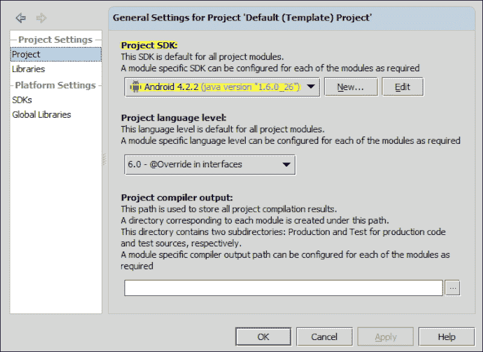

# 第一章。安装和配置安卓工作室

你想熟悉新的和官方的谷歌 IDE 安卓工作室。您想知道这种环境中可用的功能。你想制作你自己的安卓应用程序，你想让这些应用程序对谷歌 Play 商店的其他用户可用。你能轻松做到吗？你怎么能做到这一点？

本章将向您展示如何准备新的安卓工作室安装，以及如何在新环境中迈出第一步。我们将从准备系统安装和下载所需文件开始。我们将看到首次运行 Android Studio 时提示的欢迎屏幕，我们将正确配置 Android **SDK** ( **软件开发工具包** ) ，以便您为创建第一个应用程序做好一切准备。

这些是我们将在本章中讨论的主题:

*   安卓工作室安装
*   第一次运行安卓工作室时的欢迎屏幕
*   安卓软件开发工具包的配置

# 准备安装

开始使用安卓工作室的先决条件是在您的系统中安装 Java。系统还必须能够找到 Java 安装。这可以通过设置名为`JAVA_HOME`的环境变量来实现，该变量必须指向系统中的 **JDK** ( **Java 开发工具包**)文件夹。检查此环境变量，以避免将来在安装 Android Studio 时出现问题。

# 下载安卓工作室

安卓工作室包可以从安卓开发者工具网页下载，网址为:[http://developer.android.com/sdk/installing/studio.html](http://developer.android.com/sdk/installing/studio.html)。

这个包是一个适用于 Windows 系统的 EXE 文件:

[http://dl . Google . com/Android/studio/Android-studio-bundle-130.737825-windows . exe](http://dl.google.com/android/studio/android-studio-bundle-130.737825-windows.exe)。

Mac OS X 系统的 DMG 文件:

[http://dl . Google . com/Android/studio/Android-studio-bundle-130.737825-MAC . dmg](http://dl.google.com/android/studio/android-studio-bundle-130.737825-mac.dmg)。

或者 Linux 系统的 TGZ 文件:

[http://dl . Google . com/Android/studio/Android-studio-bundle-130.737825-Linux . tgz](http://dl.google.com/android/studio/android-studio-bundle-130.737825-linux.tgz)。

## 安装安卓工作室

在 Windows 中，启动 EXE 文件。默认安装目录为\ `Users\<your_user_name>\Appdata\Local\Android\android-studio`。`Appdata`目录通常是隐藏目录。

在 OS X 的苹果电脑上，打开 DMG 文件，将安卓工作室放到你的应用文件夹中。默认安装目录为`/Applications/Android/ Studio.app`。

在 Linux 系统中，解压 TGZ 文件并执行位于`android-studio/bin/`目录的`studio.sh`脚本。

如果您在安装过程中或在以下步骤中有任何问题，您可以通过查看[第 10 章](10.html "Chapter 10. Getting Help")、*获取帮助*来获得关于该问题和已知问题的帮助。

## 第一次运行安卓工作室

执行安卓 Studio，等待加载完成(可能需要几分钟)。第一次执行 Android Studio，会出现欢迎屏幕提示。如下图所示，欢迎屏幕包括一个打开最近项目的部分和一个**快速启动**的部分。我们可以创建一个新项目、导入一个项目、打开一个项目，甚至可以执行更高级的操作，例如从版本控制系统签出或打开配置选项。

让我们来看看**快速启动**部分的各种选项:

*   **新项目...**:创建一个新的安卓项目
*   **导入项目**:通过从您的系统导入现有来源来创建新项目
*   **打开项目**:打开现有项目
*   **从版本控制**签出:通过从版本控制系统导入现有资源来创建新项目
*   **配置**:打开配置菜单
    *   **设置**:打开安卓工作室设置
    *   **插件**:打开安卓工作室的插件管理器
    *   **导入设置**:从文件(`.jar`)导入设置
    *   **导出设置**:将设置导出到文件(`.jar`)
    *   **项目默认值**:打开项目默认值设置菜单
    *   **设置**:打开模板项目设置。这些设置也可以从安卓工作室设置中访问(**配置** | **设置**)
    *   **项目结构**:打开项目和平台设置
    *   **运行配置**:打开运行和调试设置
*   **文档和操作方法**:打开帮助菜单
    *   **阅读帮助**:打开安卓工作室帮助，在线版
    *   **每日提示**:用每日提示打开对话框
    *   **默认按键图参考**:打开包含默认按键图的在线 PDF
    *   **捷脑电视**:打开一个包含视频教程的捷脑网站
    *   **插件开发**:为插件开发人员打开一个包含信息的喷气大脑网站

# 配置安卓软件开发工具包

必须正确配置的基本功能是安卓软件开发工具包。虽然安卓工作室会自动安装最后一个可用的安卓软件开发工具包，所以您应该已经拥有了创建第一个应用程序所需的一切，但是检查它并了解我们如何更改它是很重要的。

在安卓工作室欢迎屏幕中，导航至**配置** | **项目默认值** | **项目结构**。在**平台设置**中，点击 **SDKs** 。将显示已安装的软件开发工具包列表，您应该至少有一个安卓软件开发工具包在列表中。在**项目设置**中，点击**项目**打开项目默认模板的通用设置。您应该已经选择了**项目软件开发工具包**，如下图所示。这个选择的 SDK 是默认的，将在我们的安卓项目中使用，但即使如此，我们也可以在以后为需要特殊设置的特定项目更改它。

如果你没有在安卓工作室配置任何安卓软件开发工具包，那么我们必须手动添加它。

要完成此任务，在**平台设置** | **软件开发工具包**中，单击绿色加号按钮将安卓软件开发工具包添加到列表中，然后选择软件开发工具包的主目录。通过导航到您的安卓工作室安装目录来检查您的系统中是否有它。你应该会找到一个名为`sdk`的文件夹，里面包含了安卓 SDK 及其工具。安卓工作室安装目录可能在一个隐藏的文件夹中，所以点击下面截图中突出显示的按钮来**显示隐藏的文件和目录**:

如果您想使用不同于 Android Studio 中包含的另一个 Android SDK，请选择它。例如，如果您之前在 Eclipse 中使用了 **ADT** ( **Android 开发工具** ) 插件，那么您的系统中已经安装了 Android SDK。你也可以把它们都加进去。

添加完软件开发工具包后，它将出现在列表中，您可以从项目设置中选择默认值。

### 类型

**下载示例代码**

您可以从您在[http://www.packtpub.com](http://www.packtpub.com)的账户中下载您购买的所有 Packt 书籍的示例代码文件。如果您在其他地方购买了这本书，您可以访问[http://www.packtpub.com/support](http://www.packtpub.com/support)并注册，以便将文件直接通过电子邮件发送给您。

# 总结

我们已经成功地为安卓工作室准备了系统，并安装了我们的安卓工作室实例。我们第一次运行工作室，现在我们知道了欢迎屏幕中可用的选项。我们还学习了如何配置我们的安卓软件开发工具包，以及如何手动安装它，以防您想要使用不同的版本。完成这些任务后，您的系统将运行安卓工作室，并被配置为创建您的第一个项目。

在下一章中，我们将学习项目的概念，以及它如何包含应用程序所需的一切，从类到库。我们将创建第一个项目，并讨论向导中可用的不同类型的活动。