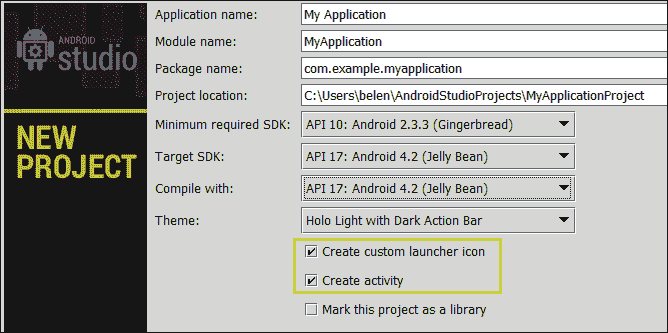
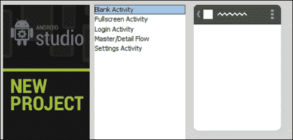
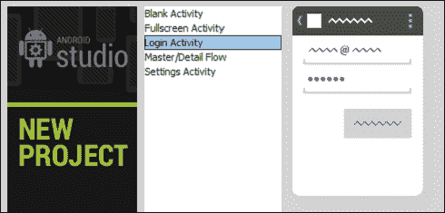
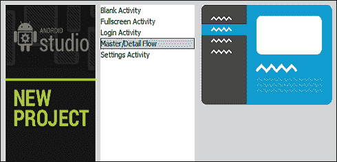
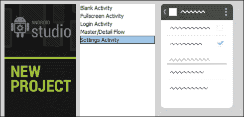

# 二、启动项目

你刚刚安装了Android Studio，现在你想熟悉它的功能。创建项目时，您需要了解必要的字段。您想知道如何将图标添加到您的应用程序中，并将其与项目相关联，您想知道如何创建主活动以及选择哪种类型的活动。如何使用 Android Studio 实现这一点？

本章的目标是创建一个新项目，其基本内容应该从这个项目开始。我们将使用Android Studio向导来创建项目，并浏览项目配置字段。我们将为我们的应用程序选择一个启动图标，我们将浏览向导中可用的不同类型的活动，以选择作为我们项目的主要活动。

这些是我们将在本章中讨论的主题:

*   创建新项目
*   创建您的应用程序图标
*   选择作为主要活动的活动类型

# 创建新项目

要创建新项目，从欢迎屏幕点击**新项目**选项。如果您不在欢迎屏幕中，则导航至**文件** | **新项目**。将打开新建项目向导。

向导的第一步足以创建一个项目，但是如果您选中**创建自定义启动器图标**选项，向导将增加第二步，如果您选中**创建活动**选项，将增加两个额外的步骤。检查两个。

新项目向导中将显示的字段如下:

*   **应用名称**:它是 Google Play 中显示的名称，也是用户看到的名称。
*   **模块名称**:它是Android Studio唯一使用的名称。
*   **软件包名称**:您的应用程序的唯一标识符，通常采用`com.company_name.app_name`或`reverse_company_domain.app_name`形式。这种形式降低了与其他应用程序发生名称冲突的风险。
*   **项目位置**:您系统中保存项目的目录是。
*   **最低要求的 SDK** :是你的应用支持的最低 SDK。带有以前的软件开发工具包的设备将无法安装您的应用程序。尝试在支持的设备和可用功能之间达成平衡。如果您的应用程序不需要最新软件开发工具包中发布的特定功能，那么您可以选择较旧的**应用编程接口** ( **应用编程接口**)。谷歌最近发布的关于平台分布的仪表板显示，95.5%的设备使用安卓 2.3 或更高版本。如果你选择安卓 2.2，那么这个百分比会上升到 98.5%。官方安卓仪表盘可在[http://developer.android.com/about/dashboards/index.html](http://developer.android.com/about/dashboards/index.html)获得。
*   **目标 SDK** :它是你针对你的应用测试过的最高 SDK。您应该将此值更新到最新版本。
*   **用**编译:它是用来编译你的应用程序的 SDK。这个软件开发工具包是你在Android Studio安装和配置的软件开发工具包之一。
*   **主题**:为你的应用选择一个默认的用户界面主题。

选项**将此项目标记为库**用于将项目创建为库模块。库可以在其他项目中引用，以共享其功能。不要选中此选项。

考虑上一张截图中显示的字段。选择 API 10 作为最小 SDK，API 17 作为目标 SDK。在**用**编译字段中，选择您安装的最高应用编程接口版本(应用编程接口 17)。点击**下一步**。

# 创建自定义启动器图标

这一步允许你创建你的应用程序图标，如果你在第一步选中**创建自定义启动器图标**选项，将会显示。

安卓项目存储多种图像分辨率，以便在应用程序执行时选择最适合设备屏幕分辨率的图像。为了确保图标将在每个设备中正确显示，请检查`XXHDPI`图像是否未像素化。

有三个选项可以创建您的应用程序图标、图像、一个提供的剪贴画或文本。最常见的是一个形象。您可以选择自己的图像文件来创建图标，并调整一些参数，如填充、形状或背景颜色。选择**图像**选项，保留默认图像和选项不变。点击**下一步**。

# 选择你的活动类型

此步骤允许您创建应用程序的主要活动。如果在第一步中选择了**创建活动**选项，将会显示该步骤。

可以选择几种类型的活动:

*   **Blank Activity**: This creates a blank activity with an action bar. The action bar includes a title and an options menu. The navigation type can be a tabbed user interface (tabs fixed or scrollable), horizontal swipe, or a drop-down menu. See more about action bars at [http://developer.android.com/guide/topics/ui/actionbar.html](http://developer.android.com/guide/topics/ui/actionbar.html).

    

*   **Fullscreen Activity**: This template hides the system user interface (such as the notification bar) in a full-screen view. The full-screen mode is alternated with an action bar that shows up when the user touches the device screen.

    

*   **Login activity**: This template creates its view as a login screen allowing the users to log in or register with an e-mail and password.

    

*   **Master/Detail Flow**: This template splits the screen into two sections: a left menu and the detail of the selected item on the right. On a smaller screen, just one section is displayed, but on a bigger screen, both sections are displayed at the same time.

    

*   **Settings Activity**: This creates a preference activity with a list of settings.

    

选择**空白活动**，点击**下一步**。在最后一步中，我们可以为活动及其相关布局命名。保留默认值，选择无导航类型，点击**完成**。

# 总结

我们使用Android Studio向导创建了我们的第一个项目，并填写了配置字段。我们为我们的应用程序选择了启动图标，并确保它能够以任何分辨率正常显示。我们经历了不同种类的活动。

在下一章中，我们将介绍Android Studio结构的不同元素。我们将找到可以创建新类、添加和访问库的地方，以及如何配置项目。