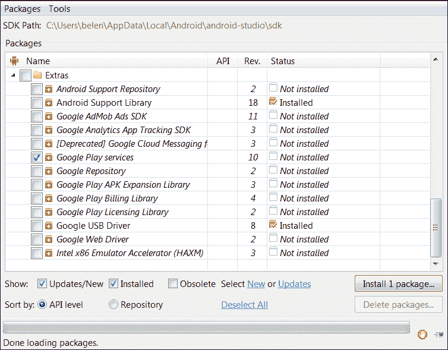

# 六、谷歌游戏服务

既然您已经熟悉了组件在布局中的使用，您应该开始考虑额外的功能。谷歌游戏服务为您提供功能，以吸引使用谷歌功能(如谷歌地图、谷歌+等)的用户。如何轻松地将这些功能添加到您的应用程序中？有哪些功能？使用谷歌游戏服务的安卓版本要求是什么？

本章重点介绍使用Android Studio创建、集成和使用谷歌游戏服务。我们将了解哪些谷歌服务可用。我们还将了解标准授权应用编程接口，以便有一种安全的方式来授予和接收对谷歌游戏服务的访问令牌。我们还将了解这些服务的局限性以及使用它们的好处。

这些是我们将在本章中讨论的主题:

*   现有的谷歌服务
*   从集成开发环境添加谷歌游戏服务
*   在你的应用程序中集成谷歌游戏服务
*   了解自动更新
*   在你的应用中使用谷歌服务

# 谷歌游戏服务如何工作

当谷歌在 Google I/O 2012 上预览 Google Play 服务时，它说平台([https://developers.google.com/events/io/2012/](https://developers.google.com/events/io/2012/)...

> ...由运行在设备上的服务组件和随应用程序打包的瘦客户端库组成。

这意味着谷歌游戏服务的工作得益于两个主要组件:谷歌游戏服务客户端库和谷歌游戏服务 APK。

*   **客户端库**:谷歌游戏服务客户端库包括你的应用使用的每个谷歌服务的界面。当你打包你的应用程序时，该库被包括在内，并且它允许你的用户使用他们的凭证授权该应用程序访问这些服务。谷歌不时升级客户端库，增加新的功能和服务。您可以通过更新应用程序来升级应用程序中的库，但如果您不包含任何新功能，则没有必要。
*   **谷歌游戏服务 APK** :谷歌游戏服务**安卓套装** ( **APK** )在安卓操作系统中作为后台服务运行。使用客户端库，您的应用程序访问该服务，该服务是在运行时执行操作的。APK 不能保证安装在所有设备上。如果设备没有安装，APK 可以在谷歌 Play 商店买到。

通过这种方式，谷歌设法将其服务的运行时与您作为开发人员所做的实现分开，因此您不需要每次升级谷歌游戏服务时都升级您的应用程序。

虽然谷歌游戏服务不包含在安卓平台本身中，但大多数基于安卓的设备都支持它们。任何运行安卓 2.2 或更新版本的安卓设备都可以安装任何使用谷歌游戏服务的应用程序。

# 可用服务

谷歌游戏服务被认为可以轻松添加更多功能，以吸引各种设备上的用户，同时使用谷歌支持的众所周知的功能。使用这些服务，您可以添加新的收入来源，管理应用程序的分布，访问统计数据并了解应用程序的用户习惯，并通过易于实现的谷歌功能(如地图或谷歌的社交网络 Google+)来改进您的应用程序。服务解释如下:

*   **游戏**:使用这款 Google Play 游戏服务，可以用更社交的体验来提升你的游戏。
*   **位置**:集成位置API，可以让你的应用程序位置感知。
*   **谷歌地图**:谷歌地图 API 允许您在应用程序中使用谷歌提供的地图，并进行自定义。
*   **谷歌+** :安卓使用谷歌+平台，可以认证你的应用的用户。一旦通过身份验证，您还可以访问他们的公共档案和社交图。
*   **应用内计费**:使用谷歌 Play 应用内计费可以销售应用的数字内容。您可以使用该服务销售一次性付费或临时订阅优质服务和功能。
*   **云消息** : **安卓系统的谷歌云消息** ( **GCM** )允许你在基于安卓系统的设备上运行的应用程序和你的服务器之间交换数据。
*   **全景图**:它可以让用户看到 360 度全景图。

# 向Android Studio添加谷歌游戏服务

首先我们需要知道的是我们需要给我们的Android Studio增加什么。我们刚刚了解到 APK 在谷歌 Play 商店可用，它是服务的实际运行时间。作为开发人员，我们只需要在调试应用程序时在测试设备中提供这个包。我们需要添加到Android Studio的是谷歌游戏服务客户端库。

该库通过安卓 SDK 管理器(软件开发工具包管理器)分发，将在[第 7 章](07.html "Chapter 7. Tools")、*工具*中详细说明。打开它，导航到**工具** | **安卓** | **软件开发工具包管理器**。我们可以在**附加文件夹**下的软件包列表中找到谷歌游戏服务。选择**谷歌播放服务**复选框，点击**安装 1 包...**按钮。



执行这些操作会将库项目添加到我们的 SDK 安装文件夹`/sdk/extras/google/google_play_services/`的位置。您可以通过将鼠标悬停在软件开发工具包管理器中的谷歌游戏服务行上并查看工具提示来检查确切的路径。


导航到库文件夹以检查其内容。`samples`文件夹包含认证服务(`auth/`)、谷歌地图 v2 服务(`maps/`)、谷歌+服务(`plus/`)和全景服务(`panorama/`)的示例项目。包含谷歌游戏服务库项目的文件夹是`libproject/`。在这个项目文件夹中是放置`google-play-services.jar`文件的地方，`libproject/google-play-services_lib/libs/ google-play-services.jar`。

只要将这个 JAR 文件拖到`libs/`文件夹中，就可以将其添加到您的项目中。完成后，选择 JAR 文件并按下鼠标右键。选择**添加为库**选项。在**创建库**对话框中，选择项目库级别，选择您的应用模块，点击**确定**。

你现在在你的项目库中`libs/`文件夹下有`google-play-services.jar`文件，你现在可以从你的代码中引用谷歌游戏服务。

最后，您需要将该库添加到 Gradle 的构建文件中。为此，只需编辑文件`MyApplication/build.gradle`，并在`dependencies`部分添加以下行:

```java
compile files('libs/google-play-services.jar')
```

# 谷歌地图安卓 API v2

谷歌地图安卓应用编程接口允许你的应用程序的用户探索谷歌服务中可用的地图。新的地图版本 2 提供了更多功能，例如三维地图、室内和卫星地图、使用基于矢量的技术的高效缓存和绘制，以及通过地图的动画过渡。

让我们导入示例项目来检查最重要的类。点击**文件** | **导入项目**。在您的 SDK 安装文件夹中搜索示例项目，并选择项目根目录，/ `google_play_services/samples/maps/`。在下一个对话框中，选中**从现有来源创建项目**选项。在后续对话框中继续点击**下一步**，最后点击**完成**按钮，在新窗口中打开样本项目。现在，我们已经在Android Studio的一个新窗口中加载了谷歌游戏服务项目和地图示例项目。

打开`BasicMapActivity`类，查看一个使用谷歌地图的简单例子。您可以在`src/`文件夹内的地图项目中找到该活动。软件包`com.google.android.gms.maps`包含谷歌地图安卓应用编程接口类。

这个活动声明了一个名为`mMap`的私有`GoogleMap`对象。**谷歌地图类**是应用编程接口的主要类，是所有与地图相关的方法的入口点。您可以更改地图的主题颜色和图标，以匹配您的应用程序风格。您也可以通过向地图添加标记来自定义地图。要添加一个简单的标记，可以使用`GoogleMap`类的`addMarker`方法。查看`BasicMapActivity`类中的`setUpMap`方法，查看以下代码示例:

```java
mMap.addMarker(new MarkerOptions().position(new LatLng(0, 0)).title("Marker"));
```

方法`addMarker`有一个`MarkerOptions`对象作为参数。使用方法`position`我们在地图上指示标记的坐标，使用方法`title`我们可以添加一个自定义字符串来显示在标记上。

要将地图添加到布局中，我们可以使用`MapView`类，它扩展了类`View`并显示一张地图。但是在应用程序中放置地图最简单的方法是使用`MapFragment`对象。片段代表用户界面或行为的一部分，可以嵌入到活动中。片段是可重用的模块。

**地图片段类** 包装地图视图，以自动处理组件的必要生命周期需求。它扩展了类`Fragment`，因此可以通过添加以下 XML 代码将其添加到布局中:

```java
<fragment
class="com.google.android.gms.maps.MapFragment"
android:layout_width="match_parent"
android:layout_height="match_parent" />
```

要查看前面代码的示例，请打开与`BasicMapActivity`类关联的布局；这是`/res/layout/`文件夹中的`basic_demo.xml`文件。

最后，我们需要代码从片段中获取`GoogleMap`对象。我们可以用`findFragmentById`的方法找到地图`Fragment`，然后用`getMap`的方法从`Fragment`得到地图。

```java
mMap = ((MapFragment) getFragmentManager().findFragmentById(R.Id.map).getMap();
```

这个代码在`BasicMapActivity`类中的例子是在`setUpMapIfNeeded`方法中。

最后一个重要的类是`GoogleMapOptions`类，它定义了地图的配置。您也可以通过编辑布局 XML 代码来修改地图的初始状态。以下是一些有趣的选项:

*   `mapType`:指定地图的类型。其值可以是`none`、`normal`、`hybrid`、`satellite,`、`terrain`。
*   `uiCompass`:定义指南针控制是启用还是禁用。
*   `uiZoomControls`:定义缩放控制是启用还是禁用。
*   `cameraTargetLat``cameraTargetLong`:指定初始摄像头位置。

# 谷歌+安卓平台

使用谷歌+安卓平台，开发者可以用他们在谷歌+上使用的相同凭证来验证用户。您还可以使用公共个人资料和社交图来欢迎用户的名字、显示他们的图片或与朋友联系。

包`com.google.android.gms.plus`包含安卓类的谷歌+平台。导入 Google+示例项目，了解最重要的类。谷歌+示例项目可以在/ `google_play_services/samples/plus/`中的谷歌游戏服务安装文件夹中找到。

*   `PlusClient`和`PlusClient.Builder` : `PlusClient`是原料药的主类。它是谷歌+整合的切入点。`PlusClient.Builder`是一个构建器，用于配置`PlusClient`对象，以便与谷歌+应用编程接口正确通信。
*   `PlusOneButton`: The class to implement a +1 button to recommend a URL on Google+. Add it to a layout using the following code:

    ```java
    <com.google.android.gms.plus.PlusOneButton
    android:layout_width="wrap_content"
    android:layout_height="wrap_content"
    plus:size="standard" />
    ```

    可用尺寸有小、中、高或标准。

    关于此功能的示例代码可以在示例项目中找到，在`src/`文件夹中的类及其相关布局中，`res/layout/`文件夹中的`plus_one_activity.xml`中。

*   `PlusShare`:在 Google+上分享的帖子中包含资源。关于共享资源的示例代码可以在`src/`文件夹中的`ShareActivity`类及其相关布局中找到，在`res/layout/`文件夹中的`share_activity.xml`中找到。

首先，一个`PlusClient`对象应该在你的活动类的`onCreate`方法中被实例化，以调用它的异步方法`connect`，这将把客户端连接到 Google+服务。当应用程序使用`PlusClient`实例完成时，它应该调用终止连接的方法`disconnect,`，并且也应该总是从活动的`onStop`方法调用。

# 谷歌游戏应用内计费 v3

应用内计费 v3 允许您销售应用中的虚拟内容。该虚拟内容可以一次性付费，也可以通过订阅或收费进行定时优惠。使用此服务，您可以允许用户为额外功能付费并访问优质内容。

在谷歌 Play 商店发布的任何应用都可以实现应用内计费应用编程接口，因为它只需要与发布应用相同的帐户:谷歌游戏开发者控制台帐户和谷歌钱包商家帐户。

使用谷歌 Play 开发者控制台，您可以定义您的产品，包括类型、识别码(SKU)、价格、描述等。一旦定义了产品，就可以从该应用程序访问这些内容。当用户想要购买此内容时，您的应用内计费应用和谷歌游戏应用之间会发生以下购买流程:

1.  您的应用程序调用`isBillingSupported()`到 Google Play 检查您正在使用的应用内计费版本是否受支持。
2.  如果支持应用内计费应用编程接口版本，您可以使用`getPurchases()` 获取所购商品的单品列表。该列表将在一个`Bundle`对象中返回。
3.  您可能想通知您的用户可用的应用内购买。为此，您的应用程序可能会发送一个`getSkuDetails()`请求，这将导致一个列表，其中包含产品的价格、标题、描述以及该项目的更多可用信息。

# 谷歌云消息

安卓的 GCM 允许通过使用异步消息在您的服务器和应用程序之间进行通信。您不必担心处理这种通信的低级方面，如排队和消息构造。使用此服务，您可以轻松地为应用程序实现通知系统。

使用 GCM 时，您有两个选项:

*   服务器可以通知您的应用程序有新的数据可以从服务器获取，然后应用程序获取这些数据。
*   服务器可以在消息中直接发送数据。消息有效负载最多可达 4 KB。这允许您的应用程序立即访问数据并采取相应的行动。

为了发送或接收消息，您需要获得注册标识。该注册标识标识设备和应用程序的组合。要允许您的应用程序使用 GCM 服务，您需要在项目的清单文件中添加以下行:

```java
<uses-permission android:name="com.google.android.c2dm.permission.RECEIVE"/>
```

你需要使用的主类是`GoogleCloudMessaging`。该类在包装`com.google.android.gms.gcm`中提供。

# 总结

到本章结束时，我们知道了可用的谷歌游戏服务。我们学习了如何通过谷歌游戏服务的客户端库和安卓软件包来改进我们的应用程序。读者应该已经使用软件开发工具包管理器在Android Studio成功安装了谷歌游戏服务客户端库，并且应该能够使用库功能构建应用程序。我们还学习了一些关于谷歌地图 v2、谷歌+安卓认证平台、谷歌游戏应用内计费和 GCM 的技巧。

在下一章中，我们将了解Android Studio中一些有用的工具。我们将再次详细使用软件开发工具包管理器来安装不同的软件包。我们还将了解 AVD 管理器，以便能够使用不同的虚拟设备来测试我们的应用程序。我们将使用 Javadoc 实用程序为我们的项目生成 Javadoc 文档，我们将了解Android Studio中可用的版本控制系统。