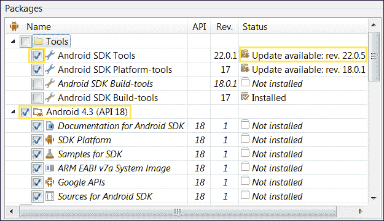
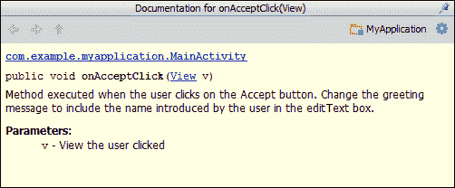
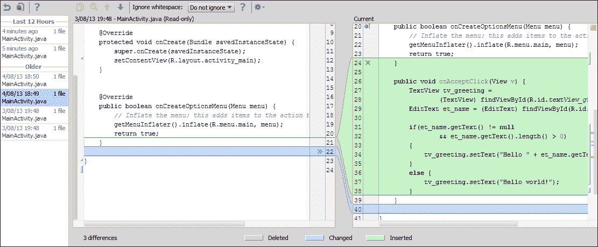

# 七、工具

在前一章中，我们已经了解了谷歌提供的有用服务，开发者可以使用这些服务来改进他们的应用程序。现在，我们将了解Android Studio中可用的工具，这些工具让我们作为开发人员的生活更加轻松。你有没有想过如何管理安卓平台？你想把你的项目清楚地记录下来吗？你是作为一个开发团队工作，需要一个与 Android Studio 集成的版本控制管理器吗？

本章展示了 Android Studio 中提供的最重要的附加工具:Android SDK 工具、Javadoc 和版本控制集成。首先，我们将了解Android Studio中可用的软件开发工具包管理器，从中我们将能够检查、更新和安装我们项目的不同组件。接下来，我们将查看安卓虚拟设备管理器，在这里我们可以编辑我们将在其中测试项目的虚拟设备。我们还将了解如何使用 Javadoc 工具获得完整的文档，以及如何使用Android Studio中可用的系统进行版本控制。

这些是我们将在本章中讨论的主题:

*   软件开发工具包管理器
*   AVD 经理
*   Javadoc
*   版本控制

# 软件开发工具包管理器

**软件开发工具包(SDK)管理器**是一个集成在Android Studio中的安卓工具，用于控制我们的安卓 SDK 安装。从这个工具中，我们可以检查安装在我们系统中的安卓平台，更新它们，安装新平台，或者安装一些其他组件，如谷歌游戏服务或安卓支持库。

从Android Studio打开软件开发工具包管理器，导航至菜单**工具** | **安卓** | **软件开发工具包管理器**。您也可以单击工具栏上的快捷方式。在管理器的顶部，显示了在Android Studio中配置的软件开发工具包路径。

软件开发工具包管理器显示具有以下属性的可用包列表:

*   **名称**:集合了一些相关包的包或容器的名称。
*   **原料药**:添加该包的原料药编号。
*   **版本**:包版本号或版本号。
*   **状态**:与您的系统相关的包的状态。状态可以是**未安装**、**已安装**、**更新可用**、**不兼容**或**过时**。

可以使用列表下的复选框根据包的状态对包进行筛选，并且可以根据 API 级别或下载到的存储库对包进行排序。这些选项也可以从顶部菜单**包**中访问。

从菜单**工具** | **管理加载项站点**我们可以查看提供加载项和额外软件包的官方站点列表。在**用户定义的站点**菜单中，我们可以添加我们的自定义外部站点。

软件包名称旁边有一个复选框，用于选择我们要安装、更新或删除的软件包。如下图所示，默认情况下，系统中已安装但有更新的软件包会被选中。如果有新的安卓平台版本没有安装，它的包也会被检查。



要安装或更新的选定软件包的总数显示在对话框底部按钮的文本中。它下面的按钮指示要删除的选定包的总数。

检查需要更新的软件包，如果没有安装，请检查最后一个安卓平台，并检查我们的应用程序支持的最低平台安卓 2.3.3 (API 10)，以便能够在使用此版本的虚拟设备中测试我们的应用程序。点击**安装**按钮。

在下一个对话框中，我们必须接受包许可证。勾选**接受许可**单选按钮，点击**安装**按钮。软件包的安装或更新将开始显示其进度。首先，管理器下载软件包，然后解压，最后安装。

请记得不时检查软件开发工具包管理器，以检查更新。

# 安卓虚拟设备管理器

**安卓虚拟设备管理器** ( **AVD 管理器**)是Android Studio集成的安卓工具，用于管理将在安卓模拟器中执行的安卓虚拟设备。

从Android Studio打开 AVD 管理器，导航至菜单**工具** | **安卓** | **AVD 管理器**。您也可以单击工具栏上的快捷方式。AVD 管理器在默认选项卡**安卓虚拟设备**中显示现有虚拟设备的列表。因为我们没有创建任何虚拟设备，所以最初列表应该是空的。要创建我们的第一个虚拟设备，单击**新建**按钮打开配置对话框:

*   **AVD 名称**:虚拟设备的名称。
*   **设备**:选择一个可用的设备配置。这些配置是我们在布局编辑器预览中测试的配置。选择 Nexus 4 设备，在对话框中加载其参数。
*   **目标**:选择设备安卓平台。我们必须使用应用程序支持的最小平台创建一个虚拟设备，并使用应用程序的目标平台创建另一个虚拟设备。这两个平台都是在我们创建项目时配置的。对于第一个虚拟设备，选择目标平台，Android 4.2.2 (API 17)。
*   **CPU/ABI** :选择设备架构。该字段的值是在我们选择目标平台时设置的。每个平台都有自己的体系结构，所以如果我们没有安装它，将显示以下消息:**没有为这个目标**安装系统映像。要解决这个问题，请打开软件开发工具包管理器，搜索目标平台的架构之一，ARM EABI v7a 系统映像或英特尔 x86 凌动系统映像。
*   **键盘**:选择仿真器中是否显示硬件键盘。检查一下。
*   **皮肤**:选择仿真器中是否显示附加硬件控件。检查一下。
*   **前置摄像头**:选择模拟器是否有前置摄像头。通过使用计算机上的网络摄像头，可以模拟或模拟摄像头。选择**无**。
*   **后置摄像头**:选择模拟器是否有后置摄像头。选择**无**。
*   **内存选项**:选择虚拟设备的内存参数。保留默认值，除非显示警告消息；在这种情况下，请遵循消息的说明。例如，为**内存**选择 256，为**虚拟机堆**选择 64。
*   **内部存储**:选择虚拟设备存储大小，例如:200 MiB。
*   **SD 卡**:选择 SD 卡的大小或选择一个文件作为 SD 卡。此参数是可选的。
*   **仿真选项**:**快照**选项保存仿真器的状态，以便下次加载更快。检查一下。**使用主机图形处理器**选项试图加速图形处理器硬件以更快地运行仿真器。

给虚拟设备取一个有意义的名字，这样就可以很容易的认出了，就像`AVD_nexus4_api17`一样。点击**确定**按钮。

新的虚拟设备现在列在 AVD 管理器中，带有绿色的勾号图标，表示它是有效的。这些图标指示虚拟设备的状态:如果它有效，如果它无法加载，或者如果它的状态是可修复的。图标图例解释在管理器窗口的底部。选择最近创建的虚拟设备以启用其余操作:

*   **编辑**:编辑虚拟设备配置。
*   **删除**:删除虚拟设备。
*   **修复**:如果虚拟设备加载失败但可以修复，则选项可用。此操作尝试修复虚拟设备的错误状态。
*   **详情**:打开一个对话框，详细说明虚拟设备特性。
*   **启动**:运行虚拟设备。

点击**开始**按钮打开启动对话框。检查与快照相关的选项，点击**启动**按钮。模拟器将被打开，如下图所示。等到它完全加载后，您就可以尝试了。


从 AVD 管理器我们还可以配置设备定义。设备定义用于布局预览，是虚拟设备的基础。打开列出现有定义的**设备定义**标签。我们可以使用**新设备**按钮创建新设备定义，我们可以使用**克隆**按钮克隆现有设备轻松创建新设备，我们可以使用**删除**按钮删除它们，或者我们可以使用**创建 AVD** 按钮基于设备定义创建虚拟设备。

点击**新建设备**按钮检查现有配置参数。定义设备的最重要参数是:

*   **名称**:设备名称。
*   **屏幕尺寸(英寸)**:屏幕尺寸(英寸)。该值决定了设备的大小类别。输入`4.0`值，注意**尺寸**值(右侧)如何为**正常**。现在输入`7.0`的值，并且**尺寸**字段将其值更改为**大尺寸**。该参数以及屏幕分辨率也决定了密度类别。
*   **分辨率(px)** :以像素为单位的屏幕分辨率。该值决定了设备的密度类别。在屏幕尺寸为 4.0 英寸的情况下，键入一个值`768 x 1280`，并注意密度值如何为 **xhdpi** 。将屏幕尺寸更改为`6.0`英寸，密度值更改为 **hdpi** 。现在将分辨率更改为`480 x 800`，密度值为 **mdpi** 。
*   **传感器**:设备中可用的传感器:加速度计、全球定位系统、陀螺仪或接近传感器。
*   **RAM** :设备的 RAM 内存大小。
*   **按钮**:指示设备的主页、后退或菜单按钮是通过软件还是硬件可用。
*   **设备状态**:检查允许的状态。

创建一个新的设备，屏幕尺寸为 4.7 英寸，分辨率为 800 x 1280，内存值为 200 MiB，启用软件按钮，并同时启用纵向和横向状态。将其命名为`My Device`。点击**创建设备**按钮。

AVD 管理器现在在设备列表中显示我们的设备定义。另外，在Android Studio，用图形编辑器打开主布局，点击设备列表。如下面的截图所示，我们的自定义设备定义出现，我们可以选择它来预览布局:


# 生成 Javadoc

Javadoc 是一个以 HTML 格式记录 Java 代码的实用程序。Javadoc 文档是从添加到 Java 类或方法的注释和标签中生成的。注释以`/**`字符串开始，以`*/`结束。在这些注释里面，可以添加一些标签，比如`@param` 来描述一个方法参数，`@throws` 来描述该方法可以抛出的异常，或者`@version` 来指示类或者方法的版本。

Javadoc 的使用集成在 Android Studio 中。我们可以在键入 Javadoc 注释时使用代码完成，文档将出现在代码元素的弹出工具提示中。

为了生成一个完整的 Javadoc，我们必须编写关于我们的类和方法的 Javadoc 注释。打开我们项目的主活动，将 Javadoc 注释添加到我们在[第 5 章](05.html "Chapter 5. Creating User Interfaces")、*创建用户界面*中创建的方法`onAcceptClick`中。将插入符号放在方法声明前的行上，键入`/**,`并按*进入*。Javadoc 注释被自动插入，其中包含方法声明中的可用信息:参数和返回类型。在这种情况下，没有返回类型。

文档注释的第一行是方法描述。然后，解释每个参数和返回类型。该方法现在应该如下所示:

```java
/**
 * Method executed when the user clicks on the Accept button.
 * Change the greeting message to include the name introduced by the user in the editText box.
 *
 * @param v View the user clicked
 */
public void onAcceptClick(View v) { ... }
```

关于该方法的信息现在将作为文档显示在出现的对话框中。下面的屏幕截图显示了应该出现在方法上的对话框:



要生成 Javadoc 文档，请在顶部菜单上导航至**工具** | **生成 Javadoc** 。将打开一个显示 Javadoc 选项的对话框。我们可以选择范围、输出目录、包含元素的可见性，或者我们是否想要创建层次树、导航栏和索引。

检查**当前文件**作为范围，只生成我们主要活动的文档。从系统中选择一个输出目录。将能见度降低至公共，点击**确定**按钮。在输出目录中已经创建了 HTML 格式的 Javadoc 文档，`index.html`文件是起点。浏览文档以打开`MainActivity`类。请注意，可见性受到保护的`onCreate`方法没有出现，因为我们将生成的 Javadoc 的可见性降低到了公共元素。

# 版本控制系统

Android Studio集成了一些版本控制系统:Git、Mercurial 或 Subversion。要启用版本控制集成，请在顶部菜单上导航至 **VCS** | **启用版本控制集成**并选择系统类型。现在 **VCS** 菜单又增加了一些选项。

第一步是从版本控制系统中进行检查。从版本控制导航到 **VCS** | **签出，点击添加图标，并键入存储库网址:**

*   要更新整个项目，导航至选项 **VCS** | **更新项目**
*   要提交项目的所有变更，导航至选项 **VCS** | **提交变更**
*   要清理项目，导航至选项 **VCS** | **清理项目**

版本控制操作也可以应用于单个文件。用鼠标右键点击项目的任意文件，选择 **Subversion** 部分。从出现的菜单中，我们可以将文件添加到存储库中，将其添加到忽略列表中，浏览更改，恢复更改或锁定它。

控制文件版本的一个更简单的方法是使用本地历史。在编辑器中打开主活动文件，导航至 **VCS** | **本地历史** | **显示历史**。将打开文件历史对话框。在对话框的左侧，列出了文件的可用版本。选择一个旧版本，将其与文件的当前版本进行比较。旧版本和当前版本之间的差异会突出显示。灰色用于指示删除的代码块，蓝色用于突出显示已更改的文本，绿色用于指示新插入的文本。从顶部图标，我们可以恢复更改并配置空白空间可视化。下一个截图显示了我们主要活动的两个版本之间的比较。我们可以观察我们最近添加的方法`onAcceptClick`方法是如何用绿色突出显示的。



我们也可以只检查特定代码块的本地历史。关闭对话框，从编辑器中选择一些代码行，导航至 **VCS** | **本地历史** | **显示选择历史**。将打开相同的历史对话框，但这次它显示所选代码的版本。

# 总结

到本章结束时，我们应该已经知道如何使用安卓软件开发工具包管理器工具来安装、更新或检查我们项目的可用平台。我们应该能够创建一个新的安卓虚拟设备，并在认为必要的时候对其进行编辑。使用 Javadoc 创建我们项目的完整文档应该不再是一个问题，我们也应该能够使用集成在 Android 工作室中的版本控制系统。

在下一章中，我们将继续使用Android Studio集成的功能。在这种情况下，我们将学习我们项目的模拟以及如何调试它。我们将了解调试器、控制台或 LogCat 工具。我们还将了解更多高级调试工具，如达尔维克调试监控服务器(DDMS)。我们将深入研究这个监视器服务器，浏览它的每一个可用的实用程序。