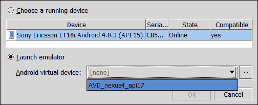
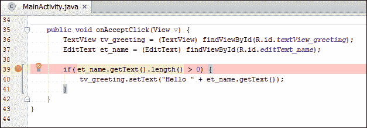
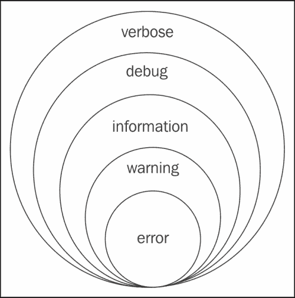
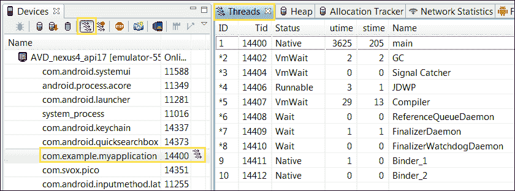
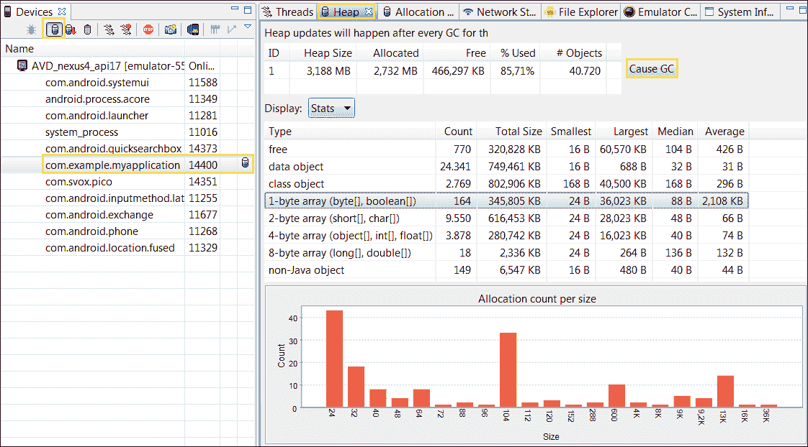
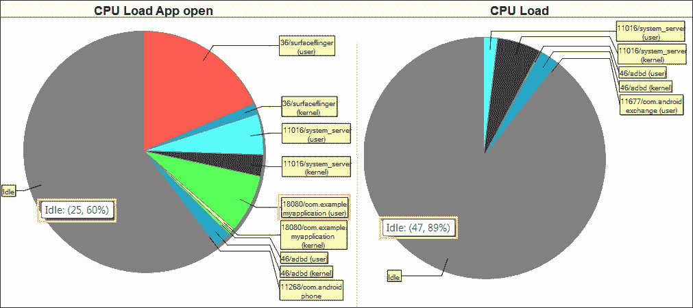

# 八、排除故障

调试环境是集成开发环境最重要的特性之一。使用调试工具可以轻松优化应用程序并提高其性能。在 Android Studio 中编程时，是否要使用这些调试工具之一？Android Studio包括**达尔维克调试监控服务器** ( **DDMS** )调试工具。

在本章中，我们将首先学习运行和调试选项，以及如何在我们在前一章中学习创建的一个安卓虚拟设备中模拟我们的应用程序。我们将深入了解调试器选项卡、控制台选项卡和 LogCat 选项卡。我们还将学习如何使用调试器使用断点，以及如何在这些断点中停止运行我们的应用程序。本章最后，我们将介绍 Android Studio DDMS 中包含的高级调试工具中可用的每个选项卡的信息。

这些是我们将在本章中讨论的主题:

*   排除故障
*   日志猫
*   DDMS 工具公司

# 运行调试

安卓应用程序可以在使用 USB 连接的真实设备中或使用仿真器的虚拟设备中从Android Studio运行。虚拟设备使得在不同类型的硬件和软件配置中测试我们的应用成为可能。在本章中，我们使用模拟器来运行和调试我们的应用程序，因为它简单而灵活。

要直接运行应用程序，请导航至菜单**运行** | **运行“我的应用程序”**。您也可以点击工具栏上的播放图标按钮。要调试应用程序，请导航至菜单**运行** | **调试“我的应用程序”**或单击工具栏上的错误图标。

当我们选择调试选项时，会打开一个选择设备的对话框。第一种选择是选择运行设备；列出了可用的连接设备，无论是真实设备还是虚拟设备。第二个选项是启动模拟器的新实例；列出了可用的虚拟设备。勾选**启动模拟器**选项，选择[第七章](07.html "Chapter 7. Tools")、*工具*中创建的虚拟设备。点击**确定**。模拟器将被启动。下次运行或调试应用程序时，仿真器已经在运行了，所以我们会选择第一个选项(**选择一个运行设备**)。



调试时，Android Studio底部有三个选项卡:**调试器**、**控制台**、**日志猫**。

**控制台** 显示模拟器启动时发生的事件。打开它检查消息，并检查模拟器和应用程序是否正确执行。应该出现的操作有:

*   `Waiting for device`:模拟器启动时的起点。
*   `Uploading file`:应用打包存储在设备中。
*   `Installing`:应用程序正在设备中安装。安装后，应打印成功消息。
*   `Launching application`:应用开始执行。
*   `Waiting for process`:应用程序现在应该正在运行，调试系统尝试连接到设备中的应用程序进程。

在前面的步骤成功后，应用程序将在模拟器中可见。通过在文本输入中键入任意名称并点击**接受**按钮进行测试。问候语应该会改变。

**调试器** 管理断点，控制代码的执行，并显示关于变量的信息。要在代码中添加断点，只需单击一行代码的左边缘。行代码旁边会出现一个红点，表示断点。要删除断点，请单击它。如果使用鼠标右键单击断点，则有更多选项可用。我们可以禁用它而不删除它，或者我们可以为断点设置一个条件。

在我们主活动的`onAcceptClick`方法的条件语句中添加一个断点，再次调试应用程序。



在申请中输入您的姓名，点击**接受**按钮。当执行到达断点时，暂停并打开调试器选项卡。由于我们在条件语句中添加了断点，在分配文本之前，我们的问候消息没有改变。

从调试器选项卡中，我们可以检查方法调用层次结构和变量在执行点的状态。可用变量是方法的参数(`v`)、通过`findViewById`方法获得的`TextView`和`EditText`对象以及对当前活动(`this`)的引用。展开名为`et_name`的`EditText`对象，搜索属性`mText`。此属性应包含您之前键入的名称:

*   要在不进入方法调用的情况下执行下一行代码，请导航至**运行** | **跳过**或使用该选项的键盘快捷键，通常是键 *F8*
*   要进入方法调用，导航至**运行** | **进入**或按 *F7*
*   要恢复执行直到下一个断点(如果有)，导航至**运行** | **恢复程序**或按 *F9*
*   要停止执行，导航至**运行** | **停止**或按 *Ctrl* + *F2*

除了其他选项之外，这些选项也可以作为图标快捷方式从调试器选项卡中获得。

展开`tv_greeting`对象，检查其`mText`属性的值。现在跳过条件语句，跳过`setText`方法的调用。注意`mText`属性的值是如何变化的。最后，恢复的执行，以便问候信息在设备屏幕上改变。

# 日志猫

**LogCat** 是安卓日志系统，显示安卓系统在运行设备中生成的所有日志消息。日志消息有几个重要级别。从 LogCat 选项卡中，我们可以按这些级别过滤日志消息。例如，如果我们选择信息级别作为过滤器，将显示来自信息、警告和错误级别的消息。



为了从我们的代码中打印日志消息，我们需要导入`Log`类。这个类每一级都有一个方法:调试级`v`方法，详细级`d`方法，信息级`i`方法，警告级`w`方法，错误消息级`e`方法。这些方法接收两个字符串参数。第一个字符串参数通常标识消息的源类，第二个字符串参数标识消息本身。为了识别源类，我们建议使用常量静态字符串标记，尽管在下一个示例中，我们直接使用字符串来简化代码。在我们主要活动的`onAcceptClick`方法中添加以下日志消息:

```java
if(et_name.getText().length() > 0) {
 Log.i("MainActivity", "Name read: " + et_name.getText());
tv_greeting.setText("Hello " + et_name.getText());
} 
else {
 Log.w("MainActivity", "No name typed, greeting didn't change");
}
```

我们有一条日志消息来通知从用户输入中获得的名称，如果用户没有键入任何名称，我们还有一条日志消息来打印警告。移除我们之前创建的任何断点，然后调试应用程序。

LogCat 选项卡已经打印了设备生成的所有日志消息，因此读取我们应用程序的消息可能会很复杂。我们需要过滤信息。在日志目录选项卡中，有一个可展开的列表，其中选择了**无过滤器**选项。展开并选择选项**编辑过滤器配置**。将打开一个创建过滤器的对话框。日志消息可以通过使用正则表达式的标记或内容、打印它们的包的名称、进程标识(PID)或它们的级别来过滤。

创建一个名为`MyApplication`的新过滤器，并通过**包名**使用我们应用程序的包作为值进行过滤:`com.example.myapplication`。点击**确定**。现在，LogCat 日志已被过滤，更容易阅读我们的消息。

1.  聚焦模拟器窗口，在应用中输入名称，点击**接受**。观察我们的日志消息在 LogCat 视图中的打印方式。
2.  在申请中删除你的名字，点击**接受**。这一次，会打印警告信息。请注意每种消息使用的不同颜色。

如果我们双击 LogCat 入口，我们可以导航到生成该日志消息的源代码行。

# DDMS

达尔维克调试监控服务器(DDMS)是软件开发工具包中更先进的调试工具，也已集成到Android Studio中。该工具能够监控真实设备和仿真器。

要打开 DDMS 视角，导航至**工具** | **安卓** | **显示器(含 DDMS)**。你也可以点击工具栏上的安卓图标按钮。一个新的窗口将从 DDMS 的角度打开。

在窗口的左侧，显示了已连接设备的列表。目前，只列出了我们的虚拟设备。在设备部分，还列出了每个设备上运行的进程。我们应该能够在之前启动的设备进程中定位我们的应用程序。在设备部分的工具栏中，我们可以使用停止标志图标按钮来停止进程。我们还可以通过点击相机图标按钮来拍摄虚拟设备的屏幕截图。其他一些选项将在后面解释。

在窗口的右侧，提供了设备的详细信息。该信息分为七个选项卡:**线程**、**堆**、**分配跟踪器**、**网络统计**、**文件浏览器**、**仿真器控制**、**系统信息**。在窗口的底部是 LogCat，它也被集成在 DDMS 透视图中。

## 螺纹

线程选项卡显示属于所选进程的线程列表。从设备部分选择我们的申请流程。流程由包装名称`com.example.myapplication`标识。单击设备部分工具栏上的**更新线程**图标按钮，线程将被加载到选项卡的内容中。



第一列是线程的标识。**状态**列表示线程状态， **utime** 表示线程执行用户代码所花费的总时间， **stime** 表示线程执行系统代码所花费的总时间， **Name** 表示线程的名称。我们感兴趣的线程是那些花时间执行用户代码的线程。

如果我们在主线程之外的应用程序中创建线程，这个工具会很有用。我们可以检查它们是否正在应用程序的某个点执行，或者它们的执行时间是否适中。

## 方法分析

方法分析是一种工具，用于测量所选流程中方法的执行性能。测量的参数是调用次数和执行时花费的 CPU 时间。有两种类型的花费时间，独占和包含:

*   **独占时间**:执行方法本身所花费的时间。
*   **包含时间**:执行方法所花费的总时间。该度量包括方法中任何被调用的方法所花费的时间。这些被调用的函数被称为其子方法。

要收集方法分析数据，请从设备部分选择我们的应用程序流程，然后单击设备部分工具栏上的**开始方法分析**图标按钮，旁边是**更新线程**图标按钮。然后在应用程序中执行一些动作，例如，在我们的示例应用程序中，键入一个名称并点击**接受**按钮，以便执行主活动的`onAcceptClick`方法。点击**停止方法剖析**图标按钮，停止方法剖析。

当方法分析停止时，将在 DDMS 透视图中打开一个包含结果跟踪的新选项卡。在这个新选项卡的顶部，方法调用以时间图的形式表示；每一行都属于一个线程。在跟踪的底部，一个方法所花费的时间的摘要显示在一个表中。

按方法名称排序，搜索我们的`onAcceptClick`方法。单击它可展开关于此方法执行的详细信息。请注意以下事实:

*   列出了`onAcceptClick`方法内部调用的子方法。我们可以看到`EditText.getText`方法、方法、`Activity.findViewById`方法、或者`TextView.setText`方法，在下面的截图中我们确实直接在方法里面调用了。
*   通话次数。比如我们可以看到`Activity.findViewById`方法被调用了两次:即一次调用寻找`TextView`对象，第二次调用寻找`EditText`对象。
*   独占时间列对于父方法或子方法没有任何价值，因为它们自己定义了这种类型的测量时间。


方法分析对于检测执行中花费太多时间的方法并能够优化它们非常有用。我们可以学习哪些是最贵的方法，避免不必要的调用。

## 堆

堆选项卡显示所选进程的堆内存使用信息和统计数据。选择申请流程，点击设备部分工具栏上的**更新堆**图标按钮启用。堆信息在垃圾收集器执行后显示。要强制执行，请单击**原因气相色谱**按钮或单击设备部分工具栏上的垃圾图标按钮。

第一个表显示堆使用情况的摘要:总大小、已分配空间、可用空间和已分配对象的数量。统计表按类型给出了堆中分配的对象的详细信息:对象的数量、这些对象的总大小、最小和最大对象的大小、中间大小和平均大小。选择一种类型来加载底部条形图。该图按大小(以字节为单位)绘制了该类型对象的数量。如果我们用鼠标右键点击图形，我们可以改变它的属性(标题、颜色、字体、标签...)并将其保存为 PNG 格式的图像。



## 分配跟踪器

分配跟踪器选项卡显示所选进程的内存分配。选择申请流程，点击**开始跟踪**按钮开始跟踪记忆信息。然后点击**获取分配**按钮获取分配对象列表。

我们可以使用标签顶部的过滤器过滤我们自己类中分配的对象。在过滤器中输入我们的包名，`com.example.myapplication`。对于每个对象，该表显示其分配大小、线程、对象或类以及分配对象的方法。单击任何对象查看更多信息，例如，分配它的行号。最后，点击**停止追踪**按钮。

在我们的应用程序中进行某些交互时，分配跟踪器对于检查正在分配的对象非常有用，以便提高内存消耗。

## 网络统计

网络统计选项卡显示我们的应用程序如何使用网络资源。要获取使用网络的任何应用程序的网络统计数据，请单击**开始**按钮。数据传输将开始出现在图表中。

网络统计有助于优化代码中的网络请求，并控制在某个执行点传输的数据。

## 文件浏览器

这个标签展示了设备的整个文件系统。对于每个元素，我们可以检查其大小、日期或权限。导航至`/data/app/`搜索我们的应用包文件`com.example.myapplication.apk`。

## 仿真器控制

仿真器控制允许我们仿真虚拟设备中的一些特殊状态或活动。我们可以在不同的环境和情况下测试我们的应用程序，以检查它的行为是否符合预期。如果我们的应用程序具有依赖于设备物理位置的功能，我们可以使用模拟位置:

*   **电话状态**:选择语音和数据状态、速度和延迟
*   **电话操作**:模拟来电或短信
*   **位置控制**:设置设备的地理位置

## 系统信息

系统信息选项卡以图形形式显示帧渲染时间、总 CPU 负载和设备的总内存使用情况。我们可以在中搜索我们的应用程序，并轻松地将其与设备上运行的其他进程进行比较。

我们可以更改图形的属性，例如颜色、字体、标题，并且可以将它们保存为 PNG 格式的图像。要打开这些选项，请使用鼠标右键单击图形元素。

打开当我们的应用在前台运行时，CPU 负载并保存图形。然后通过点击**从设备更新**按钮关闭应用程序并更新中央处理器负载。请注意两个图表之间的差异，并注意空闲百分比的增长。



# 总结

到本章结束时，用户应该知道他们的应用程序的不同启动选项，以及如何使用控制台和 LogCat 进行调试。他们还应该学会如何调试应用程序，以及如何解释 DDMS 在每个可用选项卡中提供的数据。

在下一章中，我们将使用Android Studio为应用程序的发布做准备。首先，我们将了解在发布模式下构建应用程序之前准备应用程序的必要步骤。我们将学习如何在`APK`文件中压缩应用程序，以及如何生成我们自己的`APK`。最后，我们将学习如何获得我们作为开发人员的证书，以及如何生成一个签名的`APK`文件，使其为发布做好准备。