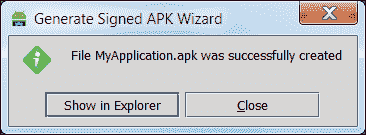

# 第九章。准备发布

在前一章中，您已经学习了足够的知识来测试和调试您的应用程序。准备发布申请需要什么？如何使用 Android Studio 做到这一点？

本章描述了使用安卓工作室准备应用程序发布的必要步骤。首先，我们将了解应用程序包文件，这是安卓应用程序打包的 JAR 文件的变体。然后，我们将了解在对应用程序进行全面测试后，我们需要如何更改它。最后，我们将签署我们的应用程序 APK ( **应用程序包**)文件，让它随时可以上传到任何市场，如谷歌游戏。

这些是我们将在本章中讨论的主题:

*   准备发布
*   APK 档案
*   获得证书
*   生成签名`APK`

# 什么是 APK 文件

安卓应用程序打包在一个扩展名为`.APK`的文件中，这是一个 Java JAR ( **Java Archive** 文件的变体。这些文件只是压缩的 ZIP 文件，因此可以很容易地探索它们的内容。APK 文件通常包含:

*   `assets/`:包含应用程序资产文件的文件夹。这与项目中存在的`assets`文件夹相同。
*   `META-INF/`:一个文件夹，里面有我们的证书。
*   `lib/`:一个文件夹，如果处理器需要，它包含编译的代码。
*   `res/`:包含应用资源的文件夹。
*   `AndroidManifest.xml`:应用清单文件。
*   `classes.dex`:包含应用编译代码的文件。
*   `resources.arsc`:包含一些预编译资源的文件。

有了`APK`文件，就可以在安卓操作系统上分发安装应用了。安卓应用可以通过谷歌 Play、亚马逊 Appstore 或 Opera Mobile Store 等应用市场，按照你的喜好进行分发；通过自己的网站；或者甚至通过电子邮件发送给你的用户。如果您选择最后两个选项中的任何一个，请考虑到默认情况下，安卓会阻止来自不同于谷歌游戏的位置的安装。您应该通知您的用户，他们需要在他们的设备中禁用此限制，以便能够安装您的应用程序。他们必须从安卓设备的**设置** | **安全**菜单中选择**未知来源**选项。

应用程序在构建时必须使用私钥进行签名。如果没有签名，应用程序就不能安装在设备中，甚至不能安装在模拟器中。要构建我们的应用程序，有两种模式，调试和发布。两个`APK`版本包含相同的文件夹和编译文件。区别在于用于签署它们的密钥:

*   **调试**:我们在前面几章运行测试我们的应用的时候，我们是在调试模式，但是我们没有任何密钥，也没有做任何事情来签署我们的应用。安卓软件开发工具包工具会自动创建一个调试密钥、一个别名和他们的密码来签署`APK`。这个过程发生在我们用安卓工作室运行或调试应用程序时，我们没有意识到这一点。我们不能发布用 SDK 工具创建的调试密钥签名的`APK`。
*   **Release**: We have to build a release version when we want to distribute our application in order to be able to install it in other Android devices. It is a requirement that the APK file is signed with a certificate for which the developer keeps the private key. In this case, we need our own private key, alias, and password and provide them to the build tools. The certificate identifies the developer of the application and can be a self-signed certificate. It is not necessary for a certificate authority to sign the certificate.

    ### 类型

    将密钥库和您的证书保存在安全的地方。要升级您的应用程序，您必须使用相同的密钥来上传新版本。如果您丢失了密钥存储，您将无法更新您的应用程序。您必须用不同的包名创建一个新的应用程序。

# 之前的步骤

在我们生成 APK 文件之前，有必要准备我们的应用程序，以便在发布模式下构建它。

首先，确保您已经完全测试了您的应用程序。我们建议测试您的应用程序:

*   在使用最低要求平台的设备上
*   在使用目标平台的设备上
*   在使用最新可用平台的设备上
*   在真实设备上，而不仅仅是在模拟器中
*   各种屏幕分辨率和尺寸
*   如果您的应用程序支持的话
*   如果您允许，可以在移动设备和平板电脑中切换到横向模式
*   在不同的网络条件下，例如没有互联网连接或覆盖率低
*   如果您的应用程序使用全球定位系统或任何定位服务，请在设备中未激活它们时进行测试
*   后退按钮的行为

其次，我们必须检查应用程序打印的日志消息。打印一些日志消息可能会被视为安全漏洞。安卓系统生成的日志可以被捕获和分析，所以我们应该避免显示关于应用程序内部工作的关键信息。您还应该从应用程序清单文件中删除`android:debuggable`属性。您也可以将该属性设置为`false`。

第三，如果您的应用程序与服务器通信，请检查配置的 URL 是否是生产 URL。在调试阶段，您可能引用了预发布环境中服务器的 URL。

最后，从应用程序清单文件中为`android:versionCode` 和`android:versionName`属性设置正确的值。版本代码是代表应用程序版本的数字(整数)。新版本应该有更大的版本代码。此代码用于确定设备中安装的应用程序是最新版本，还是有更新的版本。

版本名称是表示应用程序版本的字符串。与版本代码不同，版本名称对用户是可见的，并且出现在关于应用程序的公共信息中。对于用户来说，它只是一个信息丰富的版本名称，并不用于任何内部目的。

为版本代码指定值 1，为版本名称指定值 1.0。清单标记应该如下所示:

```java
<manifest xmlns:android="http://schemas.android.com/apk/res/android"
    package="com.example.myapplication"
    android:versionCode="1"
    android:versionName="1.0" >
```

我们应用程序的新版本的版本代码的值为 2，例如，版本名称的值为 1.1。

```java
<manifest xmlns:android="http://schemas.android.com/apk/res/android"
    package="com.example.myapplication"
    android:versionCode="2"
    android:versionName="1.1" >
```

# 生成签名的 APK

要生成签名的`APK`，在菜单**构建** | **生成签名的 APK** 中导航。在生成签名`APK`的对话框中，我们被要求提供证书。`APK`由本证书签名，表明其属于我们。

如果是我们第一次申请，可能我们没有任何证书。点击**新建**按钮打开新建密钥库对话框。我们必须填写以下信息。

*   **密钥库路径**:系统中创建密钥库的路径。密钥存储是一个扩展名为`.jks`的文件。比如命名为`release_keystore.jks`。
*   **密码**:密钥存储密码。你得确认一下。
*   **别名**:您的证书和一对公钥私钥的别名。比如命名为`releasekey`。
*   **密码**:证书密码。你得确认一下。
*   **有效期**:证书有效期至有效期。建议值为 25 年或更长。
*   **证书**:证书中包含的个人信息。键入您的名字和姓氏、组织单位、组织、城市或地区、州或省以及国家代码。例如`AS example`为**组织单位**、`packtpub`为**组织**、`ES`为**国家代码**。

点击**确定**。创建签名`APK`的对话框现在加载了密钥存储数据。下次我们创建已签名的`APK`时，我们已经有了证书，因此我们将点击**选择现有的**按钮。点击**下一步**按钮。下一步，选择保存`APK`文件的路径，点击**完成**。当 APK 完全生成后，我们会得到通知，从下面的截图可以看出:



我们应该在选定的路径中创建 APK 文件。点击**在浏览器中显示**按钮打开包含生成的包的文件夹，或者点击**关闭**按钮刚好关闭消息。

现在我们已经有了发布的 APK 文件，建议在分发之前在设备中再次测试它。

# 总结

我们已经学习了如何制作一个`APK`文件，以及如何修改我们的应用程序，使其为发布做好准备。我们还学习了如何使用我们的开发人员证书签署我们的应用程序。到本章结束时，用户应该已经生成了准备发布的签名`APK`。

在下一章中，我们将学习如何使用安卓工作室获得帮助。我们将访问安卓工作室在线文档并浏览帮助主题。最后，我们将了解如何使用内置功能来更新我们的安卓工作室实例。