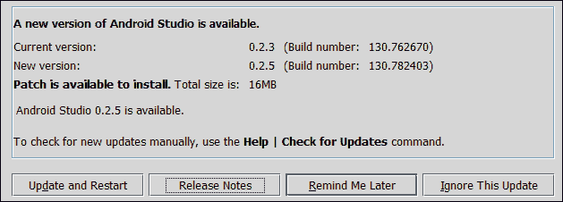

# 十、获得帮助

在新的集成开发环境中开发应用程序时，总是会对如何执行某项操作产生疑问。一个成功的集成开发环境通常包括帮助向导和帮助用户解决不同问题的文档。你想知道如何使用Android Studio获得帮助吗？

在最后一章中，我们将了解Android Studio文档和帮助主题。我们将学习官方文档中可用的主题，这些主题可以在安卓官方网站上在线访问。最后，我们将了解如何使用更新功能来保持我们的Android Studio实例是最新的。

涵盖的主题:

*   Android Studio帮助
*   在线文档
*   Android Studio更新

# 从Android Studio获取帮助

Android Studio文档包含在 IntelliJ IDEA 网络帮助中。本文档可从Android Studio的菜单**帮助** | **在线文档**或在[http://www.jetbrains.com/idea/documentation/](http://www.jetbrains.com/idea/documentation/)访问。一个更好的选择是导航到**帮助** | **帮助主题**直接打开文档内容树，或者在[http://www.jetbrains.com/idea/webhelp/intellij-idea.html](http://www.jetbrains.com/idea/webhelp/intellij-idea.html)。还有一些在线视频教程。导航至**帮助** | **捷脑电视**或打开网址[http://tv.jetbrains.net/](http://tv.jetbrains.net/)。

要快速找到Android Studio的动作，我们可以使用**帮助** | **找到动作**选项。键入您要查找的操作，匹配的操作列表将会显示。

最后，Android Studio提供了每日提示功能。每日提示在一个对话框中解释了一个关于Android Studio的技巧。每次打开Android Studio，都会显示这个对话框。我们可以使用**上一个提示**和**下一个提示**按钮浏览更多提示。通过取消选择**在启动时显示提示**复选框，我们可以禁用该功能。导航至**帮助** | **每日提示**即可打开提示对话框。

# 安卓在线文档

谷歌提供的官方安卓文档可在[http://developer.android.com/](http://developer.android.com/)获得。本文档包含所有必要的指南，不仅可以学习如何为安卓应用编程，还可以学习如何为安卓设计，以及如何分发和推广我们的应用。由于这个网站相当广泛，这里我们列出了一些具体的指南，有助于增加本书各章中的知识。

1.  [第一章](01.html "Chapter 1. Installing and Configuring Android Studio")、*安装配置Android Studio*:
    *   在 http://developer.android.com/sdk/installing/studio.html 开始使用Android Studio
    *   故障排除，在[上](http://developer.android.com/sdk/installing/studio.html#Troubleshooting)
    *   已知问题，在*[http://tools.android.com/knownissues](http://tools.android.com/knownissues)*

**   [第二章](02.html "Chapter 2. Starting a Project")*开工项目*:
    *   图标|启动器，位于[http://developer . Android . com/design/style/icon graphics . html #启动器](http://developer.android.com/design/style/iconography.html#launcher)
    *   使用代码模板，在[http://developer.android.com/tools/projects/templates.html](http://developer.android.com/tools/projects/templates.html)*   [第三章](03.html "Chapter 3. Navigating a Project")、*导航项目*:
    *   在 http://developer.android.com/tools/projects/管理项目
    *   Android Studio提示和技巧|项目结构，位于[http://developer . Android . com/SDK/installing/Studio-Tips . html #项目](http://developer.android.com/sdk/installing/studio-tips.html#Project)*   [第 4 章](04.html "Chapter 4. Using the Code Editor")，*使用代码编辑器*:
    *   Android Studio提示和技巧|键盘命令，位于[http://developer . Android . com/SDK/installing/Studio-Tips . html # key Commands](http://developer.android.com/sdk/installing/studio-tips.html#KeyCommands)*   [第 5 章](05.html "Chapter 5. Creating User Interfaces")、*创建用户界面*:
    *   布局，在[http://developer . Android . com/guide/topics/ui/declaring-layout . html](http://developer.android.com/guide/topics/ui/declaring-layout.html)
    *   输入控制，在[http://developer.android.com/guide/topics/ui/controls.html](http://developer.android.com/guide/topics/ui/controls.html)
    *   在[http://developer.android.com/guide/topics/ui/ui-events.html](http://developer.android.com/guide/topics/ui/ui-events.html)输入事件
    *   支持多屏幕，网址为*   [第六章](06.html "Chapter 6. Google Play Services")*谷歌游戏服务*:
    *   谷歌游戏服务，在[http://developer.android.com/google/play-services/](http://developer.android.com/google/play-services/)
    *   PlusOneButton ，在*[https://developer . Android . com/reference/com/Google/Android/GMS/plus/PlusOneButton . html](https://developer.android.com/reference/com/google/android/gms/plus/PlusOneButton.html)*
    **   [第七章](07.html "Chapter 7. Tools")*工具*:
    *   SDK 经理，在[http://developer.android.com/tools/help/sdk-manager.html](http://developer.android.com/tools/help/sdk-manager.html)
    *   在 http://developer.android.com/tools/devices/管理虚拟设备*   [第八章](08.html "Chapter 8. Debugging")*调试*:
    *   使用 DDMS ，在[http://developer.android.com/tools/debugging/ddms.html](http://developer.android.com/tools/debugging/ddms.html)
    *   读写日志，网址为
    *   使用 Traceview 和 dmtracedump 对进行分析，网址为*   [第九章](09.html "Chapter 9. Preparing for Release")*准备发布*:
    *   发布概述，在[http://developer . Android . com/tools/publishing/publishing _ Overview . html](http://developer.android.com/tools/publishing/publishing_overview.html)**

 **# 更新

从帮助菜单中，我们可以查看Android Studio的更新。导航至**帮助** | **查看更新**。检查完成后，如果有我们没有安装的Android Studio的更新，更新信息会显示在一个对话框中。该对话框显示在下一个屏幕截图中。我们可以查看当前版本、新版本代码及其大小。我们可以选择是忽略更新、稍后更新(**稍后提醒我**按钮)、查看关于更新的在线发行说明(**发行说明**按钮)还是安装更新(**更新并重启**按钮)。点击最后这个选项更新Android Studio。首先开始下载更新，然后Android Studio将重新启动并安装更新。

如果我们已经有了最新版本的Android Studio，将显示以下消息:

**你已经安装了最新版本的安卓 Studio (I/O 预览版)。要配置自动更新设置，请参见集成开发环境设置的更新对话框**

点击**更新**链接，打开更新配置对话框。我们可以选择是否希望Android Studio自动检查更新，以及检查什么类型的更新，例如，测试版或稳定版。

我们可以通过导航到菜单**帮助** | **Android Studio的新功能**来查看关于Android Studio最近更新的信息。该信息可在[http://tools.android.com/recent](http://tools.android.com/recent)在线获得。要获取当前版本的Android Studio，甚至是我们系统中的 Java 版本，请导航至**帮助** | **关于**。

# 总结

我们已经学习了如何使用Android Studio文档，以防我们在集成开发环境中需要任何可用操作的帮助。我们还了解了更新功能，以便始终安装最新版本的Android Studio。到本章结束时，用户应该能够使用在线文档和帮助主题搜索帮助，并让他们的Android Studio随时掌握最新的功能。**