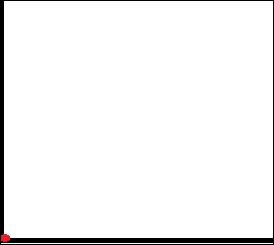

# 二、创建图形

在本章中，我们将介绍如何创建和处理您的所有游戏图形。我们将创建场景，使用游戏导演的人之间的过渡，创建精灵，将它们定位在期望的位置，使用动作移动它们，并使用动画使我们的角色栩栩如生。

本章将涵盖以下主题:

*   创建场景
*   理解节点
*   理解精灵
*   理解行动
*   动画精灵
*   添加游戏菜单
*   处理多个屏幕分辨率

# 创造场景

场景概念在 Cocos2d-x 游戏引擎中非常重要，因为我们游戏中显示的所有屏幕都被认为是场景。在 Cocos2d-x 和 Android 原生 Java 开发之间建立类比，我们可以说 Cocos2d-x 场景相当于 Android 所说的活动。

在前一章我们介绍了`AppDelegate`类，我们解释了它的职责是在设备上加载框架，然后执行游戏特定的代码。这个类包含`ApplicationDidFinishLaunching`方法，这是我们代码的入口点。在这个方法中，我们实例化将首先在我们的游戏中显示的场景，然后请求`director`加载它，如我们在下面的代码清单中所见:

```cpp
bool AppDelegate::applicationDidFinishLaunching() {
    auto director = Director::getInstance();
  // OpenGL initialization done by cocos project creation script
    auto glview = director->getOpenGLView();
    auto scene = HelloWorld::createScene();
    director->runWithScene(scene);
    return true;
}
```

### 注

所有的 C++代码都在单个安卓活动中运行；然而，我们可以在游戏中加入本地活动。

## 理解图层

场景本身不是一个对象容器，这就是为什么它应该包含至少一个`Layer`类的实例，这样我们就可以向它添加对象。这个图层创建过程已经封装在宏`CREATE_FUNC`的框架中。您只需调用宏并将类名作为参数传递，它就会生成图层创建代码。

在框架的早期版本中，层操作有多种与事件处理相关的用途；然而，事件调度器引擎在 3.0 版本中被完全重写。图层概念在 Cocos2d-x 3.4 中仍然存在的唯一原因是兼容性。框架创建者正式宣布，他们可能会在进一步的版本中删除图层概念。

## 使用导演

场景由 Cocos2d-x 导演控制，这是一个处理我们游戏流程的类。它应用了单例设计模式，这确保了该类只有一个实例。它控制应该通过场景堆栈呈现的场景类型，类似于安卓处理场景的方式。

这意味着推入堆栈的最后一个场景将呈现给用户。当场景被移除时，用户将能够看到先前可见的场景。

当我们在单个函数中多次使用单个 director 实例时，我们可以将其引用存储在一个局部变量上，如下所示:

```cpp
auto director = Director::getInstance();
```

我们还可以将它存储在一个类属性中，以便可以从整个类中访问它。这将允许我们键入更少的内容，这也将代表性能的提高，这样我们就不会在每次想要访问单例实例时多次调用`getInstance`静态方法。

Director 实例还可以为我们提供有用的信息，比如屏幕尺寸，以及调试信息，这在我们的 Cocos 项目中是默认启用的。

# 暂停游戏

让我们开始并创造我们的游戏。我们要添加的第一个特性是暂停和恢复游戏的功能。让我们开始构建——我们将从设置暂停游戏时出现的屏幕开始。

我们将通过向场景堆栈添加新的暂停场景来实现这一点。当此屏幕从堆栈中移除时，HelloWorld 场景将会显示，因为它是暂停场景被推入场景堆栈之前显示的屏幕。下面的代码清单展示了如何轻松暂停游戏:

## 整理我们的资源文件

当我们创建我们的 Cocos2d-x 项目时，一些资源如图像和字体已经默认添加到我们项目的`Resources`文件夹中。我们将组织他们，以便更容易处理他们。为此，我们将在`Resources`目录中创建一个`Image`文件夹。在这个新文件夹中，我们将放置所有图像。在本章的后面，我们将解释如何根据安卓设备的屏幕分辨率来组织每个图像的不同版本。

在本章附带的资源中，我们为您提供了构建本章代码所需的图像。

## 创建我们的暂停场景头文件

首先，让我们创建我们的暂停场景头文件。我们使用`HelloWorld.h`头文件作为参考创建了它:

```cpp
#ifndef __Pause_SCENE_H__
#define __Pause_SCENE_H__

#include "cocos2d.h"

class Pause : public cocos2d::Layer
{
public:
    static cocos2d::Scene* createScene();
    virtual bool init();
  void exitPause(cocos2d::Ref* pSender);
    CREATE_FUNC(Pause);
private:
  cocos2d::Director *_director;
  cocos2d::Size _visibleSize;
};

#endif // __Pause_SCENE_H__
```

### 类型

每次通过键入`using namespace cocos2d`引用`cocos2d`命名空间中包含的 Cocos2d-x 类时，您可以避免键入`cocos2d`；然而，在头文件中使用它被认为是一种不好的做法，因为当所有包含的名称空间中有任何重复的字段名时，代码可能无法编译它。

## 创建暂停场景实现文件

现在，让我们创建我们的暂停场景实现文件。类似于我们在上一节中所做的，我们将基于项目创建脚本创建的`HelloWorld.cpp`文件来创建这个文件。

在下面的代码中，您会发现菜单创建代码捆绑在 Cocos2d-x 模板项目中。我们将在本章的下一节解释如何创建游戏菜单，您还将学习字体创建，这将在[第 5 章](5.html "Chapter 5. Handling Text and Fonts")、*处理文本和字体*中详细解释。

```cpp
#include "PauseScene.h"

USING_NS_CC;

Scene* Pause::createScene()
{
    auto scene = Scene::create();
    auto layer = Pause::create();
    scene->addChild(layer);
    return scene;
}

bool Pause::init()
{
    if ( !Layer::init() )
    {
      return false;
    }
  _director = Director::getInstance();
  _visibleSize = _director->getVisibleSize();
  Vec2 origin = _director->getVisibleOrigin();
  auto pauseItem = MenuItemImage::create("play.png", "play_pressed.png", CC_CALLBACK_1(Pause::exitPause, this));
  pauseItem->setPosition(Vec2(origin.x + _visibleSize.width -pauseItem->getContentSize().width / 2, origin.y + pauseItem->getContentSize().height / 2));
  auto menu = Menu::create(pauseItem, nullptr);
  menu->setPosition(Vec2::ZERO);
  this->addChild(menu, 1);
  auto label = Label::createWithTTF("PAUSE", "fonts/Marker Felt.ttf", 96);
  label->setPosition(origin.x + _visibleSize.width/2, origin.y + _visibleSize.height /2);
  this->addChild(label, 1);
  return true;
}

void Pause::exitPause(cocos2d::Ref* pSender){
  /*Pop the pause scene from the Scene stack.
  This will remove current scene.*/
  Director::getInstance()->popScene();
}
```

在生成的`HelloWorldScene.h`场景中，我们现在在`menuCloseCallback`方法的定义之后添加下面一行代码:

```cpp
void pauseCallback(cocos2d::Ref* pSender);
```

现在，让我们为`HelloWorldScene.cpp`实现文件中的`pauseCallBack`方法创建实现:

```cpp
void HelloWorld::pauseCallback(cocos2d::Ref* pSender){
  _director->pushScene(Pause::createScene());
}
```

最后，通过调用`pauseCallBack`方法而不是`menuCloseCallBack`方法来修改`closeItem`创建，因此该行将如下所示:

```cpp
    auto closeItem = MenuItemImage::create("pause.png", "pause_pressed.png", CC_CALLBACK_1(HelloWorld::pauseCallback, this));
```

现在我们已经创建了一个简单的暂停场景，当按下关闭按钮时，这个场景被推送到场景堆栈，当从暂停场景中按下蓝色按钮时，这个场景被关闭。

我们现在将把`PauseScene.cpp`文件添加到名为`Android.mk`的安卓 makefile 中，该文件位于`HelloWorldScene.cpp`上方`LOCAL_SRC_FILES`部分您的 eclipse 项目的`jni`文件夹中。

### 过渡

导演还负责在切换场景时播放转场，Cocos2d-x 3.4 目前提供了超过 35 种不同的场景转场效果，例如淡入淡出、翻转、翻页、分割和缩放等。

Transition 是`Scene`类的一个子类，这意味着您可以将一个 transition 实例传递给任何接收场景对象的方法，例如`runWithScene`、`replaceScene`或`director`类的`pushScene`方法。

让我们用一个简单的过渡效果，当从游戏场景传递到暂停场景。我们将通过创建一个新的`TransitionFlipX`类实例并将其传递给导演的`pushScene`方法来实现这一点:

```cpp
void HelloWorld::pauseCallback(cocos2d::Ref* pSender){
  _director->pushScene(TransitionFlipX::create(1.0, Pause::createScene()));
}
```

# 理解节点

节点代表屏幕上所有可见的物体，它实际上是所有场景元素的超类，包括场景本身。它是基础框架类，它有允许你处理图形特征的基本方法，比如位置和深度。

# 理解精灵

在我们的游戏中，精灵代表我们场景的图像，就像背景、敌人和我们的玩家一样。

稍后在[第四章](4.html "Chapter 4. User Input")、*用户输入*中，我们会在场景中加入事件监听器，让其可以与用户进行交互。

## 创建精灵

实例化 Cocos2d-x 核心类非常容易。我们看到`scene`类有一个`create`方法；类似地，`sprite`类有一个同名的静态方法，如下面的代码片段所示:

```cpp
auto sprBomb = Sprite::create("bomb.png");
```

Cocos2d-x 目前支持小精灵的 PNG、JPG 和 TIF 图像格式；尽管如此，强烈建议我们使用 PNG 图像，因为它具有 JPG 或 TIF 格式都不具备的透明度，还因为这种格式以合理的文件大小提供了图像质量。这就是为什么你会看到所有 Cocos2d-x 生成的模板和样本都使用这种图像格式。

## 定位小精灵

一旦我们创建了自己的精灵，我们就可以使用`setPosition`方法轻松地将其定位在屏幕上，但是在做之前，我们将解释锚点概念。

### 设置锚点

所有精灵都有一个被称为**锚点**的参考点。当我们使用`setPosition`方法定位一个精灵时，框架实际上做的是将指定的二维位置设置到锚点，这样它就影响了整个图像。默认情况下，锚点设置为精灵的中心，如下图所示:


### 理解 Cocos2d-x 坐标系

Cocos2d-x 坐标系与大多数计算机化的图形引擎不同，其原点(0，0)位于屏幕的左下方，如下图所示:



所以如果我们想把精灵定位在原点(0，0)，我们可以通过调用精灵类中包含的`setPosition`方法来实现。它是重载的，因此它可以接收指示 x 和 y 位置的两个浮点数，一个`Point`类实例，或者一个`Vec2`实例。虽然在生成的代码中使用了`Vec2`实例，但是官方的 Cocos2d-x 文档指出传递浮点数的速度要快 10 倍。

```cpp
sprBomb -> setPosition(0,0);
```

执行完这段代码后，我们可以看到只有精灵的右上区域可见，仅代表其大小的 25%，如下图所示:


因此，如果您希望子画面显示在原点，您有许多选项，例如将子画面定位在对应于子画面高度的一半和宽度的一半的点，这可以通过使用子画面方法`getContentSize`来确定，该方法返回具有子画面高度和宽度属性的大小对象。另一个可能比这更简单的选项是将 sprite 锚点重置为(0，0)；因此，当子画面位于屏幕原点时，它是完全可见的，并且位于屏幕最左下方的区域。`setAnchorPoint`方法接收一个`Vec2`实例作为参数。在下面的代码清单中，我们传递了一个指向原点(0，0)的`Vec2`实例:

```cpp
sprBomb -> setAnchorPoint(Vec2(0,0));
sprBomb -> setPosition(0,0);
```

### 注

`Vec2`类有一个不接收参数的构造函数，它创建一个初始值为 0，0 的`Vec2`对象。

当我们执行代码时，我们会得到以下结果:


### 类型

之所以默认锚点位置在精灵的中心，是因为它更容易定位在屏幕的中心。

### 给场景添加精灵

在我们的精灵对象被创建和定位之后，我们需要使用`addChild`方法将其添加到我们的场景中，该方法包含两个参数:指向您想要添加到场景中的节点的指针和表示其在 *z* 轴中的位置的整数。具有最高 *z* 值的节点将显示在具有较低值的节点之上:

```cpp
  this->addChild(sprBomb,1);
```

现在让我们将背景图像添加到我们的`HelloWorld`场景中:我们将按照我们使用的相同步骤进行操作，以便在`init`方法中将炸弹定位在屏幕的左下方区域:

```cpp
  auto bg = Sprite::create("background.png");
  bg->setAnchorPoint(Vec2());
  bg->setPosition(0,0);
  this->addChild(bg, -1);
```

我们现在已经在位置为-1 的 *z* 中添加了背景，因此任何位置为 0 或更高的节点都将显示在背景的顶部，如下图所示:


### 将精灵定位在可见区域之外

现在我们在屏幕底部有一个不动的炸弹。我们现在将它定位在屏幕的顶部中心区域，在可见区域之外，这样当我们让这个精灵移动时，它会看起来像是在下炸弹。

如前所述，让我们将炸弹放置在可见区域，然后，在下一部分中，我们将使用动作功能使其向地面移动:

```cpp
sprBomb->setPosition(_visibleSize.width / 2, _visibleSize.height + sprBomb->getContentSize().height/2);
```

我们删除了一句；所以，现在，炸弹有一个默认的锚点，我们修改了`setPosition`语句，所以现在，我们只是将其定位在可见区域。

### 定位玩家精灵

现在，让我们创建并定位我们的玩家精灵。

```cpp
auto player = Sprite::create("player.png");
player->setPosition(_visibleSize.width / 2, _visibleSize.height* 0.23);
this->addChild(player, 0);
```

在前面的代码中，我们创建了一个玩家精灵。我们使用了默认锚点，它直接指向图像的中心，并通过将其定位到屏幕宽度的一半和屏幕高度的 23%来将其水平居中，因为本书中为本章提供的背景图像是在这些比例内绘制的。我们用 z 值 0 添加了它，所以这意味着它将显示在背景中。

现在让我们来处理炸弹，让我们将它放置在可见区域，然后在下一部分中，我们将使用动作功能使它向地面移动:

```cpp
sprBomb->setPosition(_visibleSize.width / 2, _visibleSize.height + sprBomb->getContentSize().height/2);
```

我们删除了`setAnchorPoint`句；所以现在，炸弹有了默认锚点，我们修改了`setPosition`语句，所以现在，我们将其定位在可见区域。

在本章中，我们使用了许多图像，正如我们之前提到的，这些图像存储在我们 Cocos2d-x 项目的`Resources`文件夹中。您可以创建子文件夹来组织文件。

# 理解动作

我们可以轻松地告诉我们的小精灵执行具体的动作，比如跳跃、移动、歪斜等等。它需要几行代码来让我们的精灵执行想要的动作。

## 移动精灵

我们可以通过创建`MoveTo`动作，然后让精灵执行该动作，使我们的精灵移动到屏幕的特定区域。

在下面的代码清单中，我们通过简单地编写下面的代码行来使炸弹落到屏幕底部:

```cpp
  auto moveTo = MoveTo::create(2, Vec2(sprBomb->getPositionX(), 0 - sprBomb->getContentSize().height/2));
  sprBomb->runAction(moveTo);
```

我们已经创建了一个`moveTo`节点，它会将炸弹精灵移动到当前的水平位置，但它也会将其移动到屏幕底部，直到看不见为止。为了实现这一点，我们让它移动到雪碧高度负一半的 y 位置。由于锚点被设置为精灵的中心点，将其移动到其高度的负一半将足以使其移动到屏幕的可见区域之外。

正如你所看到的，它正在与我们的玩家精灵碰撞，但是炸弹只是继续向下，因为它仍然没有检测到碰撞。在下一章中，我们将在游戏中加入碰撞处理。

### 注

Cocos2d-x 3.4 有自己的物理引擎，其中包括一个简单的机制来检测精灵之间的碰撞。

如果我们想将精灵移动到相对于其当前位置的位置，我们可以使用`MoveBy`类，该类接收我们希望精灵水平和垂直移动多少的参数:

```cpp
  auto moveBy = MoveBy::create(2, Vec2(0, 250));
  sprBomb->runAction(moveBy);
```

### 注

您可以使用`reverse`方法使精灵向相反的方向移动。

## 创建序列

有时我们有一个预定义的动作序列，我们希望在代码的几个部分中执行，这可以通过序列来处理。顾名思义，它由一系列以预定义顺序执行的操作组成，必要时可以颠倒顺序。

每次使用动作都使用序列是非常常见的，所以在序列中我们添加`moveTo`节点，然后在移动完成后执行一个方法的函数调用，这样它将允许我们从内存中删除精灵，重新定位它，或者执行视频游戏中需要的任何其他常见任务。

在下面的代码中，我们正在创建一个序列，其中我们首先要求炸弹移动到地面，并且我们请求执行`moveFinished`方法:

```cpp
  //actions
  auto moveFinished = CallFuncN::create(CC_CALLBACK_1(HelloWorld::moveFinished, this));
  auto moveTo = MoveTo::create(2, Vec2(sprBomb->getPositionX(), 0 - sprBomb->getContentSize().height/2));
  auto sequence = Sequence::create(moveTo, moveFinished, nullptr);
  sprBomb->runAction(sequence);
```

请注意，我们在序列的末尾传递了一个`nullptr`参数，所以当 Cocos2d-x 看到这个值时，它将停止执行序列中的项目；如果你不指定它，那么这将导致你的游戏崩溃。

### 注

从 3.0 版本开始，Cocos2d-x 建议使用`nullptr`关键字来引用空指针，而不是使用传统的空宏，这仍然有效，但不被认为是 C++中的最佳实践。

# 动画精灵

为了给我们的游戏一个更专业的方面，我们可以动画化我们的精灵，这样它就不会一直显示静止的图像，而是显示动画角色、敌人和障碍物。Cocos2d-x 提供了一种简单的机制，可以将这些类型的动画添加到我们的精灵中，我们可以在下面的代码清单中看到这一点:

```cpp
//Animations
Vector<SpriteFrame*> frames;
Size playerSize = sprPlayer->getContentSize();
frames.pushBack(SpriteFrame::create("player.png", Rect(0, 0, playerSize.width, playerSize.height)));
frames.pushBack(SpriteFrame::create("player2.png", Rect(0, 0, playerSize.width, playerSize.height)));
auto animation = Animation::createWithSpriteFrames(frames,0.2f);
auto animate = Animate::create(animation);
sprPlayer->runAction(RepeatForever::create(animate));
```

## 使用雪碧床单提高性能

虽然我们可以根据位于几个文件中的图像创建精灵动画，就像我们在之前的代码中所做的那样，但是加载大量文件会非常低效。这就是为什么我们更喜欢加载一个包含多个图像的文件。为了实现这一点，扩展名为`plist`的纯文本文件指示文件中每个图像的确切位置，Cocos2d-x 能够读取该纯文本文件，并从单个子画面文件中提取所有图像。有很多工具可以让你创建自己的精灵表，最受欢迎的是纹理打包器，你可以从[https://www.codeandweb.com/texturepacker](https://www.codeandweb.com/texturepacker)下载，在 Windows 或 Mac OS 上免费试用。

在这一章中，我们包括的资源是:一个名为`bunny.plist`的`plist`文件和用纹理打包器创建的`bunny_ss.png`精灵表。您可以使用以下代码加载该表单的任何框架:

```cpp
SpriteFrameCache* cache = SpriteFrameCache::getInstance();
cache->addSpriteFramesWithFile("bunny.plist");
auto sprBunny = Sprite::createWithSpriteFrameName("player3.png");
sprBunny -> setAnchorPoint(Vec2());
```

# 游戏菜单

在我们游戏的某些部分，比如主屏幕和配置屏幕，有菜单是非常常见的。这个框架为我们提供了一个简单的方法来为我们的游戏添加菜单。

下面的代码清单显示了菜单创建过程:

```cpp
auto closeItem = MenuItemImage::create("pause.png", "CloseSelected.png", CC_CALLBACK_1(HelloWorld::pause_pressed, this));
closeItem->setPosition(Vec2(_visibleSize.width – closeItem->getContentSize().width/2 , closeItem-> getContentSize().height/2));
auto menu = Menu::create(closeItem, nullptr);
menu->setPosition(Vec2::ZERO);
this->addChild(menu, 1);
```

从前面的列表中我们可以看到，我们首先通过实例化`MenuItemImage`类并向`create`方法传递三个参数来创建一个菜单项:第一个参数指示菜单项应该显示什么图像，第二个参数是选择图像时应该显示的图像，第三个参数指定选择菜单项时应该调用的方法。

### 注

Cocos2d-x 分支 3 现在允许程序员使用 lambda 表达式来处理菜单项。

## 处理多个屏幕分辨率

创建游戏时，您应该决定计划支持哪些屏幕分辨率，然后创建所有图像，其大小既不会在高分辨率屏幕上看起来像素化，也不会在低性能设备上加载时影响性能。所有这些版本的图像应该具有相同的名称，但是它们应该存储在`Resources`文件夹的不同目录中。

在本例中，我们有三个目录:第一个目录包含高分辨率图像，第二个目录包含中分辨率图像，第三个目录包含低分辨率图像。

在拥有足够大小的图像以满足所有分辨率需求后，我们必须编写代码，根据设备的屏幕分辨率选择合适的图像集。正如我们之前提到的，`AppDelegate`类包含`applicationDidFinishLaunching`，它在 Cocos2d-x 框架加载到设备上之后立即启动。在这个方法中，我们将编写我们的多屏幕分辨率代码，如下面的代码清单所示:

```cpp
bool AppDelegate::applicationDidFinishLaunching() {
  auto director = Director::getInstance();
  // OpenGL initialization done by cocos project creation script
  auto glview = director->getOpenGLView();
  Size screenSize = glview->getFrameSize();
  Size designSize = CCSizeMake(768, 1280);
  std::vector<std::string> searchPaths;

if (screenSize.height > 800){
  //High Resolution
  searchPaths.push_back("images/high");
  director->setContentScaleFactor(1280.0f / designSize.height);
}
else if (screenSize.height > 600){
  //Mid resolution
  searchPaths.push_back("images/mid");
  director->setContentScaleFactor(800.0f / designSize.height);
}
else{
  //Low resolution
  searchPaths.push_back("images/low");
  director->setContentScaleFactor(320.0f / designSize.height);
}
  FileUtils::getInstance()->setSearchPaths(searchPaths);
  glview->setDesignResolutionSize(designSize.width, designSize.height, ResolutionPolicy::NO_BORDER );
  auto scene = HelloWorld::createScene();
  director->runWithScene(scene);
  return true;
}
```

通过将`android:screenOrientation`的值设置为`portrait`来修改`AndroidManifest.xml`文件。

# 把所有东西放在一起

以下是实现文件的完整代码，我们在这里创建并定位了我们的背景、动画播放器和移动炸弹:

```cpp
#include "HelloWorldScene.h"
#include "PauseScene.h"

USING_NS_CC;

Scene* HelloWorld::createScene()
{
  // 'scene' is an autorelease object
  auto scene = Scene::create();

  // 'layer' is an autorelease object
  auto layer = HelloWorld::create();

  // add layer as a child to scene
  scene->addChild(layer);

  // return the scene
  return scene;
}
```

接下来在`init`函数中，我们将实例化并初始化我们的精灵:

```cpp
bool HelloWorld::init()
{
  if ( !Layer::init() )
  {
    return false;
  }
  _director = Director::getInstance();
  _visibleSize = _director->getVisibleSize();
  auto origin = _director->getVisibleOrigin();
  auto closeItem = MenuItemImage::create("pause.png", "pause_pressed.png", CC_CALLBACK_1(HelloWorld::pauseCallback, this));

  closeItem->setPosition(Vec2(_visibleSize.width - closeItem->getContentSize().width/2 ,
  closeItem->getContentSize().height/2));

  auto menu = Menu::create(closeItem, nullptr);
  menu->setPosition(Vec2::ZERO);
  this->addChild(menu, 1);
  auto sprBomb = Sprite::create("bomb.png");
  sprBomb->setPosition(_visibleSize.width / 2, _visibleSize.height + sprBomb->getContentSize().height/2);
  this->addChild(sprBomb,1);
  auto bg = Sprite::create("background.png");
  bg->setAnchorPoint(Vec2::Zero);
  bg->setPosition(0,0);
  this->addChild(bg, -1);
  auto sprPlayer = Sprite::create("player.png");
  sprPlayer->setPosition(_visibleSize.width / 2, _visibleSize.height * 0.23);
  this->addChild(sprPlayer, 0);
```

接下来，我们将使用以下代码添加动画:

```cpp
  Vector<SpriteFrame*> frames;
  Size playerSize = sprPlayer->getContentSize();
  frames.pushBack(SpriteFrame::create("player.png", Rect(0, 0, playerSize.width, playerSize.height)));
  frames.pushBack(SpriteFrame::create("player2.png", Rect(0, 0, playerSize.width, playerSize.height)));
  auto animation = Animation::createWithSpriteFrames(frames,0.2f);
  auto animate = Animate::create(animation);
  sprPlayer->runAction(RepeatForever::create(animate));
```

这里我们将创建一个序列，将我们的炸弹从屏幕的顶部移动到底部。运动完成后，我们将指定调用`moveFinished`方法。出于测试目的，我们只使用它来打印日志消息:

```cpp
  //actions
  auto moveFinished = CallFuncN::create(CC_CALLBACK_1(HelloWorld::moveFinished, this));
  auto moveTo = MoveTo::create(2, Vec2(sprBomb->getPositionX(), 0 - sprBomb->getContentSize().height/2));
  auto sequence = Sequence::create(moveTo, moveFinished, nullptr);
  sprBomb->runAction(sequence);
  return true;
}

void HelloWorld::moveFinished(Node* sender){
  CCLOG("Move finished");
}

void HelloWorld::pauseCallback(cocos2d::Ref* pSender){
  _director->pushScene(TransitionFlipX::create(1.0, Pause::createScene()));
}
```

下图向我们展示了将本章中完成的所有代码放在一起后，我们的游戏是什么样子的:


# 总结

在这一章中，我们已经看到了如何创建我们的游戏场景，以及如何向其中添加精灵和菜单。我们还学习了如何轻松地制作精灵动画，并在屏幕上移动它们。

在下一章中，我们将学习如何使用内置的物理引擎以更真实的方式移动我们的精灵；有了它，我们将轻松配置运动，并在我们的游戏中添加碰撞检测。