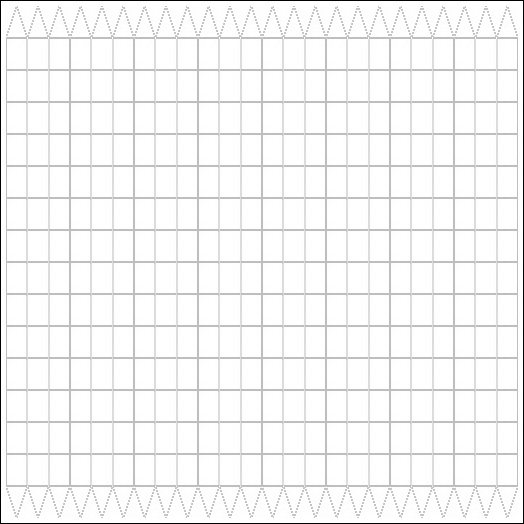
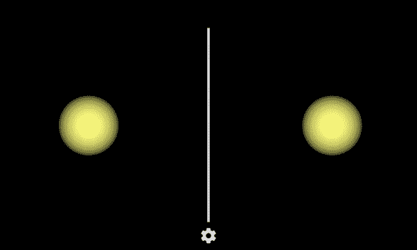
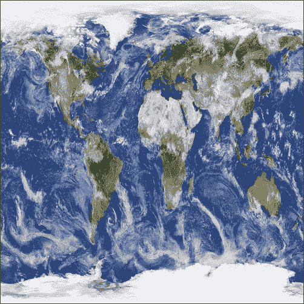
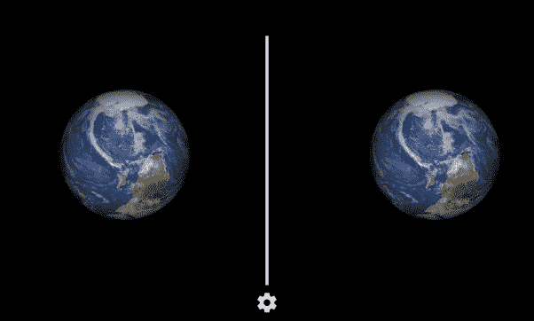
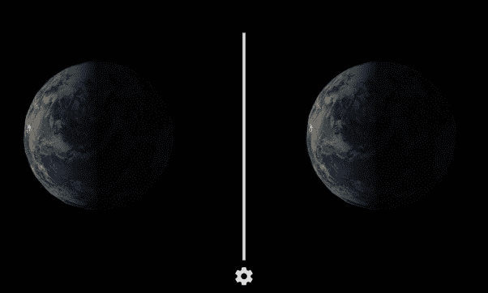
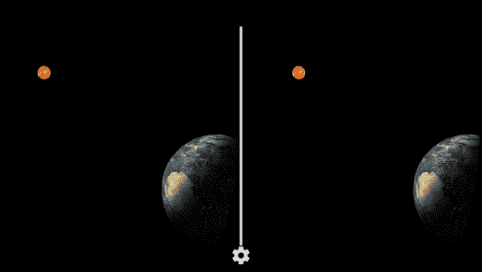

# 六、太阳系

8 岁的时候，为了学校的一个科学项目，我用电线、发泡胶球和颜料做了一个*太阳系*。今天，世界各地的 8 岁儿童将能够在虚拟现实中制作虚拟太阳系，尤其是如果他们阅读了这一章！这个项目创建了一个纸板虚拟现实应用，模拟我们的太阳系。嗯，也许不是完全科学的准确性，但对于一个孩子的项目来说足够好了，比泡沫塑料球更好。

在本章中，通过执行以下步骤，您将使用`RenderBox`库创建一个新的太阳系项目:

*   设置新项目
*   创建`Sphere`组件和纯色材质
*   添加带有照明的`Earth`纹理材质
*   排列太阳系的几何形状
*   使天体活动起来
*   交互式改变摄像机位置
*   用我们的新代码更新`RenderBox`库

当我们把这些放在一起，我们将从一个球体中创造行星和卫星。然而，大部分代码将在渲染这些实体的各种材质和着色器中。

### 注

这个项目的源代码可以在 Packt Publishing 网站上找到，也可以在 GitHub 上的[https://github.com/cardbookvr/solarsystem](https://github.com/cardbookvr/solarsystem)找到(每个主题作为一个单独的提交)。

# 建立新项目

为了构建这个项目，我们将使用我们在[第 5 章](05.html "Chapter 5. RenderBox Engine")、*RenderBox引擎*中创建的`RenderBox`库。您可以使用您的，或者从本书提供的可下载文件或我们的 GitHub 存储库中获取一份副本(使用提交标记的`after-ch5`—[https://GitHub . com/cardbookr/renderboxlib/releases/tag/after-ch5](https://github.com/cardbookvr/renderboxlib/releases/tag/after-ch5))。关于如何导入`RenderBox`库的更详细描述，请参考[第 5 章](05.html "Chapter 5. RenderBox Engine")、*RenderBox引擎*的最终*在未来项目中使用RenderBox*部分。执行以下步骤创建新项目:

1.  Android Studio打开后，创建一个新项目。让我们将其命名为`SolarSystem`，并以**空活动**为目标**安卓 4.4 KitKat (API 19)** 。
2.  使用**文件** | **新模块** | **导入，为每个`renderbox`、`common`和`core`包创建新模块。JAR/。AAR 包装**。
3.  使用**文件** | **项目结构**，将模块设置为应用的依赖项。
4.  按照[第 2 章](02.html "Chapter 2. The Skeleton Cardboard Project")、*框架纸板项目*中的说明编辑`build.gradle`文件，根据 SDK 22 进行编译。
5.  更新`/res/layout/activity_main.xml`和`AndroidManifest.xml`，如前几章所述。
6.  将`MainActivity`编辑为`class MainActivity extends CardboardActivity implements IRenderBox`，实现接口方法存根( *Ctrl* + *I* )。

我们可以在`MainActivity`中定义`onCreate`方法。该类现在具有以下代码:

```java
public class MainActivity extends CardboardActivity implements IRenderBox {
    private static final String TAG = "SolarSystem";

    @Override
    protected void onCreate(Bundle savedInstanceState) {
        super.onCreate(savedInstanceState);
        setContentView(R.layout.activity_main);

        CardboardView cardboardView = (CardboardView) findViewById(R.id.cardboard_view);
        cardboardView.setRenderer(new RenderBox(this, this));
        setCardboardView(cardboardView);
    }
    @Override
    public void setup() {

    }
    @Override
    public void preDraw() {
    }
    @Override
    public void postDraw() {
    }
}
```

当我们构建这个项目时，我们将创建新的类，这些类可能是`RenderBox` lib 的良好扩展。在这个项目中，我们首先会让他们成为常规班级。然后，在本章的最后，我们将帮助您将它们移入`RenderBox` lib 项目并重建库:

1.  右键点击`solarsystem`文件夹(`com.cardbookvr.solarsystem`，选择**新建** | **包**，命名为`RenderBoxExt`。
2.  在`RenderBoxExt`内，创建名为`components`和`materials`的包子文件夹。

没有真正的技术需求使它成为一个单独的包，但是这有助于组织我们的文件，因为在本章结束时`RenderBoxExt`中的文件将被移动到我们的可重用库中。

您可以暂时向场景中添加一个立方体，以帮助确保一切设置正确。将其添加到`setup`方法中，如下所示:

```java
    public void setup() {
        new Transform()
            .setLocalPosition(0,0,-7)
            .setLocalRotation(45,60,0)
            .addComponent(new Cube(true));
    }
```

如果您还记得，立方体是添加到转换中的组件。立方体定义其几何形状(例如顶点)。变换定义了它在三维空间中的位置、旋转和缩放。

你应该可以在没有编译错误的情况下点击**运行‘app’**，并在你的安卓设备上看到立方体和纸板的分屏视图。

# 创建球体组件

我们的太阳系将由球体构成，代表行星、卫星和太阳。让我们首先创建一个`Sphere`组件。我们将把一个球体定义为由形成球体表面的顶点组成的三角形网格(关于三角形网格的更多信息，请参考[https://en.wikipedia.org/wiki/Triangle_mesh](https://en.wikipedia.org/wiki/Triangle_mesh))。

右键点击`RenderBoxExt/components`文件夹，选择**新建** | **Java 类**，命名为`Sphere`。将其定义为`public class Sphere extends RenderObject`:

```java
public class Sphere extends RenderObject{
    private static final String TAG = "RenderBox.Sphere";
    public Sphere() {
        super();
        allocateBuffers();
    }
}
```

构造函数调用助手方法`allocateBuffers`，为顶点、法线、纹理和索引分配缓冲区。让我们在类的顶部声明这些变量:

```java
    public static FloatBuffer vertexBuffer;
    public static FloatBuffer normalBuffer;
    public static FloatBuffer texCoordBuffer;
    public static ShortBuffer indexBuffer;
    public static int numIndices;
```

请注意，我们已经决定声明缓冲区`public`，以提供未来为对象创建任意纹理材质的灵活性。

我们将定义一个半径为 1 的球体。它的顶点由 24 个经度部分(作为一天中的小时数)和 16 个纬度部分排列，为我们的目的提供了足够的分辨率。顶盖和底盖分开处理。这是一个很长的方法，所以我们将为您分解它。这是代码的第一部分，我们在这里声明和初始化变量，包括顶点数组。类似于我们的`Material`设置方法，我们只需要分配`Sphere`缓冲区一次，在这种情况下，我们使用顶点缓冲区变量来跟踪这个状态。如果不为空，则缓冲区已经被分配。否则，我们应该继续使用函数，该函数将设置该值:

```java
    public static void allocateBuffers(){
        //Already allocated?
        if (vertexBuffer != null) return;
        //Generate a sphere model
        float radius = 1f;
        // Longitude |||
        int nbLong = 24;
        // Latitude ---
        int nbLat = 16;

        Vector3[] vertices = new Vector3[(nbLong+1) * nbLat + nbLong * 2];
        float _pi = MathUtils.PI;
        float _2pi = MathUtils.PI2;
```

计算顶点位置；首先是顶部和底部，然后沿着纬度/经度球形网格:

```java
        //Top and bottom vertices are duplicated
        for(int i = 0; i < nbLong; i++){
            vertices[i] = new Vector3(Vector3.up).multiply(radius);
            vertices[vertices.length - i - 1] = new Vector3(Vector3.up).multiply(-radius);
        }
        for( int lat = 0; lat < nbLat; lat++ )
        {
            float a1 = _pi * (float)(lat+1) / (nbLat+1);
            float sin1 = (float)Math.sin(a1);
            float cos1 = (float)Math.cos(a1);

            for( int lon = 0; lon <= nbLong; lon++ )
            {
                float a2 = _2pi * (float)(lon == nbLong ? 0 : lon) / nbLong;
                float sin2 = (float)Math.sin(a2);
                float cos2 = (float)Math.cos(a2);

                vertices[lon + lat * (nbLong + 1) + nbLong] = 
                    new Vector3( sin1 * cos2, cos1, sin1 * sin2 ).multiply(radius);
            }
        }
```

接下来，我们计算顶点法线，然后计算纹理映射的紫外线:

```java
        Vector3[] normals = new Vector3[vertices.length];
        for( int n = 0; n < vertices.length; n++ )
            normals[n] = new Vector3(vertices[n]).normalize();

        Vector2[] uvs = new Vector2[vertices.length];
        float uvStart = 1.0f / (nbLong * 2);
        float uvStride = 1.0f / nbLong;
        for(int i = 0; i < nbLong; i++) {
            uvs[i] = new Vector2(uvStart + i * uvStride, 1f);
            uvs[uvs.length - i - 1] = new Vector2(1 - (uvStart + i * uvStride), 0f);
        }
        for( int lat = 0; lat < nbLat; lat++ )
            for( int lon = 0; lon <= nbLong; lon++ )
                uvs[lon + lat * (nbLong + 1) + nbLong] = new Vector2( (float)lon / nbLong, 1f - (float)(lat+1) / (nbLat+1) );
```

同一`allocateBuffers`方法的下一部分生成三角形索引，它连接顶点:

```java
        int nbFaces = (nbLong+1) * nbLat + 2;
        int nbTriangles = nbFaces * 2;
        int nbIndexes = nbTriangles * 3;
        numIndices = nbIndexes;
        short[] triangles = new short[ nbIndexes ];

        //Top Cap
        int i = 0;
        for( short lon = 0; lon < nbLong; lon++ )
        {
            triangles[i++ ] = lon;
            triangles[i++ ] = (short)(nbLong + lon+1);
            triangles[i++ ] = (short)(nbLong + lon);
        }

        //Middle
        for( short lat = 0; lat < nbLat - 1; lat++ )
        {
            for( short lon = 0; lon < nbLong; lon++ )
            {
                short current = (short)(lon + lat * (nbLong + 1) + nbLong);
                short next = (short)(current + nbLong + 1);

                triangles[i++ ] = current;
                triangles[i++ ] = (short)(current + 1);
                triangles[i++ ] = (short)(next + 1);

                triangles[i++ ] = current;
                triangles[i++ ] = (short)(next + 1);
                triangles[i++ ] = next;
            }
        }

        //Bottom Cap
        for( short lon = 0; lon < nbLong; lon++ )
        {
            triangles[i++ ] = (short)(vertices.length - lon - 1);
            triangles[i++ ] = (short)(vertices.length - nbLong - (lon+1) - 1);
            triangles[i++ ] = (short)(vertices.length - nbLong - (lon) - 1);
        }
```

最后，将这些计算值应用到相应的`vertexBuffer`、`normalBuffer`、`texCoordBuffer`和`indexBuffer`数组，如下所示:

```java
        //convert Vector3[] to float[]
        float[] vertexArray = new float[vertices.length * 3];
        for(i = 0; i < vertices.length; i++){
            int step = i * 3;
            vertexArray[step] = vertices[i].x;
            vertexArray[step + 1] = vertices[i].y;
            vertexArray[step + 2] = vertices[i].z;
        }
        float[] normalArray = new float[normals.length * 3];
        for(i = 0; i < normals.length; i++){
            int step = i * 3;
            normalArray[step] = normals[i].x;
            normalArray[step + 1] = normals[i].y;
            normalArray[step + 2] = normals[i].z;
        }
        float[] texCoordArray = new float[uvs.length * 2];
        for(i = 0; i < uvs.length; i++){
            int step = i * 2;
            texCoordArray[step] = uvs[i].x;
            texCoordArray[step + 1] = uvs[i].y;
        }

        vertexBuffer = allocateFloatBuffer(vertexArray);
        normalBuffer = allocateFloatBuffer(normalArray);
        texCoordBuffer = allocateFloatBuffer(texCoordArray);
        indexBuffer = allocateShortBuffer(triangles);
    }
```

这是一大堆代码，可能在一本书的书页上很难读懂；如果您愿意，可以在 GitHub 项目存储库中找到一个副本。

方便的是，由于球体以原点(0，0，0)为中心，每个顶点的法向量对应于顶点位置本身(从原点辐射到顶点)。严格来说，因为我们使用的半径是 1，所以我们可以避免`normalize()`步骤来生成法线阵列作为优化。下图显示了 24 x 16 顶点球体及其法向量:


请注意，我们的算法包括一个有趣的修复，它避免了极点处的单个顶点(所有的紫外线都汇聚在一个点上，并导致一些漩涡纹理伪影)。

我们创建 *nLon-1* 在 UV X 上展开的同位置顶点，偏移 *1/(nLon*2)* ，在顶部和底部绘制齿。下图显示了球体的展平紫外线片，展示了极齿:



# 纯色发光球体

我们将从用纯色渲染我们的球体开始，但是要用发光的阴影。像往常一样，我们从编写着色器函数开始，这些函数定义了使用它的`Material`所需的程序变量。然后，我们将定义`SolidColorLightingMaterial`类并将其添加到`Sphere`组件中。

## 纯色照明着色器

在前面的章节中，我们使用了带有照明的着色器，我们在顶点着色器中进行了照明计算。这更简单(也更快)，但是将计算转移到片段着色器会产生更好的结果。原因是，在顶点着色器中，只有一个法线值可以与光线方向进行比较。在片段中，所有顶点属性都是插值的，这意味着两个顶点之间给定点的法线值将是它们的两个法线之间的某个点。在这种情况下，您会看到三角形面上的平滑渐变，而不是每个顶点周围的局部着色伪像。我们将创建一个新的`Material`类来实现片段着色器中的光照。

如有必要，为着色器创建安卓资源目录(资源类型:`raw`)，`res/raw/`。然后，创建`solid_color_lighting_vertex.shader`和`res/raw/solid_color_lighting_fragment.shader`文件并定义如下。

文件:`res/raw/solid_color_lighting_vertex.shader`

```java
uniform mat4 u_MVP;
uniform mat4 u_MV;

attribute vec4 a_Position;
attribute vec3 a_Normal;

varying vec3 v_Position;
varying vec3 v_Normal;

void main() {
    // vertex in eye space
    v_Position = vec3(u_MV * a_Position);

    // normal's orientation in eye space
    v_Normal = vec3(u_MV * vec4(a_Normal, 0.0));

    // point in normalized screen coordinates
    gl_Position = u_MVP * a_Position;
}
```

请注意，我们对`u_MV`和`u_MVP`有单独的统一变量。此外，如果您记得在前一章中，我们将照明模型与实际模型分开，因为我们不希望比例影响照明计算。类似地，投影矩阵仅在将相机 FOV 应用于顶点位置时有用，并且会干扰照明计算。

文件:`res/raw/solid_color_lighting_fragment.shader`

```java
precision mediump float; // default medium precision in the fragment shader
uniform vec3 u_LightPos; // light position in eye space
uniform vec4 u_LightCol;
uniform vec4 u_Color;

varying vec3 v_Position;        
varying vec3 v_Normal;
varying vec2 v_TexCoordinate;   

void main() {
    // distance for attenuation.
    float distance = length(u_LightPos - v_Position);

    // lighting direction vector from the light to the vertex
    vec3 lightVector = normalize(u_LightPos - v_Position);

    // dot product of the light vector and vertex normal. // If the normal and light vector are
    // pointing in the same direction then it will get max // illumination.
    float diffuse = max(dot(v_Normal, lightVector), 0.01);

    // Add a tiny bit of ambient lighting (this is outerspace)
    diffuse = diffuse + 0.025;  

    // Multiply color by the diffuse illumination level and // texture value to get final output color
    gl_FragColor = u_Color * u_LightCol * diffuse;
}
```

## 纯色照明材质

接下来，我们为着色器定义`Material`类。在“材质”文件夹中，创建一个名为`SolidColorLightingMaterial`的新 Java 类，并定义如下:

```java
public class SolidColorLightingMaterial extends Material {
    private static final String TAG = "solidcolorlighting";

}
```

添加颜色、程序引用和缓冲区的变量，如以下代码所示:

```java
    float[] color = new float[4];
    static int program = -1;
    static int positionParam;
    static int colorParam;
    static int normalParam;
    static int modelParam;
    static int MVParam;
    static int MVPParam;
    static int lightPosParam;
    static int lightColParam;

    FloatBuffer vertexBuffer;
    FloatBuffer normalBuffer;
    ShortBuffer indexBuffer;
    int numIndices;
```

现在，我们可以添加一个构造函数，它接收一个颜色(RGBA)值并设置着色器程序，如下所示:

```java
    public SolidColorLightingMaterial(float[] c){
        super();
        setColor(c);
        setupProgram();
    }

    public void setColor(float[] c){
        color = c;
    }
```

正如我们之前看到的，方法`setupProgram`创建着色器程序并获取对其参数的引用:

```java
    public static void setupProgram(){
        //Already setup?
        if (program != -1) return;

        //Create shader program
        program = createProgram(R.raw.solid_color_lighting_vertex, R.raw.solid_color_lighting_fragment);

        //Get vertex attribute parameters
        positionParam = GLES20.glGetAttribLocation(program, "a_Position");
        normalParam = GLES20.glGetAttribLocation(program, "a_Normal");

        //Enable them (turns out this is kind of a big deal ;)
        GLES20.glEnableVertexAttribArray(positionParam);
        GLES20.glEnableVertexAttribArray(normalParam);

        //Shader-specific parameters
        colorParam = GLES20.glGetUniformLocation(program, "u_Color");
        MVParam = GLES20.glGetUniformLocation(program, "u_MV");
        MVPParam = GLES20.glGetUniformLocation(program, "u_MVP");
        lightPosParam = GLES20.glGetUniformLocation(program, "u_LightPos");
        lightColParam = GLES20.glGetUniformLocation(program, "u_LightCol");

        RenderBox.checkGLError("Solid Color Lighting params");
    }
```

同样，我们添加一个由`RenderObject`组件(`Sphere`)调用的`setBuffers`方法:

```java
    public void setBuffers(FloatBuffer vertexBuffer, FloatBuffer normalBuffer, ShortBuffer indexBuffer, int numIndices){
        this.vertexBuffer = vertexBuffer;
        this.normalBuffer = normalBuffer;
        this.indexBuffer = indexBuffer;
        this.numIndices = numIndices;
    }
```

最后，添加代码，该代码将从`Camera`组件调用，以渲染缓冲区中准备的几何图形(通过`setBuffers`)。`draw`方法是这样的:

```java
    @Override
    public void draw(float[] view, float[] perspective) {
        GLES20.glUseProgram(program);

        GLES20.glUniform3fv(lightPosParam, 1, RenderBox.instance.mainLight.lightPosInEyeSpace, 0);
        GLES20.glUniform4fv(lightColParam, 1, RenderBox.instance.mainLight.color, 0);

        Matrix.multiplyMM(modelView, 0, view, 0, RenderObject.lightingModel, 0);
        // Set the ModelView in the shader, // used to calculate lighting
        GLES20.glUniformMatrix4fv(MVParam, 1, false, modelView, 0);
        Matrix.multiplyMM(modelView, 0, view, 0, RenderObject.model, 0);
        Matrix.multiplyMM(modelViewProjection, 0, perspective, 0, modelView, 0);
        // Set the ModelViewProjection matrix for eye position.
        GLES20.glUniformMatrix4fv(MVPParam, 1, false, modelViewProjection, 0);

        GLES20.glUniform4fv(colorParam, 1, color, 0);

        //Set vertex attributes
        GLES20.glVertexAttribPointer(positionParam, 3, GLES20.GL_FLOAT, false, 0, vertexBuffer);
        GLES20.glVertexAttribPointer(normalParam, 3, GLES20.GL_FLOAT, false, 0, normalBuffer);

        GLES20.glDrawElements(GLES20.GL_TRIANGLES, numIndices, GLES20.GL_UNSIGNED_SHORT, indexBuffer);
    }
```

现在我们有了纯色照明材质和着色器，我们可以将它们添加到`Sphere`类中，用于我们的项目。

## 向球体添加材质

为了将这个`Material`和`Sphere`一起使用，我们将定义一个新的构造函数(`Sphere`)，它调用一个辅助方法(`createSolidColorLightingMaterial`)来创建素材和设置缓冲区。下面是代码:

```java
    public Sphere(float[] color) {
        super();
        allocateBuffers();
        createSolidColorLightingMaterial(color);
    }

    public Sphere createSolidColorLightingMaterial(float[] color){
        SolidColorLightingMaterial mat = new SolidColorLightingMaterial(color);
        mat.setBuffers(vertexBuffer, normalBuffer, indexBuffer, numIndices);
        material = mat;
        return this;
    }
```

好了，我们现在可以将球体添加到场景中了。

## 查看球体

让我们看看这个样子吧！我们将创建一个有球体、灯光和摄像机的场景。请记住，幸运的是，`RenderBox`类为我们创建了默认的`Camera`和`Light`实例。我们只需要添加`Sphere`组件。

编辑您的`MainActivity.java`文件，在`setup`中添加球体。我们将它涂成黄色，并将其定位在 *x* 、 *y* 、 *z* 位置(2，-2，5):

```java
    private Transform sphere;

    @Override
    public void setup() {
        sphere = new Transform();
        float[] color = new float[]{1, 1, 0.5f, 1};
        sphere.addComponent(new Sphere(color));
        sphere.setLocalPosition(2.0f, -2.f, -5.0f);
    }
```

这就是它的样子，一对立体的金球奖:



如果你看到我看到的，你应该为此得到奖励！

# 添加大地纹理材质

接下来，我们将通过在球体表面绘制纹理来将我们的球体地形成为地球的球体。

着色器可能会变得相当复杂，实现各种高光、反射、阴影等。一个更简单的算法，仍然利用颜色纹理和照明是一个漫射材质。这就是我们将在这里使用的。“漫射”一词指的是光在表面上漫射的事实，而不是反射性的或有光泽的(镜面照明)。

纹理只是一个可以映射(投影)到几何表面上的图像文件(例如`.jpg`)。由于球体不容易被展平或剥离成二维地图(几个世纪的制图员可以证明)，纹理图像看起来会失真。以下是我们将用于地球的纹理。(该文件的副本随本书的下载文件一起提供，类似的文件可在互联网上的[http://www.solarsystemscope.com/nexus/textures/](http://www.solarsystemscope.com/nexus/textures/)找到):

*   在我们的应用中，我们计划使用将图像素材打包到`res/drawable`文件夹中的标准做法。如有必要，请立即创建此文件夹。
*   添加`earth_tex.png`文件到其中。

`earth_tex`纹理如下图所示:



## 加载纹理文件

我们现在需要一个功能来加载到我们的应用纹理。我们可以添加到`MainActivity`。或者，您可以直接将其添加到您的`RenderBox` lib 的`RenderObject`类中。(目前在`MainActivity`中没问题，我们将在本章末尾将其与我们对库的其他扩展一起移动。)添加代码，如下所示:

```java
    public static int loadTexture(final int resourceId){
        final int[] textureHandle = new int[1];

        GLES20.glGenTextures(1, textureHandle, 0);

        if (textureHandle[0] != 0)
        {
            final BitmapFactory.Options options = new BitmapFactory.Options();
            options.inScaled = false;   // No pre-scaling

            // Read in the resource
            final Bitmap bitmap = BitmapFactory.decodeResource(RenderBox.instance.mainActivity.getResources(), resourceId, options);
            // Bind to the texture in OpenGL
            GLES20.glBindTexture(GLES20.GL_TEXTURE_2D, textureHandle[0]);

            // Set filtering
            GLES20.glTexParameteri(GLES20.GL_TEXTURE_2D, GLES20.GL_TEXTURE_MIN_FILTER, GLES20.GL_NEAREST);
            GLES20.glTexParameteri(GLES20.GL_TEXTURE_2D, GLES20.GL_TEXTURE_MAG_FILTER, GLES20.GL_NEAREST);

            // Load the bitmap into the bound texture.
            GLUtils.texImage2D(GLES20.GL_TEXTURE_2D, 0, bitmap, 0);

            // Recycle the bitmap, since its data has been loaded // into OpenGL.
            bitmap.recycle();
        }

        if (textureHandle[0] == 0)
        {
            throw new RuntimeException("Error loading texture.");
        }

        return textureHandle[0];
    }
```

`loadTexture`方法返回一个整数句柄，可以用来引用加载的纹理数据。

## 漫射照明着色器

正如你所熟悉的，我们将创建一个新的`Material`，它使用新的着色器。我们现在将编写着色器。在名为`diffuse_lighting_vertex.shader`和`diffuse_lighting_fragment.shader`的`res/raw`文件夹中创建两个文件，并定义如下。

文件:`res/raw/diffuse_lighting_vertex.shader`

```java
uniform mat4 u_MVP;
uniform mat4 u_MV;

attribute vec4 a_Position;
attribute vec3 a_Normal;
attribute vec2 a_TexCoordinate;

varying vec3 v_Position;
varying vec3 v_Normal;
varying vec2 v_TexCoordinate;

void main() {
    // vertex in eye space
    v_Position = vec3(u_MV * a_Position);

    // pass through the texture coordinate.
    v_TexCoordinate = a_TexCoordinate;

    // normal's orientation in eye space
    v_Normal = vec3(u_MV * vec4(a_Normal, 0.0));

    // final point in normalized screen coordinates
    gl_Position = u_MVP * a_Position;
}
```

文件:`res/raw/diffuse_lighting_fragment.shader`

```java
precision highp float; // default high precision for floating point ranges of the planets

uniform vec3 u_LightPos;        // light position in eye space
uniform vec4 u_LightCol;
uniform sampler2D u_Texture;    // the input texture

varying vec3 v_Position;
varying vec3 v_Normal;
varying vec2 v_TexCoordinate;

void main() {
    // distance for attenuation.
    float distance = length(u_LightPos - v_Position);

    // lighting direction vector from the light to the vertex
    vec3 lightVector = normalize(u_LightPos - v_Position);

    // dot product of the light vector and vertex normal. // If the normal and light vector are
    // pointing in the same direction then it will get max // illumination.
    float diffuse = max(dot(v_Normal, lightVector), 0.01);

    // Add a tiny bit of ambient lighting (this is outerspace)
    diffuse = diffuse + 0.025;

    // Multiply the color by the diffuse illumination level and // texture value to get final output color
    gl_FragColor = texture2D(u_Texture, v_TexCoordinate) * u_LightCol * diffuse;
}
```

这些着色器向光源添加属性，并利用顶点上的几何法向量来计算着色。你可能已经注意到这和纯色着色器的区别在于纹理 2D 的使用，这是一个 **采样器功能**。另外，请注意，我们将`u_Texture`声明为样本 2。这个变量类型和函数利用了内置在图形处理器硬件中的纹理单元，可以与紫外线坐标一起使用，从纹理图像中返回颜色值。根据图形硬件的不同，纹理单元的数量是固定的。您可以使用 OpenGL 查询纹理单位的数量。移动 GPU 的一个很好的经验法则是期望八个纹理单元。这意味着任何着色器最多可以同时使用八个纹理。

## 漫射照明材质

现在我们可以写一个`Material`来使用一个纹理和着色器。在`materials/`文件夹中，创建一个新的 Java 类，`DiffuseLightingMaterial`，如下所示:

```java
public class DiffuseLightingMaterial extends Material {
    private static final String TAG = "diffuselightingmaterial";
```

为纹理标识、程序引用和缓冲区添加变量，如以下代码所示:

```java
    int textureId;
    static int program = -1; //Initialize to a totally invalid value for setup state
    static int positionParam;
    static int texCoordParam;
    static int textureParam;
    static int normalParam;
    static int MVParam;    
    static int MVPParam;
    static int lightPosParam;
    static int lightColParam;

    FloatBuffer vertexBuffer;
    FloatBuffer texCoordBuffer;
    FloatBuffer normalBuffer;
    ShortBuffer indexBuffer;
    int numIndices;
```

现在，我们可以添加一个构造函数，它为给定的资源标识设置着色器程序并加载纹理，如下所示:

```java
    public DiffuseLightingMaterial(int resourceId){
        super();
        setupProgram();
        this.textureId = MainActivity.loadTexture(resourceId);
    }
```

如前所述，`setupProgram`方法创建着色器程序并获取对其参数的引用:

```java
    public static void setupProgram(){
        //Already setup?
        if (program != -1) return;

        //Create shader program
        program = createProgram(R.raw.diffuse_lighting_vertex, R.raw.diffuse_lighting_fragment);
        RenderBox.checkGLError("Diffuse Texture Color Lighting shader compile");

        //Get vertex attribute parameters
        positionParam = GLES20.glGetAttribLocation(program, "a_Position");
        normalParam = GLES20.glGetAttribLocation(program, "a_Normal");
        texCoordParam = GLES20.glGetAttribLocation(program, "a_TexCoordinate");

        //Enable them (turns out this is kind of a big deal ;)
        GLES20.glEnableVertexAttribArray(positionParam);
        GLES20.glEnableVertexAttribArray(normalParam);
        GLES20.glEnableVertexAttribArray(texCoordParam);

        //Shader-specific parameters
        textureParam = GLES20.glGetUniformLocation(program, "u_Texture");
        MVParam = GLES20.glGetUniformLocation(program, "u_MV");
        MVPParam = GLES20.glGetUniformLocation(program, "u_MVP");
        lightPosParam = GLES20.glGetUniformLocation(program, "u_LightPos");
        lightColParam = GLES20.glGetUniformLocation(program, "u_LightCol");

        RenderBox.checkGLError("Diffuse Texture Color Lighting params");
    }
```

同样，我们添加了一个由`RenderObject`组件(`Sphere`)调用的`setBuffers`方法:

```java
    public void setBuffers(FloatBuffer vertexBuffer, FloatBuffer normalBuffer, FloatBuffer texCoordBuffer, ShortBuffer indexBuffer, int numIndices){
        //Associate VBO data with this instance of the material
        this.vertexBuffer = vertexBuffer;
        this.normalBuffer = normalBuffer;
        this.texCoordBuffer = texCoordBuffer;
        this.indexBuffer = indexBuffer;
        this.numIndices = numIndices;
    }
```

最后，添加将从`Camera`组件调用的`draw`代码，以渲染缓冲区中准备的几何图形(通过`setBuffers`)。`draw`方法是这样的:

```java
    @Override
    public void draw(float[] view, float[] perspective) {
        GLES20.glUseProgram(program);

        // Set the active texture unit to texture unit 0.
        GLES20.glActiveTexture(GLES20.GL_TEXTURE0);

        // Bind the texture to this unit.
        GLES20.glBindTexture(GLES20.GL_TEXTURE_2D, textureId);

        // Tell the texture uniform sampler to use this texture in // the shader by binding to texture unit 0.
        GLES20.glUniform1i(textureParam, 0);

        //Technically, we don't need to do this with every draw //call, but the light could move.
        //We could also add a step for shader-global parameters //which don't vary per-object
        GLES20.glUniform3fv(lightPosParam, 1, RenderBox.instance.mainLight.lightPosInEyeSpace, 0);
        GLES20.glUniform4fv(lightColParam, 1, RenderBox.instance.mainLight.color, 0);

        Matrix.multiplyMM(modelView, 0, view, 0, RenderObject.lightingModel, 0);
        // Set the ModelView in the shader, used to calculate // lighting
        GLES20.glUniformMatrix4fv(MVParam, 1, false, modelView, 0);
        Matrix.multiplyMM(modelView, 0, view, 0, RenderObject.model, 0);
        Matrix.multiplyMM(modelViewProjection, 0, perspective, 0, modelView, 0);
        // Set the ModelViewProjection matrix for eye position.
        GLES20.glUniformMatrix4fv(MVPParam, 1, false, modelViewProjection, 0);

        //Set vertex attributes
        GLES20.glVertexAttribPointer(positionParam, 3, GLES20.GL_FLOAT, false, 0, vertexBuffer);
        GLES20.glVertexAttribPointer(normalParam, 3, GLES20.GL_FLOAT, false, 0, normalBuffer);
        GLES20.glVertexAttribPointer(texCoordParam, 2, GLES20.GL_FLOAT, false, 0, texCoordBuffer);

        GLES20.glDrawElements(GLES20.GL_TRIANGLES, numIndices, GLES20.GL_UNSIGNED_SHORT, indexBuffer);

        RenderBox.checkGLError("Diffuse Texture Color Lighting draw");
    }
}
```

将这个与我们之前定义的`SolidColorLightingMaterial`类进行比较，你会发现它非常相似。我们用纹理标识替换了单一颜色，并增加了由`Sphere`组件给出的纹理坐标缓冲区(`texCoordBuffer`)的要求。另外，请注意我们正在将活动纹理单元设置为`GL_TEXTURE0`并绑定纹理。

## 向球体组件添加漫射照明纹理

为了给`Sphere`组件添加新材质，我们将创建一个接收纹理句柄的替代构造器。然后它创建一个`DiffuseLightingMaterial`类的实例，并从球体中设置缓冲区。

让我们通过定义一个新的构造函数(`Sphere`)将材质添加到`Sphere`组件中，该构造函数采用纹理标识并调用一个名为`createDiffuseMaterial`的新辅助方法，如下所示:

```java
    public Sphere(int textureId){
        super();
        allocateBuffers();
        createDiffuseMaterial(textureId);
    }

    public Sphere createDiffuseMaterial(int textureId){
        DiffuseLightingMaterial mat = new DiffuseLightingMaterial(textureId);
        mat.setBuffers(vertexBuffer, normalBuffer, texCoordBuffer, indexBuffer, numIndices);
        material = mat;
        return this;
    }
```

现在，我们可以使用纹理材质。

## 看地球

要将地球纹理添加到我们的球体中，请修改`MainActivity`的`setup`方法以指定纹理资源标识，而不是颜色，如下所示:

```java
    @Override
    public void setup() {
        sphere = new Transform();
        sphere.addComponent(new Sphere(R.drawable.earth_tex));
        sphere.setLocalPosition(2.0f, -2.f, -2.0f);
    }
```

给你，甜蜜的家！



那看起来真的很酷。哎呀，颠倒了！虽然在外层空间并没有具体的上升和下降，但我们的地球从我们习惯看到的东西看起来是颠倒的。让我们在`setup`方法中翻转它，使它从正确的方向开始，当我们处于这个位置时，让我们利用`Transform`方法自己返回的事实，这样我们就可以链接调用，如下所示:

```java
    public void setup() {
        sphere = new Transform()
            .setLocalPosition(2.0f, -2.f, -2.0f)
            .rotate(0, 0, 180f)
            .addComponent(new Sphere(R.drawable.earth_tex));
    }
```

自然，地球应该是旋转的。让我们把它做成动画，像我们期望地球做的那样旋转它。将此添加到`preDraw`方法中，该方法在每个新帧之前被调用。它使用`Time`类的`getDeltaTime`方法，返回自上一帧以来第二次变化的当前分数。如果我们想让它每秒旋转-10 度，我们可以使用 *-10 *增量时间*:

```java
    public void preDraw() {
        float dt = Time.getDeltaTime();
        sphere.rotate( 0, -10f * dt, 0);
    }
```

我觉得很好！你呢？

## 改变摄像头位置

还有一件事。我们似乎在用光源看地球。让我们移动摄像机的视角，这样我们就可以从侧面看到地球。这样，我们可以更好地看到发光阴影。

假设我们把光源位置留在原点，(0，0，0)，就好像它是太阳系中心的太阳。地球距离太阳 1.471 亿公里。让我们将多个单位的球体放置在原点的右侧，并将摄像机放置在相同的相对位置。现在，`setup`方法看起来像下面的代码:

```java
    public void setup() {
        sphere = new Transform()
            .setLocalPosition(147.1f, 0, 0)
            .rotate(0, 0, 180f)
            .addComponent(new Sphere(R.drawable.earth_tex));
        RenderBox.mainCamera.getTransform().setLocalPosition(147.1f, 2f, 2f);
    }
```

运行它，你会看到:



这看起来真实吗？美国宇航局会感到骄傲的！

# 昼夜物质

老实说，地球的背面看起来异常黑暗。我是说，这不是 18 世纪。现在很多都是 24 x 7，尤其是我们的城市。让我们用一个有城市灯光的单独的地球之夜纹理来表示这一点。

我们有一个名为`earth_night_tex.jpg`的文件供你使用。将文件的副本拖到您的`res/drawable/`文件夹中。

在这本书的页面上可能有点难以辨别，但纹理图像是这样的:


## 日间/夜间着色器

为了让支持这一点，我们将创建一个新的`DayNightMaterial`类，采用两个版本的地球纹理。材质还将包含相应的片段着色器，该着色器考虑了表面相对于光源方向的法向量(使用点积，如果您熟悉向量数学)，以决定是使用白天还是夜晚纹理图像进行渲染。

在`res/raw/`文件夹中，为`day_night_vertex.shader`和`day_night_fragment.shader`创建文件，然后定义它们，如下所示。

文件:`day_night_vertex.shader`

```java
uniform mat4 u_MVP;
uniform mat4 u_MV;

attribute vec4 a_Position;
attribute vec3 a_Normal;
attribute vec2 a_TexCoordinate;

varying vec3 v_Position;
varying vec3 v_Normal;
varying vec2 v_TexCoordinate;

void main() {
   // vertex to eye space
   v_Position = vec3(u_MV * a_Position);

   // pass through the texture coordinate
   v_TexCoordinate = a_TexCoordinate;

   // normal's orientation in eye space
   v_Normal = vec3(u_MV * vec4(a_Normal, 0.0));

   // final point in normalized screen coordinates
   gl_Position = u_MVP * a_Position;
}
```

除了增加了`v_Texcoordinate`，这和我们的`SolidColorLighting`着色器完全一样。

文件:`day_night_fragment.shader`

```java
precision highp float; //  default high precision for floating point ranges of the //  planets
uniform vec3 u_LightPos;      // light position in eye space
uniform vec4 u_LightCol;
uniform sampler2D u_Texture;  // the day texture.
uniform sampler2D u_NightTexture;    // the night texture.

varying vec3 v_Position;
varying vec3 v_Normal;
varying vec2 v_TexCoordinate;

void main() {
    // lighting direction vector from the light to the vertex
    vec3 lightVector = normalize(u_LightPos - v_Position);

    // dot product of the light vector and vertex normal. If the // normal and light vector are
    // pointing in the same direction then it will get max // illumination.
    float ambient = 0.3;
    float dotProd = dot(v_Normal, lightVector);
    float blend = min(1.0, dotProd * 2.0);
    if(dotProd < 0.0){
        //flat ambient level of 0.3
        gl_FragColor = texture2D(u_NightTexture, v_TexCoordinate) * ambient;
    } else {
        gl_FragColor = (
            texture2D(u_Texture, v_TexCoordinate) * blend
            + texture2D(u_NightTexture, v_TexCoordinate) * (1.0 - blend)
        ) * u_LightCol * min(max(dotProd * 2.0, ambient), 1.0);
    }
}
```

一如既往，对于照明，我们计算顶点法向量和光线方向向量的点积(`dotProd`)。当该值为负时，顶点背离光源(太阳)，因此我们将使用夜间纹理进行渲染。否则，我们将使用常规的白天地球纹理进行渲染。

照明计算还包括混合值。这基本上是在计算`gl_FragColor`变量时，将过渡区挤压得更靠近终止点的一种方式。我们将点积乘以 2.0，使其遵循更陡的斜率，但仍然将混合值限制在 0 和 1 之间。这有点复杂，但是一旦你考虑到数学，它应该会有一些意义。

我们使用两种纹理来绘制相同的表面。虽然这在这种白天/晚上的情况下似乎是独特的，但它实际上是一种非常常见的方法，称为多重纹理。你可能不相信，但在引入一次使用多个纹理的能力之前，3D 图形实际上已经走了很远。如今，你几乎在任何地方都能看到多重纹理，支持诸如普通贴图、贴花纹理和位移/视差着色器等技术，这些技术可以用更简单的网格创建更大的细节。

## 日夜材质课

现在我们可以写`DayNightMaterial`课了。它基本上类似于我们之前创建的`DiffuseLightingMaterial`类，但是支持这两种纹理。因此，构造函数采用两个纹理标识。`setBuffers`法与之前的方法相同，`draw`法几乎相同，但增加了夜纹的结合。

下面是完整的代码，突出显示了与`DiffuseLightingMaterial`不同的行:

```java
public class DayNightMaterial extends Material {
    private static final String TAG = "daynightmaterial";
```

和我们的其他材质一样，声明我们需要的变量，包括白天和晚上的纹理标识:

```java
    int textureId;
    int nightTextureId;

    static int program = -1; //Initialize to a totally invalid value for setup state
    static int positionParam;
    static int texCoordParam;
    static int textureParam;
    static int nightTextureParam;
    static int normalParam;
    static int MVParam;
    static int MVPParam;
    static int lightPosParam;
    static int lightColParam;

    FloatBuffer vertexBuffer;
    FloatBuffer texCoordBuffer;
    FloatBuffer normalBuffer;
    ShortBuffer indexBuffer;
    int numIndices;
```

定义构造函数，该构造函数采用资源标识和`setupProgram`辅助方法:

```java
    public DayNightMaterial(int resourceId, int nightResourceId){
        super();
        setupProgram();
        this.textureId = MainActivity.loadTexture(resourceId);

        this.nightTextureId = MainActivity.loadTexture(nightResourceId);
    }

    public static void setupProgram(){
        if(program != -1) return;
        //Create shader program
        program = createProgram(R.raw.day_night_vertex, R.raw.day_night_fragment);

        //Get vertex attribute parameters
        positionParam = GLES20.glGetAttribLocation(program, "a_Position");
        normalParam = GLES20.glGetAttribLocation(program, "a_Normal");
        texCoordParam = GLES20.glGetAttribLocation(program, "a_TexCoordinate");

        //Enable them (turns out this is kind of a big deal ;)
        GLES20.glEnableVertexAttribArray(positionParam);
        GLES20.glEnableVertexAttribArray(normalParam);
        GLES20.glEnableVertexAttribArray(texCoordParam);

        //Shader-specific parameters
        textureParam = GLES20.glGetUniformLocation(program, "u_Texture");
        nightTextureParam = GLES20.glGetUniformLocation(program, "u_NightTexture");
        MVParam = GLES20.glGetUniformLocation(program, "u_MV");
        MVPParam = GLES20.glGetUniformLocation(program, "u_MVP");
        lightPosParam = GLES20.glGetUniformLocation(program, "u_LightPos");
        lightColParam = GLES20.glGetUniformLocation(program, "u_LightCol");

        RenderBox.checkGLError("Day/Night params");
    }

    public void setBuffers(FloatBuffer vertexBuffer, FloatBuffer normalBuffer, FloatBuffer texCoordBuffer, ShortBuffer indexBuffer, int numIndices){
        //Associate VBO data with this instance of the material
        this.vertexBuffer = vertexBuffer;
        this.normalBuffer = normalBuffer;
        this.texCoordBuffer = texCoordBuffer;
        this.indexBuffer = indexBuffer;
        this.numIndices = numIndices;
    }
```

最后，把它全部转到屏幕上的`draw`方法:

```java
    @Override
    public void draw(float[] view, float[] perspective) {
        GLES20.glUseProgram(program);

        // Set the active texture unit to texture unit 0.
        GLES20.glActiveTexture(GLES20.GL_TEXTURE0);

        // Bind the texture to this unit.
        GLES20.glBindTexture(GLES20.GL_TEXTURE_2D, textureId);

        GLES20.glActiveTexture(GLES20.GL_TEXTURE1);
        GLES20.glBindTexture(GLES20.GL_TEXTURE_2D, nightTextureId);

        // Tell the texture uniform sampler to use this texture in // the shader by binding to texture unit 0.
        GLES20.glUniform1i(textureParam, 0);
        GLES20.glUniform1i(nightTextureParam, 1);

        //Technically, we don't need to do this with every draw //call, but the light could move.
        //We could also add a step for shader-global parameters //which don't vary per-object
        GLES20.glUniform3fv(lightPosParam, 1, RenderBox.instance.mainLight.lightPosInEyeSpace, 0);
        GLES20.glUniform4fv(lightColParam, 1, RenderBox.instance.mainLight.color, 0);

        Matrix.multiplyMM(modelView, 0, view, 0, RenderObject.lightingModel, 0);
        // Set the ModelView in the shader, used to calculate // lighting
        GLES20.glUniformMatrix4fv(MVParam, 1, false, modelView, 0);
        Matrix.multiplyMM(modelView, 0, view, 0, RenderObject.model, 0);
        Matrix.multiplyMM(modelViewProjection, 0, perspective, 0, modelView, 0);
        // Set the ModelViewProjection matrix for eye position.
        GLES20.glUniformMatrix4fv(MVPParam, 1, false, modelViewProjection, 0);

        //Set vertex attributes
        GLES20.glVertexAttribPointer(positionParam, 3, GLES20.GL_FLOAT, false, 0, vertexBuffer);
        GLES20.glVertexAttribPointer(normalParam, 3, GLES20.GL_FLOAT, false, 0, normalBuffer);
        GLES20.glVertexAttribPointer(texCoordParam, 2, GLES20.GL_FLOAT, false, 0, texCoordBuffer);

        GLES20.glDrawElements(GLES20.GL_TRIANGLES, numIndices, GLES20.GL_UNSIGNED_SHORT, indexBuffer);

        RenderBox.checkGLError("DayNight Texture Color Lighting draw");
    }
}
```

## 昼夜渲染

现在我们准备好将新材质集成到我们的`Sphere`组件中，看看它看起来如何。

在`Sphere.java`中，添加新的构造函数和`createDayNightMaterial`辅助方法，如下所示:

```java
    public Sphere(int textureId, int nightTextureId){
        super();
        allocateBuffers();
        createDayNightMaterial(textureId, nightTextureId);
    }

    public Sphere createDayNightMaterial(int textureId, int nightTextureId){
        DayNightMaterial mat = new DayNightMaterial(textureId, nightTextureId);
        mat.setBuffers(vertexBuffer, normalBuffer, texCoordBuffer, indexBuffer, numIndices);
        material = mat;
        return this;
    }
```

让我们从调用`MainActivity`的`setup`方法，并用传递两个纹理的资源标识的新`Sphere`实例替换该调用:

```java
    .addComponent(new Sphere(R.drawable.earth_tex, R.drawable.earth_night_tex));
```

现在运行它。看起来真的很酷！经典！不幸的是，在这里粘贴截图没有太大意义，因为城市夜景灯光不会显示得很好。你只需要在你自己的纸板浏览器中亲眼看看。相信我，当我告诉你，这是值得的！

接下来，太阳来了，我说，没事...

# 创造太阳

太阳将渲染为纹理球体。然而，它不像我们的地球那样有正面和背面的阴影。我们需要使它不发光，或者更确切地说，不被遮蔽。这意味着我们需要创建`UnlitTextureMaterial`。

我们也有太阳(以及所有行星)的纹理文件。虽然这本书的可下载文件中包含了它们，但我们不会在这一章中展示它们。

将`sun_tex.png`文件的副本拖到您的`res/drawable/`文件夹中。

## 取消纹理着色器的照明

正如我们在本书前面看到的一样，无光着色器比有光的着色器简单得多。在`res/raw/`文件夹中，为`unlit_tex_vertex.shader`和`unlit_tex_fragment.shader`创建文件，然后定义它们，如下所示。

文件:`unlit_tex_vertex.shader`

```java
uniform mat4 u_MVP;

attribute vec4 a_Position;
attribute vec2 a_TexCoordinate;

varying vec3 v_Position;
varying vec2 v_TexCoordinate;

void main() {
   // pass through the texture coordinate
   v_TexCoordinate = a_TexCoordinate;

   // final point in normalized screen coordinates
   gl_Position = u_MVP * a_Position;
}
```

文件:`unlit_tex_fragment.shader`

```java
precision mediump float;        // default medium precision
uniform sampler2D u_Texture;    // the input texture

varying vec3 v_Position;
varying vec2 v_TexCoordinate;

void main() {
    // Send the color from the texture straight out
    gl_FragColor = texture2D(u_Texture, v_TexCoordinate);
}
```

是的，这比我们早期的着色器更简单。

## 未点亮的纹理材质

现在，我们可以写`UnlitTexMaterial`类了。下面是初始代码:

```java
public class UnlitTexMaterial extends Material {
    private static final String TAG = "unlittex";

    int textureId;

    static int program = -1; //Initialize to a totally invalid value for setup state
    static int positionParam;
    static int texCoordParam;
    static int textureParam;
    static int MVPParam;

    FloatBuffer vertexBuffer;
    FloatBuffer texCoordBuffer;
    ShortBuffer indexBuffer;
    int numIndices;
```

以下是构造函数、`setupProgram`和`setBuffers`方法:

```java
    public UnlitTexMaterial(int resourceId){
        super();
        setupProgram();
        this.textureId = MainActivity.loadTexture(resourceId);
    }

    public static void setupProgram(){
        if(program != -1) return;
        //Create shader program
        program = createProgram(R.raw.unlit_tex_vertex, R.raw.unlit_tex_fragment);

        //Get vertex attribute parameters
        positionParam = GLES20.glGetAttribLocation(program, "a_Position");
        texCoordParam = GLES20.glGetAttribLocation(program, "a_TexCoordinate");

        //Enable them (turns out this is kind of a big deal ;)
        GLES20.glEnableVertexAttribArray(positionParam);
        GLES20.glEnableVertexAttribArray(texCoordParam);

        //Shader-specific parameters
        textureParam = GLES20.glGetUniformLocation(program, "u_Texture");
        MVPParam = GLES20.glGetUniformLocation(program, "u_MVP");

        RenderBox.checkGLError("Unlit Texture params");
    }

    public void setBuffers(FloatBuffer vertexBuffer, FloatBuffer texCoordBuffer, ShortBuffer indexBuffer, int numIndices){
        //Associate VBO data with this instance of the material
        this.vertexBuffer = vertexBuffer;
        this.texCoordBuffer = texCoordBuffer;
        this.indexBuffer = indexBuffer;
        this.numIndices = numIndices;
    }
```

拥有纹理标识的 getter 和 setter 方法会很方便(在以后的项目中，这里不使用):

```java
    public void setTexture(int textureHandle){
        textureId = textureHandle;
    }

      public int getTexture(){
          return textureId;
      }
```

最后，这里是`draw`方法:

```java
    @Override
    public void draw(float[] view, float[] perspective) {
        GLES20.glUseProgram(program);

        // Set the active texture unit to texture unit 0.
        GLES20.glActiveTexture(GLES20.GL_TEXTURE0);

        // Bind the texture to this unit.
        GLES20.glBindTexture(GLES20.GL_TEXTURE_2D, textureId);

        // Tell the texture uniform sampler to use this texture in // the shader by binding to texture unit 0.
        GLES20.glUniform1i(textureParam, 0);

        Matrix.multiplyMM(modelView, 0, view, 0, RenderObject.model, 0);
        Matrix.multiplyMM(modelViewProjection, 0, perspective, 0, modelView, 0);
        // Set the ModelViewProjection matrix in the shader.
        GLES20.glUniformMatrix4fv(MVPParam, 1, false, modelViewProjection, 0);

        // Set the vertex attributes
        GLES20.glVertexAttribPointer(positionParam, 3, GLES20.GL_FLOAT, false, 0, vertexBuffer);
        GLES20.glVertexAttribPointer(texCoordParam, 2, GLES20.GL_FLOAT, false, 0, texCoordBuffer);

        GLES20.glDrawElements(GLES20.GL_TRIANGLES, numIndices, GLES20.GL_UNSIGNED_SHORT, indexBuffer);

        RenderBox.checkGLError("Unlit Texture draw");
    }
}
```

## 用不发光的纹理渲染

我们准备将新材质整合到我们的`Sphere`课程中，看看它看起来怎么样。

在`Sphere.java`中，添加一个新的构造函数，该构造函数采用一个`boolean`参数，指示纹理应该被照亮，以及`createUnlitTexMaterial`辅助方法:

```java
    public Sphere(int textureId, boolean lighting){
        super();
        allocateBuffers();
        if (lighting) {
            createDiffuseMaterial(textureId);
        } else {
            createUnlitTexMaterial(textureId);
        }
    }

    public Sphere createUnlitTexMaterial(int textureId){
        UnlitTexMaterial mat = new UnlitTexMaterial(textureId);
        mat.setBuffers(vertexBuffer, texCoordBuffer, indexBuffer, numIndices);
        material = mat;
        return this;
    }
```

请注意，按照我们定义构造函数的方式，您可以调用新的`Sphere(texId)`或`Sphere(texId, true)`来获得亮显渲染。但是对于不亮的，你必须用第二个作为`Sphere(texId, false)`。还要注意，在构造函数中设置整个组件并不是唯一的方法。我们这样做只是因为它保持了我们`MainActivity`代码的简洁。事实上，当我们开始扩展`RenderBox`及其着色器库的使用时，有必要将大部分代码放入我们的`MainActivity`类中。不可能为每种类型的材质创建一个构造器。最终，一个材质系统是必要的，允许你创建和设置材质，而不必为每个材质创建一个新的类。

## 添加太阳

现在，我们需要做的就是在`MainActivity`的`setup`方法中加入太阳球体。让我们把它放大，比如说，以 6.963 的比例(记住那是以百万公里为单位)。这个值现在看起来可能是任意的，但是当我们在太阳系几何图形上运行计算并缩放行星时，你会看到它来自哪里。

在`MainActivity`的`setup`方法中添加以下代码:

```java
    public void setup() {
        Transform origin = new Transform();

        //Sun
        Transform sun = new Transform()
            .setParent(origin, false)
            .setLocalScale(6.963f, 6.963f, 6.963f)
            .addComponent(new Sphere(R.drawable.sun_tex, false));

        //"Sun" light
        RenderBox.instance.mainLight.transform.setPosition( origin.getPosition());
        RenderBox.instance.mainLight.color = new float[]{1, 1, 0.8f, 1};

            //Earth…
```

我们首先定义一个原点变换，它将是太阳系的中心。然后，我们用给定的比例创建原点的太阳。然后，添加一个带有太阳纹理的新球体组件。我们还赋予了我们的光线一种略带黄色的颜色，它将与地球的纹理颜色相融合。

以下是渲染后的太阳的样子，它似乎照亮了地球:



现在，让我们继续看太阳系的其他部分。

# 创建行星类

当我们建立太阳系时，提取出一个`Planet`类用于每个行星将是有用的。

除了纹理资源标识之外，行星还有许多不同的属性来定义它们独特的特征。行星有离太阳的距离、大小(半径)和轨道速度。行星都以围绕太阳运行为原点。

*   这个距离将是它与太阳的距离，以百万公里为单位。
*   半径将是以公里为单位的行星大小(为了一致，实际上是以百万公里为单位)。
*   自转是行星绕其自身轴旋转的速率(一天中的某一天)。
*   轨道是行星围绕太阳旋转的速度(一年)。我们将假设一个完美的圆形轨道。
*   `TexId`是行星纹理图像的资源 ID。
*   `origin`是其轨道的中心。对于行星来说，这将是太阳的转变。对于月球来说，这将是月球的行星。

太阳系真是个大东西。距离和半径以百万公里为单位。这些行星相距很远，与它们的轨道相比相对较小。旋转和轨道值是相对速率。你会注意到，我们将把它们正常化为每个地球日 10 秒。

根据这些属性，一颗行星保持两种变换:一种是行星本身的变换，另一种是描述其在轨道上位置的变换。通过这种方式，我们可以旋转每个行星单独的母变换，当行星处于一个大小等于轨道半径的局部位置时，它会导致行星以圆形模式移动。然后我们可以利用它的变换来旋转行星本身。

对于月球，我们也将使用`Planet`类(是的，我知道，也许我们应该将其命名为`HeavenlyBody`？)但把它的起源定为地球。月亮不旋转。

在你的应用中(例如`app/java/com/cardbookvr/solarsystem/`，创建一个 Java 类并命名为`Planet`。为其属性添加变量(`distance`、`radius`、`rotation`、`orbit`、`orbitTransform`和`transform`，如下所示:

```java
public class Planet {
    protected float rotation, orbit;
    protected Transform orbitTransform, transform;

    public float distance, radius;
```

定义一个构造函数，该构造函数接受行星的属性值，初始化变量，并计算初始转换:

```java
    public Planet(float distance, float radius, float rotation, float orbit, int texId, Transform origin){
        setupPlanet(distance, radius, rotation, orbit, origin);
        transform.addComponent(new Sphere(texId));
    }

    public void setupPlanet(float distance, float radius, float rotation, float orbit, Transform origin){
        this.distance = distance;
        this.radius = radius;
        this.rotation = rotation;
        this.orbit = orbit;
        this.orbitTransform = new Transform();
        this.orbitTransform.setParent(origin, false);

        transform = new Transform()
            .setParent(orbitTransform, false)
            .setLocalPosition(distance, 0, 0)
            .setLocalRotation(180, 0, 0)
            .setLocalScale(radius, radius, radius);
    }
```

构造器为行星生成初始变换，并添加具有给定纹理的`Sphere`组件。

在每个新的画面中，我们将更新`orbitTransform`围绕太阳的旋转(年)和行星围绕自身轴的旋转(日):

```java
    public void preDraw(float dt){
        orbitTransform.rotate(0, dt * orbit, 0);
        transform.rotate(0, dt * -rotation, 0);
    }
```

我们还可以为`Planet`类的转换提供一些访问器方法:

```java
    public Transform getTransform() { return transform; }
    public Transform getOrbitransform() { return orbitTransform; }
```

现在，让我们来看看我们太阳系的几何形状。

# 太阳系的形成

这是我们给项目注入真正科学的机会。下表显示了每个行星的实际距离、大小、旋转和轨道值。(这些数据大部分来自[。)](http://www.enchantedlearning.com/subjects/astronomy/planets/)

<colgroup><col style="text-align: left"> <col style="text-align: left"> <col style="text-align: left"> <col style="text-align: left"> <col style="text-align: left"></colgroup> 
| 

行星

 | 

距太阳的距离(百万公里)

 | 

半径大小(公里)

 | 

日长(地球小时)

 | 

年长(地球年)

 |
| --- | --- | --- | --- | --- |
| 汞 | Fifty-seven point nine | Two thousand four hundred and forty | One thousand four hundred and eight point eight | Zero point two four |
| 维纳斯 | One hundred and eight point two | Six thousand and fifty-two | Five thousand eight hundred and thirty-two | Zero point six one five |
| 地球 | One hundred and forty-seven point one | Six thousand three hundred and seventy-one | Twenty-four | One |
| 地球的月亮 | 0.363(距离地球) | One thousand seven hundred and thirty-seven | Zero |   |
| 火星 | Two hundred and twenty-seven point nine | Three thousand three hundred and ninety | Twenty-four point six | Two point three seven nine |
| 木星 | Seven hundred and seventy-eight point three | Sixty-nine thousand nine hundred and eleven | Nine point eight four | Eleven point eight six two |
| 土星 | One thousand four hundred and twenty-seven | Fifty-eight thousand two hundred and thirty-two | Ten point two | Twenty-nine point four five six |
| 天王星 | Two thousand eight hundred and seventy-one | Twenty-five thousand three hundred and sixty-two | Seventeen point nine | Eighty-four point zero seven |
| 海王星 | Four thousand four hundred and ninety-seven | Twenty-four thousand six hundred and twenty-two | Nineteen point one | One hundred and sixty-four point eight one |
| 冥王星(仍然有效) | Five thousand nine hundred and thirteen | One thousand one hundred and eighty-six | Six point three nine | Two hundred and forty-seven point seven |

我们也有每个行星的纹理图像。这些文件包含在这本书的下载中。它们应该被添加到`res/drawable`文件夹中，命名为`mercury_tex.png`、`venus_tex.png`等等。下表列出了我们使用的来源以及您可以在哪里找到它们:

<colgroup><col style="text-align: left"> <col style="text-align: left"></colgroup> 
| 

行星

 | 

纹理

 |
| --- | --- |
| 汞 | [http://laps . NOAA . gov/albers/SOS/mercury/mercury/mercury _ RGB _ cyl _ www . jpg](http://laps.noaa.gov/albers/sos/mercury/mercury/mercury_rgb_cyl_www.jpg) |
| 维纳斯 | [http://csdrive . srru . AC . th/5522420119/texture/venus . jpg](http://csdrive.srru.ac.th/55122420119/texture/venus.jpg) |
| 地球 | [http://www . solarsystemscope . com/nexus/content/TC-earth _ texture/TC-earth _ day map . jpg](http://www.solarsystemscope.com/nexus/content/tc-earth_texture/tc-earth_daymap.jpg)night:[http://www . solarsystemscope . com/nexus/content/TC-earth _ texture/TC-earth _ night map . jpg](http://www.solarsystemscope.com/nexus/content/tc-earth_texture/tc-earth_nightmap.jpg) |
| 地球的月亮 | [https://farm 1 . static lickr . com/120/2633411684 _ ea 405 FFA 8f _ o _ d . jpg](https://farm1.staticflickr.com/120/263411684_ea405ffa8f_o_d.jpg) |
| 火星 | [http://lh5 . ggpht . com/-al2h 6 cyiacs/tdosbtnprqi/aaaaaaaaaaaap 4/bnmodd 9 omjk/s 9000/mars % 2 btexture . jpg](http://lh5.ggpht.com/-2aLH6cYiaKs/TdOsBtnpRqI/AAAAAAAAAP4/bnMOdD9OMjk/s9000/mars%2Btexture.jpg) |
| 木星 | [http://laps . NOAA . gov/albers/SOS/Jupiter/Jupiter/Jupiter _ RGB _ cyl _ www . jpg](http://laps.noaa.gov/albers/sos/jupiter/jupiter/jupiter_rgb_cyl_www.jpg) |
| 土星 | [http://www . solarsystemscope . com/nexus/content/planet _ textures/texture _ Saturn . jpg](http://www.solarsystemscope.com/nexus/content/planet_textures/texture_saturn.jpg) |
| 天王星 | [http://www.astrosurf.com/nunes/render/maps/full/uranus.jpg](http://www.astrosurf.com/nunes/render/maps/full/uranus.jpg) |
| 海王星 | [http://www . solarsystemscope . com/nexus/content/planet _ textures/texture _ Neptune . jpg](http://www.solarsystemscope.com/nexus/content/planet_textures/texture_neptune.jpg) |
| 普路托 | [http://www.shatters.net/celestia/files/pluto.jpg](http://www.shatters.net/celestia/files/pluto.jpg) |
| 太阳 | [http://www . solarsystemscope . com/nexus/textures/texture _ pack/img/preview _ sun . jpg](http://www.solarsystemscope.com/nexus/textures/texture_pack/img/preview_sun.jpg) |
| 银河 | [http://www . geckzilla . com/apod/tycho _ cyl _ glow . png](http://www.geckzilla.com/apod/tycho_cyl_glow.png)(由 Judy Schmidt， [http://geckzilla.com/](http://geckzilla.com/) |

## 在主活动中建立行星

我们将使用从`setup`调用的`setupPlanets`方法在`MainActivity`中建立所有行星。让我们开始吧。

在类的顶部，声明一个`planets`数组:

```java
    Planet[] planets;
```

然后，我们声明一些常数，稍后我们将解释:

```java
    // tighten up the distances (millions km)
    float DISTANCE_FACTOR = 0.5f; // this is 100x relative to interplanetary distances
    float SCALE_FACTOR = 0.0001f; // animation rate for one earth rotation (seconds per rotation)
    float EDAY_RATE = 10f; // rotation scale factor e.g. to animate earth: dt * 24 * // DEG_PER_EHOUR
    float DEG_PER_EHOUR = (360f / 24f / EDAY_RATE); // animation rate for one earth rotation (seconds per orbit)//  (real is EDAY_RATE * 365.26)
    float EYEAR_RATE = 1500f; // orbit scale factorfloat DEG_PER_EYEAR = (360f / EYEAR_RATE); 
```

`setupPlanets`方法使用我们的天体数据，并据此建造新的行星。首先，让我们定义物理数据，如下所示:

```java
    public void setupPlanets(Transform origin) {

        float[] distances = new float[] { 57.9f, 108.2f, 149.6f, 227.9f, 778.3f, 1427f, 2871f, 4497f, 5913f };
        float[] fudged_distances = new float[] { 57.9f, 108.2f, 149.6f, 227.9f, 400f, 500f, 600f, 700f, 800f };

        float[] radii = new float[] { 2440f, 6052f, 6371f, 3390f, 69911f, 58232f, 25362f, 24622f, 1186f };

        float[] rotations = new float[] { 1408.8f * 0.05f, 5832f * 0.01f, 24f, 24.6f, 9.84f, 10.2f, 17.9f, 19.1f, 6.39f };

        float[] orbits = new float[] { 0.24f, 0.615f, 1.0f, 2.379f, 11.862f, 29.456f, 84.07f, 164.81f, 247.7f };
```

`distances`阵中每颗行星距离太阳的距离以百万公里为单位。这真的很大，尤其是对于那些距离很远，相对于其他行星不太可见的外行星。为了让事情更有趣，我们将模糊这些行星(木星到冥王星)的距离，所以我们将使用的值在`fudged_distances`数组中。

`radii`阵列有每个行星的实际大小，单位为公里。

`rotations`数组有一天的长度，以地球小时为单位。由于水星和金星的自转速度与地球相比非常快，我们将通过任意比例因子人为地减慢它们的速度。

`orbits`阵列有每个行星以地球年为单位的年长度，以及绕太阳一整圈所需的时间。

现在，让我们为每个星球的材质设置纹理标识:

```java
        int[] texIds = new int[]{
                R.drawable.mercury_tex,
                R.drawable.venus_tex,
                R.drawable.earth_tex,
                R.drawable.mars_tex,
                R.drawable.jupiter_tex,
                R.drawable.saturn_tex,
                R.drawable.uranus_tex,
                R.drawable.neptune_tex,
                R.drawable.pluto_tex
        };
```

现在初始化`planets`数组，为每个创建一个新的`Planet`对象:

```java
        planets = new Planet[distances.length + 1];
        for(int i = 0; i < distances.length; i++){
            planets[i] = new Planet(
                    fudged_distances[i] * DISTANCE_FACTOR,
                    radii[i] * SCALE_FACTOR,
                    rotations[i] * DEG_PER_EHOUR,
                    orbits[i] * DEG_PER_EYEAR * fudged_distances[i]/distances[i],
                    texIds[i],
                    origin);
        }
```

虽然我们篡改了一些行星的实际距离，以便它们更接近太阳系内部，但我们也将所有距离乘以`DISTANCE_FACTOR`标量，主要是为了不破坏我们的浮动精度计算。我们通过一个不同的`SCALE_FACTOR`变量来缩放所有行星的大小，使它们相对比生命大(0.0001 的因子实际上是 100 的因子，因为半径是以千米计算的，而距离是以百万千米计算的)。

旋转动画速率是行星一天的实际长度，通过我们希望在虚拟现实中动画化一天的速度来缩放。我们默认每个地球日 10 秒。

最后，行星轨道动画有自己的比例因子。我们已经加快了 2 倍左右，你还可以调整距离的轨道速率来规避因素(例如，冥王星每 247 个地球年绕太阳一周，但我们已经把它移近了很多，所以它需要减速)。

然后，我们加上地球的月亮。我们在这里也使用了一些艺术许可证，调整了距离和半径，并加快了它的轨道速度，使它在虚拟现实中引人注目:

```java
        // Create the moon
        planets[distances.length] = new Planet(7.5f, 0.5f, 0, - 0.516f, R.drawable.moon_tex, planets[2].getTransform());}
```

我们再来看一个方法:`goToPlanet`。将`Camera`定位在特定行星附近会很方便。由于行星位于数据驱动的位置，并将在轨道上移动，因此最好将相机作为行星变换的子。这就是为什么我们把轨道变换和行星变换分开的原因之一。我们不希望摄像机随着地球旋转——你可能会生病！实现如下:

```java
    void goToPlanet(int index){
        RenderBox.mainCamera.getTransform().setParent( planets[index].getOrbitransform(), false);
        RenderBox.mainCamera.getTransform().setLocalPosition( planets[index].distance, planets[index].radius * 1.5f, planets[index].radius * 2f);
    }
```

### 注

请注意，我们最终在代码中使用的比例和距离值是从实际的天体测量中导出的，而不是从实际的天体测量中导出的。想要获得具有真正教育价值的太阳系虚拟现实体验，请查看太空巨人([http://www.titansofspacevr.com/](http://www.titansofspacevr.com/))。

## 相机的星球视图

`gotoPlanet`功能是用行星索引来调用的(例如，地球是 2)，所以我们可以将相机定位在指定的行星附近。`Camera`分量来源于行星的`orbitTransform`变量，作为获得行星当前轨道旋转的一种方式。然后，它被定位为行星与太阳的距离，然后相对于行星的大小偏移一点。

在`MainActivity`类的设置方法中，我们已经设置了太阳和地球。我们将使用对`setupPlanets`辅助方法的调用来替换地球球体:

```java
    public void setup() { 
        //Sun ...

        // Planets
 setupPlanets(origin);

 // Start looking at Earth 
 goToPlanet(2);
    }
```

如果你现在建造并运行这个项目，你会看到地球、太阳，也许还有一些行星。但是直到它们在自己的轨道上运行，它们才会复活。

## 使天体活动起来

现在我们已经实例化了所有的行星，我们可以激活它们的轨道和轴旋转。只需要在`MainAcitvity`类的`preDraw`方法中更新它们的变换:

```java
    @Override
    public void preDraw() {
        float dt = Time.getDeltaTime();
        for(int i = 0; i < planets.length; i++){
            planets[i].preDraw(dt);
        }
    }
```

快跑！哦，哇哦！我觉得自己像上帝。不完全是，因为外面很黑。我们需要星星！

# 星空穹顶

如果宇宙只是一个巨大的球，而我们在里面呢？这就是我们要想象的星空球形背景。

在计算机图形学中，您可以创建背景，使场景看起来比实际更大。你可以使用球形纹理，或者天穹，我们将在这里使用。(在许多游戏引擎中，一个常见的替代方案是长方体天箱，由立方体的六个内表面构成。)

在我们提供给这本书的组纹理中有`milky_way_tex.png`。将此文件的副本拖到您的`res/drawable/`目录中，如果它还没有的话。

现在，我们可以将星空穹顶添加到场景中。在`MainActivity.setup()`中添加以下代码:

```java
        //Stars in the sky
        Transform stars = new Transform()
                .setParent(RenderBox.mainCamera.transform, false)
                .setLocalScale(Camera.Z_FAR * 0.99f, Camera.Z_FAR * 0.99f, Camera.Z_FAR * 0.99f)
                .addComponent(new Sphere(R.drawable.milky_way_tex, false));
```

这看起来更加神圣。


你可能想知道 0.99 的因子是怎么回事。不同的图形处理器处理浮点数的方式不同。虽然有些可能以一种方式渲染绘制距离处的顶点，但当几何图形由于浮点精度而处于“边缘”时，其他可能会出现渲染故障。在这种情况下，我们只需以任意小的因子将 skybox 拉向相机。在 VR 中特别重要的一点是，天空盒子要尽可能远，这样才不会画出视差。事实上，天空盒子对左眼和右眼来说是完全一样的，这让你的大脑误以为它离你无限远。你可能会发现，你需要调整这个因素，以避免天空盒的漏洞。

# 微调地球

如果你是一个太空极客，你可能会想我们可以对地球模型做一些事情。首先，我们应该添加夜景纹理。(火星和其他行星不需要，因为它们的城市在晚上会关闭所有的灯。)此外，地球的轴稍微倾斜。我们可以解决这个问题。

## 夜晚的质感

首先，我们来添加夜间纹理。为此，让我们将一个`Earth` Java 类作为一个`Planet`的子类。右键点击你的 Java `solarsystem`文件夹，选择**新建** | **Java 类**，命名为`Earth`。然后，开始这样定义它:

```java
public class Earth extends Planet {

    public Earth(float distance, float radius, float rotation, float orbit, int texId, int nightTexId, Transform origin) {
        super(distance, radius, rotation, orbit, origin);
        transform.addComponent(new Sphere(texId, nightTexId));
    }
}
```

这要求我们在`Planet`类中添加一个新的构造函数，省略`texId`，因为地球构造函数创建了新的`Sphere`组件，这次有两个纹理，`textId`和`nightTexId`。

在`Planet.java`中，添加以下代码:

```java
    public Planet(float distance, float radius, float rotation, float orbit, Transform origin){
        setupPlanet(distance, radius, rotation, orbit, origin);
    }
```

现在，在`MainActivity`中，让我们创建一个独立于其他行星的地球。在`setupPlanets`中，修改循环来处理这种情况:

```java
        for(int i = 0; i < distances.length; i++){
 if (i == 2) {
 planets[i] = new Earth(
 fudged_distances[i] * DISTANCE_FACTOR,
 radii[i] * SCALE_FACTOR,
 rotations[i] * DEG_PER_EHOUR,
 orbits[i] * DEG_PER_EYEAR * fudged_distances[i] / distances[i],
 texIds[i],
 R.drawable.earth_night_tex,
 origin);
 } else {
                planets[i] = new Planet(
```

## 轴倾斜和摆动

在它所有的伟大中，像所有的自然和人类一样，地球并不完美。在这种情况下，我们谈论的是倾斜和摆动。地球的旋转轴并不完全垂直于轨道平面。它在旋转时还会受到轻微的晃动。我们可以在虚拟模型中展示这一点。

将`Earth`类构造函数修改如下:

```java
    Transform wobble;

    public Earth(float distance, float radius, float rotation, float orbit, int texId, int nightTexId, Transform origin) {
        super(distance, radius, rotation, orbit, origin);

        wobble = new Transform()
                .setLocalPosition(distance, 0, 0)
                .setParent(orbitTransform, false);

        Transform tilt = new Transform()
                .setLocalRotation(-23.4f,0,0)
                .setParent(wobble, false);

        transform
                .setParent(tilt, false)
                .setLocalPosition(0,0,0)
                .addComponent(new Sphere(texId, nightTexId));
    }
```

现在，地球在每一帧上的旋转都与这种摆动变换相反，所以给地球它自己的`preDraw`方法，如下所示:

```java
    public void preDraw(float dt){
        orbitTransform.rotate(0, dt * orbit, 0);
        wobble.rotate(0, dt * 5, 0);
        transform.rotate(0, dt * -rotation, 0);
    }
```

# 改变摄像头位置

我们太阳系的最后一个特征是让它更具互动性。我的意思是所有这些行星看起来都很酷，但是你不能从这么远的地方看到它们。点击纸板触发器从一个星球跳到另一个星球怎么样，很好，很近？

幸运的是，我们已经有了一个`goToPlanet`方法，用来从地球设定我们的初始视角。因为`MainActivity`扩展了`CardboardActivity`，所以我们可以使用 Cardboard SDK 的`onCardboardTrigger`方法(参考[https://developers . Google . com/Cardboard/Android/latest/reference/com/Google/VR toolkit/Cardboard activity . html # onCardboardTrigger()](https://developers.google.com/cardboard/android/latest/reference/com/google/vrtoolkit/cardboard/CardboardActivity.html#onCardboardTrigger()))。

在`MainActivity`中添加以下代码:

```java
    int currPlanet = 2;

    public void onCardboardTrigger(){
        if (++ currPlanet >= planets.length)
            currPlanet = 0;
        goToPlanet(currPlanet);
    }
```

该应用将从地球附近的相机开始(索引 2)。当用户按下纸板触发器(或触摸屏幕)时，它将前往火星(3)。然后，木星，等等，然后循环回到水星(0)。

# 可能的增强

你能想到这个项目的其他增强吗？以下是一些您可以考虑并尝试实施的方法:

*   给土星加上光环。(一种廉价的实现方式可能是透明的飞机。)
*   改进`goToPlanet`让你的相机位置在不同位置之间动画化。
*   添加控件以允许您更改视角或在空间中自由飞行。
*   添加自上而下的视图选项，以获得太阳系的“传统”图片。(注意大规模的浮点精度问题。)
*   给其他每个行星增加卫星。(这可以像我们对地球的月亮那样实现，以它的母星为原点。)
*   代表火星和木星之间的小行星带。
*   增加其他行星的倾斜和摇摆。你知道天王星侧转吗？
*   将文本标签添加到每个使用行星变换但始终面向摄像机的行星上。代替 3D 文本对象，标签可以是准备好的图像。
*   添加背景音乐。
*   提高定位精度，使其准确代表每个行星在给定日期的相对位置。

# 更新RenderBox库

随着太阳系项目的实施和我们代码的稳定，您可能会意识到我们已经构建了一些不一定特定于该应用的代码，这些代码可以在其他项目中重用，并且应该会返回到`RenderBox`库。这就是我们现在要做的。

我们建议您直接在Android Studio中这样做，从这个项目的层次视图中选择并复制到其他项目的层次视图中。请执行以下步骤:

1.  将所有`.shader`文件从太阳系的`res/raw/`目录移动到`RenderBox` lib 的`RenderBox`模块的`res/raw/`目录。如果你一直跟着，顶点将有八个文件，碎片`.shader`文件为`day_night`、`diffuse_lighting`、`solid_color_lighting`和`unilt_tex`。
2.  将太阳系`RenderBoxExt`模块文件夹中的所有`Component`和`Material` `.java`文件移动到`RenderBox` lib 的`RenderBox`模块中的相应文件夹中。删除源代码中所有对`MainActivity`的无效引用。
3.  在太阳系项目中，我们在`MainActivity`中实现了一个名为`loadTexture`的方法。它理所当然地属于`RenderBox`图书馆。在太阳系的`MainActivity.java`文件中找到`loadTexture`的声明，并剪切代码。然后，打开`RenderBox` lib 中的`RenderObject.java`文件，将定义粘贴到`RenderObject`类中。
4.  在`RenderBox` lib 中，用`RenderObject.loadTexture`替换(重构)`MainActivity.loadTexture`的所有实例。这些将在几个`Material` Java 文件中找到，我们在那里加载材质纹理。
5.  在`RenderBox.java`中，`reset()`方法破坏任何材质的手柄。添加对我们刚刚介绍的新材质的需求:
    *   `DayNightMaterial.destroy()`
    *   `DiffuseLightingMaterial.destroy()`
    *   `SolidColorLightingMaterial.destroy()`
    *   `UnlitTexMaterial.destroy()`
6.  解决任何包名不匹配，并修复任何其他编译时错误，包括删除所有对`solarsystem`的引用。

现在，您应该能够成功重建库(**构建** | **制作模块“RenderBox”**)以生成更新的`renderbox[-debug].aar`库文件。

最后，太阳系项目现在可以使用新的`.aar`库。将`RenderBoxLib`项目的`renderbox/build/output`文件夹中的`renderbox[-debug].aar`文件复制到 SolarSystem `renderbox/`文件夹中，用新构建的文件替换同一个文件的旧版本。用这个版本的库构建和运行太阳系项目。

# 总结

恭喜你！你的太阳系科学项目得了“A”！

在这一章中，我们构建了一个太阳系模拟，可以使用纸板虚拟现实查看器和安卓手机在虚拟现实中查看。本项目使用并扩展了`RenderBox`库，如[第 5 章](05.html "Chapter 5. RenderBox Engine")、*RenderBox引擎*所述。

首先，我们在曲目中添加了一个`Sphere`组件。最初，它是使用纯色照明材质渲染的。然后，我们定义了一个漫射照明材质，并用地球图像纹理渲染了球体，得到了一个渲染的球体。接下来，我们增强了材质以接受两种纹理，在球体的背面/“夜晚”一侧增加了一个纹理。最后，我们创建了一个不发光的纹理材质，用于太阳。有了行星的实际大小和离太阳的距离，我们配置了一个包含九颗行星、地球的月亮和太阳的太阳系场景。我们添加了一个星域作为天空穹顶，并为天体的适当旋转(日)和轨道(年)设置了动画。我们还实现了一些交互，通过将相机视图从一个星球移动到另一个星球来响应纸板触发事件。

在下一章中，我们将再次使用我们的球体，这一次，查看您的 360 度照片库。