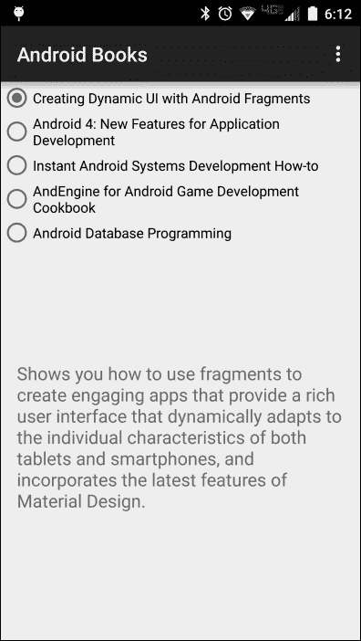

# 第一章。碎片和用户界面模块化

本章介绍了片段、用户界面模块化以及片段在开发模块化用户界面中的作用。本章演示了创建简单的片段和在活动中静态使用片段。

让我们看一下要涵盖的主题:

*   需要一种新的用户界面创建方法
*   变成碎片

到本章结束时，我们将能够在静态活动布局中创建和使用片段。

# 需要一种新的用户界面创建方法

当你成为安卓开发者时，你学习使用的第一个类很可能是`Activity`类。毕竟`Activity`类为你的应用提供了一个用户界面。通过在一个活动中组织你的用户界面组件，活动变成了你在其上绘制你的应用程序杰作的画布。

在安卓的早期，直接在活动中构建应用程序的用户界面效果相当好。大多数早期应用程序具有相对简单的用户界面，不同安卓设备外形的数量很少。在大多数情况下，在一些布局资源的帮助下，单个活动可以在不同的设备外形规格下正常工作。

如今，安卓设备有各种各样的外形，尺寸和形状都有令人难以置信的变化。当您将这一点与现代安卓应用程序的高度交互用户界面相结合时，创建一个单一的活动来有效地管理这些不同形式的用户界面变得极其困难。

一种可能的解决方案是定义一项活动，为设备外形的子集(例如智能手机)提供用户体验。然后，我们可以为不同的外形规格子集定义另一个活动，例如平板电脑。这种方法的问题在于，除了简单地呈现用户界面之外，活动往往还有很多责任。随着多个活动执行本质上相同的任务，我们必须要么复制每个活动中的逻辑，要么通过找到跨活动共享逻辑的方法来增加程序的复杂性，例如创建潜在的复杂继承关系。针对不同的外形规格使用不同活动的方法也大大增加了计划中的活动数量，很容易将所需的活动数量增加一倍或三倍。此外，谷歌材料设计规范的出现进一步增加了每个活动中包含的代码的复杂性。

我们需要一个更好的解决方案，一个允许我们将应用程序的用户界面模块化成我们可以在活动中根据需要排列的部分的解决方案；碎片是解决办法。

Android 片段允许我们将用户界面划分为用户界面组件和逻辑的功能分组。活动可以根据给定设备外形的需要加载和排列片段。这些片段负责外形细节，而活动则管理整个用户界面问题。片段还可以在以简化材料设计应用的方式对用户界面组件进行分组方面发挥重要作用。我们将在[第六章](6.html "Chapter 6. Fragments and Material Design")、*碎片和材料设计*中，来看看碎片在材料设计中的作用。

## 碎片的广阔平台支撑

`Fragment`类在 API 级别 11 (Android 3.0)被添加到 Android 中。这是第一个官方支持平板电脑的安卓版本。平板电脑支持的增加加剧了一个已经很困难的问题。由于安卓设备外形的多样性，开发安卓应用变得越来越困难。

幸运的是，片段为这个问题提供了解决方案。有了片段，我们可以更容易地创建支持各种形式因素的应用程序，因为我们可以将用户界面划分为有效的组件分组及其相关逻辑。

截至本书撰写之时，超过 95%的在用安卓手机支持原生碎片。如果你正在做一个项目，要求你支持不到 5%的不支持本地碎片的设备——那些应用编程接口级别低于 11 的设备——你仍然可以通过安卓支持库的 v4 利用碎片。在安卓支持库 v4 中使用`Fragment`类的细节不在本书范围内；但是，您可以在[上找到使用安卓支持库 v4 中的`Fragment`类的信息。](http://developer.android.com/tools/support-library/index.html)

## 片段如何简化常见的安卓任务

片段不仅简化了我们创建应用程序用户界面的方式，还简化了许多内置的安卓用户界面任务。诸如选项卡式显示、列表显示和对话框等用户界面概念在历史上都有明显不同的方法，尽管它们都是同一概念的变体。每一种都是将用户界面组件和逻辑组合成一个功能组的方式。片段使这个概念正式化，因此允许我们对这些以前完全不同的任务采取一致的方法。我们将在本书后面详细讨论这些问题以及一些专门的片段类，如`DialogFragment`和`ListFragment`。

## 碎片与活动的关系

碎片不会取代活动，而是对其进行补充。片段总是存在于活动中。一个活动实例可以包含任意数量的片段，但是给定的片段实例只能存在于单个活动中。一个片段与它所在的活动紧密相连，这个片段的生命周期与包含它的活动的生命周期紧密相连。我们将在[第 3 章](3.html "Chapter 3. Fragment Life Cycle and Specialization")、*碎片生命周期和特化*中更多地讨论碎片寿命和包含活动之间的密切关系。

我们不想做的一件事是犯一个常见的错误:过度使用片段。通常当有人了解片段时，他们会假设每个活动都必须包含片段；事实并非如此。

当我们阅读这本书时，我们将讨论片段的特性和功能，以及它们工作良好的各种场景。在构建应用程序时，我们总是希望记住这些。在那些碎片增加价值的情况下，我们肯定想使用它们。然而，同样重要的是，我们要避免在应用程序不提供任何价值的情况下使用片段，从而使应用程序复杂化。

## 向碎片转移

虽然碎片是一个非常强大的工具，但它们从根本上做了一些非常简单的事情。片段将用户界面组件及其相关逻辑分组。创建您的用户界面中与一个片段相关联的部分非常类似于为一个活动这样做。在大多数情况下，特定片段的视图层次结构是从布局资源创建的；虽然，就像活动一样，视图层次结构可以通过编程方式生成。

为片段创建布局资源遵循与为活动创建布局资源相同的规则和技术。关键区别在于，我们正在寻找机会，在处理片段时，将我们的用户界面布局划分为可管理的子部分。

开始使用片段的最简单方法是，我们将传统的面向活动的用户界面转换为使用片段。

## 老思维——活动导向

首先，我们先来看看将要转换的应用程序的外观和结构。该应用程序包含一个活动，运行时类似于下面的屏幕截图:



该活动在活动的上部显示五本书的列表。当用户选择其中一本书的标题时，该书的描述会出现在活动的下部。

### 定义活动外观

活动的外观是在名为`activity_main.xml`的布局资源文件中定义的，该文件包含以下布局描述:

```java
<LinearLayout
  xmlns:android="http://schemas.android.com/apk/res/android"
  android:orientation="vertical"
  android:layout_width="match_parent"
  android:layout_height="match_parent">

  <!-- List of Book Titles -->
  <ScrollView
    android:layout_width="match_parent"
    android:layout_height="0dp"
    android:id="@+id/scrollTitles"
    android:layout_weight="1">
    <RadioGroup
      android:id="@+id/bookSelectGroup"
      android:layout_height="wrap_content"
      android:layout_width="wrap_content">
      <RadioButton
        android:id="@+id/dynamicUiBook"
        android:layout_height="wrap_content"
        android:layout_width="wrap_content"
        android:text="@string/dynamicUiTitle"
        android:checked="true" />
      <RadioButton
        android:id="@+id/android4NewBook"
        android:layout_height="wrap_content"
        android:layout_width="wrap_content"
        android:text="@string/android4NewTitle" />

      <!-- Other RadioButtons elided for clarify -->
    </RadioGroup>
  </ScrollView>

  <!-- Description of selected book -->
  <ScrollView
    android:layout_width="match_parent"
    android:layout_height="0dp"
    android:id="@+id/scrollDescription"
    android:layout_weight="1">
    <TextView
      android:layout_width="wrap_content"
      android:layout_height="wrap_content"
      android:textAppearance="?android:attr/textAppearanceMedium"
      android:text="@string/dynamicUiDescription"
      android:id="@+id/textView"
      android:paddingLeft="@dimen/activity_horizontal_margin"
      android:paddingRight="@dimen/activity_horizontal_margin"
      android:gravity="fill_horizontal"/>
  </ScrollView>
</LinearLayout>
```

### 类型

你可以从你在[http://www.packtpub.com](http://www.packtpub.com)的账户下载这本书的示例代码文件。如果您在其他地方购买了这本书，您可以访问[http://www.packtpub.com/support](http://www.packtpub.com/support)并注册，以便将文件直接通过电子邮件发送给您。

您可以按照以下步骤下载代码文件:

*   使用您的电子邮件地址和密码登录或注册我们的网站。
*   将鼠标指针悬停在顶部的 **SUPPORT** 选项卡上。
*   点击**代码下载&勘误表**。
*   在**搜索**框中输入图书名称。
*   选择要下载代码文件的书籍。
*   从您购买这本书的下拉菜单中选择。
*   点击**代码下载**。

下载文件后，请确保使用最新版本的解压缩文件夹:

*   视窗系统的 WinRAR / 7-Zip
*   zipeg/izp/un ARX for MAC
*   适用于 Linux 的 7-Zip / PeaZip

该布局资源合理简单，解释如下:

*   整体布局在包含两个`ScrollView`元素的垂直方向`LinearLayout`元素中定义
*   两个`ScrollView`元素都具有`1`的`layout_weight`值，这使得顶级`LinearLayout`元素在两个`ScrollView`元素之间平分屏幕
*   值为`scrollTitles`的顶部`ScrollView`元素包装了一个包含一系列`RadioButton`元素的`RadioGroup`元素，每本书一个
*   具有`scrollDescription`的`id`值的底部`ScrollView`元素包含一个`TextView`元素，该元素显示所选书籍的描述

### 显示活动界面

应用程序的活动类别为`MainActivity`。为了显示活动的用户界面，我们将覆盖`onCreate`方法并调用`setContentView`方法，通过以下代码传递`R.layout.activity_main`布局资源标识:

```java
protected void onCreate(Bundle savedInstanceState) {
  super.onCreate(savedInstanceState);
  // load the activity_main layout resource
  setContentView(R.layout.activity_main);
}
```

## 新思维:碎片化

如果所有安卓设备都有相同的外形，我们目前拥有的面向活动的用户界面就可以了。正如我们已经讨论过的，事实并非如此。

我们需要对应用程序用户界面进行划分，这样我们就可以切换到面向片段的方法。通过适当的分区，我们可以准备对我们的应用程序进行一些简单的增强，以帮助它适应设备差异。

让我们来看一些简单的改变，这些改变将划分我们的用户界面。

### 创建片段布局资源

转到面向片段的用户界面的第一步是识别现有用户界面中的自然分区。在本应用中，自然分区合理易于识别。书名列表是一个很好的候选，而书籍描述是另一个。我们会把每一个都做成一个独立的片段。

#### 将布局定义为可重用列表

对于书名列表，我们可以选择将片段定义为包含最靠近顶部的`ScrollView`元素(其`id`值为`scrollTitles`)或仅包含该`ScrollView`元素中的`RadioGroup`元素。当创建一个片段时，我们希望以最容易重用片段的方式来构造它。虽然`RadioGroup`元素是我们显示标题列表所需的全部内容，但似乎我们总是希望用户能够在必要时滚动标题列表。在这种情况下，在这个片段中包含`ScrollView`元素是有意义的。

### 注

如果您正在使用Android Studio，您可以使用**新片段**菜单选项，通过选择**新安卓活动**对话框上的**创建布局 XML** 复选框，一步创建片段类和布局资源。

现在，您想取消选中**新安卓活动**对话框的`Include fragment factory`方法和`Include interface callbacks`复选框。取消选中这些复选框将大大简化生成的代码。

在本书的剩余部分，我们将详细讨论Android Studio的这些和许多其他与片段相关的特性。

为了给书单创建一个片段，我们将定义一个名为`fragment_book_list.xml`的新布局资源文件。我们将把顶部`ScrollView`元素及其内容从`activity_main.xml`资源文件复制到`fragment_book_list.xml`资源文件。由此产生的`fragment_book_list.xml`资源文件如下:

```java
<!-- List of Book Titles -->
<ScrollView
  android:layout_width="match_parent"
  android:layout_height="0dp"
  android:id="@+id/scrollTitles"
  android:layout_weight="1">
  <RadioGroup
    android:id="@+id/bookSelectGroup "
    android:layout_height="wrap_content"
    android:layout_width="wrap_content">
  <RadioButton
    android:id="@+id/dynamicUiBook"
    android:layout_height="wrap_content"
    android:layout_width="wrap_content"
    android:text="@string/dynamicUiTitle"
    android:checked="true"/>
  <RadioButton
    android:id="@+id/android4NewBook"
    android:layout_height="wrap_content"
    android:layout_width="wrap_content"
    android:text="@string/android4NewTitle"/>

    <!-- Other RadioButtons elided for clarify -->
  </RadioGroup>
</ScrollView>
```

这为我们提供了一个布局资源，它与用户界面中出现在活动布局资源中的书名部分一致。这是一个好的开始。

#### 最小化假设

一个有效的面向片段的用户界面是用布局资源构建的，布局资源最小化了关于片段在哪里以及如何使用的假设。我们对片段的使用做的假设越少，片段就越容易被重用。

我们现在拥有的`fragment_book_list.xml`资源文件中的布局非常有限，因为它包含了重要的假设。例如，根`ScrollView`元素包含一个值为`0`的`layout_height`属性。这假设片段将被放置在计算片段高度的布局中。

当我们在许多需要`ScrollView`元素指定一个有意义的高度的布局中使用片段时，`0`的`layout_height`属性值会阻止`ScrollView`元素正确渲染。`0`的`layout_height`属性值会阻止片段正确渲染，即使是将片段放置在水平方向的`LinearLayout`元素中这样简单的事情。`layout_weight`属性也有类似的问题。

总的来说，一个好的做法是将片段设计成完全占据它所在的任何空间。这给出了一种布局，在这种布局中，片段对片段的放置和大小具有最大的控制权。

为此，我们将从`ScrollView`元素中移除`layout_weight`属性，并将`layout_height`属性值更改为`match_parent`。由于`ScrollView`元素现在是布局资源的根节点，我们还需要添加`android`名称空间前缀声明。

以下代码片段显示了更新后的`ScrollView`元素:

```java
<ScrollView
  xmlns:android="http://schemas.android.com/apk/res/android"
  android:layout_width="match_parent"
  android:layout_height="match_parent"
  android:id="@+id/scrollTitles">
  <!—RadioGroup and RadioButton elements elided for clarity -->
</ScrollView>
```

有了更新的`ScrollView`元素，片段布局现在可以适应它引用的几乎任何布局。

#### 封装显示布局

对于本书的描述，我们将定义一个名为`fragment_book_desc.xml`的布局资源文件。片段布局包括活动布局资源底部`ScrollView`元素的内容(其`id`值为`scrollDescription`)。就像在书单片段中一样，我们将删除`layout_weight`属性，将`layout_height`属性设置为`match_parent`，并添加`android`命名空间前缀声明。

`fragment_book_desc.xml`布局资源文件如下所示:

```java
<!-- Description of selected book -->
<ScrollView
  xmlns:android="http://schemas.android.com/apk/res/android"
  android:layout_width="match_parent"
  android:layout_height="match_parent"
  android:id="@+id/scrollDescription">
  <TextView
    android:layout_width="wrap_content"
    android:layout_height="wrap_content"
    android:textAppearance="?android:attr/textAppearanceMedium"
    android:text="@string/dynamicUiDescription"
    android:id="@+id/textView"
    android:paddingLeft="@dimen/activity_horizontal_margin"
    android:paddingRight="@dimen/activity_horizontal_margin"
    android:gravity="fill_horizontal"/>
</ScrollView>
```

### 创建片段类

类似于创建活动时，我们需要的不仅仅是一个简单的片段布局定义；我们还需要一节课。

#### 将列表包装成一个片段

所有片段类必须直接或间接扩展`android.app.Fragment`类。

我们将为管理图书列表的片段调用类，即`BookListFragment`。该类将直接扩展`Fragment`类，如下所示:

```java
Import android.app.Fragment;
public class BookListFragment extends Fragment { … }
```

在创建片段的过程中，安卓框架在这个片段上调用了许多方法。其中最重要的是`onCreateView`法。`onCreateView`方法是负责返回片段所代表的视图层次。安卓框架将片段返回的视图层次结构附加到活动整体视图层次结构中的适当位置。

在像`BookListFragment`类这样的情况下，其中`Fragment`类直接继承自`Fragment`类，我们必须覆盖`onCreateView`方法并执行构建视图层次结构所需的工作。

`onCreateView`方法接收三个参数。我们现在只关注前两个:

*   `inflater`:这是对`LayoutInflater`实例的引用，该实例可以在包含活动的上下文中读取和扩展布局资源
*   `container`:这是对活动布局中`ViewGroup`实例的引用，片段的视图层次结构将被附加到该活动布局中

`LayoutInflater`类提供了一个名为`inflate`的方法，该方法处理将布局资源转换为相应视图层次结构的细节，并返回对该层次结构的根视图的引用。使用`LayoutInflater.inflate`方法，我们可以实现我们的`BookListFragment`类‘`onCreateView`方法来构造和返回对应于`R.layout.fragment_book_list`布局资源的视图层次结构，如下面的代码所示:

```java
@Override
public View onCreateView(LayoutInflater inflater, ViewGroup container, Bundle savedInstanceState) {
  View viewHierarchy =
  inflater.inflate(R.layout.fragment_book_list,
    container, false);
  return viewHierarchy;
}
```

您会注意到，在前面的代码中，我们在对`inflate`方法的调用中包含了`container`引用和一个布尔值`false`。`container`参考为`inflate`方法提供了必要的布局参数，以正确设置新视图层次的格式。`false`参数值表示`container`仅用于布局参数。如果该值为`true`，则`inflate`方法还会将新视图层次结构附加到`container`视图组。我们不想将新的视图层次附加到`onCreateView`方法中的`container`视图组，因为活动会处理这个问题。

#### 提供描述片段

对于本书的描述片段，我们将定义一个名为`BookDescFragment`的类。该类与`BookListFragment`类相同，只是`BookDescFragment`类使用`R.layout.fragment_book_desc`布局资源，如下所示:

```java
public class BookDescFragment extends Fragment {
  @Override
  public View onCreateView(LayoutInflater inflater, ViewGroup container, Bundle savedInstanceState) {
    View viewHierarchy = inflater.inflate(R.layout.fragment_book_desc, container, false);
    return viewHierarchy;
  }
}
```

### 将活动转换为使用片段

定义好片段后，我们现在可以更新活动来使用它们。首先，我们将从`activity_main.xml`布局资源文件中移除所有书名和描述布局信息。该文件现在只包含顶级`LinearLayout`元素和注释，以显示书名和描述的归属。代码如下所示:

```java
<LinearLayout
  android:orientation="vertical"
  android:layout_width="match_parent"
  android:layout_height="match_parent"
  xmlns:android="http://schemas.android.com/apk/res/android">

  <!--  List of Book Titles  -->

  <!--  Description of selected book  -->

</LinearLayout>
```

使用`fragment`元素，我们可以通过引用带有`name`属性的片段类名来将片段添加到布局中。例如，我们将引用书单片段的类，`BookListFragment`，如下所示:

```java
<fragment
  android:name="com.jwhh.fragments.BookListFragment"
  android:id="@+id/fragmentTitles"/>
```

我们希望我们的活动用户界面看起来一样，使用片段，就像我们将它转换为使用片段之前一样。为此，我们将向片段元素添加与原始布局中的`ScrollView`元素相同的`layout_width`、`layout_height`和`layout_weight`属性值。

这样，活动的完整布局资源文件`activity_main.xml`现在看起来类似于下面的代码:

```java
<LinearLayout
  android:orientation="vertical"
  android:layout_width="match_parent"
  android:layout_height="match_parent"
  xmlns:android="http://schemas.android.com/apk/res/android">

  <!-- List of Book Titles -->
  <fragment
    android:layout_width="match_parent"
    android:layout_height="0dp"
    android:layout_weight="1"
    android:name="com.jwhh.fragments.BookListFragment"
    android:id="@+id/fragmentTitles"/>

  <!-- Description of selected book -->
  <fragment
    android:layout_width="match_parent"
    android:layout_height="0dp"
    android:layout_weight="1"
    android:name="com.jwhh.fragments.BookDescFragment"
    android:id="@+id/fragmentDescription"/>
</LinearLayout>
```

### 注

如果你正在使用Android Studio，你可能会在`fragment`元素上发现一个`tools:layout`属性。Android Studio使用该属性在图形设计器中提供布局预览。运行应用程序时，它不会影响您的应用程序的外观。

当应用程序运行时，用户界面看起来与完全在活动中定义时完全一样。

# 总结

从面向活动的旧思想到面向碎片的新思想的转变，为我们的应用程序打开了丰富的可能性。片段允许我们更好地组织用户界面的外观和我们用来管理它的代码。有了碎片，我们的应用程序用户界面有了更模块化的方法，使我们摆脱了被一小部分设备的特定功能束缚的束缚，并为我们与当今丰富的设备和未来各种各样的新设备一起工作做好了准备。

在下一章中，我们将构建我们用片段创建的模块化用户界面，使我们的应用程序能够自动适应各种设备外形的差异，只需对我们的应用程序进行最小的更改。