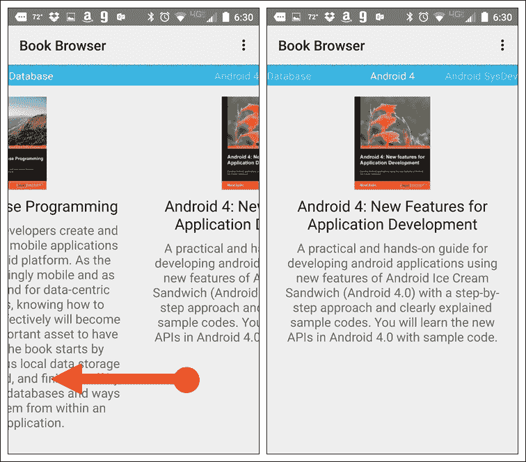
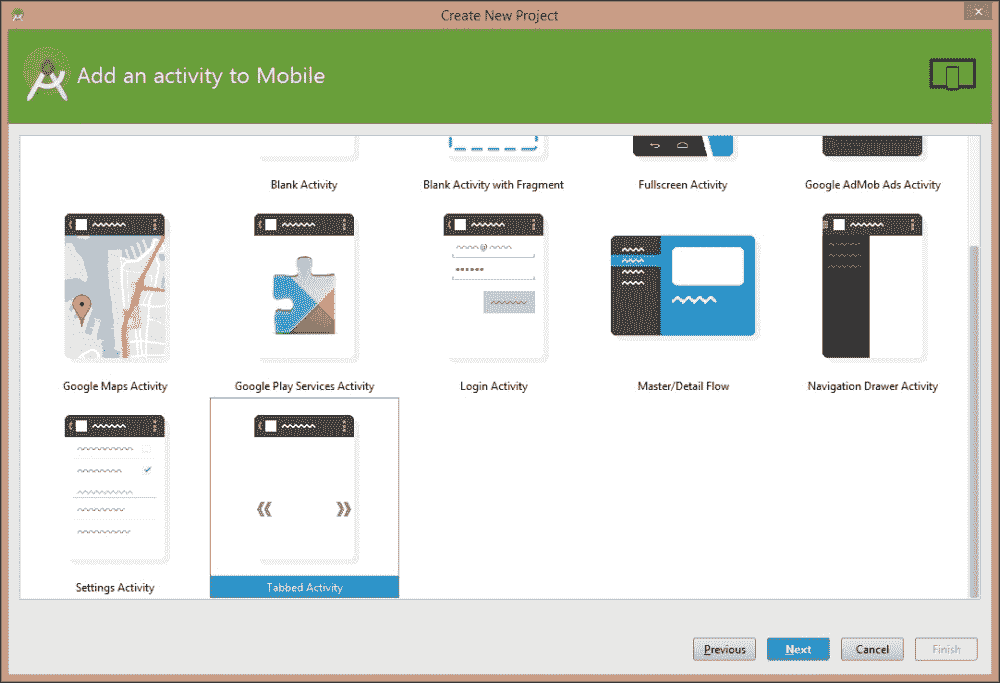
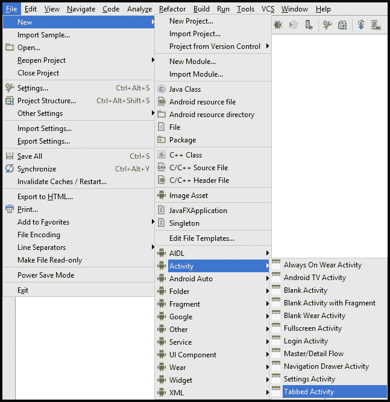
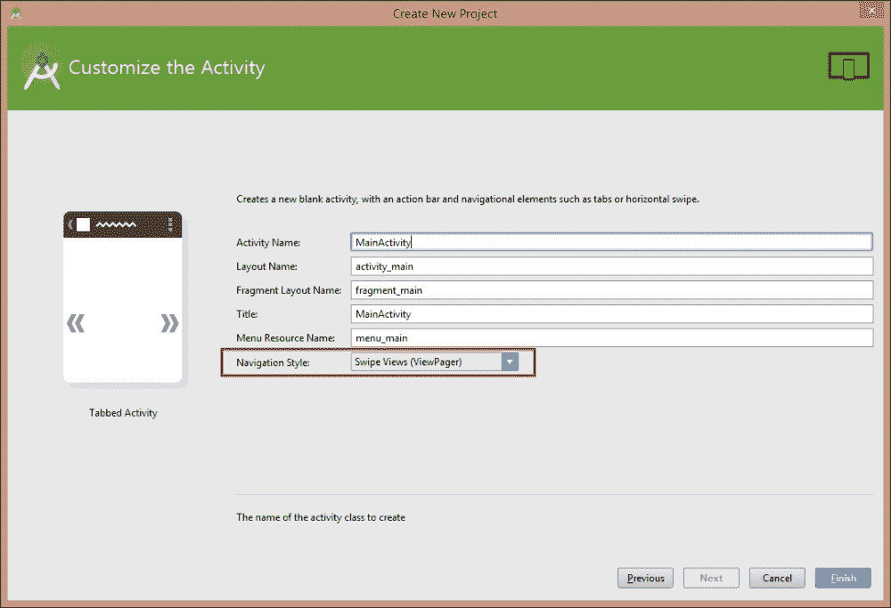
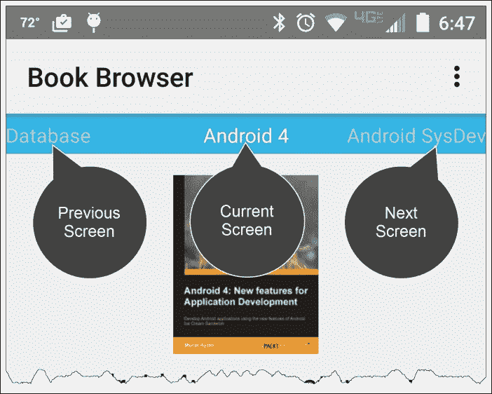
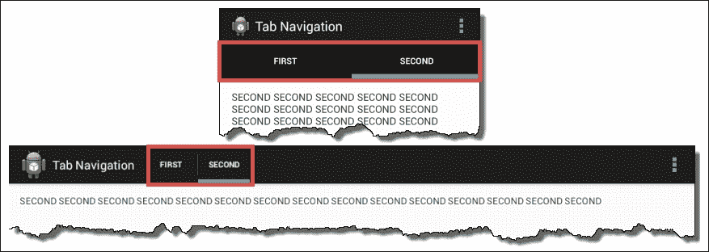
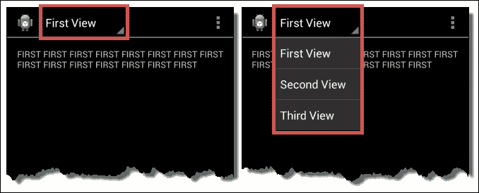
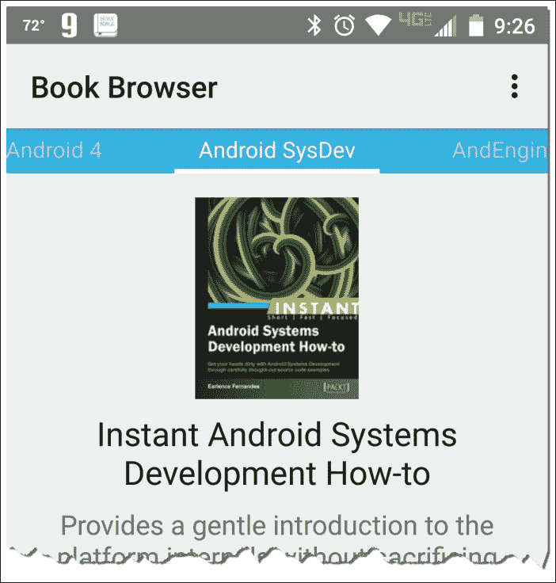

# 第五章。创建丰富的导航

本章演示了片段在创建丰富的用户界面导航体验中的作用。

本章涵盖以下主题:

*   通过滑动使导航变得有趣
*   用`PagerTitleStrip`直接导航少量屏幕
*   带导航抽屉的四个或更多屏幕的直接导航

到本章结束时，我们将能够实现利用片段来提供丰富的用户导航的解决方案，包括滑动导航、带有可点击标题的直接屏幕导航和导航抽屉。

# 一个勇敢的新世界

正如我们所讨论的，片段为我们提供了密切控制和管理应用程序用户界面的能力。通过使用`FragmentTransaction`类的，我们可以通过简单地在不同的片段之间切换，为用户提供从一个屏幕移动到另一个屏幕的体验。这将我们带到一个全新的思维方式:一个勇敢的应用程序设计新世界。

当以这种方式创建用户界面时，活动就像一种屏幕管理器，片段自己实现屏幕。将单个应用程序屏幕作为活动中的片段进行管理的概念非常强大，它已经成为安卓平台一些最引人注目的导航功能的基础。

安卓提供了与这种设计模式相配合的类，使我们能够以简单的方式创建丰富的导航和屏幕管理体验。

# 用刷卡让导航变得有趣

许多应用程序涉及几个屏幕的数据，用户可能想要浏览或翻阅以查看每个屏幕。举个例子，想象一个应用程序，我们列出一个图书目录，目录中的每本书都出现在一个屏幕上。书籍的屏幕包含图像、标题和描述，如下图所示:


要查看每本书的信息，用户需要移动到每本书的屏幕上。我们可以在屏幕上放置一个下一个按钮和一个上一个按钮，但是更自然的操作是用户使用他们的拇指或手指将屏幕从显示屏的一个边缘滑动到另一个边缘，并使包含下一本书信息的屏幕滑动到位，如以下截图所示:



这创造了非常自然的导航体验，老实说，这是一种比使用按钮更有趣的应用导航方式。

## 实现刷卡导航

实现刷卡导航相当简单，碎片是核心。每个屏幕都实现为一个片段派生类。每个屏幕可以是完全不同的片段派生类，或者屏幕可以是具有不同数据的同一个片段派生类的实例。要创建一个图书浏览器应用程序，如前面截图中所示，我们可以使用一个片段派生类，每个片段实例显示所选图书的适当图像、标题和描述。

如同片段的一贯情况，片段实例包含在一个活动中。该活动使用另一个类来提供滑动用户界面行为和管理片段，我们将在本章稍后讨论这个类。当然，所有这些类都可以手动创建并连接在一起，但是如果我们利用Android Studio，这样做要容易得多。

## 增加Android Studio的刷卡导航

使用Android Studio，我们可以创建一个活动，包括提供滑动导航所需的所有部分。不过，Android Studio的命名似乎有点混乱。要使用Android Studio创建支持滑动导航的活动，您必须使用Android Studio选项创建**选项卡式活动**。

创建新项目时，从**中选择**选项卡式活动**将活动添加到移动**对话框，如下图所示:



向现有项目添加活动时，从**新建** | **活动**选项中选择**选项卡式活动**，如下图所示:



无论是创建新项目还是向现有项目添加活动，选择**选项卡式活动**后，Android Studio都会打开 **自定义活动**对话框。在**自定义活动**对话框中，选择**滑动视图(视图页面)**作为**导航样式**值，如下图所示:



点击**完成**按钮，Android Studio生成活动类，包含两个嵌套类:`PlaceholderFragment`和`SectionsPagerAdapter`。

`PlaceholderFragment`类是为每本书呈现屏幕的片段类。我们可以将类名更改为`BookFragment`，并使用与我们在[第 4 章](4.html "Chapter 4. Working with Fragment Transactions")、*处理片段事务*的*管理异步创建*一节中讨论的技术相同的技术来显示片段实例中的每本书。

`SectionsPagerAdapter`类管理用户在片段之间滑动的过程。让我们更详细地看看`SectionsPagerAdapter`课。

### 管理刷卡界面行为

以允许用户在各个片段之间滑动的方式管理各个片段需要一个适配器类。安卓支持库包括两个提供此功能的类:`FragmentPagerAdapter`和`FragmentStatePagerAdapter`。

### 注

v4 和 v13 支持库中都有`FragmentPagerAdapter`和`FragmentStatePagerAdapter`类。在大多数情况下，您应该使用这些类的 v13 支持库版本，因为 v13 支持库版本适用于标准片段和活动类。`FragmentPagerAdapter`和`FragmentStatePagerAdapter`的 v4 支持库版本要求您也使用片段和活动类的支持库版本。

`FragmentPagerAdapter`类对于存在少量片段的场景非常有用。当一个给定的片段实例被创建时，它被直接存储在`FragmentManager`类中，并且每次显示这个片段的页面时，相同的实例被重用。当用户切换到不同的片段时，会调用片段的`onDestroyView`方法，但`onDestroy`方法不会。重要的是，我们只在片段数量相对较少的情况下使用`FragmentPagerAdapter`类，因为我们应该假设一旦创建了片段，只要`FragmentPagerAdapter`实例存在，它就会存在。

`FragmentStatePagerAdapter`类对于存在大量碎片的场景非常有用，因为当碎片不再可见时，它们可能会被销毁。丢弃和重新创建包含的片段的能力也使得`FragmentStatePagerAdapter`类在显示的片段列表可能改变的情况下非常有用。实现可更新的`FragmentStatePagerAdapter`实例的细节超出了本书的范围，但是在[http://bit.ly/UpdateFragmentStatePagerAdapterV2](http://bit.ly/UpdateFragmentStatePagerAdapterV2)有一个例子。

Android Studio生成的`SectionsPagerAdapter`类扩展了`FragmentPagerAdapter`类，可以很好地显示几本书，就像我们在图书浏览器应用程序中所做的那样。`SectionsPagerAdapter`类嵌套在Android Studio生成的活动中，如下代码所示:

```java
public class SectionsPagerAdapter extends FragmentPagerAdapter {
  public SectionsPagerAdapter(FragmentManager fm) {
    super(fm);
  }

  // other members elided for clarity
}
```

注意`SectionsPagerAdapter`类没有标记为静态。作为一个非静态嵌套类，它在 Java 术语中通常被称为内部类，允许`SectionsPagerAdapter`实例访问包含它的活动的成员变量。这很有用，因为书籍数据可以存储在活动中的数组或其他集合中，并且仍然可以由`SectionsPagerAdapter`类直接访问。

`SectionsPagerAdapter`类中覆盖的第一个方法是`getItem`方法，它负责为给定的位置返回适当的片段实例。我们的`getItem`方法只是通过调用`BookFragment.newInstance`方法并在指定位置传递书籍的数据来创建`BookFragment`类的新实例，如以下代码所示:

```java
public Fragment getItem(int position) {
  return BookFragment.newInstance(mTitles[position],
    mDescriptions[position], mTopImageResourceIds[position]);
}
```

下一个要覆盖的方法是`getCount`方法，如下代码所示:

```java
public int getCount() {
  return mTitles.length;
}
```

`getCount`方法负责返回一个指示要显示的屏幕总数的整数值，我们只需从包含书籍标题的数组中返回`length`字段即可。

我们需要覆盖的最后一个`SectionsPagerAdapter`类方法是`getPageTitle`。从`getPageTitle`返回的字符串显示在屏幕顶部附近的蓝色细条中。它通常是一小段文字，向用户显示屏幕内容。如下面的屏幕截图所示，文本对于上一个、当前和下一个屏幕都是可见的:



我们的`getPageTitle`方法实现只是从包含缩短标题列表的数组中返回所请求位置的值，如以下代码所示:

```java
public CharSequence getPageTitle(int position) {
  return mTitlesShort[position];
}
```

实现`SectionsPagerAdapter`类负责管理我们的片段的代码。现在，我们只需要通过将`SectionsPagerAdapter`类连接到适当的用户界面类来将滑动用户界面放置到位。这项工作由活动处理。

### 将滑动界面放置到位

提供刷卡 UI 行为的主要类是安卓支持库的`ViewPager`类。事实上，Android Studio生成的布局资源文件中包含的唯一视图是`ViewPager`类。`ViewPager`类提供了允许用户在各个书籍屏幕之间滑动的所有用户界面功能，但不提供显示从出现在屏幕顶部附近的蓝色条中的`SectionsPagerAdapter.getPageTitle`方法返回的标题文本的功能。为了包含这个功能，我们需要更新布局资源文件，将`PagerTitleStrip`类作为`ViewPager`类的子类包含进来。

更新后的布局资源文件如下图所示所示:

```java
<android.support.v4.view.ViewPager
  xmlns:android="http://schemas.android.com/apk/res/android"
  android:id="@+id/pager"
  android:layout_width="match_parent"
  android:layout_height="match_parent">
  <android.support.v4.view.PagerTitleStrip
    android:id="@+id/pager_title_strip"
    android:layout_width="match_parent"
    android:layout_height="40dp"
    android:layout_gravity="top"
    android:background="#33b5e5"
    android:paddingBottom="4dp"
    android:paddingTop="4dp"
    android:textColor="#fff"/>
</android.support.v4.view.ViewPager>
```

将`PagerTitleStrip`元素的`layout_gravity`属性设置为`top`会将`PagerTitleStrip`定位在`ViewPager`类显示区域的顶部。或者，我们可以将`layout_gravity`属性设置为`bottom`，将`PagerTitleStrip`定位在`ViewPager`类显示区域的底部。

### 注

注意`ViewPager`和`PagerTitleStrip`类来自安卓支持库的 v4。无论是使用 v4 还是 v13 安卓支持库中的`FragmentPagerAdapter`类，都是如此。

我们将把`SectionsPagerAdapter`类连接到活动的`onCreate`方法中的 UI 类，如下面的代码所示:

```java
protected void onCreate(Bundle savedInstanceState) {
  // Code to load the layout and arrays elided for clarity
  mSectionsPagerAdapter = new SectionsPagerAdapter(getFragmentManager());
  mViewPager = (ViewPager) findViewById(R.id.pager);
  mViewPager.setAdapter(mSectionsPagerAdapter);
}
```

在`onCreate`方法加载布局和数组后，`SectionsPagerAdapter`类的实例被创建并分配给`mSectionsPagerAdapter`成员字段。然后，`onCreate`方法检索对由活动布局加载的`ViewPager`类的引用，并将该引用分配给`mViewPager`成员字段。最后，使用`setAdapter`方法将`mSectionsPagerAdapter`与`mViewPager`相关联。请注意，没有设置或与`PagerTitleStrip`交互所需的代码。`ViewPager`类自动检测布局中的`PagerTitleStrip`类，并负责设置标题文本值。

我们现在什么都准备好了。我们的图书浏览器应用已经准备好了；用户现在可以使用滑动导航浏览我们的图书列表。有关完整的代码，请查看本章的代码下载。

# 提供屏幕直接导航

逐一浏览屏幕列表对于用户希望浏览可用屏幕的场景非常有用。然而，有时用户可能更喜欢能够直接导航到特定的屏幕。在本节中，我们将探讨两个选项来提供直接屏幕导航支持。一个选项用于直接导航到少量屏幕，另一个选项用于直接导航到大量屏幕。

## 不要困在过去

在我们看提供直接屏幕导航的解决方案之前，我想指出安卓 Studio 的两个直接屏幕导航功能，大家应该避免。

在本章前面的*使用Android Studio添加滑动导航*部分中使用的**自定义活动**对话框中，**导航样式**选项提供了两个选项，而不是我们选择的**滑动视图(视图页面)**选项。一个选项是**动作栏标签(带 viewproger)**，它创建了一个传统的标签导航样式，使用安卓动作栏，如下图截图所示:



另一个选项是 **动作栏微调器**，它在安卓动作栏内创建一个下拉列表。出现下拉列表，如下图所示:



尽管就在几年前，直接屏幕导航解决方案更倾向于使用操作栏选项卡和微调器，但现在两者都被弃用了。您不应该在任何新的开发中使用这些解决方案。相反，安卓现在提供了其他直接屏幕导航的解决方案，这些解决方案与安卓用户界面的其他方面更加一致。在本章的剩余部分，我们将研究这些更新的直接屏幕导航解决方案。

## 少量屏幕直接导航

虽然基于操作栏的选项卡导航已被弃用，但用户通过点击屏幕标题直接导航到屏幕的功能仍然很有用，因为它对用户来说既简单又直观。安卓通过`PagerTabStrip`类提供这一功能。

`PagerTabStrip`类继承了我们在本章前面的*中使用的`PagerTitleStrip`类，将滑动用户界面放入*部分。将我们的图书浏览器应用程序切换到使用`PagerTabStrip`类而不是`PagerTitleStrip`类，只需将主活动布局资源文件中的`PagerTitleStrip`类替换为`PagerTabStrip`类，如下 XML 布局所示:

```java
<android.support.v4.view.ViewPager
  xmlns:android="http://schemas.android.com/apk/res/android"
  android:id="@+id/pager"
  android:layout_width="match_parent"
  android:layout_height="match_parent">
  <android.support.v4.view.PagerTabStrip
    android:id="@+id/pager_title_strip"
    android:layout_width="match_parent"
    android:layout_height="40dp"
    android:layout_gravity="top"
    android:background="#33b5e5"
    android:paddingBottom="4dp"
    android:paddingTop="4dp"
    android:textColor="#fff"/>
</android.support.v4.view.ViewPager>
```

不需要对我们的应用程序进行其他修改。现在，当我们运行我们的应用程序时，它会出现，如下图所示:



切换到使用`PagerTabStrip`类只会在应用程序的外观上产生很小的不同:当前选定屏幕的标题现在带有下划线。然而，这个应用程序有一个更大的变化。轻按上一个或下一个屏幕的标题会使应用程序直接导航到该屏幕，因此只需轻按一下即可访问屏幕，而无需滑动。如果需要，用户仍然可以在屏幕之间自由滑动。

`PagerTabStrip`类适用于只有两三个屏幕的应用。它可以用于具有大量屏幕的应用程序，但是访问当前屏幕之前或之后的屏幕之外的任何屏幕都需要用户逐屏滑动，就像`PagerTitleStrip`类的情况一样。有效地提供到四个或更多屏幕的直接屏幕导航需要不同的解决方案。

## 四个或更多屏幕的直接导航

提供对多于两个或三个屏幕的直接导航需要有一个查看可用屏幕列表的简单方法。最好的方法之一是使用安卓导航抽屉。

导航抽屉提供了一个屏幕选择列表，当用户轻按操作栏中标题旁边的堆叠栏图标或使用设备显示器边缘附近的滑动动作来拉开导航抽屉时，该列表会从显示器的边缘滑开。

下面的截图显示了我们的图书浏览器应用程序的一个版本，它利用了导航抽屉。导航抽屉在需要时打开，如左侧截图所示，不需要时隐藏，如右侧截图所示:


### 用Android Studio创建导航抽屉活动

虽然可以手动设置活动来使用导航抽屉，但我建议您利用Android Studio的**导航抽屉活动**功能，该功能在**将活动添加到移动设备**对话框和本章前面*添加Android Studio的滑动导航*部分显示的**新活动**菜单上都可用。

Android Studio负责生成设置导航抽屉所需的锅炉板代码和与活动的关联交互。使用Android Studio设置一个导航抽屉大大减少了您必须编写的代码量。

Android Studio的**导航抽屉活动**功能生成三个类:

*   活动课
*   名为`PlaceHolderFragment`的应用程序屏幕片段类，嵌套在活动中
*   名为`NavigationDrawerFragment`的导航抽屉的片段类，它是一个独立的类

### 活动和应用屏幕片段

由于片段的行为一致而不考虑它们是如何显示的，我们可以简单地将`PlaceHolderFragment` 嵌套类的名称更改为`BookFragment`，并像本章前面所做的那样实现它。

活动的作用是设置导航抽屉，然后响应用户的导航抽屉选择显示适当的`BookFragment`实例。该活动使用`DrawerLayout`类来管理导航抽屉显示，如以下 XML 布局所示:

```java
<android.support.v4.widget.DrawerLayout
  xmlns:android= "http://schemas.android.com/apk/res/android"
  xmlns:tools="http://schemas.android.com/tools"
  android:id="@+id/drawer_layout"
  android:layout_width="match_parent"
  android:layout_height="match_parent"
  tools:context=".MainActivity">
  <FrameLayout android:id="@+id/container"
    android:layout_width="match_parent"
    android:layout_height="match_parent" />
  <fragment android:id="@+id/navigation_drawer"
    android:layout_width="@dimen/navigation_drawer_width"
    android:layout_height="match_parent"
    android:layout_gravity="start"
    android:name="com.jwhh.bookdrawer.NavigationDrawerFragment"
    tools:layout="@layout/fragment_navigation_drawer" />
</android.support.v4.widget.DrawerLayout> t:
```

`DrawerLayout`元素有两个子元素:`FrameLayout`和`fragment`。`FrameLayout`元素是应用程序屏幕的占位符，也是当前选定的 `BookFragment`实例的显示位置。`fragment` 元素处理显示导航抽屉的`fragment`类别:`NavigationDrawerFragment`。`start`的`fragment`元素的`layout_gravity`属性值表示导航抽屉应该从设备显示的开始边缘滑入和滑出，这是大多数文化的左侧边缘。

该活动以`onCreate`方法处理设置工作，如下代码所示:

```java
protected void onCreate(Bundle savedInstanceState) {
  // Code to load the layout and arrays elided for clarity
  mNavigationDrawerFragment = (NavigationDrawerFragment)
    getFragmentManager().findFragmentById(R.id.navigation_drawer);
  mNavigationDrawerFragment.setUp(
    R.id.navigation_drawer,
    (DrawerLayout) findViewById(R.id.drawer_layout));
}
```

`onCreate`方法处理了加载活动布局和数组资源的标准行为后，通过从布局中检索导航抽屉片段并调用导航抽屉的`setUp`方法来启动导航抽屉的设置工作。我们将在本章后面的*导航绘图组件类*的附加责任部分详细讨论`setUp`方法。

为了响应用户的导航抽屉选择，该活动实现了在`NavigationDrawerFragment`类中定义的`NavigationDrawerCallbacks`界面。该接口有一个方法，`onNavigationDrawerItemSelected`，在活动中实现，如下代码所示:

```java
public class MainActivity extends Activity
  implements NavigationDrawerFragment.NavigationDrawerCallbacks {
  public void onNavigationDrawerItemSelected(int position) {
    mTitle = mTitles[position];

    BookFragment newFragment = BookFragment.newInstance(
      mTitles[position], mDescriptions[position],
      TopImageResourceIds[position]);

    FragmentManager fragmentManager = getFragmentManager();
    fragmentManager.beginTransaction()
      .replace(R.id.container, newFragment)
      .commit();
  }

  // other members elided for clarity
}
```

`onNavigationDrawerItemSelected`方法将`mTitle`字段设置为当前所选图书的标题，通过为所选图书传入适当的值来创建`BookFragment`类的实例，然后使用`FragmentTransaction`在活动视图中显示新创建的`BookFragment`实例，其标识值为`R.id.container`，这是活动布局资源的`FrameLayout`。

该活动唯一其他重要的导航抽屉相关职责是在`onCreateOptionsMenu`方法中，如以下代码所示:

```java
public boolean onCreateOptionsMenu(Menu menu) {
  if (!mNavigationDrawerFragment.isDrawerOpen()) {
    getMenuInflater().inflate(R.menu.main, menu);
    ActionBar actionBar = getActionBar();
    actionBar.setDisplayShowTitleEnabled(true);
    actionBar.setTitle(mTitle);
    return true;
  }
  return super.onCreateOptionsMenu(menu);
}
```

活动仅负责在导航栏关闭时管理 app 栏；因此，`onCreateOptionsMenu`方法从验证导航抽屉当前没有打开开始。只要导航抽屉没有打开，`onCreateOptionsMenu`方法负责膨胀菜单并显示当前选择的标题。`NavigationDrawerFragment`类触发每次新用户选择时选项菜单的刷新，然后触发对`onCreateOptionsMenu`方法的调用，允许选项菜单和动作栏标题反映当前选择的适当信息。

### 导航抽屉碎片

`NavigationDrawerFragment`班有双重身份。总的来说，它是一个标准的片段，所有的责任都伴随着片段。作为导航抽屉片段，`NavigationDrawerFragment`类也有一些与管理导航抽屉相关的特殊职责。

#### 导航抽屉碎片标准职责

就像通常的片段的情况一样，`NavigationDrawerFragment`类负责创建自己的布局。布局可以是任何你想要的，但它通常是一个标准的`ListView`视图，只允许一个选择。

使用`ListView`，`NavigationDrawerFragment`类可以通过简单地用`ArrayAdapter`从数组中加载选项来显示可用选项的列表。在我们的图书浏览器应用程序中，这是一个包含图书标题列表的数组。然后通过处理`ListView`类的`onItemClick`回调方法将用户选择通知给`NavigationDrawerFragment`类。在`NavigationDrawerFragment`类的情况下，`onItemClick`回调方法调用`NavigationDrawerFragment`类的`selectItem`方法来执行处理用户选择的细节。下一节我们来看看`selectItem`方法。

除了一些其他的小家务，这照顾到了`NavigationDrawerFragment`类的标准职责。现在让我们来看看处理导航抽屉带来的额外责任。

#### NavigationDrawerFragment 类的附加职责

包含在导航抽屉中的`NavigationDrawerFragment`类负责响应抽屉可见性的变化，并通知用户选择的活动。

为了了解`NavigationDrawerFragment`类如何处理这些额外的责任，我们将从`NavigationDrawerFragment`类的`setUp`方法开始。正如我们之前在本章的*活动和应用程序屏幕片段*部分所讨论的那样，`NavigationDrawerFragment`类的`setUp`方法是从活动的`onCreate`方法中调用的。活动传入容器的标识值，其中显示了应用程序屏幕片段，以及对`DrawerLayout`实例的引用。

出现`setUp`方法，如下代码所示:

```java
public void setUp(int fragmentId, DrawerLayout drawerLayout) {
  mFragmentContainerView = getActivity().findViewById(fragmentId);
  mDrawerLayout = drawerLayout;
  mDrawerLayout.setDrawerShadow(
    R.drawable.drawer_shadow, GravityCompat.START);

  ActionBar actionBar = getActionBar();
  actionBar.setDisplayHomeAsUpEnabled(true);
  actionBar.setHomeButtonEnabled(true);

  mDrawerToggle = new ActionBarDrawerToggle(
    getActivity(),
    mDrawerLayout,
    R.drawable.ic_drawer,
    R.string.navigation_drawer_open,
    R.string.navigation_drawer_close)
  {
    @Override
    public void onDrawerClosed(View drawerView) {
      // implementation elided for clarity
    }
    @Override
    public void onDrawerOpened(View drawerView) {
      // implementation elided for clarity
    }
  };

  if (!mUserLearnedDrawer && !mFromSavedInstanceState) {
    mDrawerLayout.openDrawer(mFragmentContainerView);
  }

  mDrawerLayout.post(new Runnable() {
    @Override
    public void run() {
      mDrawerToggle.syncState();
    }
  });
  mDrawerLayout.setDrawerListener(mDrawerToggle);
}
```

`onCreate`方法首先存储对应用程序屏幕容器和`DrawerLayou` t 实例的引用，然后设置`DrawerLayout`在导航抽屉周围显示阴影。接下来的三行获取对动作栏的引用，然后启用与动作栏左侧边缘的图标的交互，以打开和关闭导航抽屉。创建一个`ActionBarDrawerToggle`派生的匿名类来处理导航抽屉片段的`open`和`close`事件。`onCreate`方法的最后一行将匿名类实例关联为抽屉布局的侦听器。

一段看起来有点不寻常的代码是对`syncState`方法的调用，它被包装在`post`方法调用中。`syncState`方法确保正在监听抽屉`open`和`close`事件的类与导航抽屉的打开或关闭状态同步。将`syncState`方法调用包装在`post`方法调用中可确保活动恢复后状态同步。

`ActionBarDrawerToggle`派生的匿名类的主要职责是保持动作栏标题和选项项与导航抽屉打开和关闭状态的变化同步。处理正在打开的抽屉的代码在`onDrawerOpened`方法中，实现如下代码所示:

```java
public void onDrawerOpened(View drawerView) {
  super.onDrawerOpened(drawerView);
  if (!isAdded()) {
    return;
  }
  if (!mUserLearnedDrawer) {
    mUserLearnedDrawer = true;
    SharedPreferences sp = PreferenceManager
      .getDefaultSharedPreferences(getActivity());
    sp.edit().putBoolean(PREF_USER_LEARNED_DRAWER, true).apply();
  }
  getActivity().invalidateOptionsMenu
}
```

前几行只是调用`super`类实现，然后验证片段是否与导航抽屉相关联。下一个`if`块使用偏好管理器来跟踪用户是否见过导航抽屉。这个代码是必要的，这样导航抽屉可以在应用程序第一次执行时自动打开，让用户知道导航抽屉的存在。`onDrawerOpened`方法的主要目的是最后一行，它使操作栏选项菜单无效。使选项菜单无效会触发对活动类和`NavigationDrawerFragment`类中`onCreateOptionsMenu`方法的调用，使这些类有机会更新动作栏以反映用户的当前选择。

现在我们来看看`ActionBarDrawerToggle`派生类的‘`onDrawerClosed`方法，实现如下代码所示:

```java
public void onDrawerClosed(View drawerView) {
  super.onDrawerClosed(drawerView);
  if (!isAdded()) {
    return;
  }
  getActivity().invalidateOptionsMenu();
}
```

注意，除了与偏好管理器交互的代码之外，`onDrawerClosed`方法基本上完成了与`onDrawerOpened`方法相同的工作；它调用基类实现，验证片段是否与导航抽屉相关联，然后使 options 菜单无效。

为了理解选项菜单无效的原因，我们先来看看`NavigationDrawerFragment`类的`onCreateOptionsMenu`方法实现，如下代码所示:

```java
public void onCreateOptionsMenu(Menu menu, MenuInflater inflater) {
  if (mDrawerLayout != null && isDrawerOpen()) {
    inflater.inflate(R.menu.global, menu);
    ActionBar actionBar = getActionBar();
    actionBar.setDisplayShowTitleEnabled(true);
    actionBar.setTitle(R.string.app_name);
  }
  super.onCreateOptionsMenu(menu, inflater);
}
```

`onCreateOptionsMenu`方法从检查导航抽屉是否打开开始。只要抽屉打开，该方法就会展开全局选项菜单，该菜单只包含那些独立于任何特定应用程序屏幕的选项。`if`块中的其余代码在动作栏中显示应用程序名称。

正如您将从本章前面的*活动和应用程序屏幕片段*部分回忆到的，活动的`onCreateOptionsMenu`方法仅在抽屉关闭时执行其工作。正如我们刚刚看到的，`NavigationDrawerFragment`类的`onCreateOptionsMenu`方法只在抽屉打开时起作用。这两个`onCreateOptionsMenu`方法实现相结合，以确保选项菜单和标题总是被适当地呈现。活动实现将选项菜单和标题设置为当前可见应用程序屏幕的适当状态。但是，当导航抽屉打开时，抽屉会覆盖应用屏幕；因此，`NavigationDrawerFragment`类的实现将选项菜单和标题设置为全局状态，以反映当前没有可见的应用程序屏幕。

我们要看的最后一个`NavigationDrawerFragment`类方法是`selectItem`方法。这是用户每次从导航抽屉中进行选择时调用的方法。`selectItem`方法实现如下代码所示:

```java
private void selectItem(int position) {
  mCurrentSelectedPosition = position;
  if (mDrawerListView != null) {
    mDrawerListView.setItemChecked(position, true);
  }
  if (mDrawerLayout != null) {
    mDrawerLayout.closeDrawer(mFragmentContainerView);
  }
  if (mCallbacks != null) {
    mCallbacks.onNavigationDrawerItemSelected(position);
  }
}
```

该方法通过存储用户选择的项目的位置，然后将该项目设置为导航抽屉中的高亮项目来开始。然后，该方法关闭抽屉，将其移出主应用程序屏幕。最后，该方法通过调用`NavigationDrawerCallbacks.onNavigationDrawerItemSelected`方法的活动实现来通知活动用户的选择。正如我们在本章的*活动和应用程序屏幕片段*部分所讨论的那样，`onNavigationDrawerItemSelected`方法的活动实现处理显示与用户选择相关联的`BookFragment`实例的细节。

#### 导航抽屉碎片职责大图

正如我们所看到的，在细节层面上，`NavigationDrawerFragment`类有许多不同的任务，但它们都归结为一些简单的职责:

*   填充和显示选项列表
*   当导航抽屉的状态改变时，触发对动作栏选项和标题的更新
*   抽屉打开时，将标题和选项设置为全局状态
*   当用户做出选择时，关闭抽屉并通知活动

最终，`NavigationDrawerFragment`类为用户提供了一种直接导航到应用程序屏幕列表的简单方法。真的是这么简单。

# 总结

碎片是现代安卓应用开发的基础，允许我们在一次活动中显示多个应用屏幕。由于片段提供的灵活性，我们现在可以相对轻松地将丰富的导航功能整合到我们的应用程序中。使用这些丰富的导航功能，我们能够创建更动态的用户界面体验，使我们的应用程序更加引人注目，用户会发现使用起来更加直观和有趣。

在下一章中，我们将讨论如何通过材料设计进一步改进我们的应用程序。使用材质设计，我们将为我们的应用程序提供更吸引人的视觉外观，并在片段之间移动时融入丰富的动画过渡。