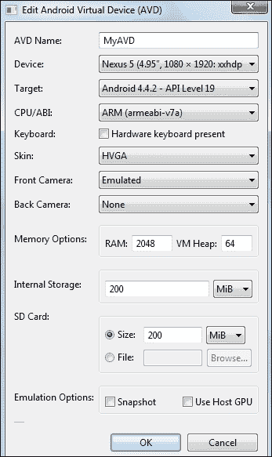
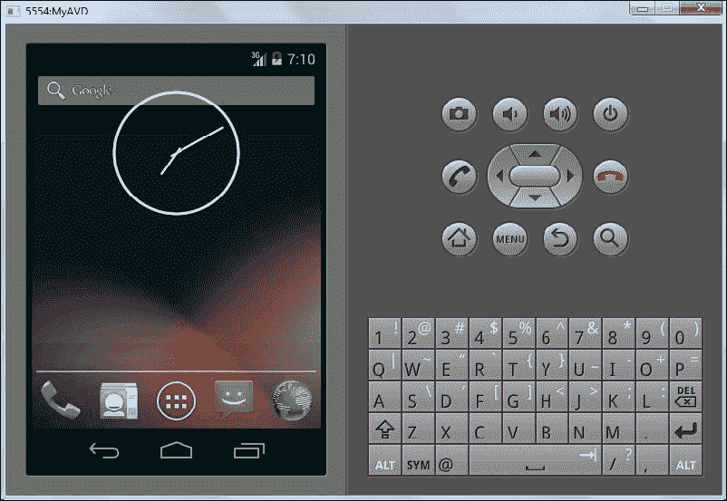
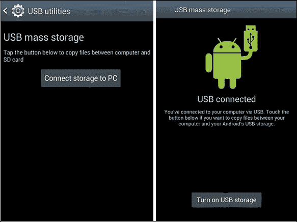
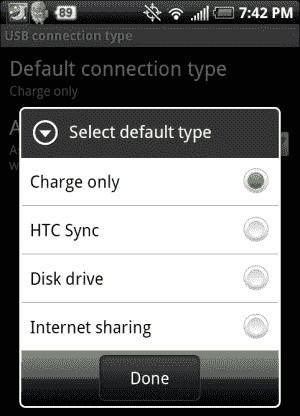

# 二、设置安卓取证环境

在开始任何法医检查之前，建立一个既定的法医环境至关重要。法医分析师需要始终完全控制工作站。这一章将带你了解检查安卓设备所必需的一切。在本章中，我们将涵盖以下主题:

*   在工作站上安装必要的软件
*   从工作站连接和访问安卓设备
*   在设备上使用 ADB 命令
*   扎根安卓设备

# 安卓取证设置

在开始任何调查之前，建立一个良好的控制良好的法医环境至关重要。从一台新鲜的**无菌**电脑开始。一台合法无菌的计算机可以防止潜在的交叉污染，不会引入不需要的数据，并且没有病毒和其他恶意软件。这是为了确保机器上的软件不会干扰当前的调查。安装基础软件，如以下软件；它们是连接设备和执行分析所必需的:

*   安卓 SDK
*   移动驱动程序
*   微软办公软件包
*   用于分析的工具

# 安卓 SDK

重要的是，我们从安卓软件开发工具包开始讨论。安卓**软件开发工具包** ( **软件开发工具包**)帮助开发人员构建、测试和调试在安卓上运行的应用。它包括软件库、API、模拟器、参考资料和许多其他工具。这些工具不仅有助于创建安卓应用，还提供了文档和实用程序，对安卓设备的取证分析有很大帮助。对安卓软件开发工具包有充分的了解可以帮助你理解设备的细节。这反过来会在调查过程中帮助你。

在法医检查期间，软件开发工具包帮助我们连接设备并访问设备上的数据。大多数环境都支持软件开发工具包，包括视窗、Linux 和操作系统十。它可以从 http://developer.android.com/sdk/index.html T2 免费下载。

## 安装安卓软件开发工具包

谷歌现在只提供Android Studio和 SDK 工具作为下载选项。Android Studio包含了安卓 IDE、SDK 工具、安卓 5.0(棒棒糖)平台、带有谷歌 API 的安卓 5.0 系统镜像等新推出的功能。但是，对于法医实验室设置，仅下载 SDK 工具包就足够了。以下是在 Windows 8 机器上安装安卓软件开发工具包的分步过程:

1.  在开始安装 Android SDK 之前，请确保系统已经安装了 **Java 开发工具包** ( **JDK** ) ，因为 Android SDK 依赖于 Java SE 开发工具包。JDK 可从[http://www . Oracle . com/technetwork/Java/javase/downloads/index . html](http://www.oracle.com/technetwork/java/javase/downloads/index.html)下载。根据您的操作系统选择正确的下载。
2.  从[http://developer.android.com/sdk/index.html](http://developer.android.com/sdk/index.html)下载最新版本的 SDK 工具包。推荐下载`.exe`版本的包。
3.  Run the installer file downloaded in step 2\. A wizard window will appear, as shown in the following screenshot. Then, click on **Next**.

    

    安卓软件开发工具包安装向导

4.  设置会自动检测系统上是否安装了 Java，选择 Java 安装的路径。
5.  Choose the installation location and remember it for future use. In this example, we will install it in `C:\Program Files (x86)`. In the case of a 32-bit operating system, the default location would be `C:\Program Files`. All the necessary files will be extracted to this location, as shown in the following screenshot:

    

    安卓软件开发工具包工具安装

6.  Once the installation is complete, open the `C:\Program Files (x86)\Android\android-sdk` directory and double-click on `SDK Manager.exe`. Make sure that you select the Android SDK Platform tools and any one release platform version of Android, as shown in the following screenshot. Some of the items are automatically selected. For instance, Google USB Driver is necessary to work with Android devices on Windows and is selected by default. Accept the license terms and then proceed to install it by clicking the **Install** button:

    

    安卓软件包安装

前面过程的最后一步需要一些时间来完成。一旦完成，安卓软件开发工具包安装就完成了。现在，您可以通过指向可执行文件来更新系统的环境变量(路径)。

### 注

最小的 ADB 和快速启动工具，只有 2 MB 大小，可以在 XDA 论坛([http://forum.xda-developers.com/showthread.php?t=2317790](http://forum.xda-developers.com/showthread.php?t=2317790))免费获得，无需安装完整的安卓 SDK 即可使用。这个工具是一个 Windows 安装程序，可以快速方便地安装最新版本的 ADB 和快速启动。

## 安卓虚拟设备

安装安卓软件开发工具包后，您可以创建一个 **安卓虚拟设备** ( **AVD** )，这是一个运行在工作站上的**仿真器** 。开发人员在创建新应用时经常使用模拟器。然而，仿真器在取证调查期间也被认为是有帮助的。它允许研究者了解某些应用的行为以及应用的安装如何影响设备。另一个优点是，您可以设计一个具有所需版本的仿真器。这在使用运行在旧版本安卓系统上的设备时尤其有用。此外，AVD 默认带有根目录。

以下步骤将引导您在工作站上创建一个 AVD :

1.  Open command prompt (`cmd.exe`). To start AVD manager from the command line, navigate to the path where SDK is installed and call the android tool with the `avd` option as shown here:

    ```py
    C:\Program Files (x86)\Android\android-sdk\tools>android avd

    ```

    这将自动打开 AVD 管理器，如下图所示。也可以使用图形 AVD 管理器启动 AVD 管理器。要启动它，导航到安装 SDK 的位置，双击`AVD Manager`。

    

    安卓虚拟设备管理器

2.  Click on **Create** in the **AVD Manager** window to create a new virtual device. Click on **Edit** to change the configuration of an existing virtual device, as shown in the following screenshot:

    

    AVD 详细信息

3.  根据以下信息输入必要的详细信息:
    *   **AVD 名称**:为虚拟设备提供任意名称，例如`MyAVD`。
    *   **设备**:根据屏幕大小从可用选项中选择任意设备。
    *   **目标**:该选项帮助您选择设备的平台。请注意，只有那些在软件开发工具包安装过程中选择和安装的版本才会显示在这里供您选择。平台版本可以根据被扣押设备的操作系统进行选择。对于我们的例子，选择了 Android 4.4.2 平台。
    *   **硬件**:可以选择硬件特性来定制仿真器，比如内存、SD 卡的大小等等。同样，可以基于对应于被检设备的细节来选择诸如屏幕分辨率、硬件等细节。
4.  完成后，**屏幕出现，新创建的 AVD 列在**安卓虚拟设备**标签下。选择自动电压调节器，点击**启动**。然后，点击**启动**。**
***   The emulator will be automatically launched. This could take several minutes, depending on the workstation's CPU and RAM. Here is a screenshot of an AVD after its successful launch:

    

    安卓模拟器** 

 **仿真器可以是用来配置电子邮件账户、安装应用、上网、发送短信等等。通过利用模拟器并检查网络、文件系统和数据工件，法医分析师和安全工程师可以了解大量关于安卓及其运行方式的信息。在模拟器上工作时创建的数据存储在您的主目录中，名为. android 的文件夹中。例如，在我们的示例中，我们之前创建的`MyAVD`模拟器的详细信息存储在`C:\Users\Rohit\.android\avd\MyAVD.avd`中。这个目录下有几个文件，下面是法医分析师感兴趣的一些文件:

*   `cache.img`:这是`/cache`分区的磁盘镜像。
*   `sdcard.img`:这是 SD 卡分区的磁盘镜像。
*   `Userdata-qemu.img`:这是`/data`分区的磁盘镜像。`/data`分区包含关于设备用户的有价值的信息。
*   `config.ini`:这是在 AVD 的本地目录下存储硬件选项的配置文件。
*   `emulator-user.ini`:该文件包含可以重置窗口位置的值。
*   `Androidtool.cfg`:这个文件可以用来手动设置安卓 SDK 的代理设置。

# 从工作站连接和访问安卓设备

为了从安卓设备中提取信息，它首先需要连接到工作站。如前所述，应注意确保工作站无菌且仅用于调查目的。一个法医无菌工作站是一个有适当的建设，没有病毒和其他恶意软件。当设备连接到计算机时，可以对设备进行更改。因此，法医始终保持对设备的控制至关重要。在移动取证领域，使用写保护机制可能没有太大帮助，因为它们会阻止设备的成功获取。这是因为在采集过程中，需要向设备推送某些命令来提取必要的数据。

## 识别设备电缆

安卓设备可以使用设备的物理 USB 接口连接到工作站。该物理 USB 接口允许设备从计算机连接、共享数据和充电。USB 接口可能因制造商而异，也可能因设备而异。有不同的类型，如迷你 USB、微型 USB 和其他专有格式。以下是最广泛使用的连接器类型的简要描述:

<colgroup><col> <col></colgroup> 
| 

连接器类型

 | 

描述

 |
| --- | --- |
| 迷你 usb | 尺寸约为 7×3 毫米，一条长边的两个角被抬起。 |
| 微型 usb | 尺寸约为6×1.5mm，两角切掉形成梯形。 |
| 同轴的 | 它有一个圆形的孔，中间有一个销钉。有不同的尺寸，直径从 2 到 5 毫米不等。这种类型广泛用于诺基亚车型。 |
| 微型 | 它有两个圆角的矩形。矩形的长度有所不同，但高度总是在 1.5 到 2 毫米之间。这种类型主要用于三星和 LG 设备。 |

因此，采集的第一步是确定需要哪种设备电缆。

## 安装设备驱动程序

只有在计算机上安装了必要的设备驱动程序时，移动设备才能与计算机通信。如果没有必要的驱动程序，计算机可能无法识别和使用连接的设备。由于安卓系统可能会被制造商修改和定制，因此没有一个通用的驱动程序可以适用于所有的安卓设备。每个制造商都有自己的专有驱动程序，并与手机一起分发。因此，确定需要安装的特定设备驱动程序非常重要。当然，一些安卓取证工具包附带了一些通用驱动程序或一组最常用的驱动程序。它们可能不适用于所有型号的安卓手机。一些 Windows 操作系统能够在设备插入后自动检测并安装驱动程序，但 Windows 通常会出现故障。每个制造商的设备驱动程序都可以在各自的网站上找到。

## 访问设备

安装好必要的设备驱动后，将安卓设备连接到电脑上，直接使用 USB 线即可访问。使用真正的制造商专用电缆非常重要，因为通用电缆可能无法正常用于某些设备。此外，调查人员可能会遇到某些驾驶员问题。某些设备可能与 USB 3.0 不兼容，这可能会导致驱动程序安装失败。在这种情况下，建议您尝试切换到 USB 2.0 端口。连接设备后，它将显示为新驱动器，您可以访问外部存储上的文件。除非在设备上启用**将存储设备连接到电脑**选项(导航至**设置** | **通用串行总线实用程序**，否则某些较旧的安卓设备可能无法访问。这种情况下，通过 USB 连接设备后，需要选择**开启 USB 存储**选项，如下图截图所示:



USB 大容量存储连接

这是因为较旧的安卓设备需要 USB 大容量存储模式来在计算机和设备之间传输文件。最新的安卓设备使用**媒体传输协议** ( **MTP** ) 或 **图片传输协议** ( **PTP** )，因为 USB 大容量存储协议存在一些问题。有了 USB 大容量存储，驱动器可以完全供计算机使用，就像它是一个内置驱动器一样。

但是，问题是访问存储的设备需要独占访问。换句话说，当设备驱动器连接到计算机时，它必须与设备上运行的安卓操作系统断开连接才能工作。因此，当它连接到计算机时，存储在 SD 卡或 USB 存储上的任何文件或应用都将不可用。在 MTP，安卓设备不会将其全部存储暴露给视窗系统。相反，当您将设备连接到计算机时，计算机会查询该设备，设备会以它提供的文件和目录列表作为响应。如果计算机必须下载文件，它会从设备向文件发送请求，设备会通过连接发送文件。PTP 也类似于 MTP，通常被数码相机使用。在这种模式下，安卓设备将与支持 PTP 但不支持 MTP 的数码相机应用一起工作。在最新的设备上，您可以通过转到**设置** | **存储** | **USB 计算机连接**来选择 MTP 或 PTP 选项。

### 类型

在一些安卓设备上，选择 MTP 和 PTP 协议的选项仅在设备连接到计算机后提供。连接设备后，注意屏幕顶部的通知栏，您会看到一个 USB 符号出现。下拉通知栏，您会发现一个在 MTP 和 PTP 之间切换的选项。

如下图所示， **MTP** 和 **PTP** 选项只有在将设备连接到电脑并下拉通知栏后才会显示:


安卓设备中的通用串行总线连接

在某些安卓设备的情况下(尤其是带有 HTC 的设备)，当使用 USB 电缆连接时，该设备可能会暴露多个功能。例如，如下图所示，当一个 HTC 设备连接到工作站时，它呈现一个菜单，有四个选项:



HTC 设备上的磁盘驱动器选项

默认选择为**仅充电**。当选择**磁盘驱动器**选项时，它作为磁盘驱动器安装。当设备作为磁盘驱动器安装时，您将能够访问设备上的 SD 卡。

从法医的角度来看，SD 卡具有重要价值，因为它可能包含对调查很重要的文件。大多数与多媒体相关的图像和大文件都存储在这个外部存储器中。SD 卡通常使用 FAT16 文件系统格式化，但是您也可能会遇到一些带有 FAT32 和其他文件系统的 SD 卡。正如[第 1 章](1.html "Chapter 1. Introducing Android Forensics")*介绍安卓取证*中所讨论的，请注意，最近的大多数设备都有模拟 SD 卡功能，该功能使用设备的 NAND 闪存来创建不可移动的 SD 卡。因此，所有存在于外部存储器上的敏感文件都可以通过这种方式访问。但是`/data/data`下存储的核心应用数据会保留在设备上，无法通过这种方式访问。

# 安卓调试桥

在安卓取证中，**安卓调试桥** ( **ADB** ) 起着非常关键的作用。它存在于`<sdk_path>/platform-tools`处。为了与亚行合作，需要启用 **USB 调试**选项。在三星手机上，您可以通过转到**设置** | **开发者**选项来访问此功能；如下图所示:


安卓系统中的 USB 调试选项

但是，并非所有设备都是如此，因为不同的设备具有不同的环境和配置特征。有时，审查员可能不得不使用某些技术来访问一些设备上的开发者选项。这些技术是特定于设备的，需要由法医分析师根据设备类型和型号进行研究和确定。

### 注

在某些设备上，**开发者选项**菜单被隐藏，可通过点击**构建编号**字段(导航至**设置** | **关于设备** ) *七次*来打开。

选择 **USB 调试**选项后，设备将在后台运行 **adb 守护程序** ( **adbd** ) ，并持续寻找 USB 连接。守护程序通常在非特权 shell 用户帐户下运行，因此不提供对内部应用数据的访问。然而，在根手机上，adbd 将在根帐户下运行，从而提供对整个数据的访问。在安装了 Android SDK 的工作站上，adbd 将作为后台进程运行。此外，在同一工作站上，将运行一个客户端程序，可以通过发出`adb`命令从外壳中调用该程序。我们将在下面的章节中看到这一点。当 adb 客户端启动时，它首先检查 adbd 是否已经在运行。如果不是，它会启动一个新的进程来启动 abdb。守护程序通过端口 5555 到 5585 与本地主机通信。偶数端口与设备的控制台通信，而奇数端口用于 adb 连接。adb 客户端程序通过端口 5037 与本地 adbd 通信。

## 使用 adb 访问设备

如前所述，adb 是一个强大的工具，允许您与安卓设备通信。我们现在将了解如何使用 adb 并访问设备中无法正常访问的某些部分。需要注意的是，通过 adb 收集的数据可能会也可能不会被法庭接受为证据。这将取决于各自国家的法律。以下部分按逻辑顺序列出了一些常用的 adb 命令、它们的含义和用法。

### 检测连接的设备

将设备连接到工作站后，在发出其他 adb 命令前，了解安卓设备是否正确连接到 adb 服务器是有帮助的。这可以使用`adb.exe` devices 命令来完成，该命令列出了连接到计算机的所有设备，如下命令所示。如果模拟器在发出命令时正在运行，这也会列出模拟器:

```py
C:\Program Files (x86)\Android\android-sdk\platform-tools>adb.exe devices
List of devices attached
4df16ac5115e4e04        device

```

### 注

请记住，如果没有安装必要的驱动程序，那么前面的命令将显示一条空白消息。如果遇到这种情况，请从制造商处下载必要的驱动程序并安装。

如前面的命令所示，输出包含设备的序列号，后跟连接状态。序列号是亚行用来识别每个安卓设备的唯一字符串。连接状态的可能值及其含义解释如下:

*   `offline`:实例没有连接到 adb 或没有响应。
*   `device`:实例连接到 adb 服务器。
*   `no device`:没有连接设备。

### 将命令导向特定设备

如果多个设备连接到系统，您必须在发出命令时指定目标设备。例如，考虑以下情况:

```py
C:\Program Files (x86)\Android\android-sdk\platform-tools>adb.exe devices
List of devices attached
4df16ac5115e4e04        device
7f1c864544456o6e    device

```

如前面的命令行输出所示，工作站连接了两个设备。在这种情况下，`adb`需要与`–s`选项一起使用，向您选择的设备发出命令:

```py
adb shell -s4df16ac5115e4e04

```

类似地，`–d`命令可用于将`adb`命令定向到唯一连接的 USB 设备，而`–e`命令可用于将`adb`命令定向到唯一运行的仿真器实例。

### 发出 shell 命令

[第 1 章](1.html "Chapter 1. Introducing Android Forensics")*介绍安卓取证*中提到，安卓运行在 Linux 内核上，提供了一种方式访问外壳。使用 ADB，您可以访问一个 shell，在 Android 设备上运行几个命令。对于那些不熟悉 Linux 环境的人来说，Linux shell 指的是一个特殊的程序，它允许您通过从键盘输入某些命令来与之交互。外壳将执行命令并显示它们的输出。

在本章的*扎根安卓设备*一节中已经提供了更多关于在 Linux 环境下如何工作的细节。`adb` shell 命令可用于进入远程 shell，如下图命令行输出所示。进入 shell 后，您可以执行大多数 Linux 命令:

```py
C:\Program Files (x86)\Android\android-sdk\platform-tools>adb.exe shell
shell@android:/ $

```

执行该命令后，观察外壳提示是否显示给用户。在这个 shell 提示符中，可以在设备上执行命令。例如，如下命令行所示，`ls`命令可用于查看一个目录内的所有文件:

```py
C:\Program Files (x86)\Android\android-sdk\platform-tools>adb.exe shell
shell@android:/ $ ls
ls
acct
cache
config
d
data
default.prop
dev
efs
etc
factory
fstab.smdk4x12

```

下一节解释了一些广泛使用的 Linux 命令，这些命令在与安卓设备交互时非常有用。

### 基本 Linux 命令

我们现在来看看一些 Linux 命令以及它们在安卓设备上的用法:

*   `ls`: The ls command (with no option) lists files and directories present in the current directory. With the `-l` option, it also shows their size, modified date and time, owner of file and it's permission, and so on as shown in the following command-line output:

    ```py
    shell@android:/ $ ls -l
    ls -l
    drwxr-xr-x root     root              2015-01-17 10:13 acct
    drwxrwx--- system   cache             2014-05-31 14:55 cache
    dr-x------ root     root              2015-01-17 10:13 config
    lrwxrwxrwx root     root              2015-01-17 10:13 d -> /sys/kernel/debug
    drwxrwx--x system   system            2015-01-17 10:13 data
    -rw-r--r-- root     root          116 1970-01-01 05:30 default.prop
    drwxr-xr-x root     root              2015-01-17 10:13 dev
    drwxrwx--x radio    system            2013-08-13 09:34 efs
    lrwxrwxrwx root     root              2015-01-17 10:13 etc -> /system/etc

    ```

    同样，这里有几个选项可以和`ls`命令一起使用。根据要求，研究者可以使用以下一个或多个选项来查看详细信息:

    <colgroup><col> <col></colgroup> 
    | 

    [计]选项

     | 

    描述

     |
    | --- | --- |
    | `a` | 列出隐藏的文件 |
    | `c` | 按时间戳显示文件 |
    | `d` | 仅显示目录 |
    | `n` | 显示带有 GID 和 UID 号的长格式列表 |
    | `R` | 也显示子目录 |
    | `t` | 基于时间戳显示文件 |
    | `u` | 显示文件访问时间 |

*   `cat`: The cat command reads one or more files and prints them to standard output, as shown in the following command lines:

    ```py
    shell@android:/ $ cat default.prop
    cat default.prop
    #
    # ADDITIONAL_DEFAULT_PROPERTIES
    #
    ro.secure=1
    ro.allow.mock.location=0
    ro.debuggable=0
    persist.sys.usb.config=mtp

    ```

    `>`运算符可用于将多个文件组合成一个文件。`>>`运算符可用于追加到现有文件中。

*   `cd`:命令`cd`用于从一个目录切换到另一个目录。这在从一个文件夹导航到另一个文件夹时使用。以下示例显示了用于更改系统文件夹的命令:

    ```py
    shell@android:/ $ cd /system
    cd /system
    shell@android:/system $

    ```

*   `cp`:可以使用`cp`命令将文件从一个位置复制到另一个位置。该命令的语法如下:

    ```py
    $ cp [options] <source><destination>

    ```

*   `chmod`: The `chmod` command is used to change the access permissions to filesystem objects (files and directories). It may also alter special mode flags. The syntax for this command is as follows:

    ```py
    $ chmod [option] mode files

    ```

    例如，文件上的`chmod 777`赋予每个人读取、写入和执行它的权限。

*   `dd`:命令用于复制文件，根据操作数进行转换和格式化。在安卓系统中，`dd`命令可以用来一点一点地创建安卓设备的图像。关于成像的更多细节将在[第 5 章](5.html "Chapter 5. Extracting Data Physically from Android Devices")、*从安卓设备中物理提取数据*中介绍。以下是该命令需要使用的语法:

    ```py
    dd if=/test/file of=/sdcard/sample.image

    ```

*   `rm`:可以使用`rm`命令来删除文件或目录。以下是该命令的语法:

    ```py
    rm file_name

    ```

*   `grep`:命令`grep`用于搜索文件或输出特定模式。以下示例显示了在`default.prop`文件中搜索单词`secure` :

    ```py
     shell@android:/ # cat default.prop | grep secure
    ro.secure=1

    ```

*   `pwd`:命令显示当前工作目录。例如，以下命令行输出显示当前工作目录为`/system` :

    ```py
    shell@android:/system $ pwd
    pwd
    /system

    ```

*   `mkdir`:命令`mkdir`是用来新建一个目录。该命令的语法如下:

    ```py
    mkdir [options] directories

    ```

*   `exit`:命令`exit`可以是用来退出你所在的外壳。只需在外壳中键入`exit`即可退出。

### 安装应用

在法医分析过程中，可能会出现这样的情况:为了提取一些数据，您需要在设备上安装一些应用。为此，您可以使用`adb.exe install`命令。与此命令一起，如下面的命令行输出所示，您需要指定要安装的`.apk`文件的路径:

```py
C:\Program Files (x86)\Android\android-sdk\platform-tools>adb.exe install C:\rohit\test.apk
4311 KB/s (13855934 bytes in 3.138s)
 pkg: /data/local/tmp/test.apk
Success

```

但是，需要注意的是，安装第三方应用可能在法庭上不被接受。因此，在设备上安装任何第三方应用之前，法医调查员需要谨慎。

### 从设备中提取数据

您可以使用`adb pull`命令将安卓设备上的文件拉至本地工作站。以下是使用该命令的语法:

```py
adb pull <remote><local>

```

这里`<remote>`是指文件在安卓设备上的路径，`<local>`是指文件在本地工作站上需要存储的位置。例如，下面的命令行输出显示了一个`Sample.png`文件正从安卓设备被拉到计算机上的一个`temp`文件夹中:

```py
C:\Program Files (x86)\Android\android-sdk\platform-tools>adb.exe pull /sdcard/Pictures/MyFolder/Sample.png C:\temp
1475 KB/s (145039 bytes in 0.096s)

```

然而，在普通的安卓手机上，由于操作系统固有的安全特性，您将无法使用`adb pull`命令下载所有文件。例如，存在于`/data/data`文件夹下的文件不能在没有根的安卓设备上以这种方式访问。关于这个主题的更多细节已经在[第 4 章](4.html "Chapter 4. Extracting Data Logically from Android Devices")、*从安卓设备中逻辑提取数据*中有所涉及。

### 将数据推送到设备

您可以使用`adb push`命令将文件从本地工作站复制到安卓设备上。以下是使用该命令的语法:

```py
adb push <local><remote>

```

这里`<local>`是指文件在本地工作站上的位置，`<remote>`是指文件在安卓设备上需要存储的路径。例如，下面的命令行输出显示了一个从计算机复制到安卓设备的`Pictures`文件夹的`test.png`文件:

```py
C:\Program Files (x86)\Android\android-sdk\platform-tools>adb.exe push C:\temp\test.png /sdcard/Pictures
2950 KB/s (145039 bytes in 0.048s)

```

您只能将文件推送到用户帐户拥有权限的文件夹中。

### 重新启动 adb 服务器

在某些情况下，您可能需要终止 adb 服务器进程，然后重新启动它。例如，如果 adb 不响应命令。这可能会解决问题。

要停止 adb 服务器，请使用`kill-server`命令。然后，您可以通过发出任何其他 adb 命令来重新启动服务器。

### 查看日志数据

在安卓系统中，`logcat`命令提供了一种方式来查看系统调试输出。来自各种应用和系统部分的日志被收集在一系列循环缓冲区中，然后可以通过以下命令查看和过滤:

```py
C:\Program Files (x86)\Android\android-sdk\platform-tools>adb.exe logcat
--------- beginning of /dev/log/main

I/InputReader( 2841): Touch event's action is 0x0 (deviceType=0) [pCnt=1, s=0.40234 ]

I/InputDispatcher( 2841): Delivering touch to current input target: action: 0x0

I/InputDispatcher( 2841): Delivering touch to current input target: action: 0x0

I/InputDispatcher( 2841): Delivering touch to current input target: action: 0x0
...
I/SecCamera-JNI-Java( 2841): stopPreview

V/SecCamera-JNI-Cpp( 2841): release camera

V/SecCamera-JNI-Cpp( 2841): release
...
D/STATUSBAR-BatteryController( 3162): onReceive() - ACTION_BATTERY_CHANGED

D/STATUSBAR-BatteryController( 3162): onReceive() - level:48

D/STATUSBAR-BatteryController( 3162): onReceive() - plugged:2

D/STATUSBAR-BatteryController( 3162): onReceive() - BATTERY_STATUS_CHARGING:

```

这里显示的日志消息只是一个示例消息。在调查过程中，需要仔细分析日志，以收集位置详细信息、数据/时间信息、应用详细信息等信息。每个日志都以消息类型指示器开始，如下表所述:

<colgroup><col> <col></colgroup> 
| 

消息类型

 | 

描述

 |
| --- | --- |
| `V` | 冗长的 |
| `D` | 调试 |
| `I` | 信息 |
| `W` | 警告 |
| `E` | 错误 |
| `F` | 致命的 |
| `S` | 沉默的 |

`logcat`命令也可用于查看全蜂窝无线电调试，如以下命令行输出所示:

```py
C:\Program Files (x86)\Android\android-sdk\platform-tools>adb.exe shell logcat –b radio –v time

03-22 17:06:22.155 E/RIL     (12513): RX: 01
03-22 17:06:22.155 D/RILJ    ( 2815): [UNSL]< UNSOL_RESPONSE_VOICE_NETWORK_STATE_CHANGED
03-22 17:06:22.155 D/RILJ    ( 2815): [7100]> OPERATOR
03-22 17:06:22.155 D/RILJ    ( 2815): [7101]> DATA_REGISTRATION_STATE
03-22 17:06:22.155 E/RIL     (12513): TX: Time: 1095039892 / 164875824
03-22 17:06:22.155 E/RIL     (12513): TX: M:IPC_NET_CMD S:IPC_NET_SERVING_NETWORK T:IPC_CMD_GET
 l:7 m:5e a:0
03-22 17:06:22.160 D/RILJ    ( 2815): [7102]> VOICE_REGISTRATION_STATE
03-22 17:06:22.160 D/RILJ    ( 2815): [7103]> QUERY_NETWORK_SELECTION_MODE
03-22 17:06:22.160 E/RIL     (12513): RX: Time: 1095039894 / 164875826
03-22 17:06:22.160 E/RIL     (12513): RX: M:IPC_NET_CMD S:IPC_NET_SERVING_NETWORK T:IPC_CMD_RES
P l:12 m:ff a:5e
03-22 17:06:22.160 E/RIL     (12513): RX: 02 02 04 34 30 34 34 39 23 19 79
03-22 17:06:22.160 D/RILJ    ( 2815): [7100]< OPERATOR {Airtel, Airtel, 40449}
03-22 17:06:22.170 E/RIL     (12513): TX: Time: 1095039906 / 164875839
03-22 17:06:22.170 E/RIL     (12513): TX: M:IPC_NET_CMD S:IPC_NET_REGIST T:IPC_CMD_GET l:9 m:5f
 a:0
03-22 17:06:22.170 E/RIL     (12513): TX: FF 03
03-22 17:06:22.175 E/RIL     (12513): RX: Time: 1095039909 / 164875841
03-22 17:06:22.175 E/RIL     (12513): RX: M:IPC_NET_CMD S:IPC_NET_REGIST T:IPC_CMD_RESP l:12 m:
ff a:5f
03-22 17:06:22.175 E/RIL     (12513): RX: 04 03 02 0B 19 79 E1 4A 2E 01 00
03-22 17:06:22.175 E/RIL     (12513): TX: Time: 1095039909 / 164875841
03-22 17:06:22.175 E/RIL     (12513): TX: M:IPC_NET_CMD S:IPC_NET_REGIST T:IPC_CMD_GET l:9 m:60...

```

# 扎根安卓

“生根”这个词在安卓设备上经常听到。作为法医，详细了解这一点至关重要。这将帮助您获得理解设备内部所需的知识。它还将帮助您获得在调查过程中遇到的几个问题的专业知识。扎根安卓手机已经成为一种普遍现象，扎根手机在调查中经常遇到。此外，根据情况和要提取的数据，为了提取某些数据，检查者自己必须根设备。下面几节将讨论安卓设备的起源和其他相关概念。

## 什么是生根？

要理解生根，理解类似 Unix 的系统是如何工作的至关重要。Linux 和其他类似 Unix 的系统所基于的最初的 Unix 操作系统从一开始就被设计成一个多用户系统。这主要是因为个人计算机还不存在，因此，有必要建立一种机制来分离和保护个人用户的资源，同时允许他们同时使用系统。但是，为了执行特权任务，例如授予和撤销普通用户的权限、访问关键系统文件以修复或升级系统等，有必要拥有具有超级用户访问权限的系统管理员帐户。因此，我们有两种类型的帐户:普通用户帐户，权限较少；超级用户或根帐户，拥有所有权限。

因此，root 是默认情况下可以访问 Linux 或其他类似 Unix 的操作系统上的所有命令和文件的用户名或帐户。它也被称为根帐户、根用户和超级用户。因此，在 Linux 中，根用户有权启动或停止任何系统服务，编辑或删除任何文件，更改其他用户的权限，等等。您已经了解到安卓使用 Linux 内核，因此，Linux 中的大多数概念也适用于安卓。然而，当你购买安卓手机时，通常它不会让你以 root 用户身份登录。在安卓手机上扎根是为了在设备上获得这种根访问权限，以执行设备上通常不允许的操作。

理解扎根和越狱之间的区别也很重要，因为它们经常被错误地认为是相同的。越狱一台运行苹果 iOS 的设备可以让你解除苹果设置的某些限制。例如，苹果不允许我们在设备上侧装未签名的应用。因此，通过越狱，你可以安装未经苹果批准的应用。相比之下，安卓允许应用的侧面加载。越狱手机需要同时绕过几个安全限制。因此，获得设备的根访问权限只是破解设备的一个方面。

## 为什么是根？

扎根往往是许多人为了克服运营商和硬件制造商对安卓设备的限制而进行的。通过扎根安卓设备，您可以更改或替换系统应用和设置，运行需要管理员级别权限的专门应用，或者执行普通安卓用户无法访问的操作。这些操作包括卸载手机附带的默认应用(尤其是膨胀软件)。扎根也是为了极致定制；例如，可以下载和安装新的定制光盘。然而，从法医分析的角度来看，扎根的主要原因是获得对系统中那些通常不可访问的部分的访问权。大多数公共根工具将产生一个永久根，即使在重新启动设备后，这些更改仍然存在。对于临时根目录，一旦设备重新启动，更改就会丢失。在法医案件中，临时根应该总是首选。

如[第一章](1.html "Chapter 1. Introducing Android Forensics")、*介绍安卓取证*中所述，在 Linux 系统中，每个用户都被分配一个 **唯一用户 ID** ( **UID** )，用户被隔离，这样一个用户就不会访问另一个用户的数据。同样，在安卓系统中，每个应用都被分配了一个 UID，并作为一个独立的进程运行。应用指南通常按照安装顺序分配，从 10001 开始。这些标识存储在`/data/system`中的`packages.xml`文件中。这个文件除了存储 uid 之外，还存储每个程序的 Android 权限，如其清单文件中所述。

每个应用的私有数据都存储在`/data/data`位置，并且只能由该应用访问。因此，在调查过程中，无法获取该地点的数据。然而，安装一部手机将允许你访问任何地方的数据。重要的是要记住，扎根手机有几个含义，如下所述:

*   **安全风险**:插上手机可能会让设备面临安全风险。例如，想象一个恶意应用可以访问整个操作系统和设备上安装的所有其他应用的数据。
*   **你的设备的砌砖**:如果没有以适当的方式生根，可能会导致你的设备的砌砖。“砌砖”是一个常用于手机没电或无法以任何方式打开的词。
*   **取消保修**:根据制造商和运营商的不同，安装设备可能会使您的保修无效，因为它会使设备面临多种威胁。
*   **取证含义**:植入一个安卓设备将允许调查人员访问更大的数据集，但它涉及设备某些部分的更改。因此，只有在绝对必要时，设备才应该扎根。

## 恢复和快速启动

在处理生根的过程之前，有必要了解安卓系统中的引导加载器、恢复和快速引导模式。以下各节将详细解释这些内容。

### 恢复模式

安卓手机可以看作是一个设备，它有三个主要分区:引导加载程序、安卓 ROM 和恢复。引导加载程序存在于第一个分区中，是手机开机时运行的第一个程序。这个引导加载程序的主要工作是处理低级硬件初始化，并将设备引导到其他分区。默认情况下，它通常加载安卓分区，通常称为安卓只读存储器。安卓只读存储器包含运行设备所需的所有操作系统文件。恢复分区，通常称为股票恢复，是用于删除所有用户数据和文件或执行系统更新的分区。

这两种操作都可以从运行的安卓系统启动，也可以通过手动启动进入恢复模式。例如，当您在手机上进行工厂重置时，恢复会启动并擦除文件和数据。同样，有了更新，手机会引导进入恢复模式，安装直接写入安卓只读存储器分区的最新更新。因此，恢复模式是您在设备上安装任何官方更新时看到的屏幕。

#### 进入恢复模式

恢复镜像存储在恢复分区，由一个 Linux 镜像组成，用户界面简单，由硬件按钮控制。可以通过两种方式访问恢复模式:

*   通过在启动设备时按下某些组合键(通常在启动过程中按住音量+、音量-和电源按钮)
*   通过向启动的安卓系统发出 adb 重启恢复命令

以下是安卓设备上股票恢复模式的截图:


安卓股票复苏

股票安卓恢复有意在功能上非常有限。它有重新启动系统、应用 adb 和 SD 卡更新、工厂重置等选项。但是，自定义恢复提供了更多选项。

#### 自定义恢复

自定义恢复是第三方恢复环境。将此恢复环境刷新到您的设备上将默认的股票恢复环境替换为第三方定制的恢复环境。这些是自定义恢复中包含的最常见功能:

*   完整备份和恢复功能(如无记录)
*   允许未签名的更新包或允许带有自定义密钥的已签名包
*   有选择地安装设备分区和 SD 卡
*   提供对 SD 卡或数据分区的 USB 大容量存储访问
*   提供对 ADB 的完全访问，ADB 守护程序以 root 用户身份运行
*   功能齐全的 Busybox 二进制文件(BusyBox 是一个单一二进制可执行文件中强大命令行工具的集合)
*   目前市场上有几种定制的恢复镜像，如 ClockworkMod Recovery、TeamWin Recovery Project 等。以下屏幕截图显示了 ClockworkMod Recovery v6.0.2.5 提供的选项:


时钟工作模式恢复

### 快速启动模式

快速启动是一种协议，可用于刷新设备上的分区。这是安卓软件开发工具包附带的工具之一。这是恢复模式的一种替代方式，可以进行安装和更新，在某些情况下还可以解锁引导加载程序。在快速启动时，您可以通过 USB 连接从计算机修改文件系统映像。因此，在某些情况下，这是安装恢复映像和直接启动的方法之一。一旦手机启动到快速启动，你可以在内存中闪存图像文件。例如，前面讨论的自定义恢复映像(如 ClockworkMod 恢复)可以用这种方式刷新。刷新时钟或时钟恢复最简单的方法之一是通过只读存储器管理器应用。一旦该应用安装在根安卓设备上，如下图所示，该应用将提供一个**闪存时钟恢复**选项来安装恢复:


从只读存储器管理器应用中闪烁的时钟或模块恢复

## 锁定和解锁引导加载程序

引导加载程序可能被锁定或解锁。锁定的引导加载程序不允许您通过在引导加载程序级别实施限制来修改设备固件。这通常通过加密签名验证来完成。因此，无符号代码无法刷新到设备。换句话说，为了运行任何恢复映像或您自己的操作系统，需要首先解锁引导加载程序。解锁引导加载程序可能会导致严重的安全问题。

如果设备丢失或被盗，攻击者只需上传自定义安卓启动映像或闪烁自定义恢复映像，即可恢复设备上的所有数据。因此，攻击者可以完全访问设备上包含的数据。因此，当解锁锁定的引导加载程序时，会在手机上执行出厂数据重置，从而擦除所有数据。因此，重要的是只有在绝对必要时才执行此操作。有些设备有办法正式解锁。对于这些设备，引导加载程序可以通过将设备置于快速引导模式并运行`fastboot oem unlock`命令来解锁。这将解锁引导加载程序，并对安卓设备进行彻底擦除。

其他一些制造商通过不同的方式提供解锁，例如，通过他们的网站等。下面的截图显示了宏达网站提供解锁宏达设备的支持:


HTC 网站提供解锁引导加载程序的支持

## 如何扎根

本节讨论如何处理锁定和解锁的引导加载程序。在未锁定引导加载程序的设备上获得根访问权限非常容易，而在锁定引导加载程序的设备上获得根访问权限就不那么简单了。以下各节对此进行了详细解释。

### 启动未锁定的引导加载程序

在类似 Unix 的系统中，超级用户是用于系统管理的特殊用户帐户，拥有访问和修改操作系统中所有文件的特权。生根的过程主要包括将**超级用户** ( **su** ) 二进制文件复制到当前进程路径中的一个位置(`/system/xbin/su`)并用`chmod`命令授予其可执行权限。因此，这里的第一步是解锁引导加载程序。如*锁定和解锁引导加载程序*部分所述，根据所讨论的设备，可以通过快速引导模式或遵循特定于供应商的引导加载程序解锁引导加载程序。su 二进制文件通常伴随一个 Android 应用，如超级用户，每当应用请求根访问时，它都会提供一个图形提示，如下图所示:


超级用户请求

一旦启动加载器解锁，您可以对设备进行所有所需的更改。因此，复制 su 二进制文件并授予其可执行权限可以通过多种方式完成。最常见的方法是引导自定义恢复映像。这允许我们将 su 二进制文件复制到系统分区中，并通过自定义更新包设置适当的权限。

在未锁定的引导加载程序设备上，按照以下步骤来根设备:

1.  从[http://www.clockworkmod.com/rommanager](http://www.clockworkmod.com/rommanager)下载自定义恢复镜像，从[http://superuserdownload.com/](http://superuserdownload.com/)下载 su 更新包。自定义恢复映像可以是任何东西，只要它支持您的设备。同样，su 更新包可以是 SuperSU、超级用户或您选择的任何其他包。
2.  将自定义恢复映像和 su 更新包复制到安卓设备的 SD 卡上。
3.  接下来，将设备置于快速启动模式。
4.  打开命令提示符，输入以下命令:

    ```py
    C:\Program Files (x86)\Android\android-sdk\platform-tools> fastboot boot recovery.img

    ```

5.  在前面的命令中，`recovery.img`是您下载的恢复映像。
6.  从`recovery`菜单中，选择`To apply an update zip file`选项并浏览至设备上存在 su 二进制更新包的位置。

### 类型

从安卓 4.1 版本开始，引入了一个新功能，叫做侧装模式。该功能允许我们在 ADB 上应用更新 zip，而无需事先将其复制到设备上。要侧面加载更新，运行`adb sideload su-package.zip`命令，其中`su-package.zip`是计算机上更新包的文件名。

或者，您也可以修改工厂图像以添加 su 二进制文件。这可以通过解包 ext4 格式的系统映像、添加 su 二进制文件并重新打包来实现。如果这个图像被闪现，它将包含 su 二进制，并且设备将被扎根。

### 注

生根是一个高度特定于设备的过程。因此，在任何安卓设备上应用这些技术之前，法医调查员都需要谨慎。

### 启动锁定的引导加载程序

当引导加载程序被锁定并且无法通过任何可用的方式解锁时，扎根设备需要我们找到一个可以利用的安全漏洞。但是，在此之前，识别引导加载程序锁的类型非常重要。它可能因制造商和软件版本而异。对于某些手机，可能不允许快速启动访问，但您仍然可以使用制造商专有的闪存协议进行闪存，例如三星 ODIN。有些设备仅在选定的分区上实施签名验证，例如引导和恢复。因此，可能无法启动自定义恢复。但是，您仍然可以修改工厂映像以包含 su 二进制文件，如前一节所述。

如果引导加载程序无法通过任何方式解锁，那么唯一的选择就是在设备上找到一些漏洞，允许我们利用和添加 su 二进制文件。该漏洞可能存在于安卓内核、以 root 身份运行的进程或任何其他问题中。它是针对特定设备的，需要在任何设备上试用之前进行广泛研究。以下是一些在安卓设备中常见的攻击:

*   psneuter
*   作为根
*   剥削
*   姜饼
*   RageAgainstTheCage
*   飞吧
*   漂浮器
*   虫族狂奔
*   膜盒
*   铲刀

# 根设备上的 ADB

我们已经看到了如何使用 ADB 工具与设备进行交互，并在设备上执行某些命令。然而，在普通的安卓手机上，某些位置，如`/data/data`，是无法访问的。例如，当您尝试在普通设备上访问`/data/data`时，会出现以下命令行输出:

```py
C:\Program Files (x86)\Android\android-sdk\platform-tools>adb.exe shell
shell@android:/ $ cd /data/data
cd /data/data
shell@android:/data/data $ ls
ls
opendir failed, Permission denied

```

这是因为所有应用的私有数据都存储在这个文件夹中。因此，安全性是由安卓强制执行的。只有根用户有权访问此位置。因此，在根设备上，您将能够看到该位置下的所有数据，如以下命令所示:

```py
C:\Program Files (x86)\Android\android-sdk\platform-tools>adb.exe shell
shell@android:/ # ls /data/data
ls /data/data
android.googleSearch.googleSearchWidget
com.android.MtpApplication
com.android.Preconfig
com.android.apps.tag
com.android.backupconfirm
com.android.bluetooth
com.android.browser
com.android.calendar
com.android.certinstaller
com.android.chrome
com.android.clipboardsaveservice
com.android.contacts
com.android.defcontainer
com.android.email
com.android.exchange
com.android.facelock
com.android.htmlviewer
com.android.inputdevices
com.android.keychain
com.android.mms

```

如前面的命令所示，通过导航到相应的文件夹，现在可以很容易地看到所有应用的私有数据。因此，根设备上的 ADB 工具非常强大，允许审查员访问设备上安装的应用的所有数据。这是可能的，前提是设备没有受到模式或个人识别码保护，或者没有使用 RSA 密钥注册到机器上。

### 注

有时，即使在根手机上，您也会看到拒绝许可的消息。在这种情况下，执行 adb shell 命令后，通过键入`su`尝试进入超级用户模式。如果启用了 root，您将看到`#`而无需询问密码。

# 总结

在对安卓设备进行调查之前，建立一个合适的取证环境至关重要。安卓软件开发工具包的安装对于使用它附带的工具(如 ADB)是必要的。使用 ADB，检查人员可以与设备通信，查看设备上的文件夹，并将数据提取和复制到设备。然而，并不是所有的文件夹都可以通过这种方式在普通电话上访问。这是因为该设备的安全措施阻止检查人员查看包含私人数据的位置。扎根设备解决了这个问题，因为它提供了对设备上所有数据的无限制访问。用未锁定的引导加载程序启动设备很简单，而用锁定的引导加载程序启动设备则需要利用一些安全漏洞。

有了这些关于访问设备的知识，您现在将在[第 3 章](3.html "Chapter 3. Understanding Data Storage on Android Devices")、*了解安卓设备上的数据存储*中了解安卓设备上的数据是如何组织的以及许多其他细节。**