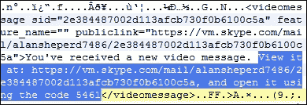
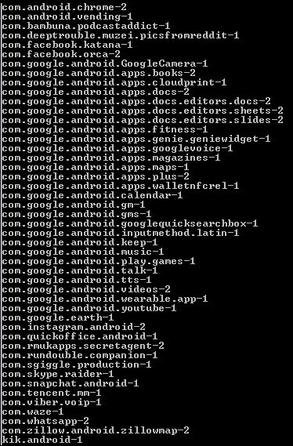
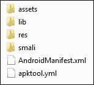
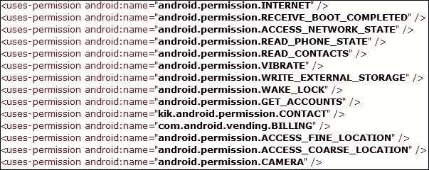
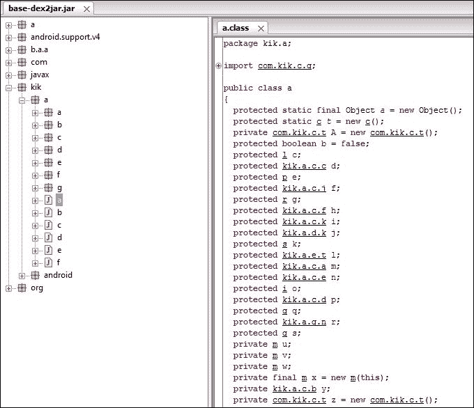

# 七、安卓应用的取证分析

本章将涵盖应用分析，使用免费和开源工具。它将重点分析数据，这些数据将使用[第 4 章](4.html "Chapter 4. Extracting Data Logically from Android Devices")和[第 5 章](5.html "Chapter 5. Extracting Data Physically from Android Devices")中详述的任何逻辑或物理技术进行恢复。它还将严重依赖于[第 2 章](2.html "Chapter 2. Setting Up an Android Forensic Environment")中讨论的存储方法。我们将在第二章描述的文件层次结构中的不同位置看到大量的 SQLite 数据库、XML 文件和其他文件类型。到本章结束时，您应该熟悉以下主题:

*   应用分析概述:
    *   联系人/电话/短信
    *   无线网络连接
    *   用户词典
*   第三方应用和流行应用用来存储和混淆数据的各种方法如下:
    *   纯文本
    *   纪元时间
    *   网络工具包时间
    *   文件扩展名命名错误
    *   朱利安约会
    *   Base64 编码
    *   加密
    *   基本隐写术
    *   SQLCipher
*   逆向工程的基本应用

# 应用分析

从法律上来说，分析一个应用既是一门科学，也是一门艺术。应用有无数种方法可以存储或混淆其数据。同一应用的不同版本甚至可能以不同的方式存储相同的数据。当选择如何存储数据时，开发人员实际上只受到他们想象力(和安卓平台限制)的限制。由于这些因素，应用分析是一个不断变化的目标。考官前一天使用的方法，第二天可能就完全不相关了。

对应用进行取证分析的最终目标是一致的，即了解应用的用途并找到用户数据。

在本章中，我们将查看许多常见应用的当前版本。正如应用可以并且确实通过更新改变它们存储数据的方式一样，本章中没有任何内容是如何分析该应用的明确指南。相反，我们将着眼于广泛的应用，展示应用用来存储其数据的各种不同方法。在大多数情况下，我们将查看非常常见的应用(从谷歌 Play 下载的数百万次)，除了查看一个晦涩的应用可以揭示有趣的新数据存储方式的情况。

### 注

虽然在填充测试数据时，我们尽了最大努力来全面使用每个应用，但是完全有可能并没有使用每个应用的每个特性。下面几节中分析的应用是如何检查来自该应用的数据的示例，但可能不包括所有可能恢复的数据。

我们所有的测试都使用了每个应用的默认设置，就好像应用被下载并立即使用一样。不同的设置可能会影响存储的数据以及数据在设备上的位置。

此外，该分析是在运行安卓 5.0.1 的 Nexus 5 上完成的。某些制造商，如宏达电和三星，可能会提供从这些应用复制功能的应用(如访问脸书的主屏幕小部件)。这些应用可能会将数据存储在不同的位置。我们分析的一些文件可能在其他版本中不存在。

## 为什么要做 app 分析？

首先，即使是标准电话功能，如联系人、通话和短信，也是通过安卓设备上的应用来完成的。因此，即使获取基本数据也需要我们分析应用。其次，一个人的应用使用情况可以告诉你很多关于他们的信息:他们去过哪里(和什么时候去过那里)，他们和谁交流过，甚至他们未来可能会有什么计划。

很多手机开箱后都可以预装 20 多个应用。雅虎 2014 年的一项研究显示，用户平均在他们的设备上安装了 95 个应用。尼尔森的一项研究显示，平均每个月用户使用 26 个应用。考官无法知道这些应用中哪些包含了对调查有用的信息，因此，必须对它们进行分析。考官可能会倾向于跳过某些看起来没有什么有用数据的应用，比如游戏。不过，这不是个好主意。许多流行的游戏，如*与朋友的对话*或*部落冲突*，都有一个内置的聊天功能，可以产生有用的信息。下面的分析将重点关注消息传递应用，因为我们的经验表明，这些应用在取证分析中最有价值。

## 本章的布局

对于我们检查的每个应用，我们将提供包名、版本号(如果可能)和感兴趣的文件。例如:

包装名称:`com.android.providers.contacts`

版本:安卓 5.0.1 的默认版本(未在应用中列出)

感兴趣的文件:

*   `/files/`
    *   `photos/`

默认情况下，所有应用都将其数据存储在`/data/data`目录中。应用也可以使用 SD 卡，如果他们在安装应用时请求此权限。包名是`/data/data`目录中应用的目录名。感兴趣的文件来自包名的根(即前面示例中的/ `data/data/com.android.providers.contacts/files/photos`)。SD 卡上的数据路径以`/sdcard`(即`/sdcard/com.facebook.orca`)开头。不要期望在应用的`/data/data`目录中找到以`/sdcard`开头的数据路径！

我们将从查看谷歌的一些应用开始，因为这些应用预装在绝大多数设备上(尽管它们不必如此)。然后，我们将看看可以在谷歌 Play 上找到的第三方应用。

# 确定安装了哪些应用

要查看设备上有哪些应用，审查员可以导航到`/data/data`并运行`ls`命令。然而，这并不能提供在法医报告中看起来很好的格式良好的数据。我们建议你调出`/data/system/packages.list`文件。该文件列出了设备上每个应用的包名及其数据路径(如果设备上不存在该文件，则`adb shell pm list packages -f`命令是一个很好的选择)。例如，这里有一个谷歌 Chrome 的条目(我们测试设备上的完整文件包含 120 个条目):


### 注

这是数据存储的第一种方法:纯文本。通常，我们会看到应用以纯文本存储数据，包括你意想不到的数据(如密码)。

也许更感兴趣的是`/data/system/package-usage.list`文件，它显示了包(或应用)最后一次被使用的时间。并不完美；文件中显示的时间与我们上次使用该应用的时间并不完全一致。似乎应用更新或接收通知(即使用户没有查看)可能会影响时间。但是，它可以大致指示用户上次访问的应用:


如果您想知道前一行中的时间在哪里，它是一种称为 Linux 纪元时间的格式。

## 了解 Linux 纪元时间

**Linux 纪元时间**，也称被称为 Unix 时间或 Posix 时间，存储为自 1970 年 1 月 1 日午夜(UTC)以来的秒数(或毫秒数)。10 位数的值表示以秒为单位，而 13 位数的值表示毫秒值(至少对于智能手机上可能出现的时间，因为 9 位数的秒和 12 位数的毫秒值自 2001 年以来从未出现过)。

在上例中，值为`1422206858650`；自 1970 年 1 月 1 日午夜以来，谷歌 Chrome 最后一次被使用了 10 亿、4.22 亿、20.6 万、858 秒和 650 毫秒！不用担心；我们也不知道那是什么日期/时间。有许多脚本和工具可供下载，以将该值转换为人类可读的格式。我们更喜欢免费工具**DCode**可以在[http://www . digital-detection . net/digital-forecast-software/free-tools/](http://www.digital-detective.net/digital-forensic-software/free-tools/)找到。

在 DCode 中，只需从下拉列表中选择 **Unix:毫秒值**，在**要解码的值**字段中键入值，然后点击**解码**:


可以选择**添加偏差**字段将时间转换为所需的时区。

或者，在 http://www.epochconverter.com/也有一个非常有用的在线纪元转换器。

无论使用哪种方法，我们都可以看到谷歌 Chrome 实际上最后一次使用是在 2015 年 1 月 25 日，世界协调时 17:27:38.650。Linux epoch time 经常在 Android 设备上用来存储日期/时间值，在我们的应用分析中会反复出现。

### 注

这是第二种数据存储方式:Linux epoch time。

# Wi-Fi 分析

wi-Fi在技术上不是一个应用(从`/data/data`无法恢复的事实证明了这一点)，但它是一个宝贵的数据来源，应该进行检查。所以，我们在这里简单讨论一下。Wi-Fi 连接数据见`/data/misc/wifi/wpa_supplicant.conf`。`wpa_supplicant.conf`文件包含用户选择自动连接的接入点列表(当新接入点连接时，默认设置为自动连接)。用户通过设备设置“忘记”的接入点将不会显示。如果接入点需要密码，密码也将以纯文本形式存储在文件中。在以下示例中，`NETGEAR60`接入点需要密码(`ancientshoe601`)，而`hhonors`则不需要:


### 注

该文件中存在 **服务集标识** ( **SSID** )并不意味着该设备连接到该接入点。这些设置会保存到用户的谷歌帐户中，并在设置该帐户时添加到设备中。检查者只能得出结论，用户是从某个安卓设备连接到这些接入点的，但不一定是被检查的设备。

# 联系人/通话分析

联系人和通话记录存储在同一个数据库中。用户不必显式添加联系人。当一封电子邮件通过 Gmail 发送时，或者一个人被添加到谷歌+上时，或者可能通过许多其他方式，它们可能会被自动填充。

包装名称:`com.android.providers.contacts`

版本:安卓 5.0.1 的默认版本(未在应用中列出)

感兴趣的文件:

*   `/files/`
    *   `photos/`
    *   `profile/`
*   `/databases/`
    *   `contacts2.db`

`files`目录包含`photos`目录中用户联系人的照片和`profile`目录中用户的个人资料照片。

`contacts2.db`数据库包含所有关于从设备拨打到的电话以及用户谷歌账户中所有联系人的信息。它包含以下表格:

<colgroup><col> <col></colgroup> 
| 

桌子

 | 

描述

 |
| --- | --- |
| `accounts` | 这将显示设备上有权访问联系人列表的帐户。至少有一个帐户会显示用户的谷歌帐户电子邮件地址。该列表可能包括已安装的有权访问联系人列表的第三方应用(我们将在 Tango、Viber 和 WhatsApp 部分看到这一点)。 |
| `calls` | 这包含与进出设备的所有呼叫相关的信息。`number`列显示远程用户的电话号码，无论是发送还是接收的呼叫。`date`列是调用的日期/时间，以 Linux epoch 格式存储。`duration`栏是呼叫的长度，以秒为单位。`type`栏表示呼叫类型:

*   `1` =入局
*   `2` =出局
*   `3` =错过

如果号码存储在联系人列表中，则`name`列显示远程用户的姓名。`geocoded_location`栏根据区号(美国号码)或国家代码显示电话号码的位置。 |
| `contacts` | 这包含联系人的部分信息(更多数据可在`raw_contacts`表中找到)。`name_raw_contact_id`值对应于`raw_contacts`表中的`_id`值。`photo_file_id`值对应于在`/files/photos`目录中找到的文件名。`times_contacted`和`last_time_contacted`列以 Linux epoch 格式显示联系人被设备呼叫或对设备进行呼叫的次数，以及最后一次呼叫的时间。 |
| `data` | 此表包含每个联系人的所有信息:电子邮件地址、电话号码等。`raw_contact_id`列是每个联系人的唯一值，可以与`raw_contact_id`中的`_id`值相关联来识别联系人。请注意，每个触点可能有几行，如相同的`raw_contact_id`值所示。有 15 个数据列(`data1`到`data15`)包含一些关于联系人的信息，但是没有可辨别的模式。同一列可能包含联系人姓名、电子邮件地址、Google+个人资料等。`data14`列中的值与`/files/profiles`路径中图像的文件名相关。`data15`栏包含联系人个人资料照片的缩略图。 |
| `deleted_contacts` | 这包含一个`contact_id`值和`deleted_contact_timestamp`在 Linux 纪元格式中。但是，这不能与任何其他表相关联，以标识已删除联系人的姓名。不过，可以使用[第 6 章](6.html "Chapter 6. Recovering Deleted Data from an Android Device")、*中的删除数据恢复技术从安卓设备*中恢复删除的数据，以恢复联系人姓名。`contact_id`值对应于`raw_contacts`表中的`contact_id`列。 |
| `groups` | 这将显示联系人列表中的组，可以是自动生成的，也可以是用户创建的。组的标题是组的名称。似乎没有办法识别每个组中的用户。 |
| `raw_contacts` | 这包含联系人列表中每个联系人的所有信息。`display_name`栏显示联系人的姓名(如果有)。要确定联系人的电话号码、电子邮件地址或其他信息，`_id`列的值必须与数据表中的`raw_contact_id`值相匹配。`sync3`列显示一个时间戳，但是根据我们的测试，不能假设这是添加联系人的时间。本月同步了我们几年前的联系人。`times_contacted`和`last_time_contacted`栏目只适用于电话；向联系人发送电子邮件或短信不会增加这些值。我们无法确定任何方法来确定联系人是通过电话界面添加的、在谷歌+上作为朋友添加的还是通过其他方法添加的。 |

# 短信/彩信分析

短信和彩信存储在同一个数据库中。根据我们的经验，无论使用什么应用发送短信/彩信，都会用到这个数据库(也就是说，通过谷歌 hangout 发送短信会填充这个数据库，而不是这里检查的 hangout 数据库)。然而，第三方应用也可能将数据记录在自己的数据库中。

包装名称:`com.android.providers.telephony`

版本:安卓 5.0.1 的默认版本(未在应用中列出)

感兴趣的文件:

*   `/app_parts`
*   `/databases/`
    *   `mmssms.db`
    *   `telephony.db`

`app_parts`目录包含以彩信形式发送的附件，包括发送和接收。

`telephony.db`数据库很小，但是包含一个潜在有用的信息来源。电话数据库中的表格描述如下:

<colgroup><col> <col></colgroup> 
| 

桌子

 | 

描述

 |
| --- | --- |
| `siminfo` | 其中包含设备中已使用的所有 SIM 的历史数据，包括 ICCID、电话号码(如果存储在 SIM 上)和**移动国家代码** ( **MCC** ) / **移动网络代码** ( **MNC** )，可用于识别网络提供商。 |

`mmssms.db`数据库包含下表所述的所有短信和彩信信息:

<colgroup><col> <col></colgroup> 
| 

桌子

 | 

描述

 |
| --- | --- |
| `part` | 这包含附加到彩信的文件信息。每条消息至少有两个部分:SMIL 报头和附件。这可以在`mid`和`ct`栏中看到，以及所附的文件类型。`_data`栏提供了在设备上查找文件的路径。 |
| `pdu` | 这包含每个彩信的元数据。`date`列以 Linux 纪元格式标识消息发送或接收的时间。`_id`列似乎对应于零件列中的中间值；关联这些值将显示发送特定图像的时间。`msg_box`栏显示消息的方向(`1` =收到，`2` =发送)。 |
| `sms` | 这包含每条短信的元数据(不包括彩信信息)。`address`列显示远程用户的电话号码，不管它是发送的还是接收的消息。`person`列包含一个可以在`contacts2.db`数据库中查找的值，与`data`表中的`raw_contact_id`相对应。如果是已发送的消息或远程用户不在联系人列表中，则`person`列将为空。`date`列显示了以 Linux epoch 格式发送消息时的时间戳。`type`列显示消息的方向(`1` =收到，`2` =发送)。`body`栏显示消息内容。`seen`栏表示消息是否已读(`0` =未读，`1` =已读)；所有发送的邮件都将被标记为未读。 |
| `words`、`words_content`、`words_segdir` | 这似乎包含重复的邮件内容；这张表的确切用途还不清楚。 |

# 用户词典分析

对于考官来说，**用户词典** 是一个不可思议的数据来源。虽然它不一定是一个独立的应用，但它的数据存储在/ `data/data directory`中，就好像它是一样。每当用户键入无法识别的单词并选择保存该单词以避免被自动更正标记时，都会填充用户词典。有趣的是，我们的测试设备包含了几十个我们从未在设备上输入或保存过的单词。这些数据似乎与用户的谷歌账户同步，并在多台设备上持续存在。从该帐户同步的单词按字母顺序添加到数据库的顶部，而随后手动添加的单词按它们添加到底部的顺序填充。

包装名称:`com.android.providers.userdictionary`

版本:安卓 5.0.1 的默认版本(未在应用中列出)

感兴趣的文件:

*   `/databases/user_dict.db`

用户字典中的表描述如下:

<colgroup><col> <col></colgroup> 
| 

桌子

 | 

描述

 |
| --- | --- |
| `words` | `word`列包含添加到词典中的单词。`frequency`栏应该可以忽略；它显示相同的值(250 ),不管我们使用这个词的次数。 |

以下是用户词典中的示例条目:


# Gmail 分析

Gmail 是谷歌提供的电子邮件服务。首次设置设备时，通常会要求提供一个 Gmail 帐户，尽管这不是必需的。

包装名称:`com.google.android.gm`

版本:安卓 5.0.1 的默认版本(未在应用中列出)

感兴趣的文件:

*   `/cache`
*   `/databases/`
    *   `mailstore.<username>@gmail.com.db`
    *   `databases/suggestions.db`
*   `/shared_prefs/`
    *   `MailAppProvider.xml`
    *   `Gmail.xml`
    *   `UnifiedEmail.xml`

应用文件夹中的`/cache`目录包含电子邮件附带的最近文件，包括发送和接收的。即使用户没有明确下载，这些附件也会保存在这里。

`mailstore.<username>@gmail.com.db`文件包含各种有用的信息。数据库中有趣的表包括:

<colgroup><col> <col></colgroup> 
| 

桌子

 | 

描述

 |
| --- | --- |
| `attachments` | 这包含关于附件的信息，包括它们在设备上的大小和文件路径(前面提到的`/cache`目录)。每行还包含一个`messages_conversation`值。该值可以与`conversations`表进行比较，以将附件与其包含的电子邮件相关联。`filename`列标识文件所在设备上的路径。 |
| `conversations` | 在旧版本中，可以恢复整个电子邮件对话。在当前版本中，谷歌不再将整个对话存储在设备上，可能假设用户将有数据连接来下载完整的对话。相反，只能恢复主题行和一个“片段”。这个片段大概是出现在应用的通知栏或收件箱屏幕上的文本量。`fromCompact`列标识发送者和任何其他接收者。 |

`suggestions.db`数据库包含在应用中搜索的术语。

`shared_prefs`目录中的 XML 文件可以确认应用使用的帐户。`Gmail.xml`包含另一个与我们的测试帐户链接的帐户，但从未与应用一起使用。`UnifiedEmail.xml`包含一份发送电子邮件给该账户的发件人的部分名单，但没有明显的理由。名单上有许多发件人，但远非全部，而且他们没有特别的顺序。`Gmail.xml`还包含应用上次以 Linux epoch 格式同步的时间。

# 谷歌 Chrome 分析

谷歌 Chrome 是一款网页浏览器，是 Nexus 等很多设备上的默认浏览器。设备上的 Chrome 数据有些独特，因为它不仅包含来自设备的数据，还包含来自用户登录到 Chrome 的所有设备的数据。这意味着完全有可能(甚至非常有可能)在用户手机的数据库中找到用户在台式电脑上浏览的数据。然而，这也导致考官需要整理大量数据，但这是一个很好的问题。

包装名称:`com.android.chrome`

版本:40.0.2214.89

感兴趣的文件:

*   `/app_chrome/Default/`
    *   `Sync Data/SyncData.sqlite3`
    *   `Bookmarks`
    *   `Cookies`
    *   `Google Profile Picture.png`
    *   `History`
    *   `Login Data`
    *   `Preferences`
    *   `Top Sites`
    *   `Web Data`
*   `/app_ChromeDocumentActivity/`

除了`.png`文件、书签和首选项之外，`/app_chrome/Default`文件夹中前面列出的所有文件都是 SQLite 数据库，尽管缺少文件扩展名。

`SyncData.sqlite3`数据库很有趣，因为它似乎包含一个数据列表，这些数据已经从用户在设备上的账户同步回谷歌的服务器。我们的数据库有一个非常活跃的 Chrome 帐户，包含 2700 多个条目，包括浏览历史、自动填充表单信息、密码和书签。例如，我们能够找到一个作者从 2012 年开始搜索的术语，如下面的截图所示。这很有趣，因为用户在 2014 年购买了这款手机，但之前的数据仍会同步到设备。


<colgroup><col> <col></colgroup> 
| 

桌子

 | 

描述

 |
| --- | --- |
| `metas` | 数据库中有许多包含时间戳的列，在我们的数据库中，对于每个条目，它们看起来都在几秒钟之内。不清楚哪个时间对应于添加条目的确切时间，但所有时间大致对应于用户帐户中活动的时间。带有时间戳的列有`mtime`、`server_mtime`、`ctime`、`server_ctime`、`base_version`和`server_version`。`non_unique_name`和`server_non_unique_name`列显示同步的内容。例如，我们的一个条目显示:`autofill_entry` &#124; `LNAME` &#124; `Tindall`这些栏中的其他条目包括访问过的网址、密码，甚至该帐户使用过的设备。 |

`Bookmarks`文件是一个纯文本文件，包含与帐户同步的书签信息。它包括每个被书签标记的网站的名称、网址和被书签标记的日期/时间，以一种我们还没有遇到的格式存储:WebKit 格式。要解码这些值，请参见解码网络工具包时间格式部分。

### 注

这是数据存储的第三种方法:WebKit 时间格式。

`Cookies`数据库以 WebKit 时间格式存储访问过的网站的 cookie 信息(取决于网站和 Chrome 设置)，包括网站名称、保存 cookie 的日期以及上次访问 cookie 的时间。

`Google Profile Picture.PNG`文件是用户的个人资料图片。

`History`数据库包含存储在下表中的用户网页历史记录:

<colgroup><col> <col></colgroup> 
| 

桌子

 | 

描述

 |
| --- | --- |
| `keyword_search_terms` | 这包含了在 Chrome 中搜索到的使用谷歌的术语列表。`term`列显示搜索到的内容，而`url_id`可以与网址表相关联，查看搜索的时间。 |
| `segments` | 此表包含一些访问过的网址，但不是全部。尚不清楚是什么原因导致数据被输入该表。 |
| `urls` | 这包含所有设备上谷歌帐户的浏览历史，而不仅仅是从哪个设备提取数据库。我们的历史可以追溯到大约 3 个月前，包含 494 个条目，尽管谷歌账户比这要老得多，在这段时间里，我们肯定访问了超过 494 页。目前尚不清楚到底是什么导致了这种差异，也不清楚是什么决定了历史的截止日期。`id`列是表格中每行的唯一值。`url`和`title`列包含访问的网址和页面名称。`visit_count`栏似乎是对该网址被访问次数的准确计数。`typed_count`列中的值总是等于或小于`visit_count`列中的值，但是我们不知道它到底表示什么。对于某些网站来说，这种差异可以通过考虑通过书签而不是键入网址访问该网站的次数来解决，但这并不适用于所有情况。`last_visit_time`列是上次访问该网址的时间，采用 WebKit 时间格式。 |
| `visits` | 每次访问 URL 表中的 URL 时，都会包含一行；该表中一个网址的条目数对应于`url`表的`visit_count`列中的值。`url`列值与`url`表的`id`列中的值相关。每次访问的时间可以在`visit_time`栏中找到，同样是在 WebKit 时间格式中。 |

`Login Data`数据库包含保存在 Chrome 中的登录信息，并在所有使用谷歌账户的设备间同步。

<colgroup><col> <col></colgroup> 
| 

桌子

 | 

描述

 |
| --- | --- |
| `logins` | `origin_url`是用户最初访问的站点，如果用户被重定向到登录页面，则`action_url`是登录页面的网址。如果访问的第一个页面是登录页面，那么两个网址是相同的。`username_value`和`password_value`列以纯文本形式显示为该网址存储的用户名和密码；不，我们不会包括我们数据库的截图！`date_created`是首次保存登录信息的日期/时间，采用 WebKit 时间格式。`date_synced`列是登录数据本地同步到设备的日期/时间，同样采用 WebKit 时间格式。`times_used`列显示登录信息保存后被 Chrome 自动填充的次数(不包括第一次登录，所以有些值可能为 0)。 |

`Preferences file`是一个文本文件，包含用户登录 Chrome 的谷歌账户。

`Top Sites`数据库包含最常访问的网站，因为当 Chrome 打开时，这些网站会默认显示。

`Web Data`数据库包含用户为了在网站上自动填写表格而保存的信息。

<colgroup><col> <col></colgroup> 
| 

桌子

 | 

描述

 |
| --- | --- |
| `autofill` | 这包含基于 web 的表单上的字段列表和用户键入的值。`name`列显示输入的字段名称，而`value`列显示用户输入的内容。`date_created`和`date_last_used`列是不言自明的，并且以 Linux 纪元格式存储。请注意，虽然这可能是非常有价值的信息(例如，我们的数据库包含一些没有存储在其他地方的用户名)，但也几乎没有可用的上下文。未存储信息的网址可能无法确定。 |
| `autofill_profile_emails` | 这包含用户保存的用于自动填充网络表单上`e-mail`字段的所有值。 |
| `autofill_profile_names` | 这包含用户保存的用于自动填充 web 表单上的`First`、`Middle`、`Last`和`Full Name`字段的所有值。 |
| `autofill_profile_phonwa` | 这包含用户保存的用于自动填充网络表单上`Phone Number`字段的所有值。 |
| `autofill_profiles` | 这包含用户保存到网站表单上自动填充地址信息字段的所有值。 |

`/app_ChromeDocumentActivity` /目录包含设备上打开的最近标签的历史文件。对于访问过的网站，可以从这些文件中恢复网址。

## 解码网络工具包时间格式

这里有一个样本 WebKit 时间值:`13066077007826684`。

乍一看，它似乎与 Linux 纪元时间非常相似，只是稍长一些(也许它存储的是纳秒？).试图将此解码为纪元时间的考官将获得 2011 年 5 月的日期，这看似准确，但实际上离正确日期还有几年！

WebKit 时间是一个划时代的时间。它只是基于一个不同于 Linux 时代的起点。WebKit 纪元时间是自 1601 年 1 月 1 日午夜以来的微秒数。是的，我们说的是 1601 年。一旦我们知道了纪元从哪里开始，转换成可识别的格式就变成了一个数学问题。然而，我们还是宁愿使用 DCode。

这一次，在 DCode 中，在**解码格式**下拉选择中选择谷歌 Chrome 值，点击**解码**:


我们示例的实际值是世界协调时 2014 年 11 月 2 日 18:04:33。这与如果我们认为这是一个 Linux 时代，我们会得出的值有很大的不同！

# 谷歌地图分析

地图是谷歌提供的地图/导航应用。

包装名称:`com.google.android.apps.maps`

版本:9.2.0 (#902013124)

感兴趣的文件:

*   `/cache/http/`
*   `/databases/`
    *   `gmm_myplaces.db`
    *   `gmm_storage.db`

`/cache/http`文件夹包含许多文件，文件扩展名为`.0`和`.1`。`.0`文件是对相应的`.1`文件的网络请求。`.1`文件主要是图像，可以通过适当更改扩展名来查看。在我们的测试设备上，它们不是`.jpg`就是`.png`文件。这些文件主要是用户附近的位置，不一定是用户特别搜索的位置。

### 注

这是第四种数据存储方法:错误命名的文件扩展名。

始终验证无法打开的文件的头，或者使用自动化工具(如 Case)来检测不匹配的头/文件扩展名。验证文件签名的一个很好的资源是[http://www.garykessler.net/library/file_sigs.html](http://www.garykessler.net/library/file_sigs.html)。

`gmm_myplaces.db`数据库包含用户保存的位置。该文件与用户的谷歌帐户同步，因此这些位置不一定是使用应用保存的。

`gmm_storage.db`数据库包含导航到下表的搜索命中和位置:

<colgroup><col> <col></colgroup> 
| 

桌子

 | 

描述

 |
| --- | --- |
| `gmm_storage_table` | 出现`_key_pri`列来标识位置的类型。捆绑似乎是搜索中出现的一个热门，而`ArrivedAtPlacemark`识别实际导航到的位置。`_data`栏包含该位置的地址。 |

# 谷歌 Hangouts 分析

**hangots**是谷歌提供的聊天/短信应用。Hangouts 是安卓设备上的默认短信客户端。

包装名称:`com.google.android.gm`

版本:安卓 5.0.1 的默认版本(未在应用中列出)

感兴趣的文件:

*   `/cache/volleyCache/`
*   `/databases/babel#.db`(我们的设备有 babel0.db 和 babel1.db)
*   `/shared_prefs/accounts.xml`

`cache`目录包含`.0`文件，如前面谷歌地图示例中所讨论的。这些文件包含一个获取联系人个人资料图片的网址，以及一个嵌入在文件中的`.jpg`。访问网址或从文件中雕刻`.jpg`将恢复联系人的图片。

`babel#.db`文件包含所有消息数据。在我们的测试设备上，`babel0.db`是空白的，`babel1.db`拥有活动账户的所有数据。这个数据库中有许多值得一看的表:

<colgroup><col> <col></colgroup> 
| 

桌子

 | 

描述

 |
| --- | --- |
| `conversations` | 这包含对话数据。每次聊天都有唯一的`conversation_id`值。`latest_message_timestamp`列是最近一次聊天的时间，采用 Linux epoch 格式。`generated_name`栏列出了聊天的所有参与者，减去设备上的帐户。`snippet_text`栏是最新消息的内容；和 Gmail 一样，整个聊天记录也不会存储在设备上。`latest_message_author_full_name`和`latest_message_author_first_name`栏确定了`snippet_text`栏的作者。`inviter_full_name`和`inviter_first_name`列标识哪个人发起了对话。 |
| `dismissed_contacts` | 这有一个以前发送过消息的联系人名单。这些在应用中被标记为“隐藏联系人”。 |
| `messages` | 不出所料，这包含每个对话的详细消息历史记录。`text`列包含消息的内容，`timestamp`列是 Linux epoch 格式的日期/时间。`remote_url`栏再次成为检索邮件中共享图像的网址。同样，它可以公开访问。`author_chat_id`是一个可以与参与者表相关联的值，用于标识每个消息的作者。 |
| `participants` | 这包含一个聊天对象列表。它包括全名、个人资料图片网址和一个`chat_id`值来识别信息表中的人。 |

`accounts.xml`文件有一个`phone_verification`字段，包含当 Hangouts 被配置为发送短信时与谷歌账户相关的电话号码。这可能非常有用，因为通常很难获得设备的电话号码，因为它通常不存储在设备上。

# 谷歌保持分析

Keep 是谷歌提供的笔记应用。它也可以用来设置提醒，或者在某个日期/时间，或者当用户在指定的位置。

包装名称:`com.google.android.keep`

版本:安卓 5.0.1 的默认版本(未在应用中列出)

感兴趣的文件:

*   `/databases/keep.db`
*   `/files/1/image/original`

`files/1/image/original`目录包含使用该应用拍摄的照片。笔记和提醒都可以与图像相关联。

`keep.db` 包含所有关于笔记和提醒的信息。这里再次有几个有趣的表格:

<colgroup><col> <col></colgroup> 
| 

桌子

 | 

描述

 |
| --- | --- |
| `alert` | 这包含有关基于位置的提醒的信息。`reminder_id`列可以与提醒表中的条目相关联。`reminder_detail`表包含提醒设置的经纬度。`scheduled_time`栏是提醒设置的日期/时间，以 Linux 纪元时间为单位。 |
| `blob` | 这包含关于前面提到的`/files`目录中的图像的元数据，包括文件名和大小。`blob_id`列可以与`blob_node`表中的`_id`列相关联。 |
| `blob_node` | 这包含在 Linux 纪元时间中`/files`目录中的图像的时间创建值。 |
| `list_item` | 这将在设备上存储每个音符的数据。`text`栏包含每个音符的全文。`list_parent_id`列是每个音符的唯一值。如果多行具有相同的值，这意味着它们是作为同一注释中的列表创建的。`time_created`和`time_last_updated`列是笔记创建的时间，也是最后一次与谷歌服务器同步的时间，在 Linux 时代。 |
| `reminder` | 这包含关于应用中每个提醒集的数据。如果提醒是基于时间的，将填充`julian_date`和`time_of_day`列。 |

## 转换儒略日

**儒略日**类似于 Linux 纪元格式，只是以不同的日期开始。儒略日系统计算从公元前 4713 年 1 月 1 日中午开始的天数。美国海军天文台有一个出色的朱利安日期计算器。要从数据库中获取儒略日，只需将两列合并，中间加一个小数点。这里有一个例子:


前一个日期相当于儒略日 2457042.468000000。当该值输入到网站时，我们可以发现设置提醒的日期是 2015 年 1 月 19 日世界协调时 23:13:55:2。如果提醒设置为基于位置，则会填充`location_name`、`latitude`、`longitude`和`location_address`列。最后，`time_created`和`time_last_updated`列是笔记创建的时间，也是最后一次与谷歌服务器同步的时间，在 Linux 时代。

### 注

第五种数据存储方法是儒略日。

# 谷歌 Plus 分析

谷歌 Plus 是基于谷歌的社交网络。它允许我们共享文本/视频/图像、添加朋友、关注人物和消息。谷歌 Plus 还可能根据用户的设置，自动上传用户设备上拍摄的所有图片。

包装名称:`com.google.android.apps.plus`

版本:4.8.0.81189390

感兴趣的文件:

*   `/databases/es0.db`

`Es0.db`数据库包含考官期望从社交媒体账户中找到的所有信息:

<colgroup><col> <col></colgroup> 
| 

桌子

 | 

描述

 |
| --- | --- |
| `all_photos` | 它包含一个下载用户共享的图像的网址，以及 Linux 纪元格式的创建日期/时间。 |
| `activites` | 这包含显示在用户流(即他们的新闻提要)中的数据。每个帖子的创建和修改时间再次存储在 Linux 纪元时间中。标题和评论栏将包含文章标题和至少部分评论。`permalink`栏包含一个网址，如果是公开分享的，可以跟随该网址查看帖子。如果帖子是私人共享的，内容仍然可以从嵌入表中恢复。`relateds`栏包含谷歌为帖子自动生成的标签；即使帖子是私有的，这也会填充。 |
| `activity_contacts` | 这包含一个在活动表中发布帖子的人的名单。 |
| `all_photos` | 这包含了用户备份到谷歌 Plus 的所有照片的列表，无论它们是否被共享。`image_url`栏中的值可用于下载用户的任何照片，并公开提供。移除网址末尾的`-d`将会查看图片，无需下载。`timestamp`栏是根据图像元数据拍摄图像的日期/时间。它不显示图像上传的时间。 |
| `all_tiles` | 这包含`all_photos`的未知子集，但也包括与用户共享的图像。 |
| `circle_contact` | 这包含用户添加到其圈子中的人员列表。它不包括姓名，但是一些`link_person_id`值包括电子邮件地址。`link_circle_id`值可以与圆圈表相关联，以识别每个圆圈的名称。然后可以将`link_person_id`值与`contacts`表相关联，以识别哪个用户在哪个圆圈中。 |
| `circles` | 这有用户创建的所有圆圈，以及每个圆圈中用户数量的计数。 |
| `contacts` | 这包含用户圈子中所有联系人的列表。 |
| `events` | 这将列出用户被邀请参加的所有活动，无论他们是否参加。`name`栏是事件的标题。`creator_gaia_id`列可以与联系人表中的`gaia_id`列相关联，以识别事件创建者。在 Linux 纪元格式中，`start_time`和`end_time`列是事件的时间。`event_data`栏有创建者输入的事件描述，以及关于位置的信息(如果添加的话)。它还列出了被邀请参加活动的所有其他用户。 |
| `squares` | 这包含用户已加入的组的列表。 |

# 脸书分析

脸书是一款社交媒体应用，从谷歌 Play 下载量超过 10 亿次。

包装名称:`com.facebook.katana`

版本:25.0.0.19.30

感兴趣的文件:

*   `/files/video-cache/`
*   `/cacimg/`
*   `/databases/`
    *   `bookmarks_db2`
    *   `contacts_db2`
    *   `nearbytiles_db`
    *   `newsfeed_db`
    *   `notifications_db`
    *   `prefs_db`
    *   `threads_db2`

`/files/video-cache`目录包含来自用户新闻源的视频，尽管似乎没有办法将它们与发布它们的用户相关联。

`/cache/images`目录包含来自用户新闻源的图像以及联系人的个人资料照片。这个目录包含大量其他目录(我们测试手机上有 65 个)，每个目录可以包含多个`.cnt`文件。`.cnt`文件通常是`.jpg`文件或其他图像格式。

`bookmarks_db2`数据库是出现在用户新闻提要一侧的项目列表，例如组和应用。这些书签中有许多是由脸书自动生成的，但也可能是由用户创建的。

<colgroup><col> <col></colgroup> 
| 

桌子

 | 

描述

 |
| --- | --- |
| `bookmarks` | 这包含了数据库中的所有信息。`bookmark_name`列是显示给用户的书签名称。`bookmark_pic`栏有一个公众可访问的网址来查看向用户显示的`bookmark`图标。`bookmark_type`列标识组的类型。我们的测试显示`profile`、`group`、`app`、`friend_list`、`page`和`interest_list`。最后，`bookmark_unread_count`列显示该组中有多少条消息没有被用户阅读。 |

`contacts_db2`数据库可预测地包含关于存储在下表中的所有用户联系人的信息:

<colgroup><col> <col></colgroup> 
| 

桌子

 | 

描述

 |
| --- | --- |
| `contacts` | 这包含用户联系人的所有信息。`fbid`列是一个唯一的标识，用于识别其他数据库中的联系人。`first_name`、`last_name`和`display_name`列显示联系人的姓名。`small_picture_url`、`big_picture_url`和`huge_picture_url`列包含联系人个人资料图片的公共链接。`communication_rank`栏似乎是一个标识联系人与用户通信频率的数字(考虑消息、评论和可能的其他因素)；数字越大，表示与该联系人的交流越多。`added_time_ms`栏显示联系人作为朋友添加的时间(以 Linux 纪元格式)。`bday_day`和`bday_month`栏显示联系人的出生日期，但不显示年份。`data`列包含数据库中所有其余数据的副本，但也包含联系人的位置，这在数据库的其他地方找不到。 |

`nearbytiles_db`数据库包含用户可能感兴趣的附近位置。这显然是不断填充的，即使用户没有查看位置。这很有趣，因为虽然它不是一个好的位置(我们的大多数测试显示位置在我们位置的 6-10 英里范围内)，但它是一个用户去过的地方的粗略想法。

<colgroup><col> <col></colgroup> 
| 

桌子

 | 

描述

 |
| --- | --- |
| `nearby_tiles` | 这包含用户附近位置的`latitude`和`longitude`值，以及以 Linux 纪元格式从脸书服务器检索位置的时间。 |

`newsfeed_db`数据库包含在用户的新闻提要中显示给用户的数据。根据应用的使用情况，它可能是一个非常大的文件，包含以下表格:

<colgroup><col> <col></colgroup> 
| 

桌子

 | 

描述

 |
| --- | --- |
| `home_stories` | `fetched_at`列显示故事从脸书服务器中提取的时间，并且很可能与用户使用应用或看到故事的时间紧密对应。`story_data`列包含存储为一团数据的故事。在十六进制或文本编辑器中查看时，可以找到发布文章的人的用户名。帖子的内容也可以在纯文本中找到，并且通常前面有一个标签，上面写着`text`。下面的截图显示了一个例子。 |


### 注

注意这一个单元格的实际内容在`story_data`列。它包含超过 10，000 字节的数据，尽管实际的消息只有大约 50 字节。

`notifications_db`数据库包含发送给用户的通知，存储在下表中:

<colgroup><col> <col></colgroup> 
| 

桌子

 | 

描述

 |
| --- | --- |
| `gql_notifications` | `seen_state`栏显示通知是否已被看到和阅读。`updated`列包含以 Linux epoch 格式更新通知的时间(即未读时发送的时间或已阅读的时间)。`gql_payload`栏包含通知的内容以及发送者，类似于`newsfeed_db`中的`story_data`栏。消息内容的前面经常有标志`text`。在`summary_graphql_text_with_entities`和`short_summary_graphql_text_with_entities`栏中可以找到显示通知文本的少量数据。`profile_picture_uri`包含查看发送者个人资料图片的公共网址，`icon_url`栏包含查看通知相关图标的链接。 |

`prefs_db`数据库包含如下存储的应用首选项:

<colgroup><col> <col></colgroup> 
| 

桌子

 | 

描述

 |
| --- | --- |
| `preferences` | `/auth/user_data/fb_username`行显示用户的脸书用户名。`/config/gk/last_fetch_time_ms`值是应用最后一次与脸书服务器通信的时间戳，但可能不是用户最后一次与应用交互的确切时间。`/fb_android/last_login_time`值显示用户上次通过应用登录的时间。数据库包含许多其他时间戳。将这些时间戳放在一起，就可以用来构建一个不错的应用使用概况。`/auth/user_data/fb_me_user`值包含关于用户的数据，包括他们的姓名、电子邮件地址和电话号码。 |

`threads_db`数据库包含如下消息信息:

<colgroup><col> <col></colgroup> 
| 

桌子

 | 

描述

 |
| --- | --- |
| `messages` | 每条消息在`msg_id`列都有唯一的标识。`text`列包含纯文本消息。`sender`栏标识消息发送者的脸书标识和姓名。`timestamp_ms`列是消息发送的时间，采用 Linux epoch 格式。`attachments`栏包含一个公共网址来检索附件图像。如果发件人选择显示他们的位置，则`coordinates`栏会有发件人的纬度和经度。`source`栏标识消息是通过网站还是应用发送的。 |

# Facebook Messenger 分析

Facebook Messenger 是一款独立于主要脸书应用的消息应用。它在 Play Store 中有超过 500，000，000 次下载。

包装名称:`com.facebook.orca`

版本:18.0.0.27.14

感兴趣的文件:

*   `/cache/`
    *   `audio/`
    *   `fb_temp/`
    *   `image/`
*   `/sdcard/com.facebook.orca`
*   `/files/ rti.mqtt.analytics.xml`
*   `/databases/`
    *   `call_log.sqlite`
    *   `contacts_db2`
    *   `prefs_db`
    *   `threads_db2`

`/cache/audio`目录包含通过应用发送的音频消息。这些文件有一个`.cnt`文件扩展名，但实际上是`.riff`文件，可以用 Windows Media Player、VLC media player 和其他程序播放。

`/cache/fb_temp`路径包含通过应用发送的图像和视频的临时文件。目前还不清楚这些文件会保留多久。在我们的测试中，我们总共发送和接收了五个文件，一周后这五个文件都还在 temp 文件夹中。

`/cache/image`目录包含大量其他目录(我们测试手机上有 33 个)，每个目录可以包含多个`.cnt`文件。文件头应该在每个文件上验证，因为有些是视频文件，有些是图像。找到了`fb_temp`文件夹中的一些文件，以及一些联系人的个人资料图片。

SD 卡上的`fb_temp`文件夹只包含发送的图像和视频。

该应用还包括一个选项(默认情况下禁用)，用于将所有接收到的图像/视频下载到设备的图库。如果选择此选项，所有接收到的图像/视频将在 SD 卡上找到。

`/files/rti.mqtt.analytics.xml`文件有用户的脸书 UID。

`call_log.sqlite`数据库包含通过应用进行的呼叫的日志。`person_summary`表包含如下描述的相关数据:

<colgroup><col> <col></colgroup> 
| 

桌子

 | 

描述

 |
| --- | --- |
| `person_summary` | `user_id`列包含远程用户的脸书标识。这可以与`contacts_db2`中的`fbid`列相关联，以确定用户的姓名。`last_call_time`列包含 Linux epoch 格式的前一次调用的时间。此表不包含有关呼叫方向(已发送或已接收)的信息。 |

`contacts_db2`文件是一个 SQLite 数据库，尽管缺少文件扩展名。该数据库中有用的表包括:

<colgroup><col> <col></colgroup> 
| 

桌子

 | 

描述

 |
| --- | --- |
| `contacts` | 此表包括用户添加的联系人，以及从用户电话簿中删除的联系人(如果电话簿联系人使用 Facebook Messenger)。它包含每个联系人的名字和姓氏，以及该联系人的脸书标识(如前面的`call_log.sqlite`表中所述)。`added_time_ms`栏显示每个用户加入应用的时间。这可以让您了解联系人是手动添加的还是自动添加的。安装该应用时，可能会自动创建一大群在几毫秒内添加的联系人。`small_picture_url`、`big_picture_url`和`huge_picture_url`列包含联系人个人资料图片的公共链接。联系人的电话号码可以在数据列中的信息块中找到。应该注意的是，我们不知道这个数据库中的一些联系人来自哪里。他们不是我们帐户的脸书朋友，也不是我们设备电话簿中的联系人，而是在电话簿被刮擦的同时添加的。我们最好的猜测是，我们手机中的一些联系人拥有脸书与其他用户关联的电话号码。 |
| `favorite_contacts` | `favorite_contacts`表显示了用户添加为收藏夹的联系人。它们由`fbid`列标识，可以关联回联系人表。 |

`prefs_db`数据库包含关于应用和账户的有用元数据:

<colgroup><col> <col></colgroup> 
| 

桌子

 | 

描述

 |
| --- | --- |
| `preferences` | `/messenger/first_install_time`值表示应用安装的时间，以 Linux 纪元时间为单位。`/auth/user_data/fb_username`值显示与应用关联的用户名。`/config/neue/validated_phonenumber`值显示与应用相关的电话号码。用户的名字和姓氏可以在`/auth/user_data/fb_me_user`值中找到。 |

最后，`threads_db2`数据库包含关于消息的数据:

<colgroup><col> <col></colgroup> 
| 

桌子

 | 

描述

 |
| --- | --- |
| `group_clusters` | 这将显示用户创建的文件夹。 |
| `group_conversations` | 这包含每个群聊的`thread_key`值。这可以与`messages`表相关联。 |
| `messages` | `thread_key`值是为每个聊天会话生成的唯一标识。`text`栏有每条收发短信的内容。这也识别了使用短语“你叫脸书用户”的语音呼叫，“脸书用户给你打电话了。”，以及“您错过了来自脸书用户的电话。”。`sender`栏标识哪个用户发送了每个消息(或拨打了每个电话)。`timestamp_ms`列以 Linux epoch 格式显示每条消息的发送时间。`attachments`栏将显示每个发送或接收的附件的数据。文件类型在数据中也是可见的。`pending_send_media_attachment`列显示设备上恢复发送附件的路径。直接查找收到的附件似乎是不可能的，尽管它们在前面讨论的`/cache/images`目录中被恢复。没有办法将它们与特定的消息或发送者联系起来。 |

# Skype 分析

Skype 是一款语音/视频通话应用，也是微软旗下的一款消息应用。它在谷歌游戏上有超过 100，000，000 个安装。

包装名称:`com.skype.raider`

版本:5.1.0.58677

感兴趣的文件:

*   `/cache/skype-4228/DbTemp`
*   `/sdcard/Android/data/com.skype.raider/cache/`
*   `/files/`
    *   `shared.xml`
    *   `<username>/thumbnails/`
    *   `<username>/main.db`
    *   `<username>/chatsync`

`/cache/skype-4228/DbTemp`目录包含多个没有扩展名的文件。其中一个文件(我们设备上的`temp-5cu4tRPdDuQ3ckPQG7wQRFgU`)实际上是一个 SQLite 数据库，包含它所连接的无线接入点的 SSID 和**媒体访问控制** ( **MAC** )。

SD 卡路径将包含聊天中收到的任何图像或文件。如果下载了一个文件，它会在 SD 根目录下的`Downloads`文件夹中。

`shared.xml`文件列出了帐户的用户名以及连接到 Skype 的最后一个 IP 地址:


`<username>/thumbnails`目录包含用户的个人资料图片。

`main.db`数据库，听起来像一样，包含应用使用历史。要查看的一些重要表格如下:

<colgroup><col> <col></colgroup> 
| 

桌子

 | 

描述

 |
| --- | --- |
| `Accounts` | 这显示了设备上使用的帐户和相关的电子邮件地址。 |
| `CallMembers` | 这包括应用的通话记录。`duration`表为通话时长，`start_timestamp`列为 Linux epoch 格式的开始时间；如果未应答呼叫，这两列都不会填充。`creation_timestamp`一栏是通话的实际开始。一旦在应用中发起呼叫，它就会被填充，因此即使是未应答的呼叫也会显示在此列中。`ip_address`栏显示已连接呼叫的用户的 IP 地址。`type`栏表示该呼叫是拨出还是拨入(1 =拨入，2 =拨出)。`guid`栏还显示了呼叫的方向，从左到右列出了每个参与者，左侧的用户是发起呼叫的人。`call_db_id`列可以与`Calls`表相关联，以找到关于呼叫的更多信息。 |
| `Calls` | 这和`CallMembers`很像，只是信息量少。值得注意的是，本表中的`begin_timestamp`栏与`CallMembers`中的`creation_timestamp`栏相同。有一个`is_incoming`栏显示呼叫的方向；`0`表示出局，`1`表示入局。最后需要注意的是，有些通话时长*没有*匹配`CallMembers`表。其中一个持续时间比另一个表显示的时间长一秒。似乎`CallMembers`表基于`start_timestamp`计算持续时间，而`Calls`表基于`begin_timestamp`计算持续时间。持续时间的差异可能是由用户接受呼叫所花费的时间造成的。 |
| `ChatMembers` | 这显示了每次聊天中的用户。`adder`列列出了发起聊天的用户。 |
| `Chats` | 这将列出每个独特的聊天会话。`timestamp`列是对话开始的日期/时间，采用 Linux epoch 格式。`dialog_partner`栏显示聊天中的用户，不包括设备上的账户。`posters`栏显示了在聊天中发表评论的每个用户，如果该用户已经发帖，还会在设备上显示该帐户。`participants`栏类似于`dialog_partner`栏，但包括用户的账户。最后，`dbpath`列包含在`<username>/chatsync`目录中找到的聊天备份文件的名称。这将在本分析中变得更加重要。 |
| `Contacts` | 这个其实是一个很误导人的表。在我们的测试中，我们在联系人列表中添加了两个用户；`Contacts`表有 233 个条目！`is_permanent`列表示本表所列用户的状态；如果是`1`，用户将作为实际联系人添加到应用中。其他 231 个条目似乎是我们搜索联系人时出现在结果中的名字，但我们从未与他们交流或添加他们。 |
| `Conversations` | 我们不知道`Conversations`和`Chats`有什么区别。它们大多包含相同的信息，事实上，它们似乎引用了相同的聊天会话。 |
| `Messages` | 这包含聊天/对话中的每一条消息。`convo_id`列对每个对话都有唯一的值；任何具有相同`convo_id`值的消息都来自同一对话。`author`和`from_dispname`栏显示了每条消息的作者。`timestamp`栏再次以 Linux 纪元格式显示消息的日期/时间。`type`列指示发送的消息类型。以下是我们测试的值:

*   `50`:朋友请求
*   `51`:请求被接受
*   `61`:纯文本消息
*   `68`:文件传输
*   `30`:通话开始(语音或视频)
*   `39`:通话结束(语音或视频)
*   `70`:视频消息

`body_xml`栏有消息的内容。对于纯文本消息和朋友请求，内容只是消息内容。文件传输显示文件的大小和名称。视频消息说是视频消息，但不提供其他信息。如果呼叫已连接，它将显示持续时间，如果呼叫被错过/忽略，则不显示持续时间。`identities`列显示了每条消息的发送者，但如果是由设备上的用户帐户发送的，则可能为空。`reason`栏似乎是呼叫栏，显示`no_answer`或`busy`来解释为什么没有接通电话。 |
| `Participants` | 这类似于`ChatMembers`。它显示了参与聊天/对话的每个用户。 |
| `SMSes` | 我们的测试不包括短信。但是，该表中的每一列都不言自明。 |
| `Transfers` | 这显示了有关传输文件的信息。这包括设备上的文件名、大小和路径。`partner_dispname`列标识哪个用户开始了文件传输。 |
| `VideoMessages` | 这显示了视频消息的作者和创建时间戳。请注意，视频信息是存储在设备上的*而不是*。本章后面的单独章节将介绍如何访问它们。 |
| `VoiceMails` | 我们的测试不包括语音邮件。但是，该表中的每一列都不言自明。 |

## 从 Skype 恢复视频信息

如前所述，视频信息不会存储在设备上。幸运的是，对我们来说，它们可以通过互联网访问。第一步是通过查看`body_xml`列中的`Messages`表来验证是否发送了视频消息。接下来，请注意下面截图中显示的消息的`convo_id`字段。


我们的视频留言在`convo_id` `257`。

第三，在`conv_dbid`栏的`Chats`表中查找`convo_id`，找到`dbpath`值。这将是对话备份文件的名称，如下图所示:


要找到备份文件，请查看`files/<username>/chatsync`。每个对话都有一个文件夹；文件夹的名称是备份名称的前两位数字。我们的备份将在文件夹`28`中。

在十六进制编辑器中打开备份文件，搜索`videomessage`。您应该找到访问视频的网址和代码:



### 注

实际上，根据您当地的司法管辖区，访问该网址可能需要额外的授权或法律许可。由于这些数据不在设备上并且是私有的，在没有法律指导的情况下查看这些数据可能会使视频中发现的任何证据无效。

# Snapchat 分析

Snapchat 是一款图片分享和短信服务，下载量超过 1 亿次。它的标志性特征是，发送的图像和视频会在发送者设定的时间限制(从 1-10 秒)后“自毁”。此外，如果用户拍摄图像的截屏，则发送者被通知。文本聊天没有到期计时器。

包装名称:`com.snapchat.android`

版本:8.1.2

感兴趣的文件:

*   `/cache/stories/received/thumbnail/`
*   `/sdcard/Android/data/com.snapchat.android/cache/my_media/`
*   `/shared_prefs/com.snapchat.android_preferences.xml`
*   `/databases/tcspahn.db`

`/cache/stories/received/thumbnail`路径包含用户在设备上拍摄的图片缩略图。`/sdcard`路径包含全尺寸图像。这些即使在时间限制过期后仍保留在中，收件人也不能再访问它们。这两个位置的文件可能没有正确的文件扩展名。

`com.snapchat.android_preferences.xml`文件包含用于创建帐户的电子邮件地址和注册该帐户的设备的电话号码。

`tcspahn.db`数据库包含该应用使用的所有其他信息:

<colgroup><col> <col></colgroup> 
| 

桌子

 | 

描述

 |
| --- | --- |
| `Chat` | 这将列出所有文本聊天。它显示了 Linux 纪元时间中的发送者、接收者和时间戳以及消息的文本。 |
| `ContactsOnSnapchat` | 这将显示用户电话簿中安装了 Snapchat 的所有用户。如果用户实际上已被添加为联系人，则`isAddedAsFriend`列将显示一个`1`值。 |
| `Conversation` | 这有关于每个打开的对话的信息。它包括发送方和接收方以及 Linux 纪元格式的上次发送和接收快照的时间戳。 |
| `Friends` | 这与`ContactsOnSnapchat`类似，但只包括已经添加为好友的用户。它包括每个用户添加另一个用户时的时间戳。 |
| `ReceivedSnaps` | 这包含关于接收到的图像和视频的元数据。查看图像/视频后，它似乎会在某个时候从该表中删除。它包含每条消息的时间戳、状态、快照是否是截屏的信息以及发送者。 |
| `SentSnaps` | 这包含关于发送的图像和视频的元数据。查看图像/视频后，它似乎会在某个时候从该表中删除。它包含每封邮件的时间戳、状态和收件人。 |

# Viber 分析

Viber 是一款拥有超过 100，000，000 次下载的消息和语音/视频通话应用。

包装名称:`com.viber.voip`

版本:5.2.1

感兴趣的文件:

*   `/files/preferences/`
    *   `activated_sim_serial`
    *   `display_name`
    *   `reg_viber_phone_num`
*   `/sdcard/viber/media/`
    *   `/User Photos/`
    *   `/Viber Images/`
    *   `/Viber Videos/`
*   `/databases/`
    *   `viber_data`
    *   `viber_messages`

`/files/preferences`中的文件包含 SIM 卡的 **集成电路卡 ID** ( **ICCID** )、用户在 app 中显示的姓名以及用于注册 app 的电话号码。

`/sdcard/viber/media`路径中的文件是用户联系人列表中使用 Viber 的人的个人资料照片(无论他们是否已在 app 中添加为好友)以及通过 app 发送的所有图像和视频。

`viber_data`文件是数据库，尽管它没有`.db`文件扩展名。它包含有关用户联系人的信息:

<colgroup><col> <col></colgroup> 
| 

桌子

 | 

描述

 |
| --- | --- |
| `calls` | 这个表没有填充，即使我们在应用中进行了调用。 |
| `phonebookcontact` | 从法医的角度来看，这张桌子可能非常有价值。首次打开 Viber 时，它会抓取用户的电话簿，并将找到的所有条目添加到该数据库中。这意味着它可能包含用户联系人的历史数据。如果他后来从电话簿上删除了一个条目，它可能仍然可以在这个数据库中恢复。该表仅包括电话簿中联系人的姓名。 |
| `phonebookdata` | 这类似于电话簿联系人，只是它包括设备电话簿中联系人的电子邮件地址和电话号码。 |
| `vibernumbers` | 这会显示使用该应用的设备电话簿中每个联系人的 Viber 电话号码。`actual_photo`中的值对应于`/sdcard/viber/media/User Photos`目录中的文件名。 |

`viber_messages`文件是一个数据库，尽管它没有`.db`文件扩展名。它包含有关应用使用的信息:

<colgroup><col> <col></colgroup> 
| 

桌子

 | 

描述

 |
| --- | --- |
| `conversations` | 这包含每个唯一对话的唯一标识、收件人和日期。 |
| `messages` | 这包含所有对话中的每条消息。地址是对话中远程方的电话号码。`date`一栏是 Linux 历元格式。`type`列对应呼入或呼出；`1`是外发消息，`0`是内发消息。如果共享一个位置，将填充`location_lat`和`location_lng`列。共享文件可以用文字来描述；这可以在`description`栏找到。 |
| `messages_calls` | 这个表没有填充，即使我们在应用中进行了调用。 |
| `participants_info` | 这包含与用户对话的每个帐户的配置文件信息。 |

# 探戈分析

探戈是一种语音/文本/视频信息应用。它在 Play Store 中有超过 100，000，000 次下载。

包装名称:`com.sgiggle.production`

### 注

这个包名看似无关痛痒，可能会被认为是游戏的考官忽略。这是一个为什么每个应用都应该被分析的例子。

版本:3.13.128111

感兴趣的文件:

*   `/sdcard/Android/data/com.sgiggle.production/files/storage/appdata/`
    *   `TCStorageManagerMediaCache_v2/`
    *   `conv_msg_tab_snapshots/`
*   `/files/`
    *   `tc.db`
    *   `userinfo.xml.db`

SD 卡上的`/TCStorageManagerMediaCache_v2`路径包含应用发送和接收的图像以及联系人的个人资料图片。但是，它也包含许多从未在应用中看到或使用过的图像。它们要么是广告图片，要么是可以附加到对话中的股票表情图片。这里找到的文件名可以与`tc.db`相关联，以找到对话中使用的确切图像。

SD 卡上的`conv_msg_tab_snapshots`路径包含扩展名为`.dat`的文件。当在十六进制编辑器中查看时，我们能够找到纯文本的对话片段，以及在对话中发送和接收的图像的路径和网址。尚不清楚是什么原因导致这些文件的存在，但可以从这些文件中检索到可能已在`tc.db`删除的内容。

`tc.db`数据库是 Tango 用来存储所有消息信息的:

<colgroup><col> <col></colgroup> 
| 

桌子

 | 

描述

 |
| --- | --- |
| `conversations` | 这在每个对话的`conv_id`列中包含一个唯一的标识。 |
| `messages` | 这包含通过应用发送和接收的消息。`msg_id`列是每个消息的唯一标识符，`conv_id`列标识消息来自哪个对话。`send_time`栏根据方向确定信息发送或接收的时间。`direction`栏显示消息的方向；`1` =发送，`2` =接收。`type`栏标识消息的类型。根据我们的测试，它们如下:

*   `0` =纯文本消息
*   `1` =视频消息
*   `2` =音频消息
*   `3` =图像
*   `4` =位置/坐标
*   `35` =语音通话
*   `36` =语音呼叫尝试(任一方未接)
*   `58` =附加的股票图像，例如在 TCStorageManagerMediaCache _ v2 路径中找到的表情符号

最后，`payload`列包含消息的内容。数据是 Base64 编码的，这将在下一节中详细讨论。 |

`user_info_xml.db`数据库包含关于账户的元数据，例如用户名和电话号码。然而，它的数据完全是 Base64 编码的，就像`tc.db`中的消息一样。

### 注

下一个数据存储方法是 Base64。

## 解码探戈信息

Base64 是一种常用于数据传输的编码方案。它不被认为是加密，因为它具有已知的解码方法，并且不需要唯一的密钥来解码数据。Base64 包含 ASCII 可打印字符，但底层数据是二进制的(这会让我们的输出有些乱！).`tc.db`的`messages`表中`payload`列的一个例子是这样的:

`EhZtQzVtUFVQWmgxWnNRUDJ6aE44cy1nGAAiQldlbGNvbWUgdG8gVGFuZ28hIEhlcmUncyBob3cgdG8gY29ubmVjdCwgZ2V0IHNvY2lhbCwgYW5kIGhhdmUgZnVuIYABAKoBOwoFVGFuZ28SABoWbUM1bVBVUFpoMVpzUVAyemhOOHMtZyILCgcKABIBMRoAEgAqADD///////////8BsAHYioX1rym4AYKAgAjAAQHQAQDoAdC40ELIAgTQAgDqAgc4MDgwODg5yAMA2AMA2AXTHw==`

### 注

我们信息末尾的等号。这强烈表明数据是 Base64 编码的。将被编码的输入需要被 3 整除，Base64 后面的数学才能正常工作。如果输入不能被 3 整除，它将被填充，导致输出中出现等号。

例如，考虑下表:

<colgroup><col> <col> <col></colgroup> 
| 

输入语符列

 | 

字符/字节数

 | 

输出

 |
| --- | --- | --- |
| `Hello`、`World` | Twelve | `SGVsbG8sIFdvcmxk` |
| `Hello, World!` | Thirteen | `SGVsbG8sIFdvcmxkIQ==` |
| `Hello, World!!` | Fourteen | `SGVsbG8sIFdvcmxkISE=` |

您可以看到 12 字节输入(可被 3 整除)没有填充，而其他两个输入有填充，因为它们不能被 3 整除。这很重要，因为它表明，虽然等号是 Base64 的有力指标，但缺少等号并不意味着它不是 Base64！

现在我们对 Base64 有了一点了解，并且认识到我们的`payload`列很可能是用 Base64 编码的，我们需要对它进行解码。有网站会允许用户粘贴编码数据，会解密(比如[www.base64decode.org](http://www.base64decode.org))。然而，对于大量数据来说是不方便的，因为每条消息都必须单独输入(在大多数情况下，将证据数据放在互联网上也是不可取的)。同样，它可以在基于 Linux 的系统的命令行上被解码，但是对于大量数据同样不方便。

我们的解决方案是构建一个 Python 脚本，从数据库中提取 Base64 数据，对其进行解码，并将其写回到一个新文件中:

```py
import sqlite3
import base64

conn = sqlite3.connect('tc.db')
c = conn.cursor()
c.execute('SELECT msg_id, payload FROM messages')
message_tuples = c.fetchall()
with open('tcdb_out.txt', 'w') as f:
  for message_id, message in message_tuples:
    f.write(str(message_id) + '\x09')
    f.write(str(base64.b64decode(message)) + '\r\n')
```

要运行该代码，只需将该代码粘贴到名为`tcdb.py`的新文件中，将脚本放在与`tc.db`相同的目录中，并在命令行上导航到该目录并运行:

```py
python tcdb.py

```

脚本会在同一个目录下制作一个名为`tcdb_out.txt`的文件。在文本编辑器中打开文件(或将其作为制表符分隔的文件导入 Excel)将显示`msg_id`值，以便检查者可以将消息关联回消息表。解码后的有效载荷显示一条纯文本消息(在数据库中记为类型`0`):


### 注

请注意，消息内容现在以纯文本形式显示，并且前面有对话标识。还有大量的二进制数据打乱了我们的输出；这可能是 Tango 使用的元数据或其他信息。如果收到消息，用户的名字也会出现在输出中(上面是 Tango)。

还有其他值得关注的消息类型。以下是视频消息的解码有效负载条目:


请注意，在视频消息中，我们可以看到两个网址。它们都是公开的，这意味着任何有链接的人都可以访问它们。以缩略图结尾的 URL 是视频的缩略图，而另一个 URL 将以`.mp4`格式下载完整的视频。还显示了 SD 卡的路径和图像的文件名。

图像和音频消息以非常相似的格式存储，并包含用于查看或下载文件的网址。它们还包含 SD 卡上文件的路径。

下面是一个位置信息示例:


这一次，我们可以看到用户所在的确切坐标以及地址。同样，SD 卡上也有一条路径，将显示该位置的地图视图。与其他消息类型一样，收到的消息也会显示发件人的姓名。

最后，我们来看看`userinfo.xml.db`数据库。以下是正确解码前的样子:


我们编写了另一个脚本，与解析`userinfo.xml.db`数据库的第一个脚本非常相似:

```py
import sqlite3
import base64

conn = sqlite3.connect('userinfo.xml.db')
c = conn.cursor()
c.execute('SELECT key, value FROM profiles')
key_tuples = c.fetchall()
with open('userinfo_out.txt', 'w') as f:
  for key, value in key_tuples:
    if value == None:
      value = 'Tm9uZQ=='
    f.write(str(base64.b64decode(key)) + '\x09')
    f.write(str(base64.b64decode(value)) + '\r\n')
```

代码中唯一的区别是文件名、表名和值发生了变化。这一次，数据库中的两列都是 base64 编码的。同样，可以通过将代码放在与`userinfo.xml.db`相同的位置并使用以下命令运行代码来运行代码:

```py
python userinfo.py

```

以下是结果输出文件的相关部分，显示了用户用来注册帐户的个人数据:


在输出的更下方，还有一个使用 Tango 的所有用户联系人的列表。输出还包括联系人的姓名和电话号码。

# WhatsApp 分析

WhatsApp 是一个流行的聊天/视频信息服务，在谷歌游戏中有超过 500，000，000 次下载。

包装名称:`com.whatsapp`

版本:2.11.498

感兴趣的文件:

*   `/files/`
    *   `Avatars/`
    *   `me`
    *   `me.jpeg`
*   `/shared_prefs/`
    *   `RegisterPhone.xml`
    *   `VerifySMS.xml`
*   `/databases/`
    *   `msgstore.db`
    *   `wa.db`
*   `/sdcard/WhatsApp/`
    *   `Media/`
    *   `Databases/`

`/files/avatars`目录包含使用该应用的联系人的个人资料图片的缩略图，`me.jpg`是用户个人资料图片的全尺寸版本。`me`文件包含与账户相关的电话号码

账户关联的电话号码也可以在`/shared_prefs/RegisterPhone.xml`恢复。`/shared_prefs/VerifySMS.xml`文件显示账户被验证的时间(当然是 Linux epoch 格式)，表示用户第一次开始使用 app 的时间。

`msgstore.db`数据库听起来像是包含消息数据:

<colgroup><col> <col></colgroup> 
| 

桌子

 | 

描述

 |
| --- | --- |
| `chat_list` | `key_remote_jid`列显示了用户与之通信的每个账户。表中的值是远程用户的电话号码。例如，如果值为`13218675309@s.whatsapp.net`，则远程用户的号码为`1-321-867-5309`。 |
| `group_participants` | 这包含有关群聊的元数据。 |
| `messages` | 这显示了所有的消息数据。`key_remote_jid`字段再次识别远程发送者。`key_from_me`值表示消息的方向(`0` =收到，`1` =发送)。数据列包含消息的文本，时间戳是 Linux epoch 格式的发送或接收时间。对于附件，`media_mime_type`标识文件格式。`media_size`和`media_name`栏应该是不言自明的。如果附件有标题，文本将显示在`media_caption`栏中。如果附件是一个位置，`latitude`和`longitude`列将被适当填充。`thumb_image`列中有很多无用的数据，但也包含设备上附件的路径。`raw_data`栏包含图像和视频的缩略图。 |

`wa.db`数据库用于存储联系信息:

<colgroup><col> <col></colgroup> 
| 

桌子

 | 

描述

 |
| --- | --- |
| `wa_contacts` | 像其他应用一样，WhatsApp 抓取并存储用户的整个电话簿，并将信息存储在自己的数据库中。它包含联系人的姓名和电话号码，如果联系人是 WhatsApp 用户，还包含他们的状态。 |

SD 卡是WhatsApp 数据的宝库。`/sdcard/WhatsApp/Media`文件夹包含每种媒体类型(音频、通话、图像、视频和语音笔记)的文件夹，并将该类型的所有附件存储在该文件夹中。发送的媒体存储在一个名为`Sent`的目录中。接收到的媒体只是存储在文件夹的根目录中。

`Databases`目录是更大的信息来源。WhatsApp 每晚对`msgstore.db`进行备份，并将备份存储在这里。这允许检查者看到可能已经被删除的历史数据。如果我今天删除了一个聊天，但是你看了昨天的备份，你就可以访问我删除的数据。这款应用甚至可以在文件名中输入日期，例如`msgstore-2015-01-21.1.db`。唯一的问题是这些备份是加密的！

## 解密 WhatsApp 备份

幸运的是，有一个工具可以解密备份。可以在这里找到，以及在[http://forum.xda-developers.com/showthread.php?t=1583021](http://forum.xda-developers.com/showthread.php?t=1583021)的详细安装说明。不幸的是，它已经有一段时间没有更新了，而且似乎不适用于更新版本的应用。

我们不知道有一个简单的自动提取工具可以用于更新版本的 WhatsApp。然而，在我们测试的 WhatsApp 版本中，我们使用[http://forum . xda-developers . com/Android/apps-games/how-decode-WhatsApp-crypt 8-db-files-t 2975313](http://forum.xda-developers.com/android/apps-games/how-to-decode-whatsapp-crypt8-db-files-t2975313)的说明获得了巨大成功。请注意，这必须在 Linux 计算机上完成。一旦成功执行了这些步骤，结果应该是一个与前面解释的`msgstore.db`相同的数据库。

这是可能的，因为 WhatsApp 将解密密钥存储在设备上的`/files`目录中。

### 注

数据存储方法 7 是使用加密文件。

# Kik 分析

Kik 是一款消息应用，从 Play Store 下载量超过 5000 万次。

包装名称:`kik.android`

版本:7.9.0

感兴趣的文件:

*   `/cache/`
    *   `chatPicsBig/`
    *   `contentpics/`
    *   `profPics/`
*   `/files/staging/thumbs`
*   `/shared_prefs/KikPreferences.xml`
*   `/sdcard/Kik/`
*   `/databases/kikDatabase.db`

`/cache`中的`chatPicsBig`和`contentpics`目录包含应用发送和接收的图像。`contentpics`中的文件包含图像前嵌入的 Kik 元数据。`.jpg`必须从这些文件中刻出来。在我们的测试中，`contentpics`中的所有文件也存储在`chatPicsBig`中，尽管这可能会随着更广泛的应用使用而改变。用户的个人资料图片可以在`/profPics`目录中找到。

### 注

数据存储方法 8 使用基本隐写术，这意味着文件存储在更大的文件中。

`/files/staging/thumbs`目录包含应用发送和接收的图像缩略图。我们的测试在这个位置发现了与`/cache`目录相同的图像，但是同样，这可能会随着更广泛的应用使用而变化。

`/shared_prefs`中的`KikPreferences.xml`文件显示了应用使用的用户用户名和电子邮件地址。有趣的是，它还包含用户密码的未加密 SHA1 散列。

`/sdcard/Kik`目录包含应用中发送和接收的全尺寸图像。文件名可以与`kikDatabase.db`数据库中的`messagesTable`相关联，以识别哪个消息包含图像。

`kikDatabase.db`数据库包含应用中存储在下表中的所有消息数据:

<colgroup><col> <col></colgroup> 
| 

桌子

 | 

描述

 |
| --- | --- |
| `KIKContentTable` | 此表包含有关发送和接收图像的元数据。每个消息都被分配一个唯一的`content_id`值，该值对应于`sdcard/Kik`目录中的文件名。每个图像的预览和图标值对应于在`/files/staging/thumbs`找到的文件名。每个图像还包含一个`file-URL`值。这是一个公共网址，可以访问它来查看文件。 |
| `KIKcontactsTable` | 该表显示了每个触点的`user_name`和`display_name`值。`in_roster`值似乎是为用户专门添加的联系人设置的(如果设置为`1`)。`in_roster`值为`0`的联系人似乎是自动添加的默认联系人。`jid`列是每个联系人的唯一值。 |
| `messagesTable` | 此表包含应用发送和接收的消息的所有数据。`body`列显示消息中发送的文本数据。可以将`partner_jid`值关联回`KIKcontactTable`中的`jid`列，以识别远程用户。`was_me`栏用于指示消息的方向(`0` =发送，`1` =接收)。`read_state`栏显示消息是否已被读取；`500` =已读，`400` =未读。时间戳还是 Linux 纪元格式。`content_id`栏是为邮件附件填充的，可以关联回`KIKContentTable`以获取更多信息。 |

# 微信分析

微信是一款在 Play Store 下载量超过 1 亿的消息应用。

包装名称:`com.tencent.mm`

版本:`6.0.2`

感兴趣的文件:

### 注

以下一些路径包含星号(*)。这用于指示每个帐户都不同的唯一字符串。我们的设备用`7f804fdbf79ba9e34e5359fc5df7f1eb`代替了星号。

*   `/files/host/*.getdns2`
*   `/shared_prefs/`
    *   `com.tencent.mm_preferences.xml`
    *   `system_config_prefs.xml`
*   `/sdcard/tencent/MicroMsg/`
    *   `diskcache/`
    *   `WeChat/`
*   `/sdcard/tencent/MicroMsg/*/`
    *   `image2/`
    *   `video/`
    *   `voice2/`
*   `/MicroMsg/`
    *   `CompatibleInfo.cfg`
    *   `*/EnMicroMsg.db`

在`/files/host`中找到的`*.getdns2`文件可以作为文本文件或在十六进制编辑器中打开。有一个名为[ `clientip` ]的部分以 Linux epoch 格式显示了用户连接的 IP 地址以及连接时间。我们的设备包含三个这样的文件来显示三个不同的连接，尽管应用使用的增加可能会生成三个以上的文件。

`/shared_prefs`中的`com.tencent.mm_preferences.xml`文件将设备的电话号码记录在`login_user_name`字段中。`system_config_prefs.xml`文件包含设备上用户个人资料图片的路径以及稍后需要的`default_uin`值。

SD 卡包含了丰富的微信数据。`/tencent/MicroMsg/diskcache`目录包含一个从未在应用中使用过的图像。我们认为它是在微信加载设备图库中的许多图像视图时附加不同图像时放在那里的。`/sdcard/tencent/MicroMsg`中的`/WeChat`目录包含从设备发送的图像。

`/sdcard/tencent/MicroMsg/*`中的`/video`、`/voice`和`/voice2`文件夹包含他们所说的内容:使用该应用发送的视频和语音文件。

微信是相当独特的，因为它没有利用应用目录结构中的`/databases`目录。`MicroMsg`就是它的等价物。`CompatibleInfo.cfg`包含该设备的 IMEI，这将在以后有用。

`/MicroMsg`内的`*`目录包含`EnMicroMsg.db`数据库。只有一个问题:数据库是用**sqlcifer**加密的！sqlcifer是 SQLite 的开源扩展，对整个数据库进行加密。幸运的是，像我们看到的其他使用加密的应用一样，解密文件的密钥就在设备上。

### 注

数据存储方法 9 是使用 SQLCipher，它涉及全数据库加密。

## 解密微信 EnMicroMsg.db 数据库

对我们来说幸运的是，forensicfocusFocus 在[http://articles . forensicfocus . com/2014/10/01/decrypt-微信-enmicromsgdb-database/](http://articles.forensicfocus.com/2014/10/01/decrypt-wechat-enmicromsgdb-database/) 上有一篇关于做这件事的优秀文章。

他们甚至在[https://gist . github . com/fau zimd/8cb 0ca 85 ecaa 923 df 828/download #](https://gist.github.com/fauzimd/8cb0ca85ecaa923df828/download#)上提供了一个 Python 脚本来为我们做这项工作。

要运行 Python 脚本，只需将 EnMicroMsg.db 文件和 system_config_prefs.xml 文件放在与脚本相同的目录中，并在命令行中键入:

```py
python fmd_wechatdecipher.py

```

然后脚本会提示您输入设备的 **国际移动台设备标识** ( **IMEI** )。这可以在`/MicroMsg/CompatibleInfo.cfg`文件中找到，打印在设备上的某个地方(电池后面、SIM 卡托盘上或蚀刻在设备背面)，或者通过在电话拨号器中键入`*#06#`来找到。

脚本应该运行。在目录中放置一个名为`EnMicroMsg-decrypted.db`的文件。

最后，我们现在可以检查 `EnMicroMsg-decrypted.db`数据库中存储的以下表格:

<colgroup><col> <col></colgroup> 
| 

桌子

 | 

描述

 |
| --- | --- |
| `ImgInfo2` | 这包含发送和接收图像的路径信息。`bigImgPath`列包含图像的文件名。这个可以在 SD 卡上搜索找到图片。或者，图像存储在与文件名对应的文件夹中的`/sdcard/tencent/MicroMsg/*/image2`目录中。例如，名为`3b9edb119e04869ecd7d1b21a10aa59f.jpg`的文件可以在`/3b/9e`路径的`image2`目录中找到。文件夹按名称的前两个字节，然后按名称的后两个字节进行分类。`thumbImgPath`列包含图像缩略图的名称。 |
| `message` | 这包含应用的所有消息信息。`isSend`列表示消息方向(`0` =收到，`1` =发送)。`createTime`表是消息的时间戳，采用 Linux epoch 格式。`talker`列包含远程用户的唯一标识。这可以与`rcontact`表相关联，以识别远程用户。`content`列显示以文本形式发送的消息数据，并将视频通话标识为“voip_content_voice”。`imgPath`列包含图像缩略图的路径，可以与`ImgInfo2`表相关联来定位全尺寸图像。它还包括音频文件的文件名，可以在`/sdcard/tencent/MicroMsg/*/voice2`目录中搜索或定位。 |
| `rcontact` | 这包含一个联系人列表，其中包括许多由应用默认添加的联系人。`username`列可以与`message`表中的`talker`列相关联。`nickname`栏显示用户姓名。`type`栏是联系人是手动添加还是自动添加的指示符(`1` =设备用户，`3` =用户添加，`33` =应用添加)。例外的是用户“微信”，是自动添加的，但类型值为`3`。 |
| `userinfo` | 此表包含用户信息，包括他们的姓名和电话号码。 |

# 应用逆向工程

绝大多数安卓应用都是用 Java 写的。为了真正对 Java 代码进行逆向工程，一般应该能够先对 Java 代码进行工程。讲授 Java 远远超出了本书的范围。然而，我们将展示一些有用的反向方法，我们认为这些方法将是有用的，并且可以由普通的移动法医来完成。从最基本的到最高级的，已经有几百个关于安卓倒车的教程和指南在网上写了。

任何想要了解更多相关信息的人都应该能够很容易地找到他们想要的东西。一如既往，www.xda-developers.com 是一个非常有用的资源，整本书都致力于这个主题。阿希什·巴蒂亚还提供了一份极其详细的工具更新列表，可以在[https://github.com/ashishb/android-security-awesome](https://github.com/ashishb/android-security-awesome)找到。

## 获取申请的 APK 文件

应用通过`.apk`文件安装。应用的 APK 文件存储在设备上，即使在安装了应用之后也是如此(并且在删除应用时会被删除)。这个 APK 包含为应用编译的 Java 代码，应用中使用的图标和字体，以及声明应用所需权限的`AndroidManifest.xml`文件。

通过 Google Play 安装的应用的`APK`文件可以在`/data/app`目录中找到。找到 APK 位置的另一种方法是使用`adb` shell `pm path <package_name>`命令。在/system/app 目录中可以找到预装系统应用的 APK 文件(没有根目录就不能删除)。APK 文件本身存储在一个以包名命名的目录中，后跟一个破折号和一个数字。例如:Kik 的包名为`kik.android`，`/data/app`中的 APK 存储为`inkik.android-1`。

以下是我们测试的设备在`/data/app`中的 APK 目录列表:



请注意，我们测试的每个应用在这个目录中都有一个 APK 文件，还有许多我们没有查看过的应用。

获取 APK 文件就像使用 adb pull 命令一样简单。要拉基克·APK，我们将使用以下命令:

```py
adb pull /data/app/kik.android-1

```

这应该是拉一个`lib`目录和一个`base.apk`文件，该文件将位于运行该命令的当前目录中:


## 分解 APK 文件

对于初学者来说，APK 文件实际上只是一个 ZIP 压缩文件。将扩展名重命名为。zip 将允许检查人员打开容器并浏览其中包含的文件:


但是，您可能无法查看 AndroidManifest.xml 文件。有很多工具和方法可以完全拆解 APK，这些可以在我们上面链接的列表中找到。然而，我们个人最喜欢的工具是一个允许你简单地右击 APK 并将其拆开的工具(仅在 Windows 上)。APK _ 一键式工具可以在[http://forum.xda-developers.com/showthread.php?t=873466](http://forum.xda-developers.com/showthread.php?t=873466)找到。

必须安装 **Java 运行时环境** ( **JRE** )。可以在[http://www . Oracle . com/tech network/Java/javase/downloads/Jr E8-downloads-2133155 . html](http://www.oracle.com/technetwork/java/javase/downloads/jre8-downloads-2133155.html)找到。

一旦工具和 JRE 安装完毕，考官只需右击 APK，选择**拆卸 APK 并解码资源**:


将出现一个弹出窗口来显示进度，如果没有遇到问题，该窗口将消失:


如果拆解成功结束，现在将有一个名为`base-disasm`的文件夹与 APK 在同一个目录中。浏览该目录将显示许多与我们在 APK 被重命名为`.zip`文件时看到的相同的文件和文件夹:



## 确定应用的权限

了解一个应用被允许做什么对考官来说非常有用。首先，它可以帮助缩小数据的存储范围。例如，未经许可将数据写入 SD 卡的应用不会在那里存储任何数据。当嫌疑人被发现携带非法材质时，最常见的辩护之一是，当然，嫌疑人不知道它是如何到达那里的，也不知道它是被病毒放置在那里的。如果他说某个特定的应用将数据放在了他的 SD 卡上，审查员可以证明该应用不可能这样做，因为它没有权限写入 SD 卡。以上只是几个基本的例子，但再次强调，这是非常基本的逆向工程！

之前讨论过的拆解 APK 的`AndroidManifest.xml`文件将包含该应用的权限。这些相当于安装应用时向用户显示并必须批准的内容:



关于每个许可允许应用做什么的细节，谷歌在[上维护了一个列表。](http://developer.android.com/reference/android/Manifest.permission.html)

## 查看应用的代码

要使用 APK_OneClick 工具查看应用的代码，只需右键单击 APK 并选择**浏览 APK 的 Java 代码**。同样，会弹出一个窗口，暂时显示进度，如果没有遇到错误，该窗口将消失。完成后，将出现一个 Java 反编译程序窗口，允许审查员浏览 Java 代码，如下所示:



# 总结

本章深入研究了特定的安卓应用，以及它们如何/在哪里存储数据。我们查看了 19 个具体的应用，发现了 9 种不同的存储和混淆数据的方法。知道应用以各种方式存储数据应该有助于审查员更好地理解他们正在检查的应用的数据。希望这些知识能促使他们在找不到他们期望应用拥有的数据时更加努力。考官必须能够适应不断变化的应用分析世界。随着应用的不断更新，考官必须能够更新自己的方法和能力才能跟上。

下一章将介绍几种免费的开源工具，用于对安卓设备进行成像和分析，并对应用进行反向工程，以发现它们的数据存储在哪里。