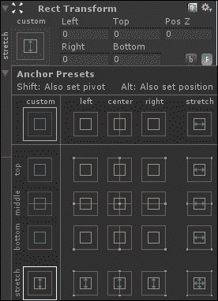
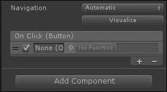

# 第二章。看起来不错–图形界面

在前一章中，我们介绍了 Unity 和 Android 的特性。我们还讨论了一起使用它们的好处。在我们安装完一系列软件并设置好设备后，我们创建了一个简单的 Hello World 应用程序来确认一切都连接正确。

本章讲述的是 **图形用户界面** ( **图形用户界面**)。我们将从创建一个简单的井字游戏开始，使用 Unity 提供的基本图形用户界面。接下来，我们将讨论如何改变图形用户界面控件的样式来改善游戏的外观。我们还将探索一些技巧和诀窍来处理安卓设备的许多不同屏幕尺寸。最后，我们将了解一种比前一章所述更快的方法，将我们的游戏放到设备上。说了这么多，我们开始吧。

在本章中，我们将涵盖以下主题:

*   用户偏好
*   按钮、文本和图像
*   动态图形用户界面定位
*   构建并运行

在本章中，我们将在 Unity 中创建新项目。这里的第一部分将引导您完成它的创建和设置。

# 创建井字游戏

本章的项目是一个简单的井字游戏，类似于我们任何人在纸上玩的游戏。和其他东西一样，有几种方法可以制作这个游戏。我们将使用 Unity 的 uGUI 系统，以便更好地理解如何为我们的任何其他游戏创建图形用户界面。

## 游戏棋盘

基本井字游戏涉及两个玩家和一个 3×3 的格子。玩家轮流用 Xs 和 Os 填充方块。首先用字母填充一行三个方块的玩家赢得游戏。如果所有的方块都填满了，而没有玩家达到三条线，那么游戏就是平局。让我们从以下步骤开始创建我们的游戏板:

1.  The first thing to do is to create a project for this chapter. So, start up Unity and we will do just that.

    如果到目前为止您一直在关注，Unity 应该会启动到最后一个打开的项目。这不是一个坏的特性，但它会变得非常烦人。这样想:你已经在一个项目上工作了一段时间，而且它已经变得很大了。现在您需要快速打开其他东西，但是 Unity 默认为您的巨大项目。如果你等待它打开，然后才能处理其他任何事情，它会消耗很多时间。

    要更改此功能，请转到 Unity 窗口顶部，点击**编辑**，然后点击**首选项**。这是我们更改脚本编辑器首选项的同一个地方。不过这次，我们将在**通用**选项卡中更改设置。以下截图显示了**常规**选项卡下的选项:

    

2.  在这个时刻，我们主要关注的是**启动时加载上一个项目**选项；不过，我们还是会依次覆盖所有选项。**通用**标签下的所有选项详细说明如下:
    *   **自动刷新**:这是 Unity 最好的功能之一。因为素材是在 Unity 之外更改的，所以此选项允许 Unity 自动检测更改并刷新项目中的素材。
    *   **启动时加载上一个项目**:这是一个很棒的选项，在安装 Unity 的时候，你要确保没有勾选这个选项。选中后，Unity 将立即打开您参与的最后一个项目，而不是**项目向导**。
    *   **导入时压缩素材**:这是游戏素材首次导入 Unity 时自动压缩的复选框。
    *   **编辑器分析**:此复选框用于 Unity 的匿名使用统计。保持选中状态，统一编辑器会偶尔向统一源发送信息。让它开着没有任何坏处，帮助 Unity 团队让 Unity 编辑器变得更好；然而，这归结于个人喜好。
    *   **显示素材商店搜索点击**:此设置仅在您计划使用**素材商店**时相关。素材商店可以成为任何游戏的巨大素材和工具来源；然而，由于我们不打算使用它，它与本书的相关性相当有限。它就像它的名字一样。当您在 Unity Editor 中搜索素材存储时，会根据此复选框显示结果数。
    *   **核实节约素材**:这是一个不错的选择，不做检查。如果打开此选项，每次在 Unity 中点击**保存**时，会弹出一个对话框，这样就可以确保保存自上次保存以来发生变化的所有素材。这个选项并不是关于你的模型和纹理，而是关于 Unity 的内部文件、材质和预置。现在最好不要谈了。
    *   **皮肤(仅限 Pro)**:此选项仅适用于 Unity Pro 用户。它提供了在统一编辑器的亮版本和暗版本之间切换的选项。这纯粹是化妆品，所以用你的直觉做这件吧。
3.  设置好偏好后，现在进入**文件**，然后选择**新项目**。
4.  点击**浏览...**按钮选择新项目的位置和名称。
5.  我们不会使用任何包含的软件包，所以点击**创建**，我们可以继续。

通过改变几个简单的选项，我们以后可以省去很多麻烦。对于本书中的简单项目来说，这似乎不是什么大事，但是对于大型复杂项目来说，即使您只想在项目之间快速切换，不选择正确的选项也会给您带来很多麻烦。

### 创建板

随着新项目的创建，我们有了一个全新的开始来创建我们的游戏。在我们创建核心功能之前，我们需要在场景中设置一些结构，以便我们的游戏可以工作，我们的玩家可以与之交互:

1.  Once Unity finishes initializing the new project, we need to create a new **canvas**. We can do this by navigating to **GameObject** | **UI** | **Canvas**. The whole of Unity's uGUI system requires a canvas in order to draw anything on the screen. It has a few key components, as you can see in the following **Inspector** window, which allow it and everything else in your interface to work:

    

    *   **矩形变换**:这是一种特殊类型的普通变换组件，你可以在游戏中使用的几乎所有其他对象上找到。它跟踪对象在屏幕上的位置、大小、旋转、旋转的枢轴点以及屏幕大小变化时的行为。默认情况下，画布的矩形变换被锁定，以包括整个屏幕的大小。
    *   **画布**:这个组件控制它和它控制的界面元素如何与相机和你的场景交互。您可以通过调整**渲染模式**来改变这一点。默认模式**屏幕空间–叠加**，意味着所有内容都将绘制在屏幕上，并覆盖场景中的其他内容。**屏幕空间-相机**模式将在距离相机特定距离处绘制所有内容。这允许您的界面受到相机透视特性的影响，但是任何可能更靠近相机的模型都会出现在它的前面。**世界空间**模式确保它控制的画布和元素像场景中的任何模型一样绘制在世界上。
    *   **Graphics Raycaster** :这是一个组件，可以让你实际上与你的各种界面元素进行交互和点击。
2.  当您添加画布时，一个名为**事件系统**的额外对象也被创建。这允许我们的按钮和其他界面元素与我们的脚本交互。如果您不小心删除了它，您可以通过转到统一的顶部并导航到**游戏对象** | **用户界面** | **事件系统**来重新创建它。
3.  接下来，我们需要调整 Unity Editor 显示我们游戏的方式，这样我们就可以轻松制作我们的游戏棋盘。为此，点击**场景**视图顶部的标签，切换到**游戏**视图。
4.  然后，点击显示**自由方面**的按钮，选择底部附近的选项: **3 : 2 风景(3 : 2)** 。大多数用来玩游戏的移动设备都会使用接近这个比例的屏幕。其余的不会在你的游戏中看到任何扭曲。
5.  为了让我们的游戏适应不同的分辨率，我们需要给画布对象添加一个新的组件。在**层级**面板中选择后，点击**检查器**面板中的**添加组件**，导航至**布局** | **画布缩放器**。所选组件允许我们从基本屏幕分辨率开始工作，让它随着设备的变化自动缩放我们的图形用户界面。
6.  要选择基本分辨率，从**用户界面缩放模式**下拉列表中选择**随屏幕尺寸缩放**。
7.  接下来，我们把**的`960`放在 X** 上，把**的`640`放在 Y** 上。使用更大的分辨率比使用更小的分辨率更好。如果您的分辨率太小，当您的图形用户界面元素被放大到高分辨率设备时，它们看起来会很模糊。
8.  为了保持事物有条不紊，我们需要创建三个空的游戏对象。回到 Unity 顶部，在**游戏对象**下选择**创建空**三次。
9.  在**层次**选项卡中，单击并将其拖动到我们的画布上，使其成为画布的子对象。
10.  为了使它们都可以用于组织我们的图形用户界面元素，我们需要添加矩形变换组件。通过导航到**检查器**中的**添加组件** | **布局** | **矩形变换**找到它。
11.  要给它们重新命名，请点击**检查器**顶部的名称，并输入新名称。说出一个`Board`，另一个`Buttons`，最后一个`Squares`。
12.  接下来，让`Buttons`和`Squares`成为`Board`的孩子。`Buttons`元素将保存我们游戏棋盘上所有可点击的棋子，`Squares`将保存已经选中的方块。
13.  To keep the `Board` element at the same place as the devices change, we need to change the way it anchors to its parent. Click on the box with a red cross and a yellow dot in the center at the top right of **Rect Transform** to expand the **Anchor Presets** menu:

    

14.  随着屏幕大小的变化，这些选项中的每一个都会影响元素将会停留在父元素的哪个角落。我们希望选择右下角有四个箭头的选项，每个方向一个箭头。这将使它与父元素一起拉伸。
15.  对`Buttons`和`Squares`也做同样的修改。
16.  将这些物体的**左侧**、**顶部**、**右侧**和**底部**设置为`0`。另外，确保**旋转**设置为`0`，**刻度**设置为`1`。否则，当我们在上面工作或玩耍时，我们的界面可能会被奇怪地缩放。
17.  接下来，我们需要更改板的锚点。如果**锚点**没有展开，点击左侧小三角形展开。无论哪种方式， **Max X** 值都需要设置为`0.667`，这样我们的棋盘将是一个正方形，覆盖我们屏幕的左三分之二。

这个游戏板是我们项目其余部分的基础。没有它，游戏就不能玩了。游戏方块用它在屏幕上画出自己，并把自己锚定在相关的地方。后来，当我们创建菜单时，需要确保玩家只看到我们需要他或她在那个时刻与之交互的内容。

### 游戏方块

现在我们已经有了我们的基础游戏板，我们需要实际的游戏方块。没有他们，这将是一个很难玩的游戏。我们需要创建九个按钮供玩家点击，九个图像作为所选方块的背景，九个文本显示哪个人控制方块。要创建和设置它们，请执行以下步骤:

1.  导航到**游戏对象** | **UI** 就像我们为画布做的一样，但是这次选择**按钮**、**图像**和**文本**来创建我们需要的一切。
2.  每个图像对象需要一个文本对象作为子对象。那么，所有图像必须是`Squares`对象的子对象，按钮必须是`Buttons`对象的子对象。
3.  所有的按钮和图像名称中都需要一个数字，这样我们才能保持它们的有序。命名按钮`Button0`至`Button8`和图像`Square0`至`Square8`。
4.  下一步是布局我们的板，这样我们可以保持事情有条理，并与我们的编程同步。我们需要具体设置每个编号集。但是首先，从**锚点预设**的右下角为所有锚点选择交叉箭头，并确保它们的**左**、**上**、**右**、**下**值设置为`0`。
5.  要将我们的每个按钮和方块设置在正确的位置，只需将数字与下表中的匹配即可。结果是所有的方块都是有序的， 从左上角开始到右下角结束:T39

    零

    T42 零点三三

    <colgroup><col style="text-align: left"><col style="text-align: left"><col style="text-align: left"><col style="text-align: left"><col style="text-align: left"></colgroup>
    | 

    平方

     | 

    最小 X

     | 

    最小 Y

     | 

    最大 x

     | 

    Max Y

     |
    | --- | --- | --- | --- | --- |
    | T36】零 | T44】零点六七 T46 | T48】零点三 T50 | T52】一 |
    | 一 | 零点三三 | 零点六七 | 零点六七 | T74】一 |
    | T80】二 | 零点三三 | 零点三三 | 零点六七 |
    | 四 | 零点三 | 零点三 | 一 | 零点六七 |
    | 六 | 零点 | 零点 | 零点三三零点三三 |
    | 八 | 零点六七 | 零点 | 一 | 零点三 |

6.  我们需要添加的最后一件事是一个指示器来显示轮到谁了。创建另一个**文本**对象，就像我们之前做的那样，并将其重命名为`Turn Indicator`。
7.  确定**左**、**顶**、**右**、**底**值再次设置为`0`后，再次将**锚点预设**设置为蓝色箭头。
8.  最后将**锚**下的 **Min X** 设置为`0.67`。
9.  我们现在有了玩井字游戏所需的一切。要将其检出，请选择**方块**对象，并取消选中右上角的框将其关闭。当你点击现在玩，你应该能够看到你的整个游戏板，并点击按钮。您甚至可以使用 Unity Remote 来测试它的触控设置。如果您还没有这样做，最好在继续之前保存场景。

游戏方块是建立我们初始游戏的最后一块。它现在看起来几乎像一个可玩的游戏。我们只需要添加一些脚本，我们就能玩所有我们想要的井字游戏。

## 控制比赛

拥有一个游戏棋盘是创造任何游戏最重要的部分之一。然而，如果我们不能控制当它的各种按钮被按下时会发生什么，这对我们没有任何好处。现在，让我们创建一些脚本并编写一些代码来解决这个问题:

1.  在**项目**面板中创建两个新脚本，就像我们在前一章中为*你好世界*项目所做的那样。命名新脚本`TicTacToeControl`和`SquareState`。打开它们并清除默认功能，就像我们在[第 1 章](1.html "Chapter 1. Saying Hello to Unity and Android")、*中向 Unity 和 Android* 问好一样。
2.  `SquareState`脚本将保存我们游戏棋盘每个方块的可能状态。为此，绝对清除脚本之外的所有内容，包括`using UnityEngine`行和`public class SquareState`行，以便我们可以用简单的枚举来替换它们。枚举只是潜在值的列表。这个是关于控制方块的玩家。它将允许我们跟踪 X 是否在控制它，O 是否在控制它，或者它是否清晰。`Clear`语句成为第一个，因此成为默认状态:

    ```java
    public enum SquareState {
      Clear,
      Xcontrol,
      Ocontrol
    }
    ```

3.  在我们的另一个脚本`TicTacToeControl`中，我们需要从一开始就在`using UnityEngine`下面增加一行开始。这一行让我们的代码与各种图形用户界面元素交互，最重要的是，与这个游戏交互，允许我们更改谁控制一个正方形以及轮到谁的文本:

    ```java
    using UnityEngine.UI;
    ```

4.  接下来，我们需要两个变量，它们将在很大程度上控制游戏的流程。需要添加它们来代替两个默认函数。第一个定义了我们的游戏板。这是一个由九个方块组成的数组，用来记录谁拥有什么。第二个记录该轮到谁。当布尔为`true`时，X 玩家获得一个回合。当布尔为`false`时，O 玩家获得一个回合:

    ```java
    public SquareState[] board = new SquareState[9];
    public bool xTurn = true;
    ```

5.  下一个变量将让我们更改屏幕上轮到谁的文本:

    ```java
    public Text turnIndicatorLandscape;
    ```

6.  这三个变量将使我们能够访问我们在上一节中设置的所有图形用户界面对象，允许我们根据谁拥有正方形来更改图像和文本。我们还可以在点击按钮和方块时打开和关闭它们。所有这些都标有**风景**，这样我们以后就可以保持直线，当我们有第二块板用于**肖像**设备的方向:

    ```java
    public GameObject[] buttonsLandscape;
    public Image[] squaresLandscape;
    public Text[] squareTextsPortrait;
    ```

7.  目前，最后两个变量将使我们能够访问需要更改背景的图像:

    ```java
    public Sprite oImage;
    public Sprite xImage;
    ```

8.  我们的这个脚本的第一个函数将在每次点击按钮时被调用。它接收点击的按钮数量，它做的第一件事是关闭按钮并打开方块:

    ```java
    public void ButtonClick(int squareIndex) {
      buttonsLandscape[squareIndex].SetActive(false);
      squaresLandscape[squareIndex].gameObject.SetActive(true);
    ```

9.  接下来，该函数检查我们之前创建的布尔值，看看轮到谁了。如果轮到 X 玩家，方块被设置为使用适当的图像和文本，表示他们的控制被设置。然后在控制方块的脚本内部板上做标记，最后切换到 O 玩家的回合:

    ```java
    if(xTurn) {
      squaresLandscape[squareIndex].sprite = xImage;
      squareTextsLandscape[squareIndex].text = "X";

      board[squareIndex] = SquareState.XControl;
      xTurn = false;
      turnIndicatorLandscape.text = "O's Turn";
    }
    ```

10.  下一段代码和前一段代码做了同样的事情，只是它标记了 O 玩家的控制权，并将回合改为 X 玩家:

    ```java
    else {
      squaresLandscape[squareIndex].sprite = oImage;
      squareTextsLandscape[squareIndex].text = "O";

      board[squareIndex] = SquareState.OControl;
      xTurn = true;
      turnIndicatorLandscape.text = "X's Turn";
    }
    }
    ```

11.  代码到此为止。接下来，我们需要返回到 Unity 编辑器，并在场景中设置我们的新脚本。您可以通过创建另一个空游戏对象并将其重命名为`GameControl`来实现这一点。
12.  选择对象后，通过从**项目**面板拖动脚本并将其放入**检查器**面板，将我们的`TicTacToeControl`脚本添加到其中。
13.  我们现在需要附加脚本需要的所有对象引用，以便实际工作。我们不需要触摸**检测器**面板中的**板**或 **XTurn** 插槽，但是**转向指示灯**对象确实需要从**层级**选项卡拖动到**检测器**面板中的**转向指示灯横向**插槽。
14.  接下来，展开**按钮风景**、**方块风景**和**方块文字风景**设置，并将每个**尺寸**槽设置为`9`。
15.  我们需要将相关对象从**层次**选项卡拖动到每个新的插槽。**按钮风景**下的**元素 0** 对象得到**按钮 0** 、**元素 1** 得到**按钮 1** 等等。对所有按钮、图像和文本执行此操作。确保你把他们放在正确的顺序，否则我们的脚本会出现混乱，因为它改变了玩家玩的东西。
16.  接下来，我们需要一些图像。如果您尚未导入本章的起始素材，请转到 Unity 的顶部，导航至**素材** | **导入新素材**，并选择要导入的文件。您需要一次导航并选择每一个。我们有**非正常**和**正常**来指示广场的控制。当按钮刚好坐在那里时使用**按钮正常**图像，当玩家触摸按钮时使用**按钮激活**。**标题**字段稍后将用于我们的主菜单。
17.  为了在我们的游戏中使用这些图像，我们需要更改它们的导入设置。依次选择它们，并在**检查器**面板中找到**纹理类型**下拉列表。我们需要把它们从**纹理**改成**雪碧(2D \乌圭)**。我们可以将其余的设置保留为默认值。如果我们在一个图像中有一个包含多个元素的精灵表，则使用**精灵模式**选项。**包装标签**选项用于分组和查找表格中的精灵。当在世界空间中渲染子画面时，**像素到单位**选项影响子画面的大小。**旋转**选项只是改变图像旋转的点。
18.  对于四个正方形图像，我们可以点击**精灵编辑器**来改变渲染时边框的显示方式。单击后，会打开一个新窗口，显示我们的图像，图像边缘有一些绿色线条，右下角有一些关于它的信息。我们可以拖动这些绿线来更改**边界**属性。绿线以外的任何东西都不会随着图像被拉伸，因为它会填充比它大的空间。每侧的`13`周围的设置将防止我们的整个边界拉伸。
19.  一旦做出任何更改，请确保点击**应用**按钮进行提交。
20.  接下来，再次选择**游戏控制**对象，并将**普通**图像拖至**图像**槽，将**普通**图像拖至**西马格**槽。
21.  Each of the buttons need to be connected to the script. To do this, select each of them from **Hierarchy** in turn and click on the plus sign at the bottom-right corner of their **Inspector**:

    

22.  然后我们需要点击**无功能**左边的小圆圈，在新窗口的列表中选择**游戏控制**。
23.  现在，导航到**无功能**|**tictactocontrol**|**按钮单击(int)** 将我们代码中的功能连接到按钮。
24.  最后，对于每个按钮，将按钮的编号放在功能列表右侧的编号槽中。
25.  为了保持一切井然有序，请重命名您的**画布**对象`GameBoard_Landscape`。
26.  Before we can test it out, be sure that the `Squares` object is turned on by checking the box in the top-left corner of its **Inspector**. Also, uncheck the box of each of its image children.

    

这可能看起来不是世界上最好的游戏，但它是可以玩的。我们在脚本中有调用函数的按钮。转弯指示灯会随着我们的游戏而变化。此外，每个方块都表示谁在被选中后控制了它。多做一点工作，这个游戏看起来会很棒。

# 乱搞字体

现在我们有了一个基本的工作游戏，我们需要让它看起来更好一点。我们将添加按钮图像，并选择一些新的字体大小和颜色，以使所有内容更易读:

1.  让我们从按钮开始。选择其中一个按钮元素，您将在**检查器**中看到它由一个**图像(脚本)**组件和一个**按钮(脚本)**组件组成。第一个组件控制图形用户界面元素如何显示。第二个控制当玩家与它交互时它如何变化，以及这触发了什么功能:
    *   **源图像**:这是当元素只是坐在那里，玩家没有接触时显示的基础图像。
    *   **颜色**:控制正在使用的图像的着色和褪色。
    *   **材质**:这可以让你使用一个纹理或着色器，否则可能会用在三维模型上。
    *   **图像类型**:这决定了图像将如何拉伸以填充可用空间。通常，它将被设置为**切片**，这是为使用边框的图像设置的，并且可以根据**填充中心**复选框选择填充颜色。否则，它通常会被设置为**简单**，例如，当您使用普通图像时，可以防止**保留外观**框被奇数大小的矩形变换拉伸。
    *   **可交互**:这只是切换玩家是否能够点击按钮并触发功能。
    *   **过渡**:这将改变当玩家与按钮交互时按钮的反应。**颜色色调**使按钮在交互时改变颜色。**精灵 wap** 互动时会改变形象。**动画**将让你为状态之间的转换定义更复杂的动画序列。
    *   **目标图形**是用于在屏幕上绘制按钮的基准图像的参考。
    *   **正常**槽、**高亮**槽、**按下**槽和**禁用**槽定义了当按钮没有被交互或鼠标悬停，或玩家点击按钮且按钮被关闭时要使用的效果或图像。
2.  对于我们的每个按钮，我们需要将我们的**按钮正常**图像从我们的**项目**面板拖动到**源图像**槽。
3.  接下来，点击**颜色**槽右侧的白色方框，打开颜色选择器。为了防止我们的按钮褪色，我们需要将 **A** 滑块一直向右移动或将框设置为`255`。
4.  当我们的按钮被按下时，我们想要更改图像，所以将**过渡**更改为**精灵 wap** 。
5.  移动设备几乎没有办法悬停在 GUI 元素上，所以我们不需要担心**高亮**状态。然而，我们确实想将我们的**按钮激活**图像添加到**按下的精灵**插槽中，这样当玩家触摸按钮时，它就会切换。
6.  按钮方块应该是空白的，直到有人点击它们，所以我们需要去掉文本元素。最简单的方法是选择按钮下的每一个并删除它。
7.  接下来，我们需要更改每个图像元素的**文本**子元素。正是**文本(脚本)**组件允许我们控制文本在屏幕上的绘制方式。
    *   **文本**:这是我们可以更改将在屏幕上绘制的文本的区域。
    *   **字体**:这允许我们选择项目中用于文本的任何字体文件。
    *   **字体样式**:这样可以让你调整文字的粗斜体性质。
    *   **字号**:这是文字的大小。这就像在你最喜欢的文字处理器中选择字体大小。
    *   **行距**:这是每一行文字之间的距离。
    *   **富文本**:这将让你使用一些特殊的 HTML 样式标签，只影响带有颜色、斜体等的部分文本。
    *   **对齐**:这将更改文本在框中居中的位置。前三个框调整水平位置。后三个改变垂直位置。
    *   **水平溢出/垂直溢出**:这些调整文字是否可以画在框外，是否可以换行，是否可以剪掉。
    *   **最佳匹配**:这将在**最小值**和**最大值**的范围内，自动调整文本的大小，以适应动态改变大小的元素。
    *   **颜色/材质**:这些会在绘制时改变文本的颜色和纹理。
    *   **阴影(脚本)**:这个组件为文本添加了一个投影，就像你在 Photoshop 中可能添加的一样。
8.  对于我们的每个文本元素，我们需要使用`120`的**字体大小**，并且**对齐方式**应该居中。
9.  对于**转弯指示器**文本元素，我们还需要使用`120`的**字体大小**，并且它也需要居中。
10.  The last thing to do is to change the **Color** of the text elements to a dark gray so that we can easily see it against the color of our buttons:

    

现在，我们的董事会工作，看起来也很好。试着给按钮添加你自己的图片。您将需要两个图像，一个是当按钮位于那里时，一个是当按钮被按下时。另外，默认的 Arial 字体很无聊。为您的游戏找到一种新字体；您可以像导入任何其他游戏素材一样导入它。

# 旋转装置

如果你到目前为止一直在测试你的游戏，你可能已经注意到，只有当我们将设备保持在横向模式时，游戏才会看起来不错。当它保持在纵向模式时，当正方形和转向指示器试图共享少量可用的水平空间时，一切都变得拥挤。因为我们已经在一种布局模式下设置了我们的游戏板，所以在另一种模式下复制它变得相当简单。然而，它确实需要复制我们代码的很大一部分才能使其正常工作:

1.  要复制我们的游戏板，右键单击它，并从新菜单中选择**复制**。重命名复制的游戏板`GameBoard_Portrait`。这将是我们玩家的设备处于肖像模式时使用的棋盘。要查看我们正在进行的更改，请关闭风景游戏板，并从**游戏**窗口左上角的下拉列表中选择 **3:2 肖像(2:3)** 。
2.  选择**棋盘**对象，该对象是**游戏棋盘 _ 人像**的子对象。在它的**检查器**面板中，我们需要改变锚点来使用屏幕的前三分之二，而不是左三分之二。**最小 X** 、`0.33`最小 Y 、`1`最大 X 和**最大 Y** 的值会使这种情况发生。
3.  接下来，需要选择**转向指示灯**，并将其移动到屏幕的下三分之一。**最小 X** 和**最小 Y** 的`0`、**最大 X** 的`1`和**最大 Y** 的`0.33`的值在这里会很好地工作。
4.  现在我们已经建立了第二个板，我们需要在代码中为它留出一个位置。所以，打开`TicTacToeControl`脚本，滚动到顶部，这样我们就可以从一些新的变量开始了。
5.  我们要添加的第一个变量将允许我们访问屏幕纵向模式的转向指示器:

    ```java
    public Text turnIndicatorPortrait;
    ```

6.  接下来的三个变量将跟踪按钮、正方形图像和所有者文本信息。这些就像我们之前创建的三个列表一样，在棋盘处于横向模式时跟踪棋盘:

    ```java
    public GameObject[] buttonsPortrait;
    public Image[] squaresPortrait;
    public Text[] squareTextsPortrait;
    ```

7.  我们要添加到脚本顶部的最后两个变量用于跟踪实际绘制游戏棋盘的两个画布对象。我们需要这些，以便当用户转动设备时可以在它们之间切换:

    ```java
    public GameObject gameBoardGroupLandscape;
    public GameObject gameBoardGroupPortrait;
    ```

8.  接下来，我们需要更新我们的一些功能，以便它们对两个板都进行更改，而不仅仅是风景板。这前两行关闭肖像板的按钮，当玩家点击它们时，方块打开。他们需要在我们的`ButtonClick`功能开始时就走。将它们放在我们在风景布景的按钮和方块上使用`SetActive`的两条线之后:

    ```java
    buttonsPortrait[squareIndex].SetActive(false);
    squaresPortrait[squareIndex].gameObject.SetActive(true);
    ```

9.  这两个行改变了控制方块的图像和文本，有利于**肖像**集的 X 玩家。它们进入我们的`ButtonClick`函数的`if`语句中，就在对景观集执行相同操作的两行之后:

    ```java
    squaresPortrait[squareIndex].sprite = xImage;
    squareTextsPortrait[squareIndex].text = "X";
    ```

10.  该行位于同一`if`语句的末尾，并更改**肖像**集的转向指示灯文本:

    ```java
    turnIndicatorPortrait.text = "O's Turn";
    ```

11.  接下来的两行更改图像和文本，以利于 O 播放器。在我们的`ButtonClick`功能的`else`声明中，它们遵循**景观**集的相同路线:

    ```java
    squaresPortrait[squareIndex].sprite = oImage;
    squareTextsPortrait[squareIndex].text = "O";
    ```

12.  这是我们需要添加到`ButtonClick`函数的最后一行；需要放在`else`语句的末尾。它只是简单地改变了指示轮到谁的文本:

    ```java
    turnIndicatorPortrait.text = "X's Turn";
    ```

13.  接下来，我们需要创建一个新的功能来控制当玩家改变他们设备的方向时我们游戏板的变化。我们将从定义`Update`函数开始。这是 Unity 为每一帧调用的特殊功能。它将允许我们检查每个帧的方向变化:

    ```java
    public void Update() {
    ```

14.  该功能以`if`语句开始，该语句使用`Input.deviceOrientation`来找出玩家的设备当前是如何被持有的。它将这一发现与`LandscapeLeft`方向进行比较，以查看设备是否开始侧向握持，主页按钮在左侧。如果结果为真，则关闭图形用户界面元素的**肖像**设置，同时打开**风景**设置:

    ```java
    if(Input.deviceOrientation == DeviceOrientation.LandscapeLeft) {
      gameBoardGroupPortrait.SetActive(false);
      gameBoardGroupLandscape.SetActive(true);
    }
    ```

15.  下一个`else if`语句检查`Portrait`方向，如果主页按钮被按下。如果`true` :

    ```java
    else if(Input.deviceOrientation == DeviceOrientation.Portrait) {
      gameBoardGroupPortrait.SetActive(true);
      gameBoardGroupLandscape.SetActive(false);
    }
    ```

    ，则开启**肖像**，开启**风景**
16.  当主页按钮在右侧时，此 `else if`语句正在检查`LanscapeRight`:

    ```java
    else if(Input.deviceOrientation == DeviceOrientation.LandscapeRight) {
      gameBoardGroupPortrait.SetActive(false);
      gameBoardGroupLandscape.SetActive(true);
    }
    ```

17.  最后，我们检查`PortraitUpsideDown`方向，即主页按钮位于设备顶部时。不要忘记关闭和结束功能的额外支架:

    ```java
    else if(Input.deviceOrientation == DeviceOrientation.PortraitUpsideDown) {
      gameBoardGroupPortrait.SetActive(true);
      gameBoardGroupLandscape.SetActive(false);
    }
    }
    ```

18.  我们现在需要返回到 Unity 并选择我们的**游戏控制**对象，以便我们可以设置我们新的**检测器**属性。
19.  将各个棋子从**层级**中的人像游戏棋盘拖放到**督察**、**转向指示灯**中的相关槽位到**转向指示灯人像**槽位，将按钮依次拖放到**按钮人像**列表中，将方块拖放到**方块人像**中，将它们的文字子级拖放到**方块文字人像**中。
20.  Finally, drop the **GameBoard_Portrait** object in the **Game Board Group Portrait** slot.

    

现在，当我们改变设备的方向时，我们应该能够玩我们的游戏并看到板开关。您将不得不在您的设备上构建您的项目，或者使用 Unity Remote 进行连接，因为编辑器本身和您的计算机不像您的移动设备那样具有设备方向。请务必将您的**游戏**窗口的显示模式设置为左上角的**远程**，以便在使用统一远程时，它会随着您的设备一起更新。

# 菜单和胜利

我们的游戏接近完成。我们最后需要的东西如下:

*   玩家可以开始新游戏的开始菜单
*   一点代码，用于检查是否有人赢得了比赛
*   游戏结束菜单，用于显示谁赢得了游戏

## 设置元素

与游戏棋盘相比，我们的两个新菜单将非常简单。开始菜单将由我们游戏的标题图形和一个按钮组成，而游戏结束菜单将有一个文本元素来显示胜利信息和一个按钮来返回主菜单。让我们执行以下步骤来设置元素:

1.  让我们从开始菜单开始，像以前一样创建一个新的**画布**，并将其重命名为`OpeningMenu`。这将允许我们将它与我们创建的其他屏幕分开。
2.  接下来，菜单需要一个**图像**元素和一个**按钮**元素作为子元素。
3.  为了让一切都变得更容易操作，关闭游戏板的**检查器**窗口顶部的复选框。
4.  对于我们的图像对象，我们可以将我们的**标题**图像拖到**源图像**槽中。
5.  对于图像的**矩形变换**，我们需要将**位置 X** 和**位置 Y** 的值设置为`0`。
6.  我们还需要调整**宽度**和**高度**。我们将匹配原始图像的尺寸，这样它就不会被拉伸。为**宽度**输入`320`，为**高度**输入`160`。
7.  要将图像移动到屏幕的上半部分，在**枢轴 Y** 槽中放一个`0`。这将改变图像的位置。
8.  对于按钮的**矩形变换**，我们再次需要**位置 X** 和**位置 Y** 的`0`值。
9.  我们再次需要**宽度**的值`320`，但是这次我们需要**高度**的值`100`。
10.  要将移动到屏幕的下半部分，我们需要在**枢轴 Y** 槽中有一个值`1`。
11.  接下来是为按钮设置图像，就像我们之前为游戏板所做的那样。将`ButtonNormal`图像放入**源图像**槽中。将**过渡**改为**精灵 wap** 并将`ButtonActive`图像放入**按压精灵**槽中。不要忘记将**颜色**更改为拾色器中`255`的 **A** 值，这样我们的按钮就不会部分褪色。
12.  最后，要更改按钮文本，请在**层次结构**中展开**按钮**，并选择**文本**子对象。
13.  Right underneath **Text** in the **Inspector** panel for this object is a text field where we can change the text displayed on the button. A value of `New Game` here will work well. Also, change **Font Size** to `45` so that we can actually read it.

    

14.  接下来，我们需要创建游戏结束菜单。所以，关闭我们的开始菜单，为我们的游戏菜单创建一个新的画布。改名`GameOverMenu`这样我们就可以继续有组织了。
15.  对于这个菜单，我们需要一个**文本**元素和一个**按钮**元素作为其子元素。
16.  我们将以与前一个几乎相同的方式设置这个。对于**位置 X** 和**位置 Y** 插槽，文本和按钮都需要`0`值，对于**宽度**需要`320`值。
17.  文本将使用`160`的**高度**和`0`的**枢轴 Y** 。我们还需要将其**字号**设置为`80`。您可以更改默认文本，但它仍会被我们的代码覆盖。
18.  要使我们的文本在菜单中居中，请从**对齐**属性旁边的两组按钮中选择中间的按钮。
19.  该按钮将使用`100`的**高度**和`1`的**枢轴 Y** 。
20.  此外，请务必将**源图像**、**颜色**、**过渡**和**按压精灵**设置为正确的图像和设置。
21.  The last thing to set is the button's text child. Set the default text to **Main Menu** and give it a **Font Size** of `45`.

    

这就是我们设置菜单的原因。我们拥有让玩家与我们的游戏互动所需的所有屏幕。唯一的问题是我们没有任何功能让他们真正做任何事情。

## 添加代码

为了让我们的游戏面板按钮工作，我们必须在我们的脚本中创建一个函数，当它们被触摸时，它们可以引用和调用。主菜单的按钮将开始一个新的游戏，而游戏结束菜单的按钮将改变屏幕到主菜单。我们还需要创建一点代码来清除和重置新游戏开始时的游戏板。如果我们不这样做，玩家如果想再次玩，就不可能在被要求重启整个应用之前玩一轮以上。

1.  打开`TicTacToeControl`脚本，这样我们可以对其进行更多的修改。
2.  我们将从在脚本顶部添加三个变量开始。前两个将跟踪两个新菜单，允许我们根据需要打开和关闭它们。第三个是屏幕上的游戏文本对象，它将使我们能够根据游戏结果发布消息。
3.  接下来，我们需要创建一个新的函数。主菜单中的按钮将调用`NewGame`功能。它的目的是重置棋盘，这样我们就可以继续玩，而不必重置整个应用程序:

    ```java
    public void NewGame() {
    ```

4.  该功能首先将游戏设置为在轮到 X 玩家时开始。然后它会创建一个新的`SquareStates`数组，有效地清除旧的游戏板。然后设置**风景**和**肖像**控制装置的转向指示灯:

    ```java
    xTurn = true;
    board = new SquareState[9];
    turnIndicatorLandscape.text = "X's Turn";
    turnIndicatorPortratit.text = "X's Turn";
    ```

5.  接下来，我们循环浏览**肖像**和**风景**控件的九个按钮和方块。使用`SetActive`打开所有按钮并关闭方块，这与点击**检查器**面板左上角的小复选框相同:

    ```java
    for(int i=0;i<9;i++) {
      buttonsPortrait[i].SetActive(true);
      squaresPortrait[i].gameObject.SetActive(false);

      buttonsLandscape[i].SetActive(true);
      squaresLandscape[i].gameObject.SetActive(false);
    }
    ```

6.  最后三行代码控制当我们切换到游戏板时哪些屏幕是可见的。默认情况下，它选择打开**风景**板，并确保关闭**肖像**板。然后关闭主菜单。别忘了最后一个用来关闭函数的花括号:

    ```java
      gameBoardGroupPortrait.SetActive(false);
      gameBoardGroupLandscape.SetActive(true);
      mainMenuGroup.SetActive(false);
    }
    ```

7.  接下来，我们需要在`ButtonClick`函数的末尾添加一行代码。处理完按钮和方块后，检查是否有人赢了游戏是一个简单的调用:

    ```java
    CheckVictory();
    ```

8.  `CheckVictory`功能贯穿了游戏胜利的可能组合。如果找到三个匹配的方块，将调用`SetWinner`函数，当前游戏将结束:

    ```java
    public void CheckVictory() {
    ```

9.  这场比赛的胜利是三个匹配的方块。我们首先检查由循环标记的列。如果第一个方块不是`Clear`，与下面的方块比较；如果他们匹配，对照下面的方块检查。我们的棋盘存储为一个列表，但绘制为一个网格，因此我们必须添加三个才能进入一个正方形。`else if`语句跟随每行的检查。通过将我们的循环值乘以 3，我们将跳过每个循环的一行。我们将再次比较这个正方形和`SquareState.Clear`，然后是它右边的正方形，最后是它右边的两个正方形。如果任何一组条件都正确，我们会将该组中的第一个方块发送到另一个功能来更改我们的游戏屏幕:

    ```java
    for(int i=0;i<3;i++) {
      if(board[i] != SquareState.Clear && board[i] == board[i + 3] && board[i] == board[i + 6]) {
        SetWinner(board[i]);
        return;
      }
      else if(board[i * 3] != SquareState.Clear && board[i * 3] == board[(i * 3) + 1] && board[i * 3] == board[(i * 3) + 2]) {
        SetWinner(board[i * 3]);
        return;
      }
    }
    ```

10.  下面的代码片段与我们刚刚看到的`if`语句基本相同。然而，这些代码行检查对角线。如果条件为`true`，再次发送到其他功能改变游戏画面。您可能也注意到了函数调用后的返回。如果我们在任何时候都找到了一个赢家，就没有必要再检查棋盘了。因此，我们将提前退出`CheckVictory`功能:

    ```java
    if(board[0] != SquareState.Clear && board[0] == board[4] && board[0] == board[8]) {
      SetWinner(board[0]);
      return;
    }
    else if(board[2] != SquareState.Clear && board[2] == board[4] && board[2] == board[6]) {
      SetWinner(board[2]);
      return;
    }
    ```

11.  这是我们`CheckVictory`功能的最后一点。如果没有人赢得比赛，正如这个函数前面的部分所确定的那样，我们必须检查是否有平局。这是通过检查游戏板的所有方块来完成的。如果其中任何一个是`Clear`，游戏还没有结束，我们就退出功能。但是，如果我们在整个循环中没有找到一个`Clear`方块，我们通过宣布平局来确定获胜者:

    ```java
    for(int i=0;i<board.Length;i++) {
      if(board[i] == SquareState.Clear)
        return;
    }
    SetWinner(SquareState.Clear);
    }
    ```

12.  接下来，我们创建在我们的`CheckVictory`函数中重复调用的`SetWinner`函数。此功能传递谁赢了游戏，它最初打开屏幕上的游戏并关闭游戏板:

    ```java
    public void SetWinner(SquareState toWin) {
      gameOverGroup.SetActive(true);
      gameBoardGroupPortrait.SetActive(false);
      gameBoardGroupLandscape.SetActive(false);
    ```

13.  然后，该功能检查谁赢了，并为`victorText`对象选择适当的消息:

    ```java
      if(toWin == SquareState.Clear) {
        victorText.text = "Tie!";
      }
      else if(toWin == SquareState.XControl) {
        victorText.text = "X Wins!";
      }
      else {
        victorText.text = "O Wins!";
      }
    }
    ```

14.  最后，我们有`BackToMainMenu`功能。这是短暂而甜蜜的；只需通过游戏切换屏幕上的按钮，切换回主菜单:

    ```java
    public void BackToMainMenu() {
      gameOverGroup.SetActive(false);
      mainMenuGroup.SetActive(true);
    }
    ```

这就是我们游戏中所有的代码。我们有构成我们游戏的所有视觉部分，现在，我们也有所有功能部分。最后一步是把它们放在一起，完成游戏。

## 把它们放在一起

我们有自己的代码和菜单。一旦我们把它们连接在一起，我们的游戏就完成了。要将它们放在一起，请执行以下步骤:

1.  回到统一编辑器，从**层级**面板中选择**游戏控制**对象。
2.  需要填写其**检查器**窗口中的三个新属性。将**打开菜单**画布拖到**主菜单组**槽，将**游戏菜单**拖到**游戏结束组**槽。
3.  另外，找到 **GameOverMenu** 的文本对象子对象，并将其拖动到 **Victor Text** 槽中。
4.  接下来，我们需要连接每个菜单的按钮功能。让我们从选择**打开菜单**画布的按钮对象子对象开始。
5.  点击其**按钮(脚本)**组件右下角的小加号，添加新的功能插槽。
6.  单击新插槽中心的圆圈，并从新的弹出窗口中选择**游戏控制**，就像我们对每个游戏板按钮所做的那样。
7.  当前显示**无功能**的下拉列表是我们的下一个目标。点击进入**tictactocontrol**|**new game()**。
8.  重复这几个步骤，将功能添加到**游戏菜单**的按钮子菜单中。除此之外，从列表中选择 **BackToMainMenu()** 。
9.  最后要做的事情是关闭游戏板和游戏结束菜单，使用**检查器**左上角的复选框。只打开开始菜单，这样我们玩游戏的时候就可以开始了。

恭喜你！这是我们的游戏。我们所有的按钮都设置好了，我们有多个菜单，我们甚至创建了一个游戏板，它会根据玩家设备的方向而变化。最后要做的事情是为我们的设备构建它，并去展示它。

# 为设备构建的更好方法

现在，对于构建过程中每个人都渴望学习的部分。有一种更快更简单的方法可以让你的游戏在你的安卓设备上运行。漫长而复杂的路还是很好知道的。如果这个较短的方法失败了，并且在某个时候会失败，那么了解长方法是有帮助的，这样您就可以调试任何错误。此外，短路径仅适用于单个设备的构建。如果您有多个设备和一个大型项目，那么在短暂的构建过程中加载它们将花费更多的时间。请遵循以下步骤:

1.  Start by opening the **Build Settings** window. Remember, it can be found under **File** at the top of the Unity Editor.

    如果你还没有这样做，保存你的场景。保存场景的选项也可以在 Unity 编辑器顶部的**文件**下找到。

2.  点击**添加当前**按钮，将我们当前的场景，也是唯一的场景，添加到**场景构建**列表中。如果这个列表是空的，就没有游戏。
3.  如果你还没有把你的**平台**换成**安卓**。毕竟，这仍然是这本书的重点。
4.  别忘了设置**玩家设置**。点击**播放器设置**按钮，在**检查器**窗口中打开它们。你可能还记得第一章*向 Unity 和 Android* 问好。
5.  在顶部，设置**公司名称**和**产品名称**字段。这些字段的`TomPacktAndroid`和`Ch2 TicTacToe`值将分别与包含的已完成项目相匹配。记住，玩你游戏的人会看到这些区域。
6.  还需要设置**其他设置**下的**捆标识符**字段。格式还是`com.CompanyName.ProductName`，所以`com.TomPacktAndroid.Ch2.TicTacToe`会很好用。为了看到我们酷的动态图形用户界面在设备上的运行，还有一个设置应该更改。点击**分辨率**和**演示**展开选项。
7.  We are interested in **Default Orientation**. The default is **Portrait**, but this option means that the game will be fixed in the portrait display mode. Click on the drop-down menu and select **Auto Rotation**. This option tells Unity to automatically adjust the game to be upright irrespective of the orientation in which it is being held.

    选择**自动旋转**时弹出的新选项集允许限制支持的方向。也许你正在做一个游戏，需要更宽，并在横向举行。取消选中**人像**和**人像倒置**，Unity 仍会调整(但仅适用于其余方向)。

    ### 注

    在你的安卓设备上，控制是沿着较短的一边；这些通常是主页、菜单和后退或最近的应用按钮。这一侧通常被认为是设备的底部，正是这些按钮的位置决定了每个方向。**纵向**模式是当这些按钮相对于屏幕向下时。**风景右**模式是当他们在右边的时候。模式开始变得清晰，不是吗？

8.  对于现在，保持所有方向选项被选中，我们将回到**构建设置**。
9.  下一步(也是非常重要的一步)是将您的设备连接到您的计算机，并给它一个被识别的时间。如果您的设备不是第一个连接到计算机的设备，此较短的构建路径将会失败。
10.  在**构建设置**窗口的右下角，点击**构建并运行**按钮。你将被要求给出申请文件，APK，一个相关的名字，并保存到一个适当的位置。像`Ch2_TicTacToe.apk`这样的名字就可以了，把文件保存到桌面就足够合适了。
11.  点击**保存**并坐下来观看提供的精彩加载栏。如果您注意到我们在[第 1 章](1.html "Chapter 1. Saying Hello to Unity and Android")*中 *Hello World* 项目中构建的加载栏，向 Unity 和 Android* 问好，您会注意到我们这次多走了一步。构建应用程序后，有一个推至设备的步骤。这意味着构建成功，Unity 现在正在您的设备上安装应用程序。完成后，游戏将在设备上开始，加载也将完成。

我们刚刚了解到由**构建设置**窗口提供的**构建和运行**按钮。这是快速、简单的，并且没有使用命令提示符的痛苦；短的构建路径不是很棒吗？但是，如果构建过程由于任何原因失败，包括找不到设备，应用程序文件将不会被保存。如果您想再次尝试安装，您必须再次完成整个构建过程。这对于我们简单的井字游戏来说还不错，但是对于一个更大的项目来说，这可能会消耗很多时间。此外，在构建时，您只能有一台安卓设备连接到您的计算机。任何更多的设备和构建过程肯定会失败。Unity 也不会检查多个设备，直到它完成了剩下的可能很长的构建过程。

除了这些警告之外，**构建并运行**选项真的很不错。让 Unity 来处理让游戏进入你的设备的困难部分。这让我们有更多的时间专注于测试和制作一个伟大的游戏。

如果你准备迎接一个挑战，这是一个艰难的挑战:创造一个单人模式。你必须从在开始屏幕上增加一个额外的按钮来选择第二种游戏模式开始。电脑播放器的任何逻辑都应该进入`Update`功能。另外，看一下`Random.Range`随机选择一个方块进行控制。否则，你可以多做一点工作，让计算机搜索一个可以获胜的方块，或者创建一行两个匹配项。

# 总结

此时，您应该已经熟悉了 Unity 新的 uGUI 系统，包括如何定位 GUI 元素、设计它们以满足您的需求，以及为它们添加功能。

在这一章中，我们通过创建一个井字游戏了解了所有关于图形用户界面的知识。我们首先熟悉了在游戏的图形用户界面画布上创建按钮和其他对象。在钻研改进我们游戏的外观之后，当我们在游戏板上添加动态方向时，我们继续改进它。我们创建了一个开合屏幕来完善游戏体验。最后，我们探索了一种将游戏放到设备上的替代构建方法。

在下一章，我们将开始一个新的更复杂的游戏。我们将创建的坦克战游戏将用于了解任何游戏的基本构件:网格、材质和动画。当一切完成后，我们将能够驾驶一辆坦克绕过一个五彩缤纷的城市，拍摄动画目标。