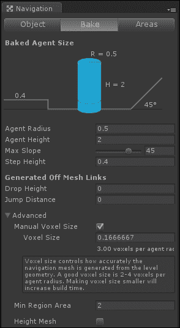
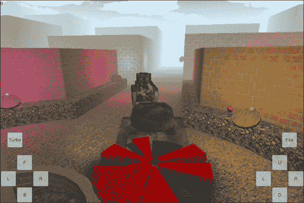
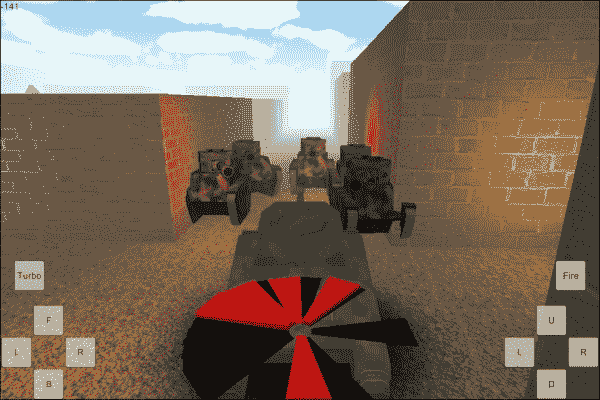

# 第五章。四处走动——寻路和人工智能

在前一章中，我们学习了相机和灯光效果。我们在坦克战游戏中增加了天空盒子、灯光和阴影。我们创建了光照贴图来使场景动态化。我们用坦克前灯看了看饼干。我们还通过为坦克创建斑点阴影来观察投影仪。该坦克还采用了涡轮增压技术。通过调整摄像机的视角，我们能够让坦克看起来比实际速度快得多。当我们完成这一章时，我们看到了一个充满活力和令人兴奋的场景。

这一章是关于敌人的。玩家不再能够仅仅坐在一个地方收集点数。我们将在游戏中增加一辆敌方坦克。通过使用 Unity 的 NavMesh 系统，坦克将能够进行寻路和追击玩家。一旦找到玩家，坦克就会射击，降低玩家的分数。

在本章中，我们将涵盖以下主题:

*   导航网格
*   导航代理
*   寻路
*   追逐和攻击人工智能
*   产卵点

我们将从[第 4 章](4.html "Chapter 4. Setting the Stage – Camera Effects and Lighting")、*设置舞台-摄像机效果和灯光*开始对坦克战游戏进行修改，所以加载它，我们就可以开始了。

# 理解 AI 和寻路

**AI** 是，正如你可能已经猜到的，**人工智能**。从最广泛的意义上来说，这是一个无生命的物体可能做的任何事情，似乎在做决定。你可能最熟悉电子游戏中的这个概念。当一个不受玩家控制的角色选择一件武器和一个目标来使用它时，这就是 AI。

在其最复杂的形式中，人工智能试图模仿完整的人类智能和学习。然而，仍然有太多的事情发生得太快，以至于无法真正成功。电子游戏不需要走到这一步。我们主要关心的是让我们的角色看起来聪明，但仍然可以被我们的玩家征服。通常，这意味着不允许角色根据比真实玩家更多的信息行动。调整角色拥有和可以作用的信息量是调整游戏难度的好方法。

**寻路** 是 AI 的一个子集。我们一直在使用它，尽管你可能从未意识到。寻路，正如这个词所暗示的，是找到一条路的行为。每次你需要在任意两点之间寻找你的路时，你都是在寻路。就我们的角色而言，最简单的寻路形式是沿着直线到达目标点。显然，这种方法在开阔的平原上效果最好，但是当路上有任何障碍时，往往会失败。另一种方法是用网格覆盖游戏。使用网格，我们可以找到一条绕过任何障碍物并到达目标的路径。

寻路的另一种方法，也可能是最常选择的方法，是使用一种特殊的导航网格，即导航网格。这只是一个玩家从未见过的特殊模型，但涵盖了计算机角色可以移动的所有区域。然后以类似于网格的方式导航玩家；不同之处在于使用的是网格的三角形，而不是网格的正方形。这是我们将在 Unity 中使用的方法。Unity 为创建和使用 NavMesh 提供了一套很好的工具。

# 导航网

在 Unity 中创建导航网格非常简单。这个过程类似于我们制作光照图的过程。我们只是标记一些要使用的网格，在一个特殊的窗口中调整一些设置，然后点击一个按钮。所以，如果你还没有在 Unity 中加载坦克战游戏，我们可以开始了。

Unity 可以根据场景中存在的任何网格自动生成导航网格。为此，网格必须首先标记为静态，就像我们对光照贴图所做的那样。然而，我们不希望或不需要能够导航我们城市的屋顶，所以我们使用一个特殊的设置列表来指定每个对象将是什么类型的静态。让我们从以下步骤开始:

1.  Select the city from the **Hierarchy** window and click on the down arrow to the right of **Static** in the **Inspector** window:

    

    我们可以看看静态对象可用的选项如下:

    *   **无**:此选项用于快速取消选择所有其他选项。如果未选中所有其他选项，将选中此选项。
    *   **一切**:使用该选项，可以快速选择所有其他选项。当它们都被检查时，这个也会被检查。在**检查器**窗口中**静态**标签旁边的复选框执行与选中和取消选中**一切**复选框相同的功能。
    *   **光照贴图静态**:使用光照贴图时，需要勾选此选项，以使其工作。任何未选中此项的网格都不会被光照贴图。
    *   **封堵器静态**:这是一个使用封堵器的选项。**遮挡** 是一种运行时优化的方法，只涉及渲染实际上可以看到的对象，无论它们是否在相机的视图空间内。**封堵器** 是一个可以阻挡其他物体被看到的物体。它与**阻塞静态**选项配合使用。此选项的最佳对象选择是大而坚固的。
    *   **批处理静态**:这是运行时优化的另一个选项。批处理是在呈现对象之前将它们分组在一起的行为。它大大提高了游戏的整体渲染速度。
    *   **导航静态**:这是我们目前主要关注的选项。计算导航网格时，将使用任何选中此选项的网格。
    *   **封堵器静态**:刚才提到了，这个选项和**封堵器静态**配合使用，有利于遮挡。一个**遮挡** 是一个会被其他物体遮挡的物体。当被封堵器覆盖时，这个物体将不会被绘制。
    *   **非网格链接生成**:该选项也适用于导航网格计算。离网链接是指 NavMesh 中没有物理连接的两个部分之间的连接，例如屋顶和街道。使用**导航**窗口中的一些设置和该选项，链接会自动生成。
    *   **反射探头静态**:最后一个选项允许通过反射探头记录物体。它们记录周围的一切，并生成一个可由反射着色器使用的立方体贴图。
2.  为了使 NavMesh 正常工作，我们需要更改设置，以便只能导航城市的街道。你最后一次看到坦克从楼顶跳下或坠落是什么时候？因此，我们需要更改静态选项，以便只有街道检查了**导航静态**。这可以通过以下两种方式之一来实现:
    *   第一种方法是浏览并取消选中我们想要更改的每个对象的选项。
    *   第二种是在**层级**窗口中取消顶层对象的**导航静态**，当 Unity 询问我们是否要对所有子对象进行更改时，回答是。然后，转到我们想要导航的对象，并重新检查选项。
3.  Now, open the **Navigation** window by going to Unity's toolbar and click on **Window** and then click on **Navigation** at the bottom of the menu. The following screenshot displays the window where all the work of making the NavMesh happens:

    

4.  This window consists of three pages and a variety of settings:

    选择对象后，设置将出现在**对象**页面。这两个复选框直接对应于我们刚才设置的同名**静态**选项。**导航区**中的下拉列表允许我们对导航网格的不同部分进行分组。这些组可用于影响寻路计算。例如，汽车可以设置为仅在道路区域行驶，人类可以跟随人行道区域。

    **烘焙**页面是我们感兴趣的页面；它充满了改变导航网格生成方式的选项。它甚至在顶部包含了各种设置的可视化表示:

    *   **代理半径**:这个应该设置为最薄字符的大小。它用来防止角色走得离墙太近。
    *   **特工高度**:这是你角色的高度。利用这一点，Unity 可以计算并移除太低而无法通过的区域。任何低于这个值的都被认为太小了，所以它应该被设置为你最短角色的高度。
    *   **最大坡度**:计算导航网格时，任何比该值更陡的都将被忽略。
    *   **台阶高度**:使用楼梯时，必须使用该值。这是角色可以踩的最大楼梯高度。
    *   **跌落高度**:这是人物可以跌落的高度。有了它，路径将包括跳下壁架，如果这样做更快。
    *   **跳跃距离**:使用该值，角色可以在导航网格中跨越间隙跳跃。该值代表可以跳跃的最长距离。
    *   **手动体素尺寸/体素尺寸**:勾选**手动体素尺寸**框，可以调整**体素尺寸**的值。这是导航网格的一个细节层次。较低的值将使其对可见网格更加精确，但计算时间会更长，并且需要更多的内存来存储。
    *   **最小区域面积**:如果 NavMesh 的部分小于该值，则不会在最终的 NavMesh 中使用。
    *   **高度网格**:勾选此选项后，原始高度信息保留在导航网格中。除非您有特殊需要，否则此选项应保持关闭状态。系统计算时间更长，需要更多内存来存储。

    第三页，**区域**，允许我们为我们定义的每个区域调整移动成本。本质上，穿越我们游戏世界的不同部分有多难？有了汽车，我们可以调整图层，这样它们在田野里移动的成本是在路上移动的两倍。

    在窗口底部，我们有以下两个按钮:

    *   **清除**:该按钮删除之前创建的导航网格。使用此按钮后，您需要重新设置导航网格，然后才能再次使用路径查找。
    *   **烘焙**:该按钮开始工作并创建导航网格。
5.  Our city is very simple, so the default values will suit us well enough. Hit **Bake** and watch the progress bar in the bottom-right corner. Once it is done, a blue mesh will appear. This is the NavMesh and it represents all of the area that a character can move through.

    ### 类型

    当你的坦克在建筑物周围移动时，它可能会穿过建筑物的墙壁一点点。如果他们这样做了，增加**导航**窗口中的**代理半径**，直到他们不再这样做。

6.  我们还需要做最后一件事。我们的 NavMesh 刚刚好，但是如果你仔细看，它会穿过城市中心的喷泉。如果敌方坦克开始穿过喷泉，那就大错特错了。要解决这个问题，首先选择形成喷泉周围墙壁的网格。
7.  In Unity's toolbar, click on **Component**, followed by **Navigation**, and finally **Nav Mesh Obstacle**. This simply adds a component that tells the navigation system to go around when searching for a path. Since we had already selected the wall, the new component will be sized to fit; we just need to select **Capsule** from the **Shape** drop-down list. You can see it represented as a wire cylinder in the **Scene** view.

    

我们创建了导航网格。我们使用**导航**窗口和**静态**选项来告诉 Unity 在计算导航网格时使用哪些网格。Unity 团队做了大量的工作来使这个过程变得快速和简单。

请记住，在[第 3 章](3.html "Chapter 3. The Backbone of Any Game – Meshes, Materials, and Animations")*任何游戏的支柱——网格、材质和动画*中，当挑战是为玩家制造障碍时，你被鼓励创造额外的网格，比如坦克陷阱和碎石。让敌人的坦克也开过去是个坏主意。所以，试着把这些变成导航系统的障碍。就像喷泉一样。

# 导航代理组件

你可能会认为我们有一个导航网格是很好的，但是没有角色来导航它。在这一部分，我们将开始创建我们的敌人坦克。在我们可以进行任何人工智能类型的编程之前，我们需要导入并为第二个坦克做一点设置。使用这些步骤，我们可以创建它:

1.  从该章的起始素材中选择`Tanks_Type03.png`和`Tanks_Type03.blend`，并将其导入到`Models`文件夹下的`Tanks`文件夹中。
2.  统一完成导入后，在**项目**窗口中选择新坦克，并在**检查器**窗口中查看。
3.  这个坦克没有动画，所以**动画类型**可以设置为**无**和**导入动画**可以分别从**装备**和**动画**页面取消选中。
4.  将坦克从**项目**窗口拖到**场景**窗口；任何干净的街道都可以。
5.  首先，将**场景**视图中的模型重命名为`EnemyTank`。
6.  现在，我们需要改变坦克的养育方式，这样炮塔就可以转动，大炮也会跟着转动，就像我们对玩家的坦克所做的那样。为此，创建一个空的**游戏对象**，并将其重命名为`TurretPivot`。
7.  将`TurretPivot`定位在转台的底部。
8.  在**层级**窗口中，将`TurretPivot`拖放到`EnemyTank`上，使`EnemyTank`成为其父级。
9.  接下来，制作另一个空的**游戏对象**，并将其重命名为`CannonPivot`。
10.  `CannonPivot`游戏对象必须是`TurretPivot`的子对象。
11.  在**层级**窗口中，使炮塔网格成为`TurretPivot`的子级，大炮网格成为`CannonPivot`的子级。当 Unity 询问您是否确定要断开预制连接时，请务必点击**是**。
12.  坦克有点大，所以在**检查器**窗口将坦克的**导入设置**的**比例因子**调整为`0.6`，给我们一个和玩家坦克差不多大小的坦克。
13.  In order for the tank to navigate our new NavMesh, we need to add a **NavMeshAgent** component. First, select `EnemyTank` in the **Hierarchy** window, go to Unity's toolbar and navigate to **Component** | **Navigation** | **Nav Mesh Agent**. In the **Inspector** window, we can see the new component and the settings associated with it, as shown in the following screenshot:

    

    所有这些设置让我们可以控制导航代理如何与我们的游戏世界交互。让我们看看他们每个人都做了什么:

    *   **半径**:这简直就是特工有多大。通过与我们在**导航**窗口中设置的**半径**的值协同工作，这防止了对象部分地在墙壁中行走并进入其他代理。
    *   **高度**:该设置影响编辑器中出现的圆柱体，围绕代理。它只是设置角色的高度，并影响他们可能走在什么挑檐下。
    *   **基础偏移**:这是附着在代理上的碰撞器的垂直偏移。它允许你调整**导航代理**组件认为你角色的底部。
    *   **速度**:当连接的对象有路径时，**导航代理**组件会自动移动连接的对象。该值指示以每秒为单位跟踪路径的速度。
    *   **角速度**:这是代理每秒可以转动的度数。一个人的角速度会很高，而汽车的角速度会很低。
    *   **加速**:这是代理在达到最大能力之前每秒获得的速度单位。
    *   **停止距离**:这是距离目标目的地的距离，代理将在此开始减速和停止。
    *   **自动刹车**:勾选了这个框，代理一到达目的地就会停止，而不会因为不规则的帧率而超调，大多数游戏的帧率平均在 60 到 90 FPS 左右。
    *   **避障质量/优先级**:质量就是代理人为了找到一条绕过障碍物的平滑路径会付出多少努力。更高的质量意味着更多的努力去寻找路径。**优先**选项决定了谁有通行权。价值高的代理会绕过价值低的代理。
    *   **自动遍历离网链接**:勾选此框，代理在寻路时将使用离网链接，如跳跃间隙和跌落壁架。
    *   **自动重铺**:如果找到的路径由于任何原因不完整，该复选框允许 Unity 自动尝试寻找新的路径。
    *   **区域遮罩**:还记得之前讨论**导航**窗口时提到的区域吗？在这里，我们可以设置代理能够遍历的区域。代理将只使用该列表中选中的区域进行路径查找。
14.  既然我们了解了设置，就让我们使用它们。对于敌方坦克来说，**半径**的值`2.4`和**高度**的值`4`会很有效。你应该可以在**场景**窗口看到另一个钢丝筒，是我们的敌方坦克。
15.  最后要做的就是把`EnemyTank`变成一个预制体。就像我们对目标所做的那样，从**层级**窗口中拖动它，并将其放到**项目**窗口中的`Prefabs`文件夹中。

在这里，我们创造了一辆敌方坦克。我们还了解了**导航代理**组件的设置。然而，如果你现在试着玩这个游戏，什么都不会发生。这是因为**导航代理**组件没有目的地。我们将在下一节中解决这个问题。

# 让敌人追玩家

我们接下来的任务是让我们的敌方坦克追击玩家。我们需要两个脚本。第一个将简单地宣传玩家的当前位置。第二个将使用该位置和我们之前设置的**导航代理**组件来找到玩家的路径。

## 显示玩家的位置

用一个很短的脚本，我们可以很容易地让我们所有的敌人知道玩家的位置。创建它的几个简单步骤如下:

1.  首先在**项目**窗口的`Scripts`文件夹中创建新脚本。命名为`PlayerPosition`。
2.  This script will start with a single static variable. This variable will simply hold the current position of the player. As it is static, we will be able to easily access it from the rest of our scripts.

    ```java
    public static Vector3 position = Vector3.zero;
    ```

    ### 注

    我们选择在这里使用静态变量是因为它的简单性和速度。或者，我们可以给敌人的坦克增加一些额外的步骤；它本可以在游戏开始时使用`FindWithTag`功能来实际找到玩家坦克并将其存储在变量中。然后，它可以在查找玩家位置时查询该变量。这只是我们可以采取的众多方法中的一种。

3.  对于接下来的几行代码，我们使用`Start`函数。首次加载场景时，会自动调用此函数。我们使用它是为了让`position`变量在游戏一开始就能被填充和使用。

    ```java
    public void Start() {
      position = transform.position;
    }
    ```

4.  代码的最后一段只是将每一帧中的`position`变量更新为玩家的当前位置。我们也在`LateUpdate`功能中这样做，这样更新就在玩家移动后完成了。`LateUpdate`函数在每一帧结束时被调用。有了这个，玩家可以在`Update`功能期间移动，并且他们的位置稍后会更新。

    ```java
    public void LateUpdate() {
      position = transform.position;
    }
    ```

5.  这个脚本最后要做的就是添加到玩家的坦克中。因此，返回到 Unity，将脚本从**项目**窗口拖放到坦克中，将其作为组件添加，就像我们对所有其他脚本所做的那样。

在这里，我们创建了我们的追逐人工智能所需的第一个脚本。这个脚本只是用玩家的当前位置更新一个变量。我们将在下一个脚本中使用它，让敌人的坦克四处移动。

## 追玩家

我们的下一个脚本将控制我们的简单追逐 AI。由于我们使用了**导航网格**和**导航网格代理**组件，我们可以将几乎所有困难的寻路部分留给 Unity。让我们通过执行以下步骤来创建脚本:

1.  再次，创建一个新的脚本。这次，命名为`ChasePlayer`。
2.  这个脚本的第一行引用了我们之前设置的**导航代理**组件。我们需要接近这个部件来移动敌人的坦克。

    ```java
    public NavMeshAgent agent;
    ```

3.  代码的最后一段首先确保我们有我们的**导航代理**参考，然后更新我们的目标目的地。它使用先前设置的`PlayerPosition`脚本变量和来自**导航代理**的`SetDestination`函数。一旦我们告诉函数去哪里，**导航代理**组件就完成了让我们到达那里的所有艰苦工作。我们在`FixedUpdate`功能中更新我们的目标目的地，因为我们不需要在每一帧中更新目的地。如果敌人太多，更新太频繁会导致严重的延迟问题。`FixedUpdate`功能定时调用，比帧率慢，很完美。

    ```java
    public void FixedUpdate() {
      if(agent == null) return;

      agent.SetDestination(PlayerPosition.position);
    }
    ```

4.  我们现在需要将脚本添加到我们的敌方坦克中。在**项目**窗口中选择预设，并将脚本拖放到**检查器**面板中的**导航代理**组件下方。
5.  请务必连接参考，就像我们之前做的那样。将**导航代理**组件拖动到**检查器**窗口中的**代理**值。
6.  现在就玩这个游戏试试吧。不管敌人从哪里开始，它都会绕过所有的建筑，到达玩家的位置。当你开车时，你可以看到敌人跟着你。然而，敌人的坦克可能会穿过我们的坦克，我们也可以开过去。
7.  The first step to fix this is to add some colliders. Add a **Box Collider** component by using the **Physics** option in the **Component** menu for the turret, chassis, and each of the **TreadCase** objects. Neither the cannon nor the treads need colliders. The tread casings already cover the area of the treads, and the cannon is too small a target to be shot at properly.

    

    ### 注

    如果您正在**场景**视图中进行任何这些更改，请务必单击**检查器**窗口中的**应用**按钮来更新根预制对象。

8.  The last thing to change is the **Stopping Distance** property on the **NavMeshAgent** component. When the tanks engage, they move into range and start firing. They do not try to occupy the same space as the enemy, unless that enemy is small and squishy. By setting **Stopping Distance** to `10`, we will be able to replicate this behavior.

    

在这一节中，我们创建了一个脚本，使一个**导航代理**组件，在这种情况下是我们的敌人坦克，去追逐玩家。我们增加了对撞机来阻止我们穿过敌人。此外，我们调整了**停止距离**的值，以给我们一个更好的坦克行为。

尝试给敌方坦克增加一个斑点阴影。这将使它有更好的接地视觉感受。你可以复制为玩家坦克做的那个。

# 被敌人攻击

没有一点冲突的游戏有什么好玩的；唠叨的选择是是战斗到死还是宇宙末日？每一个游戏都需要某种形式的冲突来驱使玩家寻求解决方案。我们的比赛将变成一场积分之战。之前，这只是涉及到射击一些目标和获得一些分数。

现在，我们将让敌人坦克向玩家射击。每次敌人命中，我们都会将玩家的分数降低几分。敌人的射击方式会和玩家的射击方式类似，但我们会使用一些基本的 AI 来控制方向和射击速度，并替换玩家的输入控制。这些步骤将帮助我们做到这一点:

1.  我们将从一个名为`ShootAtPlayer`的新脚本开始。在`Scripts`文件夹中创建。
2.  和所有其他脚本一样，我们从两个变量开始。第一个变量将保存敌方坦克的最后位置。如果坦克在运动，它就不会射击，所以我们需要存储它的最后位置，看看它是否移动了。第二个变量将是我们可以移动和射击的最大速度。如果坦克移动得比这个快，它就不会开火。

    ```java
    private Vector3 lastPosition = Vector3.zero;
    public float maxSpeed = 1f;
    ```

3.  接下来的两个变量决定了坦克准备射击需要多长时间。在每一帧中都向玩家射击是不现实的。因此，我们使用第一个变量来调整准备拍摄所需的时间长度，使用第二个变量来存储拍摄何时准备好:

    ```java
    public float readyLength = 2f;
    private float readyTime = -1;
    ```

4.  下一个变量包含转台旋转速度的值。当坦克准备射击时，炮塔不会旋转指向玩家。这给了玩家一个让开的机会。然而，我们需要一个速度变量来防止炮塔在完成射击后向玩家开火。

    ```java
    public float turretSpeed = 45f;
    ```

5.  这里的最后三个变量引用了储罐的其他部分。`turretPivot`变量当然是我们将要旋转的炮塔的枢轴。`muzzlePoint`变量将被用作我们大炮的发射点。这些将以与玩家坦克相同的方式使用。

    ```java
    public Transform turretPivot;
    public Transform muzzlePoint
    ```

6.  对于脚本的第一个功能，我们将使用`Update`功能。它从调用一个函数开始，该函数将检查是否有可能发射大炮。如果我们能开火，我们将对我们的`readyTime`变量进行一些检查。如果它小于零，我们还没有开始准备我们的镜头并调用一个函数来这样做。但是如果小于当前时间，我们已经完成准备，调用函数开炮。如果我们不能开火，我们首先调用一个函数来清除任何准备，然后旋转炮塔面对玩家。

    ```java
    public void Update() {
      if(CheckCanFire()) {
        if(readyTime < 0) {
          PrepareFire();
        }
        else if(readyTime <= Time.time) {
          Fire();
        }
      }
      else {
        ClearFire();
        RotateTurret();
      }
    }
    ```

7.  接下来，我们将创建我们的`CheckCanFire`函数。代码的第一部分检查我们是否走得太快。首先，我们使用`Vector3.Distance`查看自上一帧以来我们移动了多远。通过将距离除以帧的长度，我们能够确定我们移动的速度。接下来，我们用当前位置更新我们的`lastPosition`变量，以便为下一帧做好准备。最后，我们将当前速度与`maxSpeed`进行比较。如果我们在这一帧移动太快，我们将无法开火并返回结果`false` :

    ```java
    public bool CheckCanFire() {
      float move = Vector3.Distance(lastPosition, transform.position);
      float speed = move / Time.deltaTime;

      lastPosition = transform.position;

      if(speed > maxSpeed) return false;
    ```

8.  对于`CheckCanFire`功能的后半部分，我们会检查炮塔是否指向玩家。首先，我们会找到玩家的方向。通过从空间中任何给定点的位置减去第二点的位置，我们将得到第一点相对于第二点的向量值。我们将然后通过将`y`值设置为`0`来展平方向。这样做是因为我们不想抬头或低头看球员。然后，我们将使用`Vector3.Angle`找到玩家的方向和我们炮塔的前进方向之间的角度。最后，我们将角度与低值进行比较，以确定我们是否在看玩家，并返回结果:

    ```java
    Vector3 targetDir = PlayerPosition.position – turretPivot.position;
    targetDir.y = 0;

    float angle = Vector3.Angle(targetDir, turretPivot.forward);

    return angle < 0.1f;
    }
    ```

9.  `PrepareFire`功能快捷简单。它只是将我们的`readyTime`变量设置为未来坦克准备射击的时间:

    ```java
    public void PrepareFire() {
      readyTime = Time.time + readyLength;
    }
    ```

10.  `Fire`功能首先要确保我们有一个`muzzlePoint`参考来拍摄:

    ```java
    public void Fire() {
      if(muzzlePoint == null) return;
    ```

11.  该函数继续创建一个`RaycastHit`变量来存储我们的拍摄结果。我们使用`Physics.Raycast`和`SendMessage`，就像我们在`FireControls`脚本中所做的那样，拍摄任何东西，并告诉它我们击中了:

    ```java
    RaycastHit hit;
    if(Physics.Raycast(muzzlePoint.position, muzzlePoint.forward, out hit)) {
      hit.transform.gameObject.SendMessage("RemovePoints", 3, SendMessageOptions.DontRequireReceiver);
    }
    ```

12.  `Fire`功能通过清除灭火准备完成:

    ```java
    ClearFire();
    }
    ```

13.  `ClearFire`功能是另一个快速功能。它将我们的`readyTime`变量设置为小于零，表示坦克没有准备开火:

    ```java
    public void ClearFire() {
      readyTime = -1;
    }
    ```

14.  最后一个功能是`RotateTurret`。首先检查`turretPivot`变量，如果缺少引用，则取消函数。随后找到一个指向玩家的方向，就像我们之前做的那样。通过将`y`轴设置为`0`来展平该方向。接下来，我们将创建`step`变量来指定我们可以移动该帧的量。我们用`Vector3.RotateTowards`找到一个比当前前进方向更接近指向我们目标的矢量。最后，我们使用`Quaternion.LookRotation`创建一个特殊的旋转，将我们的炮塔指向新的方向。

    ```java
    public void RotateTurret() {
      if(turretPivot == null) return;

      Vector3 targetDir = PlayerPosition.position – turretPivot.position;
      targetDir.y = 0;

      float step = turretSpeed * Time.deltaTime;

      Vector3 rotateDir = Vector3.RotateTowards(
        turretPivot.forward, targetDir, step, 0);
      turretPivot.rotation = Quaternion.LookRotation(rotateDir);
    }
    ```

15.  现在，通过返回统一，创建一个空的**游戏对象**，并将其重命名为`MuzzlePoint`。定位`MuzzlePoint`就像我们为玩家做的一样，在大炮的末端。
16.  使`MuzzlePoint`成为大炮的子代，并在**检查器**窗口中归零任何可能在其上的 **Y** 旋转。
17.  接下来，将我们新的`ShootAtPlayer`脚本添加到敌方坦克中。此外，将引用连接到`TurretPivot`和`MuzzlePoint`变量。
18.  最后，对于敌方坦克，点击**检查器**窗口中的**应用**按钮更新预设。
19.  如果你现在玩游戏，你会看到敌人旋转着指向你，但是我们的分数不会减少。这是因为两个原因。第一，油箱轻微浮动。你把它放在世界的什么地方并不重要；当你玩游戏时，坦克会稍微浮动。这是因为`NavMeshAgent`组件的工作方式。修复很简单；只需在**检查器**窗口中将**基本偏移**设置为`-0.3`。这将调整系统并将油箱放在地面上。
20.  分数不变的第二个原因是因为玩家丢失了一个功能。要解决这个问题，请打开`ScoreCounter`脚本。
21.  We will add the `RemovePoints` function. Given an amount, this function simply removes that many points from the player's score:

    ```java
    public void RemovePoints(int amount) {
      score -= amount;
    }
    ```

    ### 类型

    如果你的敌人坦克仍然无法击中玩家，那可能是它太大了，正在向玩家上方射击。只要将坦克的大炮向下倾斜，这样当它向玩家射击时，它也会指向玩家坦克的中心。

    如果你看一看右上角的分数计数器，当敌人靠近时，分数就会下降。请记住，它不会立即开始下降，因为敌人需要停止移动，准备好大炮，然后才能射击。

    

我们给了敌人攻击玩家的能力。新的`ShootAtPlayer`脚本首先检查坦克是否减速，大炮是否对准玩家。如果是这样的话，它会定期向玩家开枪来降低他们的分数。如果玩家希望在游戏结束时留下任何分数，他们将需要保持移动并快速瞄准目标。

除非你密切关注你的得分，否则很难判断你什么时候被击中。我们将在未来的章节中处理爆炸，但即使如此，玩家也需要一些反馈来告诉我们发生了什么。大多数游戏在玩家被击中的时候都会在屏幕上闪现一个红色的纹理，不管有没有爆款。尝试创建一个简单的纹理，并在玩家被击中时在屏幕上绘制半秒钟。

# 攻击敌人

当玩家面对无法对抗的敌人时，他们往往会很快变得沮丧。所以，我们要给我们的玩家伤害和摧毁敌人坦克的能力。这将以类似于如何射击目标的方式起作用。

最简单的削弱敌人的方法是给他们一些生命值，当他们被击中时，生命值会降低。当他们健康状况不佳时，我们可以摧毁他们。让我们按照以下步骤创建一个脚本:

1.  我们将从创建一个新的脚本并命名为`Health`开始。
2.  这个脚本相当短，从一个变量开始。该变量将跟踪坦克的剩余健康状况。通过将默认值设置为`3`，坦克将能够在被摧毁前存活三次命中。

    ```java
    public int health = 3;
    ```

3.  这个脚本也只包含一个函数，`Hit`。与目标的情况一样，当玩家向目标射击时，这个函数被`BroadcastMessage`函数调用。函数的第一行将`health`减少一分。下一行检查`health`是否在零度以下。如果是，通过调用`Destroy`函数并将`gameObject`变量传递给它，坦克被摧毁。我们也会给玩家一些分数。

    ```java
    public void Hit() {
      health--;
      if(health <= 0) {
        Destroy(gameObject);
        ScoreCounter.score += 5;
      }
    }
    ```

4.  真的就这么简单。现在，在**项目**窗口的`EnemyTank`预设中加入新的脚本，它会更新你当前场景中所有的敌方坦克。
5.  试试这个:在场景中多加几辆敌方坦克，看着他们跟着你转，当你射击他们时消失。

在这里，我们给了敌人坦克一个弱点，健康。通过创建一个简短的脚本，坦克能够跟踪它的健康状况，并检测它何时被击中。一旦坦克耗尽生命值，它将从游戏中移除。

我们现在有两个目标可以射击:动画目标和坦克。但是，它们都用红色切片表示。试着让指向坦克的颜色不同。您必须复制`IndicatorSlice`预设并更改`IndicatorControl`脚本，以便在调用`CreateSlice`和`NewSlice`函数时可以知道使用哪种类型的切片。

作为进一步的挑战，当我们给一个生物一些生命值的时候，玩家希望能够看到他们对它造成了多大的伤害。有两种方法可以做到这一点。首先，你可以在坦克上方放置一组立方体。然后，每次坦克失去生命值，你都必须删除其中一个方块。第二个选项稍微困难一点——在图形用户界面中绘制条形图，并根据剩余的运行状况更改其大小。要在相机移动时使杆停留在油箱上方，请查看文档中的`Camera.WorldToScreenPoint`。

# 产卵敌坦克

一开始游戏中的敌人数量有限，不适合我们的游戏有持久的乐趣。因此，我们需要做一些衍生点。随着坦克被摧毁，这些会让新坦克看起来让玩家保持警觉。

我们将在这一部分创建的脚本将使我们的游戏世界充满所有我们的玩家可能想要消灭的敌人。这些步骤会让我们催生敌人的坦克:

1.  这一部分我们需要另一个新的脚本。一旦这个被创建，命名它`SpawnPoint`。
2.  这个脚本简单地从几个变量开始。第一个变量将引用我们的`EnemyTank`预设。我们需要它，这样我们就可以繁殖复制品。

    ```java
    public GameObject tankPrefab;
    ```

3.  第二个变量跟踪繁殖的坦克。当它被摧毁时，我们将创造一个新的。使用这个变量，我们可以防止游戏被敌人淹没。只会有和产卵点一样多的坦克。

    ```java
    private GameObject currentTank;
    ```

4.  第三个变量用于设置产卵罐和玩家之间的距离，以防止产卵罐出现在玩家的上方。如果玩家在这个距离之外，可以催生一个新的坦克。如果他们在里面，一个新的坦克将不会产生。

    ```java
    public float minPlayerDistance = 10;
    ```

5.  我们将使用的第一个功能是`FixedUpdate`。这将从检查一个函数开始，看它是否需要生成一个新的坦克。如果是，它将调用`SpawnTank`函数来执行此操作:

    ```java
    public coid FixedUpdate() {
      if(CanSpawn())
        SpawnTank();
    }
    ```

6.  接下来，我们创建`CanSpawn`函数。该函数的第一行检查我们是否已经有一个坦克，如果有，返回`false`。第二行使用`Vector3.Distance`确定玩家当前距离多远。最后一行将该距离与玩家在我们可以生成任何东西之前需要的最小距离进行比较，然后返回结果:

    ```java
    public bool CanSpawn() {
      if(current != null) return false;

      float currentDistance = Vector3.Distance(PlayerPosition.position, transform.position);
      return currentDistance > minPlayerDistance;
    }
    ```

7.  The last function, `SpawnTank`, starts by checking to make sure that the `tankPrefab` reference has been connected. It can't continue if there is nothing to spawn. The second line uses the `Instantiate` function to create a duplicate of the prefab. In order to store it in our variable, we use `as GameObject` to make it the proper type. The last line moves the new tank to the spawn point's position as we don't want the tanks to appear at random locations.

    ```java
    public void SpawnTank() {
      if(tankPrefab == null) return;

      currentTank = Instantiate(tankPrefab) as GameObject;
      currentTank.transform.position = transform.position;
    }
    ```

    ### 注

    我们再次选择使用`Instantiate`和`Destroy`功能来处理敌人坦克的创建和删除，因为它们简单且速度快。或者，我们可以创建一个可用敌人的列表。然后，每次我们的玩家杀死一个，我们可以关闭它(而不是完全摧毁它)，只是把一个旧的移动到我们需要它的地方(而不是创建一个新的)，重置旧的统计数据，然后打开它。凡事总会有多种编程方式，这只是一种选择。

8.  返回到 Unity，创建一个空的**游戏对象**，并将其重命名为`SpawnPoint`。
9.  将我们刚刚创建的`SpawnPoint`脚本添加到其中。
10.  接下来，选择种子点，通过从`Prefabs`文件夹中拖动`EnemyTank`预设来连接预设引用，并将其放到适当的值上。
11.  现在，通过将对象从**层次结构**窗口拖放到`Prefabs`文件夹中，将其变成一个预置。
12.  Finally, populate the city with the new points. Positioning one in each corner of the city will work well.

    

在这里，我们为游戏创建了产卵点。每个点都会产生一个新的坦克。当一个坦克被摧毁时，一个新的坦克会在产卵点被创造出来。请随意构建游戏，并在您的设备上试用。这一节和这一章现在已经完成，可以结束了。

每个坦克有一个产卵点是很好的，直到我们想要很多坦克或者我们希望他们都从同一个位置产卵。你在这里的挑战是让一个产卵点追踪多个坦克。如果任何一个坦克被摧毁，就应该建造一个新的。你肯定需要一个阵列来跟踪所有的坦克。此外，您可以实现产卵过程的延迟，因为您不希望多个坦克在彼此之上产卵。这可能会导致它们突然跳跃，因为**导航代理**组件尽最大努力阻止它们占据相同的空间。此外，玩家也可能认为他们只在和一辆坦克战斗，而实际上同一个地点有几辆坦克。

现在你已经拥有了所有你需要的知识和工具，作为进一步的挑战，试着创造其他类型的敌方坦克。你可以试验一下大小和速度。他们也可以有不同的优势，或者你可以在敌人坦克被摧毁时给更多的分数。也许，有一个坦克，在向玩家射击时，实际上给了玩家分数。玩这个游戏，享受其中的乐趣。

# 总结

在这一章中，我们学习了导航网格和寻路。我们也做了一些人工智能方面的工作。这可能是最简单的人工智能类型之一，但追逐行为对所有类型的游戏都非常重要。为了利用这一切，我们制造了一辆敌方坦克。它追着球员，向他们开枪，以降低他们的得分。为了让玩家重新获得优势，我们给了敌方坦克生命值。玩家可以射击敌人的坦克和目标来获得分数。我们还创建了一些产卵点，这样每次坦克被摧毁时，就会创建一个新的。就一般游戏玩法而言，我们的坦克战游戏已经相当完整了。

在下一章，我们将创建一个新游戏。为了探索移动平台的一些特殊功能，我们将创建一个猴球游戏。我们将从屏幕上移除几乎所有的按钮，以支持新的控制方法。我们将把设备的倾斜传感器变成我们的转向方法。此外，我们将使用触摸屏消灭敌人或收集香蕉。