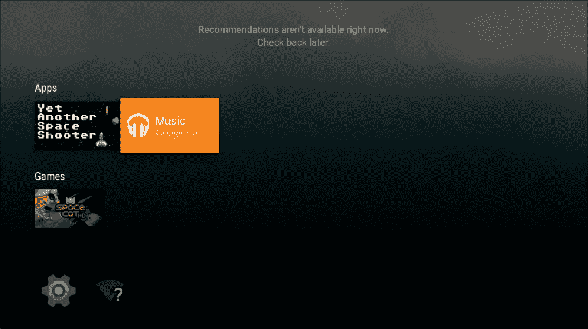
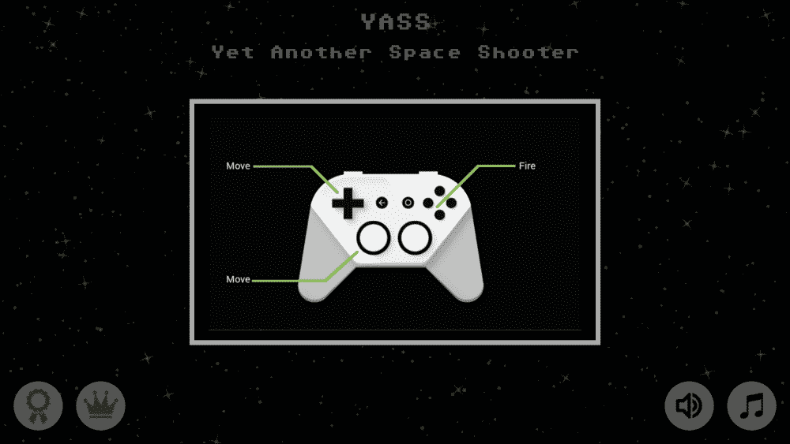
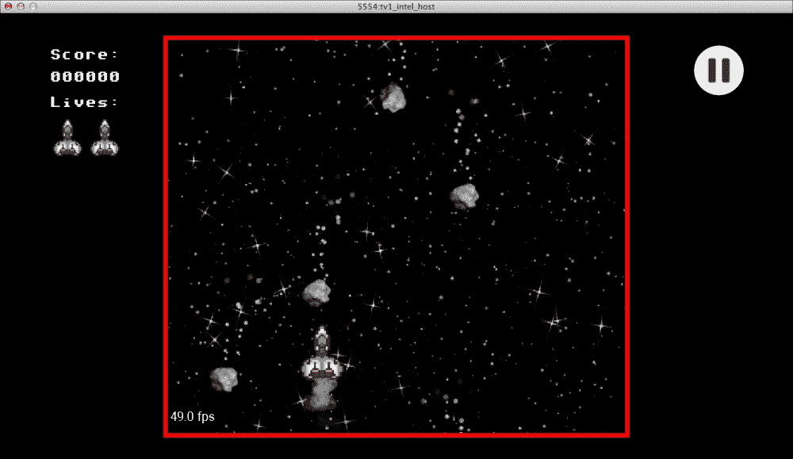
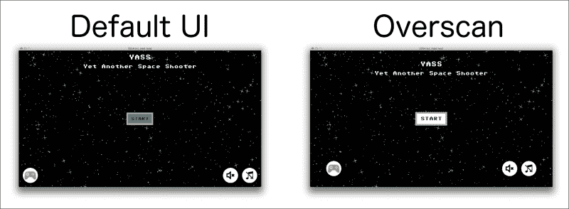

# 第十章。走向大银幕

我们有一款游戏可以在手机和平板电脑上正常运行。那么安卓电视呢？

我相信安卓电视在不久的将来有潜力成为一个大的游戏平台。尽管其他系统也试图将安卓游戏带入大屏——即 OUYA、GameStick 和亚马逊 FireTV——但它们有一个主要区别:安卓电视不是设计成你插在电视上的盒子，而是智能电视中的操作系统。

这有很大的不同，因为人们会默认拥有它。在我尝试之前，我一直对 OUYA 持怀疑态度。这是一次很棒的体验，但是如果我不是安卓游戏开发者，我可能不会尝试它。安卓电视可以打破这一障碍。

除此之外，增加对安卓电视的支持相当简单，它可能会让你获得更多的覆盖面，所以，为什么不做呢？

电视不同于手机，它们更大，而且没有触摸屏。他们通常也在更远的地方被观察。正因为如此，安卓电视有不同的用户界面，对应用程序的运行也有一些额外的要求。

在将游戏移植到安卓电视时，主要要求是支持横向定位，并可与控制器一起使用。我们已经这么做了。如果你的游戏不支持风景，或者不是为游戏手柄设计的，那么移植到安卓电视将需要更多的工作，可能不是你时间的最佳投资；然而，如果你有风景和控制器支持，去吧！

# 项目配置

将安卓电视添加到您的项目中有两种不同的方法。它们在概念上是不同的，但是您必须为它们编写的代码几乎是相同的，尽管在不同的地方。根据你的项目特点，你可能会选择其中一个。这些选项包括:

*   为安卓电视打造独立的 APK
*   在手机、平板电脑和电视上使用相同的 APK

Android Studio的默认选项是为安卓电视创建一个构建变体。当我们使用向导来设置我们的项目并添加电视支持时，它做到了这一点。这就是为什么我们有`mobile`和`tv`目录。主项目为`mobile`，`tv`配置为建筑变体或“风味”。

风格是从相同的代码库中构建不同 apk 的强大方法，允许我们修改部分，无论是代码还是资源。当你必须在不同的市场发布同一个游戏时，它特别有用。另一方面，如果你有一个单一的 APK，它必须能够适应不同的配置。

每种方法都有优点和缺点。

您希望安卓电视拥有单独的 APK 的一些原因是:

*   对移动版本使用较低的目标应用编程接口(安卓电视需要目标 SDK 21–棒棒糖)
*   将更高分辨率的资产用于电视，而不将其包含在移动设备中
*   具有移动/电视的独立特殊功能

另一方面，单一 APK 的主要优势是:

*   更容易发布(只需上传一个文件)
*   更容易维护

鉴于我们不会为安卓电视内置任何特殊功能，我们将使用单 APK 方法。注意，如果你想做一个构建变体，修改几乎是一样的，但是在`tv`目录下完成。

### 注

在安卓电视上发布需要目标 SDK 21。

官方文档建议我们包含`Leanback`库，需要`minSDK`版本 17。既然我们不是在构建一个应用，而是一个游戏，而库是关于 ui 的，我们可以忽略它，将`minSDK`保留为 15。

# 安卓电视测试

有几种方法可以测试安卓电视的版本。最明显也是最简单的一种方法是使用模拟器。

安卓电视的模拟器——就像手机一样——是运行与真实设备完全相同的操作系统版本的虚拟机。因此，他们非常可靠，但也相当缓慢。

当然，理想情况下，你应该能够在真实的设备上测试你的游戏。在撰写本文时，已经有几款智能电视宣布与安卓电视一起上市，但最好测试的设备是 ADT-1(开发者套件)和 Nexus Player。

然而，ADT-1 供应短缺，很难获得。另一方面，Nexus Player 是一款相当便宜的设备。

然而，除非你要求测试游戏性，否则导航可以很容易地用模拟器测试。

### 注

除非你要求测试游戏性，否则模拟器应该足以测试游戏。

请注意，模拟器不包括谷歌游戏服务，但一个真正的设备将拥有它们。

我还注意到 ADT-1 上的主题与模拟器上的主题略有不同，“开始”按钮上的文本颜色也不同。没什么大不了的，也容易搞定。

# 宣布电视活动

安卓电视使用leaback 界面，这是为遥控器控制的大屏幕设计的。这个用户界面以不同于手机的方式显示应用和游戏。发射器也不一样。因此，应用程序和游戏需要用特定的意图过滤器声明一个活动，这样 Leanback 启动器就可以找到它们，并使它们对用户可用。

该意图过滤器将声明该应用程序可在 Leanback 界面上启动。

最简单的方法是创建一个新的`Activity`，它从我们的正常活动扩展而来，然后在必要时覆盖一些方法来适应电视界面。现在，我们将创建扩展 T2 的 T1:

```java
public class YassTvActivity extends YassActivity {
}
```

然后，我们将使用适当的意图过滤器在`AndroidManifest.xml`上声明它:

```java
<activity
  android:name=".YassTvActivity"
  android:label="@string/app_name"
  >
  <intent-filter>
    <action android:name="android.intent.action.MAIN" />
    <category android:name="android.intent.category.LEANBACK_LAUNCHER" />
  </intent-filter>
</activity>
```

如您所见，除了类别有不同的名称(`LEANBACK_LAUNCHER`而不是`LAUNCHER`)之外，意图过滤器几乎与正常启动活动的过滤器相同。

请注意，在 Android 上，您不能在清单上声明同一个活动两次，但是您可以为同一个活动声明多个意图过滤器。您可以对手机和电视使用相同的活动，如下所示:

```java
<activity
  android:screenOrientation="sensorLandscape"
  android:name=".YassActivity"
  android:hardwareAccelerated="false"
  android:label="@string/title_activity_main" >
  <intent-filter>
    <action android:name="android.intent.action.MAIN" />
    <category android:name="android.intent.category.LAUNCHER" />
  </intent-filter>
  <intent-filter>
    <action android:name="android.intent.action.MAIN" />
    <category android:name="android.intent.category.LEANBACK_LAUNCHER" />
  </intent-filter>
</activity>
```

我们将使用一个单独的活动来允许代码中的微小调整，但是记住有两个意图过滤器的相同活动的可能性，尽管我建议只有在您确定不需要覆盖任何东西的情况下才使用它。

没有办法定义电视的限定词，安卓团队有目的地这样做，以强制实施响应性布局设计。知道我们在电视上运行的唯一方法是以编程方式检查 Leanback 功能，或者对电视使用特定的活动并覆盖其上的一些方法。

# 提供主屏幕横幅

安卓电视应用程序必须在清单中声明横幅。这是移动应用程序不存在的另一个要求。

Leanback 用户界面使用横幅在应用程序和游戏之间导航。它的长宽比与图标不同。特别是横幅是 320x180 px 的图片，我们必须放在`drawable-xhdpi`目录下。


横幅是 320x180 像素的图片

这个图像对于电视来说和一样重要，图标对于手机来说，是你在电视上游戏的切入点。虽然我们作为开发人员可以在电视上安装和运行应用程序而无需提供这些功能，但如果不提供横幅，就无法从 Leanback 用户界面轻松启动应用程序。

要定义哪个图像是用作横幅的，我们需要将其添加为`AndroidManifest.xml`中`<appication>`标签的属性之一。

```java
<application
  […]
  android:banner="@drawable/banner_small" >
```

这个属性是在棒棒糖上引入的，也是我们需要用 target SDK 21 编译才能发布给安卓电视的原因之一。



我们的游戏在一个模拟器的 Leanback 用户界面

# 宣布它为游戏

在之前的截图中可以看到，Leanback UI 将应用和游戏分开，我们的游戏被列在应用当中。我们正在建立一个游戏，我们希望被归类为这样。

这是`<application>`标签的另一个属性，也是在安卓电视的棒棒糖中引入的；我们可以宣布这个应用程序是一个游戏。

```java
<application
  […]
  android:isGame="true">
```

这将在**游戏**类别中显示横幅。


YASS 在 ADT-1 上被列入奥运会项目

## 宣布后仰支持

为了允许谷歌 Play 在从安卓电视搜索时列出我们的游戏，我们需要特别声明我们支持 Leanback 用户界面。为此，我们必须声明我们使用了 Leanback 特性:

```java
<uses-feature android:name="android.software.leanback"
  android:required="false" />
```

请注意，我们声明我们使用它，但我们将其标记为不需要。这一点很重要，因为否则游戏不会出现在没有 Leanback 功能的设备上。如果我们有两个独立的 apk，我们应该将此功能标记为仅在电视构建变体上需要。

声明一个`uses-feature`意味着你的应用利用了它。将它标记为不需要意味着它可以不需要它，但是如果它存在，它将使用它。

### 注

声明一个`uses-feature`意味着你的应用利用了它。标记为不需要意味着它可以没有它。

如果您对手机和电视使用单独的 apk，您应该仅在电视构建变体上为 Leanback 声明`uses-feature`，而在手机上不做任何事情。通过这样做，电视 APK 将只出现在带有 Leanback 用户界面的设备上，而移动 APK 将只出现在不支持 Leanback 的设备上。

向后倾斜功能的默认状态不是必需的。

## 声明触摸屏功能不是必需的

由于 `uses-feature`系统的工作原理，我们需要修复请求的功能，使我们的游戏在安卓电视上可用。本质上，这意味着我们不能要求电视不具备的功能，否则游戏将不会显示为可供使用。

这并不像看起来那么简单，因为一些特性会自动包含进来，而不需要做任何事情。

由于安卓的性质，默认情况下需要触摸屏功能，但是，如果我们不将其标记为不需要，该游戏将不会在安卓电视的谷歌游戏中列出，因为该设备没有触摸屏。

### 注

安卓应用程序默认需要触摸屏功能。

这真的很容易解决，我们只需要在`AndroidManifest.xml`上声明触摸屏功能不是必需的。

```java
<uses-feature android:name="android.hardware.touchscreen"
  android:required="false" />
```

请注意，这也意味着游戏在没有触摸屏的情况下应该完全可用。为此，我们在本章后面有一个关于用控制器处理菜单的特殊章节。

还有安卓电视上没有的其他功能，如果您使用它们，您必须确保将它们标记为不需要(并在它们不可用时处理案例)。其特点是:

*   触摸屏:`android.hardware.touchscreen`
*   触摸屏模拟器:`android.hardware.faketouch`
*   电话:`android.hardware.telephony`
*   相机:`android.hardware.camera`
*   蓝牙:`android.hardware.bluetooth`
*   近场通信(NFC): `android.hardware.nfc`
*   全球定位系统:T0
*   麦克风:`android.hardware.microphone`
*   传感器:`android.hardware.sensor`

仅对于游戏而言，触摸屏和传感器方面可能令人担忧，但也有游戏将位置和/或相机作为游戏的一个组成部分。当涉及到将游戏带到电视上时，这可能是一个破局者。

### 注

如果你的游戏依赖于全球定位系统或摄像头，它可能不太适合电视。

除此之外，一些`uses-permission`声明暗示了对硬件特性的要求。隐含要求功能的权限有:

*   `RECORD_AUDIO`要求使用`android.hardware.microphone`。
*   `CAMERA`要求:
    *   `android.hardware.camera`
    *   `android.hardware.camera.autofocus`
*   `ACCESS_COARSE_LOCATION`要求:
    *   `android.hardware.location`
    *   `android.hardware.location.network`
*   `ACCESS_FINE_LOCATION`要求:
    *   `android.hardware.location`
    *   `android.hardware.location.gps`

如果您使用这些权限中的任何一个，您应该确保将适当的功能标记为不需要，并在不存在时相应地采取行动。

要检测功能是否存在，或者在运行时启用或禁用游戏的某些部分，您可以使用`PackageManager`的`hasSystemFeature`方法。像这样:

```java
getPackageManager().hasSystemFeature("android.hardware.touchscreen")
```

请注意`getPackageManager`在`Context`级别可用，因此您可以从`Activity`访问它。

# 查看货单

一旦我们将电视的活动添加到 Leanback 启动器中，确保 Leanback 和触摸屏功能被请求但不是必需的，配置横幅，并将其标记为游戏，我们就完成了修改`AndroidManifest.xml`。

清单的更新版本如下:

```java
<?xml version="1.0" encoding="utf-8"?>
<manifest xmlns:android="http://schemas.android.com/apk/res/android"
  package="com.plattysoft.yass" >

  <application
    android:icon="@mipmap/ic_launcher"
    android:label="@string/app_name"
    android:isGame="true"
    android:banner="@drawable/banner_small"
    android:theme="@style/AppTheme" >

    <uses-feature android:name="android.software.leanback"
      android:required="false" />

    <uses-feature android:name="android.hardware.touchscreen"
      android:required="false" />

    <meta-data android:name="com.google.android.gms.games.APP_ID"
      android:value="@string/app_id" />
    <meta-data android:name="com.google.android.gms.version"
      android:value="@integer/google_play_services_version"/>

    <activity
      android:screenOrientation="sensorLandscape"
      android:name=".YassActivity"
      android:hardwareAccelerated="false"
      android:label="@string/title_activity_main" >
      <intent-filter>
        <action android:name="android.intent.action.MAIN" />
        <category android:name="android.intent.category.LAUNCHER" />
      </intent-filter>
    </activity>

    <activity
      android:name=".YassTvActivity"
      android:label="@string/app_name" >
      <intent-filter>
        <action android:name="android.intent.action.MAIN" />
        <category android:name="android.intent.category.LEANBACK_LAUNCHER" />
      </intent-filter>
    </activity>
  </application>
</manifest>
```

# 显示控制器指令

安卓电视应用的特殊要求之一是提供一个对话框，指示控制器是如何映射的。为此，谷歌为我们提供了一个我们可以使用的模板，它可以在线获得:([http://developer.android.com/training/tv/games/index.html](http://developer.android.com/training/tv/games/index.html))。


控制器映射模板

我们已经有一个对话框，当一个控制器被连接时会显示出来，但是我们从来没有把它从仅仅是一个`AlertDialog`更新过。是时候让它成为一个自定义对话框了。

电话的逻辑是只在第一次加载主菜单和连接控制器时显示对话框。对于安卓电视，我们想要一个不同的行为:我们想要在每次打开游戏时都显示对话框。

为此，我们将覆盖`MainMenuFragment`上的方法`showControllerHelp`，使用一个自定义对话框，修改模板图像以包含我们游戏的控件。

至于我们已经制作的其他自定义对话框，我们必须创建一个布局和一个类。布局极其简单，只是一个图像:

```java
<?xml version="1.0" encoding="utf-8"?>
<RelativeLayout xmlns:android="http://schemas.android.com/apk/res/android"
  android:layout_gravity="center"
  android:background="@drawable/dialog_bg"
  android:layout_width="@dimen/dialog_width"
  android:layout_height="@dimen/dialog_height">

  <ImageView
    android:id="@+id/controller_help_image"
    android:layout_width="wrap_content"
    android:layout_height="wrap_content"
    android:layout_centerInParent="true"
    android:src="@drawable/controller_help"/>

</RelativeLayout>
```

而且上课也很简单感谢`BaseCustomDialog`:

```java
public class ControllerHelpDialog extends BaseCustomDialog implements View.OnClickListener {
  public ControllerHelpDialog(YassActivity a) {
    super(a);
    setContentView(R.layout.dialog_controller_help);
    findViewById(R.id.controller_help_image).setOnClickListener(this);
  }

  @Override
  public void onClick(View v) {
    dismiss();
  }
}
```

我们正在设置布局，然后将图像上的点击处理为关闭。使用控制器时，对话框只有在使用 *B* 键或后退时才会消失；我们将在本章后面的对话中注意正确的按键处理，并在点击*按钮时使其消失。*

最后，我们需要在`MainMenuFragment`上做一些更改，以显示这个新创建的对话框，并修改何时显示它的逻辑:

```java
private void displayGamepadHelp() {
  showDialog(new ControllerHelpDialog(getYassActivity()));
}

private boolean shouldDisplayGamepadHelp() {
  PackageManager pm = getYassActivity().getPackageManager();
  boolean isLeanback = pm.hasSystemFeature("android.software.leanback");
  if (isLeanback) {
    boolean shownAlready = YassActivity.sGamepadHelpShown;
    YassActivity.sGamepadHelpShown = true;
    return !shownAlready;
  }
  if (isGameControllerConnected()) {
    return PreferenceManager.getDefaultSharedPreferences(getActivity())
      .getBoolean(PREF_SHOULD_DISPLAY_GAMEPAD_HELP, true);
  }
  return false;
}
```

在方法`shouldDisplayGamePadHelp`中，我们将检查是否使用了 Leanback 功能来知道我们是否在电视上。

如果 Leanback 功能不存在，我们将使用与之前相同的代码:如果连接了控制器，我们将显示该对话框，而之前我们没有显示过该对话框。

如前所述，我们将保持手机的逻辑，但对于电视，我们将始终显示对话框。

在安卓电视的情况下，我们希望在应用程序打开时显示它。由于`shouldDisplayGamepadHelp`是在片段的`onResume`方法中执行的，我们将它已经显示的事实存储在一个静态变量中，所以当我们在游戏结束后回到片段时，对话框不会再次显示。如果对话框还没有显示，我们返回 true。



如果您计划支持其他控制器或控制台，如 MOGA、OUYA 或 Nvidia Shield，您应该为每个控制器准备一个不同的映像，并使用设备描述符检测哪个控制器已连接。在 OUYA 的特殊情况下，由于它是一个不同的市场，您可以有另一个带有特殊图形的构建变体。

## 处理过扫描

由于电视标准的发展和总是向观众呈现全屏画面的愿望，电视的布局有一些特殊要求。因此，电视设备可能会剪辑应用布局的外边缘，以确保整个显示被填满。这种行为一般被称为**超跌**。

为了避免屏幕元素因过扫描而被裁剪，建议在布局的所有边上添加 10%的边距。谈到倾斜，这意味着左右边缘的边距为 48dp，上下边缘的边距为 27dp。

虽然我们可以在所有设备的布局上添加填充，但我们将为安卓电视创建特殊的布局，作为如何做到这一点的实际例子。正如我们之前提到的，电视没有资源限定符；我们必须依赖 Leanback 特性是否存在。

我们已经有了一个在 Leanback 界面上启动的特殊活动。我们还将为电视制作特殊的片段，唯一不同的是布局。为了将这两部分放在一起，我们将覆盖创建片段的方法，并在电视活动中替换它们。

这意味着我们需要首先将片段的创建提取到一个我们可以覆盖的方法中。这已经是`GameFragment`的情况了，它是在我们开始一个游戏的时候创建的，而不是 `MainMenuFragment`。该片段仅在活动的`onCreate`期间创建，因此我们将通过将`MainMenuFragment`的创建提取为新方法来重构代码。

```java
@Override
protected void onCreate(Bundle savedInstanceState) {
  super.onCreate(savedInstanceState);
  setContentView(R.layout.activity_yass);
  if (savedInstanceState == null) {
    getFragmentManager().beginTransaction()
      .add(R.id.container, createMenuFragment(), TAG_FRAGMENT)
      .commit();
  }
  [...]
}

protected Fragment createMenuFragment() {
  return new MainMenuFragment();
}

public void startGame() {
  navigateToFragment(new GameFragment());
}
```

为了给游戏本身增加边界，我们将创建一个文件`fragment_game_tv.xml`作为`GameTvFragment`的布局，声明如下:

```java
<?xml version="1.0" encoding="utf-8"?>
<FrameLayout xmlns:android="http://schemas.android.com/apk/res/android"
  android:layout_width="match_parent"
  android:layout_gravity="center"
  android:paddingTop="27dp"
  android:paddingLeft="48dp"
  android:paddingRight="48dp"
  android:paddingBottom="27dp"
  android:background="@color/background"
  android:layout_height="match_parent">

  <include layout="@layout/fragment_game" />

</FrameLayout>
```

我们只需在顶层放置一个`FrameLayout`，填充处理过扫描所需的内容，然后包含游戏中通常使用的布局。

请注意，我们使用填充而不是边距，因为我们希望使背景成为`FrameLayout`的子级，因此它填充布局的其余部分。

在代码方面，`GameTvFragment`的类也很简单:

```java
public class GameTvFragment extends GameFragment {
  @Override
  public View onCreateView(LayoutInflater inflater, ViewGroup container, Bundle savedInstanceState) {
    return inflater.inflate(R.layout.fragment_game_tv, container, false);
  }
}
```

我们扩展`GameFragment` 并覆盖方法`onCreateView`以使用我们刚刚创建的替代布局。由于导入了正常布局，所有视图都保留了它们的 id，其他任何东西都不需要`GameTvFragment`来工作。



带有额外填充的游戏片段，用于处理电视上的过扫描

主菜单的情况有点复杂，因为背景图像是布局内的`ImageView`。我们有两种可能的解决方案:

*   像以前一样导入布局，将背景图像的可见性设置为`GONE`
*   将所有通用布局提取到一个新文件中，并将其导入到手机和电视布局中

最后一个选项更容易阅读和维护，所以我们将这样做。

我们将所有布局信息移动到一个名为`fragment_main_menu_common.xml`的新文件中，该文件基本上是除背景图像之外的所有布局，将在其他每个布局上显示。

然后我们为不同的布局创建两个文件；适用于手机的是这样的:

```java
<?xml version="1.0" encoding="utf-8"?>
<FrameLayout xmlns:android="http://schemas.android.com/apk/res/android"
  android:layout_width="match_parent"
  android:layout_height="match_parent" >
  <ImageView
    android:id="@+id/main_menu_bg"
    android:layout_width="match_parent"
    android:layout_height="match_parent"
    android:scaleType="centerCrop"
    android:src="@drawable/seamless_space_0"/>

  <include layout="@layout/fragment_main_menu_common" />
</FrameLayout>
```

很简单——我们已经用`FrameLayout`替换了顶层视图，添加了背景，并包含了公共元素。

安卓电视的布局基本相同，但我们在导入的布局中增加了边距:

```java
<?xml version="1.0" encoding="utf-8"?>
<FrameLayout xmlns:android="http://schemas.android.com/apk/res/android"
  android:layout_width="match_parent"
  android:layout_gravity="center"
  android:layout_height="match_parent">
  <ImageView
    android:layout_width="match_parent"
    android:layout_height="match_parent"
    android:scaleType="centerCrop"
    android:src="@drawable/seamless_space_0"/>

  <include layout="@layout/fragment_main_menu_common"
    android:layout_width="match_parent"
    android:layout_height="match_parent"
    android:layout_marginTop="27dp"
    android:layout_marginLeft="48dp"
    android:layout_marginRight="48dp"
    android:layout_marginBottom="27dp"/>
</FrameLayout>
```

请注意，要使页边距与`include`标签配合使用，您还需要设置`width`和`height`，但谢天谢地，Android Studio在这方面给了我们一个警告。

进入代码，我们将在电视片段上实现一种不同的布局替换方式。我们将把布局资源 id 提取到一个可以在扩展类上重写的方法中。为了`MainMenuFragment`，我们将这样做。当你的片段在`onCreateView`期间做一些工作时，这个技术特别有用。

`MainMenuFragment` 上的代码将被稍微修改以提取布局资源到一个方法:

```java
@Override
public final View onCreateView(LayoutInflater inflater, ViewGroup container,
  Bundle savedInstanceState) {
  return inflater.inflate(getLayoutResId(), container, false);
}

protected int getLayoutResId() {
  return R.layout.fragment_main_menu;
}
```

因为我们提取布局是因为我们不想覆盖`onCreateView`，所以我们也声明它是最终的。

现在`MainMenuTvFragment`班就这样了:

```java
public class MainMenuTvFragment extends MainMenuFragment {
  @Override
  protected int getLayoutResId() {
    return R.layout.fragment_main_menu_tv;
  }
}
```



应用过扫描边距前后的主菜单

最后，我们必须覆盖在`YassTvActivity`中创建片段的特定方法。最后，一些代码被添加到该类中:

```java
public class YassTvActivity extends YassActivity {

  public void startGame() {
    // Navigate the the game fragment, which makes the start automatically
    navigateToFragment( new GameTvFragment());
  }

  protected Fragment createMenuFragment() {
    return new MainMenuTvFragment();
  }
}
```

既然我们已经说明了如何用几种不同的方式解决过扫描的问题，让我们进入最后一个方面:用控制器导航游戏。

## 基于控制器的导航

对安卓电视最复杂的要求是游戏的所有选项都必须使用控制器才能访问。如果你计划在控制台上发布，你应该提前考虑一下，不要制作过于复杂的菜单或对话框。

### 注

对于安卓电视，游戏中的所有选项都必须使用游戏手柄才能访问。

这就是原生安卓用户界面的用处所在。安卓框架自动处理布局元素之间的方向导航，所以原则上你不需要做任何额外的努力。但是，您仍然应该使用控制器测试导航，看看是否有任何导航问题。

用户还可以使用键盘上的箭头键导航您的应用程序(这种行为与使用数字键盘或轨迹球导航时相同)。安卓根据屏幕上视图的布局，提供了一个最佳猜测，即哪个视图应该在给定的方向上获得焦点。然而，有时候安卓可能会猜错。

如果系统在导航时没有将焦点传递给我们想要的视图，我们可以通过指定哪个视图应该接收具有以下属性的焦点来覆盖它:

*   `android:nextFocusUp`
*   `android:nextFocusDown`
*   `android:nextFocusLeft`
*   `android:nextFocusRight`

一般来说来说，你应该总是让`A`按钮提供正向动作，`B`按钮提供反向动作。一些控制器(如 ADT-1 上的控制器)提供专用的返回和主页按钮，这些按钮也应该如此工作。这一切都已经由安卓为你处理好了。

### 注

A 按钮应该总是一个积极的行动，B 按钮应该作为取消/返回。

就我们而言，我们必须解决 YASS 的一些问题，以提供全面的导航。这些问题很有趣，因为它们也是常见的陷阱。

如果我们现在运行游戏，我们可以看到主菜单上唯一可聚焦的控件是开始按钮。无法导航到任何其他视图。这是安卓框架一个不明显的特殊性:`ImageView`默认不可聚焦。

### 注

默认情况下，图像视图不可聚焦。

幸运的是，我们已经定义了圆形按钮的样式。我们可以在样式上将`focusable`设置为真，它将应用于应用程序中的所有圆形按钮:

```java
<style name="iconButton" >
  <item name="android:background">@drawable/icon_button_bg</item>
  <item name="android:layout_width">@dimen/btn_round_size</item>
  <item name="android:layout_height">@dimen/btn_round_size</item>
  <item name="android:padding">@dimen/round_button_padding</item>
  <item name="android:focusable">true</item>
</style>
```

我们也可以使用`ImageButton`代替`ImageView`，默认情况下`ImageView`是可对焦的，但是我认为让`ImageView`可对焦更清晰。

现在我们可以用控制器在菜单中导航，我们可以看到安卓提供的默认导航很好。下一步是检查对话框。

当我们与对话框交互时，会有一些副作用。由于它们不是标准的安卓对话框，焦点可以移出对话框。`GameFragment`还使用游戏输入控制器来处理所有事件。我们需要做一些修复。

## 对话框和控制器

我们将一次解决一个问题。第一个是焦点可以转到对话框之外的视图。

当控制器帮助对话框出现时，通过打开游戏并将焦点移到背景上的按钮上，可以很容易地复制这一点。退出对话框中也存在同样的问题。在这两种情况下，我们都可以用顶部的对话框开始游戏，这是错误的。

对于触摸，我们通过背景视图解决了这个问题，背景视图充当点击屏幕，获取所有点击，不让事件传递到它后面的其他视图。然而，对于控制器导航，我们需要其他东西。

有几种方法可以解决这个问题。一种是覆盖布局上的导航；另一种方法是，如果正在显示对话框，忽略片段上的`onClick`事件。我们正在寻找另一种方法:将关键事件传递给对话框，并在那里过滤它们。

这种方法还解决了第二个问题:在游戏中，输入控制器收集并消耗控制器按压。

由于所有的`KeyEvent`和`MotionEvent`处理都是在活动级别完成的，我们将做一个小的重构，将显示对话框的逻辑从片段转移到活动。

我们将方法`showDialog`和变量`mCurrentDialog`从`YassBaseFragment`移动到`YassActivity`。

在基础片段中，我们只需将`showDialog`方法的代码替换为:

```java
public void showDialog (BaseCustomDialog newDialog, boolean dismissOtherDialog) {
  getYassActivity().showDialog(newDialog, dismissOtherDialog);
}
```

下一步是重构`YassActivity`的`dispatchKeyEvent`和`dispatchGenericMotionEvent`方法，使对话框优先于输入控制器。

`dispatchKeyEvent`更新后的版本如下:

```java
@Override
public boolean dispatchKeyEvent (KeyEvent event) {
  if (mCurrentDialog != null && mCurrentDialog.isShowing()) {
    if (mCurrentDialog.dispatchKeyEvent(event)) {
      return true;
    }
  }
  else if (mGamepadControllerListener != null) {
    if (mGamepadControllerListener.dispatchKeyEvent(event)) {
      return true;
    }
  }
  return super.dispatchKeyEvent(event);
}
```

如果当前对话框不为空并且正在显示，那么我们在它上面调用一个方法，也称为`dispatchKeyEvent`。如果关键事件被消费(方法返回真)，我们返回真。

同样，如果没有对话框显示，我们继续游戏手柄控制器监听器。如果事件被游戏手柄控制器消耗，我们也返回真。

最后，如果事件尚未被消费，我们调用 super 方法，它将正常处理事件。这包括围绕视图移动焦点。

同样，我们将修改`dispatchGenericMotionEvent`。尽管我们不会覆盖对话框中的任何事件，但如果您计划使用方向键定制导航，您还必须注意模拟操纵杆，为此您需要这种方法:

```java
@Override
public boolean dispatchGenericMotionEvent(MotionEvent event) {
  if (mCurrentDialog != null && mCurrentDialog.isShowing()) {
    if (mCurrentDialog.dispatchGenericMotionEvent(event)) {
      return true;
    }
  }
  else if (mGamepadControllerListener != null) {
    if (mGamepadControllerListener.dispatchGenericMotionEvent(event)) {
      return true;
    }
  }
  return super.dispatchGenericMotionEvent(event);
}
```

最后，我们要更新对回车键的处理:

```java
@Override
public void onBackPressed() {
  if (mCurrentDialog != null && mCurrentDialog.isShowing()) {
    mCurrentDialog.dismiss();
    return;
  }
  final YassBaseFragment fragment = (YassBaseFragment) getFragmentManager().findFragmentByTag(TAG_FRAGMENT);
  if (fragment == null || !fragment.onBackPressed()) {
    super.onBackPressed();
  }
}
```

如果我们正在显示一个对话框，我们只需关闭它。否则，我们保留之前的代码:我们要求当前片段处理回车键的按下，如果事件没有被消费，我们将它传递给父类。

请注意，将返回键事件传递给当前片段很重要。在我们的游戏中，在`GameFragment`中按下回车键意味着我们想要暂停游戏。

为了完成这个，我们必须让对话框处理按键。`BaseCustomDialog`上的默认实现是返回 false，这意味着事件没有被消耗:

```java
public boolean dispatchKeyEvent(KeyEvent event) {
  return false;
}

public boolean dispatchGenericMotionEvent(MotionEvent event) {
  return false;
}
```

我们将做一个非常简单的处理，当对话框上的一个按钮被选中时，我们将只处理 OK click，但是您也可以用一个更复杂的处理来防止焦点转移到对话框之外的视图。

对于`ControllerHelpDialog`，只要按下 **OK** 按钮，不管哪个视图处于焦点，我们都会忽略它:

```java
public boolean dispatchKeyEvent(KeyEvent event) {
  if (event.getKeyCode() == KeyEvent.KEYCODE_BUTTON_A ||
      event.getKeyCode() == KeyEvent.KEYCODE_ENTER ||
      event.getKeyCode() == KeyEvent.KEYCODE_DPAD_CENTER) {
    dismiss();
    return true;
  }
  return false;
}
```

请注意，从控制器的角度来看， **A** 按钮是 **OK** 按钮，但是某些控制器也有 D-Pad 中央按钮，有时还有 *Enter* 键，因此我们接受这些键事件中的任何一个作为 **OK** 。

在退出对话框的情况下，代码略有不同:

```java
public boolean dispatchKeyEvent(KeyEvent event) {
  if (event.getKeyCode() == KeyEvent.KEYCODE_BUTTON_A ||
      event.getKeyCode() == KeyEvent.KEYCODE_ENTER ||
      event.getKeyCode() == KeyEvent.KEYCODE_DPAD_CENTER) {
    if (findViewById(R.id.btn_resume).isFocused() ||
        findViewById(R.id.btn_exit).isFocused()) {
      // Return false, so a proper click is sent
      return false;
    }
    return true;
  }
  return false;
}
```

在这个对话框中，每当我们得到一个确定事件，我们检查我们的按钮之一是否被聚焦。如果是这样，我们返回 false，这意味着我们让上层处理它。这将把事件传递给活动，当它被处理并作为点击发送回来时。

如果我们的行动没有一个是集中的，我们就返回真，这意味着我们正在消费这个事件，而不应该用它做任何其他事情。

在任何其他情况下，我们返回 false(同样，不消费事件)，让活动正常处理关键事件。

最后，在`GameFragment`中显示的暂停和游戏结束对话框的情况下，我们不需要做任何事情，因为该用户界面上唯一可聚焦的项目是暂停按钮。

我们要做的是将暂停按钮设置为不可聚焦，然后让系统处理按键:

```java
<ImageView
  style="@style/iconButton"
  android:focusable="false"
  android:layout_gravity="top|right"
  android:id="@+id/btn_play_pause"
  android:layout_marginTop="@dimen/menu_margin"
  android:layout_marginRight="@dimen/menu_margin"
  android:src="@drawable/pause" />
```

请注意，虽然`ImageView`在默认情况下是不可聚焦的，但是我们已经在样式级别设置了该属性，并且我们总是可以在布局的定义中覆盖样式的值。

随着所有这些变化，我们游戏的所有用户界面都可以用游戏手柄来使用，我们终于准备好在安卓电视上发布了。

# 超越这本书

我们成功了！我们已经使用安卓软件开发工具包从头开始构建了一个游戏。我们已经构建了一个游戏引擎，它有单独的`UpdateThread`和`DrawThread`，我们有可以四处移动的精灵，我们已经处理了触摸和游戏手柄控制器，并添加了碰撞检测、声音，甚至粒子。

我们还使用了安卓框架的组件来构建我们的菜单和对话框，并使用了动画工具来使其更加动态。

YASS 也有使用谷歌游戏服务的成就和排行榜，现在它也准备在安卓电视上播放。

在这一点上，有一些事情可以做来改善游戏，如果你喜欢的话，这可能是一个很好的练习来帮助你前进。一些想法是:

*   越来越难产生多个波
*   包括较大的小行星，当被撞击时会分裂成较小的部分
*   增加选船:提供几艘不同特性(速度、火力比等)的船
*   像防护罩或改进的激光器一样启动

虽然这本书专注于游戏的开发，但制作游戏的其他方面也被忽视了，但也非常重要。其中最相关的是游戏设计和货币化。

### 注

游戏设计和货币化是制作游戏的关键方面。

**游戏设计**是一门独立于平台和代码的学科，它需要对游戏本身进行高层次的考虑。游戏设计是关于制作一个有趣且吸引用户的游戏。有很多书专门介绍这个概念，这超出了本书的范围。

**货币化**也是时下的一大话题。如果你计划发布一个游戏只是为了好玩，你不需要担心它，但是如果你想从中赚钱，这是需要评估的事情。

游戏货币化的主要选项有:

*   **高级**:让它成为付费游戏
*   **广告**:通过向用户展示广告，无论是横幅还是插播广告，将游戏货币化
*   **应用内购买**:为用户提供购买游戏内物品的机会

制作付费游戏的好处是，它的构建要简单得多，而且让你头疼的事情也会少一些。

在手机上表现出色的高级游戏有《纪念碑谷》、《三人行》和《房间》(1 和 2)。

无论是广告还是应用内购买，免费游戏的优势在于安装障碍是最低的。如果有人对游戏感兴趣，安装是免费的。为游戏付费需要有意识的决定，许多人会选择退出，不管价格如何。

如果你打算走 Free2Play 这条路，那就准备好担心玩家的保留和转换问题吧。你会熟悉 DAU、MAU、ARPU 和 ARPPU 等术语。

一些成功的免费游戏的例子有糖果粉碎传奇，部落冲突和愤怒的小鸟。

大多数研究都会告诉你，人们通过应用内购买比付费应用赚得更多。虽然这是真的，但创建一个盈利良好的 Free2Play 游戏需要时间和精力来调整它；设计引人注目的应用内购买也是如此。

以我的经验来看，为一款 Free2Play 游戏做一个好的货币化设计需要的时间和制作游戏本身差不多。如果你不仔细设计，你可以得到非常低的转化率，这转化为很少或没有收入。

根据经验，不要在感觉不正确的游戏中推行货币化模式，并投入精力让游戏变得有趣。

# 总结

我们已经为安卓电视准备好了游戏。我们已经更新了清单，提供了一个从 Leanback 界面启动的活动，以及一个在用户界面上显示的横幅，并且我们已经将其标记为游戏。我们还审查了权限，以确保该游戏将在谷歌播放安卓电视上可用，主要是根据要求标记触摸屏功能和 Leanback，但不是必需的。

从代码的角度来看，当在电视上运行时，我们在所有屏幕上添加了一些额外的填充，以确保重要内容不会因为过扫描而被切断，我们调整了对话框上的代码，使它们能够很好地与控制器一起工作。

最后我们提到了一些关于如何进一步改进游戏的建议，并简单谈了一下游戏设计和货币化。

是时候开始制作你自己的游戏了。祝你好运，玩得开心！