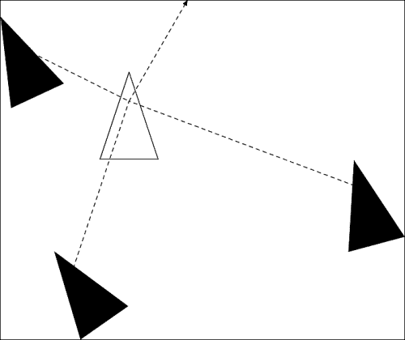
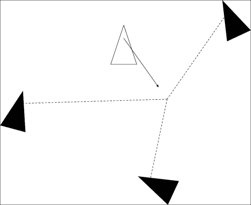
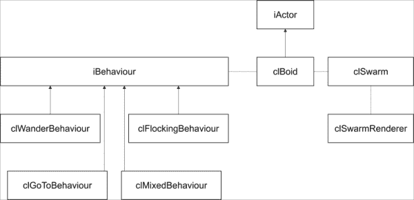

# 九、实现游戏逻辑

本章最简短的描述只包含两个词:状态机。在这里，我们将介绍一种常见的方法来组织游戏代码和应用程序的用户界面部分之间的交互。我们从 Boids 算法的实现开始，然后继续前面章节中实现的用户界面的扩展。

# Boids

在很多游戏应用中，通常可以看到相互碰撞、射击、追逐的运动物体，可以被其他物体触碰或躲避，或者产生类似的行为。对象可见的复杂行为通常可以分解成几个简单的状态，它们一起进行互操作。例如，在一个街机游戏中，一个敌人随机地在周围游荡，直到它看到一个玩家控制的角色。遭遇后切换到*追击*状态，接近目标时可能切换到*射击*或*攻击*状态。如果敌方单位察觉到一些劣势，它可能会*逃离*玩家。依次追逐*状态不仅可以将敌人对准玩家，还可以避免与环境的碰撞。每个对象在不同状态下可以有不同的动画或不同的材质。让我们使用克雷格·雷诺兹发明的既定方法来实现追逐和漫游算法，该方法被称为*群集行为*或*Boids*([https://en.wikipedia.org/wiki/Boids](https://en.wikipedia.org/wiki/Boids))。这种方法被用来创造一种半意识群体或一些生物的智能群体的印象。我们在本章中广泛使用状态模式([https://en.wikipedia.org/wiki/State_pattern](https://en.wikipedia.org/wiki/State_pattern))来定义复杂的用户交互场景。*

 *我们只考虑一个二维的游戏世界，把每个物体或浮球近似为一个有速度的圆。速度作为一个矢量，有大小和方向。每个物体都遵循三个简单的规则来计算其所需的速度([http://www.red3d.com/cwr/boids](http://www.red3d.com/cwr/boids)):

1.  *避开*:避开，避免拥挤当地的室友。
2.  *凝聚力*:将引向当地同伴的平均航向。
3.  *对准*:转向向局部絮状物的平均位置移动。

我们实现的附加规则或行为是*arrivet*和 *Wander* 算法，它们可以作为我们的行为力学实现的基本调试工具。

第一条规则*回避*，引导远离障碍物和其他絮状物，如下图所示:



第二个规则 *凝聚力*，转向本地浮球的平均航向，如下图所示:



第三个规则 *校准*，试图调整计算出的附近物体的平均速度。它影响一组絮状物，使它们的运动方向很快变为共线和同向，如下图所示:


规则*到达*，将速度方向设置为空间中预定的目标点或区域。通过让目标在空间移动，我们可以创造一些复杂的行为。

# 植绒算法的实现

为了实现上述行为，我们将考虑以下类层次结构:



单个 boid 由`clBoid`类的一个实例表示，该实例持有指向`iBehaviour`实例的指针。`iBehavior`界面包含单个成员函数`GetControl()`，该函数计算作用在 boid 上的瞬时力。由于力的大小可能取决于 boid 的状态，我们将一个指向`clBoid`的原始非拥有指针传递到`GetControl()`中:

```cpp
class iBehaviour: public iIntrusiveCounter
{
public:
  virtual vec2 GetControl( float dt, clBoid* Boid ) = 0;
};
```

让我们考虑一下`clBoid`类本身。它包含`m_Pos`和`m_Vel`场，分别保存 boid 的当前位置和速度。这些值是二维向量，但整个结构可以使用三分量向量扩展到 3D 逻辑:

```cpp
class clBoid: public iActor
{
public:
  vec2 m_Pos;
  vec2 m_Vel;
```

`m_Angle`字段是 boid 的即时方向，它是从`m_Vel`值计算出来的。`m_MaxVel`场包含 boid 的最大速度:

```cpp
  float m_Angle;
  float m_MaxVel;
```

`m_Behaviour`字段保存一个指向`iBehaviour`实例的指针，该实例计算所需行为的控制力:

```cpp
  clPtr<iBehaviour> m_Behaviour;
```

由于一个 boid 在群体中移动，并且依赖于相邻 boid 的位置和速度来调整它的速度，我们保持一个非拥有指针指向父`clSwarm`对象，以避免智能指针之间的循环引用:

```cpp
  clSwarm* m_Swarm;
```

类的构造函数初始化默认值并设置一个空行为:

```cpp
public:
  clBoid():
  m_Pos(), m_Vel(),
  m_Angle(0.0f), m_MaxVel(1.0f),
  m_Behaviour(), m_Swarm(nullptr)
  {}
```

唯一的成员函数是`Update()`，它计算作用在物体上的力:

```cpp
  virtual void Update( float dt ) override
  {
    if ( m_Behaviour )
    {
      vec2 Force = m_Behaviour->GetControl( dt, this );
```

计算力后，根据牛顿定律、 *a = F/m* 、以及欧拉积分法([https://en.wikipedia.org/wiki/Euler_method](https://en.wikipedia.org/wiki/Euler_method))修正速度。boid 的质量设定为恒定值`1.0`。随意引入一个可变参数，观察它如何改变群体的视觉行为:

```cpp
      const float Mass = 1.0f;
      vec2 Accel = Force / Mass;
      m_Vel += Accel * dt;
    }
```

为了使事情看起来合理，我们将最大可能速度限制在`0…m_MaxVel`区间:

```cpp
    m_Vel = ClampVec2( m_Vel, m_MaxVel );
```

计算速度后，boid 的位置会更新:

```cpp
    m_Pos += m_Vel * dt;
```

最后，boid 的方向应该被评估为`X`轴和`m_Vel`向量之间的角度。该值用于使用指向箭头在屏幕上呈现 boid:

```cpp
    if ( m_Vel.SqrLength() > 0.0f )
    {
      m_Angle = atan2( m_Vel.y, m_Vel.x );
    }
  }
};
```

最简单的可能的非静态行为是在突然的随机脉冲影响下的随机运动。这叫做*游荡*行为，在`clWanderBehaviour`类中实现。`GetControl()`方法计算一个向量，其两个随机分量在-1 范围内..+1 范围:

```cpp
class clWanderBehaviour: public iBehaviour
{
public:
  virtual vec2 GetControl( float dt, clBoid* Boid ) override
  {
    return vec2( RandomFloat() * 2.0f - 1.0f, RandomFloat() * 2.0f - 1.0f );
  }
};
```

boid 的另一个有用的行为在`clGoToBehaviour`类中实现。给定`m_Target`场中的目标坐标，该行为将可控 boid 驱动到该点。一旦 boid 在距离`m_Target`的`m_TargetRadius`距离内，运动停止:

```cpp
class clGoToBehaviour: public iBehaviour
{
public:
```

`m_Target`和`m_TargetRadius`字段定义目标点的位置和半径:

```cpp
  vec2 m_Target;
  float m_TargetRadius;
```

`m_VelGain`和`m_PosGain`成员持有两个值，定义一旦到达目标，boid 应该多快刹车，以及 boid 加速的速度与到目标的距离成比例:

```cpp
  float m_VelGain;
  float m_PosGain;
```

构造函数设置默认值和非零增益:

```cpp
  clGoToBehaviour():
  m_Target(),
  m_TargetRadius(0.1f),
  m_VelGain(0.05f),
  m_PosGain(1.0f)
  {}
```

`GetControl()`程序计算 boid 位置和目标之间的差值。该差值乘以`m_PosGain`并用作控制力:

```cpp
  virtual vec2 GetControl( float dt, clBoid* Boid ) override
  {
    auto Delta = m_Target - Boid->m_Pos;
```

如果 boid 在`m_TargetRadius`距离内，我们将返回一个零作为控制力的值:

```cpp
    if ( Delta.Length() < m_TargetRadius )
    {
      return vec2();
    }
```

### 注

用线`return -m_VelGain * Boid->m_Vel / dt;`代替前面的线，可以达到视觉上有趣的制动效果。施加制动脉冲，将速度降低一部分，导致速度平滑指数衰减。视觉上，boid 在目标中心附近平稳停止。

计算出的冲量在成员函数的末尾返回:

```cpp
    return Delta * m_PosGain;
  }
};
```

# 题外话:帮手套路

这里，我们应该描述在控制计算中使用的几个函数。

在前面的代码中，我们使用了`ClampVec2()`例程，该例程计算矢量`V`的长度，将该长度与`MaxValue`进行比较，并返回相同的矢量`V`或其夹紧的同轴版本的`MaxValue`长度:

```cpp
inline vec2 ClampVec2(const vec2& V, float MaxValue)
{
  float L = V.Length();
  return (L > MaxValue) ? V.GetNormalized() * MaxValue : V;
}
```

另一组方法包括随机数生成例程。`RandomFloat()`方法使用 C++ 11 标准库生成 0…1 区间的均匀分布浮点值:

```cpp
std::random_device rd;
std::mt19937 gen( rd() );
std::uniform_real_distribution<> dis( 0.0, 1.0 );
float RandomFloat()
{
  return static_cast<float>( dis( gen ) );
}
```

`RandomVec2Range()`方法使用`RandomFloat()`函数两次，返回一个在指定间隔内具有随机分量的向量:

```cpp
vec2 RandomVec2Range( const vec2& Min, const vec2& Max )
{
  return Min + vec2( RandomFloat() * ( Max - Min ).x,
    RandomFloat() * ( Max - Min ).y );
}
```

# 集体行为

到目前为止，我们只有定义了`clWanderBehaviour`类。为了实现群集算法，我们需要一次存储所有 boids 的信息。这样的集合在这里叫做*蜂群*。类持有一个 T2 对象的向量，并实现了 boid 控制计算中使用的一些例程:

```cpp
class clSwarm: public iIntrusiveCounter
{
public:
  std::vector< clPtr<clBoid> > m_Boids;
  clSwarm() {}
```

为了调试和可视化演示的目的，`GenerateRandom()`方法分配多个位置随机、速度为零的`clBoid`对象:

```cpp
  void GenerateRandom( size_t N )
  {
    m_Boids.reserve( N );
    for ( size_t i = 0; i != N; i++ )
    {
      m_Boids.emplace_back( make_intrusive<clBoid>() );
```

默认情况下，每个 boid 都有一个*徘徊*行为:

```cpp
      m_Boids.back()->m_Behaviour = make_intrusive<clWanderBehaviour>();
      m_Boids.back()->m_Swarm = this;
```

位置是随机的，也保持在-1 以内..每个坐标+1 范围:

```cpp
      m_Boids.back()->m_Pos = RandomVec2Range( vec2(-1, -1), vec2(1, 1) );
    }
  }
```

`Update()`方法迭代集合并更新每个 boid:

```cpp
  void Update( float dt )
  {
    for ( auto& i : m_Boids )
    {
      i->Update( dt );
    }
  }
```

*分离*或*回避*算法使用到其他长方体的距离之和作为控制力。`clSwarm::CalculateSeparation()`方法迭代 boids 的集合并计算所需的和:

```cpp
  vec2 CalculateSeparation( clBoid* B, float SafeDistance )
  {
    vec2 Control;
    for ( auto& i : m_Boids)
    {
      if ( i.GetInternalPtr() != B )
      {
```

对于每个 boid，除了作为参数传递的那个，我们计算位置增量:

```cpp
        auto Delta = i->m_Pos - B->m_Pos;
```

如果距离超过安全阈值，例如，如果 boid 与另一个 boid 非常接近，我们在控制力上增加一个负增量:

```cpp
        if ( Delta.Length() < SafeDistance )
        {
          Control += Delta;
        }
      }
    }
    return Control;
  }
```

在*内聚*算法中使用类似的程序来计算相邻长方体的平均位置:

```cpp
  vec2 CalculateAverageNeighboursPosition( clBoid* B )
  {
    int N = static_cast<int>( m_Boids.size() );
```

只有当有多个 boid 时，我们才会对位置求和:

```cpp
    if ( N > 1 )
    {
      vec2 Avg(0, 0);
```

boids 列表上的循环给出了位置的总和:

```cpp
      for ( auto& i : m_Boids )
      {
        if ( i.GetInternalPtr() != B )
        {
          Avg += i->m_Pos;
        }
      }
      Avg *= 1.0f / (float)(N - 1);
      return Avg;
    }
```

在单个 boid 的情况下，我们使用其位置。这样，*内聚*算法中的控制力将为零:

```cpp
    return B->m_Pos;
  }
```

类似的程序适用于速度:

```cpp
  vec2 CalculateAverageNeighboursVelocity( clBoid* B )
  {
    int N = (int)m_Boids.size();
    if (N > 1)
    {
      vec2 Avg(0, 0);
      for ( auto& i : m_Boids )
        if ( i.GetInternalPtr() != B )
          Avg += i->m_Vel;
          Avg *= 1.0f / (float)(N - 1);
      return Avg;
    }
    return B->m_Vel;
  }
```

实用方法`SetSingleBehaviour()`将群中每个 boid 的行为设置为指定值:

```cpp
  void SetSingleBehaviour( const clPtr<iBehaviour>& B )
  {
    for ( auto& i : m_Boids )
    {
      i->m_Behaviour = B;
    }
  }
};
```

现在我们有了`clSwarm`类，我们终于可以实现植绒行为了。`clFlockingBehaviour`使用关于相邻长方体的信息，并使用经典长方体算法计算控制力:

```cpp
class clFlockingBehaviour : public iBehaviour
{
```

通常，构造函数设置默认参数:

```cpp
public:
  clFlockingBehaviour():
  m_AlignmentGain(0.1f),
  m_AvoidanceGain(2.0f),
  m_CohesionGain(0.1f),
  m_SafeDistance(0.5f),
  m_MaxValue(1.0f)
  {}
```

`m_SafeDistance`字段定义了碰撞避免算法不起作用的距离:

```cpp
  float m_SafeDistance;
```

接下来的字段包含每个群集算法影响的权重:

```cpp
  float m_AvoidanceGain;
  float m_AlignmentGain;
  float m_CohesionGain;
  virtual vec2 GetControl(float dt, clBoid* Boid) override
  {
    auto Swarm = Boid->m_Swarm;
```

第一步是*分离*和*回避*:

```cpp
    vec2 Sep = m_AvoidanceGain * Swarm->CalculateSeparation(Boid, m_SafeDistance);
```

第二步*对齐*:

```cpp
    auto AvgPos = Swarm->CalculateAverageNeighboursPosition(Boid);
    vec2 Alignment = m_AlignmentGain * (AvgPos - Boid->m_Pos);
```

第三步是*衔接*。转向邻居的平均位置:

```cpp
    auto AvgVel = Swarm->CalculateAverageNeighboursVelocity(Boid);
    vec2 Cohesion = m_CohesionGain * (AvgVel - Boid->m_Vel);
```

最后，我们将这三个值相加，并将力的大小保持在`m_MaxValue`以下:

```cpp
    return ClampVec2( Sep + Alignment + Cohesion, m_MaxValue );
  }
};
```

我们的行为系统的点睛之笔是一个实现行为混合的类。`clMixedBehaviour`类包含一个行为向量和相应的权重因子，它们显示了在结果行为中使用了多少行为控制力:

```cpp
class clMixedBehaviour : public iBehaviour
{
public:
  std::vector< clPtr<iBehaviour> > m_Behaviours;
  std::vector<float> m_Weights;
```

`AddBehaviour()`成员函数向容器添加新的权重因子和行为:

```cpp
  void AddBehaviour( float Weight, const clPtr<iBehaviour>& B )
  {
    m_Weights.push_back( Weight );
    m_Behaviours.push_back( B );
  }
```

顾名思义，`GetControl()`例程计算每个包含行为的控制，并将所有这些控制向量乘以适当的权重:

```cpp
  virtual vec2 GetControl(float dt, clBoid* Boid) override
  {
    vec2 Control;
    for ( size_t i = 0; i < m_Behaviours.size(); i++)
    {
      Control += m_Weights[i] * m_Behaviours[i]->GetControl(dt, Boid);
    }
    return Control;
  }
};
```

我们可以很容易的看到这个`clFlockingBehaviour`类可以拆分成*回避*、*凝聚*、*分离*部分。我们决定不使这本书的结构复杂化，并将群集行为实现为一个类。请随意自行试验和混合这些子行为。

# 渲染蜂群

为了使用开发的群体模拟系统，我们需要渲染单个长方体。由于我们已经有了一个 OpenGL 三维场景图渲染系统，我们用一个三角形网格表示每个 boid，并为它们创建场景节点。让我们这样做:

```cpp
class clSwarmRenderer
{
private:
```

`m_Root`字段中的单个`clSceneNode`对象充当整个群的根场景节点:

```cpp
  clPtr<clSceneNode> m_Root;
```

保持指向`clSwarm`对象的指针，以使 boid 位置和角度与场景节点变换同步:

```cpp
  clPtr<clSwarm> m_Swarm;
```

每个 boid 的场景节点存储在`m_Boids`向量中:

```cpp
  std::vector< clPtr<clSceneNode> > m_Boids;
```

类的构造函数为群中的每个 boid 创建一个场景节点:

```cpp
public:
  explicit clSwarmRenderer( const clPtr<clSwarm> Swarm )
  : m_Root( make_intrusive<clSceneNode>() )
  , m_Swarm( Swarm )
  {
    m_Boids.reserve( Swarm->m_Boids.size() );
    const float Size = 0.05f;
    for ( const auto& i : Swarm->m_Boids )
    {
      m_Boids.emplace_back( make_intrusive<clSceneNode>() );
```

从视觉上看，boid 是一个三角形，所以我们称之为`clGeomServ::CreateTriangle()`来创建一个具有单个三角形的顶点数组:

```cpp
      auto VA = clGeomServ::CreateTriangle( -0.5f * Size, Size, Size, 0.0f );
      auto GeometryNode = make_intrusive<clGeometryNode>( );
      GeometryNode->SetVertexAttribs( VA );
      m_Boids.back()->Add( GeometryNode );
```

一旦一个几何节点被初始化，我们将其添加到`m_Root`:

```cpp
      m_Root->Add( m_Boids.back() );
    }
    Update();
  }
```

在每一帧，我们计算附着到 boid 根节点的每个`clSceneNode`的变换。转换包括平移到 boid 的位置，然后围绕垂直`Z`轴旋转:

```cpp
  void Update()
  {
    for ( size_t i = 0; i != m_Boids.size(); i++ )
    {
      float Angle = m_Swarm->m_Boids[i]->m_Angle;
      mat4 T = mat4::GetTranslateMatrix( vec3( m_Swarm->m_Boids[i]->m_Pos ) );
      mat4 R = mat4::GetRotateMatrixAxis( Angle,vec3( 0, 0, 1 ) );
      m_Boids[i]->SetLocalTransform( R * T );
    }
  }
  clPtr<clSceneNode> GetRootNode() const { return m_Root; }
};
```

所有其他场景管理代码类似于前面章节中的代码:

# Boids 演示

`1_Boids`中的演示代码使用了 *GoTo* 和*植绒*行为的混合，让一群 boids 追逐用户指定的目标，同时制造出一种类似群体运动的错觉。

我们在这里不讨论应用程序的全部来源，只强调最重要的部分。演示的初始化从创建充满随机放置的长方体的`clSwarm`开始:

```cpp
auto Swarm = make_intrusive<clSwarm>();
Swarm->GenerateRandom( 10 );
```

我们为所有的 boids 设置了相同的控制器。控制器本身是`g_Behaviour`对象中`clFlockingBehaviour`和`clGoToBehavior`的混合:

```cpp
auto MixedControl = make_intrusive<clMixedBehaviour>();
MixedControl->AddBehaviour(0.5f, make_intrusive<clFlockingBehaviour>());
MixedControl->AddBehaviour(0.5f, g_Behaviour);
Swarm->SetSingleBehaviour(MixedControl);
```

`g_Behaviour`实例保存目标的坐标，初始设置为`(1.0, 1.0)`:

```cpp
g_Behaviour->m_TargetRadius = 0.1f;
g_Behaviour->m_Target = vec2( 1.0f );
g_Behaviour->m_PosGain = 0.1f;
```

局部`clSwarmRenderer`对象用于渲染循环的每一帧:

```cpp
clSwarmRenderer SwarmRenderer( Swarm );
```

演示使用触摸输入来改变目标的坐标。当触摸发生时，我们将通过触摸点的线与长方体所在的平面相交。该交叉点用作新的目标点:

```cpp
void OnTouch( int X, int Y, bool Touch )
{
  g_MouseState.FPos = g_Window->GetNormalizedPoint( X, Y );
  g_MouseState.FPressed = Touch;
  if ( !Touch )
  {
```

一旦我们知道触摸已经结束，我们就使用透视和视图矩阵将 2D 鼠标坐标投影到世界空间中:

```cpp
    vec3 Pos = Math::UnProjectPoint( vec3( g_MouseState.FPos ), Math::Perspective( 45.0f, g_Window->GetAspect(), 0.4f, 2000.0f ), g_Camera.GetViewMatrix() );
```

使用摄像机视图矩阵，我们计算旋转和平移，并使用这些值使来自鼠标位置的光线与`Z=0`平面相交:

```cpp
    mat4 CamRotation;
    vec3 CamPosition;
    DecomposeCameraTransformation( g_Camera.GetViewMatrix(), CamPosition, CamRotation );
    vec3 isect;
    bool R = IntersectRayToPlane( CamPosition, Pos - CamPosition, vec3( 0, 0, 1 ), 0, isect );
```

一旦构建了三维交点，它就可以用作*转到*行为的 2D 目标:

```cpp
    g_Behaviour->m_Target = isect.ToVector2();
  }
}
```

在每次迭代中，我们调用`Swarm::Update()`和`clSwarmRenderer::Update()`方法来更新单个 boid 的位置和速度，并使场景节点变换与新数据同步。

现在，去运行`1_Boids`例子，自己看看。

# 基于页面的用户界面

前面章节的大部分内容已经奠定了一个可移植的 C++ 应用程序的基础。现在，是时候向您展示如何将更多部分连接在一起了。在[第 7 章](07.html#aid-1TVKI2 "Chapter 7. Cross-platform UI and Input System")*跨平台 UI 和输入系统*中，我们讨论了如何用 C++ 创建一个简单的自定义用户界面，并响应用户输入。在这两种情况下，我们只实现了一个固定的行为，而没有解释如何在不编写意大利面条代码的情况下切换到另一个行为。本章的前几段介绍了*行为*的概念，我们现在将其应用到我们的用户界面中。

我们称用户界面的单个全屏状态为*页面*。因此，应用程序的每个不同屏幕都由`clGUIPage`类表示，我们在下文中对其进行注释。

`clUIPage`的三种主要方法是`Render()`、`Update()`和`OnTouch()`。`Render()`方法渲染一个包含所有子视图的完整页面。`Update()`将视图与应用程序状态同步。`OnTouch()`对用户输入做出反应。`clGUIPage`类是从`clUIView`派生出来的，所以理解这个类应该不会有什么问题。

该类包含两个字段。`FFallbackPage`字段保存指向另一页的指针，用作返回页，例如在安卓上按下后退键时:

```cpp
class clGUIPage: public clUIView
{
public:
```

当按下后退键时，我们返回的页面:

```cpp
  clPtr<clGUIPage> FFallbackPage;
```

指向该页面上图形用户界面对象的非所有者指针来自:

```cpp
  clGUI* FGUI;
public:
  clGUIPage(): FFallbackPage( nullptr ) {}
  virtual ~clGUIPage() {}
  virtual void Update( float DeltaTime ) {}
  virtual bool OnTouch( int x, int y, bool Pressed );
  virtual void Update( double Delta );
  virtual void SetActive();
```

当图形用户界面管理器切换页面时，调用`OnActivation()`和`OnDeactivation()`方法:

```cpp
  virtual void OnActivation() {}
  virtual void OnDeactivation() {}
public:
  virtual bool OnKey( int Key, bool KeyState );
};
```

页面列表存储在`clGUI`类中。`FActivePage`字段指示当前哪个页面可见。来自用户输入的事件被重定向到活动页面:

```cpp
class clGUI: public iObject
{
public:
  clGUI(): FActivePage( NULL ), FPages() {}
  virtual ~clGUI() {}
```

`AddPage()`方法设置指向父图形用户界面对象的指针，并将该页面添加到页面容器中:

```cpp
  void AddPage( const clPtr<clGUIPage>& P )
  {
    P->FGUI = this;
    FPages.push_back( P );
  }
```

`SetActivePage()`方法除了实际将页面设置为活动的之外，还调用了一些回调。如果新页面与当前活动页面匹配，则不执行任何操作:

```cpp
  void SetActivePage( const clPtr<clGUIPage>& Page )
  {
    if ( Page == FActivePage ) { return; }
```

如果我们有一个先前活动的页面，我们会通知该页面切换到另一个页面:

```cpp
    if ( FActivePage )
    {
      FActivePage->OnDeactivation();
    }
```

如果新页面是非空页面，则通知其已被激活:

```cpp
    if ( Page )
    {
      Page->OnActivation();
    }
    FActivePage = Page;
  }
```

正如我们之前提到的，每个事件都被重定向到存储在`FActivePage`中的活动页面:

```cpp
  void Update( float DeltaTime )
  {
    if ( FActivePage )
    {
      FActivePage->Update( DeltaTime );
    }
  }
  void Render()
  {
    if ( FActivePage )
    {
      FActivePage->Render();
    }
  }
  void OnKey( vec2 MousePos, int Key, bool KeyState )
  {
    FMousePosition = MousePos;
    if ( FActivePage )
    {
      FActivePage->OnKey( Key, KeyState );
    }
  }
  void OnTouch( const LVector2& Pos, bool TouchState )
  {
    if ( FActivePage )
    {
      FActivePage->OnTouch( Pos, TouchState );
    }
  }
private:
  vec2 FMousePosition;
  clPtr<clGUIPage> FActivePage;
  std::vector< clPtr<clGUIPage> > FPages;
};
```

`OnKey()`方法的实现只在 Windows 或 OSX 使用。然而，如果我们将后退键视为 Esc 键的模拟键，类似的逻辑也可以应用于 Android:

```cpp
bool clGUIPage::OnKey( int Key, bool KeyState )
{
  if ( !KeyState && Key == LK_ESCAPE )
  {
```

如果我们有一个非空的回退页面，我们将其设置为活动的:

```cpp
    if ( FFallbackPage )
    {
      FGUI->SetActivePage( FFallbackPage );
      return true;
    }
  }
  return false;
}
```

`SetActive()` 的实现被放在类声明之外，因为它使用了当时未声明的`clGUI`类。这用于从头文件中删除依赖关系:

```cpp
void clGUIPage::SetActive()
{
  FGUI->SetActivePage( this );
}
```

现在，我们的迷你图形用户界面页面机制已经完成，可以用来处理实际应用程序中的用户界面逻辑。

# 总结

在本章中，我们学习了如何实现对象的不同行为，如何使用状态机以及设计模式来实现群逻辑。让我们继续到最后一章，这样我们就可以将前面的许多示例合并到一个更大的应用程序中。*