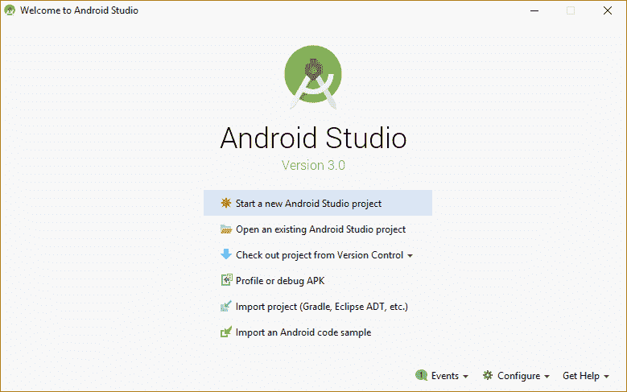
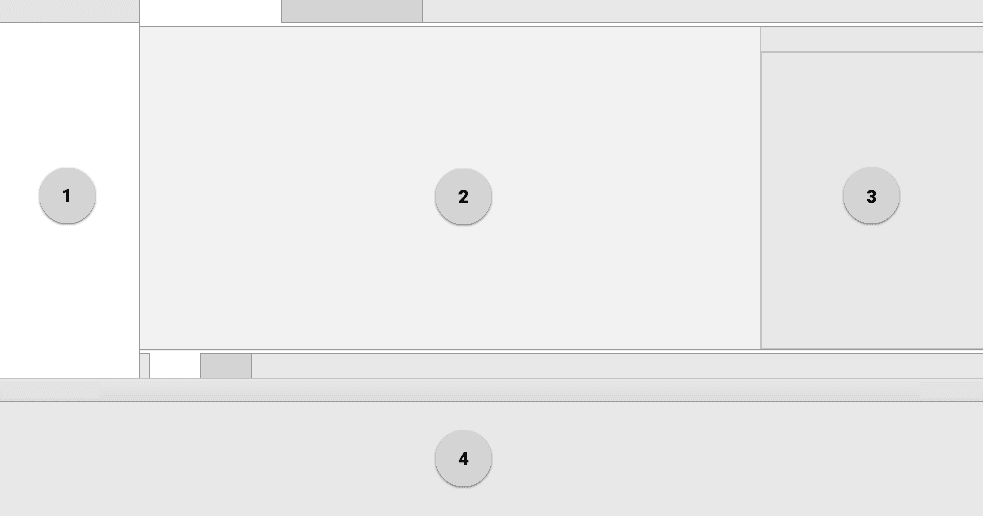
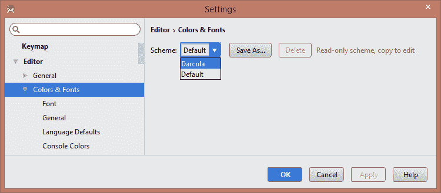
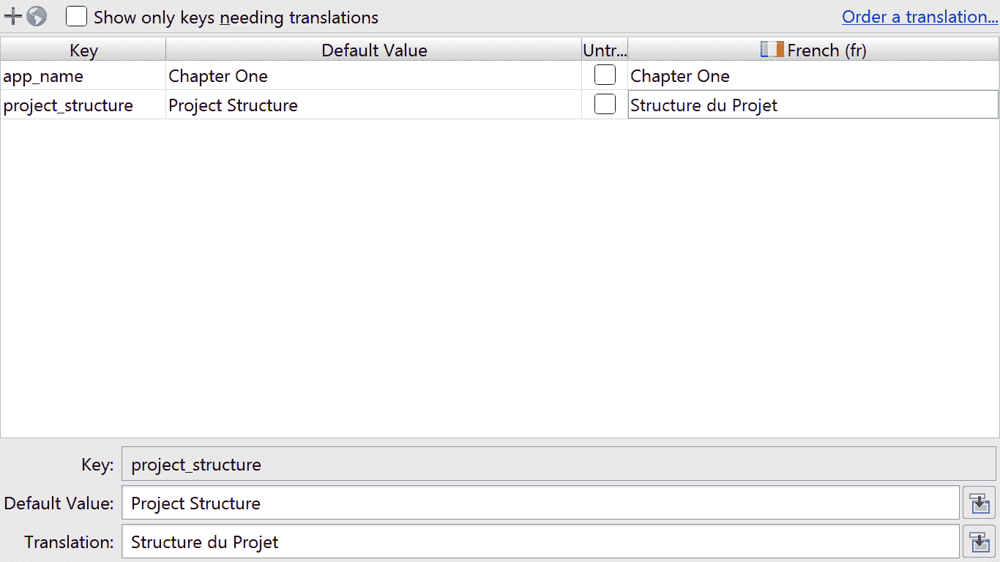
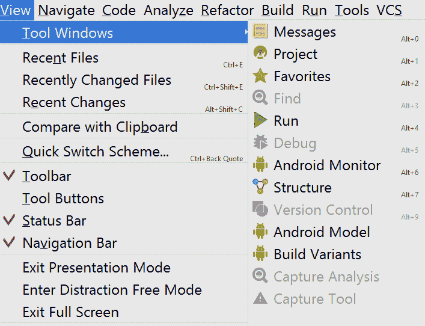
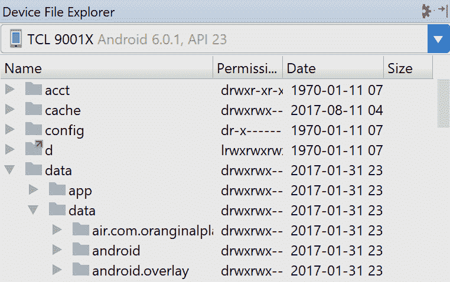
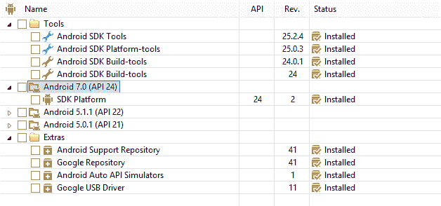
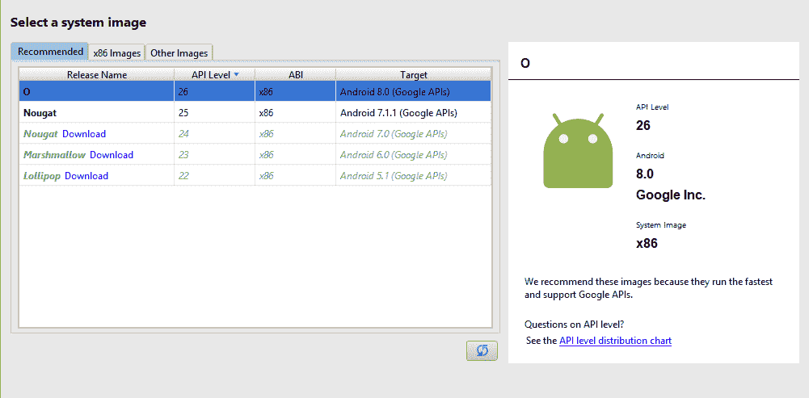

# 一、工作空间结构

Android Studio 是一个强大而复杂的开发环境，旨在开发、测试和打包安卓应用。它可以和安卓软件开发工具包一起作为一个包下载，但是正如我们将在本书的整个过程中看到的，它实际上是一个工具和组件的集合，其中许多工具和组件是独立安装和更新的。

Android Studio 并不是开发安卓应用的唯一途径；还有其他 ide，比如 Eclipse 和 NetBeans，甚至可以只使用记事本和命令行来开发一个完整的应用，尽管最后这种方法会非常缓慢和麻烦。

无论您是从另一个集成开发环境迁移，还是只想从 Android Studio 获得最大收益，这本书都将按照开发应用过程中遇到的顺序，带您了解它所有最有用的功能，从用户界面开发开始，经过编码和测试，再到构建和分发。Android Studio 提供了一些有用和智能的工具来帮助我们完成这个旅程的每一步。

Android Studio 是为了一个目的而构建的，它吸引了越来越多的第三方插件，这些插件提供了大量有价值的功能，这些功能不能通过集成开发环境直接获得。其中包括加速构建时间的插件、通过无线网络调试项目等等。其中最有用和最受欢迎的将在相关章节中介绍。在整本书中，我们将使用这些插件和 Android Studio 的内置组件来寻找加快繁琐和困难任务的方法。

在本章中，您将涉及以下主题:

*   探索 Studio 和其他 ide 之间的差异
*   进行简短的导游
*   了解工作空间的结构
*   探索编辑器窗口
*   创建材质主题
*   理解工具窗口
*   探索设备文件系统
*   使用即时运行加快构建过程
*   探索软件开发工具包管理器
*   介绍虚拟设备管理器
*   从另一个集成开发环境导入项目



Android Studio

如果您已经熟悉 Android Studio，那么您可能希望跳过这一介绍性章节的一些部分，因为它更多地是为那些从其他 ide 迁移而来的人编写的。然而，有一些你以前可能没有遇到过的方便的技巧。

尽管可以说它是一个优秀的工具，但是坚持使用另一个 IDE，比如 Eclipse，还是有一些非常好的理由的。许多开发人员为多个平台开发，这使得 Eclipse 成为一个很好的工具选择。每个开发人员都有截止日期要赶，开始时掌握不熟悉的软件会大大减慢他们的速度。这本书将加速这一转变，以便迁移的开发人员可以开始利用 Android Studio 提供的额外功能，尽可能少的中断。

# Android Studio 有何不同

Android Studio 与其他 IDEs 和开发工具有很多不同之处。其中一些差异非常微妙，例如支持库的安装方式，而其他的，例如构建过程和用户界面设计，则有很大的不同。

在深入了解 IDE 本身之前，最好先了解一下这些重要的区别是什么。这里列出了主要的:

*   **UI 开发**:Studio 与其他 IDEs 最显著的区别在于布局编辑器，它远超任何对手，提供文本、设计、蓝图视图，最重要的是每个活动或片段的约束布局工具，一个易用的主题和样式编辑器，以及一个拖放设计功能。布局编辑器还提供了许多其他地方没有的工具，例如用于在多种设备上查看布局的全面预览功能，以及简单易用的主题和翻译编辑器。
*   **项目结构**:虽然底层目录结构保持不变，但是 Android Studio 组织每个项目的方式与其前辈有很大不同。与 Eclipse 中使用工作空间不同，Studio 使用的模块可以更容易地一起工作，而不必切换工作空间。

What is called a workspace in Eclipse is called a project in Studio, and what is called a project in Eclipse is a module in Studio.

这种结构上的差异起初可能看起来不寻常，但是任何 Eclipse 用户很快就会看到，一旦熟悉了，它可以节省多少时间。

*   **代码完成和重构:【Android Studio 在您键入时智能地完成代码的方式让它成为一种令人愉悦的使用方式。它定期预测您将要键入的内容，通常一整行代码只需击两三次键就可以输入。重构也比替代的 IDEs(如 Eclipse 和 NetBeans)更容易，影响也更深远。几乎任何东西都可以被重命名，从局部变量到整个包。**
*   **仿真:** Studio 配备了灵活的虚拟设备编辑器，允许开发人员创建设备仿真器来模拟任意数量的真实设备。这些仿真器在外形和硬件配置方面都是高度可定制的，并且虚拟设备可以从许多制造商处下载。其他 ide 的用户将已经熟悉 Android AVDs，尽管他们肯定会欣赏在“设计”选项卡中找到的预览功能。
*   **构建工具:** Android Studio 采用了 Gradle 构建系统，该系统执行的功能与很多 Java 开发人员都会熟悉的 Apache Ant 系统相同。然而，它确实提供了更多的灵活性，并允许定制的构建，使开发人员能够轻松地创建可以上传到 TestFlight 的 apk，或者制作应用的演示版本。它也是 Gradle 系统，允许前面讨论的模块化性质。Studio 不是将每个库或第三方软件开发工具包编译成一个 JAR 文件，而是使用 Gradle 构建每个库或第三方软件开发工具包。

这些是 Android Studio 和其他 ide 之间最深远的区别，但也有更多独特的功能。Studio 提供了强大的 JUnit 测试工具，并允许云平台支持，甚至 Wi-Fi 调试。它也比 Eclipse 快得多，公平地说，Eclipse 必须满足更广泛的开发需求，而不是只满足一种需求，而且它可以在功能较弱的机器上运行。

Android Studio 还以即时运行的形式提供了一个惊人的省时设备。这个特性巧妙地只构建了项目中已经被编辑过的部分，这意味着开发人员可以测试对代码的微小更改，而不必等待每次测试都执行完整的构建。这项功能可以将等待时间从几分钟缩短到几乎为零。

无论你是 Android Studio 的新手，还是想从中获得更多，第一步都是广泛了解它最突出的结构。

# 工作空间结构

Android Studio 的整体结构与其他 IDEs 没有什么不同。有用于编辑文本和屏幕组件的窗口，有用于导航项目结构的窗口，还有用于监视和调试的窗口。集成开发环境非常灵活，可以进行配置以适应许多特定的需求和偏好。典型的布局可能如下所示:



A typical workspace layout

虽然这些窗口可以按照我们喜欢的任何方式排列，但一般来说，在前面的截图中，这四个窗格可能具有以下功能:

1.  导航项目、模块或库
2.  编辑文本和设计布局
3.  定义组件属性或屏幕预览
4.  监控和调试

There are times when a large number of open panes can be distracting; for these times, Studio has a Distraction Free Mode, which displays only the current editor window and can be entered from the View menu.

我们可以从许多不同的角度来看待我们的项目，也有许多方法来组织它们。最好的查看方法是依次查看每一个。

# 编辑器窗口

自然，集成开发环境中最重要的窗口是我们创建和修改所有应用底层代码的窗口。我们不仅在 XML 和 Java 中使用编辑器，还使用编辑器来简化其他资源，例如翻译和主题。无论编辑器多么图形化，所有安卓资源最终都是`res`目录中的 XML 文件。

完全不用编写任何代码就可以创建大多数安卓资源。主题可以用相应的编辑器创建，只需点击几下鼠标即可。然而，如果我们认为自己是专家，重要的是我们要很好地理解底层代码以及 Studio 如何以及在哪里存储这些资源。以下示例演示了如何使用主题编辑器创建新的安卓主题:

1.  启动或打开 Android Studio 项目。
2.  从工具|安卓|主题编辑器打开主题编辑器。


The theme editor

3.  从编辑器右上角的“主题”下拉列表中，选择“创建新主题”，并在“新主题”对话框中输入名称。
4.  保持主题父字段不变。
5.  单击颜色主缩略图。
6.  从结果样本中选择您喜欢的颜色，权重为`500`。
7.  以同样的方式，为第二颜色选择相同的颜色，权重为`700`。
8.  选择一种重量为`100`的颜色，与你的原色形成鲜明对比。
9.  打开预览或设计编辑器查看这些更改。

在前面的例子中，我们创建了一个新的主题，它将自动应用于整个应用。我们可以简单地编辑默认的`AppTheme`，但是如果我们以后决定使用多个主题，这种方法会简化事情。集成开发环境通过在`res/values/styles.xml`文件中添加类似下面一行的内容来直接应用这些更改:

```java
<style name="MyTheme" parent="AppTheme" /> 
```

实际的颜色变化可以在`res/values/colors.xml`文件中找到。

主题编辑器很好地展示了 Studio 编辑器如何在我们点击几下鼠标后创建和修改代码。

All editors can be maximized with *Ctrl* + *Shift* +*F12*. Use the same keys to return to your original layout.

也可以通过从“文件”菜单中选择“设置|编辑器|颜色和字体”来更改 IDE 本身的主题，如下图所示:



The Studio theme dialog

Android Studio 只配备了一种可选的配色方案， *Darcula* 。这个主题在黑暗的背景下呈现出明亮的文字，因此比默认设置更容易看得见，尤其是对于那些漫长的深夜开发会议。网上还有其他方案，自己设计会很有趣。然而，为了制作印刷材质，我们将在这里使用默认的 IDE 主题。

辅助编辑器的另一个很好的例子是翻译编辑器，这也是展示项目结构与其他 ide 有何不同的好方法。以下步骤显示了这是如何实现的:

1.  右键单击`res/values/strings.xml`文件并从菜单中选择，打开翻译编辑器。这也可以在设计 XML 编辑器的语言下拉列表中找到。
2.  单击编辑器左上角附近的地球仪图标，并从列表中选择一种语言。

3.  在顶部窗格中选择要翻译的字符串，并在底部窗格中输入值，如图所示:



The Translations editor

这是一个非常简单的练习，目的是演示 Android Studio 如何存储这些资源以及如何显示它们。编辑器已经创建了一个新的`strings.xml`文件，除了翻译文本的字符串值之外，其他方面都与我们的原始文件相同。任何将该语言设置为用户默认语言的设备都会自动引用该文件。

从项目浏览器来看，人们可能会认为在值目录中有一个名为`strings.xml`的项目目录，它包含两个`strings.xml`文件。事实上，这样呈现只是为了帮助我们组织资源。检查磁盘上的`project`文件夹，会发现在`res`目录中有两个(或更多)名为`values`和`values-fr`的文件夹。这不仅有助于组织我们的工作，而且有助于最大限度地减少应用在设备上占用的空间，因为终端设备上只安装了所需的资源文件夹。

The actual folder hierarchy can always be determined from the navigation bar directly under the main toolbar.


The navigation bar

主题和翻译是最不重要的两个编辑器，但很好地介绍了 Android Studio 如何管理应用资源。开发人员的大部分时间都花在使用代码编辑器上，当然，这些将在整本书中深入讨论。然而，尽管编辑器构成了集成开发环境的核心，还有许多其他有用的，甚至是至关重要的工具可供我们使用，其中最常用的工具可以在工具页边空白处找到。

# 工具窗口

至少有十几个工具窗口可供我们使用，如果你安装了插件，还会有更多。可以通过视图|工具窗口菜单、工作区底部状态栏最左侧的工具图标或按下 *Alt* 和相应的数字键打开特定的工具窗口来访问它们。



The Tool Windows menu

工具窗口是高度可配置的，每个窗口都可以设置为停靠、浮动或包含在自己的窗口中。

The Tool Windows icon on the status bar can be used to hide and reveal tool window tabs around the border of the workspace.

这在使用多个屏幕时特别有用，如下所示:


停靠、浮动和窗口工具窗口

在本书的整个过程中，我们将深入介绍所有这些工具。不过现在，以下是对最常用工具的简单介绍:

*   **消息** : *Alt* + *0* 。这个工具产生了一个成对的版本的 Gradle 构建过程。在 Gradle 控制台中可以找到更详细的输出。
*   **项目** : *Alt* + *1* 。通常停靠在工作区的左侧，这个工具是我们的主要导航工具。
*   **收藏夹** : *Alt* + *2* 。这是一个非常方便的组织工具，提供了对常用类和组件的快速访问。要将任何文件添加到收藏夹列表中，只需在项目窗口中右键单击该文件，然后从下拉菜单中选择“添加到收藏夹”。
*   **跑** : *Alt* + *3* 。一个强大的诊断工具，当应用在设备或仿真器上运行时变得可用。
*   **安卓** : *Alt* + *4* 。这是 Studio 的主调试窗口，用于监控运行中的应用的日志输出并截图。
*   **记忆监视器** : *Alt* + *5* 。这个非常有用的工具可以在应用运行时生成内存使用的实时图表。
*   **结构** : *Alt* + *6* 。该工具生成有关当前编辑器的详细信息，显示该特定文件中包含的类、变量和其他组件的分层视图。

最有用的工具窗口之一是设备文件资源管理器工具。这允许我们浏览任何连接的设备或仿真器的文件系统。



The Device File Explorer tool. All application files can be found in `data/data`.

工具窗口非常有用，使我们能够配置集成开发环境来适应我们正在进行的特定任务。能够像这样选择合适的工具是 Android Studio 最有用的功能之一。当然，Android Studio 只不过是一个前端接口，让我们可以连接到安卓背后的真正力量——软件开发工具包。

# 安卓软件开发工具包

从技术上来说，很有可能把**软件开发工具包** ( **SDK** )描述成不是 Android Studio 的一部分，因为它被其他 ide 使用。然而，没有它，集成开发环境将毫无用处，现在是快速查看它及其管理器的好时机。

安卓软件开发工具包是一个巨大的应用编程接口集合，由组织成复杂但逻辑层次的 Java 类和接口以及其他实用程序组成，如通用串行总线驱动程序和硬件加速器。

软件开发工具包及其组件的更新频率远远高于操作系统本身，这是一个用户应该幸福地不知道的设置。安卓用户从棒棒糖或者蜂巢的角度思考；作为开发人员，我们从 SDK 级别的角度来看待 Android 世界。

软件开发工具包由软件开发工具包管理器控制，可以通过主工具栏或从文件菜单的设置|外观和行为|系统设置|安卓软件开发工具包进行访问。还有一个独立的 SDK 管理器，可以在没有 Android Studio 的情况下运行。这可以在以下目录中找到:`\AppData\Local\Android\sdk`。



The Android SDK standalone manager

软件开发工具包管理器有三个部分:工具、平台和附加组件。至少，您需要安装最新的 SDK 工具、平台工具和构建工具。您还需要安装最新的平台和您打算直接瞄准的任何其他平台。您还需要任何您希望创建的虚拟设备的系统映像，以及谷歌通用串行总线驱动程序和 HAXM 硬件加速器。

If you have been using Eclipse to develop Android apps, you will be acquainted with the Android support libraries. When using Android Studio, it is the Support Repository that should be installed instead.

管理各种更新最简单的方法是将它们设置为自动安装，这可以从外观和行为|系统设置|更新下的设置对话框( *Ctrl + Alt + S* )中完成。

SDK 构成了我们开发环境的主干，但是无论我们掌握得多好，我们仍然需要一些方法来测试我们的创作，在没有大量真实设备的情况下，这取决于使用 Android 设备仿真器创建虚拟设备。

# 虚拟设备

市场上有如此多的安卓设备，在非常多的真实设备上彻底测试我们的应用是不可能的。正是由于这个原因，系统允许我们使用虚拟设备管理器创建仿真设备。

AVD 管理器允许我们从头开始创建外形和硬件配置文件，并提供几个现成的虚拟设备和系统映像，可以从各种制造商的网站下载。



AVD configuration screen

众所周知，安卓仿真器的速度非常慢，即使在非常强大的机器上也是如此，这是意料之中的，因为创建一个功能齐全的虚拟设备是一项非常复杂的任务。然而，通过设计每个虚拟设备来匹配我们正在开发的应用的特定任务，可以做一些事情来加快速度。例如，如果您的应用不使用设备摄像头，则不要将其包括在配置中。同样，不要分配比应用本身要求更多的内存。

安卓虚拟设备不是我们唯一可用的选择，还有少量但越来越多的第三方模拟器。其中许多是为游戏玩家而不是开发者设计的；虽然 Genymotion 是一个专门的开发工具，但它包含更多的功能，并且通常比本机仿真器更快。它唯一的缺点是只能免费供个人使用，只为手机和平板电脑提供系统图像，而不提供可穿戴设备或大屏幕设备，如电视。

现实世界的设备自然比任何仿真器的响应速度都要快得多，而且，在测试基本功能时，使用我们自己的设备会提供更快的结果。这种方法非常适合测试应用的基本原理，但对于我们的应用在安卓设备可以拥有的各种屏幕大小、形状和密度下的外观，几乎没有反馈。

使用真实设备是测试应用逻辑的一种快速方法，但是为特定模型甚至通用大小和形状开发应用将不可避免地需要创建虚拟设备。幸运的是，Android Studio 配备了一个加速的构建过程:即时运行。

# 即时运行

在 Android Studio 的早期版本中，每次项目在任何类型的设备上运行时，都必须执行完整的构建。即使我们只对代码做了微小的更改，我们仍然需要等待整个应用的重建和重新安装。这可能非常耗时，尤其是在功能较弱的机器上。这种缓慢经常导致必须同时测试几个修改，导致比理想情况更复杂的调试过程。

Instant Run 仅尝试构建自上次构建以来已更改的类或活动，如果清单文件未被编辑，应用甚至不会重新安装，在某些情况下，启动活动甚至不会重新启动。

由于即时运行是最近的一项创新，不幸的是，它并不在所有版本的安卓上可用，为了充分利用它，您需要将最低 SDK 级别设置为 API 21 或更高，尽管它的元素将与 API 级别 15 或更高一起工作。在 Android Studio，这个级别是从`build.gradle (Module: app)`文件设置的，如下所示:

```java
android { 
    compileSdkVersion 25 
    buildToolsVersion "25.0.1" 
    defaultConfig { 
        applicationId "com.mew.kyle.chapterone" 
        minSdkVersion 21 
        targetSdkVersion 25 
        versionCode 1 
        versionName "1.0" 
        testInstrumentationRunner "android.support.test.runner.AndroidJUnitRunner" 
    } 
```

更多的时候，我们试图让我们的应用尽可能向后兼容，开发一个只适用于 21 级或更高级别的应用会严重限制我们可以接触到的用户数量。然而，即时运行为我们节省的时间使得测试和调试应用接口 21 或更高版本变得值得，然后，稍后，重新组装它以匹配我们希望的目标版本。

When deciding which Android versions to target, a useful dashboard displays the up-to-date usage data of platforms and screens. It can be found at `developer.android.com/about/dashboards/index.html`.

从另一个集成开发环境转移到 Android Studio 不需要一个困难的过渡，一旦完成，将被证明是无价的。但是，您可能有在其他 ide 中开发的项目，希望使用 Studio 继续开发。幸运的是，这是一个简单的任务，如下节所示。

# 将项目导入 Android Studio

毫无疑问，Eclipse 是最好的开发工具之一，15 年后，我们中的许多人已经非常熟悉它了。说到为各种平台开发，Eclipse 是一个很棒的工具，但在开发安卓应用方面，它无法与 Android Studio 竞争。

如果您从 Eclipse 迁移，您很可能会有您一直在处理的项目，您希望将其导入到 Studio 中。以下步骤演示了如何做到这一点:

1.  首先确保您的 Eclipse ADT 根目录包含`src`和`res`目录以及`AndroidManifest.xml`文件。
2.  记下您使用过的任何 Eclipse 第三方插件，因为您需要在 Studio 中安装等同的插件。
3.  打开 Android Studio，从欢迎屏幕或从文件|新建|导入项目中选择导入项目。
4.  选择包含清单的文件夹并准备一个目标文件夹，然后按照提示完成导入。

导入过程会生成项目的完整副本，而原始副本保持不变，这意味着如果您愿意，它仍然可以在 Eclipse 中工作。不幸的是，导入第三方插件是不可能的，但是有大量且越来越多的插件可供 Studio 使用，并且您很可能能够找到等效的插件。这些可以从文件|设置|插件浏览。

If you have several Eclipse projects in the same workspace, then you should import one as a project and the rest as modules.

当我们谈到项目配置时，我们将再次关注这个过程，但否则，从现在开始，我们将假设所有项目都在 Android Studio 开始。

# 摘要

本章为那些不熟悉 Android Studio 的读者提供了一个简短但完整的介绍。我们探索了工作空间是如何构建的，以及可供我们使用的各种编辑器。这一探索使我们创建了一个材质设计主题，使用工具窗口来执行各种有用的任务，并应用即时运行来加快耗时的构建过程。

这一章以快速查看虚拟设备以及我们如何从其他 IDEs 导入项目作为结束。介绍完毕后，接下来的章节将深入探讨布局编辑器本身，因为我们将看到如何设计适用于最广泛的外形规格的应用界面。