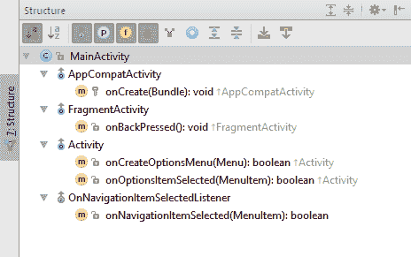
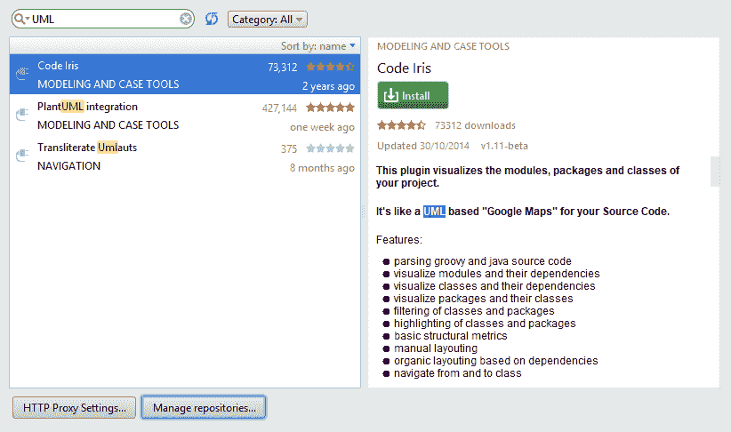

# 六、模板和插件

作为一个开发环境，Android Studio提供了设计和开发我们可以想象的任何安卓应用的所有方面的设施。在前面的章节中，我们看到了它如何作为一个可视化设计工具，以及动态布局编辑器、仿真器和 XML 结构。从现在开始，我们将深入研究，看看集成开发环境如何促进、简化和加快编码、测试和微调工作的过程。

大多数读者已经是专业的程序员，不需要任何帮助。因此，这是Android Studio改善这种体验的方式，我们将在接下来的章节中进行全球探索。在本章中，我们将查看集成开发环境以活动模板和应用编程接口示例形式提供的各种现成代码示例。这些都是有用的方法，可以探索和学习各种组件是如何编码的，并通过提供一个已经存在的起点来加快编码过程。此外，正如我们将看到的，如果模板的捆绑选择还不够，Android Studio允许我们创建自己的模板。

在本章中，您将学习以下内容:

*   了解内置项目模板
*   访问“结构工具”窗口
*   安装和使用统一建模语言插件
*   应用简单的重构
*   应用代码模板
*   创建自定义模板
*   使用项目示例

# 项目模板

大多数读者在从集成开发环境的欢迎屏幕启动新的Android Studio项目时，都会遇到项目模板。


Project templates

即使是空活动模板也提供了几乎所有应用都必需的文件和一点代码，正如您在前面的截图中看到的，有越来越多的项目模板被设计来适应许多常见的应用结构和目的。

# 导航抽屉模板

这里没有必要检查所有这些模板，但是有一两个非常有启发性，可以进一步了解Android Studio的工作方式。第一个，也可能是最有用的，是导航抽屉活动模板，它在按原样运行时会产生以下输出:


The Navigation Drawer template

从前面的截图中可以看出，该模板提供了许多常见的和推荐的用户界面组件，包括图标绘图、菜单和操作按钮。这些模板最有趣的方面是它们创建的代码和它们使用的文件结构，这两者都是最佳实践的好例子。

如果我们用这个模板开始一个新的项目，并开始环顾四周，我们首先会观察到的一件事是`activity_main.xml`文件不同于我们之前看到的文件，因为它使用`android.support.v4.widget.DrawerLayout`作为它的根。在这里面，我们从设计库中找到`CoordinatorLayout`和`NavigationView`。和前面的例子一样，协调器布局包含一个工具栏和一个 FAB 这里，虽然这些组件是在一个单独的文件中创建的，并包含在`include`标签中，如下所示:

```java
<include 
    layout="@layout/app_bar_main" 
    android:layout_width="match_parent" 
    android:layout_height="match_parent" /> 
```

这种结构有助于保持我们的代码更容易跟踪，并使未来的修改更容易。可以看到，这种方法也用于定义导航栏标题和主要内容。

大多数模板生成的 XML 对于读者来说都很熟悉，但是有一两个片段可能需要解释。例如，`content_main.xml`文件包含以下行:

```java
app:layout_behavior="@string/appbar_scrolling_view_behavior" 
```

引用的字符串在`strings.xml`文件中找不到，因为它是系统提供的并指向`AppBarLayout.ScrollingViewBehavior`类，确保我们的工具栏是它的一个实例。

线`tools:showIn="@layout/app_bar_main"`可能也是莫名其妙。这是在`tools`命名空间中发现的许多有用特性之一，在这里使用，以便在预览编辑器中可以看到导航抽屉，从而使开发人员不必在每次想要查看图形更改时都重新构建项目。

由该模板和其他模板生成的 XML 资源只能说明问题的一半，因为它们中的许多还会生成大量的 Java 代码，这与 XML 一样有趣，甚至更有趣。只要快速浏览一下`MainActivity.Java`代码，就会演示模板如何设置方法来处理基本的导航、菜单和按钮点击。没有一个代码是复杂的理解，但它非常方便，因为所有这些方法都必须由我们在某个时候进行编码，注释和占位符使替换我们自己的资源和添加我们自己的代码变得非常简单。

# 结构浏览器

当我们有时间以这种方式浏览代码时，这很好，但是很少有开发人员有这种奢侈，并且自然希望有一种快速查看类的结构和内容的方法。Android Studio 以**结构工具窗口**的形式为 Java 类的内部工作提供了一个简洁的示意性窗口，可以从项目浏览器栏中选择，也可以通过按下 *Alt* + *7:* 来选择



The Structure (*Alt *+ *7*) Tool window

当处理具有许多类的项目时，结构工具是维护概述的一种非常有用的方式，当处理冗长的类时，选择任何项目都会在代码编辑器中突出显示相应的文本。

Pressing *F4* when an item in the structure explorer is selected will cause the code editor to jump to that location in the text.

“结构”窗格顶部的工具栏允许使用一些非常方便的过滤器，这样我们的方法就可以根据它们的定义类型(如上图所示)和其他详细程度(例如是否显示属性和字段)来显示。

尽管能够从这样的角度来查看任何类是有用的，但是我们经常希望从更多的角度来查看类结构，当然也有允许更深入检查的插件。

# 类别检查插件

有许多方法可以可视化类和类组，使它们更容易跟踪或突出某些特性或属性。一个久经考验的可视化编程工具是**通用建模语言** ( **UML** )。如果开发人员正在使用设计模式，这些特别有用。

有几个 UML 类图插件可供我们使用，从基本的到复杂的。如果你只是想要一个简单的 UML 工具，那么可以从以下链接下载 JetBrains 插件 simpleUMLCE:

[插件。jetbrains . com/plugin/4946-simple umce](http://plugins.jetbrains.com/plugin/4946-simpleumlce)

如果您是插件新手，请按照快速步骤安装并使用简单的 UML 插件:

1.  从前面的链接下载插件。
2.  从Android Studio的文件|设置菜单打开插件对话框。
3.  从磁盘使用安装插件...按钮来定位和安装插件。


The Plugins dialog

在访问插件之前，您需要重新启动集成开发环境。完成后，右键单击项目资源管理器中的包或类，然后选择添加到简单 UML 图|新建图...从菜单上。该插件将在左侧装订线添加一个选项卡，这将打开工具区域并显示以下截图:


The simpleUML Diagram tool

我们在本章中使用的导航抽屉示例中使用的 activity 类有点过于简单，无法真正展示对代码进行图形化查看的优势，但是如果读者将此工具应用到一个更复杂的类中，该类包含多个字段和依赖项，那么它的价值将很快变得显而易见。

图表可以保存为图像，并且可以从窗口自己的工具栏获得各种视角。

Most Studio plugins will add a tab to the guttering. This is normally placed at the top of the left-hand gutter. This can often interfere with our own workspace preferences. Fortunately, these tabs can be rearranged by simply dragging and dropping them into a preferred position.

对于大多数开发人员来说，像这样一个简单的 UML 工具就足够了，但是如果你更喜欢一个更复杂的工具，那么 **Code Iris** 可能就是适合你的插件。

代码虹膜不需要下载，因为它可以通过浏览插件库找到。尽管如此，您仍然需要重新启动 IDE。可以从设置对话框的同一个插件窗口访问存储库，但是要点击浏览存储库...按钮。



The Browse Repositories dialog

快速查看项目网页的描述，可以在[plugins.jetbrains.com/plugin/7324-code-iris](https://plugins.jetbrains.com/plugin/7324-code-iris)找到，它将显示代码 Iris 可以做很多事情，不仅仅是创建类图，应该更多地被认为是一个更通用的可视化工具。该工具被描述为基于 UML 的谷歌地图，用于您的源代码，使其不仅成为个人有用的开发工具，也是团队之间的一个很好的沟通工具，并且它比同等工具更适合绘制整个项目。

Any third-party plugin repository can be made available in the repository browser, by clicking on the Manage repositories... button and pasting the relevant URL into the resultant dialog.

代码可视化可以通过打开工具窗口并选择“创建/更新图表”按钮来生成，也可以从项目资源管理器的单个模块、包或类条目中生成。

Code Iris 的优势在于它能够以任何比例可视化项目，并使用视图滑块在这些比例之间快速切换。与过滤器和名为**有机布局**的自动排列算法结合使用，我们可以快速生成适当且易于理解的可视化效果。


Code Iris visualization

尽管有机布局工具以生物学和糟糕的英语使用为名，但它实际上非常聪明、有用和好看。当打开时(使用播放按钮)，图表会根据我们的关注点动态排列，只需点击感兴趣的类就可以进行指导。如果你曾经发现自己处于不得不处理文档记录不佳的代码的尴尬境地，这个工具可以为你节省很多时间。

这里涉及的两个插件绝不是我们唯一可用的检查和可视化工具，在互联网上快速搜索会发现更多。我们这里选择的两个是因为它们代表了周围的工具类型。

我们在这里探索的导航抽屉模板非常有用，因为它包含几个几乎无处不在的用户界面组件。理解起来也很简单。另一个非常方便的项目模板是主/详细流程模板。

# 主/明细流程模板

主/细节用户界面经常出现在移动设备上，因为它们通过根据屏幕的当前宽度单独或并排显示列表及其每个项目，非常好地最大化了空间的使用。这导致电话在纵向显示两个单一窗格；但是，在横向模式或更大的设备(如平板电脑)上，两个窗格将并排显示:


A two-pane view

前面的屏幕截图取自未修改的主/细节流项目模板，在横向模式下在设备上查看，以便显示两个窗格。我们之前说过，在横向模式下，双窗格视图在手机上是可见的。如果你在很多手机上试过，你会发现这不一定是真的。默认情况下，模板仅在最长边为 900dp 或更长的屏幕上显示两个窗格。这可以从`res/layout-w900dp`目录的存在推断出来。

要在较小的设备上启用双窗格视图，我们只需更改该文件夹的名称。当然，这可以直接从我们的文件浏览器中完成，但是Android Studio有一个强大的重构系统，带有一个复杂的预览窗口。虽然在这种情况下不需要它，但它可能是最有用的，因为它会搜索对它的引用并重命名它们。

The Rename dialog can be opened directly by pressing *Shift* + *F6*.

当然，如果您尝试从导航栏或项目浏览器访问`layout-w900dp`文件夹，您将无法这样做。要做到这一点，在浏览器中从安卓选项卡切换到项目选项卡，因为这将项目完全呈现在磁盘上。

对代码的快速检查将揭示一个名为 DummyContent 的 Java 类。正如您将看到的，这里有一个 TODO 通知，指出这个类需要在发布之前删除，当然，简单地重构它是完全可能的。该文件的目的是演示如何定义内容。我们所需要做的就是用我们自己的替换模板中应用的占位符数组。当然，这可以采取我们选择的任何形式，如视频或网络视图。

能够用现成的代码启动一个项目是非常有用的，可以节省我们大量的时间。然而，很多时候，我们可能希望开始一个具有适合我们目的的自己的结构的项目，而这很可能不是通过集成开发环境可以实现的。然而，这种情况并不妨碍我们这样做，因为代码模板在任何时候都是可用的，正如我们将看到的，甚至有可能创建我们自己的模板。

# 自定义模板

假设您正在开发一个使用我们已经检查过的模板之一的项目，但是您也想要一个登录活动。幸运的是，使用集成开发环境中已经启动的项目可以轻松地管理这一点。

我们在开始一个新项目时所看到的项目模板屏幕在任何时候对我们来说都是可用的，这一点并不明显。只需选择新建|活动|图库...从项目资源管理器的上下文相关菜单中，然后选择您选择的活动。然后，您将看到一个定制屏幕，类似于您之前看到的屏幕，但带有声明父级和包的选项，使我们能够使用任意多的模板。

If you have visited the activity gallery, you will also have noted that these activities can also be selected directly and without having to open the gallery.

这不是故事的全部，因为同一个菜单允许我们创建和保存自己的模板。打开源代码文件夹的上下文菜单，并选择新建|编辑文件模板...将打开以下对话框:


模板编辑向导

从前面的截图中可以看到，有很多可用的文件模板，以及其他三个选项卡。“包括”选项卡提供文件头，“代码”选项卡包含较小的代码单元，其中许多在测试期间非常有用。“其他”选项卡特别有用，它为更大的应用组件提供了模板，例如活动、片段、清单、布局和资源。

左上角的+图标允许我们创建自己的模板(但只能从前两个选项卡创建)。最简单的是，可以简单地将代码直接粘贴到提供的窗口中。命名并保存后，它将出现在“文件”|“新建”菜单中，或者直接出现在项目资源管理器目录中。

快速浏览一下一些内置模板，会立即发现以`${VARIABLE}`形式使用了一个占位符变量。正是这些占位符使定制模板成为如此有用和灵活的工具。

查看这些变量如何工作的最简单方法是使用一个现有的模板来看看这些占位符是如何实现的；这将在下面的练习中概述:

1.  如前所述，打开编辑文件模板向导。
2.  从其他选项卡中，复制`Activity.java`条目中的代码。
3.  使用+按钮创建一个新模板，命名它，并将代码粘贴到提供的空间中。
4.  根据需要编辑代码，确保包含自定义变量，例如在以下代码中:

```java
package ${PACKAGE_NAME}; 

import android.app.Activity; 
import android.os.Bundle; 

#parse("File Header.java") 
public class ${NAME} extends Activity { 

public String ${USER_NAME} 

    @Override 
    public void onCreate(Bundle savedInstanceState) { 
        super.onCreate(savedInstanceState); 
    } 
} 
```

5.  单击确定保存模板，该模板现在将出现在新菜单中。
6.  现在，每当您创建此模板的实例时，Android Studio都会提示您输入模板占位符中定义的任何变量:


Generating a class from a template

所有开发人员都依赖于他们可以反复使用的代码，尽管其他 ide 提供了代码模板，但内置结构的数量和易于创建使这成为 Android Studio 最大的省时功能。

# 第三方模板

在继续之前，我们需要快速了解访问现成模板的另一种方式:第三方模板。快速搜索就会发现，网络上有很多这样的网站。不幸的是，其中许多最好的不是免费的，尽管许多确实提供免费试用。

像软部落和恩瓦托这样的网站为大量的应用类型提供了高度开发的模板，例如广播流、餐厅预订和城市指南。这些模板大多是完全开发的应用，只需要配置和定制即可。这样的方法可能不适合经验丰富的开发人员，但是如果速度是您的首要任务，并且您有这样的预算，这些服务为项目的完成提供了强大的捷径。

在提供现成的代码时，模板并不是Android Studio唯一节省时间的功能，您无疑会注意到通过 IDE 提供的许多示例项目。

# 项目示例

尽管可以从示例浏览器中的 IDE 中访问示例，但在项目开始时打开其中一个示例更为常见。这可以在“导入安卓代码示例”下的欢迎屏幕上完成。有数百个这样的示例(在网上可以找到更多的示例)，这些示例在示例浏览器中被很好地分类。

与模板一样，示例可以作为更大项目的起点，但它们本身也是一种教育，因为它们是由极其博学的开发人员编写的，是最佳实践的绝佳示例:


The sample browser

从前面的示例浏览器可以看出，示例不仅可以从浏览器下载，还可以在 GitHub 中查看。读者会知道，GitHub 是一个神奇的代码库，对各种开发人员都有巨大的用处，它包含了在示例浏览器中找到的所有示例；还有成千上万的其他安卓项目、代码库和插件。从示例的角度来看，这个资源非常节省时间，因为在决定是否下载和构建之前，查看代码要快得多。

有这么多示例，它们都同样有用和有指导意义，因此很难在这里选择任何一个来检查，尽管 Camera2 示例可能有助于探索，因为这是许多开发人员以前可能没有检查过的一个 API。这归因于以下两个因素:

*   通常，只需从我们自己的应用中调用本机应用(或用户安装的应用)，就可以访问相机功能。
*   Camera2 应用编程接口与运行在应用编程接口级别 20 及以下的设备不兼容。与许多 API 不同，除此之外，没有方便的支持库来使 Camera2 向后兼容。

尽管有这些缺点，如果你正在计划一个专注于捕捉图像和视频的应用，那么你需要自己构建所有的功能。这就是这些样本非常有用的地方。camera 2 基本示例可能是首先要看的最佳示例。

该示例只包含三个类和一个简单的布局结构，既适合横向，也适合纵向。这些类包括一个基本的启动活动，一个扩展的 TextureView，它根据运行它的设备来调整要捕获的区域的大小，以及一个完成大部分工作的 Fragment。所有这些类都得到了很好的注释，并且几乎是不言自明的，快速检查代码是理解其工作所必需的。与其他示例一样，Camera2Basic 无需任何进一步修改即可构建和运行:


The Camera2Basic sample

存储库中的所有示例都同样有用，这取决于您对项目的选择，并且它们都同样写得很好，很有指导意义。

GitHub 最有用的属性之一是那里有大量的第三方库，当我们仔细查看 Gradle 构建过程时，我们将看到如何将这些库作为依赖项包含在 Android Studio 中。

这些并不是 GitHub 上唯一有用的工具，GitHub 也绝不是这类工具的唯一来源。随着我们从用户界面开发转向编码，现在是时候再看看Android Studio可用的第三方插件了。

# 第三方插件

有大量且越来越多的第三方插件可用，这使得很难选择一个公平的样本。以下几节涵盖了一些插件，这些插件主要是为了通用目的而选择的。

# wi-fi ADB

这是一个喷气大脑插件，因此可以使用浏览存储库找到...设置对话框插件屏幕的按钮:


The plugins dialog

这个插件只是允许我们使用共享的无线网络连接来调试我们的应用。尽管简单，这个应用不仅仅是一个节省电缆的便利，因为它允许设备的许多传感器的实时调试，这些传感器将受到与主机连接的极大限制。健身和增强现实应用可以通过这种方式更容易地进行测试。

ADB Wi-Fi 的设置和使用非常简单，尤其是如果您的主机和设备已经共享了 Wi-Fi 连接，并且设备之前已经用于调试。

大多数插件比这个复杂得多，许多插件使用一些非常复杂的技术，比如人工智能。

# Codota

最近人工智能取得了很大的进步，虽然许多这样的说法被夸大了，并且自命不凡，但是仍然有一些惊人的例子表明人工智能是真正有用的，Codota 就是这样一个项目。

许多开发人员将已经熟悉 Codota 作为在线搜索工具或浏览器扩展。尽管这些工具既聪明又有用，但 Codota 真正成为了自己的集成开发环境插件。它使用了一个名为**代码大脑**的智能进化人工智能系统。这段代码基于一种被称为**以示例为中心的编程**的紧急编程形式。


科多塔的大脑代码

从技术上来说，Codota 插件并不是一个真正的插件，因为它必须单独安装，并且在一个没有从 IDE 连接的窗口中运行。这是因为它使用的是 Java IDE，而不是单独的环境。这有几个优点，其中之一是该插件是一个 Java 插件，不是安卓专用的，这意味着它可以在任何版本的工作室上运行，并且(不像一些插件)不需要等待更新。

Android Studio Codota 插件作为一个独立的应用运行，这是一个优势。当打开时，它非常聪明(根据它的算法哲学，通过第二个变得更聪明)。该软件声称提供了一个智能编码助手，而且它经常这样做，我会挑战任何人不被它的敏锐所打动。它有一些缺陷，但通常会从各种各样的在线来源中找到例子，包括 stackoverflow 和 GitHub，它们几乎总是有用的。

一旦下载并打开，只需打开 IDE，点击一些感兴趣的代码，Codota 很可能会为您可能遇到的任何问题提供一些非常可爱的答案。想象一下，有一个助手，虽然不是很聪明，但知识渊博，可以在几秒钟内扫描所有相关的在线代码。这就是 Codota，无论你把它用作浏览器扩展、搜索工具还是 IDE 插件，它都是可用的更好的编码助手之一。

# 摘要

在这一章中，我们已经看到了两种帮助代码开发的方法:现成的代码，以及助手插件和附加组件。模板通常是快速启动项目的好方法，类检查插件允许我们轻松理解更大的模板，而不必仔细阅读大量代码。

我们在本章中看到的其他插件提供了一些不同的方法来使应用开发任务变得更容易和更有趣。当然，有很多非常棒的工具，编码也在不断变得不那么单调，更具创造性。

这一章的重点是 Java 编程，但正如任何开发人员所知，这绝不是唯一可用的语言。Android Studio同时支持 C++ 和 Kotlin(后者甚至可以和 Java 代码一起包含在内)。

在下一章中，我们将探讨如何支持其他语言，并看一看 Android Things，尽管不是另一种语言，但它确实需要许多传统开发人员可能不熟悉的技能集。幸运的是，Android Studio提供的工具使得为单板计算机开发与开发其他安卓应用非常相似。