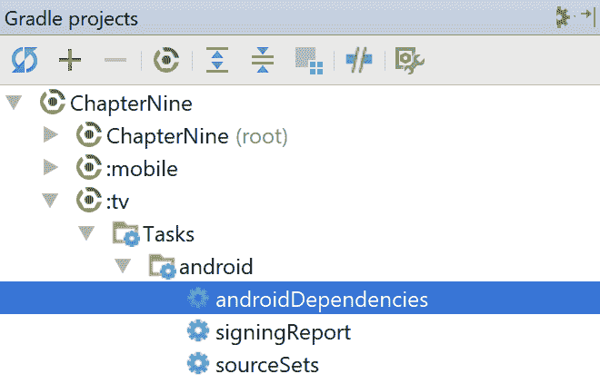
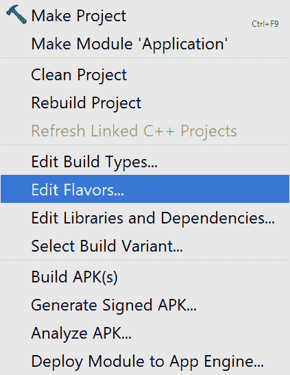
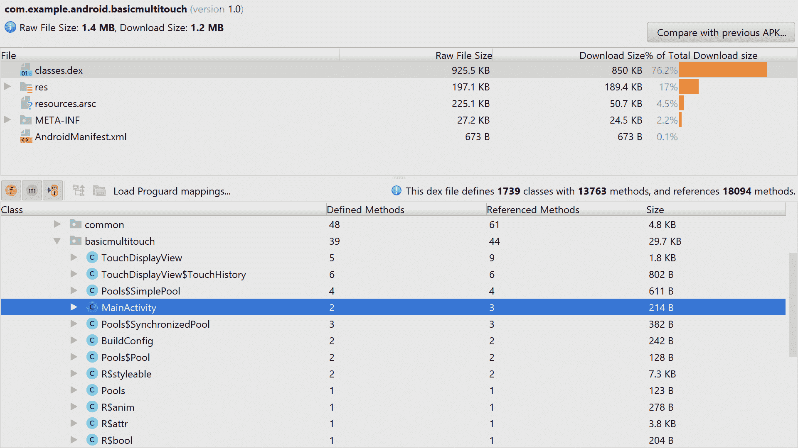
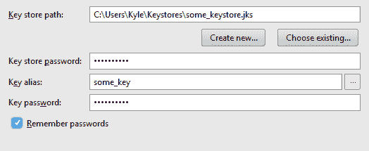
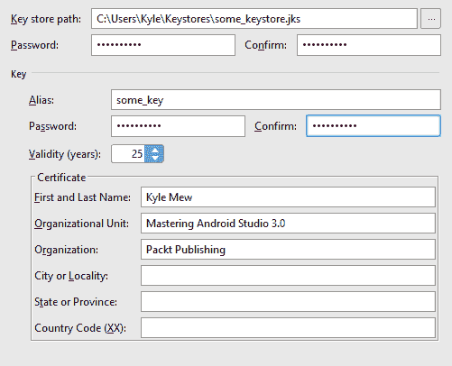
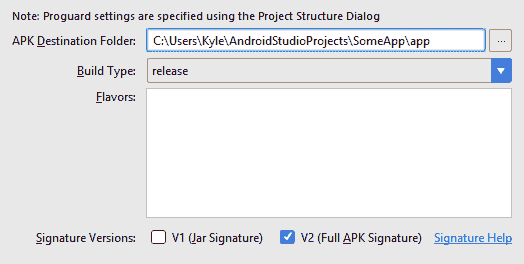
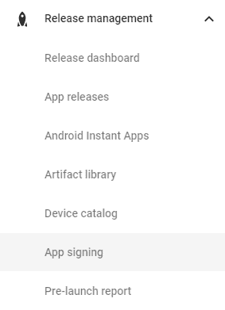
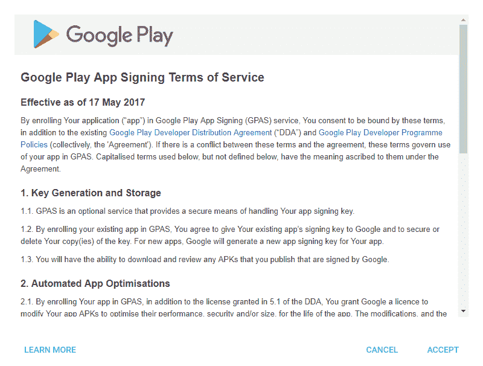
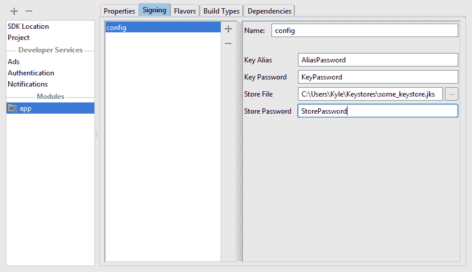
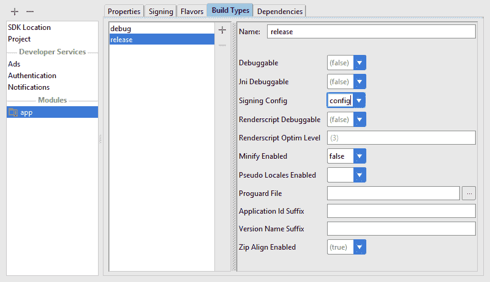

# 九、打包和发布

编译和构建 APKs 是我们在应用开发过程中多次做的事情，除了包含各种依赖关系之外，我们还将构建自动化系统 Gradle 视为理所当然。尽管如此，读者还是会注意到，Gradle 实际上做的事情确实非常复杂。

我们可以认为 Gradle 理所当然的原因之一是它使用一种称为**约定而不是配置**的过程来配置每个构建的方式。这确保了在几乎所有的情况下，Gradle 为每个项目选择最合理的配置选项。当我们覆盖这些设置时，Gradle 变得有趣和有用。例如，我们可以使用它从同一个 Studio 项目中构建应用的移动和平板版本。

制作一个编译好的 APK 文件绝不是我们旅程的最后一步，因为我们还可以做大量的测试和分析。Android Studio的 APK 分析器的出现极大地帮助了这些过程。

一旦我们的测试完成，我们对我们的产品感到满意，我们将通过生成已签名的 APK 文件进入旅程的最后阶段，准备发布。这一步不是一个复杂的过程，Android Studio帮助开发人员完成每一步。

在本章中，您将了解:

*   理解构建过程
*   创造产品风味
*   从 Eclipse 导入渐变构建
*   分析 APK 文件
*   清洁项目
*   生成签名的 APK
*   注册谷歌游戏应用签名
*   配置自动签名

# 渐变构建配置

读者将会看到，Gradle 脚本通常有一个项目(或根)文件和一个或多个模块级文件:


Gradle scripts

我们被告知不要在根脚本的注释中编辑该文件；除非我们有所有模块共有的配置选项，否则最好保持原样。

我们对模块级脚本更感兴趣，下面是一个典型脚本的分解。

第一行简单地声明了 Gradle 插件的使用:

```java
apply plugin: 'com.android.application'
```

接下来，声明面向安卓的应用编程接口级别和构建工具版本:

```java
android { 
    compileSdkVersion 27 
    buildToolsVersion "27.0.0" 
```

默认配置设置定义了 Android 清单文件的元素，在这里编辑它们将在下一次构建或同步后自动反映在清单中，如下所示:

```java
defaultConfig { 
     applicationId "com.example.someapp" 
     minSdkVersion 21 
     targetSdkVersion 27 
     versionCode 1 
     versionName "1.0" 
     testInstrumentationRunner 
         "android.support.test.runner.AndroidJUnitRunner" 
} 
```

构建类型部分配置 **ProGuard** ，这是一个用于最小化和混淆我们的代码的工具。

The difference Proguard makes to the size of your APK can often be minimal, but the effects of obfuscation cannot be underestimated and ProGuard can make it as good as impossible for our APKs to be reverse-engineered.

`buildTypes`部分包含在构建应用的发布版本时，是否以及如何在 APK 文件上运行 ProGuard 的说明:

```java
buildTypes { 
     release { 
         minifyEnabled false 
         proguardFiles 
             getDefaultProguardFile('proguard-android.txt'), 
             'proguard-rules.pro' 
        } 
    } 
} 

```

可从`proguard.rules.pro`文件编辑 ProGuard 规则，该文件覆盖默认规则，可在`sdk\tools\proguard`中找到。

Note that `minifyEnabled` is set by default to `false`. This is an extremely useful set of functions that strips our code of redundancies, often resulting in far smaller APK files, and should generally be set to `true`.
It is also a good idea to add shrinkResources `true`, which performs a similar action on our resource files.

最后，我们将关注依赖项部分，我们已经非常熟悉它了。在这里，模块的`lib`目录中的任何`.jar`文件都包括在内:

```java
dependencies { 
    implementation fileTree(dir: 'libs', include: ['*.jar']) 
    androidTestImplementation('com.android.support 
        .test.espresso:espresso-core:2.2.2', { 
        exclude group: 'com.android.support', 
            module: 'support-annotations' 
    }) 
    implementation 'com.android.support: 
        appcompat-v7:26.0.0-beta2' 
    testImplementation 'junit: 
        junit:4.12' 
    implementation 'com.android.support.constraint: 
        constraint-layout:1.0.2' 
    implementation 'com.android.support: 
        design:26.0.0-beta2' 
} 
```

# 命令行选项

许多从其他 IDE 迁移过来的读者可能已经从命令行运行了 Gradle 脚本，这当然在 Android Studio 中是可能的，尽管 Studio 在工作区中很好地结合了这一点，因此没有必要退出 IDE 以这种方式执行命令。

有两个方便的工具窗口可以帮助我们完成这项任务，即渐变工具窗口和渐变控制台，这两个窗口都可以从视图|工具窗口菜单中获得。



The Gradle tool window

前面截图中的细分很好地概括了 Gradle 所扮演的角色，但是要真正掌握它，我们需要通过一个简单的例子，下面的部分演示了如何配置 Gradle 来从单个项目中产生不同的产品风格。

# 产品风味

一般来说，有两个原因让我们想要创建应用的定制版本或风格:

*   当我们为手机和平板电脑等不同外形的产品创建版本时
*   当我们想要在 Play 商店中提供两个不同版本的应用时，例如付费版本和免费版本

这两种情况都可以通过配置我们的构建文件来满足，这可以为`debug`和`release`apk 完成。新的风格和构建类型都可以使用它们各自的对话框进行配置，这些对话框可以在“构建”菜单下找到:



Build options

和往常一样，最好直接看看这些流程是如何运作的。在下面的例子中，我们将创建两种产品风格来表示应用的免费和付费版本。要遵循的步骤是:

1.  只需一个模块就可以在Android Studio启动一个新项目。
2.  在你的`values`文件夹中创建两个新的|目录，分别叫做`paid`和`free`。
3.  这些在浏览器中的安卓标签下不可见，但可以通过切换到项目视图找到。

A shortcut to this can be achieved by selecting `values` in the navigation toolbar and selecting `paid` or `free` from the drop-down. This will automatically open the project view and expand it to display our new folders.

4.  按照以下思路创建两个合适的`strings.xml`文件:

```java
<resources> 
    <string name="app_name">Product Flavors Pro</string> 
    <string name="version">Pro</string> 
</resources> 

<resources> 
    <string name="app_name">Product Flavors Free</string> 
    <string name="version">Free</string> 
</resources> 
```

5.  打开`build.gradle`文件，这样完成:

```java
apply plugin: 'com.android.application' 

android { 

    . . . 

    defaultConfig { 

        . . . 

        flavorSelection 'full', 'paid' 
        flavorSelection 'partial', 'free' 
    } 
    buildTypes { 
        release { 

            . . .  

        } 
    } 

    productFlavors { 
        flavorDimensions "partial", "full" 

        paid { 
            applicationId = "com.example.someapp.paid" 
            versionName = "1.0-paid" 
            dimension "full" 
        } 

        free { 
            applicationId = "com.example.someapp.free" 
            versionName = "1.0-free" 
            dimension "partial" 
        } 
    } 
} 

dependencies { 

    . . .  

} 
```

现在使用构建变体工具窗口来选择随后构建这两种风格中的哪一种。

许多读者会从 Eclipse 集成开发环境迁移到Android Studio。导入 Eclipse 项目相对简单，但是导入 Gradle 构建文件就不那么简单了。这可以通过以下`build.gradle`根文件来实现:

```java
buildscript { 
    repositories { 
        mavenCentral() 
    } 
    dependencies { 
        classpath 'com.android.tools.build:gradle:3.0.0' 
    } 
} 
apply plugin: 'com.android.application' 

android { 
     lintOptions { 
          abortOnError false 
      } 

    compileSdkVersion 27 
    buildToolsVersion "27.0.0" 

        defaultConfig { 
            targetSdkVersion 27 
        } 

    sourceSets { 
        main { 
            manifest.srcFile 'AndroidManifest.xml' 
            java.srcDirs = ['src'] 
            resources.srcDirs = ['src'] 
            aidl.srcDirs = ['src'] 
            renderscript.srcDirs = ['src'] 
            res.srcDirs = ['res'] 
            assets.srcDirs = ['assets'] 
        } 

        debug.setRoot('build-types/debug') 
        release.setRoot('build-types/release') 
    } 
} 
```

能够创建不同版本的 APK，而不必创建单独的项目，这是一个很好的时间节省，Gradle 使这个非常简单。尽管如此，在大部分时间里，我们只能让 Gradle 继续工作。

人们很容易认为测试过程会随着 APK 的生产而完成。然而，Android Studio提供了一个了不起的工具，允许我们分析完成的 apk。

# APK 分析

APK 分析仪是Android Studio最便捷的功能之一；顾名思义，它允许我们自己分析 APK 文件，甚至通过提取资源和 XML 来执行一定量的逆向工程，并允许我们比较不同的版本。

APK 分析仪也可以在“分析 APK”下的“构建”菜单中找到....每次我们在设备或模拟器上运行项目时，都会生成一个调试 APK。这可以在下的项目目录中找到；`\SomeProject\App\build\outputs\apk\debug`。

分析器显示其输出，如下所示:


APK analysis

分析器的输出包含丰富的信息，从其大小和压缩的播放存储大小开始。一眼就能看出哪些资源占用了最多的空间，并在可能的情况下进行纠正，例如使用矢量代替位图。

`classes.dex`文件允许我们探索类和导入的库消耗的内存。



APK 阶级分析。

One of the most useful features of the Analyzer is the ability to compare two APKs side by side, which can be achieved using the button in the top-right corner of the window.

如果 APK 分析仪不够，那么就有配置文件或调试 APK...主文件菜单中的条目。这开启了一个新的项目，并拆卸 APK，以便它可以充分探索，甚至调试。

除了 MakeBuild 和 Analyze 之外，Build 菜单还有其他有用的条目，例如，如果我们想通过互联网与同事和协作者共享构建工件，Clean Project 项会从构建目录中删除它们。要进行更深入的清理，请使用本机文件资源管理器在项目文件夹中打开命令提示符，或者从“文件”|“工具窗口”菜单中选择“终端”。


以下命令将清理您的项目:

```java
gradlew clean 
```

该操作可以节省的空间量通常令人印象深刻。当然，下一次你构建这个项目时，需要的时间和第一次一样长。

在开发周期的绝大部分时间里，我们只关心 APK 的调试版本，但是迟早我们需要生产一个适合发布的 APK。

# 发布应用

开发一个移动应用，即使是一个相对简单的应用，也是一个漫长的过程，一旦我们测试了所有的代码，消除了任何障碍，并完善了我们的用户界面，我们就希望能够尽快简单地将我们的产品上架。Android Studio将所有这些流程整合到工作空间中。

读者会知道，出版的第一步是产生一个署名 APK。

# 生成签名的 APK

所有安卓应用在安装到用户设备上之前都需要数字证书。这些证书遵循通常的模式，即每次下载都包含一个与我们自己的私钥相对应的公钥。这个过程保证了用户的真实性，并防止其他任何人对其他开发人员的工作进行更新。

During development, the IDE automatically generates a debug certificate for us, for use only during development. These certificates can be found in: `\SomeApp\build\outputs\apk\debug`

有两种方法可以创建这些身份证书:我们可以管理自己的密钥库，或者我们可以使用谷歌游戏应用签名。我们现在将从自我管理开始，看看这两种技术。

# 管理密钥库

无论我们是管理自己的密钥库，还是谷歌为我们管理密钥库，该过程都以相同的方式开始，如以下步骤所示:

1.  点击生成签名 APK...“构建”菜单中的条目。
2.  使用非常强的密码完成以下对话框。



生成签名 APK 对话框

3.  如果您正在创建新的密钥库，您将看到“新建密钥库”对话框，该对话框必须按照以下思路完成:



新建密钥存储对话框

4.  最后一个对话框允许您选择构建类型和 APK 目标文件夹，以及您可能已经创建的任何风格。确保选中 V2(完整 APK 签名)框。



最终 APK 配置

5.  最终 APK 将储存在`...\app\release\app-release.apk`中。

选择 V2 签名版是一个重要的选择。签名主题 v2 在应用编程接口级别 24(安卓 7.0)中推出，提供更快的安装速度，并防止黑客反向工程我们的 APK。不幸的是，它并不适用于所有的构建，但是当它适用时，非常值得应用。

管理我们自己的密钥存储通常是这样做的，如果我们保证密钥的安全，这是一种完全可以接受的管理证书的方式。尽管如此，使用谷歌 Play 签署应用提供了一些明显的优势，非常值得考虑。

# 谷歌游戏应用签名

使用谷歌 Play 签署我们的应用的主要优势是，谷歌维护关键信息，如果我们不幸丢失了我们的信息，这些信息可以被检索到。关于这个系统需要注意的一个非常重要的事情是，一旦被采用，就没有**选择退出选项**。这是因为这本身就代表了可能的安全漏洞。

要启用 Google Play 应用签名，请按照前面的步骤准备您的签名 APK，然后打开 Google 开发者控制台。谷歌游戏应用签名可从发布管理菜单中获得。



谷歌 Play 应用签约

这将打开“服务条款”对话框。



谷歌游戏应用签署服务条款

要注册谷歌游戏应用签署服务条款，您需要遵循此处概述的步骤:

1.  首先，加密您的签名密钥，使用**播放加密私钥** (PEPK)工具，可以从左侧导航栏的控制台下载。
2.  创建第二个上传密钥，并在谷歌注册。
3.  使用此密钥签署您的应用进行发布，并将其上传到谷歌游戏。
4.  谷歌然后用这个来验证你的身份，然后用加密的密钥签署应用。

More information on the process can be found by clicking on LEARN MORE on the Terms of Service dialog.

假设我们很乐意承诺，注册应用签名服务提供了一个比传统方法更安全的系统。然而，当我们决定签署我们的应用时，对过程有更多的控制总是好的，例如通过配置 Gradle。

# 自动签名

每次我们签署一个应用或口味时，都会自动为我们创建签名配置。幸运的是，这些配置可以根据我们的特定目的进行定制。例如，您可能希望在每次构建时自动签署应用。Android Studio通过项目结构实现了这一点...，可以在主“文件”菜单中找到。

下面的练习演示了如何自动签署应用的发布版本:

1.  如前所述，打开“项目结构”对话框，或者从项目浏览器的模块下拉菜单中选择“打开模块设置”，或者选择模块并按下 *F4* 。

2.  选择“签名”选项卡，单击+图标，并填写适当的字段。



签名配置

3.  接下来，打开构建类型选项卡，选择调试或发布类型，输入签名配置字段，如下图所示，以及任何其他设置，例如启用 Minify。



选择构建类型和签名配置

在出版之前，还有一些其他的准备工作要做。必须对 APK 版本进行更多的测试，并且需要收集各种宣传资源和材质，但是从Android Studio的角度来看，已经签署、发布的 APK 基本上是成品。

# 摘要

签署 APK 协议是漫长旅程的最后一步。从一个想法开始，每个应用都会经历无数次的设计、开发和测试周期，最后才会被放在商店的货架上，比如安卓商店。

Android Studio的设计是为了在这个旅程的每一步都帮助开发者，这也是谷歌在产品上投入如此之多的原因之一；是因为，通过投资未来的开发者，让他们更容易将想法付诸实践，安卓平台只能变得更好。

在本书中，我们探索了唯一一个专门为安卓开发而创建的集成开发环境，我们看到了这种专门的方法如何为开发人员带来许多好处。布局编辑器的可视化和直观性，以及约束布局只需点击一两下鼠标就可以设计出来的方式，都会让我们大多数人对那些还在使用其他 ide 的开发人员感到非常遗憾。

利用Android Studio简单的代码完成和重构功能，编码也不再是一件苦差事。再加上 Kotlin 作为官方开发语言的加入，选择 Android Studio 对许多移动开发人员来说似乎是唯一的选择。使用Android Studio，甚至编译和测试应用都可以更快、更容易，当然，使用集成开发环境提供的工具，开发新的令人兴奋的外形，如可穿戴设备和物联网，也变得更容易。

在本书中，我们探讨了选择Android Studio 3 的优势。集成开发环境当然是一项正在进行的工作，毫无疑问，作为谷歌似乎正在认真投资的项目，它将在未来许多年继续增长和改进。在很多方面，Android Studio 3 只是一个开始，希望这本书能帮助读者掌握这一旅程的一小步。